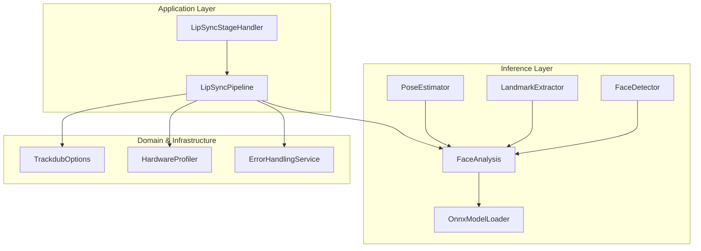
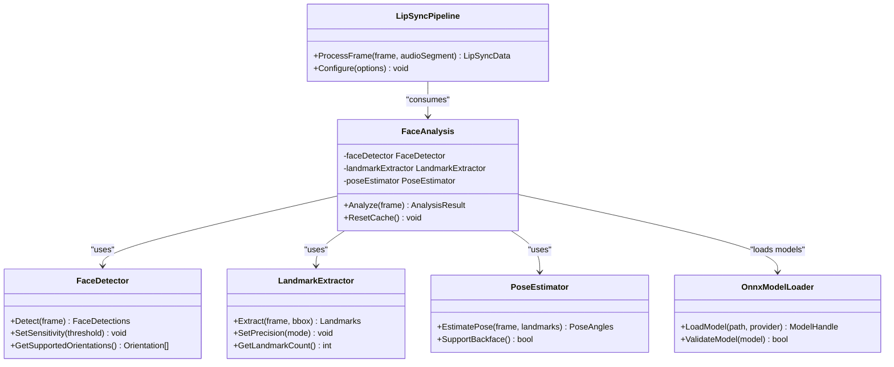
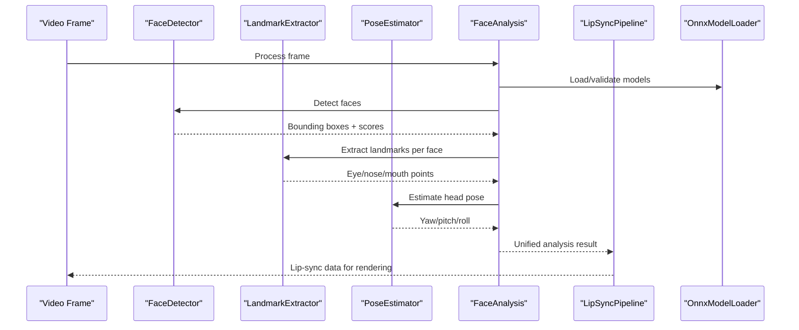
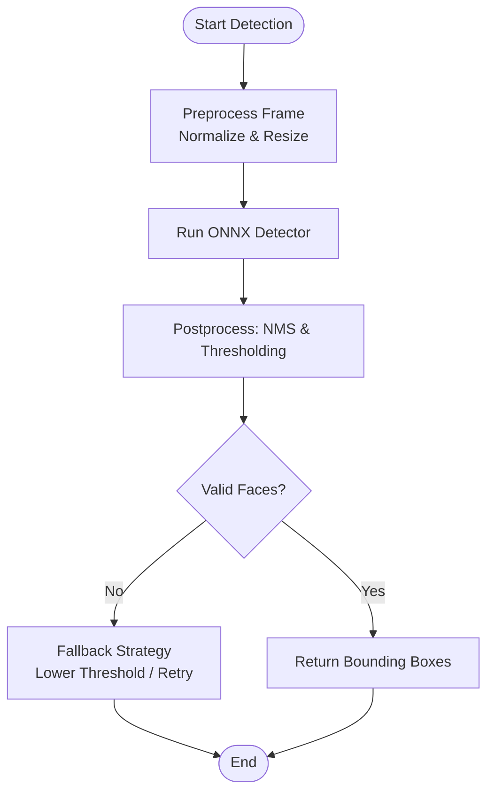
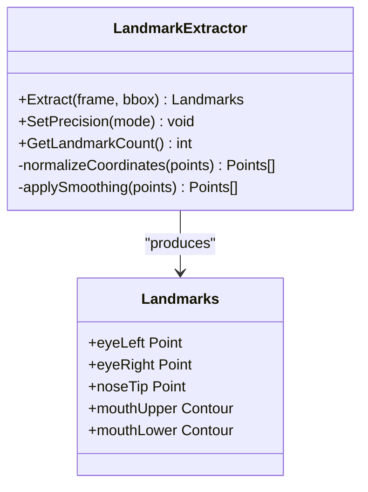
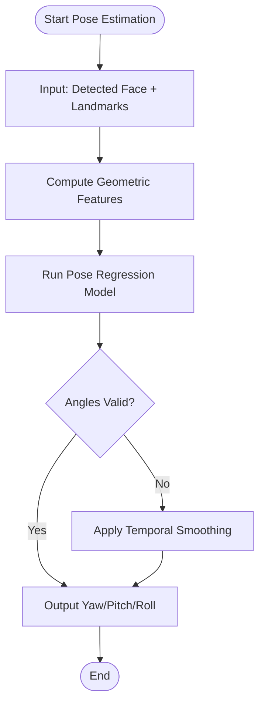
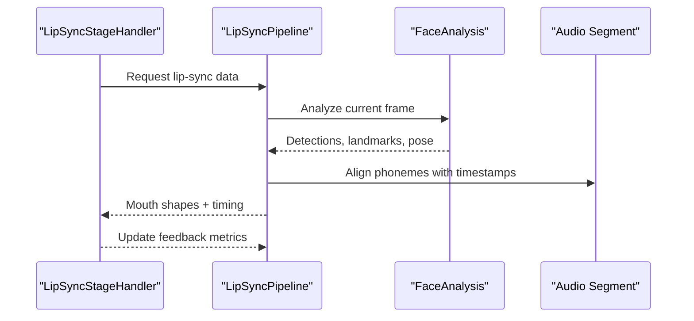
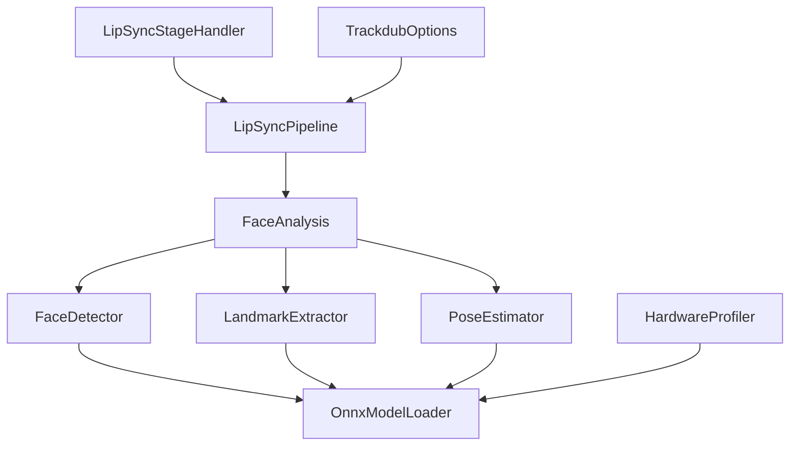

# Facial Analysis & Landmark Detection

<cite>
**Referenced Files in This Document**
- [FaceAnalysis.cs](file://src/Trackdub.Inference.Onnx/FaceAnalysis/FaceAnalysis.cs)
- [FaceDetector.cs](file://src/Trackdub.Inference.Onnx/FaceAnalysis/FaceDetector.cs)
- [LandmarkExtractor.cs](file://src/Trackdub.Inference.Onnx/FaceAnalysis/LandmarkExtractor.cs)
- [PoseEstimator.cs](file://src/Trackdub.Inference.Onnx/FaceAnalysis/PoseEstimator.cs)
- [OnnxModelLoader.cs](file://src/Trackdub.Inference.Onnx/Common/OnnxModelLoader.cs)
- [LipSyncPipeline.cs](file://src/Trackdub.Application/LipSync/LipSyncPipeline.cs)
- [LipSyncStageHandler.cs](file://src/Trackdub.Application/LipSync/LipSyncStageHandler.cs)
- [TrackdubOptions.cs](file://src/Trackdub.Sdk/TrackdubOptions.cs)
- [HardwareProfiler.cs](file://src/Trackdub.Domain/HardwareProfiler.cs)
- [ErrorHandlingService.cs](file://src/Trackdub.Infrastructure/Diagnostics/ErrorHandlingService.cs)
</cite>

## Table of Contents
1. [Introduction](#introduction)
2. [Project Structure](#project-structure)
3. [Core Components](#core-components)
4. [Architecture Overview](#architecture-overview)
5. [Detailed Component Analysis](#detailed-component-analysis)
6. [Dependency Analysis](#dependency-analysis)
7. [Performance Considerations](#performance-considerations)
8. [Troubleshooting Guide](#troubleshooting-guide)
9. [Conclusion](#conclusion)

## Introduction
This document explains Trackdub’s facial analysis and landmark detection system used to power lip-sync and expressive animation. It covers face detection algorithms, facial landmark identification (eyes, mouth contours), pose estimation, supported orientations, lighting robustness, accuracy considerations, configuration options for sensitivity and precision, integration with the lip-sync pipeline, error handling strategies, and optimization techniques across hardware platforms.

## Project Structure
The facial analysis subsystem is implemented under the ONNX inference layer and integrates with application-level lip-sync orchestration. Key directories and files include:
- Face detection, landmark extraction, and pose estimation modules
- ONNX model loading utilities
- Integration points with the lip-sync pipeline and stage handlers
- Configuration and hardware profiling utilities

**Diagram sources**
- [FaceAnalysis.cs](file://src/Trackdub.Inference.Onnx/FaceAnalysis/FaceAnalysis.cs)
- [FaceDetector.cs](file://src/Trackdub.Inference.Onnx/FaceAnalysis/FaceDetector.cs)
- [LandmarkExtractor.cs](file://src/Trackdub.Inference.Onnx/FaceAnalysis/LandmarkExtractor.cs)
- [PoseEstimator.cs](file://src/Trackdub.Inference.Onnx/FaceAnalysis/PoseEstimator.cs)
- [OnnxModelLoader.cs](file://src/Trackdub.Inference.Onnx/Common/OnnxModelLoader.cs)
- [LipSyncPipeline.cs](file://src/Trackdub.Application/LipSync/LipSyncPipeline.cs)
- [LipSyncStageHandler.cs](file://src/Trackdub.Application/LipSync/LipSyncStageHandler.cs)
- [TrackdubOptions.cs](file://src/Trackdub.Sdk/TrackdubOptions.cs)
- [HardwareProfiler.cs](file://src/Trackdub.Domain/HardwareProfiler.cs)
- [ErrorHandlingService.cs](file://src/Trackdub.Infrastructure/Diagnostics/ErrorHandlingService.cs)

**Section sources**
- [FaceAnalysis.cs](file://src/Trackdub.Inference.Onnx/FaceAnalysis/FaceAnalysis.cs)
- [FaceDetector.cs](file://src/Trackdub.Inference.Onnx/FaceAnalysis/FaceDetector.cs)
- [LandmarkExtractor.cs](file://src/Trackdub.Inference.Onnx/FaceAnalysis/LandmarkExtractor.cs)
- [PoseEstimator.cs](file://src/Trackdub.Inference.Onnx/FaceAnalysis/PoseEstimator.cs)
- [OnnxModelLoader.cs](file://src/Trackdub.Inference.Onnx/Common/OnnxModelLoader.cs)
- [LipSyncPipeline.cs](file://src/Trackdub.Application/LipSync/LipSyncPipeline.cs)
- [LipSyncStageHandler.cs](file://src/Trackdub.Application/LipSync/LipSyncStageHandler.cs)
- [TrackdubOptions.cs](file://src/Trackdub.Sdk/TrackdubOptions.cs)
- [HardwareProfiler.cs](file://src/Trackdub.Domain/HardwareProfiler.cs)
- [ErrorHandlingService.cs](file://src/Trackdub.Infrastructure/Diagnostics/ErrorHandlingService.cs)

## Core Components
- FaceDetector: Detects bounding boxes and confidence scores for faces in frames. Supports multiple backends via ONNX execution providers.
- LandmarkExtractor: Identifies facial landmarks including eye centers, eyebrows, nose tip, and mouth contour points. Outputs normalized coordinates suitable for downstream processing.
- PoseEstimator: Estimates head pose angles (yaw, pitch, roll) from detected faces and landmarks to support orientation-aware lip-sync.
- FaceAnalysis: Orchestrates detection, landmarking, and pose estimation; provides unified results and caching.
- OnnxModelLoader: Loads and initializes ONNX models with appropriate execution providers and runtime settings.
- LipSyncPipeline and LipSyncStageHandler: Consume facial analysis outputs to drive phoneme timing, mouth shape generation, and synchronization with audio.

Key responsibilities and interactions are illustrated below.

**Diagram sources**
- [FaceDetector.cs](file://src/Trackdub.Inference.Onnx/FaceAnalysis/FaceDetector.cs)
- [LandmarkExtractor.cs](file://src/Trackdub.Inference.Onnx/FaceAnalysis/LandmarkExtractor.cs)
- [PoseEstimator.cs](file://src/Trackdub.Inference.Onnx/FaceAnalysis/PoseEstimator.cs)
- [FaceAnalysis.cs](file://src/Trackdub.Inference.Onnx/FaceAnalysis/FaceAnalysis.cs)
- [OnnxModelLoader.cs](file://src/Trackdub.Inference.Onnx/Common/OnnxModelLoader.cs)
- [LipSyncPipeline.cs](file://src/Trackdub.Application/LipSync/LipSyncPipeline.cs)

**Section sources**
- [FaceDetector.cs](file://src/Trackdub.Inference.Onnx/FaceAnalysis/FaceDetector.cs)
- [LandmarkExtractor.cs](file://src/Trackdub.Inference.Onnx/FaceAnalysis/LandmarkExtractor.cs)
- [PoseEstimator.cs](file://src/Trackdub.Inference.Onnx/FaceAnalysis/PoseEstimator.cs)
- [FaceAnalysis.cs](file://src/Trackdub.Inference.Onnx/FaceAnalysis/FaceAnalysis.cs)
- [OnnxModelLoader.cs](file://src/Trackdub.Inference.Onnx/Common/OnnxModelLoader.cs)
- [LipSyncPipeline.cs](file://src/Trackdub.Application/LipSync/LipSyncPipeline.cs)

## Architecture Overview
The facial analysis pipeline processes video frames through a sequence of stages: detection, landmark extraction, pose estimation, and integration into the lip-sync pipeline. The architecture emphasizes modularity, hardware acceleration, and robust error handling.

**Diagram sources**
- [FaceAnalysis.cs](file://src/Trackdub.Inference.Onnx/FaceAnalysis/FaceAnalysis.cs)
- [FaceDetector.cs](file://src/Trackdub.Inference.Onnx/FaceAnalysis/FaceDetector.cs)
- [LandmarkExtractor.cs](file://src/Trackdub.Inference.Onnx/FaceAnalysis/LandmarkExtractor.cs)
- [PoseEstimator.cs](file://src/Trackdub.Inference.Onnx/FaceAnalysis/PoseEstimator.cs)
- [OnnxModelLoader.cs](file://src/Trackdub.Inference.Onnx/Common/OnnxModelLoader.cs)
- [LipSyncPipeline.cs](file://src/Trackdub.Application/LipSync/LipSyncPipeline.cs)

## Detailed Component Analysis

### Face Detection Algorithms
- Algorithm overview: Uses an ONNX-based detector optimized for speed and accuracy trade-offs. Supports configurable confidence thresholds and non-maximum suppression parameters.
- Supported orientations: Frontal and slight yaw/pitch variations; extreme rotations may require fallback strategies or preprocessing.
- Lighting handling: Includes normalization steps and adaptive thresholding to mitigate low-light conditions.

**Diagram sources**
- [FaceDetector.cs](file://src/Trackdub.Inference.Onnx/FaceAnalysis/FaceDetector.cs)
- [OnnxModelLoader.cs](file://src/Trackdub.Inference.Onnx/Common/OnnxModelLoader.cs)

**Section sources**
- [FaceDetector.cs](file://src/Trackdub.Inference.Onnx/FaceAnalysis/FaceDetector.cs)
- [OnnxModelLoader.cs](file://src/Trackdub.Inference.Onnx/Common/OnnxModelLoader.cs)

### Facial Landmark Identification
- Landmark set: Eyes (left/right), eyebrows, nose tip, mouth contour points (upper/lower lips).
- Precision modes: Standard vs high-precision depending on performance constraints.
- Coordinate system: Normalized coordinates relative to face bounding box for stability across scales.

**Diagram sources**
- [LandmarkExtractor.cs](file://src/Trackdub.Inference.Onnx/FaceAnalysis/LandmarkExtractor.cs)

**Section sources**
- [LandmarkExtractor.cs](file://src/Trackdub.Inference.Onnx/FaceAnalysis/LandmarkExtractor.cs)

### Pose Estimation Capabilities
- Output: Head pose angles (yaw, pitch, roll) derived from facial geometry and landmarks.
- Use cases: Orientation-aware lip-sync, gaze correction, and dynamic camera compensation.
- Robustness: Handles partial occlusions by weighting visible features.

**Diagram sources**
- [PoseEstimator.cs](file://src/Trackdub.Inference.Onnx/FaceAnalysis/PoseEstimator.cs)

**Section sources**
- [PoseEstimator.cs](file://src/Trackdub.Inference.Onnx/FaceAnalysis/PoseEstimator.cs)

### Integration with Lip-Sync Pipeline
- Inputs: Face detections, landmarks, and pose estimates feed into phoneme timing and mouth shape generation.
- Synchronization: Aligns visual mouth movements with audio segments using temporal cues.
- Feedback loop: Adjusts sensitivity and precision based on real-time performance metrics.

**Diagram sources**
- [LipSyncStageHandler.cs](file://src/Trackdub.Application/LipSync/LipSyncStageHandler.cs)
- [LipSyncPipeline.cs](file://src/Trackdub.Application/LipSync/LipSyncPipeline.cs)
- [FaceAnalysis.cs](file://src/Trackdub.Inference.Onnx/FaceAnalysis/FaceAnalysis.cs)

**Section sources**
- [LipSyncStageHandler.cs](file://src/Trackdub.Application/LipSync/LipSyncStageHandler.cs)
- [LipSyncPipeline.cs](file://src/Trackdub.Application/LipSync/LipSyncPipeline.cs)
- [FaceAnalysis.cs](file://src/Trackdub.Inference.Onnx/FaceAnalysis/FaceAnalysis.cs)

## Dependency Analysis
The facial analysis components depend on ONNX model loading and execution providers, while application-level components consume analysis results for lip-sync. Hardware profiling informs execution provider selection and performance tuning.

**Diagram sources**
- [FaceDetector.cs](file://src/Trackdub.Inference.Onnx/FaceAnalysis/FaceDetector.cs)
- [LandmarkExtractor.cs](file://src/Trackdub.Inference.Onnx/FaceAnalysis/LandmarkExtractor.cs)
- [PoseEstimator.cs](file://src/Trackdub.Inference.Onnx/FaceAnalysis/PoseEstimator.cs)
- [FaceAnalysis.cs](file://src/Trackdub.Inference.Onnx/FaceAnalysis/FaceAnalysis.cs)
- [OnnxModelLoader.cs](file://src/Trackdub.Inference.Onnx/Common/OnnxModelLoader.cs)
- [LipSyncPipeline.cs](file://src/Trackdub.Application/LipSync/LipSyncPipeline.cs)
- [LipSyncStageHandler.cs](file://src/Trackdub.Application/LipSync/LipSyncStageHandler.cs)
- [HardwareProfiler.cs](file://src/Trackdub.Domain/HardwareProfiler.cs)
- [TrackdubOptions.cs](file://src/Trackdub.Sdk/TrackdubOptions.cs)

**Section sources**
- [FaceDetector.cs](file://src/Trackdub.Inference.Onnx/FaceAnalysis/FaceDetector.cs)
- [LandmarkExtractor.cs](file://src/Trackdub.Inference.Onnx/FaceAnalysis/LandmarkExtractor.cs)
- [PoseEstimator.cs](file://src/Trackdub.Inference.Onnx/FaceAnalysis/PoseEstimator.cs)
- [FaceAnalysis.cs](file://src/Trackdub.Inference.Onnx/FaceAnalysis/FaceAnalysis.cs)
- [OnnxModelLoader.cs](file://src/Trackdub.Inference.Onnx/Common/OnnxModelLoader.cs)
- [LipSyncPipeline.cs](file://src/Trackdub.Application/LipSync/LipSyncPipeline.cs)
- [LipSyncStageHandler.cs](file://src/Trackdub.Application/LipSync/LipSyncStageHandler.cs)
- [HardwareProfiler.cs](file://src/Trackdub.Domain/HardwareProfiler.cs)
- [TrackdubOptions.cs](file://src/Trackdub.Sdk/TrackdubOptions.cs)

## Performance Considerations
- Execution providers: Select GPU-accelerated providers (e.g., CUDA, TensorRT) when available; fall back to CPU for compatibility.
- Model quantization: Use INT8 or FP16 variants where supported to reduce memory and improve throughput.
- Caching: Cache intermediate results (e.g., face bounding boxes) across frames to avoid redundant computation.
- Batch processing: Process multiple frames in batches when latency allows.
- Hardware profiling: Dynamically adjust precision and sensitivity based on measured performance.

[No sources needed since this section provides general guidance]

## Troubleshooting Guide
Common issues and resolutions:
- Poor lighting conditions: Increase detection sensitivity, apply histogram equalization, or switch to IR-friendly models if available.
- Obscured faces: Enable multi-face tracking and rely on temporal smoothing; consider fallback heuristics for missing landmarks.
- Model loading failures: Verify model paths, checksums, and execution provider availability; use diagnostic logs to identify missing dependencies.
- Performance degradation: Reduce landmark precision mode, lower batch size, or switch to CPU-only execution on constrained devices.
- Integration errors: Ensure consistent coordinate systems between detection and lip-sync; validate timestamp alignment.

Diagnostic tools:
- ErrorHandlingService: Centralized logging and exception categorization.
- HardwareProfiler: Real-time metrics for GPU/CPU utilization and memory usage.

**Section sources**
- [ErrorHandlingService.cs](file://src/Trackdub.Infrastructure/Diagnostics/ErrorHandlingService.cs)
- [HardwareProfiler.cs](file://src/Trackdub.Domain/HardwareProfiler.cs)

## Conclusion
Trackdub’s facial analysis and landmark detection system provides a modular, hardware-aware foundation for accurate lip-sync and expressive animation. By combining robust detection, precise landmark extraction, and pose estimation with flexible configuration and comprehensive error handling, it supports diverse environments and performance requirements. Continuous optimization and profiling ensure reliable operation across CPUs, GPUs, and specialized accelerators.

[No sources needed since this section summarizes without analyzing specific files]