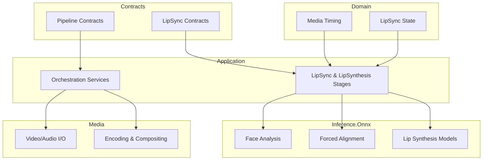
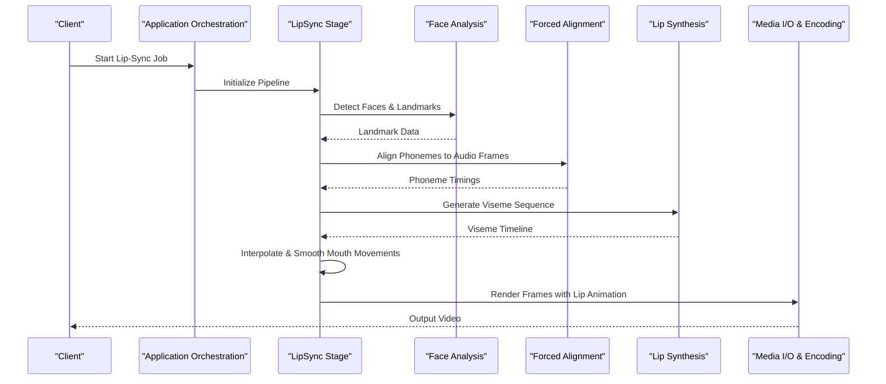
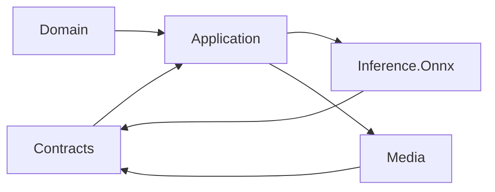

# Lip-Sync Technology

<cite>
**Referenced Files in This Document**
- [Trackdub.Application.csproj](file://src/Trackdub.Application/Trackdub.Application.csproj)
- [Trackdub.Contracts.csproj](file://src/Trackdub.Contracts/Trackdub.Contracts.csproj)
- [Trackdub.Domain.csproj](file://src/Trackdub.Domain/Trackdub.Domain.csproj)
- [Trackdub.Inference.Onnx.csproj](file://src/Trackdub.Inference.Onnx/Trackdub.Inference.Onnx.csproj)
- [Trackdub.Media.csproj](file://src/Trackdub.Media/Trackdub.Media.csproj)
- [LipSyncStageHandlerTests.cs](file://tests/Trackdub.Application.Tests/LipSyncStageHandlerTests.cs)
- [LipSynthesisExportRecompositionTests.cs](file://tests/Trackdub.Application.Tests/LipSynthesisExportRecompositionTests.cs)
- [LipSynthesisInventoryGateTests.cs](file://tests/Trackdub.Application.Tests/LipSynthesisInventoryGateTests.cs)
- [LipSynthesisSegmentUiStateBuilderTests.cs](file://tests/Trackdub.Application.Tests/LipSynthesisSegmentUiStateBuilderTests.cs)
- [PhonemeTimingPlannerTests.cs](file://tests/Trackdub.Application.Tests/PhonemeTimingPlannerTests.cs)
- [LipSyncStageHandlerTests.cs](file://tests/Trackdub.Application.Tests/LipSyncStageHandlerTests.cs)
</cite>

## Table of Contents
1. [Introduction](#introduction)
2. [Project Structure](#project-structure)
3. [Core Components](#core-components)
4. [Architecture Overview](#architecture-overview)
5. [Detailed Component Analysis](#detailed-component-analysis)
6. [Dependency Analysis](#dependency-analysis)
7. [Performance Considerations](#performance-considerations)
8. [Troubleshooting Guide](#troubleshooting-guide)
9. [Conclusion](#conclusion)
10. [Appendices](#appendices)

## Introduction
This document explains Trackdub’s lip-sync technology with a focus on facial landmark detection, frame-by-frame animation generation, and quality optimization. It covers the algorithms used for mouth movement prediction, phoneme-to-viseme mapping, and temporal synchronization across audio and video streams. It also documents face analysis tools, landmark accuracy considerations, pose estimation inputs, model configuration options, and performance tuning strategies. Guidance is provided for optimizing lip-sync quality under different face types, lighting conditions, and camera angles, along with troubleshooting guidance for sync accuracy issues, facial detection problems, and rendering artifacts. Finally, it addresses real-time processing and memory usage optimization for high-resolution video.

## Project Structure
The lip-sync system spans several layers:
- Contracts define interfaces and data models for lip-sync stages and synthesis outputs.
- Domain encapsulates core concepts such as media timing and lip-sync state.
- Application orchestrates pipeline stages including lip-sync and lip-synthesis.
- Inference.Onnx provides ONNX-based implementations for face analysis, forced alignment, and lip-synthesis components.
- Media handles video/audio I/O, encoding, and compositing.

**Diagram sources**
- [Trackdub.Contracts.csproj](file://src/Trackdub.Contracts/Trackdub.Contracts.csproj)
- [Trackdub.Domain.csproj](file://src/Trackdub.Domain/Trackdub.Domain.csproj)
- [Trackdub.Application.csproj](file://src/Trackdub.Application/Trackdub.Application.csproj)
- [Trackdub.Inference.Onnx.csproj](file://src/Trackdub.Inference.Onnx/Trackdub.Inference.Onnx.csproj)
- [Trackdub.Media.csproj](file://src/Trackdub.Media/Trackdub.Media.csproj)

**Section sources**
- [Trackdub.Application.csproj](file://src/Trackdub.Application/Trackdub.Application.csproj)
- [Trackdub.Contracts.csproj](file://src/Trackdub.Contracts/Trackdub.Contracts.csproj)
- [Trackdub.Domain.csproj](file://src/Trackdub.Domain/Trackdub.Domain.csproj)
- [Trackdub.Inference.Onnx.csproj](file://src/Trackdub.Inference.Onnx/Trackdub.Inference.Onnx.csproj)
- [Trackdub.Media.csproj](file://src/Trackdub.Media/Trackdub.Media.csproj)

## Core Components
- Face Analysis and Landmark Detection: Detects faces and extracts landmarks to drive mouth region tracking and viseme generation.
- Forced Alignment: Aligns phonemes to audio frames to establish precise timing for mouth movements.
- Phoneme-to-Viseme Mapping: Converts aligned phonemes into viseme sequences that represent mouth shapes over time.
- Temporal Synchronization: Ensures lip movements align with audio timing using frame-level interpolation and smoothing.
- Frame-by-Frame Animation: Generates per-frame mouth deformations or overlays based on viseme states and blending techniques.
- Video Compositing: Merges generated lip animations back into the original video stream with proper encoding settings.

Key implementation areas:
- Lip-sync stage orchestration and integration with inference providers.
- Lip-synthesis model execution and output recomposition.
- Media I/O and encoding pipelines for high-resolution video.

**Section sources**
- [LipSyncStageHandlerTests.cs](file://tests/Trackdub.Application.Tests/LipSyncStageHandlerTests.cs)
- [LipSynthesisExportRecompositionTests.cs](file://tests/Trackdub.Application.Tests/LipSynthesisExportRecompositionTests.cs)
- [LipSynthesisInventoryGateTests.cs](file://tests/Trackdub.Application.Tests/LipSynthesisInventoryGateTests.cs)
- [LipSynthesisSegmentUiStateBuilderTests.cs](file://tests/Trackdub.Application.Tests/LipSynthesisSegmentUiStateBuilderTests.cs)
- [PhonemeTimingPlannerTests.cs](file://tests/Trackdub.Application.Tests/PhonemeTimingPlannerTests.cs)

## Architecture Overview
The lip-sync pipeline integrates multiple subsystems:
- Input ingestion of video and audio assets.
- Face analysis to locate faces and extract landmarks.
- Forced alignment to map phonemes to audio frames.
- Viseme generation from phoneme sequences.
- Frame-by-frame animation synthesis with blending.
- Compositing and encoding to produce final output.

**Diagram sources**
- [Trackdub.Application.csproj](file://src/Trackdub.Application/Trackdub.Application.csproj)
- [Trackdub.Inference.Onnx.csproj](file://src/Trackdub.Inference.Onnx/Trackdub.Inference.Onnx.csproj)
- [Trackdub.Media.csproj](file://src/Trackdub.Media/Trackdub.Media.csproj)

## Detailed Component Analysis

### Face Analysis and Landmark Detection
- Purpose: Locate faces and extract facial landmarks to guide mouth movement synthesis.
- Inputs: Video frames, optional pre-segmented face regions.
- Outputs: Landmark coordinates, confidence scores, bounding boxes.
- Accuracy considerations: Lighting, occlusions, pose angles affect detection reliability; post-processing may include smoothing and outlier rejection.
- Pose estimation: Head pose can inform deformation constraints and prevent unnatural mouth shapes during extreme angles.

Optimization tips:
- Use adaptive thresholding for low-light scenes.
- Apply multi-scale detection for small faces.
- Cache results when possible to reduce redundant computation.

**Section sources**
- [Trackdub.Inference.Onnx.csproj](file://src/Trackdub.Inference.Onnx/Trackdub.Inference.Onnx.csproj)

### Forced Alignment and Phoneme Timing
- Purpose: Map phonemes to precise audio frames to ensure accurate lip timing.
- Inputs: Audio waveform, language-specific lexicon or acoustic model.
- Outputs: Phoneme start/end times, frame-level alignments.
- Algorithms: Dynamic time warping or neural alignment models; often integrated with ASR outputs.

Quality checks:
- Validate alignment continuity and avoid overlapping phonemes.
- Smooth transitions around boundaries to prevent jitter.

**Section sources**
- [PhonemeTimingPlannerTests.cs](file://tests/Trackdub.Application.Tests/PhonemeTimingPlannerTests.cs)

### Phoneme-to-Viseme Mapping
- Purpose: Convert phoneme sequences into viseme timelines representing mouth shapes.
- Inputs: Aligned phoneme timings, language mapping tables.
- Outputs: Viseme sequence with timestamps and intensity values.
- Techniques: Rule-based mappings, learned mappings, or hybrid approaches; may include context-aware smoothing.

Best practices:
- Normalize viseme intensities across speakers.
- Handle silent periods by interpolating to neutral mouth shape.

**Section sources**
- [LipSynthesisSegmentUiStateBuilderTests.cs](file://tests/Trackdub.Application.Tests/LipSynthesisSegmentUiStateBuilderTests.cs)

### Temporal Synchronization and Smoothing
- Purpose: Ensure lip movements are temporally synchronized with audio and visually smooth.
- Methods: Frame interpolation, spline smoothing, velocity limiting to avoid abrupt changes.
- Edge cases: Pauses, overlaps, and rapid phoneme transitions require careful handling.

Validation:
- Check phase alignment between viseme peaks and audio energy spikes.
- Monitor maximum displacement rates to prevent unrealistic motion.

**Section sources**
- [LipSyncStageHandlerTests.cs](file://tests/Trackdub.Application.Tests/LipSyncStageHandlerTests.cs)

### Frame-by-Frame Animation Generation
- Purpose: Produce per-frame mouth deformations or overlays based on viseme states.
- Techniques: Mesh deformation, blendshapes, or pixel-level warping; blending with original frames to preserve texture.
- Quality controls: Anti-aliasing, edge preservation, and color correction.

Rendering pipeline:
- Compute target mouth geometry per frame.
- Blend with source frames using alpha masks or displacement fields.
- Encode resulting frames with appropriate codecs.

**Section sources**
- [LipSynthesisExportRecompositionTests.cs](file://tests/Trackdub.Application.Tests/LipSynthesisExportRecompositionTests.cs)

### Video Compositing and Encoding
- Purpose: Merge lip animations into the original video and encode for distribution.
- Steps: Frame composition, color space management, bitrate control, and container formatting.
- Performance: Batch processing, GPU acceleration where available, and efficient memory management.

Quality settings:
- Adjust resolution, frame rate, and codec parameters based on target platform.
- Use lossless intermediate formats for editing, then transcode for delivery.

**Section sources**
- [Trackdub.Media.csproj](file://src/Trackdub.Media/Trackdub.Media.csproj)

## Dependency Analysis
The lip-sync system depends on contracts, domain models, application orchestration, inference providers, and media services. The following diagram shows key dependencies:

**Diagram sources**
- [Trackdub.Contracts.csproj](file://src/Trackdub.Contracts/Trackdub.Contracts.csproj)
- [Trackdub.Domain.csproj](file://src/Trackdub.Domain/Trackdub.Domain.csproj)
- [Trackdub.Application.csproj](file://src/Trackdub.Application/Trackdub.Application.csproj)
- [Trackdub.Inference.Onnx.csproj](file://src/Trackdub.Inference.Onnx/Trackdub.Inference.Onnx.csproj)
- [Trackdub.Media.csproj](file://src/Trackdub.Media/Trackdub.Media.csproj)

**Section sources**
- [Trackdub.Contracts.csproj](file://src/Trackdub.Contracts/Trackdub.Contracts.csproj)
- [Trackdub.Domain.csproj](file://src/Trackdub.Domain/Trackdub.Domain.csproj)
- [Trackdub.Application.csproj](file://src/Trackdub.Application/Trackdub.Application.csproj)
- [Trackdub.Inference.Onnx.csproj](file://src/Trackdub.Inference.Onnx/Trackdub.Inference.Onnx.csproj)
- [Trackdub.Media.csproj](file://src/Trackdub.Media/Trackdub.Media.csproj)

## Performance Considerations
- Real-time processing:
  - Prefer GPU-accelerated inference where supported.
  - Use streaming pipelines to minimize latency.
  - Pre-warm models and allocate buffers ahead of time.
- Memory usage:
  - Reuse frame buffers and avoid unnecessary allocations.
  - Process videos in chunks for high-resolution content.
  - Monitor peak memory and adjust batch sizes accordingly.
- Quality vs. speed trade-offs:
  - Lower resolution preprocessing for face detection.
  - Adaptive smoothing parameters based on compute budget.
  - Select lighter models for constrained environments.

[No sources needed since this section provides general guidance]

## Troubleshooting Guide
Common issues and resolutions:
- Sync accuracy problems:
  - Verify forced alignment quality and re-run with adjusted thresholds.
  - Inspect phoneme-to-viseme mapping tables for language-specific errors.
  - Check temporal smoothing parameters to avoid lag or jitter.
- Facial detection failures:
  - Improve lighting or reduce motion blur.
  - Increase detection sensitivity for small or partially occluded faces.
  - Validate pose estimation and apply constraints to prevent invalid landmarks.
- Rendering artifacts:
  - Adjust blending weights and anti-aliasing settings.
  - Ensure consistent color spaces and gamma correction.
  - Review encoder settings for banding or compression artifacts.

Diagnostic steps:
- Log landmark confidence and alignment scores.
- Visualize viseme timelines against audio waveforms.
- Export intermediate frames for inspection.

**Section sources**
- [LipSyncStageHandlerTests.cs](file://tests/Trackdub.Application.Tests/LipSyncStageHandlerTests.cs)
- [LipSynthesisExportRecompositionTests.cs](file://tests/Trackdub.Application.Tests/LipSynthesisExportRecompositionTests.cs)
- [LipSynthesisInventoryGateTests.cs](file://tests/Trackdub.Application.Tests/LipSynthesisInventoryGateTests.cs)
- [LipSynthesisSegmentUiStateBuilderTests.cs](file://tests/Trackdub.Application.Tests/LipSynthesisSegmentUiStateBuilderTests.cs)
- [PhonemeTimingPlannerTests.cs](file://tests/Trackdub.Application.Tests/PhonemeTimingPlannerTests.cs)

## Conclusion
Trackdub’s lip-sync technology integrates face analysis, forced alignment, phoneme-to-viseme mapping, and frame-by-frame animation to deliver accurate and natural-looking lip movements. By carefully configuring models, optimizing performance, and addressing common issues, users can achieve high-quality results across diverse conditions. Continuous validation and tuning are essential to maintain sync accuracy and visual fidelity.

[No sources needed since this section summarizes without analyzing specific files]

## Appendices
- Model configuration references: Consult project-specific configuration files for lip-sync and lip-synthesis model parameters.
- Performance tuning guides: Refer to hardware profiling and runtime optimization documentation within the repository.
- API references: Explore contract definitions for programmatic access to lip-sync stages and synthesis outputs.

[No sources needed since this section provides general guidance]