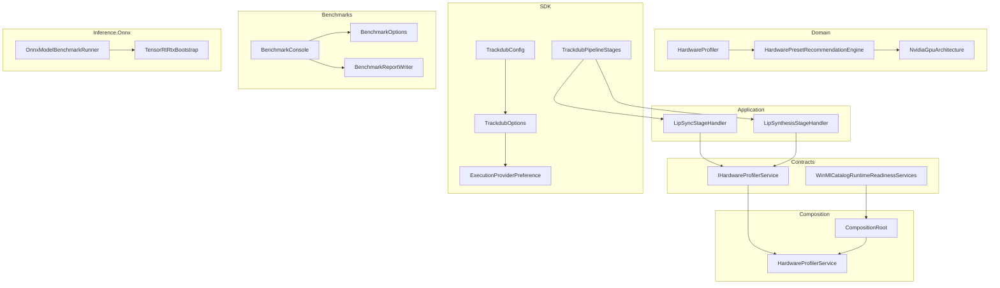
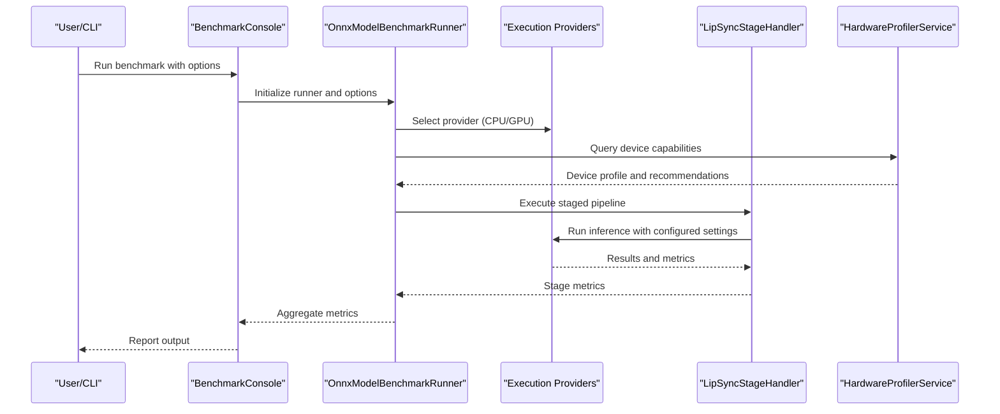
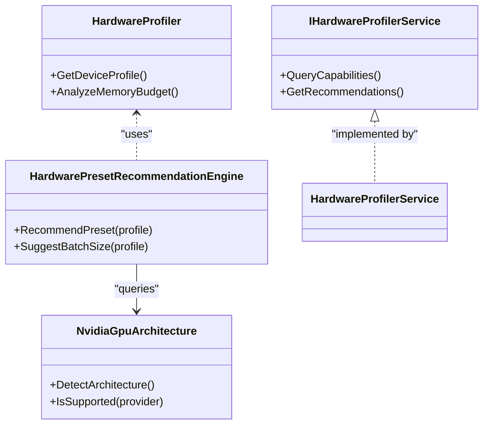
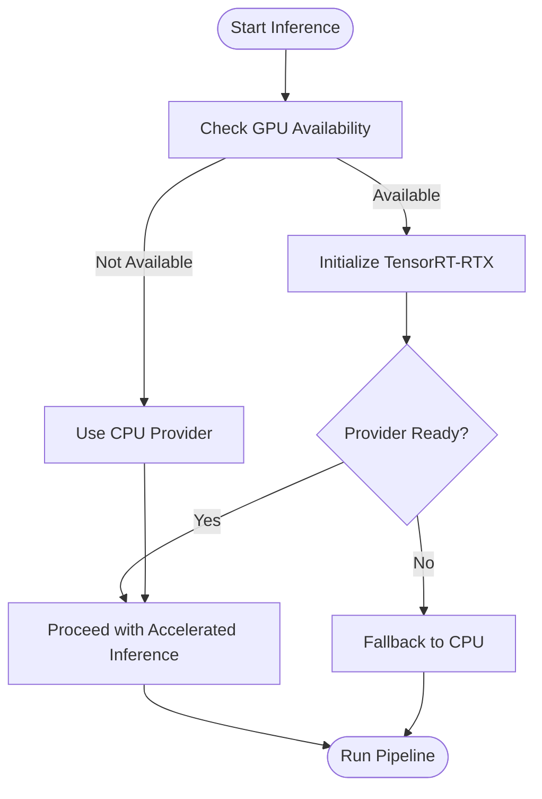
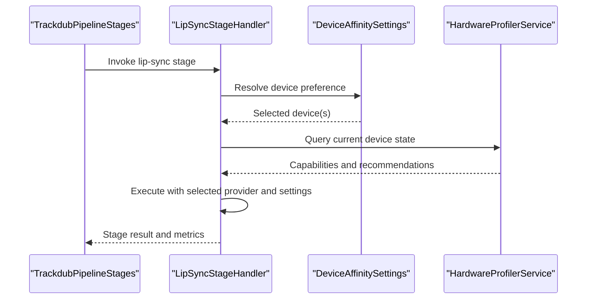
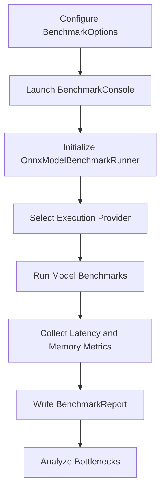
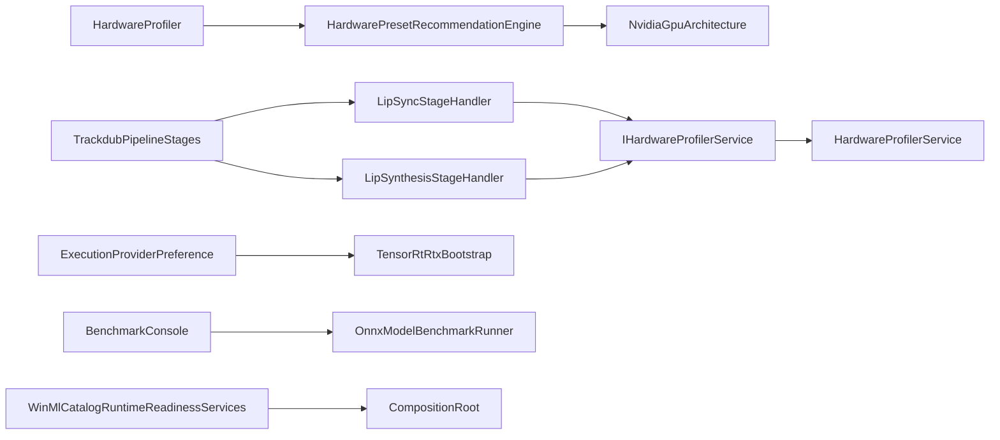

# Performance Tuning

<cite>
**Referenced Files in This Document**
- [Trackdub.Domain.csproj](file://src/Trackdub.Domain/Trackdub.Domain.csproj)
- [HardwareProfiler.cs](file://src/Trackdub.Domain/HardwareProfiler.cs)
- [HardwarePresetRecommendationEngine.cs](file://src/Trackdub.Domain/HardwarePresetRecommendationEngine.cs)
- [NvidiaGpuArchitecture.cs](file://src/Trackdub.Domain/NvidiaGpuArchitecture.cs)
- [IHardwareProfilerService.cs](file://src/Trackdub.Contracts/IHardwareProfilerService.cs)
- [CompositionRoot.cs](file://src/Trackdub.Composition/CompositionRoot.cs)
- [HardwareProfilerService.cs](file://src/Trackdub.Composition/HardwareProfiler/HardwareProfilerService.cs)
- [DeviceAffinitySettings.cs](file://src/Trackdub.Application/Services/DeviceAffinitySettings.cs)
- [LipSyncStageHandler.cs](file://src/Trackdub.Application/Dubbing/LipSyncStageHandler.cs)
- [LipSynthesisStageHandler.cs](file://src/Trackdub.Application/Dubbing/LipSynthesisStageHandler.cs)
- [TrackdubPipelineStages.cs](file://src/Trackdub.Sdk/TrackdubPipelineStages.cs)
- [TrackdubOptions.cs](file://src/Trackdub.Sdk/TrackdubOptions.cs)
- [TrackdubConfig.cs](file://src/Trackdub.Sdk/TrackdubConfig.cs)
- [ExecutionProviderPreference.cs](file://src/Trackdub.Sdk/ExecutionProviderPreference.cs)
- [BenchmarkConsole.cs](file://src/Trackdub.Benchmarks/BenchmarkConsole.cs)
- [BenchmarkOptions.cs](file://src/Trackdub.Benchmarks/BenchmarkOptions.cs)
- [BenchmarkReportWriter.cs](file://src/Trackdub.Benchmarks/BenchmarkReportWriter.cs)
- [OnnxModelBenchmarkRunner.cs](file://src/Trackdub.Inference.Onnx/OnnxModelBenchmarkRunner.cs)
- [TensorRtRtxBootstrap.cs](file://src/Trackdub.Inference.Onnx/TensorRtRtx/TensorRtRtxBootstrap.cs)
- [WinMlCatalogRuntimeReadinessServices.cs](file://src/Trackdub.Contracts/WinMlCatalogRuntimeReadinessServices.cs)
- [ADR-0009-gpu-memory-budget-planner.md](file://docs/decisions/ADR-0009-gpu-memory-budget-planner.md)
- [profiling-report.md](file://docs/reference/profiling-report.md)
- [windows-ml-phase-3-device-policies.md](file://docs/reference/windows-ml-phase-3-device-policies.md)
</cite>

## Table of Contents
1. [Introduction](#introduction)
2. [Project Structure](#project-structure)
3. [Core Components](#core-components)
4. [Architecture Overview](#architecture-overview)
5. [Detailed Component Analysis](#detailed-component-analysis)
6. [Dependency Analysis](#dependency-analysis)
7. [Performance Considerations](#performance-considerations)
8. [Troubleshooting Guide](#troubleshooting-guide)
9. [Conclusion](#conclusion)
10. [Appendices](#appendices)

## Introduction
This document provides a comprehensive guide to performance tuning for lip-sync processing in Trackdub. It covers hardware profiling, automatic resource allocation, and performance monitoring tools. It also documents optimization strategies for CPU vs GPU processing, memory management, and batch processing techniques. Configuration options for performance-critical settings such as model quantization, inference acceleration, and parallel processing are detailed. Benchmarking tools, metrics collection, and bottleneck identification approaches are included, along with practical examples for different hardware configurations, cloud deployment optimization, and mobile device constraints. Finally, common performance issues like memory leaks, slow inference times, and GPU utilization problems are addressed with actionable solutions.

## Project Structure
Trackdub organizes performance-related capabilities across several layers:
- Domain layer defines hardware profiling and preset recommendation logic.
- Contracts define interfaces for hardware profiling services and readiness checks.
- Composition wires up runtime providers and services.
- Application layer orchestrates stages including lip-sync and lip synthesis.
- SDK exposes configuration and execution provider preferences.
- Benchmarks provide CLI-driven benchmarking and reporting.
- Inference Onnx layer integrates execution providers (e.g., TensorRT-RTX, Windows ML).

**Diagram sources**
- [HardwareProfiler.cs](file://src/Trackdub.Domain/HardwareProfiler.cs)
- [HardwarePresetRecommendationEngine.cs](file://src/Trackdub.Domain/HardwarePresetRecommendationEngine.cs)
- [NvidiaGpuArchitecture.cs](file://src/Trackdub.Domain/NvidiaGpuArchitecture.cs)
- [IHardwareProfilerService.cs](file://src/Trackdub.Contracts/IHardwareProfilerService.cs)
- [CompositionRoot.cs](file://src/Trackdub.Composition/CompositionRoot.cs)
- [HardwareProfilerService.cs](file://src/Trackdub.Composition/HardwareProfiler/HardwareProfilerService.cs)
- [LipSyncStageHandler.cs](file://src/Trackdub.Application/Dubbing/LipSyncStageHandler.cs)
- [LipSynthesisStageHandler.cs](file://src/Trackdub.Application/Dubbing/LipSynthesisStageHandler.cs)
- [TrackdubPipelineStages.cs](file://src/Trackdub.Sdk/TrackdubPipelineStages.cs)
- [TrackdubOptions.cs](file://src/Trackdub.Sdk/TrackdubOptions.cs)
- [TrackdubConfig.cs](file://src/Trackdub.Sdk/TrackdubConfig.cs)
- [ExecutionProviderPreference.cs](file://src/Trackdub.Sdk/ExecutionProviderPreference.cs)
- [BenchmarkConsole.cs](file://src/Trackdub.Benchmarks/BenchmarkConsole.cs)
- [BenchmarkOptions.cs](file://src/Trackdub.Benchmarks/BenchmarkOptions.cs)
- [BenchmarkReportWriter.cs](file://src/Trackdub.Benchmarks/BenchmarkReportWriter.cs)
- [OnnxModelBenchmarkRunner.cs](file://src/Trackdub.Inference.Onnx/OnnxModelBenchmarkRunner.cs)
- [TensorRtRtxBootstrap.cs](file://src/Trackdub.Inference.Onnx/TensorRtRtx/TensorRtRtxBootstrap.cs)
- [WinMlCatalogRuntimeReadinessServices.cs](file://src/Trackdub.Contracts/WinMlCatalogRuntimeReadinessServices.cs)

**Section sources**
- [Trackdub.Domain.csproj](file://src/Trackdub.Domain/Trackdub.Domain.csproj)

## Core Components
- Hardware Profiler: Captures device capabilities and recommends presets based on architecture and available resources.
- Hardware Preset Recommendation Engine: Maps detected hardware characteristics to optimal inference settings.
- Execution Provider Preferences: Configure CPU/GPU selection, batching, and acceleration flags.
- Lip Sync Stage Handler: Orchestrates lip-sync processing with awareness of device affinity and resource limits.
- Benchmark Console and Runner: Execute benchmarks, collect metrics, and write reports for analysis.

Key responsibilities:
- Detect GPU/CPU capabilities and memory budgets.
- Select appropriate execution providers and model variants.
- Provide telemetry and metrics for inference latency, throughput, and memory usage.
- Enable batch processing and parallelism controls.

**Section sources**
- [HardwareProfiler.cs](file://src/Trackdub.Domain/HardwareProfiler.cs)
- [HardwarePresetRecommendationEngine.cs](file://src/Trackdub.Domain/HardwarePresetRecommendationEngine.cs)
- [NvidiaGpuArchitecture.cs](file://src/Trackdub.Domain/NvidiaGpuArchitecture.cs)
- [IHardwareProfilerService.cs](file://src/Trackdub.Contracts/IHardwareProfilerService.cs)
- [ExecutionProviderPreference.cs](file://src/Trackdub.Sdk/ExecutionProviderPreference.cs)
- [LipSyncStageHandler.cs](file://src/Trackdub.Application/Dubbing/LipSyncStageHandler.cs)
- [BenchmarkConsole.cs](file://src/Trackdub.Benchmarks/BenchmarkConsole.cs)
- [OnnxModelBenchmarkRunner.cs](file://src/Trackdub.Inference.Onnx/OnnxModelBenchmarkRunner.cs)

## Architecture Overview
The performance tuning architecture integrates hardware profiling, execution provider selection, stage orchestration, and benchmarking:

**Diagram sources**
- [BenchmarkConsole.cs](file://src/Trackdub.Benchmarks/BenchmarkConsole.cs)
- [OnnxModelBenchmarkRunner.cs](file://src/Trackdub.Inference.Onnx/OnnxModelBenchmarkRunner.cs)
- [LipSyncStageHandler.cs](file://src/Trackdub.Application/Dubbing/LipSyncStageHandler.cs)
- [HardwareProfilerService.cs](file://src/Trackdub.Composition/HardwareProfiler/HardwareProfilerService.cs)

## Detailed Component Analysis

### Hardware Profiling and Automatic Resource Allocation
- HardwareProfiler captures device details and computes resource profiles.
- HardwarePresetRecommendationEngine maps profiles to presets optimizing for latency or throughput.
- NvidiaGpuArchitecture identifies GPU architecture to tailor execution provider settings.
- IHardwareProfilerService abstracts profiling calls used by stages and runners.

Optimization implications:
- Use GPU when available and memory budget allows; otherwise fall back to CPU.
- Adjust batch size and precision based on detected capabilities.
- Apply quantization where supported to reduce memory footprint and improve speed.

**Diagram sources**
- [HardwareProfiler.cs](file://src/Trackdub.Domain/HardwareProfiler.cs)
- [HardwarePresetRecommendationEngine.cs](file://src/Trackdub.Domain/HardwarePresetRecommendationEngine.cs)
- [NvidiaGpuArchitecture.cs](file://src/Trackdub.Domain/NvidiaGpuArchitecture.cs)
- [IHardwareProfilerService.cs](file://src/Trackdub.Contracts/IHardwareProfilerService.cs)

**Section sources**
- [HardwareProfiler.cs](file://src/Trackdub.Domain/HardwareProfiler.cs)
- [HardwarePresetRecommendationEngine.cs](file://src/Trackdub.Domain/HardwarePresetRecommendationEngine.cs)
- [NvidiaGpuArchitecture.cs](file://src/Trackdub.Domain/NvidiaGpuArchitecture.cs)
- [IHardwareProfilerService.cs](file://src/Trackdub.Contracts/IHardwareProfilerService.cs)

### Execution Provider Selection and Acceleration
- ExecutionProviderPreference configures provider choice and behavior.
- TensorRtRtxBootstrap initializes NVIDIA TensorRT-RTX provider for accelerated inference.
- WinMlCatalogRuntimeReadinessServices ensures Windows ML catalog availability and readiness.

Best practices:
- Prefer TensorRT-RTX on NVIDIA GPUs for best latency.
- Fall back to CPU if GPU memory is constrained or provider initialization fails.
- Validate readiness before running heavy workloads.

**Diagram sources**
- [ExecutionProviderPreference.cs](file://src/Trackdub.Sdk/ExecutionProviderPreference.cs)
- [TensorRtRtxBootstrap.cs](file://src/Trackdub.Inference.Onnx/TensorRtRtx/TensorRtRtxBootstrap.cs)
- [WinMlCatalogRuntimeReadinessServices.cs](file://src/Trackdub.Contracts/WinMlCatalogRuntimeReadinessServices.cs)

**Section sources**
- [ExecutionProviderPreference.cs](file://src/Trackdub.Sdk/ExecutionProviderPreference.cs)
- [TensorRtRtxBootstrap.cs](file://src/Trackdub.Inference.Onnx/TensorRtRtx/TensorRtRtxBootstrap.cs)
- [WinMlCatalogRuntimeReadinessServices.cs](file://src/Trackdub.Contracts/WinMlCatalogRuntimeReadinessServices.cs)

### Lip-Sync Stage Orchestration and Device Affinity
- LipSyncStageHandler coordinates lip-sync tasks, leveraging device affinity settings.
- DeviceAffinitySettings controls which devices (CPU/GPU) are preferred for specific stages.
- TrackdubPipelineStages defines the sequence and dependencies of processing stages.

Tuning tips:
- Pin lip-sync to GPU when feasible to reduce latency.
- Limit parallelism to avoid contention with other processes.
- Monitor memory pressure and adjust batch sizes dynamically.

**Diagram sources**
- [LipSyncStageHandler.cs](file://src/Trackdub.Application/Dubbing/LipSyncStageHandler.cs)
- [DeviceAffinitySettings.cs](file://src/Trackdub.Application/Services/DeviceAffinitySettings.cs)
- [TrackdubPipelineStages.cs](file://src/Trackdub.Sdk/TrackdubPipelineStages.cs)
- [HardwareProfilerService.cs](file://src/Trackdub.Composition/HardwareProfiler/HardwareProfilerService.cs)

**Section sources**
- [LipSyncStageHandler.cs](file://src/Trackdub.Application/Dubbing/LipSyncStageHandler.cs)
- [DeviceAffinitySettings.cs](file://src/Trackdub.Application/Services/DeviceAffinitySettings.cs)
- [TrackdubPipelineStages.cs](file://src/Trackdub.Sdk/TrackdubPipelineStages.cs)

### Benchmarking Tools and Metrics Collection
- BenchmarkConsole drives benchmark runs with configurable options.
- BenchmarkOptions specify scenarios, providers, and measurement parameters.
- BenchmarkReportWriter outputs structured reports for analysis.
- OnnxModelBenchmarkRunner executes model-level benchmarks and aggregates metrics.

Metrics to track:
- Inference latency (p50, p95, p99)
- Throughput (frames/sec or segments/sec)
- Memory usage (peak and average)
- GPU utilization and temperature (where available)

**Diagram sources**
- [BenchmarkConsole.cs](file://src/Trackdub.Benchmarks/BenchmarkConsole.cs)
- [BenchmarkOptions.cs](file://src/Trackdub.Benchmarks/BenchmarkOptions.cs)
- [BenchmarkReportWriter.cs](file://src/Trackdub.Benchmarks/BenchmarkReportWriter.cs)
- [OnnxModelBenchmarkRunner.cs](file://src/Trackdub.Inference.Onnx/OnnxModelBenchmarkRunner.cs)

**Section sources**
- [BenchmarkConsole.cs](file://src/Trackdub.Benchmarks/BenchmarkConsole.cs)
- [BenchmarkOptions.cs](file://src/Trackdub.Benchmarks/BenchmarkOptions.cs)
- [BenchmarkReportWriter.cs](file://src/Trackdub.Benchmarks/BenchmarkReportWriter.cs)
- [OnnxModelBenchmarkRunner.cs](file://src/Trackdub.Inference.Onnx/OnnxModelBenchmarkRunner.cs)

### Configuration Options for Performance-Critical Settings
- TrackdubOptions and TrackdubConfig expose settings for execution providers, batching, and parallelism.
- ExecutionProviderPreference selects CPU/GPU and tuning flags.
- DeviceAffinitySettings pins stages to specific devices.

Recommended settings:
- Enable GPU acceleration when memory budget permits.
- Use quantized models for reduced memory and faster inference.
- Tune batch size based on target latency and throughput goals.
- Limit parallel workers to avoid CPU/GPU contention.

**Section sources**
- [TrackdubOptions.cs](file://src/Trackdub.Sdk/TrackdubOptions.cs)
- [TrackdubConfig.cs](file://src/Trackdub.Sdk/TrackdubConfig.cs)
- [ExecutionProviderPreference.cs](file://src/Trackdub.Sdk/ExecutionProviderPreference.cs)
- [DeviceAffinitySettings.cs](file://src/Trackdub.Application/Services/DeviceAffinitySettings.cs)

## Dependency Analysis
The following diagram shows key dependencies among components involved in performance tuning:

**Diagram sources**
- [HardwareProfiler.cs](file://src/Trackdub.Domain/HardwareProfiler.cs)
- [HardwarePresetRecommendationEngine.cs](file://src/Trackdub.Domain/HardwarePresetRecommendationEngine.cs)
- [NvidiaGpuArchitecture.cs](file://src/Trackdub.Domain/NvidiaGpuArchitecture.cs)
- [IHardwareProfilerService.cs](file://src/Trackdub.Contracts/IHardwareProfilerService.cs)
- [HardwareProfilerService.cs](file://src/Trackdub.Composition/HardwareProfiler/HardwareProfilerService.cs)
- [LipSyncStageHandler.cs](file://src/Trackdub.Application/Dubbing/LipSyncStageHandler.cs)
- [LipSynthesisStageHandler.cs](file://src/Trackdub.Application/Dubbing/LipSynthesisStageHandler.cs)
- [TrackdubPipelineStages.cs](file://src/Trackdub.Sdk/TrackdubPipelineStages.cs)
- [ExecutionProviderPreference.cs](file://src/Trackdub.Sdk/ExecutionProviderPreference.cs)
- [TensorRtRtxBootstrap.cs](file://src/Trackdub.Inference.Onnx/TensorRtRtx/TensorRtRtxBootstrap.cs)
- [BenchmarkConsole.cs](file://src/Trackdub.Benchmarks/BenchmarkConsole.cs)
- [OnnxModelBenchmarkRunner.cs](file://src/Trackdub.Inference.Onnx/OnnxModelBenchmarkRunner.cs)
- [WinMlCatalogRuntimeReadinessServices.cs](file://src/Trackdub.Contracts/WinMlCatalogRuntimeReadinessServices.cs)
- [CompositionRoot.cs](file://src/Trackdub.Composition/CompositionRoot.cs)

**Section sources**
- [CompositionRoot.cs](file://src/Trackdub.Composition/CompositionRoot.cs)

## Performance Considerations
- CPU vs GPU Processing:
  - Use GPU for lower latency when memory and driver support allow.
  - Fall back to CPU for compatibility or when GPU memory is insufficient.
- Memory Management:
  - Monitor peak memory usage and set budgets to prevent OOM.
  - Use quantized models and smaller batch sizes under memory pressure.
- Batch Processing Techniques:
  - Increase batch size to improve throughput at the cost of latency.
  - Implement dynamic batching based on workload patterns.
- Parallel Processing:
  - Limit concurrent workers to avoid contention with system processes.
  - Pin stages to dedicated devices using device affinity settings.
- Model Quantization and Inference Acceleration:
  - Prefer quantized ONNX models for reduced memory and faster execution.
  - Enable provider-specific optimizations (e.g., TensorRT-RTX FP16).
- Cloud Deployment Optimization:
  - Right-size instances with adequate GPU memory and CPU cores.
  - Pre-warm providers and cache models to reduce cold start latency.
- Mobile Device Constraints:
  - Use CPU-only paths or lightweight GPU accelerators.
  - Reduce batch size and model complexity to meet thermal and power limits.

[No sources needed since this section provides general guidance]

## Troubleshooting Guide
Common issues and solutions:
- Memory Leaks:
  - Ensure proper disposal of inference sessions and buffers.
  - Monitor memory growth over time and reset providers if necessary.
- Slow Inference Times:
  - Verify correct execution provider selection and warm-up.
  - Profile per-stage latency and identify bottlenecks.
- GPU Utilization Problems:
  - Check driver versions and provider readiness.
  - Adjust batch size and parallelism to match GPU capacity.
- Provider Initialization Failures:
  - Validate environment variables and dependencies.
  - Fall back gracefully to CPU when GPU provider is unavailable.

Practical steps:
- Run benchmarks to establish baseline metrics.
- Use profiling reports to pinpoint hotspots.
- Adjust configuration iteratively and re-measure.

**Section sources**
- [profiling-report.md](file://docs/reference/profiling-report.md)
- [windows-ml-phase-3-device-policies.md](file://docs/reference/windows-ml-phase-3-device-policies.md)
- [ADR-0009-gpu-memory-budget-planner.md](file://docs/decisions/ADR-0009-gpu-memory-budget-planner.md)

## Conclusion
Effective performance tuning for lip-sync processing in Trackdub requires a combination of accurate hardware profiling, intelligent execution provider selection, and careful configuration of batching and parallelism. Leveraging benchmarking tools and metrics enables continuous optimization tailored to specific hardware environments. By applying the strategies outlined here—quantization, GPU acceleration, memory budgeting, and dynamic batching—you can achieve responsive and scalable lip-sync performance across desktop, cloud, and mobile deployments.

[No sources needed since this section summarizes without analyzing specific files]

## Appendices
- Practical Examples:
  - Desktop with NVIDIA GPU: Enable TensorRT-RTX, use FP16 quantization, set moderate batch size.
  - Server with multiple GPUs: Distribute workloads across GPUs, increase batch size, monitor utilization.
  - Mobile device: Use CPU path, minimize batch size, prefer lightweight models.
- Additional References:
  - ADR-0009-gpu-memory-budget-planner.md for memory budgeting policies.
  - windows-ml-phase-3-device-policies.md for Windows ML device policies.
  - profiling-report.md for profiling report formats and interpretation.

[No sources needed since this section provides general guidance]