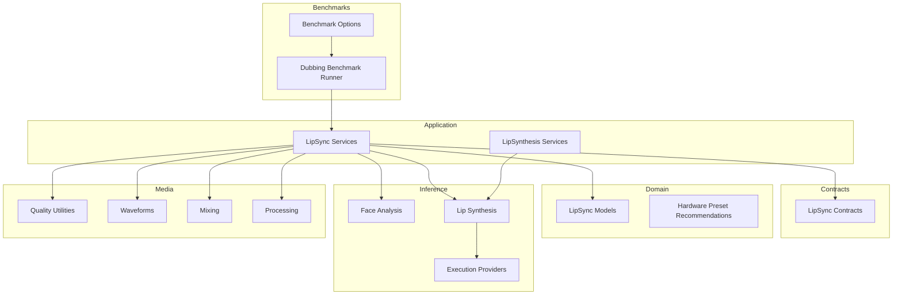
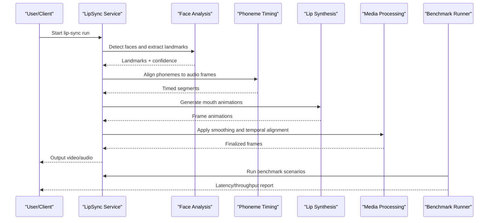
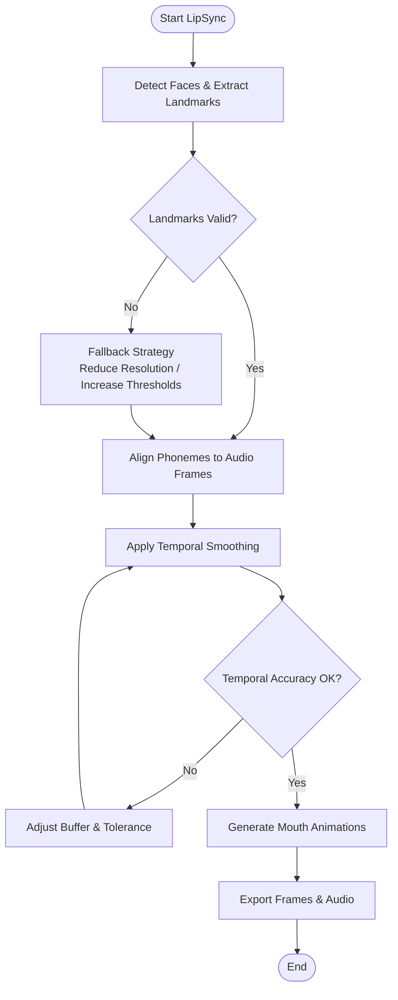
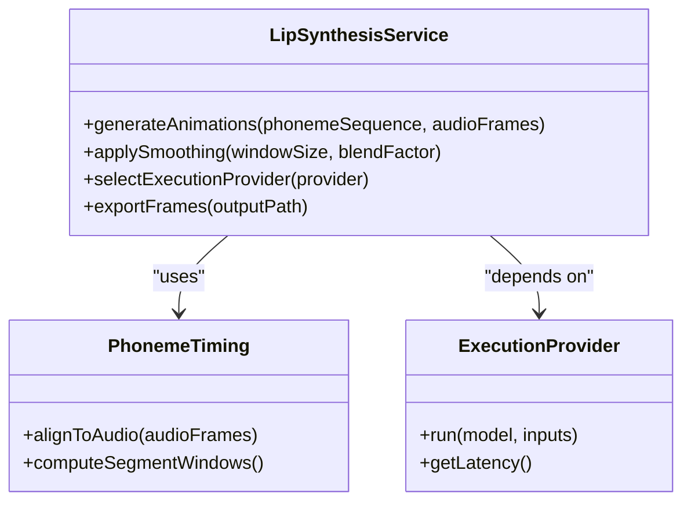
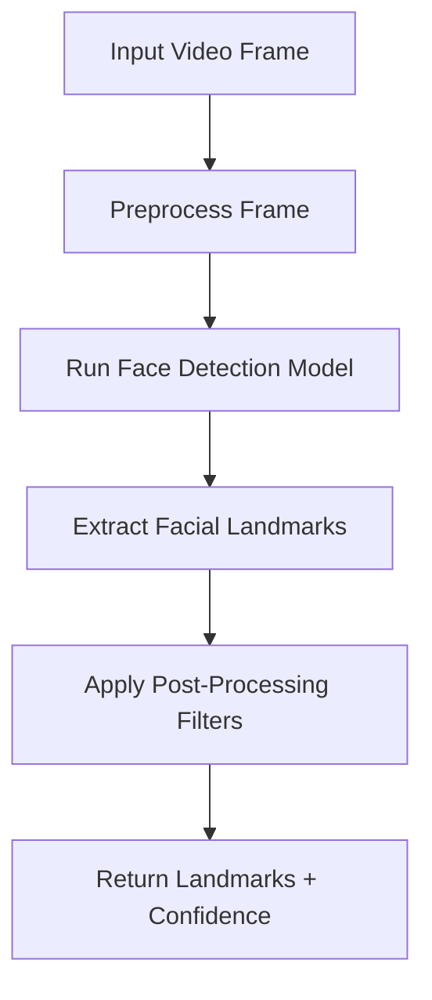
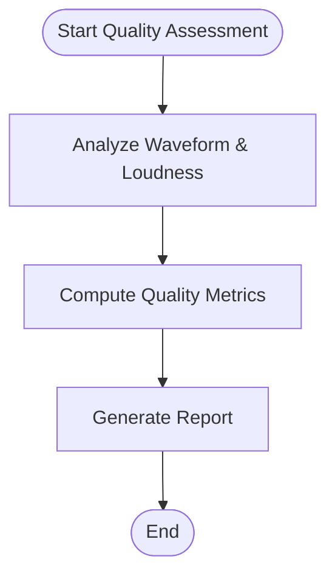
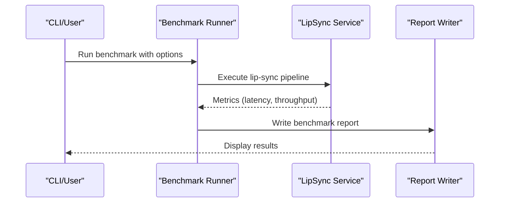
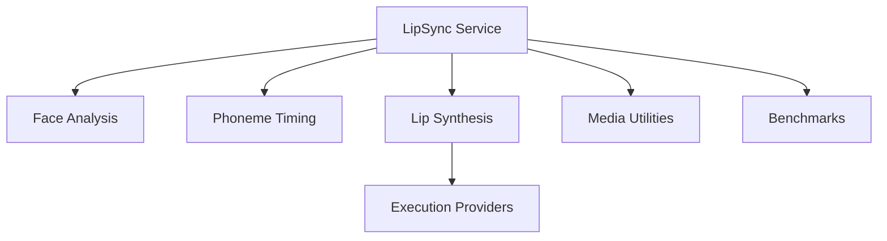

# Quality Optimization Techniques

<cite>
**Referenced Files in This Document**
- [Trackdub.Application/LipSync](file://src/Trackdub.Application/LipSync)
- [Trackdub.Application/LipSynthesis](file://src/Trackdub.Application/LipSynthesis)
- [Trackdub.Contracts/LipSync](file://src/Trackdub.Contracts/LipSync)
- [Trackdub.Domain/LipSync](file://src/Trackdub.Domain/LipSync)
- [Trackdub.Inference.Onnx/FaceAnalysis](file://src/Trackdub.Inference.Onnx/FaceAnalysis)
- [Trackdub.Inference.Onnx/LipSynthesis](file://src/Trackdub.Inference.Onnx/LipSynthesis)
- [Trackdub.Media/Quality](file://src/Trackdub.Media/Quality)
- [Trackdub.Benchmarks/DubbingBenchmarkRunner.cs](file://src/Trackdub.Benchmarks/DubbingBenchmarkRunner.cs)
- [Trackdub.Benchmarks/BenchmarkOptions.cs](file://src/Trackdub.Benchmarks/BenchmarkOptions.cs)
- [Trackdub.Infrastructure/ModelOptimization](file://src/Trackdub.Infrastructure/ModelOptimization)
- [Trackdub.Application/Hardware](file://src/Trackdub.Application/Hardware)
- [Trackdub.Composition/HardwareProfiler](file://src/Trackdub.Composition/HardwareProfiler)
- [Trackdub.Domain/HardwareProfiler.cs](file://src/Trackdub.Domain/HardwareProfiler.cs)
- [Trackdub.Domain/HardwarePresetRecommendationEngine.cs](file://src/Trackdub.Domain/HardwarePresetRecommendationEngine.cs)
- [Trackdub.Inference.Onnx/TensorRtRtx](file://src/Trackdub.Inference.Onnx/TensorRtRtx)
- [Trackdub.Inference.Onnx/NativeCudaTensorRt](file://src/Trackdub.Inference.Onnx/NativeCudaTensorRt)
- [Trackdub.Media/Process](file://src/Trackdub.Media/Process)
- [Trackdub.Media/Mixing](file://src/Trackdub.Media/Mixing)
- [Trackdub.Media/Waveforms](file://src/Trackdub.Media/Waveforms)
</cite>

## Table of Contents
1. [Introduction](#introduction)
2. [Project Structure](#project-structure)
3. [Core Components](#core-components)
4. [Architecture Overview](#architecture-overview)
5. [Detailed Component Analysis](#detailed-component-analysis)
6. [Dependency Analysis](#dependency-analysis)
7. [Performance Considerations](#performance-considerations)
8. [Troubleshooting Guide](#troubleshooting-guide)
9. [Conclusion](#conclusion)
10. [Appendices](#appendices)

## Introduction
This document explains how Trackdub optimizes lip-sync quality across the pipeline, focusing on landmark precision, animation smoothness, and temporal accuracy controls. It also covers optimization strategies for different face types, speaking styles, and video qualities; advanced techniques such as adaptive smoothing, motion blur reduction, and artifact suppression; quality assessment tools and automated tuning recommendations; manual adjustment guidelines; and use-case-specific examples (professional dubbing, casual content creation, real-time applications). Finally, it addresses trade-offs between quality and performance, memory usage optimization, and GPU acceleration techniques for high-resolution video processing.

## Project Structure
Trackdub organizes lip-sync functionality across application orchestration, contracts, domain models, inference implementations, media processing, and benchmarking:

- Application layer: LipSync and LipSynthesis services coordinate stages, settings, and outputs.
- Contracts: Interfaces define lip-sync inputs, outputs, and configuration contracts.
- Domain: Core data models and recommendation engines for hardware-aware presets.
- Inference: Face analysis and lip synthesis ONNX pipelines with execution provider support.
- Media: Quality utilities, waveform generation, mixing, and processing helpers.
- Benchmarks: Performance measurement and reporting for end-to-end dubbing runs.

**Diagram sources**
- [Trackdub.Application/LipSync](file://src/Trackdub.Application/LipSync)
- [Trackdub.Application/LipSynthesis](file://src/Trackdub.Application/LipSynthesis)
- [Trackdub.Contracts/LipSync](file://src/Trackdub.Contracts/LipSync)
- [Trackdub.Domain/LipSync](file://src/Trackdub.Domain/LipSync)
- [Trackdub.Inference.Onnx/FaceAnalysis](file://src/Trackdub.Inference.Onnx/FaceAnalysis)
- [Trackdub.Inference.Onnx/LipSynthesis](file://src/Trackdub.Inference.Onnx/LipSynthesis)
- [Trackdub.Media/Quality](file://src/Trackdub.Media/Quality)
- [Trackdub.Media/Waveforms](file://src/Trackdub.Media/Waveforms)
- [Trackdub.Media/Mixing](file://src/Trackdub.Media/Mixing)
- [Trackdub.Media/Process](file://src/Trackdub.Media/Process)
- [Trackdub.Benchmarks/DubbingBenchmarkRunner.cs](file://src/Trackdub.Benchmarks/DubbingBenchmarkRunner.cs)
- [Trackdub.Benchmarks/BenchmarkOptions.cs](file://src/Trackdub.Benchmarks/BenchmarkOptions.cs)

**Section sources**
- [Trackdub.Application/LipSync](file://src/Trackdub.Application/LipSync)
- [Trackdub.Application/LipSynthesis](file://src/Trackdub.Application/LipSynthesis)
- [Trackdub.Contracts/LipSync](file://src/Trackdub.Contracts/LipSync)
- [Trackdub.Domain/LipSync](file://src/Trackdub.Domain/LipSync)
- [Trackdub.Inference.Onnx/FaceAnalysis](file://src/Trackdub.Inference.Onnx/FaceAnalysis)
- [Trackdub.Inference.Onnx/LipSynthesis](file://src/Trackdub.Inference.Onnx/LipSynthesis)
- [Trackdub.Media/Quality](file://src/Trackdub.Media/Quality)
- [Trackdub.Media/Waveforms](file://src/Trackdub.Media/Waveforms)
- [Trackdub.Media/Mixing](file://src/Trackdub.Media/Mixing)
- [Trackdub.Media/Process](file://src/Trackdub.Media/Process)
- [Trackdub.Benchmarks/DubbingBenchmarkRunner.cs](file://src/Trackdub.Benchmarks/DubbingBenchmarkRunner.cs)
- [Trackdub.Benchmarks/BenchmarkOptions.cs](file://src/Trackdub.Benchmarks/BenchmarkOptions.cs)

## Core Components
- LipSync service: Orchestrates face detection, landmark extraction, phoneme timing, and mouth animation generation. It applies smoothing and temporal alignment based on user or auto-tuned settings.
- LipSynthesis service: Produces frame-level mouth animations from audio and phoneme sequences, integrating with rendering and export pipelines.
- Contracts: Define input/output schemas for landmarks, timing, and animation parameters to ensure consistency across layers.
- Domain models: Represent lip-sync state, timing windows, and quality metrics used by services and benchmarks.
- Inference modules: Face analysis and lip synthesis ONNX pipelines with configurable execution providers (e.g., TensorRT, CUDA) for performance.
- Media utilities: Quality assessment helpers, waveform analysis, mixing, and processing steps that influence perceived lip-sync fidelity.
- Benchmarks: Measure latency, throughput, and resource usage to guide tuning decisions.

Key quality levers:
- Landmark precision: Controlled via face model selection, preprocessing resolution, and post-processing filters.
- Animation smoothness: Managed through temporal smoothing, blending windows, and per-phoneme constraints.
- Temporal accuracy: Tuned using alignment tolerances, buffer sizes, and synchronization with audio frames.

**Section sources**
- [Trackdub.Application/LipSync](file://src/Trackdub.Application/LipSync)
- [Trackdub.Application/LipSynthesis](file://src/Trackdub.Application/LipSynthesis)
- [Trackdub.Contracts/LipSync](file://src/Trackdub.Contracts/LipSync)
- [Trackdub.Domain/LipSync](file://src/Trackdub.Domain/LipSync)
- [Trackdub.Inference.Onnx/FaceAnalysis](file://src/Trackdub.Inference.Onnx/FaceAnalysis)
- [Trackdub.Inference.Onnx/LipSynthesis](file://src/Trackdub.Inference.Onnx/LipSynthesis)
- [Trackdub.Media/Quality](file://src/Trackdub.Media/Quality)
- [Trackdub.Media/Waveforms](file://src/Trackdub.Media/Waveforms)
- [Trackdub.Media/Mixing](file://src/Trackdub.Media/Mixing)
- [Trackdub.Media/Process](file://src/Trackdub.Media/Process)
- [Trackdub.Benchmarks/DubbingBenchmarkRunner.cs](file://src/Trackdub.Benchmarks/DubbingBenchmarkRunner.cs)
- [Trackdub.Benchmarks/BenchmarkOptions.cs](file://src/Trackdub.Benchmarks/BenchmarkOptions.cs)

## Architecture Overview
The lip-sync pipeline integrates face analysis, phoneme timing, animation generation, and media processing with optional GPU acceleration. Quality is influenced by inference choices, smoothing parameters, and temporal alignment.

**Diagram sources**
- [Trackdub.Application/LipSync](file://src/Trackdub.Application/LipSync)
- [Trackdub.Application/LipSynthesis](file://src/Trackdub.Application/LipSynthesis)
- [Trackdub.Inference.Onnx/FaceAnalysis](file://src/Trackdub.Inference.Onnx/FaceAnalysis)
- [Trackdub.Inference.Onnx/LipSynthesis](file://src/Trackdub.Inference.Onnx/LipSynthesis)
- [Trackdub.Media/Process](file://src/Trackdub.Media/Process)
- [Trackdub.Benchmarks/DubbingBenchmarkRunner.cs](file://src/Trackdub.Benchmarks/DubbingBenchmarkRunner.cs)

## Detailed Component Analysis

### LipSync Service
Responsibilities:
- Coordinate face detection and landmark extraction.
- Manage phoneme timing and alignment with audio frames.
- Apply smoothing and temporal adjustments to improve perceived sync.
- Integrate with media processing for final output.

Quality controls:
- Landmark precision: Adjust preprocessing resolution and filtering thresholds.
- Animation smoothness: Tune smoothing window size and blend factors.
- Temporal accuracy: Configure alignment tolerance and buffer sizes.

**Diagram sources**
- [Trackdub.Application/LipSync](file://src/Trackdub.Application/LipSync)
- [Trackdub.Media/Process](file://src/Trackdub.Media/Process)

**Section sources**
- [Trackdub.Application/LipSync](file://src/Trackdub.Application/LipSync)
- [Trackdub.Media/Process](file://src/Trackdub.Media/Process)

### LipSynthesis Service
Responsibilities:
- Convert phoneme sequences into frame-level mouth animations.
- Integrate with rendering and export pipelines.
- Support multiple execution backends for performance.

Quality controls:
- Per-phoneme constraints to avoid unnatural movements.
- Blending windows to reduce jitter.
- Execution provider selection (CPU vs GPU) for speed vs fidelity.

**Diagram sources**
- [Trackdub.Application/LipSynthesis](file://src/Trackdub.Application/LipSynthesis)
- [Trackdub.Inference.Onnx/LipSynthesis](file://src/Trackdub.Inference.Onnx/LipSynthesis)

**Section sources**
- [Trackdub.Application/LipSynthesis](file://src/Trackdub.Application/LipSynthesis)
- [Trackdub.Inference.Onnx/LipSynthesis](file://src/Trackdub.Inference.Onnx/LipSynthesis)

### Face Analysis Module
Responsibilities:
- Detect faces and extract facial landmarks.
- Provide confidence scores and fallback strategies when detection fails.

Quality controls:
- Preprocessing resolution impacts landmark precision.
- Post-processing filters reduce noise and jitter.

**Diagram sources**
- [Trackdub.Inference.Onnx/FaceAnalysis](file://src/Trackdub.Inference.Onnx/FaceAnalysis)

**Section sources**
- [Trackdub.Inference.Onnx/FaceAnalysis](file://src/Trackdub.Inference.Onnx/FaceAnalysis)

### Media Quality Utilities
Responsibilities:
- Assess quality metrics for audio and video.
- Generate waveforms and analyze loudness/timing.
- Assist in mixing and processing steps that affect perceived sync.

Quality controls:
- Waveform analysis helps align audio peaks with visual cues.
- Mixing levels impact clarity and timing perception.

**Diagram sources**
- [Trackdub.Media/Quality](file://src/Trackdub.Media/Quality)
- [Trackdub.Media/Waveforms](file://src/Trackdub.Media/Waveforms)
- [Trackdub.Media/Mixing](file://src/Trackdub.Media/Mixing)

**Section sources**
- [Trackdub.Media/Quality](file://src/Trackdub.Media/Quality)
- [Trackdub.Media/Waveforms](file://src/Trackdub.Media/Waveforms)
- [Trackdub.Media/Mixing](file://src/Trackdub.Media/Mixing)

### Benchmarking and Tuning
Responsibilities:
- Measure end-to-end latency and throughput.
- Provide options for different scenarios (quality-focused vs speed-focused).
- Generate reports to guide parameter tuning.

Quality controls:
- Benchmark options allow targeting specific resolutions, frame rates, and execution providers.
- Reports highlight bottlenecks and suggest optimizations.

**Diagram sources**
- [Trackdub.Benchmarks/DubbingBenchmarkRunner.cs](file://src/Trackdub.Benchmarks/DubbingBenchmarkRunner.cs)
- [Trackdub.Benchmarks/BenchmarkOptions.cs](file://src/Trackdub.Benchmarks/BenchmarkOptions.cs)

**Section sources**
- [Trackdub.Benchmarks/DubbingBenchmarkRunner.cs](file://src/Trackdub.Benchmarks/DubbingBenchmarkRunner.cs)
- [Trackdub.Benchmarks/BenchmarkOptions.cs](file://src/Trackdub.Benchmarks/BenchmarkOptions.cs)

## Dependency Analysis
Lip-sync components depend on inference providers, media utilities, and benchmarking tools. Understanding these relationships helps optimize performance and quality.

**Diagram sources**
- [Trackdub.Application/LipSync](file://src/Trackdub.Application/LipSync)
- [Trackdub.Inference.Onnx/FaceAnalysis](file://src/Trackdub.Inference.Onnx/FaceAnalysis)
- [Trackdub.Inference.Onnx/LipSynthesis](file://src/Trackdub.Inference.Onnx/LipSynthesis)
- [Trackdub.Media/Quality](file://src/Trackdub.Media/Quality)
- [Trackdub.Benchmarks/DubbingBenchmarkRunner.cs](file://src/Trackdub.Benchmarks/DubbingBenchmarkRunner.cs)

**Section sources**
- [Trackdub.Application/LipSync](file://src/Trackdub.Application/LipSync)
- [Trackdub.Inference.Onnx/FaceAnalysis](file://src/Trackdub.Inference.Onnx/FaceAnalysis)
- [Trackdub.Inference.Onnx/LipSynthesis](file://src/Trackdub.Inference.Onnx/LipSynthesis)
- [Trackdub.Media/Quality](file://src/Trackdub.Media/Quality)
- [Trackdub.Benchmarks/DubbingBenchmarkRunner.cs](file://src/Trackdub.Benchmarks/DubbingBenchmarkRunner.cs)

## Performance Considerations
- Landmark precision vs speed: Higher resolution preprocessing improves accuracy but increases latency.
- Smoothing trade-offs: Larger smoothing windows reduce jitter but may introduce lag.
- Temporal accuracy: Tighter alignment tolerances improve sync but can cause instability if audio is noisy.
- GPU acceleration: Use TensorRT or CUDA providers for high-resolution video processing where available.
- Memory usage: Optimize buffer sizes and reuse allocations to reduce peak memory consumption.
- Hardware-aware presets: Leverage recommendation engines to select optimal configurations based on device capabilities.

[No sources needed since this section provides general guidance]

## Troubleshooting Guide
Common issues and resolutions:
- Poor landmark detection: Reduce preprocessing resolution, increase detection thresholds, or switch to a more robust face model.
- Jittery animations: Increase smoothing window size or adjust blend factors.
- Misaligned sync: Tighten alignment tolerances, verify audio frame rates, and check buffer sizes.
- High latency: Switch to GPU execution providers, reduce model complexity, or lower output resolution.
- Memory spikes: Monitor memory usage during benchmarks and adjust buffer sizes accordingly.

Use benchmark reports to identify bottlenecks and validate improvements after parameter changes.

**Section sources**
- [Trackdub.Benchmarks/DubbingBenchmarkRunner.cs](file://src/Trackdub.Benchmarks/DubbingBenchmarkRunner.cs)
- [Trackdub.Benchmarks/BenchmarkOptions.cs](file://src/Trackdub.Benchmarks/BenchmarkOptions.cs)

## Conclusion
Trackdub’s lip-sync quality optimization balances landmark precision, animation smoothness, and temporal accuracy through configurable parameters and hardware-aware presets. By leveraging inference providers, media utilities, and benchmarking tools, users can tailor performance and quality for diverse use cases—from professional dubbing to real-time applications—while managing trade-offs between fidelity, latency, and resource usage.

[No sources needed since this section summarizes without analyzing specific files]

## Appendices

### Advanced Techniques
- Adaptive smoothing: Dynamically adjust smoothing based on detected motion intensity and landmark confidence.
- Motion blur reduction: Apply deblurring filters to input frames before landmark extraction to improve precision.
- Artifact suppression: Use post-processing filters to remove outliers in landmark trajectories and smooth abrupt transitions.

[No sources needed since this section provides general guidance]

### Use Case Examples
- Professional dubbing: Prioritize landmark precision and temporal accuracy; use GPU acceleration and higher-resolution preprocessing.
- Casual content creation: Balance quality and speed; moderate smoothing and alignment tolerances for natural-looking results.
- Real-time applications: Favor low-latency execution providers, reduced preprocessing resolution, and minimal smoothing to maintain responsiveness.

[No sources needed since this section provides general guidance]

### Manual Adjustment Guidelines
- Landmark precision: Adjust preprocessing resolution and detection thresholds based on face type and lighting conditions.
- Animation smoothness: Tune smoothing window size and blend factors to reduce jitter without introducing lag.
- Temporal accuracy: Set alignment tolerances and buffer sizes according to audio quality and desired sync tightness.

[No sources needed since this section provides general guidance]