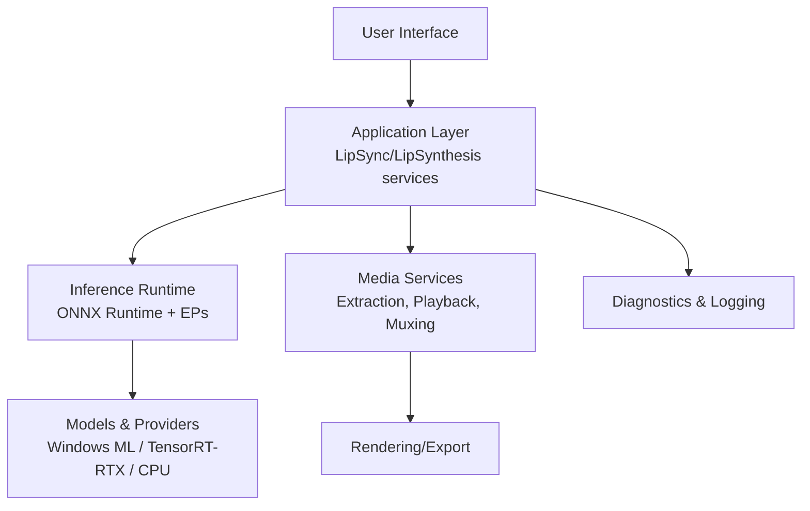
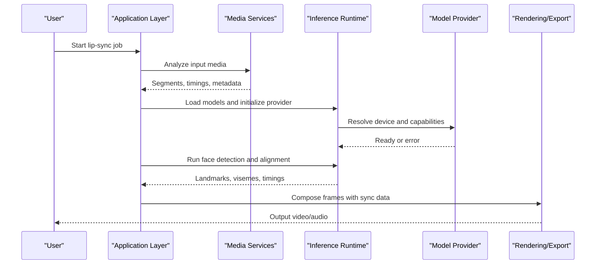
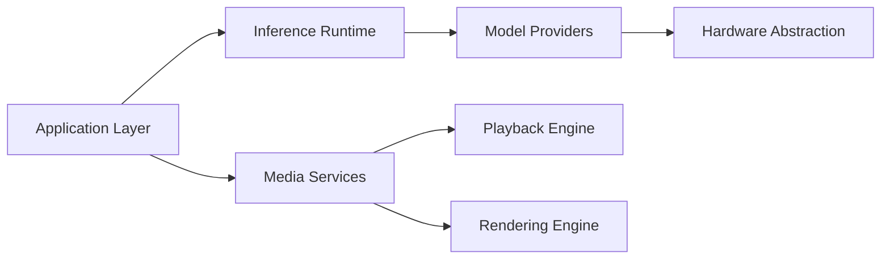

# Troubleshooting Lip-Sync Issues

<cite>
**Referenced Files in This Document**
- [TROUBLESHOOTING.md](file://docs/development/TROUBLESHOOTING.md)
- [ARCHITECTURE.md](file://docs/architecture/ARCHITECTURE.md)
- [ADR-0008-inference-retry-circuit-breaker.md](file://docs/decisions/ADR-0008-inference-retry-circuit-breaker.md)
- [ADR-0009-gpu-memory-budget-planner.md](file://docs/decisions/ADR-0009-gpu-memory-budget-planner.md)
- [windows-ml-phase-3-device-policies.md](file://docs/reference/windows-ml-phase-3-device-policies.md)
- [tensorrt-rtx-ep-abl-plugin.md](file://docs/reference/tensorrt-rtx-ep-abl-plugin.md)
- [Trackdub.Application.csproj](file://src/Trackdub.Application/Trackdub.Application.csproj)
- [Trackdub.Inference.Onnx.csproj](file://src/Trackdub.Inference.Onnx/Trackdub.Inference.Onnx.csproj)
- [Trackdub.Media.Playback.csproj](file://src/Trackdub.Media.Playback/Trackdub.Media.Playback.csproj)
</cite>

## Table of Contents
1. [Introduction](#introduction)
2. [Project Structure](#project-structure)
3. [Core Components](#core-components)
4. [Architecture Overview](#architecture-overview)
5. [Detailed Component Analysis](#detailed-component-analysis)
6. [Dependency Analysis](#dependency-analysis)
7. [Performance Considerations](#performance-considerations)
8. [Troubleshooting Guide](#troubleshooting-guide)
9. [Conclusion](#conclusion)
10. [Appendices](#appendices)

## Introduction
This document provides comprehensive troubleshooting guidance for lip-sync issues in Trackdub. It focuses on diagnosing and resolving inaccurate facial detection, poor sync quality, animation artifacts, and performance bottlenecks. It also covers platform-specific considerations, driver compatibility, hardware configuration, and practical recovery procedures. The content is organized to support both quick fixes and deep-dive diagnostics using built-in logging and diagnostic tools.

## Project Structure
Trackdub’s lip-sync pipeline spans multiple layers: media ingestion and playback, inference runtime selection, model loading and execution, and rendering/export. Understanding where failures occur requires mapping symptoms to the relevant subsystems and their dependencies.

**Diagram sources**
- [Trackdub.Application.csproj](file://src/Trackdub.Application/Trackdub.Application.csproj)
- [Trackdub.Inference.Onnx.csproj](file://src/Trackdub.Inference.Onnx/Trackdub.Inference.Onnx.csproj)
- [Trackdub.Media.Playback.csproj](file://src/Trackdub.Media.Playback/Trackdub.Media.Playback.csproj)

**Section sources**
- [ARCHITECTURE.md](file://docs/architecture/ARCHITECTURE.md)

## Core Components
The lip-sync workflow involves several key components:
- Media ingestion and timing alignment
- Facial detection and tracking
- Audio-to-viseme or phoneme alignment
- Inference execution with selected providers (CPU, Windows ML, TensorRT-RTX)
- Rendering and export

Common failure points include:
- Model loading and provider initialization
- Inference errors and memory pressure
- Timing drift between audio and visual frames
- Rendering artifacts due to incorrect aspect ratios or frame rates

**Section sources**
- [Trackdub.Application.csproj](file://src/Trackdub.Application/Trackdub.Application.csproj)
- [Trackdub.Inference.Onnx.csproj](file://src/Trackdub.Inference.Onnx/Trackdub.Inference.Onnx.csproj)
- [Trackdub.Media.Playback.csproj](file://src/Trackdub.Media.Playback/Trackdub.Media.Playback.csproj)

## Architecture Overview
The end-to-end flow for lip-sync processing includes:
- Input media analysis and segmentation
- Face detection and landmark extraction
- Speech transcription and alignment
- Viseme generation and smoothing
- Rendering with correct timing and aspect ratio handling

**Diagram sources**
- [Trackdub.Application.csproj](file://src/Trackdub.Application/Trackdub.Application.csproj)
- [Trackdub.Inference.Onnx.csproj](file://src/Trackdub.Inference.Onnx/Trackdub.Inference.Onnx.csproj)
- [Trackdub.Media.Playback.csproj](file://src/Trackdub.Media.Playback/Trackdub.Media.Playback.csproj)

## Detailed Component Analysis

### Model Loading and Provider Initialization
Symptoms:
- Job fails immediately after starting
- GPU not utilized despite being available
- Intermittent crashes during startup

Root causes:
- Incorrect provider selection or missing dependencies
- Insufficient GPU memory or incompatible drivers
- Model path resolution failures

Diagnostic steps:
- Verify provider readiness and capability discovery
- Check logs for provider initialization errors
- Validate model availability and integrity

Recovery actions:
- Switch to a compatible provider (CPU fallback)
- Update graphics drivers and runtime libraries
- Re-download or re-validate model files

**Section sources**
- [windows-ml-phase-3-device-policies.md](file://docs/reference/windows-ml-phase-3-device-policies.md)
- [tensorrt-rtx-ep-abl-plugin.md](file://docs/reference/tensorrt-rtx-ep-abl-plugin.md)

### Inference Execution and Memory Management
Symptoms:
- Slow processing or timeouts
- Out-of-memory errors
- Degraded performance under load

Root causes:
- Excessive batch sizes or large model graphs
- GPU memory fragmentation
- Suboptimal execution provider settings

Diagnostic steps:
- Monitor memory usage during inference
- Review provider-specific configuration options
- Enable detailed logging for inference stages

Recovery actions:
- Reduce batch size or model complexity
- Adjust memory budget planner settings
- Use optimized model variants when available

**Section sources**
- [ADR-0009-gpu-memory-budget-planner.md](file://docs/decisions/ADR-0009-gpu-memory-budget-planner.md)

### Retry and Circuit Breaker Behavior
Symptoms:
- Transient failures causing repeated attempts
- Jobs stuck in retry loops
- Inconsistent progress reporting

Root causes:
- Network or I/O transient errors
- Provider instability under load
- Missing circuit breaker thresholds

Diagnostic steps:
- Inspect retry counts and backoff strategies
- Check circuit breaker state transitions
- Correlate failures with system resource usage

Recovery actions:
- Tune retry limits and backoff intervals
- Implement graceful degradation paths
- Add health checks for critical components

**Section sources**
- [ADR-0008-inference-retry-circuit-breaker.md](file://docs/decisions/ADR-0008-inference-retry-circuit-breaker.md)

### Media Timing and Sync Accuracy
Symptoms:
- Lip movements out of sync with speech
- Drifting synchronization over time
- Incorrect frame rate or aspect ratio handling

Root causes:
- Misaligned timestamps between audio and video
- Frame dropping or duplication
- Incorrect aspect ratio conversion

Diagnostic steps:
- Validate timestamp alignment across media streams
- Check frame rate consistency throughout pipeline
- Verify aspect ratio preservation during processing

Recovery actions:
- Recalculate and align timestamps
- Apply frame interpolation or correction
- Ensure consistent aspect ratio handling

**Section sources**
- [Trackdub.Media.Playback.csproj](file://src/Trackdub.Media.Playback/Trackdub.Media.Playback.csproj)

## Dependency Analysis
Understanding component dependencies helps isolate issues:
- Application layer depends on inference runtime and media services
- Inference runtime relies on model providers and hardware capabilities
- Media services interact with playback and rendering systems

**Diagram sources**
- [Trackdub.Application.csproj](file://src/Trackdub.Application/Trackdub.Application.csproj)
- [Trackdub.Inference.Onnx.csproj](file://src/Trackdub.Inference.Onnx/Trackdub.Inference.Onnx.csproj)
- [Trackdub.Media.Playback.csproj](file://src/Trackdub.Media.Playback/Trackdub.Media.Playback.csproj)

**Section sources**
- [ARCHITECTURE.md](file://docs/architecture/ARCHITECTURE.md)

## Performance Considerations
Key performance factors affecting lip-sync quality:
- Model size and complexity
- Hardware acceleration availability
- Batch processing efficiency
- Memory bandwidth utilization

Optimization strategies:
- Use quantized or optimized model variants
- Leverage GPU acceleration when available
- Implement efficient batching mechanisms
- Monitor and optimize memory usage patterns

[No sources needed since this section provides general guidance]

## Troubleshooting Guide

### Common Problems and Solutions

#### Inaccurate Facial Detection
Causes:
- Poor lighting conditions
- Fast head movements
- Multiple faces in frame
- Non-standard aspect ratios

Solutions:
- Improve lighting and reduce motion blur
- Use motion compensation techniques
- Implement face prioritization algorithms
- Handle aspect ratio transformations correctly

#### Poor Sync Quality
Causes:
- Timestamp misalignment
- Frame rate inconsistencies
- Audio/video desynchronization

Solutions:
- Recalculate and align timestamps
- Normalize frame rates across pipeline
- Apply audio-video synchronization corrections

#### Animation Artifacts
Causes:
- Insufficient smoothing
- Incorrect blending parameters
- Rendering pipeline issues

Solutions:
- Adjust smoothing and blending parameters
- Validate rendering pipeline configuration
- Implement artifact detection and correction

#### Performance Issues
Causes:
- Hardware limitations
- Inefficient model execution
- Memory pressure

Solutions:
- Optimize model selection and configuration
- Enable hardware acceleration
- Implement memory management strategies

### Diagnostic Tools and Logging Techniques

#### Built-in Logging
- Enable detailed logging for all pipeline stages
- Capture provider initialization and execution logs
- Monitor memory usage and performance metrics

#### Diagnostic Bundles
- Export comprehensive diagnostic information
- Include system configuration and hardware details
- Provide model and provider version information

#### Profiling Tools
- Use profiling utilities to identify bottlenecks
- Monitor GPU utilization and memory usage
- Analyze inference execution times

### Platform-Specific Issues

#### Windows-Specific Problems
- Windows ML provider compatibility
- Graphics driver version requirements
- System resource allocation

#### Driver Compatibility
- Graphics driver updates and validation
- CUDA/TensorRT version compatibility
- Hardware capability verification

#### Hardware Configuration
- GPU memory capacity and utilization
- CPU vs GPU performance trade-offs
- Multi-GPU environment considerations

### Step-by-Step Resolution Guides

#### Resolving Sync Accuracy Issues
1. Verify input media format and properties
2. Check timestamp alignment between audio and video
3. Validate frame rate consistency
4. Apply synchronization corrections if needed

#### Fixing Visual Artifacts
1. Identify artifact type and source
2. Adjust processing parameters
3. Validate rendering pipeline configuration
4. Test with different input samples

#### Optimizing Processing Speed
1. Profile current performance bottlenecks
2. Select appropriate model variants
3. Configure hardware acceleration
4. Monitor and adjust resource allocation

### Recovery Procedures

#### Model Loading Failures
1. Verify model file integrity
2. Check provider compatibility
3. Validate system dependencies
4. Attempt fallback to alternative providers

#### Inference Errors
1. Capture detailed error logs
2. Check hardware resource availability
3. Validate input data formats
4. Implement retry mechanisms with backoff

#### Rendering Problems
1. Verify output format specifications
2. Check codec availability and compatibility
3. Validate memory allocation for rendering
4. Test with simplified rendering pipelines

[No sources needed since this section provides general guidance]

## Conclusion
Effective troubleshooting of lip-sync issues in Trackdub requires systematic diagnosis across multiple layers of the pipeline. By understanding the architecture, leveraging diagnostic tools, and following structured resolution procedures, users can identify and resolve common problems related to facial detection, sync accuracy, animation artifacts, and performance. Platform-specific considerations and hardware compatibility play crucial roles in achieving optimal results.

[No sources needed since this section summarizes without analyzing specific files]

## Appendices

### Quick Reference Checklist
- [ ] Verify hardware capabilities and driver versions
- [ ] Check model file integrity and provider compatibility
- [ ] Enable detailed logging for all pipeline stages
- [ ] Monitor memory usage and resource utilization
- [ ] Validate input media format and properties
- [ ] Test with different model variants and configurations
- [ ] Review system logs for error patterns and warnings

### Useful Commands and Settings
- Enable verbose logging for inference operations
- Configure provider-specific optimization settings
- Set memory budget limits for GPU operations
- Adjust batch processing parameters
- Configure retry and circuit breaker policies

[No sources needed since this section provides general guidance]