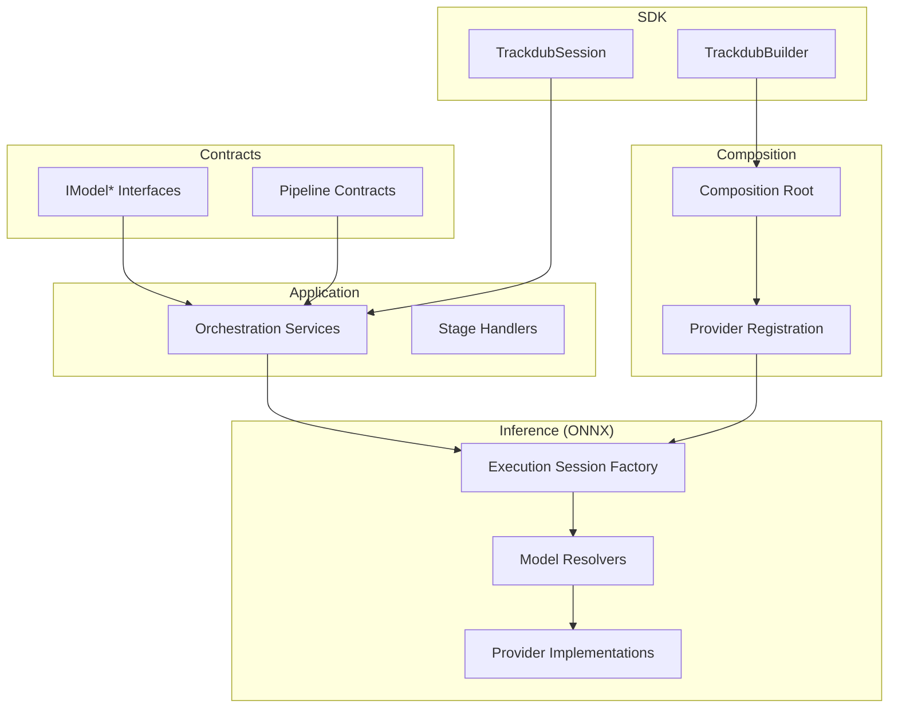
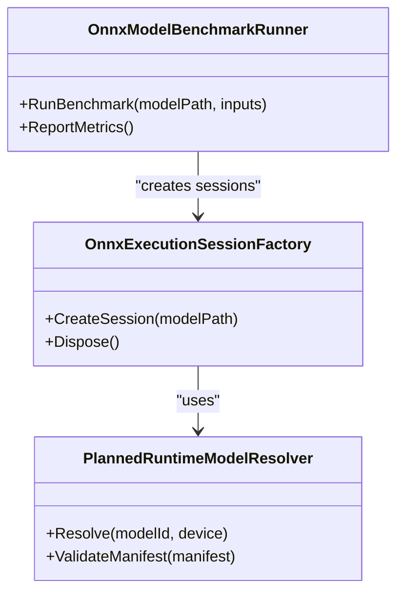
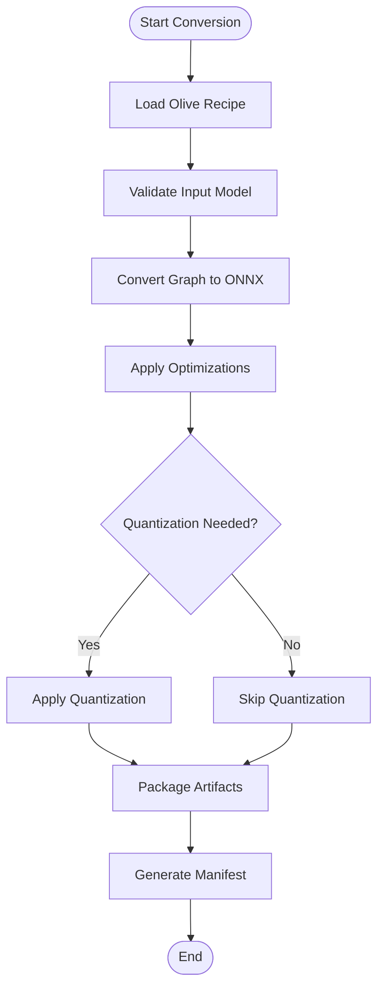
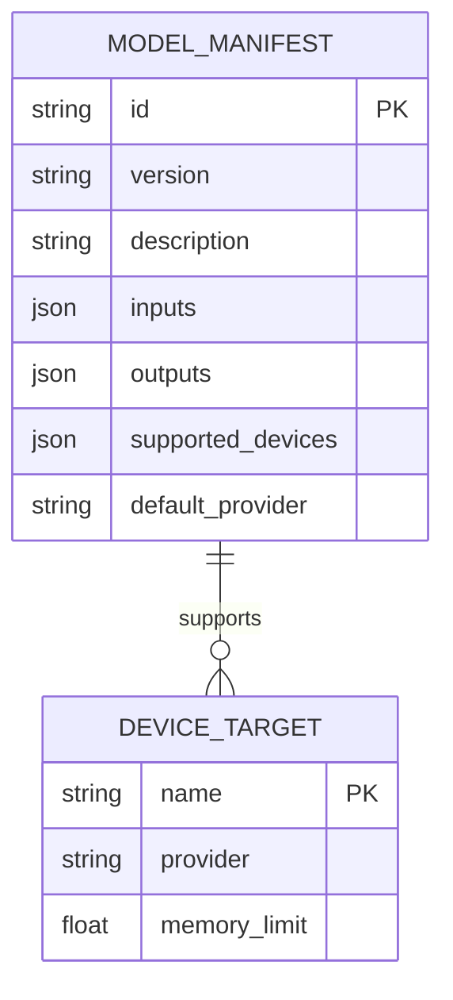
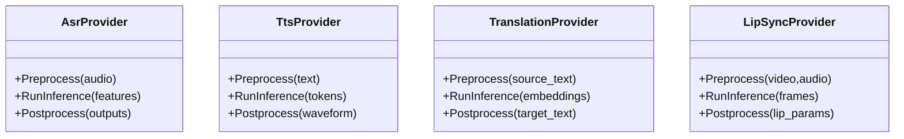
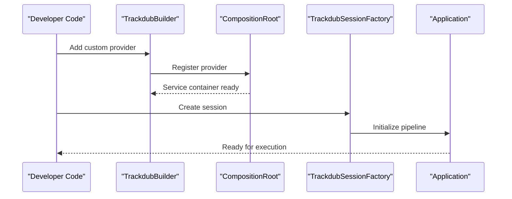
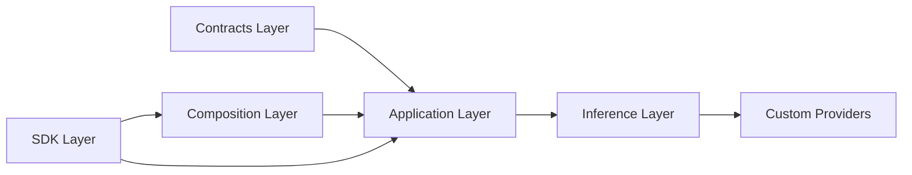

# Custom Model Integration

<cite>
**Referenced Files in This Document**
- [Trackdub.Inference.Onnx.csproj](file://src/Trackdub.Inference.Onnx/Trackdub.Inference.Onnx.csproj)
- [OnnxExecutionSessionFactory.cs](file://src/Trackdub.Inference.Onnx/OnnxExecutionSessionFactory.cs)
- [PlannedRuntimeModelResolver.cs](file://src/Trackdub.Inference.Onnx/PlannedRuntimeModelResolver.cs)
- [OnnxModelBenchmarkRunner.cs](file://src/Trackdub.Inference.Onnx/OnnxModelBenchmarkRunner.cs)
- [README.md](file://src/Trackdub.Inference.Onnx/README.md)
- [orchestration-service-tests.cs](file://tests/Trackdub.Application.Tests/OrchestrationServiceTests.cs)
- [runtime-model-request-factory-tests.cs](file://tests/Trackdub.Application.Tests/RuntimeModelRequestFactoryTests.cs)
- [qwen3-tts-defaults-tests.cs](file://tests/Trackdub.Application.Tests/Qwen3TtsDefaultsTests.cs)
- [migraphx-model-support-tests.cs](file://tests/Trackdub.Application.Tests/MigraphxModelSupportTests.cs)
- [olive-recipe-pilot-reference.md](file://docs/reference/olive-recipe-pilot.md)
- [olive-recipes-readme.md](file://resources/olive-recipes/README.md)
- [trt-rtx-ep-manifest.json](file://runtime/trt-rtx-ep.manifest.json)
- [composition-root.cs](file://src/Trackdub.Composition/CompositionRoot.cs)
- [trackdub-builder.cs](file://src/Trackdub.Sdk/TrackdubBuilder.cs)
- [trackdub-options.cs](file://src/Trackdub.Sdk/TrackdubOptions.cs)
- [trackdub-session-factory.cs](file://src/Trackdub.Sdk/TrackdubSessionFactory.cs)
- [trackdub-dubbing-engine.cs](file://src/Trackdub.Sdk/TrackdubDubbingEngine.cs)
- [whisper-onnx-audio-preprocessor.cs](file://src/Trackdub.Inference.Onnx/Whisper/AudioPreprocessor.cs)
- [cosyvoice-asr-inference.cs](file://src/Trackdub.Inference.Onnx/CosyVoice/AsrInference.cs)
- [kokoro-tts-inference.cs](file://src/Trackdub.Inference.Onnx/Kokoro/TtsInference.cs)
- [nvidia-nemotron-asr-inference.cs](file://src/Trackdub.Inference.Onnx/NemotronAsr/AsrInference.cs)
- [qwen3-asr-inference.cs](file://src/Trackdub.Inference.Onnx/Qwen3Asr/AsrInference.cs)
- [qwen3-tts-inference.cs](file://src/Trackdub.Inference.Onnx/Qwen3Tts/TtsInference.cs)
- [translation-engine-base.cs](file://src/Trackdub.Inference.Onnx/Translation/TranslationEngineBase.cs)
- [lip-synthesis-inference.cs](file://src/Trackdub.Inference.Onnx/LipSynthesis/Inference.cs)
- [forced-alignment-inference.cs](file://src/Trackdub.Inference.Onnx/ForcedAlignment/Inference.cs)
- [deepfilternet-enhancement-inference.cs](file://src/Trackdub.Inference.Onnx/DeepFilterNet/EnhancementInference.cs)
- [sepformer-separation-inference.cs](file://src/Trackdub.Inference.Onnx/SepFormer/SeparationInference.cs)
- [spleeter-separation-inference.cs](file://src/Trackdub.Inference.Onnx/Spleeter/SeparationInference.cs)
- [silero-vad-inference.cs](file://src/Trackdub.Inference.Onnx/SileroVad/VadInference.cs)
- [face-analysis-inference.cs](file://src/Trackdub.Inference.Onnx/FaceAnalysis/Inference.cs)
- [sortformer-inference.cs](file://src/Trackdub.Inference.Onnx/SortFormer/Inference.cs)
- [madlad-translation-inference.cs](file://src/Trackdub.Inference.Onnx/Madlad/TranslationInference.cs)
- [opust-mt-translation-inference.cs](file://src/Trackdub.Inference.Onnx/OpusMt/TranslationInference.cs)
- [phi-text-refinement-inference.cs](file://src/Trackdub.Inference.Onnx/Phi/TextRefinementInference.cs)
- [qwen-assistant-inference.cs](file://src/Trackdub.Inference.Onnx/QwenAssistant/AssistantInference.cs)
</cite>

## Table of Contents
1. [Introduction](#introduction)
2. [Project Structure](#project-structure)
3. [Core Components](#core-components)
4. [Architecture Overview](#architecture-overview)
5. [Detailed Component Analysis](#detailed-component-analysis)
6. [Dependency Analysis](#dependency-analysis)
7. [Performance Considerations](#performance-considerations)
8. [Troubleshooting Guide](#troubleshooting-guide)
9. [Conclusion](#conclusion)
10. [Appendices](#appendices)

## Introduction
This document explains how to integrate custom models into Trackdub, focusing on the ONNX-based inference stack and the recipe system for model optimization. It covers:
- The model interface requirements and input/output specifications expected by Trackdub’s inference layer
- Converting models to ONNX format and packaging them with manifests
- Registering custom model providers and wiring them into the application
- Using Olive recipes and conversion pipelines to optimize models for target devices
- Testing frameworks and validation strategies for new integrations
- Best practices for packaging, distribution, and version management

The goal is to enable developers to add ASR, TTS, translation, and lip-sync models consistently and reliably within Trackdub’s pipeline.

## Project Structure
Trackdub organizes model integration across several layers:
- Contracts define interfaces and data types used by the inference layer
- Application orchestrates stages and composes services
- Inference provides runtime execution (ONNX, TensorRT-RTX, etc.)
- Composition wires dependencies and registers providers
- Sdk exposes programmatic APIs for building sessions and running pipelines
- Tools and resources support model optimization and manifest generation



**Diagram sources**
- [composition-root.cs](file://src/Trackdub.Composition/CompositionRoot.cs)
- [trackdub-builder.cs](file://src/Trackdub.Sdk/TrackdubBuilder.cs)
- [OnnxExecutionSessionFactory.cs](file://src/Trackdub.Inference.Onnx/OnnxExecutionSessionFactory.cs)
- [PlannedRuntimeModelResolver.cs](file://src/Trackdub.Inference.Onnx/PlannedRuntimeModelResolver.cs)

**Section sources**
- [composition-root.cs](file://src/Trackdub.Composition/CompositionRoot.cs)
- [trackdub-builder.cs](file://src/Trackdub.Sdk/TrackdubBuilder.cs)
- [OnnxExecutionSessionFactory.cs](file://src/Trackdub.Inference.Onnx/OnnxExecutionSessionFactory.cs)
- [PlannedRuntimeModelResolver.cs](file://src/Trackdub.Inference.Onnx/PlannedRuntimeModelResolver.cs)

## Core Components
Key components that govern custom model integration:
- Execution session factory: creates and manages ONNX execution contexts
- Runtime model resolver: resolves model artifacts and variants at runtime
- Benchmark runner: validates performance characteristics of models
- Provider implementations: concrete ASR/TTS/translation/lip-sync modules
- Recipe system: Olive-based optimization configurations for converting and optimizing models
- Manifests: metadata describing model capabilities, inputs/outputs, and device targets

These components are defined and wired through contracts and composition, ensuring a consistent integration pattern.

**Section sources**
- [OnnxExecutionSessionFactory.cs](file://src/Trackdub.Inference.Onnx/OnnxExecutionSessionFactory.cs)
- [PlannedRuntimeModelResolver.cs](file://src/Trackdub.Inference.Onnx/PlannedRuntimeModelResolver.cs)
- [OnnxModelBenchmarkRunner.cs](file://src/Trackdub.Inference.Onnx/OnnxModelBenchmarkRunner.cs)
- [README.md](file://src/Trackdub.Inference.Onnx/README.md)

## Architecture Overview
The integration architecture follows a layered approach:
- SDK and Composition provide configuration and dependency injection
- Application orchestrates pipeline stages and invokes inference services
- Inference abstracts execution via ONNX and provider-specific optimizations
- Recipes and manifests standardize conversion and deployment

```mermaid
sequenceDiagram
participant User as "User/CLI"
participant SDK as "TrackdubBuilder/Session"
participant App as "Application Orchestration"
participant Inf as "Inference Layer"
participant Prov as "Custom Provider"
participant Opt as "Olive Recipes/Manifests"
User->>SDK : Configure options and providers
SDK->>App : Build session and resolve services
App->>Inf : Request model execution
Inf->>Prov : Prepare inputs and run inference
Prov-->>Inf : Return outputs
Inf-->>App : Provide results
App-->>User : Deliver final output
Note over Opt,Inf : Conversion and optimization via recipes and manifests
```

**Diagram sources**
- [trackdub-builder.cs](file://src/Trackdub.Sdk/TrackdubBuilder.cs)
- [trackdub-session-factory.cs](file://src/Trackdub.Sdk/TrackdubSessionFactory.cs)
- [OnnxExecutionSessionFactory.cs](file://src/Trackdub.Inference.Onnx/OnnxExecutionSessionFactory.cs)
- [olive-recipe-pilot-reference.md](file://docs/reference/olive-recipe-pilot.md)

## Detailed Component Analysis

### ONNX Execution and Model Resolution
- Execution session factory initializes ONNX runtime sessions with appropriate execution providers
- Planned runtime model resolver selects the correct model variant based on device capabilities and manifest metadata
- Benchmark runner measures latency and throughput to validate model readiness



**Diagram sources**
- [OnnxExecutionSessionFactory.cs](file://src/Trackdub.Inference.Onnx/OnnxExecutionSessionFactory.cs)
- [PlannedRuntimeModelResolver.cs](file://src/Trackdub.Inference.Onnx/PlannedRuntimeModelResolver.cs)
- [OnnxModelBenchmarkRunner.cs](file://src/Trackdub.Inference.Onnx/OnnxModelBenchmarkRunner.cs)

**Section sources**
- [OnnxExecutionSessionFactory.cs](file://src/Trackdub.Inference.Onnx/OnnxExecutionSessionFactory.cs)
- [PlannedRuntimeModelResolver.cs](file://src/Trackdub.Inference.Onnx/PlannedRuntimeModelResolver.cs)
- [OnnxModelBenchmarkRunner.cs](file://src/Trackdub.Inference.Onnx/OnnxModelBenchmarkRunner.cs)

### Recipe System and Conversion Pipelines
- Olive recipes define conversion steps, quantization, and graph optimizations
- Resources contain example recipes for various models and targets
- Manifests describe model metadata, supported devices, and input/output schemas



**Diagram sources**
- [olive-recipe-pilot-reference.md](file://docs/reference/olive-recipe-pilot.md)
- [olive-recipes-readme.md](file://resources/olive-recipes/README.md)

**Section sources**
- [olive-recipe-pilot-reference.md](file://docs/reference/olive-recipe-pilot.md)
- [olive-recipes-readme.md](file://resources/olive-recipes/README.md)

### Model Manifests and Device Targets
- Manifests specify model identifiers, versions, input/output shapes, and supported execution providers
- Runtime uses manifests to select optimal model variants during execution



**Diagram sources**
- [trt-rtx-ep-manifest.json](file://runtime/trt-rtx-ep.manifest.json)

**Section sources**
- [trt-rtx-ep-manifest.json](file://runtime/trt-rtx-ep.manifest.json)

### Provider Implementation Patterns
Providers implement standardized interfaces for ASR, TTS, translation, and lip-sync tasks. Each provider handles:
- Input preprocessing according to model specifications
- Running inference via ONNX execution sessions
- Post-processing outputs into domain-specific formats



**Diagram sources**
- [whisper-onnx-audio-preprocessor.cs](file://src/Trackdub.Inference.Onnx/Whisper/AudioPreprocessor.cs)
- [cosyvoice-asr-inference.cs](file://src/Trackdub.Inference.Onnx/CosyVoice/AsrInference.cs)
- [kokoro-tts-inference.cs](file://src/Trackdub.Inference.Onnx/Kokoro/TtsInference.cs)
- [nvidia-nemotron-asr-inference.cs](file://src/Trackdub.Inference.Onnx/NemotronAsr/AsrInference.cs)
- [qwen3-asr-inference.cs](file://src/Trackdub.Inference.Onnx/Qwen3Asr/AsrInference.cs)
- [qwen3-tts-inference.cs](file://src/Trackdub.Inference.Onnx/Qwen3Tts/TtsInference.cs)
- [translation-engine-base.cs](file://src/Trackdub.Inference.Onnx/Translation/TranslationEngineBase.cs)
- [lip-synthesis-inference.cs](file://src/Trackdub.Inference.Onnx/LipSynthesis/Inference.cs)

**Section sources**
- [whisper-onnx-audio-preprocessor.cs](file://src/Trackdub.Inference.Onnx/Whisper/AudioPreprocessor.cs)
- [cosyvoice-asr-inference.cs](file://src/Trackdub.Inference.Onnx/CosyVoice/AsrInference.cs)
- [kokoro-tts-inference.cs](file://src/Trackdub.Inference.Onnx/Kokoro/TtsInference.cs)
- [nvidia-nemotron-asr-inference.cs](file://src/Trackdub.Inference.Onnx/NemotronAsr/AsrInference.cs)
- [qwen3-asr-inference.cs](file://src/Trackdub.Inference.Onnx/Qwen3Asr/AsrInference.cs)
- [qwen3-tts-inference.cs](file://src/Trackdub.Inference.Onnx/Qwen3Tts/TtsInference.cs)
- [translation-engine-base.cs](file://src/Trackdub.Inference.Onnx/Translation/TranslationEngineBase.cs)
- [lip-synthesis-inference.cs](file://src/Trackdub.Inference.Onnx/LipSynthesis/Inference.cs)

### Integration with Application and SDK
- Composition root registers all providers and services
- SDK builder configures options and builds sessions
- Session factory creates runtime contexts for pipeline execution



**Diagram sources**
- [composition-root.cs](file://src/Trackdub.Composition/CompositionRoot.cs)
- [trackdub-builder.cs](file://src/Trackdub.Sdk/TrackdubBuilder.cs)
- [trackdub-session-factory.cs](file://src/Trackdub.Sdk/TrackdubSessionFactory.cs)

**Section sources**
- [composition-root.cs](file://src/Trackdub.Composition/CompositionRoot.cs)
- [trackdub-builder.cs](file://src/Trackdub.Sdk/TrackdubBuilder.cs)
- [trackdub-session-factory.cs](file://src/Trackdub.Sdk/TrackdubSessionFactory.cs)

## Dependency Analysis
Trackdub’s model integration relies on clear separation between contracts, implementation, and composition:
- Contracts define stable interfaces for model providers
- Inference layer implements ONNX-based execution
- Composition wires providers into the application context
- SDK provides user-facing APIs for configuration and execution



**Diagram sources**
- [composition-root.cs](file://src/Trackdub.Composition/CompositionRoot.cs)
- [trackdub-builder.cs](file://src/Trackdub.Sdk/TrackdubBuilder.cs)
- [OnnxExecutionSessionFactory.cs](file://src/Trackdub.Inference.Onnx/OnnxExecutionSessionFactory.cs)

**Section sources**
- [composition-root.cs](file://src/Trackdub.Composition/CompositionRoot.cs)
- [trackdub-builder.cs](file://src/Trackdub.Sdk/TrackdubBuilder.cs)
- [OnnxExecutionSessionFactory.cs](file://src/Trackdub.Inference.Onnx/OnnxExecutionSessionFactory.cs)

## Performance Considerations
- Use Olive recipes to optimize models for target devices (quantization, graph fusion)
- Select appropriate execution providers based on hardware capabilities
- Benchmark models using the provided runner to validate performance characteristics
- Monitor memory usage and adjust batch sizes accordingly

[No sources needed since this section provides general guidance]

## Troubleshooting Guide
Common issues and debugging techniques:
- Model loading failures: verify manifest correctness and file paths
- Inference errors: check input/output shapes and data types
- Performance issues: review execution provider selection and model optimization settings
- Provider registration problems: ensure proper composition setup

Validation and testing strategies:
- Unit tests for individual providers
- Integration tests for full pipeline execution
- Benchmark tests for performance regression detection

**Section sources**
- [orchestration-service-tests.cs](file://tests/Trackdub.Application.Tests/OrchestrationServiceTests.cs)
- [runtime-model-request-factory-tests.cs](file://tests/Trackdub.Application.Tests/RuntimeModelRequestFactoryTests.cs)
- [qwen3-tts-defaults-tests.cs](file://tests/Trackdub.Application.Tests/Qwen3TtsDefaultsTests.cs)
- [migraphx-model-support-tests.cs](file://tests/Trackdub.Application.Tests/MigraphxModelSupportTests.cs)

## Conclusion
Integrating custom models into Trackdub requires adherence to established interfaces, proper ONNX conversion using Olive recipes, and comprehensive testing. By following the patterns outlined in this document, developers can seamlessly add ASR, TTS, translation, and lip-sync capabilities while maintaining performance and reliability.

[No sources needed since this section summarizes without analyzing specific files]

## Appendices

### Additional Provider Examples
Additional providers demonstrate various use cases and integration patterns:

**Section sources**
- [forced-alignment-inference.cs](file://src/Trackdub.Inference.Onnx/ForcedAlignment/Inference.cs)
- [deepfilternet-enhancement-inference.cs](file://src/Trackdub.Inference.Onnx/DeepFilterNet/EnhancementInference.cs)
- [sepformer-separation-inference.cs](file://src/Trackdub.Inference.Onnx/SepFormer/SeparationInference.cs)
- [spleeter-separation-inference.cs](file://src/Trackdub.Inference.Onnx/Spleeter/SeparationInference.cs)
- [silero-vad-inference.cs](file://src/Trackdub.Inference.Onnx/SileroVad/VadInference.cs)
- [face-analysis-inference.cs](file://src/Trackdub.Inference.Onnx/FaceAnalysis/Inference.cs)
- [sortformer-inference.cs](file://src/Trackdub.Inference.Onnx/SortFormer/Inference.cs)
- [madlad-translation-inference.cs](file://src/Trackdub.Inference.Onnx/Madlad/TranslationInference.cs)
- [opust-mt-translation-inference.cs](file://src/Trackdub.Inference.Onnx/OpusMt/TranslationInference.cs)
- [phi-text-refinement-inference.cs](file://src/Trackdub.Inference.Onnx/Phi/TextRefinementInference.cs)
- [qwen-assistant-inference.cs](file://src/Trackdub.Inference.Onnx/QwenAssistant/AssistantInference.cs)