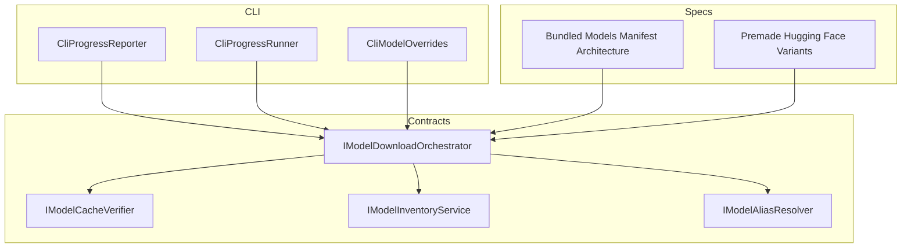
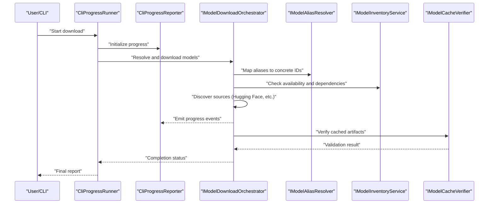
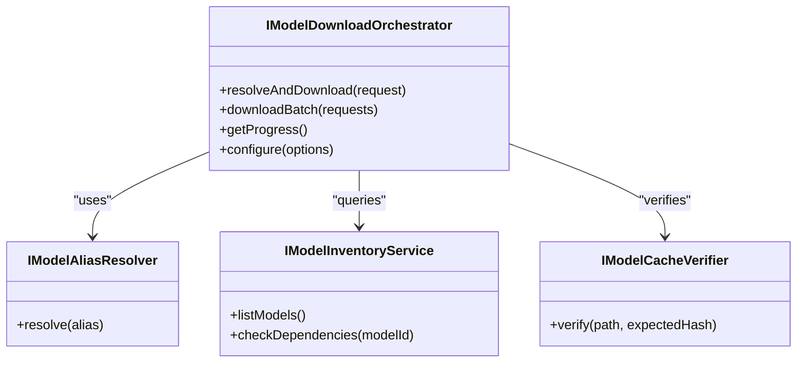
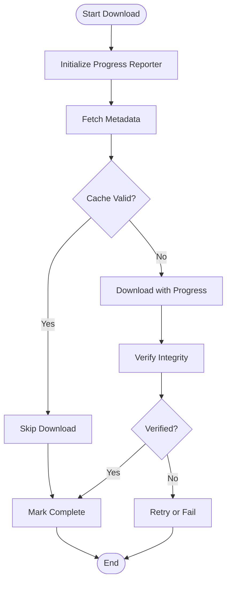
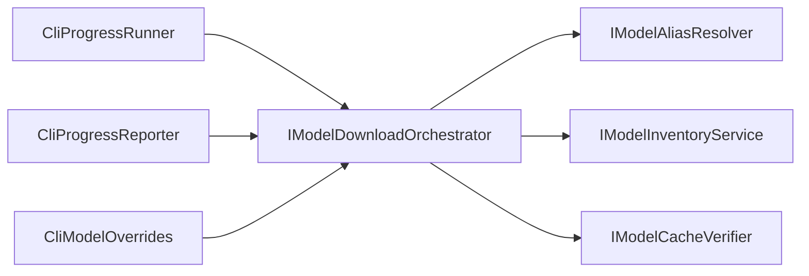

# Model Download & Caching

<cite>
**Referenced Files in This Document**
- [IModelDownloadOrchestrator.cs](file://src/Trackdub.Contracts/IModelDownloadOrchestrator.cs)
- [IModelCacheVerifier.cs](file://src/Trackdub.Contracts/IModelCacheVerifier.cs)
- [IModelInventoryService.cs](file://src/Trackdub.Contracts/IModelInventoryService.cs)
- [IModelAliasResolver.cs](file://src/Trackdub.Contracts/IModelAliasResolver.cs)
- [CliProgressReporter.cs](file://src/Trackdub.Cli/CliProgressReporter.cs)
- [CliProgressRunner.cs](file://src/Trackdub.Cli/CliProgressRunner.cs)
- [CliModelOverrides.cs](file://src/Trackdub.Cli/CliModelOverrides.cs)
- [Bundled Models Manifest Architecture](file://docs/specs/bundled-models-manifest-architecture.md)
- [Premade Hugging Face Variants](file://docs/specs/premade-hf-variants.md)
</cite>

## Table of Contents
1. [Introduction](#introduction)
2. [Project Structure](#project-structure)
3. [Core Components](#core-components)
4. [Architecture Overview](#architecture-overview)
5. [Detailed Component Analysis](#detailed-component-analysis)
6. [Dependency Analysis](#dependency-analysis)
7. [Performance Considerations](#performance-considerations)
8. [Troubleshooting Guide](#troubleshooting-guide)
9. [Conclusion](#conclusion)

## Introduction
This document explains Trackdub’s model download and caching system. It covers the orchestrator that coordinates downloads, automatic discovery from Hugging Face and other sources, progress tracking during downloads, caching strategy and storage locations, cache management policies, verification via hash validation and integrity checks, manifest-driven metadata and versioning, configuration for download behavior (including proxy and offline mode), troubleshooting common issues, batch downloading capabilities, and automated provisioning strategies.

## Project Structure
The model download and caching system is primarily defined by contracts and CLI utilities:
- Contracts define the orchestrator, cache verifier, inventory service, and alias resolver interfaces.
- CLI components provide progress reporting and runner abstractions used during downloads.
- Specs describe bundled models manifests and preconfigured Hugging Face variants.

**Diagram sources**
- [IModelDownloadOrchestrator.cs](file://src/Trackdub.Contracts/IModelDownloadOrchestrator.cs)
- [IModelCacheVerifier.cs](file://src/Trackdub.Contracts/IModelCacheVerifier.cs)
- [IModelInventoryService.cs](file://src/Trackdub.Contracts/IModelInventoryService.cs)
- [IModelAliasResolver.cs](file://src/Trackdub.Contracts/IModelAliasResolver.cs)
- [CliProgressReporter.cs](file://src/Trackdub.Cli/CliProgressReporter.cs)
- [CliProgressRunner.cs](file://src/Trackdub.Cli/CliProgressRunner.cs)
- [CliModelOverrides.cs](file://src/Trackdub.Cli/CliModelOverrides.cs)
- [Bundled Models Manifest Architecture](file://docs/specs/bundled-models-manifest-architecture.md)
- [Premade Hugging Face Variants](file://docs/specs/premade-hf-variants.md)

**Section sources**
- [IModelDownloadOrchestrator.cs](file://src/Trackdub.Contracts/IModelDownloadOrchestrator.cs)
- [IModelCacheVerifier.cs](file://src/Trackdub.Contracts/IModelCacheVerifier.cs)
- [IModelInventoryService.cs](file://src/Trackdub.Contracts/IModelInventoryService.cs)
- [IModelAliasResolver.cs](file://src/Trackdub.Contracts/IModelAliasResolver.cs)
- [CliProgressReporter.cs](file://src/Trackdub.Cli/CliProgressReporter.cs)
- [CliProgressRunner.cs](file://src/Trackdub.Cli/CliProgressRunner.cs)
- [CliModelOverrides.cs](file://src/Trackdub.Cli/CliModelOverrides.cs)
- [Bundled Models Manifest Architecture](file://docs/specs/bundled-models-manifest-architecture.md)
- [Premade Hugging Face Variants](file://docs/specs/premade-hf-variants.md)

## Core Components
- Model Download Orchestrator: Coordinates discovery, resolution, download, verification, and caching of models across multiple sources.
- Cache Verifier: Validates cached artifacts using hashes and integrity checks before use.
- Inventory Service: Tracks available models, versions, and dependencies; supports querying and listing.
- Alias Resolver: Maps logical model names or aliases to concrete repository identifiers and versions.
- Progress Reporting: Provides user-visible progress updates during downloads.
- CLI Overrides: Allows runtime configuration overrides for model sources and behaviors.

**Section sources**
- [IModelDownloadOrchestrator.cs](file://src/Trackdub.Contracts/IModelDownloadOrchestrator.cs)
- [IModelCacheVerifier.cs](file://src/Trackdub.Contracts/IModelCacheVerifier.cs)
- [IModelInventoryService.cs](file://src/Trackdub.Contracts/IModelInventoryService.cs)
- [IModelAliasResolver.cs](file://src/Trackdub.Contracts/IModelAliasResolver.cs)
- [CliProgressReporter.cs](file://src/Trackdub.Cli/CliProgressReporter.cs)
- [CliProgressRunner.cs](file://src/Trackdub.Cli/CliProgressRunner.cs)
- [CliModelOverrides.cs](file://src/Trackdub.Cli/CliModelOverrides.cs)

## Architecture Overview
The download pipeline integrates discovery, resolution, download, verification, and caching with progress feedback and configuration overrides.

**Diagram sources**
- [CliProgressRunner.cs](file://src/Trackdub.Cli/CliProgressRunner.cs)
- [CliProgressReporter.cs](file://src/Trackdub.Cli/CliProgressReporter.cs)
- [IModelDownloadOrchestrator.cs](file://src/Trackdub.Contracts/IModelDownloadOrchestrator.cs)
- [IModelAliasResolver.cs](file://src/Trackdub.Contracts/IModelAliasResolver.cs)
- [IModelInventoryService.cs](file://src/Trackdub.Contracts/IModelInventoryService.cs)
- [IModelCacheVerifier.cs](file://src/Trackdub.Contracts/IModelCacheVerifier.cs)

## Detailed Component Analysis

### Model Download Orchestrator
Responsibilities:
- Discover models from configured sources (e.g., Hugging Face).
- Resolve aliases to concrete repository identifiers and versions.
- Manage dependency resolution and ordering.
- Orchestrate download, resume, retry, and concurrency control.
- Integrate with cache verifier to ensure integrity before use.
- Emit progress events through a reporter abstraction.

Key interactions:
- Uses alias resolver to normalize inputs.
- Queries inventory for availability and metadata.
- Delegates verification to cache verifier.
- Integrates with CLI progress reporting.

**Diagram sources**
- [IModelDownloadOrchestrator.cs](file://src/Trackdub.Contracts/IModelDownloadOrchestrator.cs)
- [IModelAliasResolver.cs](file://src/Trackdub.Contracts/IModelAliasResolver.cs)
- [IModelInventoryService.cs](file://src/Trackdub.Contracts/IModelInventoryService.cs)
- [IModelCacheVerifier.cs](file://src/Trackdub.Contracts/IModelCacheVerifier.cs)

**Section sources**
- [IModelDownloadOrchestrator.cs](file://src/Trackdub.Contracts/IModelDownloadOrchestrator.cs)

### Automatic Discovery from Hugging Face and Other Sources
- Supports predefined variant catalogs and manifest-driven discovery.
- Enables source-specific resolvers to map aliases to repository paths and tags.
- Allows extension points for additional sources beyond Hugging Face.

Relevant specs:
- Bundled models manifest architecture defines how model metadata and versions are described.
- Premade Hugging Face variants catalog provides ready-to-use model references.

**Section sources**
- [Bundled Models Manifest Architecture](file://docs/specs/bundled-models-manifest-architecture.md)
- [Premade Hugging Face Variants](file://docs/specs/premade-hf-variants.md)

### Progress Tracking During Downloads
- CLI progress reporter emits structured progress events.
- Progress runner coordinates lifecycle and presentation of download status.
- Orchestrator integrates with reporters to update users on throughput, ETA, and completion.

**Diagram sources**
- [CliProgressReporter.cs](file://src/Trackdub.Cli/CliProgressReporter.cs)
- [CliProgressRunner.cs](file://src/Trackdub.Cli/CliProgressRunner.cs)
- [IModelDownloadOrchestrator.cs](file://src/Trackdub.Contracts/IModelDownloadOrchestrator.cs)

**Section sources**
- [CliProgressReporter.cs](file://src/Trackdub.Cli/CliProgressReporter.cs)
- [CliProgressRunner.cs](file://src/Trackdub.Cli/CliProgressRunner.cs)

### Caching Strategy, Storage Locations, and Policies
- Cached artifacts are validated before reuse via hash verification.
- Storage locations are abstracted behind services to support platform-specific paths.
- Cache policies include:
  - Hash-based invalidation on content changes.
  - Dependency-aware pruning when upstream models change.
  - Optional retention limits and cleanup routines.

Verification flow ensures only trusted, intact artifacts are loaded into inference pipelines.

**Section sources**
- [IModelCacheVerifier.cs](file://src/Trackdub.Contracts/IModelCacheVerifier.cs)

### Model Verification: Hash Validation and Integrity Checks
- The cache verifier computes and compares hashes against expected values.
- Integrity checks prevent corrupted or tampered models from loading.
- Failure triggers retries or fallback strategies depending on configuration.

**Section sources**
- [IModelCacheVerifier.cs](file://src/Trackdub.Contracts/IModelCacheVerifier.cs)

### Manifest System: Metadata, Versioning, and Dependencies
- Manifests define model metadata, supported versions, and dependencies.
- Version pinning ensures reproducibility across environments.
- Dependency resolution guarantees required companion files are present.

**Section sources**
- [Bundled Models Manifest Architecture](file://docs/specs/bundled-models-manifest-architecture.md)

### Configuration Options: Download Behavior, Proxy Settings, Offline Mode
- CLI model overrides allow runtime adjustments to sources, proxies, and behavior flags.
- Offline mode can skip network calls and rely on cached artifacts.
- Proxy settings enable corporate or restricted network environments.

**Section sources**
- [CliModelOverrides.cs](file://src/Trackdub.Cli/CliModelOverrides.cs)

### Batch Downloading and Automated Provisioning
- Orchestrator supports batch operations to download multiple models concurrently.
- Automated provisioning leverages manifests and inventories to provision required models at startup or deployment time.
- Batch jobs integrate with progress reporting and error handling.

**Section sources**
- [IModelDownloadOrchestrator.cs](file://src/Trackdub.Contracts/IModelDownloadOrchestrator.cs)

## Dependency Analysis
The orchestrator depends on alias resolution, inventory queries, and cache verification. CLI components provide progress and runner orchestration.

**Diagram sources**
- [IModelDownloadOrchestrator.cs](file://src/Trackdub.Contracts/IModelDownloadOrchestrator.cs)
- [IModelAliasResolver.cs](file://src/Trackdub.Contracts/IModelAliasResolver.cs)
- [IModelInventoryService.cs](file://src/Trackdub.Contracts/IModelInventoryService.cs)
- [IModelCacheVerifier.cs](file://src/Trackdub.Contracts/IModelCacheVerifier.cs)
- [CliProgressRunner.cs](file://src/Trackdub.Cli/CliProgressRunner.cs)
- [CliProgressReporter.cs](file://src/Trackdub.Cli/CliProgressReporter.cs)
- [CliModelOverrides.cs](file://src/Trackdub.Cli/CliModelOverrides.cs)

**Section sources**
- [IModelDownloadOrchestrator.cs](file://src/Trackdub.Contracts/IModelDownloadOrchestrator.cs)
- [IModelAliasResolver.cs](file://src/Trackdub.Contracts/IModelAliasResolver.cs)
- [IModelInventoryService.cs](file://src/Trackdub.Contracts/IModelInventoryService.cs)
- [IModelCacheVerifier.cs](file://src/Trackdub.Contracts/IModelCacheVerifier.cs)
- [CliProgressRunner.cs](file://src/Trackdub.Cli/CliProgressRunner.cs)
- [CliProgressReporter.cs](file://src/Trackdub.Cli/CliProgressReporter.cs)
- [CliModelOverrides.cs](file://src/Trackdub.Cli/CliModelOverrides.cs)

## Performance Considerations
- Concurrency: Use parallel downloads where network bandwidth allows; throttle to avoid saturation.
- Resume: Support resumable downloads to mitigate transient failures.
- Caching: Prefer hash-based cache hits to reduce redundant transfers.
- Metadata Prefetch: Fetch minimal metadata first to decide whether full download is needed.
- Disk I/O: Stream writes to minimize memory usage for large models.

[No sources needed since this section provides general guidance]

## Troubleshooting Guide
Common issues and resolutions:
- Network errors:
  - Check proxy settings and connectivity.
  - Retry with backoff; consider switching to an alternate source if available.
- Integrity failures:
  - Clear corrupted cache entries and re-download.
  - Verify expected hashes match published values.
- Storage limitations:
  - Free disk space or adjust cache retention policies.
  - Move cache location to a drive with sufficient capacity.
- Offline mode:
  - Ensure all required models and dependencies are cached before enabling offline mode.
- Batch job failures:
  - Inspect per-model logs; isolate failing models and retry individually.

[No sources needed since this section provides general guidance]

## Conclusion
Trackdub’s model download and caching system combines robust orchestration, verification, and progress reporting with flexible configuration and manifest-driven metadata. By leveraging alias resolution, inventory checks, and hash-based integrity validation, it ensures reliable, secure, and efficient model provisioning across diverse environments.

[No sources needed since this section summarizes without analyzing specific files]