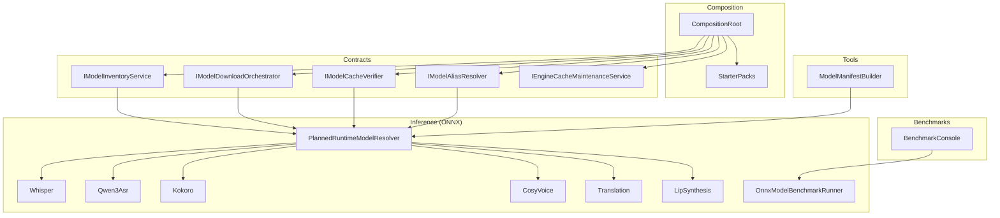
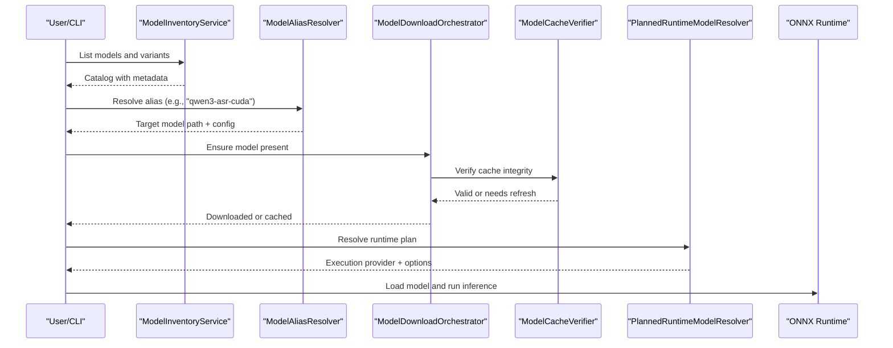
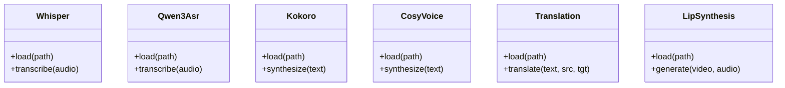
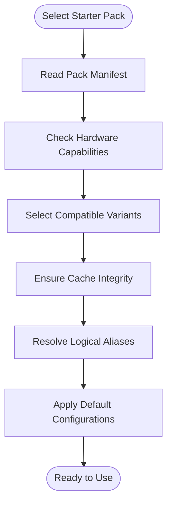
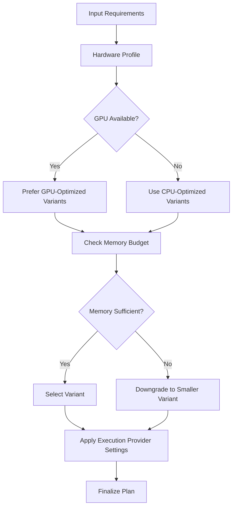
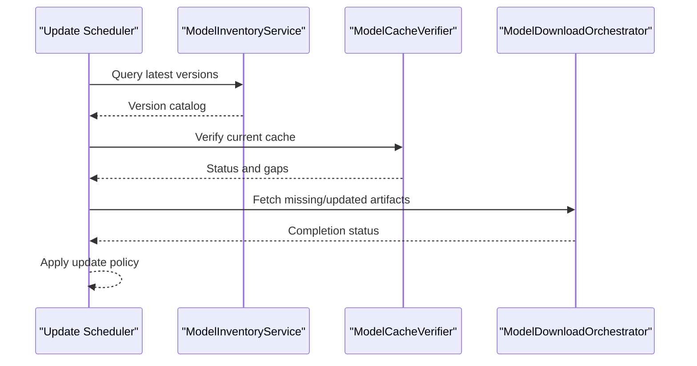
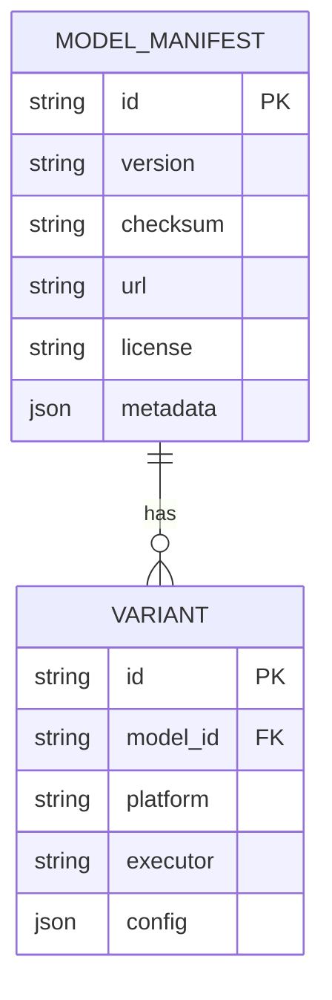
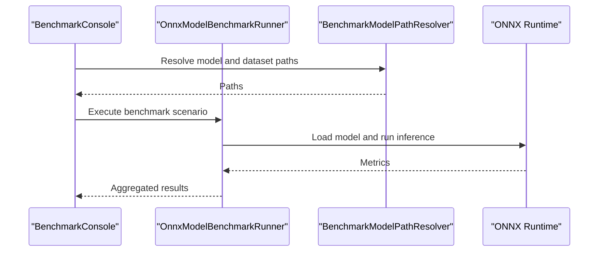
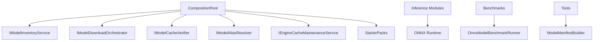

# Model Management & Optimization

<cite>
**Referenced Files in This Document**
- [README.md](file://README.md)
- [starter-packs-v1-design.md](file://docs/specs/starter-packs-v1-design.md)
- [bundled-models-manifest-architecture.md](file://docs/specs/bundled-models-manifest-architecture.md)
- [premade-hf-variants.md](file://docs/specs/premade-hf-variants.md)
- [MODEL_LICENSE_POLICY.md](file://docs/legal/MODEL_LICENSE_POLICY.md)
- [third-party-notices.md](file://docs/legal/THIRD_PARTY_NOTICES.md)
- [Trackdub.Contracts.csproj](file://src/Trackdub.Contracts/Trackdub.Contracts.csproj)
- [IModelInventoryService.cs](file://src/Trackdub.Contracts/IModelInventoryService.cs)
- [IModelDownloadOrchestrator.cs](file://src/Trackdub.Contracts/IModelDownloadOrchestrator.cs)
- [IModelCacheVerifier.cs](file://src/Trackdub.Contracts/IModelCacheVerifier.cs)
- [IModelAliasResolver.cs](file://src/Trackdub.Contracts/IModelAliasResolver.cs)
- [IEngineCacheMaintenanceService.cs](file://src/Trackdub.Contracts/IEngineCacheMaintenanceService.cs)
- [CompositionRoot.cs](file://src/Trackdub.Composition/CompositionRoot.cs)
- [StarterPacks/](file://src/Trackdub.Composition/StarterPacks/)
- [Trackdub.Inference.Onnx.csproj](file://src/Trackdub.Inference.Onnx/Trackdub.Inference.Onnx.csproj)
- [Whisper/](file://src/Trackdub.Inference.Onnx/Whisper/)
- [Qwen3Asr/](file://src/Trackdub.Inference.Onnx/Qwen3Asr/)
- [Kokoro/](file://src/Trackdub.Inference.Onnx/Kokoro/)
- [CosyVoice/](file://src/Trackdub.Inference.Onnx/CosyVoice/)
- [Translation/](file://src/Trackdub.Inference.Onnx/Translation/)
- [LipSynthesis/](file://src/Trackdub.Inference.Onnx/LipSynthesis/)
- [OnnxModelBenchmarkRunner.cs](file://src/Trackdub.Inference.Onnx/OnnxModelBenchmarkRunner.cs)
- [PlannedRuntimeModelResolver.cs](file://src/Trackdub.Inference.Onnx/PlannedRuntimeModelResolver.cs)
- [BenchmarkModelPathResolver.cs](file://src/Trackdub.Inference.Onnx/BenchmarkModelPathResolver.cs)
- [Trackdub.Benchmarks.csproj](file://src/Trackdub.Benchmarks/Trackdub.Benchmarks.csproj)
- [BenchmarkConsole.cs](file://src/Trackdub.Benchmarks/BenchmarkConsole.cs)
- [Trackdub.Tools.csproj](file://src/Trackdub.Tools/Trackdub.Tools.csproj)
- [ModelManifestBuilder/](file://src/Trackdub.Tools/ModelManifestBuilder/)
- [runtime/trt-rtx-ep.manifest.json](file://runtime/trt-rtx-ep.manifest.json)
</cite>

## Table of Contents
1. Introduction
2. Project Structure
3. Core Components
4. Architecture Overview
5. Detailed Component Analysis
6. Dependency Analysis
7. Performance Considerations
8. Troubleshooting Guide
9. Conclusion
10. Appendices

## Introduction
This document explains Trackdub’s model management system end-to-end: how models are discovered, downloaded, cached, optimized, and selected for different hardware and use cases. It covers supported model types (ASR, TTS, translation, lip-sync), the starter pack system, manifest formats, automatic updates, performance benchmarking tools, compatibility checks, licensing and security considerations, and distribution strategies. The goal is to help both developers and operators select optimal models and maintain a robust, secure, and high-performance inference pipeline.

## Project Structure
Trackdub organizes model-related functionality across contracts, composition, inference implementations, benchmarks, and tooling:
- Contracts define interfaces for inventory, download orchestration, cache verification, alias resolution, and engine maintenance.
- Composition wires up concrete implementations and starter packs.
- Inference modules implement ASR, TTS, translation, and lip-sync with ONNX-based runtimes and execution providers.
- Benchmarks provide CLI and programmatic tools to measure latency and throughput.
- Tools include a manifest builder and utilities for model curation.

**Diagram sources**
- [CompositionRoot.cs](file://src/Trackdub.Composition/CompositionRoot.cs)
- [IModelInventoryService.cs](file://src/Trackdub.Contracts/IModelInventoryService.cs)
- [IModelDownloadOrchestrator.cs](file://src/Trackdub.Contracts/IModelDownloadOrchestrator.cs)
- [IModelCacheVerifier.cs](file://src/Trackdub.Contracts/IModelCacheVerifier.cs)
- [IModelAliasResolver.cs](file://src/Trackdub.Contracts/IModelAliasResolver.cs)
- [IEngineCacheMaintenanceService.cs](file://src/Trackdub.Contracts/IEngineCacheMaintenanceService.cs)
- [PlannedRuntimeModelResolver.cs](file://src/Trackdub.Inference.Onnx/PlannedRuntimeModelResolver.cs)
- [OnnxModelBenchmarkRunner.cs](file://src/Trackdub.Inference.Onnx/OnnxModelBenchmarkRunner.cs)
- [BenchmarkConsole.cs](file://src/Trackdub.Benchmarks/BenchmarkConsole.cs)
- [ModelManifestBuilder/](file://src/Trackdub.Tools/ModelManifestBuilder/)

**Section sources**
- [README.md](file://README.md)
- [starter-packs-v1-design.md](file://docs/specs/starter-packs-v1-design.md)
- [bundled-models-manifest-architecture.md](file://docs/specs/bundled-models-manifest-architecture.md)
- [premade-hf-variants.md](file://docs/specs/premade-hf-variants.md)

## Core Components
- Model Inventory Service: Provides discovery, listing, and metadata for available models and variants.
- Download Orchestrator: Manages fetching models from remote registries or local mirrors, with retries and progress reporting.
- Cache Verifier: Validates integrity and freshness of cached artifacts; supports checksums and version tags.
- Alias Resolver: Maps logical aliases (e.g., “whisper-small-cuda”) to concrete model paths and runtime configurations.
- Engine Cache Maintenance: Periodic cleanup, compaction, and optimization of engine caches.

These components are exposed via well-defined interfaces and composed at startup to form a cohesive model lifecycle.

**Section sources**
- [IModelInventoryService.cs](file://src/Trackdub.Contracts/IModelInventoryService.cs)
- [IModelDownloadOrchestrator.cs](file://src/Trackdub.Contracts/IModelDownloadOrchestrator.cs)
- [IModelCacheVerifier.cs](file://src/Trackdub.Contracts/IModelCacheVerifier.cs)
- [IModelAliasResolver.cs](file://src/Trackdub.Contracts/IModelAliasResolver.cs)
- [IEngineCacheMaintenanceService.cs](file://src/Trackdub.Contracts/IEngineCacheMaintenanceService.cs)

## Architecture Overview
The model management architecture integrates discovery, selection, download, caching, and runtime resolution:
- Discovery reads manifests and catalogs to enumerate supported models and variants.
- Selection considers hardware capabilities, license constraints, and user preferences.
- Download orchestrates retrieval and verifies artifacts into a managed cache.
- Alias resolution maps logical names to concrete model files and execution provider settings.
- Benchmarking validates performance characteristics and guides selection.

**Diagram sources**
- [IModelInventoryService.cs](file://src/Trackdub.Contracts/IModelInventoryService.cs)
- [IModelAliasResolver.cs](file://src/Trackdub.Contracts/IModelAliasResolver.cs)
- [IModelDownloadOrchestrator.cs](file://src/Trackdub.Contracts/IModelDownloadOrchestrator.cs)
- [IModelCacheVerifier.cs](file://src/Trackdub.Contracts/IModelCacheVerifier.cs)
- [PlannedRuntimeModelResolver.cs](file://src/Trackdub.Inference.Onnx/PlannedRuntimeModelResolver.cs)

## Detailed Component Analysis

### Model Types Supported
- ASR Models: Whisper variants and Qwen3-based ASR models.
- TTS Engines: Kokoro and CosyVoice engines.
- Translation Services: Multilingual translation models integrated via ONNX pipelines.
- Lip-Sync Models: Lip synthesis models for visual synchronization.

Each type has dedicated implementation folders under the ONNX inference module, providing consistent loading, configuration, and execution provider selection.

**Diagram sources**
- [Whisper/](file://src/Trackdub.Inference.Onnx/Whisper/)
- [Qwen3Asr/](file://src/Trackdub.Inference.Onnx/Qwen3Asr/)
- [Kokoro/](file://src/Trackdub.Inference.Onnx/Kokoro/)
- [CosyVoice/](file://src/Trackdub.Inference.Onnx/CosyVoice/)
- [Translation/](file://src/Trackdub.Inference.Onnx/Translation/)
- [LipSynthesis/](file://src/Trackdub.Inference.Onnx/LipSynthesis/)

**Section sources**
- [Trackdub.Inference.Onnx.csproj](file://src/Trackdub.Inference.Onnx/Trackdub.Inference.Onnx.csproj)
- [Whisper/](file://src/Trackdub.Inference.Onnx/Whisper/)
- [Qwen3Asr/](file://src/Trackdub.Inference.Onnx/Qwen3Asr/)
- [Kokoro/](file://src/Trackdub.Inference.Onnx/Kokoro/)
- [CosyVoice/](file://src/Trackdub.Inference.Onnx/CosyVoice/)
- [Translation/](file://src/Trackdub.Inference.Onnx/Translation/)
- [LipSynthesis/](file://src/Trackdub.Inference.Onnx/LipSynthesis/)

### Starter Packs System
Starter packs bundle curated sets of models and configurations tailored for common workflows and hardware profiles. They simplify onboarding by pre-selecting compatible variants and default execution providers.

Key aspects:
- Curated bundles per domain (ASR, TTS, translation, lip-sync).
- Hardware-aware defaults (CPU, CUDA, WebGPU, etc.).
- Version pinning and update channels.
- Manifest-driven composition with provenance and checksums.

**Diagram sources**
- [starter-packs-v1-design.md](file://docs/specs/starter-packs-v1-design.md)
- [bundled-models-manifest-architecture.md](file://docs/specs/bundled-models-manifest-architecture.md)

**Section sources**
- [starter-packs-v1-design.md](file://docs/specs/starter-packs-v1-design.md)
- [bundled-models-manifest-architecture.md](file://docs/specs/bundled-models-manifest-architecture.md)

### Model Variant Selection and Hardware Optimizations
Variant selection balances quality, speed, and resource usage:
- Small/medium/large variants for ASR and LLMs.
- Quantized or optimized builds for constrained environments.
- Execution provider-specific optimizations (CUDA, TensorRT-RTX, OpenVINO, etc.).

Selection logic uses hardware profiling and manifest metadata to pick the best fit.

**Diagram sources**
- [premade-hf-variants.md](file://docs/specs/premade-hf-variants.md)
- [PlannedRuntimeModelResolver.cs](file://src/Trackdub.Inference.Onnx/PlannedRuntimeModelResolver.cs)

**Section sources**
- [premade-hf-variants.md](file://docs/specs/premade-hf-variants.md)
- [PlannedRuntimeModelResolver.cs](file://src/Trackdub.Inference.Onnx/PlannedRuntimeModelResolver.cs)

### Model Inventory Service
The inventory service exposes:
- Listing of available models and variants.
- Metadata such as size, supported languages, licenses, and provenance.
- Filtering by hardware compatibility and update channel.

It integrates with manifests and catalogs to keep the view current.

**Section sources**
- [IModelInventoryService.cs](file://src/Trackdub.Contracts/IModelInventoryService.cs)

### Cache Management and Automatic Updates
Cache management ensures:
- Integrity verification via checksums and signatures.
- Freshness checks against remote manifests.
- Cleanup of obsolete artifacts and compaction.

Automatic updates:
- Periodic checks for newer versions.
- Safe rollback on failed updates.
- Update channel policies (stable vs. preview).

**Diagram sources**
- [IModelInventoryService.cs](file://src/Trackdub.Contracts/IModelInventoryService.cs)
- [IModelCacheVerifier.cs](file://src/Trackdub.Contracts/IModelCacheVerifier.cs)
- [IModelDownloadOrchestrator.cs](file://src/Trackdub.Contracts/IModelDownloadOrchestrator.cs)

**Section sources**
- [IModelCacheVerifier.cs](file://src/Trackdub.Contracts/IModelCacheVerifier.cs)
- [IModelDownloadOrchestrator.cs](file://src/Trackdub.Contracts/IModelDownloadOrchestrator.cs)

### Model Configuration Files and Manifest Formats
Manifests describe:
- Model identity, version, and provenance.
- Supported platforms and execution providers.
- Checksums, sizes, and URLs.
- License metadata and compliance flags.

Configuration files include:
- Execution provider preferences.
- Quantization and optimization flags.
- Language and feature toggles.

**Diagram sources**
- [bundled-models-manifest-architecture.md](file://docs/specs/bundled-models-manifest-architecture.md)

**Section sources**
- [bundled-models-manifest-architecture.md](file://docs/specs/bundled-models-manifest-architecture.md)

### Custom Model Integration
Custom models can be integrated by:
- Providing a manifest compliant with the schema.
- Implementing an adapter if needed for non-standard formats.
- Registering aliases and execution provider settings.

Integration points:
- Alias resolver mappings.
- Runtime model resolver hooks.
- Cache verifier extensions.

**Section sources**
- [IModelAliasResolver.cs](file://src/Trackdub.Contracts/IModelAliasResolver.cs)
- [PlannedRuntimeModelResolver.cs](file://src/Trackdub.Inference.Onnx/PlannedRuntimeModelResolver.cs)

### Performance Benchmarking Tools
Benchmarking tools enable:
- Latency and throughput measurement across models and devices.
- Regression detection and variant comparison.
- Automated reports for CI and release validation.

Key components:
- OnnxModelBenchmarkRunner for ONNX-based runs.
- BenchmarkConsole CLI for interactive testing.
- Path resolvers for locating benchmark datasets and models.

**Diagram sources**
- [OnnxModelBenchmarkRunner.cs](file://src/Trackdub.Inference.Onnx/OnnxModelBenchmarkRunner.cs)
- [BenchmarkConsole.cs](file://src/Trackdub.Benchmarks/BenchmarkConsole.cs)
- [BenchmarkModelPathResolver.cs](file://src/Trackdub.Inference.Onnx/BenchmarkModelPathResolver.cs)

**Section sources**
- [OnnxModelBenchmarkRunner.cs](file://src/Trackdub.Inference.Onnx/OnnxModelBenchmarkRunner.cs)
- [BenchmarkConsole.cs](file://src/Trackdub.Benchmarks/BenchmarkConsole.cs)
- [BenchmarkModelPathResolver.cs](file://src/Trackdub.Inference.Onnx/BenchmarkModelPathResolver.cs)

### Compatibility Checking
Compatibility checks ensure:
- Hardware support for execution providers.
- Model format and version alignment.
- License and regional restrictions.

Checks are performed during alias resolution and before runtime initialization.

**Section sources**
- [PlannedRuntimeModelResolver.cs](file://src/Trackdub.Inference.Onnx/PlannedRuntimeModelResolver.cs)

### Troubleshooting Model Loading Issues
Common issues and resolutions:
- Missing or corrupted cache artifacts: Re-run cache verification and re-download.
- Execution provider not available: Install required dependencies or fallback to CPU.
- License violations: Review model license policy and adjust selections.
- Version mismatches: Align manifest versions and clear stale cache entries.

Operational guidance:
- Use cache verifier diagnostics.
- Inspect alias resolution logs.
- Validate execution provider readiness.

**Section sources**
- [IModelCacheVerifier.cs](file://src/Trackdub.Contracts/IModelCacheVerifier.cs)
- [IModelAliasResolver.cs](file://src/Trackdub.Contracts/IModelAliasResolver.cs)

## Dependency Analysis
Core dependencies and relationships:
- CompositionRoot wires contract interfaces to concrete implementations and starter packs.
- Inference modules depend on ONNX runtime and execution providers.
- Benchmarks depend on runners and path resolvers.
- Tools generate manifests and assist with model curation.

**Diagram sources**
- [CompositionRoot.cs](file://src/Trackdub.Composition/CompositionRoot.cs)
- [Trackdub.Inference.Onnx.csproj](file://src/Trackdub.Inference.Onnx/Trackdub.Inference.Onnx.csproj)
- [Trackdub.Benchmarks.csproj](file://src/Trackdub.Benchmarks/Trackdub.Benchmarks.csproj)
- [Trackdub.Tools.csproj](file://src/Trackdub.Tools/Trackdub.Tools.csproj)

**Section sources**
- [CompositionRoot.cs](file://src/Trackdub.Composition/CompositionRoot.cs)
- [Trackdub.Contracts.csproj](file://src/Trackdub.Contracts/Trackdub.Contracts.csproj)
- [Trackdub.Inference.Onnx.csproj](file://src/Trackdub.Inference.Onnx/Trackdub.Inference.Onnx.csproj)
- [Trackdub.Benchmarks.csproj](file://src/Trackdub.Benchmarks/Trackdub.Benchmarks.csproj)
- [Trackdub.Tools.csproj](file://src/Trackdub.Tools/Trackdub.Tools.csproj)

## Performance Considerations
- Prefer GPU-accelerated execution providers when available (CUDA, TensorRT-RTX).
- Use quantized or smaller variants for constrained environments.
- Leverage starter packs for pre-tuned configurations.
- Regularly benchmark new variants to detect regressions.
- Monitor memory budgets and adjust variant selection accordingly.

[No sources needed since this section provides general guidance]

## Troubleshooting Guide
- Verify cache integrity using the cache verifier.
- Check alias resolution logs for mapping errors.
- Ensure execution provider dependencies are installed.
- Review license compliance and regional restrictions.
- Use benchmarking tools to isolate performance bottlenecks.

**Section sources**
- [IModelCacheVerifier.cs](file://src/Trackdub.Contracts/IModelCacheVerifier.cs)
- [IModelAliasResolver.cs](file://src/Trackdub.Contracts/IModelAliasResolver.cs)

## Conclusion
Trackdub’s model management system provides a robust foundation for discovering, downloading, caching, optimizing, and selecting models across diverse hardware and use cases. By leveraging starter packs, manifests, and benchmarking tools, teams can maintain high performance, compliance, and reliability while integrating custom models seamlessly.

[No sources needed since this section summarizes without analyzing specific files]

## Appendices

### Licensing and Security Considerations
- Follow the model license policy to ensure compliance.
- Validate third-party notices and attribution requirements.
- Enforce security checks on downloaded artifacts and manifests.

**Section sources**
- [MODEL_LICENSE_POLICY.md](file://docs/legal/MODEL_LICENSE_POLICY.md)
- [third-party-notices.md](file://docs/legal/THIRD_PARTY_NOTICES.md)

### Distribution Strategies
- Publish curated starter packs for target audiences.
- Provide manifest repositories with checksums and signatures.
- Support multiple update channels for controlled rollout.

**Section sources**
- [starter-packs-v1-design.md](file://docs/specs/starter-packs-v1-design.md)
- [bundled-models-manifest-architecture.md](file://docs/specs/bundled-models-manifest-architecture.md)

### Execution Provider Manifests
Execution provider manifests define runtime capabilities and plugin locations.

**Section sources**
- [runtime/trt-rtx-ep.manifest.json](file://runtime/trt-rtx-ep.manifest.json)