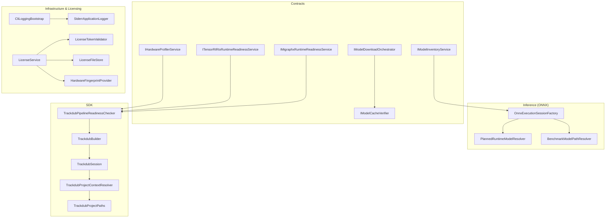
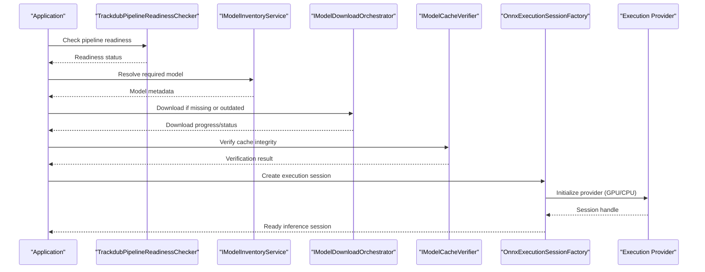
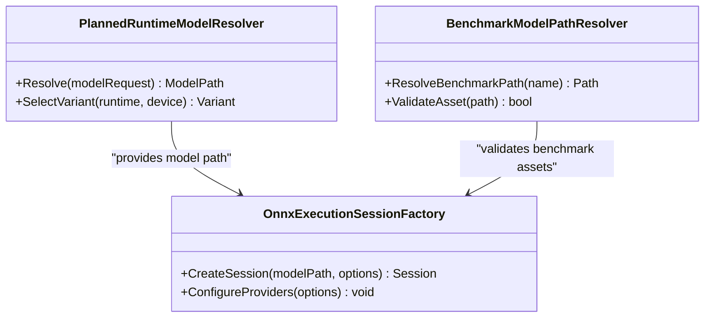
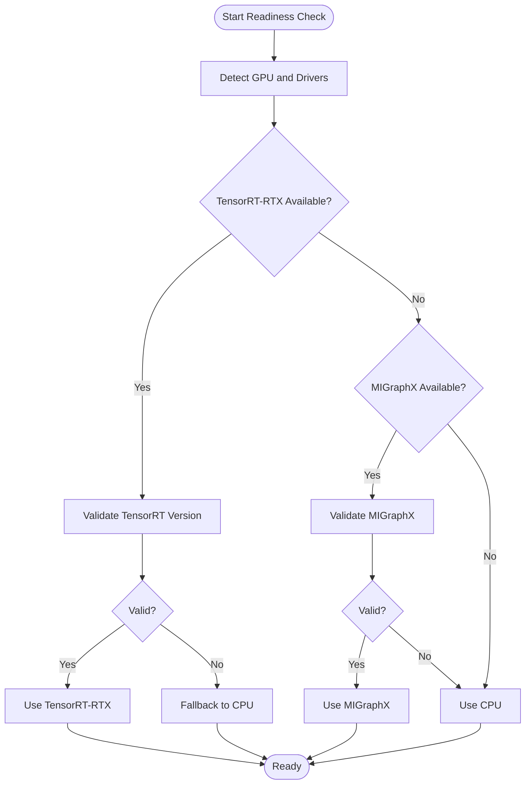
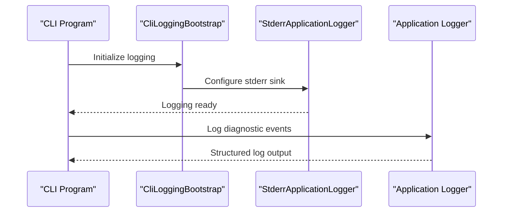
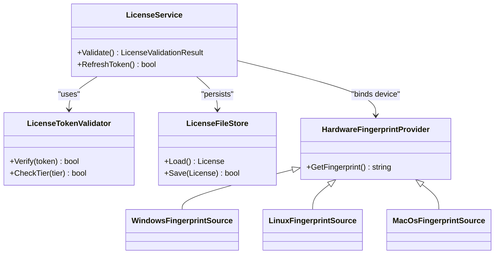
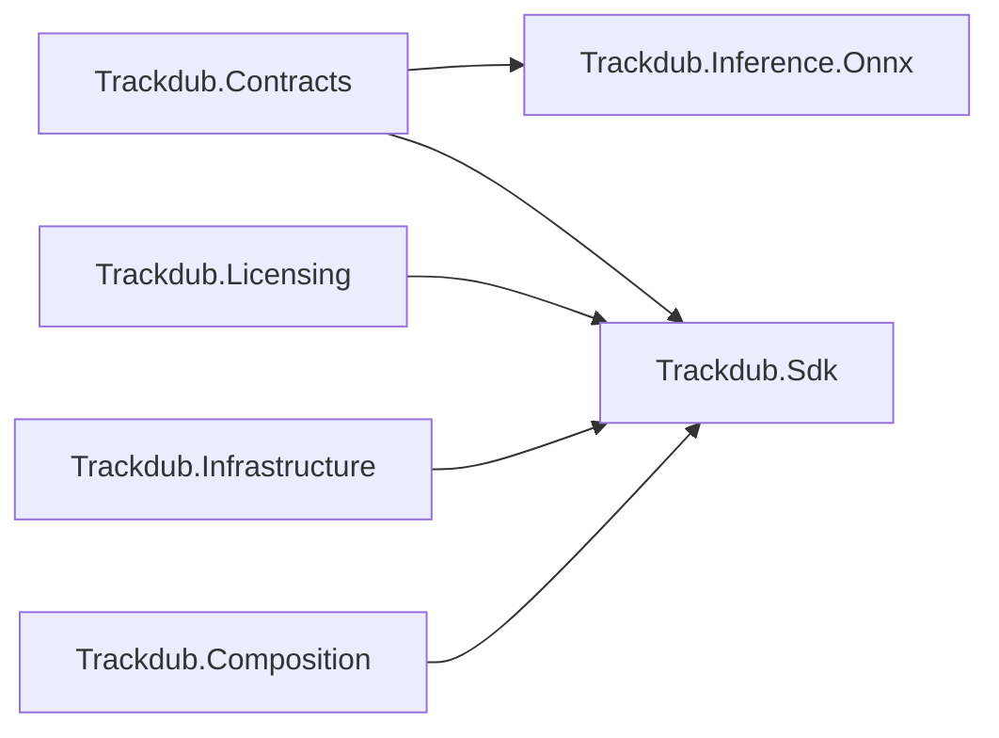

# Model Troubleshooting & Diagnostics

<cite>
**Referenced Files in This Document**
- [TROUBLESHOOTING.md](file://docs/development/TROUBLESHOOTING.md)
- [MODEL_LICENSE_POLICY.md](file://docs/legal/MODEL_LICENSE_POLICY.md)
- [Trackdub.Contracts.csproj](file://src/Trackdub.Contracts/Trackdub.Contracts.csproj)
- [Trackdub.Infrastructure.csproj](file://src/Trackdub.Infrastructure/Trackdub.Infrastructure.csproj)
- [Trackdub.Inference.Onnx.csproj](file://src/Trackdub.Inference.Onnx/Trackdub.Inference.Onnx.csproj)
- [Trackdub.Licensing.csproj](file://src/Trackdub.Licensing/Trackdub.Licensing.csproj)
- [CompositionRoot.cs](file://src/Trackdub.Composition/CompositionRoot.cs)
- [Program.cs](file://src/Trackdub.Cli/Program.cs)
- [CliLoggingBootstrap.cs](file://src/Trackdub.Cli/CliLoggingBootstrap.cs)
- [StderrApplicationLogger.cs](file://src/Trackdub.Cli/StderrApplicationLogger.cs)
- [IModelInventoryService.cs](file://src/Trackdub.Contracts/IModelInventoryService.cs)
- [IModelDownloadOrchestrator.cs](file://src/Trackdub.Contracts/IModelDownloadOrchestrator.cs)
- [IModelCacheVerifier.cs](file://src/Trackdub.Contracts/IModelCacheVerifier.cs)
- [IHardwareProfilerService.cs](file://src/Trackdub.Contracts/IHardwareProfilerService.cs)
- [ITensorRtRtxRuntimeReadinessService.cs](file://src/Trackdub.Contracts/ITensorRtRtxRuntimeReadinessService.cs)
- [IMigraphxRuntimeReadinessService.cs](file://src/Trackdub.Contracts/IMigraphxRuntimeReadinessService.cs)
- [WinMlCatalogRuntimeReadinessServices.cs](file://src/Trackdub.Contracts/WinMlCatalogRuntimeReadinessServices.cs)
- [LicenseService.cs](file://src/Trackdub.Licensing/LicenseService.cs)
- [LicenseTokenValidator.cs](file://src/Trackdub.Licensing/LicenseTokenValidator.cs)
- [LicenseFileStore.cs](file://src/Trackdub.Licensing/LicenseFileStore.cs)
- [HardwareFingerprintProvider.cs](file://src/Trackdub.Licensing/HardwareFingerprintProvider.cs)
- [WindowsFingerprintSource.cs](file://src/Trackdub.Licensing/WindowsFingerprintSource.cs)
- [LinuxFingerprintSource.cs](file://src/Trackdub.Licensing/LinuxFingerprintSource.cs)
- [MacOsFingerprintSource.cs](file://src/Trackdub.Licensing/MacOsFingerprintSource.cs)
- [OnnxExecutionSessionFactory.cs](file://src/Trackdub.Inference.Onnx/OnnxExecutionSessionFactory.cs)
- [PlannedRuntimeModelResolver.cs](file://src/Trackdub.Inference.Onnx/PlannedRuntimeModelResolver.cs)
- [BenchmarkModelPathResolver.cs](file://src/Trackdub.Inference.Onnx/BenchmarkModelPathResolver.cs)
- [TrackdubPipelineReadinessChecker.cs](file://src/Trackdub.Sdk/TrackdubPipelineReadinessChecker.cs)
- [TrackdubBuilder.cs](file://src/Trackdub.Sdk/TrackdubBuilder.cs)
- [TrackdubSession.cs](file://src/Trackdub.Sdk/TrackdubSession.cs)
- [TrackdubProjectContextResolver.cs](file://src/Trackdub.Sdk/TrackdubProjectContextResolver.cs)
- [TrackdubProjectPaths.cs](file://src/Trackdub.Sdk/TrackdubProjectPaths.cs)
- [NvidiaAfxProfile.cs](file://src/Trackdub.Contracts/NvidiaAfxProfile.cs)
- [HardwareProfiler.cs](file://src/Trackdub.Domain/HardwareProfiler.cs)
- [ModelRuntime.cs](file://src/Trackdub.Domain/ModelRuntime.cs)
</cite>

## Table of Contents
1. [Introduction](#introduction)
2. [Project Structure](#project-structure)
3. [Core Components](#core-components)
4. [Architecture Overview](#architecture-overview)
5. [Detailed Component Analysis](#detailed-component-analysis)
6. [Dependency Analysis](#dependency-analysis)
7. [Performance Considerations](#performance-considerations)
8. [Troubleshooting Guide](#troubleshooting-guide)
9. [Conclusion](#conclusion)
10. [Appendices](#appendices)

## Introduction
This document provides comprehensive troubleshooting guidance for model-related issues in Trackdub. It focuses on diagnosing and resolving common model loading errors, compatibility problems, performance bottlenecks, network download failures, cache corruption, storage constraints, licensing and authentication issues, and GPU acceleration failures. It also explains how to interpret error messages and stack traces, examine logs, and use built-in diagnostic tools and profiling techniques to identify and fix root causes.

## Project Structure
Trackdub organizes model management, diagnostics, and runtime readiness across several layers:
- Contracts define interfaces for model inventory, downloads, cache verification, hardware profiling, and runtime readiness services.
- Infrastructure and Composition provide implementations and wiring for logging, licensing, and runtime components.
- Inference modules implement ONNX execution session creation, model path resolution, and provider-specific optimizations (e.g., TensorRT-RTX, MIGraphX).
- Sdk exposes pipeline readiness checks and session/project context resolution utilities used by higher-level applications.

**Diagram sources**
- [IModelInventoryService.cs](file://src/Trackdub.Contracts/IModelInventoryService.cs)
- [IModelDownloadOrchestrator.cs](file://src/Trackdub.Contracts/IModelDownloadOrchestrator.cs)
- [IModelCacheVerifier.cs](file://src/Trackdub.Contracts/IModelCacheVerifier.cs)
- [IHardwareProfilerService.cs](file://src/Trackdub.Contracts/IHardwareProfilerService.cs)
- [ITensorRtRtxRuntimeReadinessService.cs](file://src/Trackdub.Contracts/ITensorRtRtxRuntimeReadinessService.cs)
- [IMigraphxRuntimeReadinessService.cs](file://src/Trackdub.Contracts/IMigraphxRuntimeReadinessService.cs)
- [OnnxExecutionSessionFactory.cs](file://src/Trackdub.Inference.Onnx/OnnxExecutionSessionFactory.cs)
- [PlannedRuntimeModelResolver.cs](file://src/Trackdub.Inference.Onnx/PlannedRuntimeModelResolver.cs)
- [BenchmarkModelPathResolver.cs](file://src/Trackdub.Inference.Onnx/BenchmarkModelPathResolver.cs)
- [TrackdubPipelineReadinessChecker.cs](file://src/Trackdub.Sdk/TrackdubPipelineReadinessChecker.cs)
- [TrackdubBuilder.cs](file://src/Trackdub.Sdk/TrackdubBuilder.cs)
- [TrackdubSession.cs](file://src/Trackdub.Sdk/TrackdubSession.cs)
- [TrackdubProjectContextResolver.cs](file://src/Trackdub.Sdk/TrackdubProjectContextResolver.cs)
- [TrackdubProjectPaths.cs](file://src/Trackdub.Sdk/TrackdubProjectPaths.cs)
- [CliLoggingBootstrap.cs](file://src/Trackdub.Cli/CliLoggingBootstrap.cs)
- [StderrApplicationLogger.cs](file://src/Trackdub.Cli/StderrApplicationLogger.cs)
- [LicenseService.cs](file://src/Trackdub.Licensing/LicenseService.cs)
- [LicenseTokenValidator.cs](file://src/Trackdub.Licensing/LicenseTokenValidator.cs)
- [LicenseFileStore.cs](file://src/Trackdub.Licensing/LicenseFileStore.cs)
- [HardwareFingerprintProvider.cs](file://src/Trackdub.Licensing/HardwareFingerprintProvider.cs)

**Section sources**
- [CompositionRoot.cs](file://src/Trackdub.Composition/CompositionRoot.cs)
- [Program.cs](file://src/Trackdub.Cli/Program.cs)

## Core Components
- Model Inventory and Downloads: Interfaces for querying available models, orchestrating downloads, and verifying caches ensure consistent model availability and integrity.
- Runtime Readiness Services: Providers for checking GPU acceleration capabilities (TensorRT-RTX, MIGraphX) and catalog-based Windows ML support.
- Execution Session Factory: Creates ONNX execution sessions with appropriate providers and configuration based on platform and hardware.
- Pipeline Readiness Checker: Validates environment, dependencies, and model prerequisites before running pipelines.
- Logging and Diagnostics: CLI bootstrap and application logger enable structured logging and stderr output for debugging.
- Licensing: License service, token validation, file store, and hardware fingerprinting manage access control and compliance.

**Section sources**
- [IModelInventoryService.cs](file://src/Trackdub.Contracts/IModelInventoryService.cs)
- [IModelDownloadOrchestrator.cs](file://src/Trackdub.Contracts/IModelDownloadOrchestrator.cs)
- [IModelCacheVerifier.cs](file://src/Trackdub.Contracts/IModelCacheVerifier.cs)
- [ITensorRtRtxRuntimeReadinessService.cs](file://src/Trackdub.Contracts/ITensorRtRtxRuntimeReadinessService.cs)
- [IMigraphxRuntimeReadinessService.cs](file://src/Trackdub.Contracts/IMigraphxRuntimeReadinessService.cs)
- [OnnxExecutionSessionFactory.cs](file://src/Trackdub.Inference.Onnx/OnnxExecutionSessionFactory.cs)
- [TrackdubPipelineReadinessChecker.cs](file://src/Trackdub.Sdk/TrackdubPipelineReadinessChecker.cs)
- [CliLoggingBootstrap.cs](file://src/Trackdub.Cli/CliLoggingBootstrap.cs)
- [StderrApplicationLogger.cs](file://src/Trackdub.Cli/StderrApplicationLogger.cs)
- [LicenseService.cs](file://src/Trackdub.Licensing/LicenseService.cs)

## Architecture Overview
The model lifecycle in Trackdub involves discovery, download, caching, validation, and execution. The following sequence illustrates a typical flow when a pipeline requires a model:

**Diagram sources**
- [TrackdubPipelineReadinessChecker.cs](file://src/Trackdub.Sdk/TrackdubPipelineReadinessChecker.cs)
- [IModelInventoryService.cs](file://src/Trackdub.Contracts/IModelInventoryService.cs)
- [IModelDownloadOrchestrator.cs](file://src/Trackdub.Contracts/IModelDownloadOrchestrator.cs)
- [IModelCacheVerifier.cs](file://src/Trackdub.Contracts/IModelCacheVerifier.cs)
- [OnnxExecutionSessionFactory.cs](file://src/Trackdub.Inference.Onnx/OnnxExecutionSessionFactory.cs)

## Detailed Component Analysis

### Model Loading and Resolution
- PlannedRuntimeModelResolver selects the correct model variant based on runtime and hardware preferences.
- BenchmarkModelPathResolver assists in locating benchmark assets and validating paths during profiling runs.
- OnnxExecutionSessionFactory configures execution providers and initializes sessions, handling provider-specific options and fallbacks.

**Diagram sources**
- [PlannedRuntimeModelResolver.cs](file://src/Trackdub.Inference.Onnx/PlannedRuntimeModelResolver.cs)
- [BenchmarkModelPathResolver.cs](file://src/Trackdub.Inference.Onnx/BenchmarkModelPathResolver.cs)
- [OnnxExecutionSessionFactory.cs](file://src/Trackdub.Inference.Onnx/OnnxExecutionSessionFactory.cs)

**Section sources**
- [PlannedRuntimeModelResolver.cs](file://src/Trackdub.Inference.Onnx/PlannedRuntimeModelResolver.cs)
- [BenchmarkModelPathResolver.cs](file://src/Trackdub.Inference.Onnx/BenchmarkModelPathResolver.cs)
- [OnnxExecutionSessionFactory.cs](file://src/Trackdub.Inference.Onnx/OnnxExecutionSessionFactory.cs)

### Runtime Readiness and Hardware Profiling
- ITensorRtRtxRuntimeReadinessService and IMigraphxRuntimeReadinessService check GPU acceleration availability and driver compatibility.
- WinMlCatalogRuntimeReadinessServices validates Windows ML catalog runtime support.
- IHardwareProfilerService and domain-level HardwareProfiler collect device capabilities and recommend optimal runtimes.

**Diagram sources**
- [ITensorRtRtxRuntimeReadinessService.cs](file://src/Trackdub.Contracts/ITensorRtRtxRuntimeReadinessService.cs)
- [IMigraphxRuntimeReadinessService.cs](file://src/Trackdub.Contracts/IMigraphxRuntimeReadinessService.cs)
- [WinMlCatalogRuntimeReadinessServices.cs](file://src/Trackdub.Contracts/WinMlCatalogRuntimeReadinessServices.cs)
- [IHardwareProfilerService.cs](file://src/Trackdub.Contracts/IHardwareProfilerService.cs)
- [HardwareProfiler.cs](file://src/Trackdub.Domain/HardwareProfiler.cs)

**Section sources**
- [ITensorRtRtxRuntimeReadinessService.cs](file://src/Trackdub.Contracts/ITensorRtRtxRuntimeReadinessService.cs)
- [IMigraphxRuntimeReadinessService.cs](file://src/Trackdub.Contracts/IMigraphxRuntimeReadinessService.cs)
- [WinMlCatalogRuntimeReadinessServices.cs](file://src/Trackdub.Contracts/WinMlCatalogRuntimeReadinessServices.cs)
- [IHardwareProfilerService.cs](file://src/Trackdub.Contracts/IHardwareProfilerService.cs)
- [HardwareProfiler.cs](file://src/Trackdub.Domain/HardwareProfiler.cs)

### Logging and Diagnostics
- CliLoggingBootstrap initializes logging infrastructure for CLI applications.
- StderrApplicationLogger writes structured logs to standard error for easy capture in CI and debugging sessions.
- Application-level contracts define logging interfaces used across modules.

**Diagram sources**
- [CliLoggingBootstrap.cs](file://src/Trackdub.Cli/CliLoggingBootstrap.cs)
- [StderrApplicationLogger.cs](file://src/Trackdub.Cli/StderrApplicationLogger.cs)

**Section sources**
- [CliLoggingBootstrap.cs](file://src/Trackdub.Cli/CliLoggingBootstrap.cs)
- [StderrApplicationLogger.cs](file://src/Trackdub.Cli/StderrApplicationLogger.cs)

### Licensing and Authentication
- LicenseService coordinates license validation, token parsing, and hardware fingerprinting.
- LicenseTokenValidator verifies tokens and enforces tier restrictions.
- LicenseFileStore persists licenses locally; HardwareFingerprintProvider generates device fingerprints using OS-specific sources.

**Diagram sources**
- [LicenseService.cs](file://src/Trackdub.Licensing/LicenseService.cs)
- [LicenseTokenValidator.cs](file://src/Trackdub.Licensing/LicenseTokenValidator.cs)
- [LicenseFileStore.cs](file://src/Trackdub.Licensing/LicenseFileStore.cs)
- [HardwareFingerprintProvider.cs](file://src/Trackdub.Licensing/HardwareFingerprintProvider.cs)
- [WindowsFingerprintSource.cs](file://src/Trackdub.Licensing/WindowsFingerprintSource.cs)
- [LinuxFingerprintSource.cs](file://src/Trackdub.Licensing/LinuxFingerprintSource.cs)
- [MacOsFingerprintSource.cs](file://src/Trackdub.Licensing/MacOsFingerprintSource.cs)

**Section sources**
- [LicenseService.cs](file://src/Trackdub.Licensing/LicenseService.cs)
- [LicenseTokenValidator.cs](file://src/Trackdub.Licensing/LicenseTokenValidator.cs)
- [LicenseFileStore.cs](file://src/Trackdub.Licensing/LicenseFileStore.cs)
- [HardwareFingerprintProvider.cs](file://src/Trackdub.Licensing/HardwareFingerprintProvider.cs)

## Dependency Analysis
Key project dependencies related to model operations:
- Contracts define core interfaces consumed by Inference and SDK layers.
- Inference.Onnx depends on contracts for model resolution and execution session creation.
- Licensing module is independent but integrated via composition roots and SDK sessions.

**Diagram sources**
- [Trackdub.Contracts.csproj](file://src/Trackdub.Contracts/Trackdub.Contracts.csproj)
- [Trackdub.Inference.Onnx.csproj](file://src/Trackdub.Inference.Onnx/Trackdub.Inference.Onnx.csproj)
- [Trackdub.Licensing.csproj](file://src/Trackdub.Licensing/Trackdub.Licensing.csproj)
- [Trackdub.Infrastructure.csproj](file://src/Trackdub.Infrastructure/Trackdub.Infrastructure.csproj)

**Section sources**
- [Trackdub.Contracts.csproj](file://src/Trackdub.Contracts/Trackdub.Contracts.csproj)
- [Trackdub.Inference.Onnx.csproj](file://src/Trackdub.Inference.Onnx/Trackdub.Inference.Onnx.csproj)
- [Trackdub.Licensing.csproj](file://src/Trackdub.Licensing/Trackdub.Licensing.csproj)
- [Trackdub.Infrastructure.csproj](file://src/Trackdub.Infrastructure/Trackdub.Infrastructure.csproj)

## Performance Considerations
- Prefer GPU acceleration when available: validate TensorRT-RTX or MIGraphX readiness before heavy workloads.
- Monitor memory usage: large models may require reduced batch sizes or quantized variants.
- Profile execution sessions: use benchmark resolvers and profiling hooks to identify bottlenecks.
- Cache warm-up: pre-warm frequently used models to reduce cold-start latency.
- Storage considerations: ensure sufficient disk space for model downloads and caches; verify checksums to avoid corrupted artifacts.

[No sources needed since this section provides general guidance]

## Troubleshooting Guide

### Common Model Loading Errors
- Symptom: Model not found or invalid path.
  - Actions:
    - Verify model inventory and requested variant.
    - Confirm download completion and cache integrity.
    - Inspect execution session creation logs for provider initialization failures.
  - Tools:
    - IModelInventoryService queries for available models.
    - IModelCacheVerifier validates cached artifacts.
    - OnnxExecutionSessionFactory logs provider setup details.

- Symptom: Wrong model variant selected.
  - Actions:
    - Review PlannedRuntimeModelResolver logic for runtime/device selection.
    - Adjust preferences or environment variables that influence variant choice.

- Symptom: Execution provider failure (GPU/CPU).
  - Actions:
    - Check ITensorRtRtxRuntimeReadinessService and IMigraphxRuntimeReadinessService outputs.
    - Validate drivers and runtime versions.
    - Fall back to CPU if GPU acceleration is unavailable.

**Section sources**
- [IModelInventoryService.cs](file://src/Trackdub.Contracts/IModelInventoryService.cs)
- [IModelCacheVerifier.cs](file://src/Trackdub.Contracts/IModelCacheVerifier.cs)
- [OnnxExecutionSessionFactory.cs](file://src/Trackdub.Inference.Onnx/OnnxExecutionSessionFactory.cs)
- [ITensorRtRtxRuntimeReadinessService.cs](file://src/Trackdub.Contracts/ITensorRtRtxRuntimeReadinessService.cs)
- [IMigraphxRuntimeReadinessService.cs](file://src/Trackdub.Contracts/IMigraphxRuntimeReadinessService.cs)

### Compatibility Problems
- Symptom: Model incompatible with runtime or hardware.
  - Actions:
    - Use PlannedRuntimeModelResolver to select compatible variants.
    - Validate hardware capabilities via IHardwareProfilerService and domain HardwareProfiler.
    - Ensure ONNX model version matches provider expectations.

- Symptom: Windows ML catalog mismatch.
  - Actions:
    - Check WinMlCatalogRuntimeReadinessServices for catalog version compatibility.
    - Update system components if necessary.

**Section sources**
- [PlannedRuntimeModelResolver.cs](file://src/Trackdub.Inference.Onnx/PlannedRuntimeModelResolver.cs)
- [IHardwareProfilerService.cs](file://src/Trackdub.Contracts/IHardwareProfilerService.cs)
- [HardwareProfiler.cs](file://src/Trackdub.Domain/HardwareProfiler.cs)
- [WinMlCatalogRuntimeReadinessServices.cs](file://src/Trackdub.Contracts/WinMlCatalogRuntimeReadinessServices.cs)

### Performance Issues
- Symptom: Slow inference or high memory usage.
  - Actions:
    - Profile execution sessions and identify hotspots.
    - Reduce batch size or switch to quantized models.
    - Enable GPU acceleration where supported.
    - Warm up caches and pre-load models.

- Symptom: Frequent GC pressure or out-of-memory.
  - Actions:
    - Monitor memory allocation patterns.
    - Reuse execution sessions where possible.
    - Adjust process memory limits and disable unnecessary features.

**Section sources**
- [BenchmarkModelPathResolver.cs](file://src/Trackdub.Inference.Onnx/BenchmarkModelPathResolver.cs)
- [OnnxExecutionSessionFactory.cs](file://src/Trackdub.Inference.Onnx/OnnxExecutionSessionFactory.cs)

### Network Download Problems
- Symptom: Download fails or hangs.
  - Actions:
    - Check IModelDownloadOrchestrator logs for network errors.
    - Verify proxy settings and firewall rules.
    - Retry with exponential backoff if transient errors occur.

- Symptom: Corrupted cache after download.
  - Actions:
    - Run IModelCacheVerifier to detect inconsistencies.
    - Clear cache directory and re-download models.

**Section sources**
- [IModelDownloadOrchestrator.cs](file://src/Trackdub.Contracts/IModelDownloadOrchestrator.cs)
- [IModelCacheVerifier.cs](file://src/Trackdub.Contracts/IModelCacheVerifier.cs)

### Storage and Cache Corruption
- Symptom: Models fail to load due to missing files.
  - Actions:
    - Inspect storage paths via TrackdubProjectPaths.
    - Validate file permissions and disk space.
    - Rebuild cache from inventory if necessary.

- Symptom: Stale or outdated models.
  - Actions:
    - Force refresh via download orchestrator.
    - Invalidate cache entries and re-validate checksums.

**Section sources**
- [TrackdubProjectPaths.cs](file://src/Trackdub.Sdk/TrackdubProjectPaths.cs)
- [IModelDownloadOrchestrator.cs](file://src/Trackdub.Contracts/IModelDownloadOrchestrator.cs)
- [IModelCacheVerifier.cs](file://src/Trackdub.Contracts/IModelCacheVerifier.cs)

### Licensing and Authentication Failures
- Symptom: Access denied or license expired.
  - Actions:
    - Validate license tokens via LicenseTokenValidator.
    - Refresh tokens using LicenseService.
    - Check hardware fingerprint consistency across devices.

- Symptom: License file missing or unreadable.
  - Actions:
    - Verify LicenseFileStore paths and permissions.
    - Re-import license files if corrupted.

**Section sources**
- [LicenseService.cs](file://src/Trackdub.Licensing/LicenseService.cs)
- [LicenseTokenValidator.cs](file://src/Trackdub.Licensing/LicenseTokenValidator.cs)
- [LicenseFileStore.cs](file://src/Trackdub.Licensing/LicenseFileStore.cs)
- [HardwareFingerprintProvider.cs](file://src/Trackdub.Licensing/HardwareFingerprintProvider.cs)

### GPU Acceleration Failures
- Symptom: GPU not detected or provider initialization fails.
  - Actions:
    - Check ITensorRtRtxRuntimeReadinessService and IMigraphxRuntimeReadinessService outputs.
    - Update GPU drivers and runtime libraries.
    - Fall back to CPU execution if GPU is unavailable.

- Symptom: Memory exhaustion on GPU.
  - Actions:
    - Reduce model size or batch dimensions.
    - Monitor GPU memory usage and adjust allocations.

**Section sources**
- [ITensorRtRtxRuntimeReadinessService.cs](file://src/Trackdub.Contracts/ITensorRtRtxRuntimeReadinessService.cs)
- [IMigraphxRuntimeReadinessService.cs](file://src/Trackdub.Contracts/IMigraphxRuntimeReadinessService.cs)

### Step-by-Step Troubleshooting Guides

#### Model Corruption
1. Identify affected models via inventory service.
2. Verify cache integrity using cache verifier.
3. Delete corrupted files and re-download models.
4. Re-run pipeline and monitor logs for errors.

#### Version Conflicts
1. Check runtime readiness services for version compatibility.
2. Align model variants with expected runtime versions.
3. Update dependencies and restart sessions.

#### Dependency Issues
1. Validate all required libraries and drivers.
2. Ensure execution providers are installed correctly.
3. Rebuild sessions with updated configurations.

**Section sources**
- [IModelInventoryService.cs](file://src/Trackdub.Contracts/IModelInventoryService.cs)
- [IModelCacheVerifier.cs](file://src/Trackdub.Contracts/IModelCacheVerifier.cs)
- [ITensorRtRtxRuntimeReadinessService.cs](file://src/Trackdub.Contracts/ITensorRtRtxRuntimeReadinessService.cs)
- [IMigraphxRuntimeReadinessService.cs](file://src/Trackdub.Contracts/IMigraphxRuntimeReadinessService.cs)

### Error Message Interpretation and Stack Trace Analysis
- Use structured logs from CliLoggingBootstrap and StderrApplicationLogger to capture detailed error contexts.
- Focus on provider initialization failures, model path resolution errors, and license validation results.
- Correlate stack traces with specific components (e.g., OnnxExecutionSessionFactory, LicenseService) to pinpoint root causes.

**Section sources**
- [CliLoggingBootstrap.cs](file://src/Trackdub.Cli/CliLoggingBootstrap.cs)
- [StderrApplicationLogger.cs](file://src/Trackdub.Cli/StderrApplicationLogger.cs)

### Log File Examination
- Locate CLI logs in stderr output or configured log sinks.
- Search for keywords like “provider”, “model”, “license”, “cache”, and “download”.
- Analyze timestamps and correlation IDs to trace request flows.

**Section sources**
- [CliLoggingBootstrap.cs](file://src/Trackdub.Cli/CliLoggingBootstrap.cs)
- [StderrApplicationLogger.cs](file://src/Trackdub.Cli/StderrApplicationLogger.cs)

### Performance Profiling Techniques
- Use BenchmarkModelPathResolver to locate benchmark assets and run profiling scenarios.
- Monitor execution session creation times and provider initialization durations.
- Collect hardware profiler data to identify bottlenecks and optimize resource usage.

**Section sources**
- [BenchmarkModelPathResolver.cs](file://src/Trackdub.Inference.Onnx/BenchmarkModelPathResolver.cs)
- [IHardwareProfilerService.cs](file://src/Trackdub.Contracts/IHardwareProfilerService.cs)

### Bottleneck Identification and Optimization Recommendations
- Identify slow stages via pipeline readiness checker and session timing metrics.
- Optimize model selection by choosing smaller variants or quantized versions.
- Enable GPU acceleration where supported and tune provider-specific options.

**Section sources**
- [TrackdubPipelineReadinessChecker.cs](file://src/Trackdub.Sdk/TrackdubPipelineReadinessChecker.cs)
- [OnnxExecutionSessionFactory.cs](file://src/Trackdub.Inference.Onnx/OnnxExecutionSessionFactory.cs)

## Conclusion
Effective troubleshooting of model-related issues in Trackdub relies on understanding the model lifecycle, leveraging diagnostic tools, and interpreting logs and stack traces systematically. By validating runtime readiness, ensuring cache integrity, optimizing performance, and addressing licensing and network issues, users can resolve most model failures efficiently.

[No sources needed since this section summarizes without analyzing specific files]

## Appendices

### Additional References
- General troubleshooting guidance: [TROUBLESHOOTING.md](file://docs/development/TROUBLESHOOTING.md)
- Model licensing policy: [MODEL_LICENSE_POLICY.md](file://docs/legal/MODEL_LICENSE_POLICY.md)

**Section sources**
- [TROUBLESHOOTING.md](file://docs/development/TROUBLESHOOTING.md)
- [MODEL_LICENSE_POLICY.md](file://docs/legal/MODEL_LICENSE_POLICY.md)