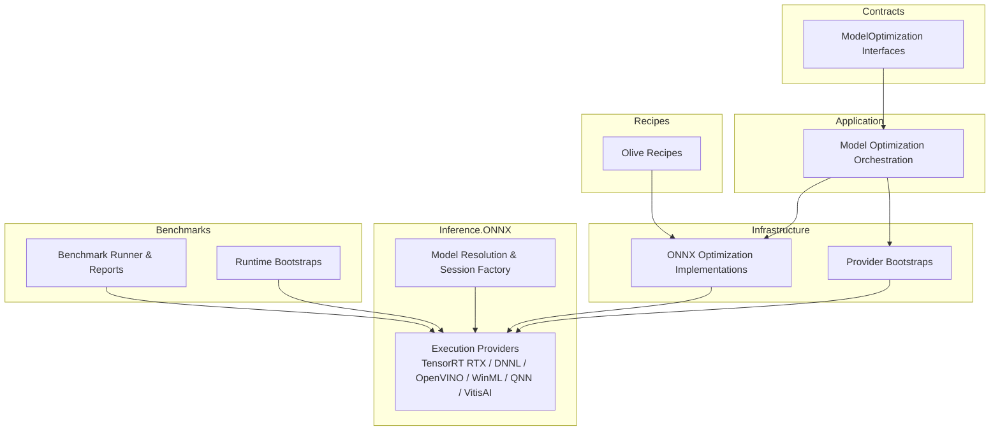
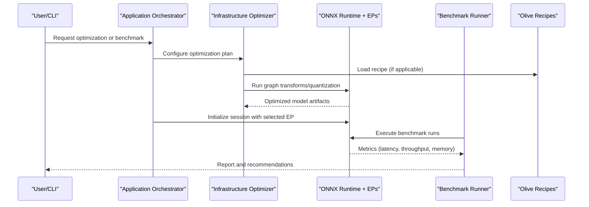
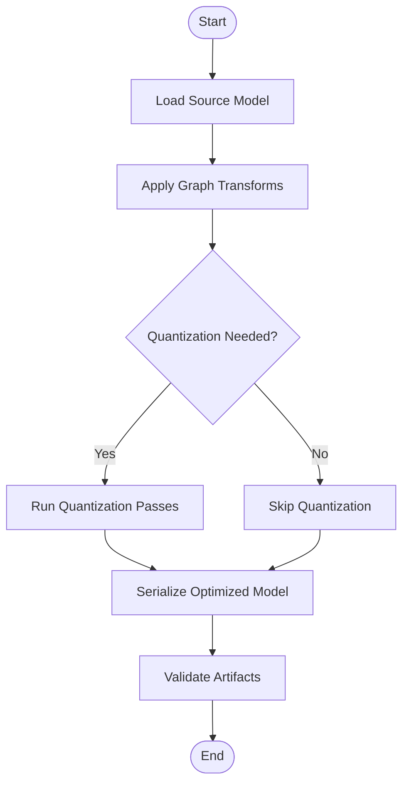
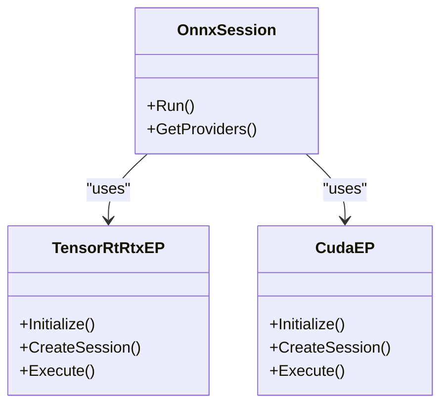
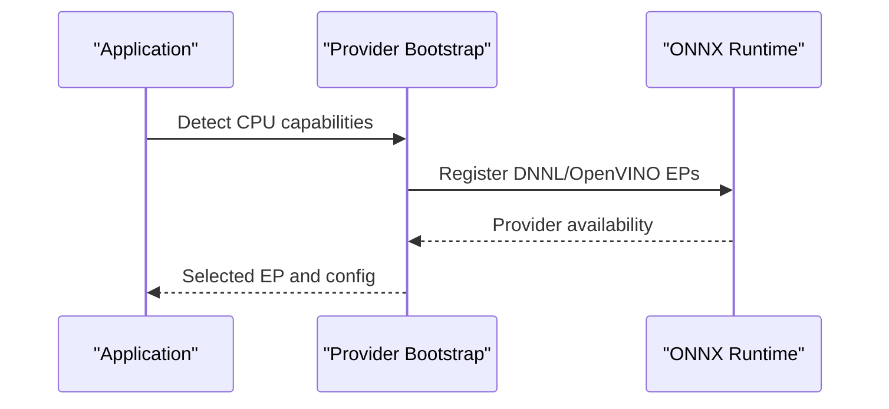
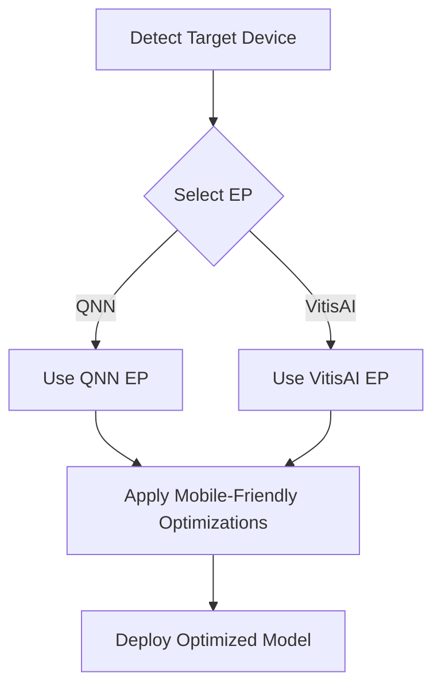
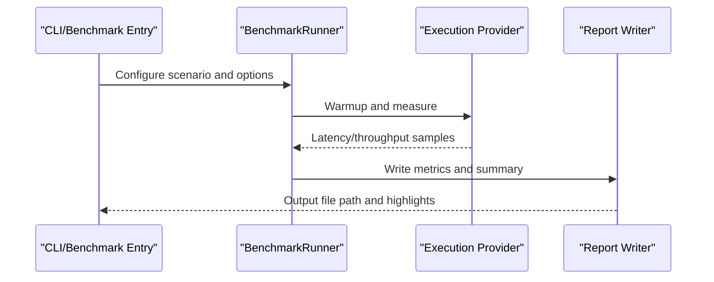
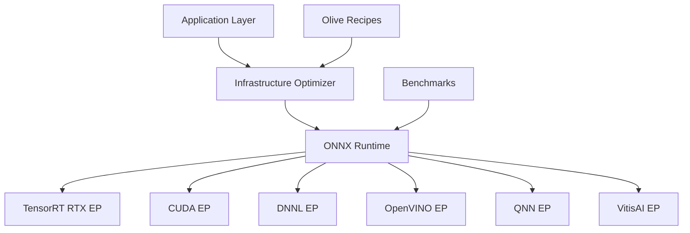

# Performance Optimization

<cite>
**Referenced Files in This Document**
- [Trackdub.Application/ModelOptimization](file://src/Trackdub.Application/ModelOptimization)
- [Trackdub.Infrastructure/ModelOptimization](file://src/Trackdub.Infrastructure/ModelOptimization)
- [Trackdub.Contracts/ModelOptimization](file://src/Trackdub.Contracts/ModelOptimization)
- [Trackdub.Inference.Onnx](file://src/Trackdub.Inference.Onnx)
- [Trackdub.Benchmarks](file://src/Trackdub.Benchmarks)
- [resources/olive-recipes](file://resources/olive-recipes)
- [runtime/trt-rtx-ep.manifest.json](file://runtime/trt-rtx-ep.manifest.json)
- [docs/reference/tensorrt-rtx-ep-abi-plugin.md](file://docs/reference/tensorrt-rtx-ep-abi-plugin.md)
- [docs/reference/profiling-report.md](file://docs/reference/profiling-report.md)
- [docs/reference/migraphx-phase0-seams.md](file://docs/reference/migraphx-phase0-seams.md)
- [docs/reference/windows-ml-phase-3-device-policies.md](file://docs/reference/windows-ml-phase-3-device-policies.md)
- [docs/reference/windows-ml-stage-provider-matrix.md](file://docs/reference/windows-ml-stage-provider-matrix.md)
- [docs/specs/bundled-models-manifest-architecture.md](file://docs/specs/bundled-models-manifest-architecture.md)
- [docs/decisions/ADR-0009-gpu-memory-budget-planner.md](file://docs/decisions/ADR-0009-gpu-memory-budget-planner.md)
- [docs/decisions/ADR-0015-pipeline-transient-telemetry.md](file://docs/decisions/ADR-0015-pipeline-transient-telemetry.md)
- [tools/trackdub-optimize.ps1](file://tools/trackdub-optimize.ps1)
- [tools/trackdub-optimize.sh](file://tools/trackdub-optimize.sh)
</cite>

## Table of Contents
1. [Introduction](#introduction)
2. [Project Structure](#project-structure)
3. [Core Components](#core-components)
4. [Architecture Overview](#architecture-overview)
5. [Detailed Component Analysis](#detailed-component-analysis)
6. [Dependency Analysis](#dependency-analysis)
7. [Performance Considerations](#performance-considerations)
8. [Troubleshooting Guide](#troubleshooting-guide)
9. [Conclusion](#conclusion)
10. [Appendices](#appendices)

## Introduction
This document explains Trackdub’s model performance optimization capabilities with a focus on ONNX model optimization, quantization, and format conversions; hardware-specific acceleration for GPU (CUDA, TensorRT), CPU (DNNL, OpenVINO), and mobile targets; benchmarking and profiling workflows; compression and memory strategies; inference speed improvements; and guidance for selecting optimal configurations per deployment scenario. It also covers performance monitoring, bottleneck identification, and continuous optimization practices to sustain runtime efficiency across evolving models and hardware.

## Project Structure
Trackdub organizes performance-related code across contracts, application orchestration, infrastructure implementations, ONNX runtime integrations, and a dedicated benchmarking suite:
- Contracts define the interfaces for model optimization, execution providers, and telemetry.
- Application layer orchestrates optimization pipelines and selection of execution providers based on device capabilities.
- Infrastructure provides concrete implementations for ONNX optimizations, provider bootstrapping, and artifact management.
- Inference.Onnx integrates execution providers (TensorRT RTX, DNNL, OpenVINO, WinML, QNN, VitisAI) and model resolution logic.
- Benchmarks provide end-to-end measurement, reporting, and bootstrap routines for target runtimes.
- Olive recipes under resources/olive-recipes capture reproducible optimization recipes for many models and targets.
- Runtime manifests and reference docs describe provider packaging and ABI/plugin details.

**Diagram sources**
- [Trackdub.Contracts/ModelOptimization](file://src/Trackdub.Contracts/ModelOptimization)
- [Trackdub.Application/ModelOptimization](file://src/Trackdub.Application/ModelOptimization)
- [Trackdub.Infrastructure/ModelOptimization](file://src/Trackdub.Infrastructure/ModelOptimization)
- [Trackdub.Inference.Onnx](file://src/Trackdub.Inference.Onnx)
- [Trackdub.Benchmarks](file://src/Trackdub.Benchmarks)
- [resources/olive-recipes](file://resources/olive-recipes)

**Section sources**
- [Trackdub.Contracts/ModelOptimization](file://src/Trackdub.Contracts/ModelOptimization)
- [Trackdub.Application/ModelOptimization](file://src/Trackdub.Application/ModelOptimization)
- [Trackdub.Infrastructure/ModelOptimization](file://src/Trackdub.Infrastructure/ModelOptimization)
- [Trackdub.Inference.Onnx](file://src/Trackdub.Inference.Onnx)
- [Trackdub.Benchmarks](file://src/Trackdub.Benchmarks)
- [resources/olive-recipes](file://resources/olive-recipes)

## Core Components
- Model Optimization Contracts: Define abstractions for optimization tasks, quantization passes, graph transformations, and output formats.
- Application Orchestration: Coordinates optimization workflows, selects appropriate providers, and manages artifacts.
- Infrastructure Implementations: Provide concrete ONNX optimization steps, provider initialization, and caching.
- Execution Provider Integrations: Enable CUDA/TensorRT RTX for NVIDIA GPUs, DNNL/OpenVINO for CPUs, and QNN/VitisAI for mobile/embedded devices.
- Benchmarking Suite: Measures latency, throughput, memory usage, and power where available; produces reports and supports regression checks.
- Olive Recipes: Declarative optimization definitions for reproducibility across models and targets.

Key responsibilities:
- Convert and optimize ONNX graphs for target EPs.
- Apply quantization (e.g., int8/FP16) and pruning where supported.
- Select best provider and configuration per device.
- Capture and report performance metrics.

**Section sources**
- [Trackdub.Contracts/ModelOptimization](file://src/Trackdub.Contracts/ModelOptimization)
- [Trackdub.Application/ModelOptimization](file://src/Trackdub.Application/ModelOptimization)
- [Trackdub.Infrastructure/ModelOptimization](file://src/Trackdub.Infrastructure/ModelOptimization)
- [Trackdub.Inference.Onnx](file://src/Trackdub.Inference.Onnx)
- [Trackdub.Benchmarks](file://src/Trackdub.Benchmarks)
- [resources/olive-recipes](file://resources/olive-recipes)

## Architecture Overview
The optimization architecture follows a layered design:
- Contracts expose stable APIs for optimization and provider selection.
- Application layer composes workflows and policies.
- Infrastructure implements ONNX processing and provider bootstrapping.
- Inference.ONNX binds to specific execution providers and resolves model paths.
- Benchmarks exercise the pipeline and generate reports.
- Olive recipes encode repeatable optimization sequences.

**Diagram sources**
- [Trackdub.Application/ModelOptimization](file://src/Trackdub.Application/ModelOptimization)
- [Trackdub.Infrastructure/ModelOptimization](file://src/Trackdub.Infrastructure/ModelOptimization)
- [Trackdub.Inference.Onnx](file://src/Trackdub.Inference.Onnx)
- [Trackdub.Benchmarks](file://src/Trackdub.Benchmarks)
- [resources/olive-recipes](file://resources/olive-recipes)

## Detailed Component Analysis

### ONNX Model Optimization and Quantization
Trackdub leverages ONNX graph transformations and quantization passes via infrastructure components and Olive recipes. Typical flows include:
- Graph simplification and fusion.
- Precision reduction (FP16/INT8) where supported by the target EP.
- Operator-specific optimizations (e.g., attention kernels).
- Output serialization to optimized formats (e.g., TensorRT engines when applicable).

**Diagram sources**
- [Trackdub.Infrastructure/ModelOptimization](file://src/Trackdub.Infrastructure/ModelOptimization)
- [resources/olive-recipes](file://resources/olive-recipes)

**Section sources**
- [Trackdub.Infrastructure/ModelOptimization](file://src/Trackdub.Infrastructure/ModelOptimization)
- [resources/olive-recipes](file://resources/olive-recipes)

### Hardware-Specific Optimizations

#### GPU Acceleration (CUDA, TensorRT RTX)
- TensorRT RTX integration is provided through an execution provider with manifest packaging and ABI plugin documentation.
- CUDA-based optimizations are enabled via ONNX Runtime CUDA EP where supported.
- Recipes often produce FP16 engines for NVIDIA GPUs.

**Diagram sources**
- [Trackdub.Inference.Onnx/TensorRtRtx](file://src/Trackdub.Inference.Onnx/TensorRtRtx)
- [runtime/trt-rtx-ep.manifest.json](file://runtime/trt-rtx-ep.manifest.json)
- [docs/reference/tensorrt-rtx-ep-abi-plugin.md](file://docs/reference/tensorrt-rtx-ep-abi-plugin.md)

**Section sources**
- [Trackdub.Inference.Onnx/TensorRtRtx](file://src/Trackdub.Inference.Onnx/TensorRtRtx)
- [runtime/trt-rtx-ep.manifest.json](file://runtime/trt-rtx-ep.manifest.json)
- [docs/reference/tensorrt-rtx-ep-abi-plugin.md](file://docs/reference/tensorrt-rtx-ep-abi-plugin.md)

#### CPU Optimizations (DNNL, OpenVINO)
- DNNL EP enables Intel CPU optimizations via ONNX Runtime.
- OpenVINO EP provides vendor-specific CPU/NPU acceleration.
- Selection is driven by device detection and readiness checks.

**Diagram sources**
- [Trackdub.Inference.Onnx/Dnnl](file://src/Trackdub.Inference.Onnx/Dnnl)
- [Trackdub.Inference.Onnx/OpenVino](file://src/Trackdub.Inference.Onnx/OpenVino)

**Section sources**
- [Trackdub.Inference.Onnx/Dnnl](file://src/Trackdub.Inference.Onnx/Dnnl)
- [Trackdub.Inference.Onnx/OpenVino](file://src/Trackdub.Inference.Onnx/OpenVino)

#### Mobile and Embedded (QNN, VitisAI)
- QNN EP targets Qualcomm NPUs.
- VitisAI EP targets AMD/Xilinx accelerators.
- Recipes and provider bootstraps ensure correct model compatibility and quantization.

**Diagram sources**
- [Trackdub.Inference.Onnx/Qnn](file://src/Trackdub.Inference.Onnx/Qnn)
- [Trackdub.Inference.Onnx/VitisAi](file://src/Trackdub.Inference.Onnx/VitisAi)

**Section sources**
- [Trackdub.Inference.Onnx/Qnn](file://src/Trackdub.Inference.Onnx/Qnn)
- [Trackdub.Inference.Onnx/VitisAi](file://src/Trackdub.Inference.Onnx/VitisAi)

### Benchmarking Framework and Profiling Tools
- The benchmarking suite measures latency, throughput, and resource usage across scenarios.
- Bootstrap routines initialize EPs and prepare environments.
- Reports aggregate results and can drive recommendations.

**Diagram sources**
- [Trackdub.Benchmarks](file://src/Trackdub.Benchmarks)

**Section sources**
- [Trackdub.Benchmarks](file://src/Trackdub.Benchmarks)
- [docs/reference/profiling-report.md](file://docs/reference/profiling-report.md)

### Model Compression Techniques and Memory Optimization
- Quantization reduces precision to lower memory footprint and improve speed.
- Graph pruning and operator fusion reduce compute overhead.
- Memory budget planning helps avoid OOM on constrained devices.

Recommendations:
- Prefer INT8 quantization for latency-sensitive deployments when accuracy is acceptable.
- Use FP16 for NVIDIA GPUs to maximize throughput.
- Apply dynamic shapes carefully; static shapes may enable better EP optimizations.

**Section sources**
- [Trackdub.Infrastructure/ModelOptimization](file://src/Trackdub.Infrastructure/ModelOptimization)
- [docs/decisions/ADR-0009-gpu-memory-budget-planner.md](file://docs/decisions/ADR-0009-gpu-memory-budget-planner.md)

### Inference Speed Improvements
- Select the most suitable EP per device (TensorRT RTX for NVIDIA, DNNL/OpenVINO for Intel CPUs, QNN/VitisAI for mobile/embedded).
- Pre-warm sessions and reuse buffers where possible.
- Batch inputs when feasible to increase throughput.

**Section sources**
- [Trackdub.Inference.Onnx](file://src/Trackdub.Inference.Onnx)
- [Trackdub.Benchmarks](file://src/Trackdub.Benchmarks)

### Selecting Optimal Configurations
- Use device capability detection to choose EP and precision.
- Validate model compatibility with target EP and quantization scheme.
- Leverage Olive recipes for consistent optimization across environments.

**Section sources**
- [resources/olive-recipes](file://resources/olive-recipes)
- [docs/reference/windows-ml-phase-3-device-policies.md](file://docs/reference/windows-ml-phase-3-device-policies.md)
- [docs/reference/windows-ml-stage-provider-matrix.md](file://docs/reference/windows-ml-stage-provider-matrix.md)

## Dependency Analysis
Trackdub’s optimization stack depends on ONNX Runtime execution providers and external toolchains (Olive, TensorRT, DNNL, OpenVINO, QNN, VitisAI). Provider manifests and ABI plugins must be present for runtime discovery.

**Diagram sources**
- [Trackdub.Application/ModelOptimization](file://src/Trackdub.Application/ModelOptimization)
- [Trackdub.Infrastructure/ModelOptimization](file://src/Trackdub.Infrastructure/ModelOptimization)
- [Trackdub.Inference.Onnx](file://src/Trackdub.Inference.Onnx)
- [Trackdub.Benchmarks](file://src/Trackdub.Benchmarks)
- [resources/olive-recipes](file://resources/olive-recipes)

**Section sources**
- [Trackdub.Application/ModelOptimization](file://src/Trackdub.Application/ModelOptimization)
- [Trackdub.Infrastructure/ModelOptimization](file://src/Trackdub.Infrastructure/ModelOptimization)
- [Trackdub.Inference.Onnx](file://src/Trackdub.Inference.Onnx)
- [Trackdub.Benchmarks](file://src/Trackdub.Benchmarks)
- [resources/olive-recipes](file://resources/olive-recipes)

## Performance Considerations
- Choose EP based on hardware: TensorRT RTX for NVIDIA GPUs, DNNL/OpenVINO for Intel CPUs, QNN/VitisAI for mobile/embedded.
- Use FP16 for NVIDIA GPUs; INT8 for latency-critical scenarios if accuracy permits.
- Avoid unnecessary dynamic shapes; prefer static shapes for EP optimizations.
- Profile with the benchmarking suite and review profiling reports to identify bottlenecks.
- Monitor memory budgets to prevent OOM on constrained devices.

[No sources needed since this section provides general guidance]

## Troubleshooting Guide
Common issues and resolutions:
- Provider not found: Ensure runtime manifests and ABI plugins are installed (e.g., TensorRT RTX EP manifest).
- Quantization failures: Verify model operator support and EP compatibility; adjust quantization parameters.
- Low throughput: Check batch sizes, input shapes, and EP selection; re-run benchmarks to validate changes.
- Memory errors: Reduce model size, switch precision, or apply memory budget planning.

Use profiling reports and benchmark outputs to pinpoint slow stages and high memory usage.

**Section sources**
- [runtime/trt-rtx-ep.manifest.json](file://runtime/trt-rtx-ep.manifest.json)
- [docs/reference/tensorrt-rtx-ep-abi-plugin.md](file://docs/reference/tensorrt-rtx-ep-abi-plugin.md)
- [docs/reference/profiling-report.md](file://docs/reference/profiling-report.md)

## Conclusion
Trackdub’s performance optimization system combines ONNX graph transformations, quantization, and multi-EP execution to deliver efficient inference across GPUs, CPUs, and mobile/embedded devices. The benchmarking framework and profiling tools enable data-driven decisions, while Olive recipes ensure reproducibility. By following the recommended practices and leveraging device-specific EPs, teams can achieve significant latency and throughput improvements while maintaining model quality.

[No sources needed since this section summarizes without analyzing specific files]

## Appendices

### Continuous Optimization Practices
- Integrate benchmarking into CI to detect regressions.
- Maintain Olive recipes per model and target EP.
- Periodically re-profile and update provider versions.
- Track telemetry for runtime anomalies and performance drift.

**Section sources**
- [docs/decisions/ADR-0015-pipeline-transient-telemetry.md](file://docs/decisions/ADR-0015-pipeline-transient-telemetry.md)
- [resources/olive-recipes](file://resources/olive-recipes)
- [Trackdub.Benchmarks](file://src/Trackdub.Benchmarks)

### MIGraphX Integration Notes
MIGraphX phases and seams are documented for advanced optimization scenarios.

**Section sources**
- [docs/reference/migraphx-phase0-seams.md](file://docs/reference/migraphx-phase0-seams.md)

### Bundled Models Manifest Architecture
Guidelines for managing bundled models and their optimization artifacts.

**Section sources**
- [docs/specs/bundled-models-manifest-architecture.md](file://docs/specs/bundled-models-manifest-architecture.md)

### Optimization Scripts
Automated scripts for running optimization workflows across platforms.

**Section sources**
- [tools/trackdub-optimize.ps1](file://tools/trackdub-optimize.ps1)
- [tools/trackdub-optimize.sh](file://tools/trackdub-optimize.sh)