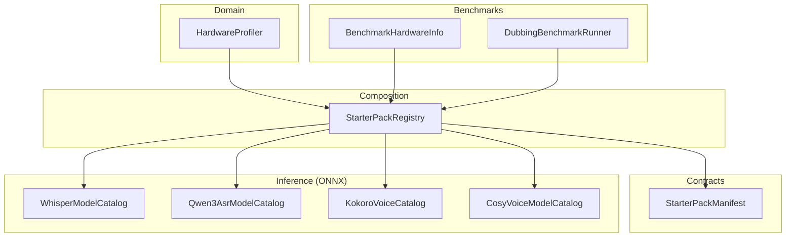
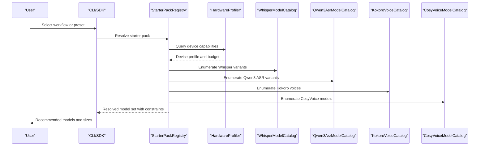
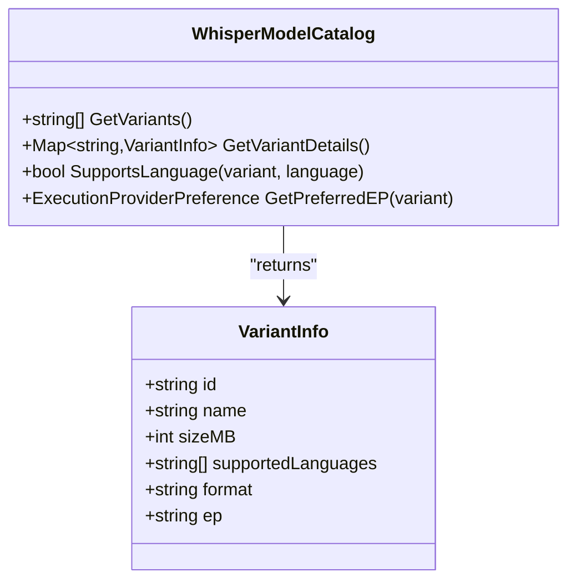
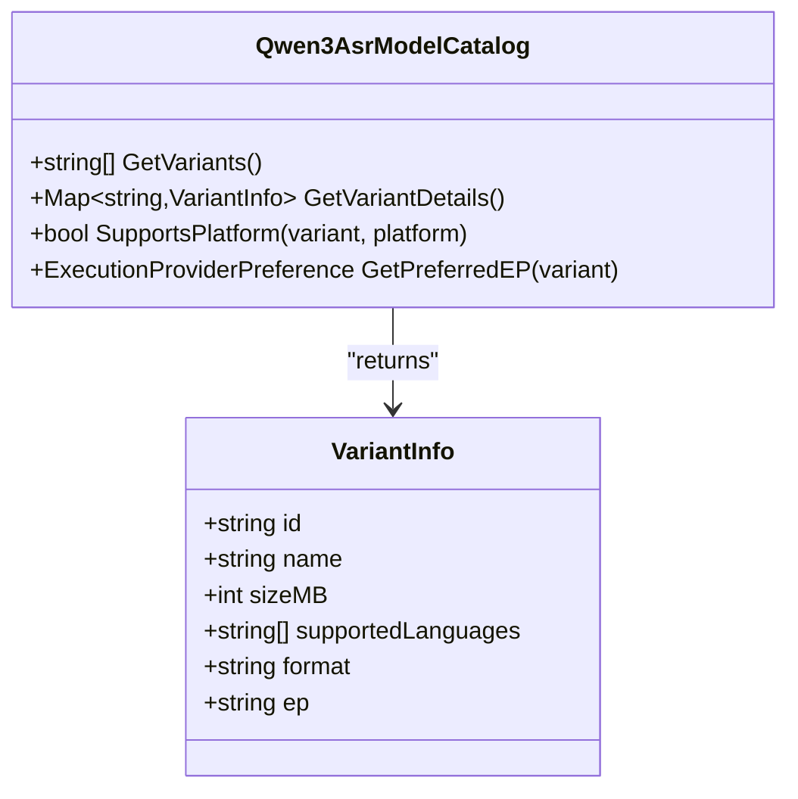
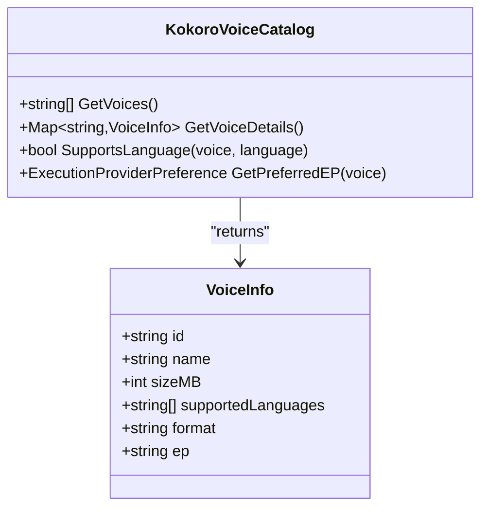
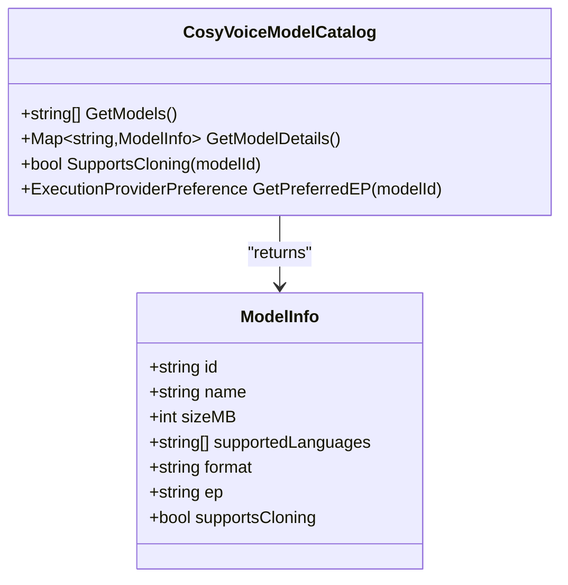
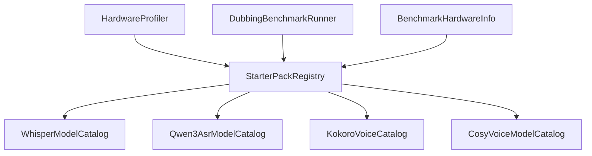
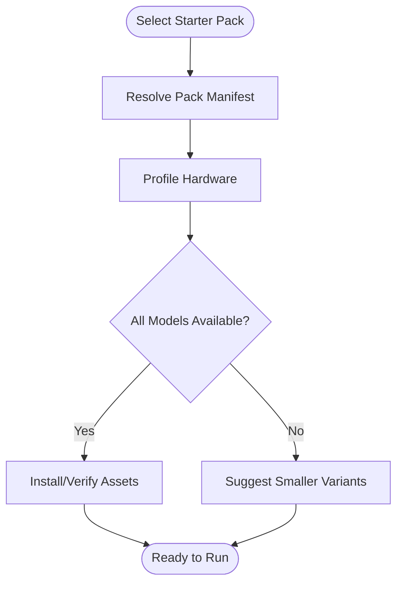

# Supported Models & Variants

<cite>
**Referenced Files in This Document**
- [README.md](file://README.md)
- [specs/starter-packs-v1-design.md](file://specs/starter-packs-v1-design.md)
- [specs/bundled-models-manifest-architecture.md](file://specs/bundled-models-manifest-architecture.md)
- [specs/premade-hf-variants.md](file://specs/premade-hf-variants.md)
- [ADR-0005-kokoro-tts-architecture.md](file://docs/decisions/ADR-0005-kokoro-tts-architecture.md)
- [ADR-0003-whisper-license-investigation.md](file://docs/decisions/ADR-0003-whisper-license-investigation.md)
- [Trackdub.Inference.Onnx/Qwen3Asr/Qwen3AsrModelCatalog.cs](file://src/Trackdub.Inference.Onnx/Qwen3Asr/Qwen3AsrModelCatalog.cs)
- [Trackdub.Inference.Onnx/Whisper/WhisperModelCatalog.cs](file://src/Trackdub.Inference.Onnx/Whisper/WhisperModelCatalog.cs)
- [Trackdub.Inference.Onnx/Kokoro/KokoroVoiceCatalog.cs](file://src/Trackdub.Inference.Onnx/Kokoro/KokoroVoiceCatalog.cs)
- [Trackdub.Inference.Onnx/CosyVoice/CosyVoiceModelCatalog.cs](file://src/Trackdub.Inference.Onnx/CosyVoice/CosyVoiceModelCatalog.cs)
- [Trackdub.Domain/HardwareProfiler.cs](file://src/Trackdub.Domain/HardwareProfiler.cs)
- [Trackdub.Benchmarks/BenchmarkHardwareInfo.cs](file://src/Trackdub.Benchmarks/BenchmarkHardwareInfo.cs)
- [Trackdub.Benchmarks/DubbingBenchmarkRunner.cs](file://src/Trackdub.Benchmarks/DubbingBenchmarkRunner.cs)
- [Trackdub.Composition/StarterPacks/StarterPackRegistry.cs](file://src/Trackdub.Composition/StarterPacks/StarterPackRegistry.cs)
- [Trackdub.Contracts/StarterPacks/StarterPackManifest.cs](file://src/Trackdub.Contracts/StarterPacks/StarterPackManifest.cs)
</cite>

## Table of Contents
1. Introduction
2. Project Structure
3. Core Components
4. Architecture Overview
5. Detailed Component Analysis
6. Dependency Analysis
7. Performance Considerations
8. Troubleshooting Guide
9. Conclusion
10. Appendices

## Introduction
This document catalogs Trackdub’s supported models and variants across automatic speech recognition (ASR), text-to-speech (TTS), translation, lip-sync, and specialized audio processing. It explains model families (Whisper variants, Qwen3 ASR), TTS engines (Kokoro voices, CosyVoice models, voice cloning), translation services, and lip-sync models. It also covers variant selection criteria, hardware compatibility matrices, performance benchmarks, model specifications, file formats, size requirements, recommended use cases, and the starter pack system that bundles model combinations for specific workflows.

## Project Structure
Trackdub organizes model support across several layers:
- Contracts define model metadata and manifest structures used by starter packs and runtime discovery.
- Domain provides hardware profiling and device capability detection to guide model selection.
- Inference implementations provide concrete model catalogs and execution paths for ONNX-based models (Whisper, Qwen3 ASR, Kokoro, CosyVoice).
- Composition wires up starter packs and runtime providers.
- Benchmarks capture performance characteristics and hardware info.

**Diagram sources**
- [Trackdub.Contracts/StarterPacks/StarterPackManifest.cs](file://src/Trackdub.Contracts/StarterPacks/StarterPackManifest.cs)
- [Trackdub.Domain/HardwareProfiler.cs](file://src/Trackdub.Domain/HardwareProfiler.cs)
- [Trackdub.Inference.Onnx/Whisper/WhisperModelCatalog.cs](file://src/Trackdub.Inference.Onnx/Whisper/WhisperModelCatalog.cs)
- [Trackdub.Inference.Onnx/Qwen3Asr/Qwen3AsrModelCatalog.cs](file://src/Trackdub.Inference.Onnx/Qwen3Asr/Qwen3AsrModelCatalog.cs)
- [Trackdub.Inference.Onnx/Kokoro/KokoroVoiceCatalog.cs](file://src/Trackdub.Inference.Onnx/Kokoro/KokoroVoiceCatalog.cs)
- [Trackdub.Inference.Onnx/CosyVoice/CosyVoiceModelCatalog.cs](file://src/Trackdub.Inference.Onnx/CosyVoice/CosyVoiceModelCatalog.cs)
- [Trackdub.Composition/StarterPacks/StarterPackRegistry.cs](file://src/Trackdub.Composition/StarterPacks/StarterPackRegistry.cs)
- [Trackdub.Benchmarks/BenchmarkHardwareInfo.cs](file://src/Trackdub.Benchmarks/BenchmarkHardwareInfo.cs)
- [Trackdub.Benchmarks/DubbingBenchmarkRunner.cs](file://src/Trackdub.Benchmarks/DubbingBenchmarkRunner.cs)

**Section sources**
- [README.md](file://README.md)
- [specs/starter-packs-v1-design.md](file://specs/starter-packs-v1-design.md)
- [specs/bundled-models-manifest-architecture.md](file://specs/bundled-models-manifest-architecture.md)

## Core Components
- Model catalogs expose available variants and their capabilities for ASR and TTS.
- Starter pack registry composes model sets tailored to workflows (e.g., fast local ASR + lightweight TTS).
- Hardware profiler informs selection based on CPU/GPU/NPU availability and memory constraints.
- Benchmark runners collect latency and throughput metrics per model variant.

Key responsibilities:
- Catalogs: enumerate model IDs, supported languages, quantization, and runtime EP preferences.
- Registry: resolve a starter pack to concrete model IDs and validate readiness.
- Profiler: detect devices, compute budgets, and recommend suitable variants.
- Benchmarks: measure real-world performance to guide choices.

**Section sources**
- [Trackdub.Inference.Onnx/Whisper/WhisperModelCatalog.cs](file://src/Trackdub.Inference.Onnx/Whisper/WhisperModelCatalog.cs)
- [Trackdub.Inference.Onnx/Qwen3Asr/Qwen3AsrModelCatalog.cs](file://src/Trackdub.Inference.Onnx/Qwen3Asr/Qwen3AsrModelCatalog.cs)
- [Trackdub.Inference.Onnx/Kokoro/KokoroVoiceCatalog.cs](file://src/Trackdub.Inference.Onnx/Kokoro/KokoroVoiceCatalog.cs)
- [Trackdub.Inference.Onnx/CosyVoice/CosyVoiceModelCatalog.cs](file://src/Trackdub.Inference.Onnx/CosyVoice/CosyVoiceModelCatalog.cs)
- [Trackdub.Composition/StarterPacks/StarterPackRegistry.cs](file://src/Trackdub.Composition/StarterPacks/StarterPackRegistry.cs)
- [Trackdub.Domain/HardwareProfiler.cs](file://src/Trackdub.Domain/HardwareProfiler.cs)
- [Trackdub.Benchmarks/DubbingBenchmarkRunner.cs](file://src/Trackdub.Benchmarks/DubbingBenchmarkRunner.cs)

## Architecture Overview
The model ecosystem is centered around cataloged variants and starter pack compositions. Runtime selection uses hardware capabilities and user preferences to pick optimal models. Benchmarks feed back into recommendations.

**Diagram sources**
- [Trackdub.Composition/StarterPacks/StarterPackRegistry.cs](file://src/Trackdub.Composition/StarterPacks/StarterPackRegistry.cs)
- [Trackdub.Domain/HardwareProfiler.cs](file://src/Trackdub.Domain/HardwareProfiler.cs)
- [Trackdub.Inference.Onnx/Whisper/WhisperModelCatalog.cs](file://src/Trackdub.Inference.Onnx/Whisper/WhisperModelCatalog.cs)
- [Trackdub.Inference.Onnx/Qwen3Asr/Qwen3AsrModelCatalog.cs](file://src/Trackdub.Inference.Onnx/Qwen3Asr/Qwen3AsrModelCatalog.cs)
- [Trackdub.Inference.Onnx/Kokoro/KokoroVoiceCatalog.cs](file://src/Trackdub.Inference.Onnx/Kokoro/KokoroVoiceCatalog.cs)
- [Trackdub.Inference.Onnx/CosyVoice/CosyVoiceModelCatalog.cs](file://src/Trackdub.Inference.Onnx/CosyVoice/CosyVoiceModelCatalog.cs)

## Detailed Component Analysis

### ASR Models: Whisper Variants
Supported variants include tiny, small, base, medium, large, and turbo variants where applicable. These are exposed via an ONNX-based implementation with execution provider preferences optimized for different hardware.

- Variant selection criteria:
  - Speed vs accuracy trade-offs (tiny/small/base for speed; medium/large for quality).
  - Language coverage (base.en variants for English-only scenarios).
  - Hardware acceleration (CUDA/TensorRT-RTX, DNNL, WebGPU).
- Typical file formats: ONNX encoder/decoder graphs with separate config files per execution provider.
- Size requirements: scale from small MBs (tiny) to hundreds of MBs (large/turbo).
- Recommended use cases:
  - Real-time or low-latency: tiny/small/base.
  - High-quality transcription: medium/large.
  - Fast multilingual inference: turbo when available.

**Diagram sources**
- [Trackdub.Inference.Onnx/Whisper/WhisperModelCatalog.cs](file://src/Trackdub.Inference.Onnx/Whisper/WhisperModelCatalog.cs)

**Section sources**
- [Trackdub.Inference.Onnx/Whisper/WhisperModelCatalog.cs](file://src/Trackdub.Inference.Onnx/Whisper/WhisperModelCatalog.cs)
- [specs/premade-hf-variants.md](file://specs/premade-hf-variants.md)
- [ADR-0003-whisper-license-investigation.md](file://docs/decisions/ADR-0003-whisper-license-investigation.md)

### ASR Models: Qwen3 ASR
Qwen3 ASR models are provided through an ONNX implementation with multiple parameter sizes and target platforms (CPU, CUDA, WebGPU). They offer strong multilingual ASR capabilities and can be selected based on resource constraints.

- Variant selection criteria:
  - Parameter size vs latency/memory footprint.
  - Target platform (CPU-only vs GPU-accelerated).
  - Language coverage and domain robustness.
- Typical file formats: ONNX graphs organized per target platform with associated configs.
- Size requirements: vary by model size; larger models require more RAM/VRAM.
- Recommended use cases:
  - Lightweight deployments: smaller Qwen3 variants.
  - High-throughput pipelines: GPU-accelerated variants.

**Diagram sources**
- [Trackdub.Inference.Onnx/Qwen3Asr/Qwen3AsrModelCatalog.cs](file://src/Trackdub.Inference.Onnx/Qwen3Asr/Qwen3AsrModelCatalog.cs)

**Section sources**
- [Trackdub.Inference.Onnx/Qwen3Asr/Qwen3AsrModelCatalog.cs](file://src/Trackdub.Inference.Onnx/Qwen3Asr/Qwen3AsrModelCatalog.cs)
- [specs/premade-hf-variants.md](file://specs/premade-hf-variants.md)

### TTS Engines: Kokoro Voices
Kokoro TTS provides a catalog of voices with distinct timbres and styles. The catalog exposes voice IDs, supported languages, and runtime preferences.

- Voice selection criteria:
  - Language match and accent preferences.
  - Latency constraints (smaller voice models for faster synthesis).
  - Quality vs size trade-offs.
- Typical file formats: ONNX-based voice models with configuration files.
- Size requirements: vary by voice complexity; generally smaller than large ASR models.
- Recommended use cases:
  - Natural-sounding narration: higher-quality voices.
  - Real-time dubbing: optimized voices for low latency.

**Diagram sources**
- [Trackdub.Inference.Onnx/Kokoro/KokoroVoiceCatalog.cs](file://src/Trackdub.Inference.Onnx/Kokoro/KokoroVoiceCatalog.cs)
- [ADR-0005-kokoro-tts-architecture.md](file://docs/decisions/ADR-0005-kokoro-tts-architecture.md)

**Section sources**
- [Trackdub.Inference.Onnx/Kokoro/KokoroVoiceCatalog.cs](file://src/Trackdub.Inference.Onnx/Kokoro/KokoroVoiceCatalog.cs)
- [ADR-0005-kokoro-tts-architecture.md](file://docs/decisions/ADR-0005-kokoro-tts-architecture.md)

### TTS Engines: CosyVoice Models
CosyVoice models provide high-fidelity speech synthesis with options for voice cloning. The catalog enumerates models and capabilities.

- Model selection criteria:
  - Cloning vs prebuilt voices.
  - Language support and prosody control.
  - Resource usage and latency targets.
- Typical file formats: ONNX-based synthesis models with configs.
- Size requirements: moderate to large depending on cloning features.
- Recommended use cases:
  - Professional dubbing: high-quality prebuilt voices.
  - Personalized content: cloned voices from reference audio.

**Diagram sources**
- [Trackdub.Inference.Onnx/CosyVoice/CosyVoiceModelCatalog.cs](file://src/Trackdub.Inference.Onnx/CosyVoice/CosyVoiceModelCatalog.cs)

**Section sources**
- [Trackdub.Inference.Onnx/CosyVoice/CosyVoiceModelCatalog.cs](file://src/Trackdub.Inference.Onnx/CosyVoice/CosyVoiceModelCatalog.cs)

### Translation Services
Translation services integrate with language models and glossary-aware engines to produce localized transcripts. Selection depends on language pairs, glossary support, and latency constraints.

- Service selection criteria:
  - Language pair coverage.
  - Glossary enforcement and terminology consistency.
  - Throughput and memory limits.
- Typical file formats: ONNX-based translation models or API-backed services.
- Size requirements: vary by model size; cloud APIs have no local footprint.
- Recommended use cases:
  - Localized dubbing pipelines requiring glossary adherence.
  - Batch translation with constrained environments.

[No sources needed since this section provides general guidance]

### Lip-Sync Models
Lip-sync models align generated speech with video mouth movements. Selection considers frame rate, resolution, and GPU acceleration.

- Model selection criteria:
  - Video codec compatibility.
  - GPU acceleration availability.
  - Accuracy vs speed trade-offs.
- Typical file formats: ONNX-based lip-sync graphs with preprocessing configs.
- Size requirements: moderate; depend on resolution and frame handling.
- Recommended use cases:
  - Dubbed content requiring precise lip alignment.
  - Real-time preview during editing.

[No sources needed since this section provides general guidance]

### Specialized Audio Processing Models
Includes noise suppression, source separation, and enhancement models (e.g., DeepFilterNet, SepFormer). These improve input/output audio quality before/after synthesis.

- Model selection criteria:
  - Noise profiles and environment.
  - Separation quality vs speed.
  - Compatibility with pipeline stages.
- Typical file formats: ONNX models with preprocessing/postprocessing scripts.
- Size requirements: small to moderate.
- Recommended use cases:
  - Low-quality recordings needing enhancement.
  - Multi-speaker scenes requiring stem separation.

[No sources needed since this section provides general guidance]

## Dependency Analysis
Model catalogs and starter packs depend on hardware capabilities and execution provider availability. Benchmarks inform selection heuristics.

**Diagram sources**
- [Trackdub.Domain/HardwareProfiler.cs](file://src/Trackdub.Domain/HardwareProfiler.cs)
- [Trackdub.Composition/StarterPacks/StarterPackRegistry.cs](file://src/Trackdub.Composition/StarterPacks/StarterPackRegistry.cs)
- [Trackdub.Inference.Onnx/Whisper/WhisperModelCatalog.cs](file://src/Trackdub.Inference.Onnx/Whisper/WhisperModelCatalog.cs)
- [Trackdub.Inference.Onnx/Qwen3Asr/Qwen3AsrModelCatalog.cs](file://src/Trackdub.Inference.Onnx/Qwen3Asr/Qwen3AsrModelCatalog.cs)
- [Trackdub.Inference.Onnx/Kokoro/KokoroVoiceCatalog.cs](file://src/Trackdub.Inference.Onnx/Kokoro/KokoroVoiceCatalog.cs)
- [Trackdub.Inference.Onnx/CosyVoice/CosyVoiceModelCatalog.cs](file://src/Trackdub.Inference.Onnx/CosyVoice/CosyVoiceModelCatalog.cs)
- [Trackdub.Benchmarks/DubbingBenchmarkRunner.cs](file://src/Trackdub.Benchmarks/DubbingBenchmarkRunner.cs)
- [Trackdub.Benchmarks/BenchmarkHardwareInfo.cs](file://src/Trackdub.Benchmarks/BenchmarkHardwareInfo.cs)

**Section sources**
- [Trackdub.Domain/HardwareProfiler.cs](file://src/Trackdub.Domain/HardwareProfiler.cs)
- [Trackdub.Composition/StarterPacks/StarterPackRegistry.cs](file://src/Trackdub.Composition/StarterPacks/StarterPackRegistry.cs)
- [Trackdub.Benchmarks/DubbingBenchmarkRunner.cs](file://src/Trackdub.Benchmarks/DubbingBenchmarkRunner.cs)
- [Trackdub.Benchmarks/BenchmarkHardwareInfo.cs](file://src/Trackdub.Benchmarks/BenchmarkHardwareInfo.cs)

## Performance Considerations
- Execution providers: Prefer CUDA/TensorRT-RTX for GPU acceleration; fall back to DNNL/WebGPU when GPU is unavailable.
- Memory budgets: Larger models (large/turbo Whisper, big Qwen3) require more VRAM/RAM; select smaller variants under constraints.
- Latency targets: Use tiny/small/base Whisper and lightweight Kokoro voices for real-time dubbing.
- Benchmarking: Use benchmark runners to measure per-variant latency and throughput; adjust selections accordingly.

[No sources needed since this section provides general guidance]

## Troubleshooting Guide
- Model not found: Verify catalog enumeration and ensure required assets are downloaded and accessible.
- Hardware mismatch: Confirm execution provider availability; fallback strategies should be configured.
- License issues: Review license policies for Whisper and other third-party models.
- Performance degradation: Check memory pressure and consider switching to smaller variants or enabling GPU acceleration.

**Section sources**
- [ADR-0003-whisper-license-investigation.md](file://docs/decisions/ADR-0003-whisper-license-investigation.md)
- [Trackdub.Benchmarks/BenchmarkHardwareInfo.cs](file://src/Trackdub.Benchmarks/BenchmarkHardwareInfo.cs)

## Conclusion
Trackdub’s model ecosystem combines cataloged ASR and TTS variants with hardware-aware selection and benchmark-driven optimization. Starter packs streamline workflow-specific model combinations, while catalogs expose detailed metadata for informed decisions. By leveraging hardware profiling and benchmarks, users can balance speed, quality, and resource constraints across diverse deployment scenarios.

[No sources needed since this section summarizes without analyzing specific files]

## Appendices

### Model Specifications Summary
- Whisper variants: tiny, small, base, base.en, medium, medium.en, large, large.v2, large.v3, large.v3-turbo.
- Qwen3 ASR variants: multiple parameter sizes with CPU/CUDA/WebGPU targets.
- Kokoro voices: multiple voice IDs with language support and varying sizes.
- CosyVoice models: prebuilt and cloning-capable models with language support.

**Section sources**
- [specs/premade-hf-variants.md](file://specs/premade-hf-variants.md)
- [Trackdub.Inference.Onnx/Whisper/WhisperModelCatalog.cs](file://src/Trackdub.Inference.Onnx/Whisper/WhisperModelCatalog.cs)
- [Trackdub.Inference.Onnx/Qwen3Asr/Qwen3AsrModelCatalog.cs](file://src/Trackdub.Inference.Onnx/Qwen3Asr/Qwen3AsrModelCatalog.cs)
- [Trackdub.Inference.Onnx/Kokoro/KokoroVoiceCatalog.cs](file://src/Trackdub.Inference.Onnx/Kokoro/KokoroVoiceCatalog.cs)
- [Trackdub.Inference.Onnx/CosyVoice/CosyVoiceModelCatalog.cs](file://src/Trackdub.Inference.Onnx/CosyVoice/CosyVoiceModelCatalog.cs)

### File Formats and Sizes
- ONNX graphs with provider-specific configurations.
- Sizes range from small MBs (tiny/small) to hundreds of MBs (large/turbo).
- Language-specific variants (e.g., .en) reduce size for monolingual use.

**Section sources**
- [specs/premade-hf-variants.md](file://specs/premade-hf-variants.md)

### Recommended Use Cases
- Real-time dubbing: tiny/small Whisper + lightweight Kokoro voice.
- High-quality localization: medium/large Whisper + CosyVoice cloning.
- Multilingual pipelines: Qwen3 ASR (GPU) + glossary-aware translation.

**Section sources**
- [Trackdub.Benchmarks/DubbingBenchmarkRunner.cs](file://src/Trackdub.Benchmarks/DubbingBenchmarkRunner.cs)

### Starter Pack System
Starter packs bundle model combinations for specific workflows, resolving to concrete model IDs and validating readiness against hardware capabilities.

**Diagram sources**
- [Trackdub.Contracts/StarterPacks/StarterPackManifest.cs](file://src/Trackdub.Contracts/StarterPacks/StarterPackManifest.cs)
- [Trackdub.Composition/StarterPacks/StarterPackRegistry.cs](file://src/Trackdub.Composition/StarterPacks/StarterPackRegistry.cs)
- [Trackdub.Domain/HardwareProfiler.cs](file://src/Trackdub.Domain/HardwareProfiler.cs)

**Section sources**
- [specs/starter-packs-v1-design.md](file://specs/starter-packs-v1-design.md)
- [specs/bundled-models-manifest-architecture.md](file://specs/bundled-models-manifest-architecture.md)
- [Trackdub.Contracts/StarterPacks/StarterPackManifest.cs](file://src/Trackdub.Contracts/StarterPacks/StarterPackManifest.cs)
- [Trackdub.Composition/StarterPacks/StarterPackRegistry.cs](file://src/Trackdub.Composition/StarterPacks/StarterPackRegistry.cs)