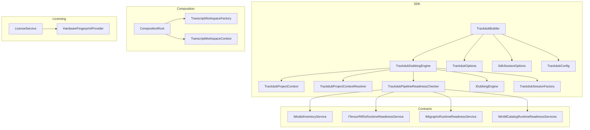
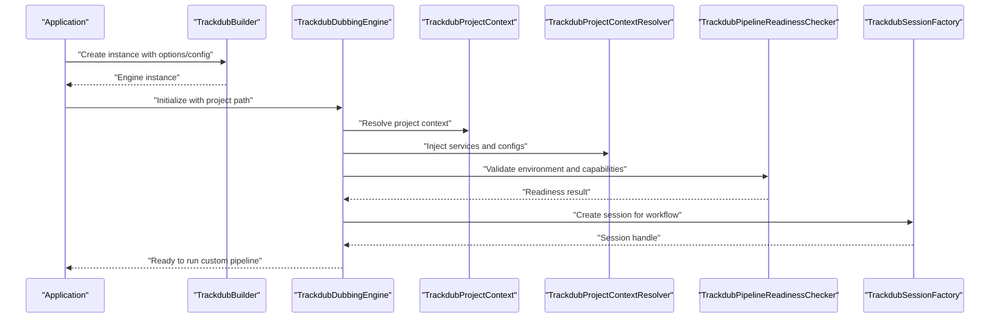
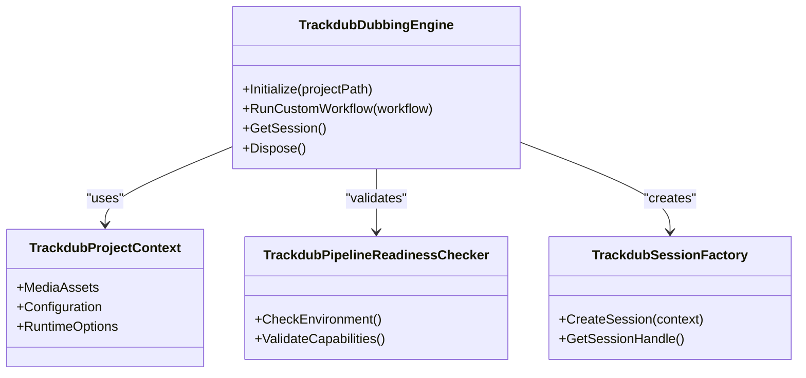
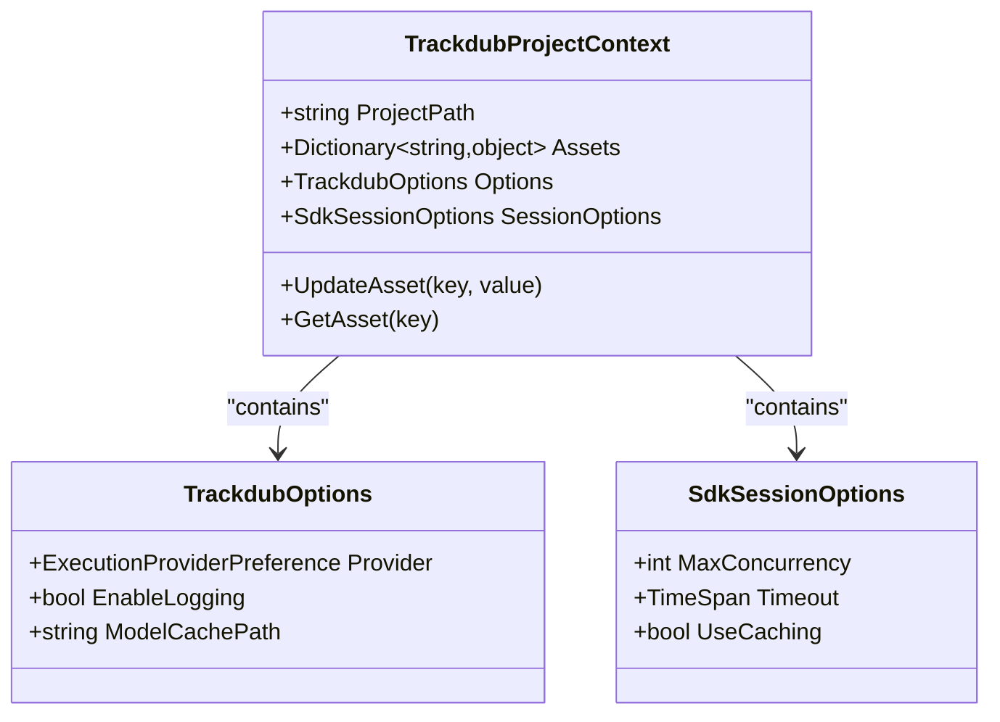
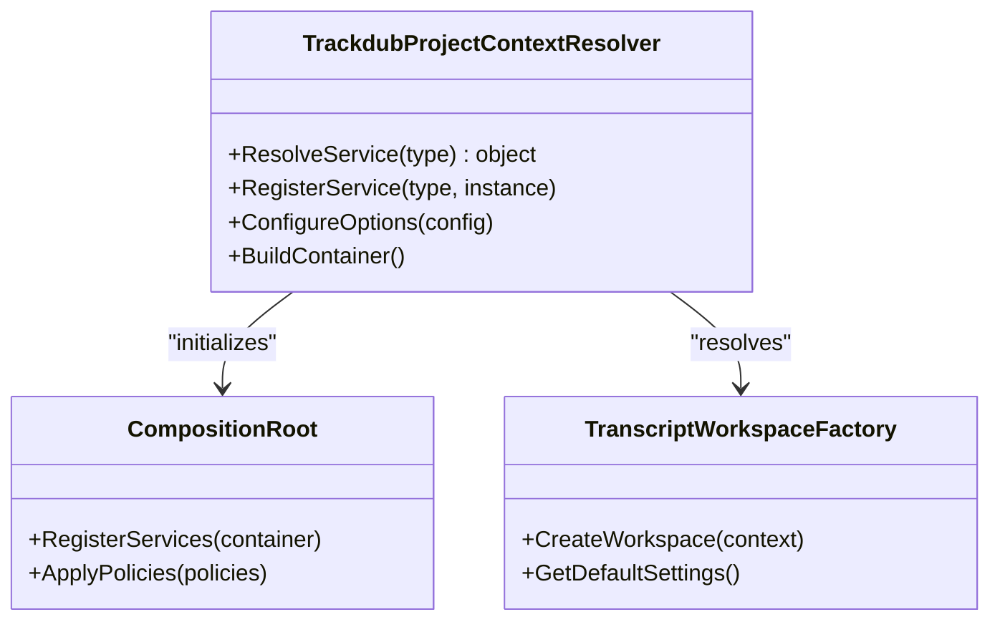
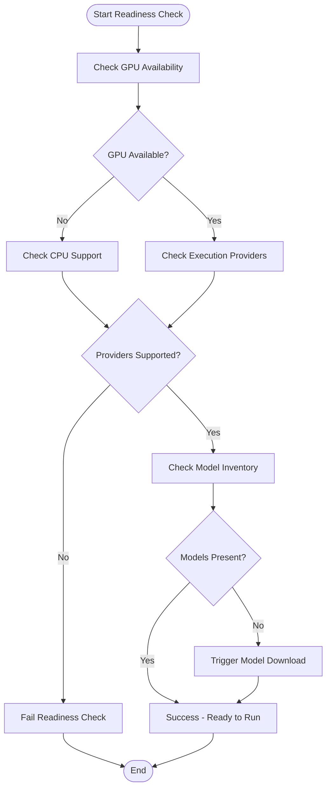
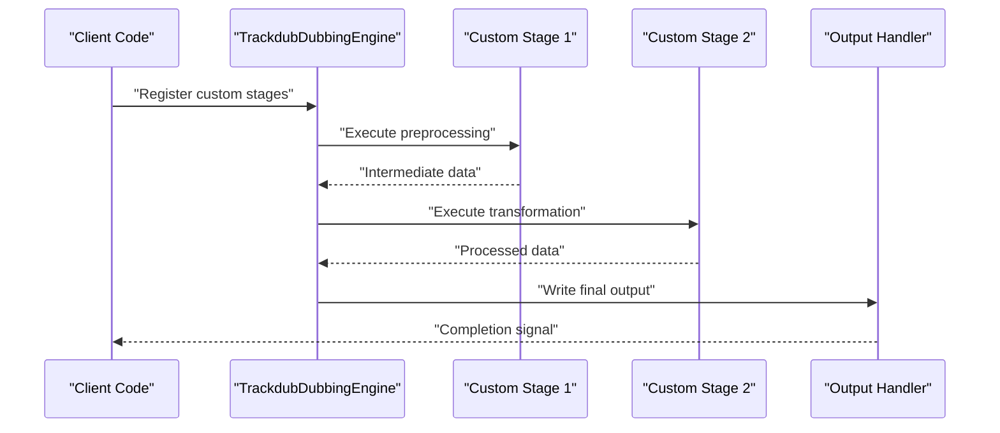
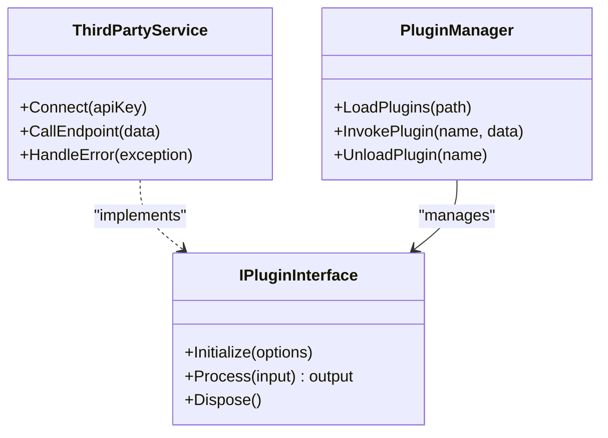
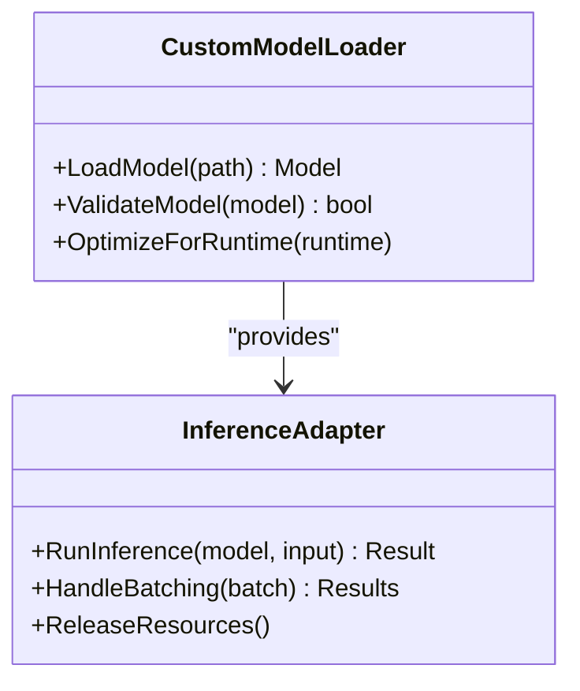
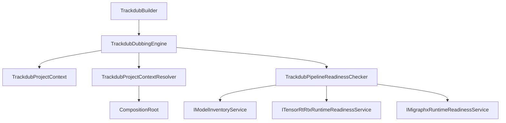

# Advanced Integration Patterns

<cite>
**Referenced Files in This Document**
- [TrackdubDubbingEngine.cs](file://src/Trackdub.Sdk/TrackdubDubbingEngine.cs)
- [TrackdubProjectContext.cs](file://src/Trackdub.Sdk/TrackdubProjectContext.cs)
- [TrackdubProjectContextResolver.cs](file://src/Trackdub.Sdk/TrackdubProjectContextResolver.cs)
- [TrackdubPipelineReadinessChecker.cs](file://src/Trackdub.Sdk/TrackdubPipelineReadinessChecker.cs)
- [TrackdubBuilder.cs](file://src/Trackdub.Sdk/TrackdubBuilder.cs)
- [TrackdubOptions.cs](file://src/Trackdub.Sdk/TrackdubOptions.cs)
- [SdkSessionOptions.cs](file://src/Trackdub.Sdk/SdkSessionOptions.cs)
- [TrackdubConfig.cs](file://src/Trackdub.Sdk/TrackdubConfig.cs)
- [IDubbingEngine.cs](file://src/Trackdub.Sdk/IDubbingEngine.cs)
- [TrackdubSessionFactory.cs](file://src/Trackdub.Sdk/TrackdubSessionFactory.cs)
- [CompositionRoot.cs](file://src/Trackdub.Composition/CompositionRoot.cs)
- [TranscriptWorkspaceFactory.cs](file://src/Trackdub.Composition/TranscriptWorkspaceFactory.cs)
- [TranscriptWorkspaceContext.cs](file://src/Trackdub.Composition/TranscriptWorkspaceContext.cs)
- [LicenseService.cs](file://src/Trackdub.Licensing/LicenseService.cs)
- [HardwareFingerprintProvider.cs](file://src/Trackdub.Licensing/HardwareFingerprintProvider.cs)
- [IModelInventoryService.cs](file://src/Trackdub.Contracts/IModelInventoryService.cs)
- [ITensorRtRtxRuntimeReadinessService.cs](file://src/Trackdub.Contracts/ITensorRtRtxRuntimeReadinessService.cs)
- [IMigraphxRuntimeReadinessService.cs](file://src/Trackdub.Contracts/IMigraphxRuntimeReadinessService.cs)
- [WinMlCatalogRuntimeReadinessServices.cs](file://src/Trackdub.Contracts/WinMlCatalogRuntimeReadinessServices.cs)
</cite>

## Table of Contents
1. [Introduction](#introduction)
2. [Project Structure](#project-structure)
3. [Core Components](#core-components)
4. [Architecture Overview](#architecture-overview)
5. [Detailed Component Analysis](#detailed-component-analysis)
6. [Dependency Analysis](#dependency-analysis)
7. [Performance Considerations](#performance-considerations)
8. [Troubleshooting Guide](#troubleshooting-guide)
9. [Conclusion](#conclusion)
10. [Appendices](#appendices)

## Introduction
This document provides advanced integration patterns and customization scenarios for the Trackdub SDK. It focuses on:
- Custom dubbing workflows using TrackdubDubbingEngine
- Project state management and context sharing via TrackdubProjectContext
- Dynamic context resolution and dependency injection with TrackdubProjectContextResolver
- Environment validation and capability detection through TrackdubPipelineReadinessChecker
- Plugin development, custom model integration, and third-party service integration
- Security considerations, licensing integration, and production deployment patterns

The goal is to enable developers to build robust, extensible, and secure dubbing pipelines tailored to specific environments and requirements.

## Project Structure
The Trackdub SDK exposes a cohesive set of components under src/Trackdub.Sdk that orchestrate dubbing sessions, project contexts, and pipeline readiness checks. Composition and DI are handled in src/Trackdub.Composition, while licensing and security are encapsulated in src/Trackdub.Licensing. Contracts defining interfaces and models live in src/Trackdub.Contracts.

**Diagram sources**
- [TrackdubDubbingEngine.cs](file://src/Trackdub.Sdk/TrackdubDubbingEngine.cs)
- [TrackdubProjectContext.cs](file://src/Trackdub.Sdk/TrackdubProjectContext.cs)
- [TrackdubProjectContextResolver.cs](file://src/Trackdub.Sdk/TrackdubProjectContextResolver.cs)
- [TrackdubPipelineReadinessChecker.cs](file://src/Trackdub.Sdk/TrackdubPipelineReadinessChecker.cs)
- [TrackdubBuilder.cs](file://src/Trackdub.Sdk/TrackdubBuilder.cs)
- [TrackdubOptions.cs](file://src/Trackdub.Sdk/TrackdubOptions.cs)
- [SdkSessionOptions.cs](file://src/Trackdub.Sdk/SdkSessionOptions.cs)
- [TrackdubConfig.cs](file://src/Trackdub.Sdk/TrackdubConfig.cs)
- [IDubbingEngine.cs](file://src/Trackdub.Sdk/IDubbingEngine.cs)
- [TrackdubSessionFactory.cs](file://src/Trackdub.Sdk/TrackdubSessionFactory.cs)
- [CompositionRoot.cs](file://src/Trackdub.Composition/CompositionRoot.cs)
- [TranscriptWorkspaceFactory.cs](file://src/Trackdub.Composition/TranscriptWorkspaceFactory.cs)
- [TranscriptWorkspaceContext.cs](file://src/Trackdub.Composition/TranscriptWorkspaceContext.cs)
- [LicenseService.cs](file://src/Trackdub.Licensing/LicenseService.cs)
- [HardwareFingerprintProvider.cs](file://src/Trackdub.Licensing/HardwareFingerprintProvider.cs)
- [IModelInventoryService.cs](file://src/Trackdub.Contracts/IModelInventoryService.cs)
- [ITensorRtRtxRuntimeReadinessService.cs](file://src/Trackdub.Contracts/ITensorRtRtxRuntimeReadinessService.cs)
- [IMigraphxRuntimeReadinessService.cs](file://src/Trackdub.Contracts/IMigraphxRuntimeReadinessService.cs)
- [WinMlCatalogRuntimeReadinessServices.cs](file://src/Trackdub.Contracts/WinMlCatalogRuntimeReadinessServices.cs)

**Section sources**
- [TrackdubDubbingEngine.cs](file://src/Trackdub.Sdk/TrackdubDubbingEngine.cs)
- [TrackdubProjectContext.cs](file://src/Trackdub.Sdk/TrackdubProjectContext.cs)
- [TrackdubProjectContextResolver.cs](file://src/Trackdub.Sdk/TrackdubProjectContextResolver.cs)
- [TrackdubPipelineReadinessChecker.cs](file://src/Trackdub.Sdk/TrackdubPipelineReadinessChecker.cs)
- [TrackdubBuilder.cs](file://src/Trackdub.Sdk/TrackdubBuilder.cs)
- [TrackdubOptions.cs](file://src/Trackdub.Sdk/TrackdubOptions.cs)
- [SdkSessionOptions.cs](file://src/Trackdub.Sdk/SdkSessionOptions.cs)
- [TrackdubConfig.cs](file://src/Trackdub.Sdk/TrackdubConfig.cs)
- [IDubbingEngine.cs](file://src/Trackdub.Sdk/IDubbingEngine.cs)
- [TrackdubSessionFactory.cs](file://src/Trackdub.Sdk/TrackdubSessionFactory.cs)
- [CompositionRoot.cs](file://src/Trackdub.Composition/CompositionRoot.cs)
- [TranscriptWorkspaceFactory.cs](file://src/Trackdub.Composition/TranscriptWorkspaceFactory.cs)
- [TranscriptWorkspaceContext.cs](file://src/Trackdub.Composition/TranscriptWorkspaceContext.cs)
- [LicenseService.cs](file://src/Trackdub.Licensing/LicenseService.cs)
- [HardwareFingerprintProvider.cs](file://src/Trackdub.Licensing/HardwareFingerprintProvider.cs)
- [IModelInventoryService.cs](file://src/Trackdub.Contracts/IModelInventoryService.cs)
- [ITensorRtRtxRuntimeReadinessService.cs](file://src/Trackdub.Contracts/ITensorRtRtxRuntimeReadinessService.cs)
- [IMigraphxRuntimeReadinessService.cs](file://src/Trackdub.Contracts/IMigraphxRuntimeReadinessService.cs)
- [WinMlCatalogRuntimeReadinessServices.cs](file://src/Trackdub.Contracts/WinMlCatalogRuntimeReadinessServices.cs)

## Core Components
- TrackdubDubbingEngine: Orchestrates custom dubbing workflows and specialized processing pipelines. It coordinates stages, manages session lifecycle, and integrates with inference services.
- TrackdubProjectContext: Encapsulates project state and shared context across components, including media assets, configuration, and runtime options.
- TrackdubProjectContextResolver: Provides dynamic context resolution and supports dependency injection patterns for pluggable services and configurations.
- TrackdubPipelineReadinessChecker: Validates environment capabilities (e.g., GPU availability, execution providers) and ensures required models and dependencies are present before running pipelines.
- TrackdubBuilder: Constructs SDK instances with options, config, and DI registrations.
- IDubbingEngine: Defines the contract for dubbing engines, enabling interchangeable implementations.
- TrackdubSessionFactory: Creates and manages sessions bound to project contexts.

These components form the backbone of advanced integration patterns, allowing developers to extend pipelines, inject custom services, and enforce environment constraints.

**Section sources**
- [TrackdubDubbingEngine.cs](file://src/Trackdub.Sdk/TrackdubDubbingEngine.cs)
- [TrackdubProjectContext.cs](file://src/Trackdub.Sdk/TrackdubProjectContext.cs)
- [TrackdubProjectContextResolver.cs](file://src/Trackdub.Sdk/TrackdubProjectContextResolver.cs)
- [TrackdubPipelineReadinessChecker.cs](file://src/Trackdub.Sdk/TrackdubPipelineReadinessChecker.cs)
- [TrackdubBuilder.cs](file://src/Trackdub.Sdk/TrackdubBuilder.cs)
- [IDubbingEngine.cs](file://src/Trackdub.Sdk/IDubbingEngine.cs)
- [TrackdubSessionFactory.cs](file://src/Trackdub.Sdk/TrackdubSessionFactory.cs)

## Architecture Overview
The SDK architecture emphasizes separation of concerns, composability, and extensibility. The builder pattern initializes the engine with options and configuration, while the context resolver enables dynamic dependency injection. Readiness checks ensure environment compatibility, and the dubbing engine orchestrates stage execution.

**Diagram sources**
- [TrackdubBuilder.cs](file://src/Trackdub.Sdk/TrackdubBuilder.cs)
- [TrackdubDubbingEngine.cs](file://src/Trackdub.Sdk/TrackdubDubbingEngine.cs)
- [TrackdubProjectContext.cs](file://src/Trackdub.Sdk/TrackdubProjectContext.cs)
- [TrackdubProjectContextResolver.cs](file://src/Trackdub.Sdk/TrackdubProjectContextResolver.cs)
- [TrackdubPipelineReadinessChecker.cs](file://src/Trackdub.Sdk/TrackdubPipelineReadinessChecker.cs)
- [TrackdubSessionFactory.cs](file://src/Trackdub.Sdk/TrackdubSessionFactory.cs)

## Detailed Component Analysis

### TrackdubDubbingEngine
The dubbing engine coordinates custom workflows by managing stages, sessions, and integrations. It leverages the project context for shared state and uses the readiness checker to validate environment capabilities before execution.

**Diagram sources**
- [TrackdubDubbingEngine.cs](file://src/Trackdub.Sdk/TrackdubDubbingEngine.cs)
- [TrackdubProjectContext.cs](file://src/Trackdub.Sdk/TrackdubProjectContext.cs)
- [TrackdubPipelineReadinessChecker.cs](file://src/Trackdub.Sdk/TrackdubPipelineReadinessChecker.cs)
- [TrackdubSessionFactory.cs](file://src/Trackdub.Sdk/TrackdubSessionFactory.cs)

**Section sources**
- [TrackdubDubbingEngine.cs](file://src/Trackdub.Sdk/TrackdubDubbingEngine.cs)

### TrackdubProjectContext
Manages project state and shared context across components. It holds media assets, configuration, and runtime options, enabling consistent state throughout the dubbing workflow.

**Diagram sources**
- [TrackdubProjectContext.cs](file://src/Trackdub.Sdk/TrackdubProjectContext.cs)
- [TrackdubOptions.cs](file://src/Trackdub.Sdk/TrackdubOptions.cs)
- [SdkSessionOptions.cs](file://src/Trackdub.Sdk/SdkSessionOptions.cs)

**Section sources**
- [TrackdubProjectContext.cs](file://src/Trackdub.Sdk/TrackdubProjectContext.cs)
- [TrackdubOptions.cs](file://src/Trackdub.Sdk/TrackdubOptions.cs)
- [SdkSessionOptions.cs](file://src/Trackdub.Sdk/SdkSessionOptions.cs)

### TrackdubProjectContextResolver
Provides dynamic context resolution and dependency injection patterns. It resolves services and configurations at runtime, enabling flexible plugin architectures and third-party integrations.

**Diagram sources**
- [TrackdubProjectContextResolver.cs](file://src/Trackdub.Sdk/TrackdubProjectContextResolver.cs)
- [CompositionRoot.cs](file://src/Trackdub.Composition/CompositionRoot.cs)
- [TranscriptWorkspaceFactory.cs](file://src/Trackdub.Composition/TranscriptWorkspaceFactory.cs)

**Section sources**
- [TrackdubProjectContextResolver.cs](file://src/Trackdub.Sdk/TrackdubProjectContextResolver.cs)
- [CompositionRoot.cs](file://src/Trackdub.Composition/CompositionRoot.cs)
- [TranscriptWorkspaceFactory.cs](file://src/Trackdub.Composition/TranscriptWorkspaceFactory.cs)

### TrackdubPipelineReadinessChecker
Validates environment capabilities and detects supported features. It checks hardware availability, execution provider support, and model inventory to ensure pipelines can run successfully.

**Diagram sources**
- [TrackdubPipelineReadinessChecker.cs](file://src/Trackdub.Sdk/TrackdubPipelineReadinessChecker.cs)
- [IModelInventoryService.cs](file://src/Trackdub.Contracts/IModelInventoryService.cs)
- [ITensorRtRtxRuntimeReadinessService.cs](file://src/Trackdub.Contracts/ITensorRtRtxRuntimeReadinessService.cs)
- [IMigraphxRuntimeReadinessService.cs](file://src/Trackdub.Contracts/IMigraphxRuntimeReadinessService.cs)
- [WinMlCatalogRuntimeReadinessServices.cs](file://src/Trackdub.Contracts/WinMlCatalogRuntimeReadinessServices.cs)

**Section sources**
- [TrackdubPipelineReadinessChecker.cs](file://src/Trackdub.Sdk/TrackdubPipelineReadinessChecker.cs)
- [IModelInventoryService.cs](file://src/Trackdub.Contracts/IModelInventoryService.cs)
- [ITensorRtRtxRuntimeReadinessService.cs](file://src/Trackdub.Contracts/ITensorRtRtxRuntimeReadinessService.cs)
- [IMigraphxRuntimeReadinessService.cs](file://src/Trackdub.Contracts/IMigraphxRuntimeReadinessService.cs)
- [WinMlCatalogRuntimeReadinessServices.cs](file://src/Trackdub.Contracts/WinMlCatalogRuntimeReadinessServices.cs)

### Custom Dubbing Workflows and Pipelines
Developers can implement custom workflows by extending the dubbing engine and integrating specialized processing stages. The engine supports pluggable stages that can be orchestrated based on project requirements.

[No sources needed since this diagram shows conceptual workflow, not actual code structure]

### Plugin Development and Third-Party Integrations
Plugins can be developed by implementing interfaces defined in the contracts layer and registering them through the context resolver. This enables seamless integration of third-party services and custom models.

[No sources needed since this diagram shows conceptual workflow, not actual code structure]

### Custom Model Integration
Custom models can be integrated by implementing model loaders and adapters that conform to the SDK's inference interfaces. The readiness checker ensures models are available and compatible with the runtime.

[No sources needed since this diagram shows conceptual workflow, not actual code structure]

## Dependency Analysis
The SDK components have well-defined dependencies that promote modularity and testability. The builder pattern centralizes initialization, while the context resolver decouples service registration from usage.

**Diagram sources**
- [TrackdubBuilder.cs](file://src/Trackdub.Sdk/TrackdubBuilder.cs)
- [TrackdubDubbingEngine.cs](file://src/Trackdub.Sdk/TrackdubDubbingEngine.cs)
- [TrackdubProjectContext.cs](file://src/Trackdub.Sdk/TrackdubProjectContext.cs)
- [TrackdubProjectContextResolver.cs](file://src/Trackdub.Sdk/TrackdubProjectContextResolver.cs)
- [TrackdubPipelineReadinessChecker.cs](file://src/Trackdub.Sdk/TrackdubPipelineReadinessChecker.cs)
- [CompositionRoot.cs](file://src/Trackdub.Composition/CompositionRoot.cs)
- [IModelInventoryService.cs](file://src/Trackdub.Contracts/IModelInventoryService.cs)
- [ITensorRtRtxRuntimeReadinessService.cs](file://src/Trackdub.Contracts/ITensorRtRtxRuntimeReadinessService.cs)
- [IMigraphxRuntimeReadinessService.cs](file://src/Trackdub.Contracts/IMigraphxRuntimeReadinessService.cs)

**Section sources**
- [TrackdubBuilder.cs](file://src/Trackdub.Sdk/TrackdubBuilder.cs)
- [TrackdubDubbingEngine.cs](file://src/Trackdub.Sdk/TrackdubDubbingEngine.cs)
- [TrackdubProjectContext.cs](file://src/Trackdub.Sdk/TrackdubProjectContext.cs)
- [TrackdubProjectContextResolver.cs](file://src/Trackdub.Sdk/TrackdubProjectContextResolver.cs)
- [TrackdubPipelineReadinessChecker.cs](file://src/Trackdub.Sdk/TrackdubPipelineReadinessChecker.cs)
- [CompositionRoot.cs](file://src/Trackdub.Composition/CompositionRoot.cs)
- [IModelInventoryService.cs](file://src/Trackdub.Contracts/IModelInventoryService.cs)
- [ITensorRtRtxRuntimeReadinessService.cs](file://src/Trackdub.Contracts/ITensorRtRtxRuntimeReadinessService.cs)
- [IMigraphxRuntimeReadinessService.cs](file://src/Trackdub.Contracts/IMigraphxRuntimeReadinessService.cs)

## Performance Considerations
- Optimize model loading by leveraging caching mechanisms provided by the readiness checker
- Configure concurrency settings in SdkSessionOptions for parallel processing
- Use appropriate execution providers based on hardware capabilities
- Implement efficient memory management in custom stages and plugins
- Monitor pipeline performance metrics for bottleneck identification

## Troubleshooting Guide
Common issues and their resolutions:
- Environment validation failures: Verify hardware compatibility and driver versions
- Model loading errors: Ensure model paths are correct and formats are supported
- Dependency injection problems: Check service registration order and lifetime scopes
- Licensing issues: Validate license tokens and hardware fingerprints
- Pipeline execution failures: Review stage logs and intermediate outputs

**Section sources**
- [LicenseService.cs](file://src/Trackdub.Licensing/LicenseService.cs)
- [HardwareFingerprintProvider.cs](file://src/Trackdub.Licensing/HardwareFingerprintProvider.cs)

## Conclusion
The Trackdub SDK provides a robust foundation for building advanced dubbing workflows through its modular architecture and extensible design. By leveraging the core components—TrackdubDubbingEngine, TrackdubProjectContext, TrackdubProjectContextResolver, and TrackdubPipelineReadinessChecker—developers can create customized solutions that meet specific requirements while maintaining security and performance standards.

## Appendices

### Security Considerations
- Implement proper authentication and authorization for third-party services
- Secure sensitive configuration data using encrypted storage
- Validate all external inputs to prevent injection attacks
- Use least privilege principles for service access
- Regularly update dependencies to address security vulnerabilities

### Licensing Integration
- Integrate LicenseService for feature gating and usage tracking
- Implement HardwareFingerprintProvider for device-specific licensing
- Handle license validation errors gracefully with user feedback
- Support offline licensing scenarios with token-based authentication

### Production Deployment Patterns
- Containerize applications with pre-configured environments
- Use configuration management systems for environment-specific settings
- Implement health checks and monitoring for production readiness
- Deploy with zero-downtime strategies for updates
- Maintain comprehensive logging and telemetry for troubleshooting