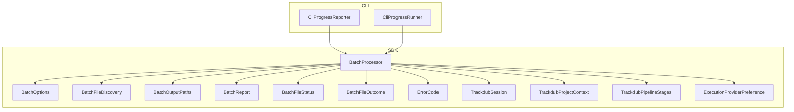
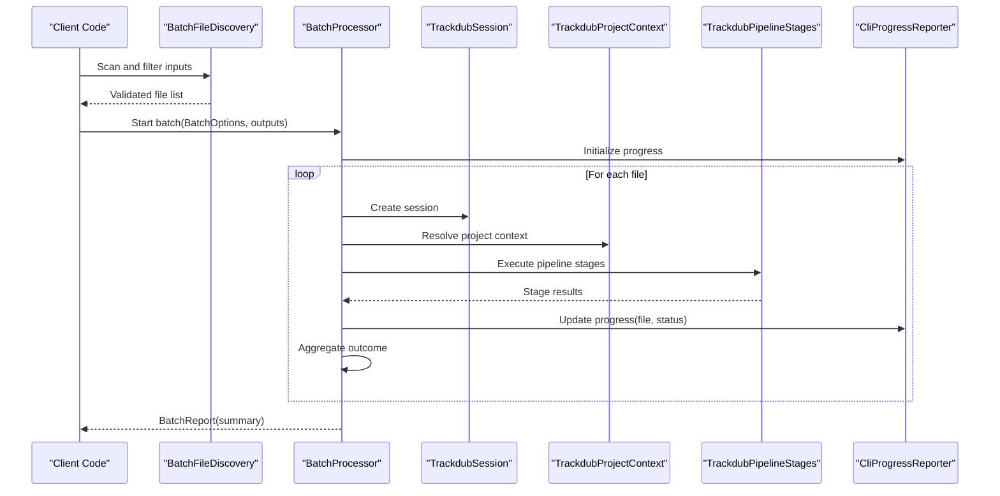
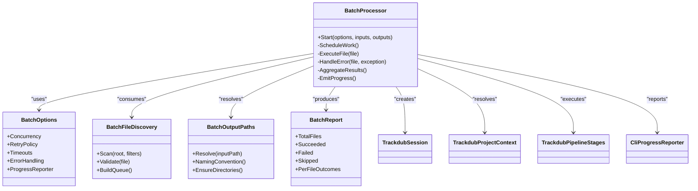
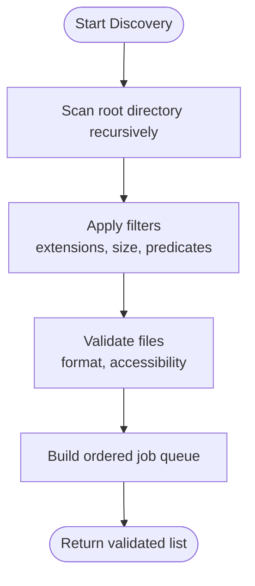
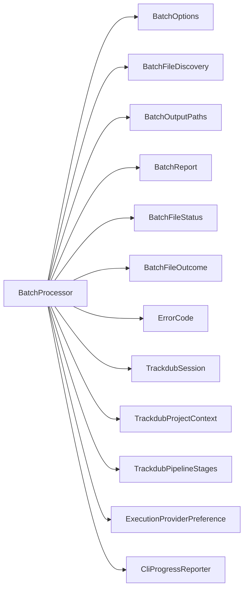

# Batch Processing & File Operations

<cite>
**Referenced Files in This Document**
- [BatchProcessor.cs](file://src/Trackdub.Sdk/BatchProcessor.cs)
- [BatchOptions.cs](file://src/Trackdub.Sdk/BatchOptions.cs)
- [BatchFileDiscovery.cs](file://src/Trackdub.Sdk/BatchFileDiscovery.cs)
- [BatchOutputPaths.cs](file://src/Trackdub.Sdk/BatchOutputPaths.cs)
- [BatchReport.cs](file://src/Trackdub.Sdk/BatchReport.cs)
- [BatchFileStatus.cs](file://src/Trackdub.Sdk/BatchFileStatus.cs)
- [BatchFileOutcome.cs](file://src/Trackdub.Sdk/BatchFileOutcome.cs)
- [ErrorCode.cs](file://src/Trackdub.Sdk/ErrorCode.cs)
- [TrackdubSession.cs](file://src/Trackdub.Sdk/TrackdubSession.cs)
- [TrackdubProjectContext.cs](file://src/Trackdub.Sdk/TrackdubProjectContext.cs)
- [TrackdubPipelineStages.cs](file://src/Trackdub.Sdk/TrackdubPipelineStages.cs)
- [ExecutionProviderPreference.cs](file://src/Trackdub.Sdk/ExecutionProviderPreference.cs)
- [CliProgressReporter.cs](file://src/Trackdub.Cli/CliProgressReporter.cs)
- [CliProgressRunner.cs](file://src/Trackdub.Cli/CliProgressRunner.cs)
</cite>

## Table of Contents
1. [Introduction](#introduction)
2. [Project Structure](#project-structure)
3. [Core Components](#core-components)
4. [Architecture Overview](#architecture-overview)
5. [Detailed Component Analysis](#detailed-component-analysis)
6. [Dependency Analysis](#dependency-analysis)
7. [Performance Considerations](#performance-considerations)
8. [Troubleshooting Guide](#troubleshooting-guide)
9. [Conclusion](#conclusion)
10. [Appendices](#appendices)

## Introduction
This document explains the Trackdub SDK batch processing capabilities with a focus on large-scale media processing workflows. It covers how to discover input files, configure parallel execution and error handling, manage output organization, monitor progress, and optimize performance for enterprise deployments. The primary entry points are the BatchProcessor class along with supporting configuration and discovery utilities.

## Project Structure
The batch processing feature is implemented within the Trackdub.Sdk project and integrates with CLI progress reporting and pipeline stages. Key components include:
- Batch orchestration and lifecycle management
- Input file scanning, filtering, and validation
- Output path resolution and naming conventions
- Reporting and status tracking
- Progress reporting hooks for CLI and external monitoring

**Diagram sources**
- [BatchProcessor.cs](file://src/Trackdub.Sdk/BatchProcessor.cs)
- [BatchOptions.cs](file://src/Trackdub.Sdk/BatchOptions.cs)
- [BatchFileDiscovery.cs](file://src/Trackdub.Sdk/BatchFileDiscovery.cs)
- [BatchOutputPaths.cs](file://src/Trackdub.Sdk/BatchOutputPaths.cs)
- [BatchReport.cs](file://src/Trackdub.Sdk/BatchReport.cs)
- [BatchFileStatus.cs](file://src/Trackdub.Sdk/BatchFileStatus.cs)
- [BatchFileOutcome.cs](file://src/Trackdub.Sdk/BatchFileOutcome.cs)
- [ErrorCode.cs](file://src/Trackdub.Sdk/ErrorCode.cs)
- [TrackdubSession.cs](file://src/Trackdub.Sdk/TrackdubSession.cs)
- [TrackdubProjectContext.cs](file://src/Trackdub.Sdk/TrackdubProjectContext.cs)
- [TrackdubPipelineStages.cs](file://src/Trackdub.Sdk/TrackdubPipelineStages.cs)
- [ExecutionProviderPreference.cs](file://src/Trackdub.Sdk/ExecutionProviderPreference.cs)
- [CliProgressReporter.cs](file://src/Trackdub.Cli/CliProgressReporter.cs)
- [CliProgressRunner.cs](file://src/Trackdub.Cli/CliProgressRunner.cs)

**Section sources**
- [BatchProcessor.cs](file://src/Trackdub.Sdk/BatchProcessor.cs)
- [BatchOptions.cs](file://src/Trackdub.Sdk/BatchOptions.cs)
- [BatchFileDiscovery.cs](file://src/Trackdub.Sdk/BatchFileDiscovery.cs)
- [BatchOutputPaths.cs](file://src/Trackdub.Sdk/BatchOutputPaths.cs)
- [BatchReport.cs](file://src/Trackdub.Sdk/BatchReport.cs)
- [BatchFileStatus.cs](file://src/Trackdub.Sdk/BatchFileStatus.cs)
- [BatchFileOutcome.cs](file://src/Trackdub.Sdk/BatchFileOutcome.cs)
- [ErrorCode.cs](file://src/Trackdub.Sdk/ErrorCode.cs)
- [TrackdubSession.cs](file://src/Trackdub.Sdk/TrackdubSession.cs)
- [TrackdubProjectContext.cs](file://src/Trackdub.Sdk/TrackdubProjectContext.cs)
- [TrackdubPipelineStages.cs](file://src/Trackdub.Sdk/TrackdubPipelineStages.cs)
- [ExecutionProviderPreference.cs](file://src/Trackdub.Sdk/ExecutionProviderPreference.cs)
- [CliProgressReporter.cs](file://src/Trackdub.Cli/CliProgressReporter.cs)
- [CliProgressRunner.cs](file://src/Trackdub.Cli/CliProgressRunner.cs)

## Core Components
- BatchProcessor: Orchestrates batch jobs including file discovery, scheduling, execution, and result aggregation.
- BatchOptions: Configures concurrency, retries, timeouts, error policies, and progress reporting hooks.
- BatchFileDiscovery: Scans directories, applies filters, validates inputs, and produces a stable job queue.
- BatchOutputPaths: Resolves deterministic output locations and naming patterns per input file.
- BatchReport: Aggregates per-file outcomes, counters, and summary metrics.
- BatchFileStatus and BatchFileOutcome: Represent per-file state transitions and detailed results.
- ErrorCode: Enumerates failure categories for structured error handling.
- TrackdubSession and TrackdubProjectContext: Provide runtime context and resource management for each processed item.
- TrackdubPipelineStages and ExecutionProviderPreference: Define stage sequencing and hardware acceleration preferences.
- CliProgressReporter and CliProgressRunner: Bridge SDK batch execution to user-facing progress updates.

**Section sources**
- [BatchProcessor.cs](file://src/Trackdub.Sdk/BatchProcessor.cs)
- [BatchOptions.cs](file://src/Trackdub.Sdk/BatchOptions.cs)
- [BatchFileDiscovery.cs](file://src/Trackdub.Sdk/BatchFileDiscovery.cs)
- [BatchOutputPaths.cs](file://src/Trackdub.Sdk/BatchOutputPaths.cs)
- [BatchReport.cs](file://src/Trackdub.Sdk/BatchReport.cs)
- [BatchFileStatus.cs](file://src/Trackdub.Sdk/BatchFileStatus.cs)
- [BatchFileOutcome.cs](file://src/Trackdub.Sdk/BatchFileOutcome.cs)
- [ErrorCode.cs](file://src/Trackdub.Sdk/ErrorCode.cs)
- [TrackdubSession.cs](file://src/Trackdub.Sdk/TrackdubSession.cs)
- [TrackdubProjectContext.cs](file://src/Trackdub.Sdk/TrackdubProjectContext.cs)
- [TrackdubPipelineStages.cs](file://src/Trackdub.Sdk/TrackdubPipelineStages.cs)
- [ExecutionProviderPreference.cs](file://src/Trackdub.Sdk/ExecutionProviderPreference.cs)
- [CliProgressReporter.cs](file://src/Trackdub.Cli/CliProgressReporter.cs)
- [CliProgressRunner.cs](file://src/Trackdub.Cli/CliProgressRunner.cs)

## Architecture Overview
The batch processing architecture separates concerns into discovery, orchestration, execution, and reporting. BatchProcessor coordinates these layers while respecting resource limits defined by BatchOptions. Output paths are resolved deterministically via BatchOutputPaths to ensure consistent artifact layout. Progress is reported through pluggable reporters, commonly CliProgressReporter for CLI usage.

**Diagram sources**
- [BatchFileDiscovery.cs](file://src/Trackdub.Sdk/BatchFileDiscovery.cs)
- [BatchProcessor.cs](file://src/Trackdub.Sdk/BatchProcessor.cs)
- [TrackdubSession.cs](file://src/Trackdub.Sdk/TrackdubSession.cs)
- [TrackdubProjectContext.cs](file://src/Trackdub.Sdk/TrackdubProjectContext.cs)
- [TrackdubPipelineStages.cs](file://src/Trackdub.Sdk/TrackdubPipelineStages.cs)
- [CliProgressReporter.cs](file://src/Trackdub.Cli/CliProgressReporter.cs)

## Detailed Component Analysis

### BatchProcessor
Responsibilities:
- Accepts a validated list of input files and BatchOptions.
- Schedules work across threads or tasks based on concurrency settings.
- Manages per-file sessions and contexts to isolate resources.
- Executes pipeline stages in order, capturing intermediate artifacts.
- Handles errors per file, applying retry/backoff policies when configured.
- Emits progress events and aggregates final BatchReport.

Key behaviors:
- Concurrency control via worker pool or task fan-out.
- Error isolation: failures do not abort entire batches unless policy dictates.
- Resource cleanup: sessions and contexts disposed after completion.
- Deterministic output placement using BatchOutputPaths.

**Diagram sources**
- [BatchProcessor.cs](file://src/Trackdub.Sdk/BatchProcessor.cs)
- [BatchOptions.cs](file://src/Trackdub.Sdk/BatchOptions.cs)
- [BatchFileDiscovery.cs](file://src/Trackdub.Sdk/BatchFileDiscovery.cs)
- [BatchOutputPaths.cs](file://src/Trackdub.Sdk/BatchOutputPaths.cs)
- [BatchReport.cs](file://src/Trackdub.Sdk/BatchReport.cs)
- [TrackdubSession.cs](file://src/Trackdub.Sdk/TrackdubSession.cs)
- [TrackdubProjectContext.cs](file://src/Trackdub.Sdk/TrackdubProjectContext.cs)
- [TrackdubPipelineStages.cs](file://src/Trackdub.Sdk/TrackdubPipelineStages.cs)
- [CliProgressReporter.cs](file://src/Trackdub.Cli/CriProgressReporter.cs)

**Section sources**
- [BatchProcessor.cs](file://src/Trackdub.Sdk/BatchProcessor.cs)
- [BatchReport.cs](file://src/Trackdub.Sdk/BatchReport.cs)
- [BatchFileStatus.cs](file://src/Trackdub.Sdk/BatchFileStatus.cs)
- [BatchFileOutcome.cs](file://src/Trackdub.Sdk/BatchFileOutcome.cs)
- [ErrorCode.cs](file://src/Trackdub.Sdk/ErrorCode.cs)

### BatchOptions
Configuration aspects:
- Concurrency: number of parallel workers or tasks.
- Retry policy: maximum attempts, backoff strategy, and conditions for retry.
- Timeouts: per-stage and overall job timeouts.
- Error handling: continue-on-error vs fail-fast; categorization via ErrorCode.
- Progress reporter: hook for emitting progress updates (e.g., CliProgressReporter).
- Execution provider preference: GPU/CPU selection via ExecutionProviderPreference.

Best practices:
- Tune concurrency to match CPU/GPU capacity and I/O throughput.
- Use exponential backoff for transient network or model load issues.
- Set reasonable timeouts to avoid long-hanging jobs.
- Prefer continue-on-error for resilient pipelines with detailed per-file reports.

**Section sources**
- [BatchOptions.cs](file://src/Trackdub.Sdk/BatchOptions.cs)
- [ExecutionProviderPreference.cs](file://src/Trackdub.Sdk/ExecutionProviderPreference.cs)

### BatchFileDiscovery
Capabilities:
- Directory traversal with recursive scanning.
- Filtering by extension, size, or custom predicates.
- Validation checks for supported formats and integrity.
- Stable ordering for deterministic processing.

Operational flow:

**Diagram sources**
- [BatchFileDiscovery.cs](file://src/Trackdub.Sdk/BatchFileDiscovery.cs)

**Section sources**
- [BatchFileDiscovery.cs](file://src/Trackdub.Sdk/BatchFileDiscovery.cs)

### BatchOutputPaths
Responsibilities:
- Resolve deterministic output directories per input file.
- Apply naming conventions for artifacts (e.g., transcripts, audio, metadata).
- Ensure output directories exist before writing.
- Support customizable templates for advanced use cases.

Design considerations:
- Avoid collisions by incorporating unique identifiers or timestamps if needed.
- Keep structure flat where possible to simplify downstream consumption.
- Separate raw, processed, and derived artifacts into distinct folders.

**Section sources**
- [BatchOutputPaths.cs](file://src/Trackdub.Sdk/BatchOutputPaths.cs)

### Status and Outcome Models
- BatchFileStatus: Tracks per-file lifecycle states (queued, processing, succeeded, failed, skipped).
- BatchFileOutcome: Captures detailed results, warnings, and artifact references for each file.
- BatchReport: Aggregates totals, success/failure counts, and per-file outcomes for post-run analysis.

These models enable robust monitoring, auditing, and automated remediation.

**Section sources**
- [BatchFileStatus.cs](file://src/Trackdub.Sdk/BatchFileStatus.cs)
- [BatchFileOutcome.cs](file://src/Trackdub.Sdk/BatchFileOutcome.cs)
- [BatchReport.cs](file://src/Trackdub.Sdk/BatchReport.cs)

### Pipeline Integration
- TrackdubPipelineStages: Defines the sequence of processing steps executed per file.
- TrackdubSession and TrackdubProjectContext: Manage runtime resources, model loading, and workspace scoping.
- ExecutionProviderPreference: Selects optimal execution backend (CPU/GPU) per job.

Integration pattern:
- BatchProcessor creates a session and context per file.
- Pipeline stages execute sequentially within that scope.
- Errors are captured and mapped to ErrorCode for consistent handling.

**Section sources**
- [TrackdubPipelineStages.cs](file://src/Trackdub.Sdk/TrackdubPipelineStages.cs)
- [TrackdubSession.cs](file://src/Trackdub.Sdk/TrackdubSession.cs)
- [TrackdubProjectContext.cs](file://src/Trackdub.Sdk/TrackdubProjectContext.cs)
- [ExecutionProviderPreference.cs](file://src/Trackdub.Sdk/ExecutionProviderPreference.cs)

### Progress Reporting
- CliProgressReporter: Emits human-readable progress updates for CLI users.
- CliProgressRunner: Coordinates runner lifecycle and integrates with CLI commands.

Usage:
- Configure BatchOptions.ProgressReporter to receive periodic updates.
- Implement custom reporters for telemetry systems or dashboards.

**Section sources**
- [CliProgressReporter.cs](file://src/Trackdub.Cli/CliProgressReporter.cs)
- [CliProgressRunner.cs](file://src/Trackdub.Cli/CliProgressRunner.cs)

## Dependency Analysis
BatchProcessor depends on multiple subsystems to achieve reliable batch execution. The following diagram highlights key dependencies and their roles.

**Diagram sources**
- [BatchProcessor.cs](file://src/Trackdub.Sdk/BatchProcessor.cs)
- [BatchOptions.cs](file://src/Trackdub.Sdk/BatchOptions.cs)
- [BatchFileDiscovery.cs](file://src/Trackdub.Sdk/BatchFileDiscovery.cs)
- [BatchOutputPaths.cs](file://src/Trackdub.Sdk/BatchOutputPaths.cs)
- [BatchReport.cs](file://src/Trackdub.Sdk/BatchReport.cs)
- [BatchFileStatus.cs](file://src/Trackdub.Sdk/BatchFileStatus.cs)
- [BatchFileOutcome.cs](file://src/Trackdub.Sdk/BatchFileOutcome.cs)
- [ErrorCode.cs](file://src/Trackdub.Sdk/ErrorCode.cs)
- [TrackdubSession.cs](file://src/Trackdub.Sdk/TrackdubSession.cs)
- [TrackdubProjectContext.cs](file://src/Trackdub.Sdk/TrackdubProjectContext.cs)
- [TrackdubPipelineStages.cs](file://src/Trackdub.Sdk/TrackdubPipelineStages.cs)
- [ExecutionProviderPreference.cs](file://src/Trackdub.Sdk/ExecutionProviderPreference.cs)
- [CliProgressReporter.cs](file://src/Trackdub.Cli/CliProgressReporter.cs)

**Section sources**
- [BatchProcessor.cs](file://src/Trackdub.Sdk/BatchProcessor.cs)
- [BatchOptions.cs](file://src/Trackdub.Sdk/BatchOptions.cs)
- [BatchFileDiscovery.cs](file://src/Trackdub.Sdk/BatchFileDiscovery.cs)
- [BatchOutputPaths.cs](file://src/Trackdub.Sdk/BatchOutputPaths.cs)
- [BatchReport.cs](file://src/Trackdub.Sdk/BatchReport.cs)
- [BatchFileStatus.cs](file://src/Trackdub.Sdk/BatchFileStatus.cs)
- [BatchFileOutcome.cs](file://src/Trackdub.Sdk/BatchFileOutcome.cs)
- [ErrorCode.cs](file://src/Trackdub.Sdk/ErrorCode.cs)
- [TrackdubSession.cs](file://src/Trackdub.Sdk/TrackdubSession.cs)
- [TrackdubProjectContext.cs](file://src/Trackdub.Sdk/TrackdubProjectContext.cs)
- [TrackdubPipelineStages.cs](file://src/Trackdub.Sdk/TrackdubPipelineStages.cs)
- [ExecutionProviderPreference.cs](file://src/Trackdub.Sdk/ExecutionProviderPreference.cs)
- [CliProgressReporter.cs](file://src/Trackdub.Cli/CliProgressReporter.cs)

## Performance Considerations
Optimization techniques:
- Concurrency tuning: Adjust BatchOptions.Concurrency to saturate CPU cores and GPU memory without overcommitting.
- I/O batching: Group reads/writes where possible to reduce disk contention.
- Model caching: Reuse loaded models across sessions to minimize startup overhead.
- Execution provider selection: Prefer GPU when available; fall back to CPU gracefully.
- Backpressure: Limit in-flight jobs to prevent memory spikes during large batches.
- Streaming: Process large media in chunks to reduce peak memory usage.
- Parallelism boundaries: Isolate heavy stages behind asynchronous boundaries to keep the pipeline responsive.

Resource limits:
- Cap concurrent workers based on hardware profiling.
- Enforce per-job memory budgets to avoid OOM conditions.
- Use timeouts to detect stalled stages and trigger recovery.

Scalability considerations:
- Horizontal scaling: Distribute batches across multiple processes or machines using shared queues.
- Idempotency: Design stages to be rerunnable without side effects.
- Observability: Emit structured logs and metrics for monitoring and alerting.

[No sources needed since this section provides general guidance]

## Troubleshooting Guide
Common issues and resolutions:
- Invalid input files: Ensure BatchFileDiscovery filters and validations are correctly configured.
- Permission errors: Verify read/write access to input/output directories.
- Model loading failures: Check ExecutionProviderPreference and environment setup for GPU/CPU compatibility.
- Timeouts: Increase timeouts or investigate slow stages; consider splitting large files.
- Memory pressure: Reduce concurrency or implement chunked processing.
- Non-deterministic outputs: Confirm BatchOutputPaths naming conventions and avoid race conditions.

Monitoring and diagnostics:
- Inspect BatchReport for per-file outcomes and error codes.
- Use CliProgressReporter to track real-time progress and identify bottlenecks.
- Log ErrorCode values to categorize failures and automate remediation.

**Section sources**
- [BatchReport.cs](file://src/Trackdub.Sdk/BatchReport.cs)
- [ErrorCode.cs](file://src/Trackdub.Sdk/ErrorCode.cs)
- [CliProgressReporter.cs](file://src/Trackdub.Cli/CliProgressReporter.cs)

## Conclusion
The Trackdub SDK batch processing system provides a robust, configurable framework for large-scale media workflows. By leveraging BatchProcessor, BatchOptions, BatchFileDiscovery, and BatchOutputPaths, teams can build scalable, observable, and resilient pipelines. Proper tuning of concurrency, error handling, and resource limits ensures efficient operation in enterprise environments.

[No sources needed since this section summarizes without analyzing specific files]

## Appendices
- Example usage patterns:
  - Large-scale processing: Configure high concurrency with GPU acceleration and chunked processing for large files.
  - Error recovery: Enable retry policies with exponential backoff and continue-on-error mode.
  - Monitoring: Integrate custom progress reporters to feed telemetry dashboards.

[No sources needed since this section provides general guidance]