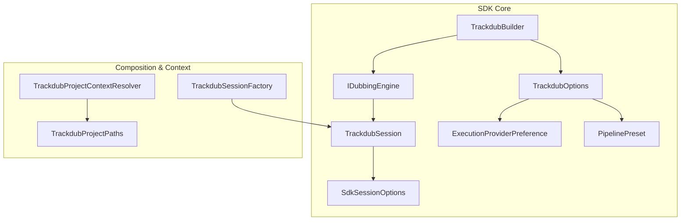
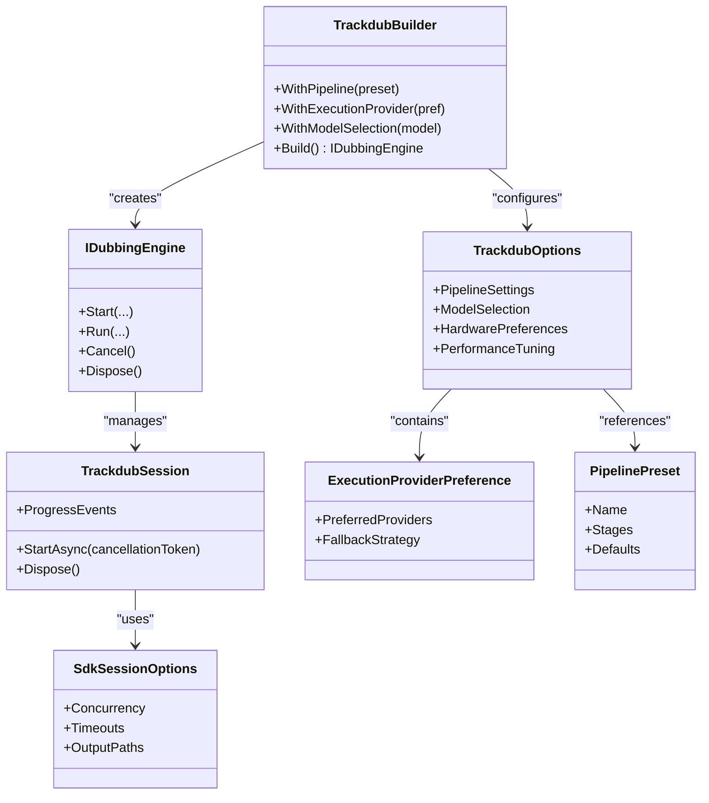
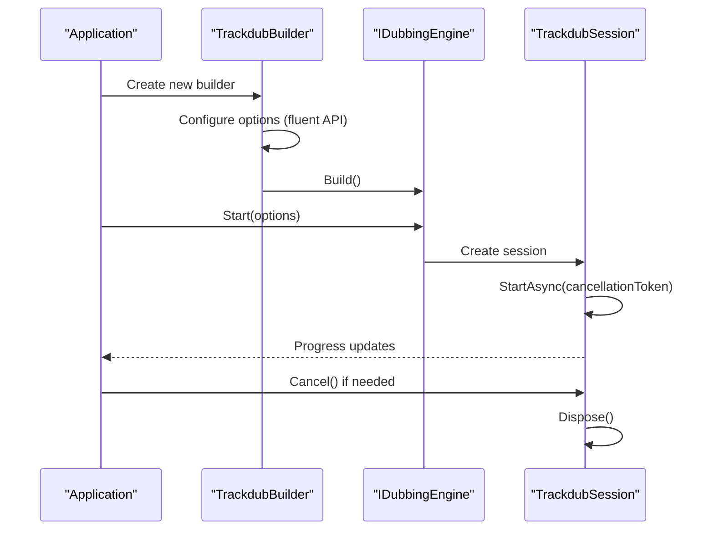
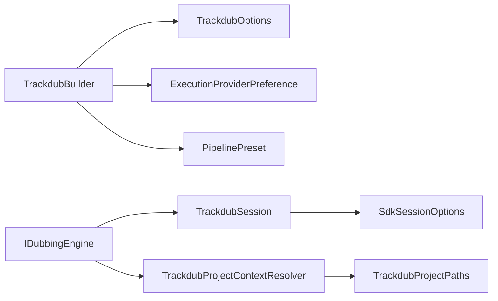

# Core API Interfaces

<cite>
**Referenced Files in This Document**
- [IDubbingEngine.cs](file://src/Trackdub.Sdk/IDubbingEngine.cs)
- [TrackdubBuilder.cs](file://src/Trackdub.Sdk/TrackdubBuilder.cs)
- [TrackdubSession.cs](file://src/Trackdub.Sdk/TrackdubSession.cs)
- [TrackdubOptions.cs](file://src/Trackdub.Sdk/TrackdubOptions.cs)
- [TrackdubSessionFactory.cs](file://src/Trackdub.Sdk/TrackdubSessionFactory.cs)
- [TrackdubDubbingEngine.cs](file://src/Trackdub.Sdk/TrackdubDubbingEngine.cs)
- [SdkSessionOptions.cs](file://src/Trackdub.Sdk/SdkSessionOptions.cs)
- [ExecutionProviderPreference.cs](file://src/Trackdub.Sdk/ExecutionProviderPreference.cs)
- [PipelinePreset.cs](file://src/Trackdub.Sdk/PipelinePreset.cs)
- [TrackdubProjectContextResolver.cs](file://src/Trackdub.Sdk/TrackdubProjectContextResolver.cs)
- [TrackdubProjectPaths.cs](file://src/Trackdub.Sdk/TrackdubProjectPaths.cs)
</cite>

## Table of Contents
1. [Introduction](#introduction)
2. [Project Structure](#project-structure)
3. [Core Components](#core-components)
4. [Architecture Overview](#architecture-overview)
5. [Detailed Component Analysis](#detailed-component-analysis)
6. [Dependency Analysis](#dependency-analysis)
7. [Performance Considerations](#performance-considerations)
8. [Troubleshooting Guide](#troubleshooting-guide)
9. [Conclusion](#conclusion)

## Introduction
This document provides comprehensive documentation for the Trackdub SDK core API interfaces, focusing on:
- IDubbingEngine interface and its methods, parameters, return types, and exception handling patterns
- TrackdubBuilder fluent configuration pattern, option chaining, and validation rules
- TrackdubSession lifecycle management including creation, disposal, and resource cleanup
- TrackdubOptions configuration covering pipeline settings, model selection, hardware preferences, and performance tuning
- Threading models, async/await usage, and cancellation token support

The goal is to enable developers to initialize, configure, and operate the SDK safely and efficiently across different environments.

## Project Structure
The Trackdub SDK exposes a small set of core types that define the public surface area for programmatic dubbing workflows:
- IDubbingEngine: The primary interface for running dubbing pipelines
- TrackdubBuilder: Fluent builder for constructing engine instances with options
- TrackdubSession: Represents a single run session with lifecycle control
- TrackdubOptions: Configuration object for pipeline, models, hardware, and performance
- Supporting types: SdkSessionOptions, ExecutionProviderPreference, PipelinePreset, project context resolvers

**Diagram sources**
- [IDubbingEngine.cs](file://src/Trackdub.Sdk/IDubbingEngine.cs)
- [TrackdubBuilder.cs](file://src/Trackdub.Sdk/TrackdubBuilder.cs)
- [TrackdubSession.cs](file://src/Trackdub.Sdk/TrackdubSession.cs)
- [TrackdubOptions.cs](file://src/Trackdub.Sdk/TrackdubOptions.cs)
- [SdkSessionOptions.cs](file://src/Trackdub.Sdk/SdkSessionOptions.cs)
- [ExecutionProviderPreference.cs](file://src/Trackdub.Sdk/ExecutionProviderPreference.cs)
- [PipelinePreset.cs](file://src/Trackdub.Sdk/PipelinePreset.cs)
- [TrackdubSessionFactory.cs](file://src/Trackdub.Sdk/TrackdubSessionFactory.cs)
- [TrackdubProjectContextResolver.cs](file://src/Trackdub.Sdk/TrackdubProjectContextResolver.cs)
- [TrackdubProjectPaths.cs](file://src/Trackdub.Sdk/TrackdubProjectPaths.cs)

**Section sources**
- [IDubbingEngine.cs](file://src/Trackdub.Sdk/IDubbingEngine.cs)
- [TrackdubBuilder.cs](file://src/Trackdub.Sdk/TrackdubBuilder.cs)
- [TrackdubSession.cs](file://src/Trackdub.Sdk/TrackdubSession.cs)
- [TrackdubOptions.cs](file://src/Trackdub.Sdk/TrackdubOptions.cs)
- [SdkSessionOptions.cs](file://src/Trackdub.Sdk/SdkSessionOptions.cs)
- [ExecutionProviderPreference.cs](file://src/Trackdub.Sdk/ExecutionProviderPreference.cs)
- [PipelinePreset.cs](file://src/Trackdub.Sdk/PipelinePreset.cs)
- [TrackdubSessionFactory.cs](file://src/Trackdub.Sdk/TrackdubSessionFactory.cs)
- [TrackdubProjectContextResolver.cs](file://src/Trackdub.Sdk/TrackdubProjectContextResolver.cs)
- [TrackdubProjectPaths.cs](file://src/Trackdub.Sdk/TrackdubProjectPaths.cs)

## Core Components
- IDubbingEngine: Defines the contract for starting and managing dubbing operations, including method signatures, parameter constraints, and error propagation.
- TrackdubBuilder: Provides a fluent API to assemble an IDubbingEngine instance by chaining configuration options (pipeline presets, execution providers, model selections).
- TrackdubSession: Encapsulates a single execution context with lifecycle methods for start, progress monitoring, cancellation, and disposal.
- TrackdubOptions: Central configuration container for pipeline behavior, model selection, hardware preferences, and performance tuning.
- SdkSessionOptions: Session-scoped overrides such as concurrency, timeouts, and output paths.
- ExecutionProviderPreference: Specifies preferred execution backends (e.g., CPU, GPU, specialized accelerators).
- PipelinePreset: Predefined configurations for common dubbing scenarios.

Key responsibilities:
- Builder validates options and constructs a ready-to-run engine
- Engine orchestrates pipeline stages and manages resources
- Session controls execution flow and handles cancellation
- Options provide declarative configuration for runtime behavior

**Section sources**
- [IDubbingEngine.cs](file://src/Trackdub.Sdk/IDubbingEngine.cs)
- [TrackdubBuilder.cs](file://src/Trackdub.Sdk/TrackdubBuilder.cs)
- [TrackdubSession.cs](file://src/Trackdub.Sdk/TrackdubSession.cs)
- [TrackdubOptions.cs](file://src/Trackdub.Sdk/TrackdubOptions.cs)
- [SdkSessionOptions.cs](file://src/Trackdub.Sdk/SdkSessionOptions.cs)
- [ExecutionProviderPreference.cs](file://src/Trackdub.Sdk/ExecutionProviderPreference.cs)
- [PipelinePreset.cs](file://src/Trackdub.Sdk/PipelinePreset.cs)

## Architecture Overview
The SDK follows a layered architecture:
- Public API layer: IDubbingEngine, TrackdubBuilder, TrackdubSession, TrackdubOptions
- Composition layer: Factory and resolver components that wire dependencies
- Runtime layer: Actual engine implementation and pipeline orchestration

**Diagram sources**
- [IDubbingEngine.cs](file://src/Trackdub.Sdk/IDubbingEngine.cs)
- [TrackdubBuilder.cs](file://src/Trackdub.Sdk/TrackdubBuilder.cs)
- [TrackdubSession.cs](file://src/Trackdub.Sdk/TrackdubSession.cs)
- [TrackdubOptions.cs](file://src/Trackdub.Sdk/TrackdubOptions.cs)
- [SdkSessionOptions.cs](file://src/Trackdub.Sdk/SdkSessionOptions.cs)
- [ExecutionProviderPreference.cs](file://src/Trackdub.Sdk/ExecutionProviderPreference.cs)
- [PipelinePreset.cs](file://src/Trackdub.Sdk/PipelinePreset.cs)

## Detailed Component Analysis

### IDubbingEngine Interface
The IDubbingEngine interface defines the core contract for executing dubbing operations. Key aspects include:
- Method signatures for starting and running dubbing tasks
- Parameter validation and constraint enforcement
- Return types indicating success, failure, or partial completion
- Exception handling patterns for errors during initialization, execution, and cleanup

Typical usage involves:
- Creating an instance via TrackdubBuilder
- Invoking methods with appropriate parameters
- Handling exceptions and cancellation tokens
- Disposing resources properly

**Section sources**
- [IDubbingEngine.cs](file://src/Trackdub.Sdk/IDubbingEngine.cs)

### TrackdubBuilder Configuration Pattern
TrackdubBuilder implements a fluent API for configuring the SDK:
- Option chaining allows setting multiple configuration values in a single statement
- Validation rules ensure required options are provided and valid
- Preset support enables quick setup for common scenarios

Common configuration steps:
- Selecting pipeline presets
- Configuring execution providers
- Setting model preferences
- Defining output paths and performance tuning

Validation occurs during Build() to catch configuration errors early.

**Section sources**
- [TrackdubBuilder.cs](file://src/Trackdub.Sdk/TrackdubBuilder.cs)

### TrackdubSession Lifecycle Management
TrackdubSession represents a single execution context with well-defined lifecycle phases:
- Creation: Obtained from the engine after configuration
- Start: Initiates the dubbing process asynchronously
- Progress: Monitors execution through events or polling
- Cancellation: Supports graceful interruption via cancellation tokens
- Disposal: Ensures proper cleanup of resources

Resource cleanup includes:
- Releasing model caches
- Closing file handles
- Clearing temporary files
- Notifying dependent services

**Section sources**
- [TrackdubSession.cs](file://src/Trackdub.Sdk/TrackdubSession.cs)

### TrackdubOptions Configuration
TrackdubOptions centralizes all configuration for the SDK:
- Pipeline settings: Stage ordering, retry policies, logging levels
- Model selection: Specific model versions, fallback strategies
- Hardware preferences: CPU/GPU selection, memory limits
- Performance tuning: Concurrency levels, buffer sizes, optimization flags

Configuration hierarchy:
- Global defaults
- Environment-specific overrides
- Session-specific customizations

**Section sources**
- [TrackdubOptions.cs](file://src/Trackdub.Sdk/TrackdubOptions.cs)

### Supporting Types
- SdkSessionOptions: Fine-tunes session behavior with concurrency and timeout settings
- ExecutionProviderPreference: Manages hardware acceleration preferences
- PipelinePreset: Provides predefined configurations for common use cases
- TrackdubProjectContextResolver: Resolves project-specific settings and paths
- TrackdubProjectPaths: Manages file system organization for project artifacts

**Section sources**
- [SdkSessionOptions.cs](file://src/Trackdub.Sdk/SdkSessionOptions.cs)
- [ExecutionProviderPreference.cs](file://src/Trackdub.Sdk/ExecutionProviderPreference.cs)
- [PipelinePreset.cs](file://src/Trackdub.Sdk/PipelinePreset.cs)
- [TrackdubProjectContextResolver.cs](file://src/Trackdub.Sdk/TrackdubProjectContextResolver.cs)
- [TrackdubProjectPaths.cs](file://src/Trackdub.Sdk/TrackdubProjectPaths.cs)

### Initialization and Usage Flow
The typical initialization and usage pattern follows these steps:

**Diagram sources**
- [TrackdubBuilder.cs](file://src/Trackdub.Sdk/TrackdubBuilder.cs)
- [IDubbingEngine.cs](file://src/Trackdub.Sdk/IDubbingEngine.cs)
- [TrackdubSession.cs](file://src/Trackdub.Sdk/TrackdubSession.cs)

## Dependency Analysis
The SDK components have clear dependency relationships:
- TrackdubBuilder depends on TrackdubOptions and supporting configuration types
- IDubbingEngine implementations depend on TrackdubSession for execution
- TrackdubSession uses SdkSessionOptions for runtime behavior
- All components may depend on project context resolvers for environment setup

**Diagram sources**
- [TrackdubBuilder.cs](file://src/Trackdub.Sdk/TrackdubBuilder.cs)
- [TrackdubOptions.cs](file://src/Trackdub.Sdk/TrackdubOptions.cs)
- [ExecutionProviderPreference.cs](file://src/Trackdub.Sdk/ExecutionProviderPreference.cs)
- [PipelinePreset.cs](file://src/Trackdub.Sdk/PipelinePreset.cs)
- [IDubbingEngine.cs](file://src/Trackdub.Sdk/IDubbingEngine.cs)
- [TrackdubSession.cs](file://src/Trackdub.Sdk/TrackdubSession.cs)
- [SdkSessionOptions.cs](file://src/Trackdub.Sdk/SdkSessionOptions.cs)
- [TrackdubProjectContextResolver.cs](file://src/Trackdub.Sdk/TrackdubProjectContextResolver.cs)
- [TrackdubProjectPaths.cs](file://src/Trackdub.Sdk/TrackdubProjectPaths.cs)

**Section sources**
- [TrackdubBuilder.cs](file://src/Trackdub.Sdk/TrackdubBuilder.cs)
- [TrackdubOptions.cs](file://src/Trackdub.Sdk/TrackdubOptions.cs)
- [ExecutionProviderPreference.cs](file://src/Trackdub.Sdk/ExecutionProviderPreference.cs)
- [PipelinePreset.cs](file://src/Trackdub.Sdk/PipelinePreset.cs)
- [IDubbingEngine.cs](file://src/Trackdub.Sdk/IDubbingEngine.cs)
- [TrackdubSession.cs](file://src/Trackdub.Sdk/TrackdubSession.cs)
- [SdkSessionOptions.cs](file://src/Trackdub.Sdk/SdkSessionOptions.cs)
- [TrackdubProjectContextResolver.cs](file://src/Trackdub.Sdk/TrackdubProjectContextResolver.cs)
- [TrackdubProjectPaths.cs](file://src/Trackdub.Sdk/TrackdubProjectPaths.cs)

## Performance Considerations
When using the Trackdub SDK, consider these performance guidelines:
- Use appropriate pipeline presets for your workload characteristics
- Configure execution provider preferences based on available hardware
- Tune concurrency settings to match your system capabilities
- Monitor memory usage when processing large audio files
- Enable caching where appropriate to avoid repeated model loading
- Use cancellation tokens to prevent unnecessary work during long-running operations

Optimization strategies:
- Batch similar operations to reduce overhead
- Leverage hardware acceleration when available
- Adjust buffer sizes based on latency requirements
- Profile pipeline stages to identify bottlenecks

## Troubleshooting Guide
Common issues and their resolutions:
- Configuration errors: Validate all required options before building the engine
- Resource exhaustion: Ensure proper disposal of sessions and engines
- Hardware compatibility: Verify execution provider availability on target systems
- Model loading failures: Check model paths and permissions
- Performance degradation: Review concurrency settings and hardware utilization

Debugging techniques:
- Enable detailed logging for pipeline stages
- Monitor memory and CPU usage during execution
- Use cancellation tokens to isolate problematic operations
- Test with smaller datasets before scaling up

Error handling patterns:
- Wrap critical operations in try-catch blocks
- Implement graceful degradation when optional features fail
- Log meaningful error messages with context information
- Provide user-friendly error messages for non-technical users

**Section sources**
- [TrackdubBuilder.cs](file://src/Trackdub.Sdk/TrackdubBuilder.cs)
- [TrackdubSession.cs](file://src/Trackdub.Sdk/TrackdubSession.cs)
- [TrackdubOptions.cs](file://src/Trackdub.Sdk/TrackdubOptions.cs)

## Conclusion
The Trackdub SDK provides a robust and flexible API for implementing dubbing workflows. By following the documented patterns for initialization, configuration, and lifecycle management, developers can create efficient and reliable applications. The fluent builder pattern simplifies configuration, while the session-based approach ensures proper resource management. With careful attention to performance tuning and error handling, the SDK can deliver high-quality dubbing results across diverse environments and use cases.