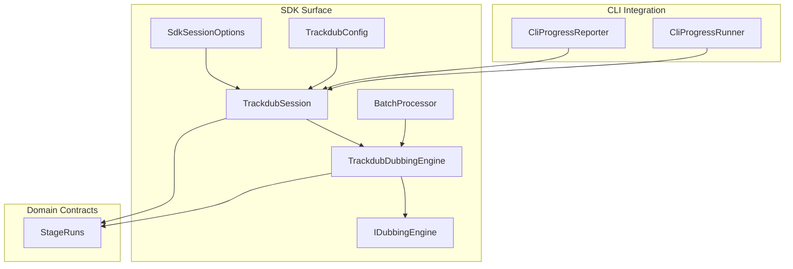
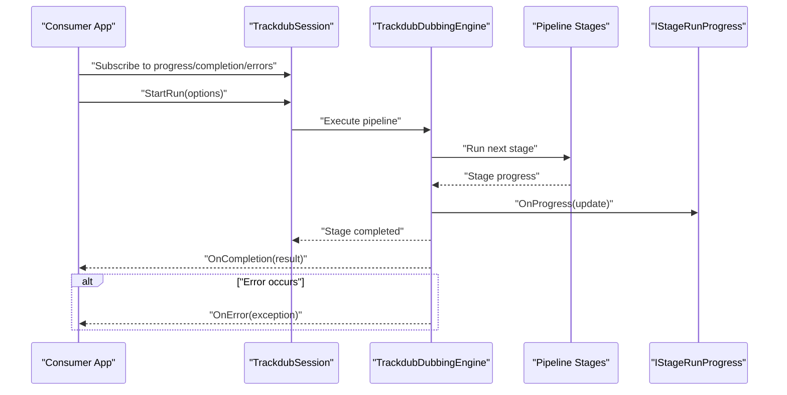
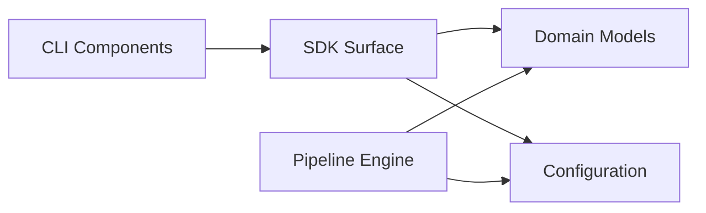

# Event Handling & Progress Tracking

<cite>
**Referenced Files in This Document**
- [TrackdubSession.cs](file://src/Trackdub.Sdk/TrackdubSession.cs)
- [TrackdubDubbingEngine.cs](file://src/Trackdub.Sdk/TrackdubDubbingEngine.cs)
- [BatchProcessor.cs](file://src/Trackdub.Sdk/BatchProcessor.cs)
- [IDubbingEngine.cs](file://src/Trackdub.Sdk/IDubbingEngine.cs)
- [SdkSessionOptions.cs](file://src/Trackdub.Sdk/SdkSessionOptions.cs)
- [TrackdubConfig.cs](file://src/Trackdub.Sdk/TrackdubConfig.cs)
- [CliProgressReporter.cs](file://src/Trackdub.Cli/CliProgressReporter.cs)
- [CliProgressRunner.cs](file://src/Trackdub.Cli/CliProgressRunner.cs)
- [StageRuns.cs](file://src/Trackdub.Domain/StageRuns.cs)
- [StageRunHelperTests.cs](file://tests/Trackdub.Application.Tests/StageRunHelperTests.cs)
- [OrchestrationServiceTests.cs](file://tests/Trackdub.Application.Tests/OrchestrationServiceTests.cs)
- [design-g4-run-progress-eta.md](file://docs/specs/design-g4-run-progress-eta.md)
- [ADR-0015-pipeline-transient-telemetry.md](file://docs/decisions/ADR-0015-pipeline-transient-telemetry.md)
</cite>

## Table of Contents
1. [Introduction](#introduction)
2. [Project Structure](#project-structure)
3. [Core Components](#core-components)
4. [Architecture Overview](#architecture-overview)
5. [Detailed Component Analysis](#detailed-component-analysis)
6. [Dependency Analysis](#dependency-analysis)
7. [Performance Considerations](#performance-considerations)
8. [Troubleshooting Guide](#troubleshooting-guide)
9. [Conclusion](#conclusion)

## Introduction
This document explains how the Trackdub SDK handles events and tracks progress during pipeline runs. It covers event subscription patterns, callback registration, asynchronous processing, real-time progress updates via IStageRunProgress, stage completion and error notifications, diagnostics collection, logging integration, telemetry capture, UI integration examples, event ordering guarantees, thread safety considerations, and performance impact of event handlers.

## Project Structure
The eventing and progress tracking mechanisms span several layers:
- SDK surface for consumers (session, engine, batch processor)
- Domain contracts for stage run state and progress
- CLI integrations that consume SDK events to drive user feedback
- Design decisions and specs that define progress semantics and telemetry behavior

**Diagram sources**
- [TrackdubSession.cs](file://src/Trackdub.Sdk/TrackdubSession.cs)
- [TrackdubDubbingEngine.cs](file://src/Trackdub.Sdk/TrackdubDubbingEngine.cs)
- [BatchProcessor.cs](file://src/Trackdub.Sdk/BatchProcessor.cs)
- [IDubbingEngine.cs](file://src/Trackdub.Sdk/IDubbingEngine.cs)
- [SdkSessionOptions.cs](file://src/Trackdub.Sdk/SdkSessionOptions.cs)
- [TrackdubConfig.cs](file://src/Trackdub.Sdk/TrackdubConfig.cs)
- [StageRuns.cs](file://src/Trackdub.Domain/StageRuns.cs)
- [CliProgressReporter.cs](file://src/Trackdub.Cli/CliProgressReporter.cs)
- [CliProgressRunner.cs](file://src/Trackdub.Cli/CliProgressRunner.cs)

**Section sources**
- [TrackdubSession.cs](file://src/Trackdub.Sdk/TrackdubSession.cs)
- [TrackdubDubbingEngine.cs](file://src/Trackdub.Sdk/TrackdubDubbingEngine.cs)
- [BatchProcessor.cs](file://src/Trackdub.Sdk/BatchProcessor.cs)
- [IDubbingEngine.cs](file://src/Trackdub.Sdk/IDubbingEngine.cs)
- [SdkSessionOptions.cs](file://src/Trackdub.Sdk/SdkSessionOptions.cs)
- [TrackdubConfig.cs](file://src/Trackdub.Sdk/TrackdubConfig.cs)
- [StageRuns.cs](file://src/Trackdub.Domain/StageRuns.cs)
- [CliProgressReporter.cs](file://src/Trackdub.Cli/CliProgressReporter.cs)
- [CliProgressRunner.cs](file://src/Trackdub.Cli/CliProgressRunner.cs)

## Core Components
- TrackdubSession: Entry point for starting runs, subscribing to progress and lifecycle events, and managing session-scoped options.
- TrackdubDubbingEngine: Orchestrates pipeline execution, emits progress updates, and raises completion/error events.
- BatchProcessor: Drives multiple runs with shared configuration and aggregates results while emitting per-run events.
- IDubbingEngine: Abstraction defining the contract for running dubbing pipelines and exposing event hooks.
- SdkSessionOptions: Configures session-level behaviors such as progress reporting, logging, and telemetry toggles.
- TrackdubConfig: Global configuration influencing runtime behavior including diagnostics and telemetry.
- StageRuns: Domain model for stage run state, used by progress and completion events.
- CliProgressReporter / CliProgressRunner: Concrete consumers of SDK events to render progress and status in CLI.

Key responsibilities:
- Provide a consistent event model for progress, completion, and errors across synchronous and asynchronous APIs.
- Ensure ordered delivery of stage-level progress updates within a single run.
- Allow pluggable progress reporters and telemetry sinks without blocking pipeline execution.

**Section sources**
- [TrackdubSession.cs](file://src/Trackdub.Sdk/TrackdubSession.cs)
- [TrackdubDubbingEngine.cs](file://src/Trackdub.Sdk/TrackdubDubbingEngine.cs)
- [BatchProcessor.cs](file://src/Trackdub.Sdk/BatchProcessor.cs)
- [IDubbingEngine.cs](file://src/Trackdub.Sdk/IDubbingEngine.cs)
- [SdkSessionOptions.cs](file://src/Trackdub.Sdk/SdkSessionOptions.cs)
- [TrackdubConfig.cs](file://src/Trackdub.Sdk/TrackdubConfig.cs)
- [StageRuns.cs](file://src/Trackdub.Domain/StageRuns.cs)
- [CliProgressReporter.cs](file://src/Trackdub.Cli/CliProgressReporter.cs)
- [CliProgressRunner.cs](file://src/Trackdub.Cli/CliProgressRunner.cs)

## Architecture Overview
The SDK exposes a session-based API where consumers subscribe to events before invoking run methods. The engine executes stages asynchronously and pushes progress updates through a standardized interface. Completion and error events are raised once a run finishes or fails.

**Diagram sources**
- [TrackdubSession.cs](file://src/Trackdub.Sdk/TrackdubSession.cs)
- [TrackdubDubbingEngine.cs](file://src/Trackdub.Sdk/TrackdubDubbingEngine.cs)
- [StageRuns.cs](file://src/Trackdub.Domain/StageRuns.cs)
- [CliProgressReporter.cs](file://src/Trackdub.Cli/CliProgressReporter.cs)

## Detailed Component Analysis

### TrackdubSession
Responsibilities:
- Expose methods to start runs and attach event subscriptions.
- Hold session-scoped options that influence progress reporting and telemetry.
- Coordinate between the engine and consumer callbacks.

Event subscription patterns:
- Consumers register handlers for progress updates, completion, and errors prior to starting a run.
- Handlers can be attached once per session or per run depending on the API design.

Asynchronous processing:
- Run methods typically return immediately and raise events as work progresses.
- Long-running operations are offloaded to background tasks; UI must marshal updates to the UI thread when needed.

Thread safety:
- Event dispatch is designed to avoid reentrancy issues; handlers should not block indefinitely.
- Progress updates are delivered in order per run; cross-run concurrency is supported.

UI integration guidance:
- Update progress bars using the percentage and stage name from progress updates.
- Show status messages on completion or error, and disable controls until the run finishes.

**Section sources**
- [TrackdubSession.cs](file://src/Trackdub.Sdk/TrackdubSession.cs)
- [SdkSessionOptions.cs](file://src/Trackdub.Sdk/SdkSessionOptions.cs)

### TrackdubDubbingEngine
Responsibilities:
- Execute pipeline stages in sequence or parallelism according to configuration.
- Emit progress updates via IStageRunProgress and raise completion/error events.
- Integrate diagnostics and telemetry around stage execution.

Progress emission:
- For each stage, emit incremental progress updates reflecting work done.
- Include metadata such as stage identifier, elapsed time, and estimated remaining time when available.

Error handling:
- Wrap stage exceptions into structured error events so consumers can react uniformly.
- Ensure cleanup and finalization even on failure paths.

Diagnostics and telemetry:
- Capture timing metrics, resource usage snapshots, and stage-specific counters.
- Respect configuration flags to enable/disable telemetry data capture.

**Section sources**
- [TrackdubDubbingEngine.cs](file://src/Trackdub.Sdk/TrackdubDubbingEngine.cs)
- [StageRuns.cs](file://src/Trackdub.Domain/StageRuns.cs)
- [ADR-0015-pipeline-transient-telemetry.md](file://docs/decisions/ADR-0015-pipeline-transient-telemetry.md)

### BatchProcessor
Responsibilities:
- Iterate over input items and invoke run workflows for each item.
- Aggregate per-run outcomes and emit aggregated reports.
- Maintain event flow consistency across multiple runs.

Event behavior:
- Emits per-run progress and completion events.
- Optionally emits aggregate-level events summarizing success/failure counts.

Performance considerations:
- Limits concurrency to prevent resource saturation.
- Buffers minimal state to reduce memory pressure during large batches.

**Section sources**
- [BatchProcessor.cs](file://src/Trackdub.Sdk/BatchProcessor.cs)

### IDubbingEngine
Contract highlights:
- Defines methods to start runs and expose event hooks for progress, completion, and errors.
- Ensures consistent behavior across different implementations.

Usage:
- Implementations like TrackdubDubbingEngine provide concrete logic while preserving the same event model.

**Section sources**
- [IDubbingEngine.cs](file://src/Trackdub.Sdk/IDubbingEngine.cs)

### SdkSessionOptions and TrackdubConfig
- SdkSessionOptions: Controls session-level settings such as enabling progress reporting, selecting logging providers, and toggling telemetry.
- TrackdubConfig: Provides global defaults and feature flags affecting diagnostics and telemetry behavior.

Configuration impact:
- Disabling telemetry reduces overhead but limits observability.
- Selecting appropriate logging levels balances verbosity with performance.

**Section sources**
- [SdkSessionOptions.cs](file://src/Trackdub.Sdk/SdkSessionOptions.cs)
- [TrackdubConfig.cs](file://src/Trackdub.Sdk/TrackdubConfig.cs)

### CLI Integration: CliProgressReporter and CliProgressRunner
- CliProgressReporter: Consumes SDK events to update console output, progress bars, and status lines.
- CliProgressRunner: Orchestrates CLI commands, subscribes to SDK events, and presents user feedback.

User feedback mechanisms:
- Real-time progress updates with percentages and stage names.
- Clear completion and error messages with actionable hints.

**Section sources**
- [CliProgressReporter.cs](file://src/Trackdub.Cli/CliProgressReporter.cs)
- [CliProgressRunner.cs](file://src/Trackdub.Cli/CliProgressRunner.cs)

### Domain Model: StageRuns
- Represents the state of a stage run, including identifiers, timestamps, and outcome.
- Used by progress and completion events to convey structured information.

Complexity:
- Lightweight DTO-like structure to minimize serialization and copying costs.

**Section sources**
- [StageRuns.cs](file://src/Trackdub.Domain/StageRuns.cs)

## Architecture Overview
The following class diagram shows key types involved in event handling and progress tracking:

```mermaid
classDiagram
class TrackdubSession {
+StartRun(options)
+Subscribe(progressHandler)
+Subscribe(completionHandler)
+Subscribe(errorHandler)
}
class TrackdubDubbingEngine {
+ExecutePipeline()
+EmitProgress(update)
+RaiseCompletion(result)
+RaiseError(exception)
}
class BatchProcessor {
+ProcessItems(items)
+AggregateResults()
}
class IDubbingEngine {
<<interface>>
+StartRun()
+Events()
}
class SdkSessionOptions {
+EnableTelemetry
+LoggingLevel
}
class TrackdubConfig {
+GlobalSettings
}
class StageRuns {
+Id
+Status
+Timestamps
}
class CliProgressReporter {
+OnProgress(update)
+OnCompletion(result)
+OnError(exception)
}
TrackdubSession --> TrackdubDubbingEngine : "uses"
TrackdubDubbingEngine ..|> IDubbingEngine : "implements"
BatchProcessor --> TrackdubDubbingEngine : "invokes"
TrackdubSession --> SdkSessionOptions : "configures"
TrackdubSession --> TrackdubConfig : "reads"
TrackdubDubbingEngine --> StageRuns : "emits"
CliProgressReporter --> TrackdubSession : "subscribes"
```

**Diagram sources**
- [TrackdubSession.cs](file://src/Trackdub.Sdk/TrackdubSession.cs)
- [TrackdubDubbingEngine.cs](file://src/Trackdub.Sdk/TrackdubDubbingEngine.cs)
- [BatchProcessor.cs](file://src/Trackdub.Sdk/BatchProcessor.cs)
- [IDubbingEngine.cs](file://src/Trackdub.Sdk/IDubbingEngine.cs)
- [SdkSessionOptions.cs](file://src/Trackdub.Sdk/SdkSessionOptions.cs)
- [TrackdubConfig.cs](file://src/Trackdub.Sdk/TrackdubConfig.cs)
- [StageRuns.cs](file://src/Trackdub.Domain/StageRuns.cs)
- [CliProgressReporter.cs](file://src/Trackdub.Cli/CliProgressReporter.cs)

## Detailed Component Analysis

### IStageRunProgress Interface and Real-Time Updates
- Purpose: Standardizes how progress updates are delivered to subscribers.
- Typical fields: stage identifier, percentage complete, elapsed time, estimated remaining time, and optional message.
- Delivery guarantees: Ordered per run; concurrent runs deliver independent streams.

UI integration examples:
- Bind percentage to progress bar value.
- Display stage name and message in a status label.
- Disable interactive elements until completion or error.

**Section sources**
- [design-g4-run-progress-eta.md](file://docs/specs/design-g4-run-progress-eta.md)
- [CliProgressReporter.cs](file://src/Trackdub.Cli/CliProgressReporter.cs)

### Stage Completion Events and Error Notifications
- Completion event: Raised when all stages finish successfully; includes result summary.
- Error event: Raised when any stage fails; includes exception details and context.
- Consumers should handle both events to maintain consistent UI states.

Ordering guarantees:
- Completion follows the last progress update for a run.
- Errors interrupt subsequent progress updates for the failing run.

**Section sources**
- [TrackdubDubbingEngine.cs](file://src/Trackdub.Sdk/TrackdubDubbingEngine.cs)
- [StageRuns.cs](file://src/Trackdub.Domain/StageRuns.cs)

### Diagnostics Collection, Logging Integration, and Telemetry
- Diagnostics: Captures timing, resource usage, and stage-specific metrics.
- Logging: Integrates with configured logging providers; respects log levels.
- Telemetry: Optional capture of anonymized metrics; controlled by configuration.

Best practices:
- Avoid heavy computations in progress handlers to keep UI responsive.
- Use async-safe logging to prevent deadlocks.
- Enable detailed logs only when troubleshooting.

**Section sources**
- [ADR-0015-pipeline-transient-telemetry.md](file://docs/decisions/ADR-0015-pipeline-transient-telemetry.md)
- [TrackdubConfig.cs](file://src/Trackdub.Sdk/TrackdubConfig.cs)
- [SdkSessionOptions.cs](file://src/Trackdub.Sdk/SdkSessionOptions.cs)

### Event Ordering Guarantees and Thread Safety
- Ordering: Within a single run, progress updates are delivered in chronological order. Cross-run events may interleave.
- Thread safety: Event dispatch is designed to be safe across threads; handlers must avoid long-running blocking operations.
- Concurrency: Multiple runs can execute concurrently; ensure handlers are idempotent and thread-safe.

**Section sources**
- [StageRunHelperTests.cs](file://tests/Trackdub.Application.Tests/StageRunHelperTests.cs)
- [OrchestrationServiceTests.cs](file://tests/Trackdub.Application.Tests/OrchestrationServiceTests.cs)

### Performance Impact of Event Handlers
- Keep handlers lightweight; defer expensive work to background tasks.
- Throttle UI updates if necessary to avoid excessive redraws.
- Disable telemetry and verbose logging in high-throughput scenarios.

[No sources needed since this section provides general guidance]

## Dependency Analysis
The eventing system has clear boundaries:
- SDK surface depends on domain models for structured progress data.
- CLI components depend on SDK events for user feedback.
- Configuration influences diagnostics and telemetry behavior.

**Diagram sources**
- [TrackdubSession.cs](file://src/Trackdub.Sdk/TrackdubSession.cs)
- [TrackdubDubbingEngine.cs](file://src/Trackdub.Sdk/TrackdubDubbingEngine.cs)
- [StageRuns.cs](file://src/Trackdub.Domain/StageRuns.cs)
- [SdkSessionOptions.cs](file://src/Trackdub.Sdk/SdkSessionOptions.cs)
- [TrackdubConfig.cs](file://src/Trackdub.Sdk/TrackdubConfig.cs)
- [CliProgressReporter.cs](file://src/Trackdub.Cli/CliProgressReporter.cs)

**Section sources**
- [TrackdubSession.cs](file://src/Trackdub.Sdk/TrackdubSession.cs)
- [TrackdubDubbingEngine.cs](file://src/Trackdub.Sdk/TrackdubDubbingEngine.cs)
- [StageRuns.cs](file://src/Trackdub.Domain/StageRuns.cs)
- [SdkSessionOptions.cs](file://src/Trackdub.Sdk/SdkSessionOptions.cs)
- [TrackdubConfig.cs](file://src/Trackdub.Sdk/TrackdubConfig.cs)
- [CliProgressReporter.cs](file://src/Trackdub.Cli/CliProgressReporter.cs)

## Performance Considerations
- Minimize work inside progress handlers; use debouncing for UI updates.
- Prefer async operations to avoid blocking the event loop.
- Configure logging and telemetry appropriately for production vs. development.
- Limit batch concurrency to match hardware capabilities.

[No sources needed since this section provides general guidance]

## Troubleshooting Guide
Common issues and resolutions:
- Missing progress updates: Ensure subscriptions occur before starting runs; verify that progress reporting is enabled in session options.
- UI freezes: Offload heavy work from event handlers; marshal UI updates to the UI thread.
- Inconsistent ordering: Confirm that handlers do not introduce delays; rely on SDK’s ordered delivery per run.
- High CPU usage: Reduce logging verbosity; disable telemetry; throttle handler frequency.

Diagnostic steps:
- Enable detailed logs temporarily to trace event flow.
- Inspect telemetry data to identify bottlenecks.
- Validate configuration flags for diagnostics and telemetry.

**Section sources**
- [StageRunHelperTests.cs](file://tests/Trackdub.Application.Tests/StageRunHelperTests.cs)
- [OrchestrationServiceTests.cs](file://tests/Trackdub.Application.Tests/OrchestrationServiceTests.cs)
- [ADR-0015-pipeline-transient-telemetry.md](file://docs/decisions/ADR-0015-pipeline-transient-telemetry.md)

## Conclusion
The Trackdub SDK provides a robust event-driven model for progress tracking and pipeline orchestration. By subscribing to progress, completion, and error events, consumers can build responsive UIs and reliable automation. Ordered delivery, thread safety, and configurable diagnostics ensure predictable behavior under load. Following the best practices outlined here will help achieve smooth user experiences and efficient resource utilization.

[No sources needed since this section summarizes without analyzing specific files]