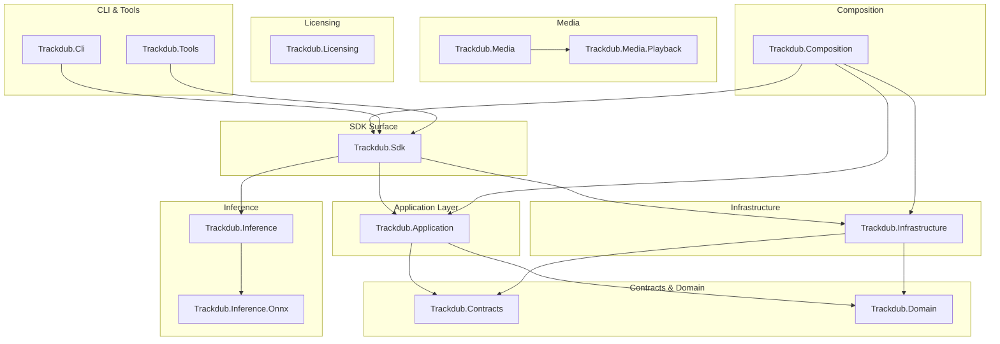
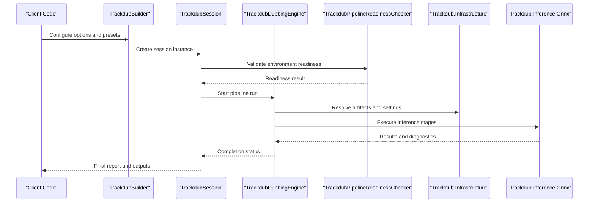
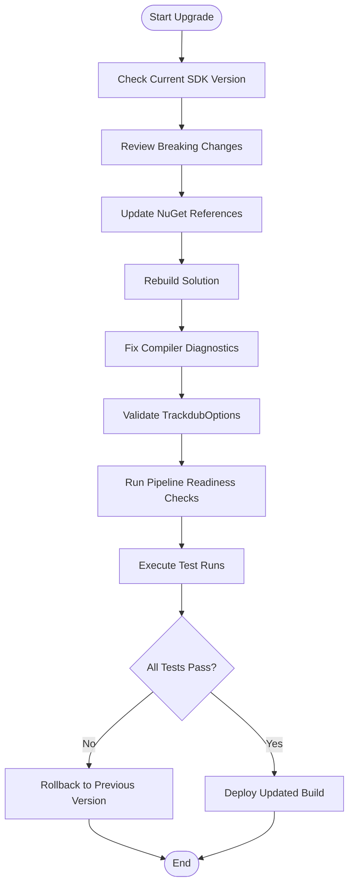
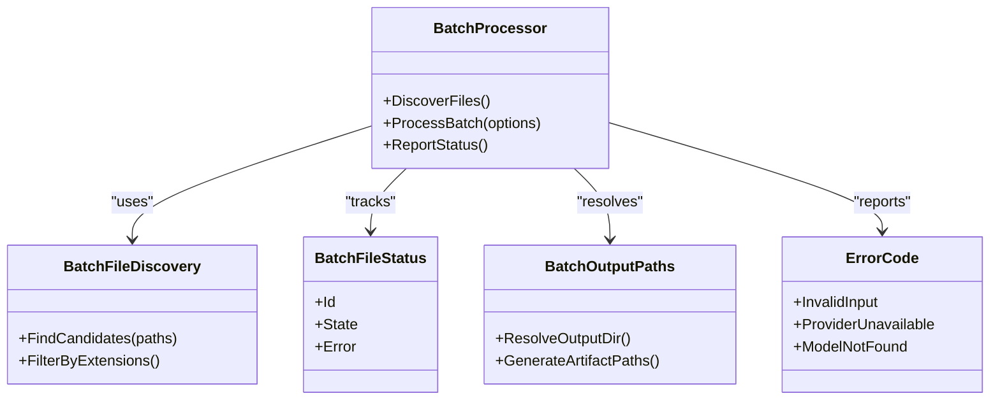
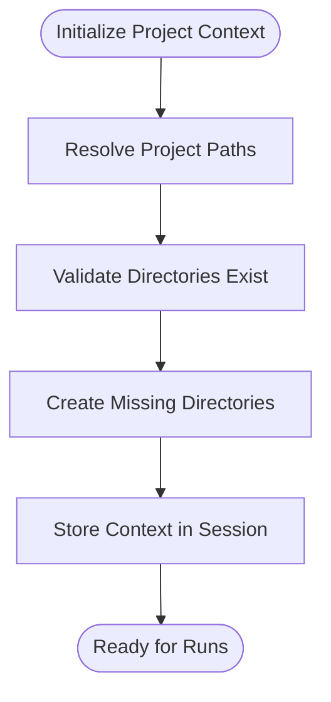

# Migration Guides & Version Compatibility

<cite>
**Referenced Files in This Document**
- [README.md](file://README.md)
- [Directory.Packages.props](file://Directory.Packages.props)
- [global.json](file://global.json)
- [Trackdub.Sdk.csproj](file://src/Trackdub.Sdk/Trackdub.Sdk.csproj)
- [TrackdubBuilder.cs](file://src/Trackdub.Sdk/TrackdubBuilder.cs)
- [TrackdubOptions.cs](file://src/Trackdub.Sdk/TrackdubOptions.cs)
- [TrackdubSession.cs](file://src/Trackdub.Sdk/TrackdubSession.cs)
- [TrackdubProjectContext.cs](file://src/Trackdub.Sdk/TrackdubProjectContext.cs)
- [TrackdubProjectPaths.cs](file://src/Trackdub.Sdk/TrackdubProjectPaths.cs)
- [TrackdubPipelineReadinessChecker.cs](file://src/Trackdub.Sdk/TrackdubPipelineReadinessChecker.cs)
- [TrackdubDubbingEngine.cs](file://src/Trackdub.Sdk/TrackdubDubbingEngine.cs)
- [BatchProcessor.cs](file://src/Trackdub.Sdk/BatchProcessor.cs)
- [ErrorCode.cs](file://src/Trackdub.Sdk/ErrorCode.cs)
- [packages.lock.json](file://src/Trackdub.Sdk/packages.lock.json)
- [Trackdub.Infrastructure.csproj](file://src/Trackdub.Infrastructure/Trackdub.Infrastructure.csproj)
- [Trackdub.Application.csproj](file://src/Trackdub.Application/Trackdub.Application.csproj)
- [Trackdub.Inference.Onnx.csproj](file://src/Trackdub.Inference.Onnx/Trackdub.Inference.Onnx.csproj)
- [Trackdub.Media.csproj](file://src/Trackdub.Media/Trackdub.Media.csproj)
- [Trackdub.Contracts.csproj](file://src/Trackdub.Contracts/Trackdub.Contracts.csproj)
- [Trackdub.Domain.csproj](file://src/Trackdub.Domain/Trackdub.Domain.csproj)
- [Trackdub.Licensing.csproj](file://src/Trackdub.Licensing/Trackdub.Licensing.csproj)
- [Trackdub.Media.Playback.csproj](file://src/Trackdub.Media.Playback/Trackdub.Media.Playback.csproj)
- [Trackdub.Analyzers.csproj](file://src/Trackdub.Analyzers/Trackdub.Analyzers.csproj)
- [Trackdub.Benchmarks.csproj](file://src/Trackdub.Benchmarks/Trackdub.Benchmarks.csproj)
- [Trackdub.Cli.csproj](file://src/Trackdub.Cli/Trackdub.Cli.csproj)
- [Trackdub.Tools.csproj](file://src/Trackdub.Tools/Trackdub.Tools.csproj)
- [Trackdub.Composition.csproj](file://src/Trackdub.Composition/Trackdub.Composition.csproj)
- [Trackdub.OnnxRuntime.Dnnl.Native.csproj](file://src/Trackdub.OnnxRuntime.Dnnl.Native/Trackdub.OnnxRuntime.Dnnl.Native.csproj)
- [Trackdub.slnx](file://Trackdub.slnx)
- [Trackdub.Sdk.slnx](file://Trackdub.Sdk.slnx)
- [Trackdub.Inference.slnx](file://Trackdub.Inference.slnx)
- [NuGet.config](file://NuGet.config)
- [dependabot.yml](file://.github/dependabot.yml)
- [GITHUB_ACTIONS.md](file://docs/operations/GITHUB_ACTIONS.md)
- [TROUBLESHOOTING.md](file://docs/development/TROUBLESHOOTING.md)
- [repository-policy.md](file://docs/repository-policy.md)
</cite>

## Table of Contents
1. [Introduction](#introduction)
2. [Project Structure](#project-structure)
3. [Core Components](#core-components)
4. [Architecture Overview](#architecture-overview)
5. [Detailed Component Analysis](#detailed-component-analysis)
6. [Dependency Analysis](#dependency-analysis)
7. [Performance Considerations](#performance-considerations)
8. [Troubleshooting Guide](#troubleshooting-guide)
9. [Conclusion](#conclusion)
10. [Appendices](#appendices)

## Introduction
This document provides comprehensive migration guides for upgrading the Trackdub SDK across versions and managing compatibility. It covers breaking changes between major versions, deprecated APIs, recommended upgrade paths, version compatibility matrices, dependency requirements, platform support changes, migration strategies for different scenarios (minor updates, major jumps, deprecations), automated migration tools, code transformation scripts, manual steps, backward compatibility policies, deprecation timelines, community support guidelines, troubleshooting assistance, and rollback procedures.

The guidance is grounded in the repository’s SDK surface, project configuration, and operational documentation to ensure accuracy and practical applicability.

## Project Structure
Trackdub is a multi-project .NET solution with clear separation of concerns:
- SDK surface and session orchestration live under src/Trackdub.Sdk
- Application logic resides in src/Trackdub.Application
- Infrastructure, persistence, settings, and runtime helpers are in src/Trackdub.Infrastructure
- Inference abstractions and providers are in src/Trackdub.Inference and src/Trackdub.Inference.Onnx
- Media processing and playback are in src/Trackdub.Media and src/Trackdub.Media.Playback
- Contracts and domain models are in src/Trackdub.Contracts and src/Trackdub.Domain
- Licensing is isolated in src/Trackdub.Licensing
- Composition and bootstrapping are in src/Trackdub.Composition
- CLI and tools are in src/Trackdub.Cli and src/Trackdub.Tools
- Analyzers and benchmarks are in src/Trackdub.Analyzers and src/Trackdub.Benchmarks

[No sources needed since this diagram shows conceptual workflow, not actual code structure]

**Section sources**
- [Trackdub.slnx](file://Trackdub.slnx)
- [Trackdub.Sdk.slnx](file://Trackdub.Sdk.slnx)
- [Trackdub.Inference.slnx](file://Trackdub.Inference.slnx)

## Core Components
Key SDK components that influence migration and compatibility:
- TrackdubBuilder: Entry point for constructing SDK sessions and configuring options
- TrackdubOptions: Configuration object controlling pipeline behavior, execution providers, and presets
- TrackdubSession: Lifecycle management for runs and batch operations
- TrackdubProjectContext and TrackdubProjectPaths: Project scoping and artifact path resolution
- TrackdubPipelineReadinessChecker: Validates environment readiness (e.g., GPU drivers, ONNX runtimes)
- TrackdubDubbingEngine: Orchestrates dubbing stages and integrates with inference providers
- BatchProcessor: Handles batch file discovery, status tracking, and reporting
- ErrorCode: Standardized error codes for consistent diagnostics

These components define the public API surface consumers interact with during upgrades. Changes here typically require code adjustments or reconfiguration.

**Section sources**
- [TrackdubBuilder.cs](file://src/Trackdub.Sdk/TrackdubBuilder.cs)
- [TrackdubOptions.cs](file://src/Trackdub.Sdk/TrackdubOptions.cs)
- [TrackdubSession.cs](file://src/Trackdub.Sdk/TrackdubSession.cs)
- [TrackdubProjectContext.cs](file://src/Trackdub.Sdk/TrackdubProjectContext.cs)
- [TrackdubProjectPaths.cs](file://src/Trackdub.Sdk/TrackdubProjectPaths.cs)
- [TrackdubPipelineReadinessChecker.cs](file://src/Trackdub.Sdk/TrackdubPipelineReadinessChecker.cs)
- [TrackdubDubbingEngine.cs](file://src/Trackdub.Sdk/TrackdubDubbingEngine.cs)
- [BatchProcessor.cs](file://src/Trackdub.Sdk/BatchProcessor.cs)
- [ErrorCode.cs](file://src/Trackdub.Sdk/ErrorCode.cs)

## Architecture Overview
The SDK composes application services, infrastructure, and inference providers through a layered architecture. The composition layer wires dependencies, while the SDK surface exposes stable interfaces for building sessions and running pipelines.

**Diagram sources**
- [TrackdubBuilder.cs](file://src/Trackdub.Sdk/TrackdubBuilder.cs)
- [TrackdubSession.cs](file://src/Trackdub.Sdk/TrackdubSession.cs)
- [TrackdubDubbingEngine.cs](file://src/Trackdub.Sdk/TrackdubDubbingEngine.cs)
- [TrackdubPipelineReadinessChecker.cs](file://src/Trackdub.Sdk/TrackdubPipelineReadinessChecker.cs)
- [Trackdub.Infrastructure.csproj](file://src/Trackdub.Infrastructure/Trackdub.Infrastructure.csproj)
- [Trackdub.Inference.Onnx.csproj](file://src/Trackdub.Inference.Onnx/Trackdub.Inference.Onnx.csproj)

## Detailed Component Analysis

### SDK Session and Builder Upgrade Flow
Upgrading the SDK often involves updating how sessions are constructed and configured. The builder pattern centralizes configuration, making it easier to manage breaking changes by updating option types and defaults.

**Diagram sources**
- [TrackdubBuilder.cs](file://src/Trackdub.Sdk/TrackdubBuilder.cs)
- [TrackdubOptions.cs](file://src/Trackdub.Sdk/TrackdubOptions.cs)
- [TrackdubSession.cs](file://src/Trackdub.Sdk/TrackdubSession.cs)
- [TrackdubPipelineReadinessChecker.cs](file://src/Trackdub.Sdk/TrackdubPipelineReadinessChecker.cs)

**Section sources**
- [TrackdubBuilder.cs](file://src/Trackdub.Sdk/TrackdubBuilder.cs)
- [TrackdubOptions.cs](file://src/Trackdub.Sdk/TrackdubOptions.cs)
- [TrackdubSession.cs](file://src/Trackdub.Sdk/TrackdubSession.cs)
- [TrackdubPipelineReadinessChecker.cs](file://src/Trackdub.Sdk/TrackdubPipelineReadinessChecker.cs)

### Batch Processing Migration
Batch operations rely on file discovery, status tracking, and reporting. When upgrading, ensure batch processors align with new output schemas and error codes.

**Diagram sources**
- [BatchProcessor.cs](file://src/Trackdub.Sdk/BatchProcessor.cs)
- [BatchFileDiscovery.cs](file://src/Trackdub.Sdk/BatchFileDiscovery.cs)
- [BatchFileStatus.cs](file://src/Trackdub.Sdk/BatchFileStatus.cs)
- [BatchOutputPaths.cs](file://src/Trackdub.Sdk/BatchOutputPaths.cs)
- [ErrorCode.cs](file://src/Trackdub.Sdk/ErrorCode.cs)

**Section sources**
- [BatchProcessor.cs](file://src/Trackdub.Sdk/BatchProcessor.cs)
- [BatchFileDiscovery.cs](file://src/Trackdub.Sdk/BatchFileDiscovery.cs)
- [BatchFileStatus.cs](file://src/Trackdub.Sdk/BatchFileStatus.cs)
- [BatchOutputPaths.cs](file://src/Trackdub.Sdk/BatchOutputPaths.cs)
- [ErrorCode.cs](file://src/Trackdub.Sdk/ErrorCode.cs)

### Project Context and Paths
Project context and paths determine where artifacts are stored and retrieved. Upgrades may change default directories or validation rules; ensure your integration respects new path resolution logic.

**Diagram sources**
- [TrackdubProjectContext.cs](file://src/Trackdub.Sdk/TrackdubProjectContext.cs)
- [TrackdubProjectPaths.cs](file://src/Trackdub.Sdk/TrackdubProjectPaths.cs)

**Section sources**
- [TrackdubProjectContext.cs](file://src/Trackdub.Sdk/TrackdubProjectContext.cs)
- [TrackdubProjectPaths.cs](file://src/Trackdub.Sdk/TrackdubProjectPaths.cs)

## Dependency Analysis
Trackdub uses centralized package management via Directory.Packages.props and lock files. Upgrades should be coordinated across projects to avoid version drift.

```mermaid
graph TB
RootProps["Directory.Packages.props"]
SdkProj["Trackdub.Sdk.csproj"]
AppProj["Trackdub.Application.csproj"]
InfraProj["Trackdub.Infrastructure.csproj"]
OnnxProj["Trackdub.Inference.Onnx.csproj"]
MediaProj["Trackdub.Media.csproj"]
ContractsProj["Trackdub.Contracts.csproj"]
DomainProj["Trackdub.Domain.csproj"]
LicensingProj["Trackdub.Licensing.csproj"]
PlaybackProj["Trackdub.Media.Playback.csproj"]
AnalyzersProj["Trackdub.Analyzers.csproj"]
BenchmarksProj["Trackdub.Benchmarks.csproj"]
CliProj["Trackdub.Cli.csproj"]
ToolsProj["Trackdub.Tools.csproj"]
CompositionProj["Trackdub.Composition.csproj"]
DnnlNativeProj["Trackdub.OnnxRuntime.Dnnl.Native.csproj"]
RootProps --> SdkProj
RootProps --> AppProj
RootProps --> InfraProj
RootProps --> OnnxProj
RootProps --> MediaProj
RootProps --> ContractsProj
RootProps --> DomainProj
RootProps --> LicensingProj
RootProps --> PlaybackProj
RootProps --> AnalyzersProj
RootProps --> BenchmarksProj
RootProps --> CliProj
RootProps --> ToolsProj
RootProps --> CompositionProj
RootProps --> DnnlNativeProj
```

**Diagram sources**
- [Directory.Packages.props](file://Directory.Packages.props)
- [Trackdub.Sdk.csproj](file://src/Trackdub.Sdk/Trackdub.Sdk.csproj)
- [Trackdub.Application.csproj](file://src/Trackdub.Application/Trackdub.Application.csproj)
- [Trackdub.Infrastructure.csproj](file://src/Trackdub.Infrastructure/Trackdub.Infrastructure.csproj)
- [Trackdub.Inference.Onnx.csproj](file://src/Trackdub.Inference.Onnx/Trackdub.Inference.Onnx.csproj)
- [Trackdub.Media.csproj](file://src/Trackdub.Media/Trackdub.Media.csproj)
- [Trackdub.Contracts.csproj](file://src/Trackdub.Contracts/Trackdub.Contracts.csproj)
- [Trackdub.Domain.csproj](file://src/Trackdub.Domain/Trackdub.Domain.csproj)
- [Trackdub.Licensing.csproj](file://src/Trackdub.Licensing/Trackdub.Licensing.csproj)
- [Trackdub.Media.Playback.csproj](file://src/Trackdub.Media.Playback/Trackdub.Media.Playback.csproj)
- [Trackdub.Analyzers.csproj](file://src/Trackdub.Analyzers/Trackdub.Analyzers.csproj)
- [Trackdub.Benchmarks.csproj](file://src/Trackdub.Benchmarks/Trackdub.Benchmarks.csproj)
- [Trackdub.Cli.csproj](file://src/Trackdub.Cli/Trackdub.Cli.csproj)
- [Trackdub.Tools.csproj](file://src/Trackdub.Tools/Trackdub.Tools.csproj)
- [Trackdub.Composition.csproj](file://src/Trackdub.Composition/Trackdub.Composition.csproj)
- [Trackdub.OnnxRuntime.Dnnl.Native.csproj](file://src/Trackdub.OnnxRuntime.Dnnl.Native/Trackdub.OnnxRuntime.Dnnl.Native.csproj)

**Section sources**
- [Directory.Packages.props](file://Directory.Packages.props)
- [packages.lock.json](file://src/Trackdub.Sdk/packages.lock.json)
- [NuGet.config](file://NuGet.config)

## Performance Considerations
- Execution Provider Selection: Ensure the correct ONNX execution provider is chosen for your hardware (CPU, CUDA, TensorRT-RTX). Misconfiguration can degrade performance significantly.
- Model Optimization: Use provided optimization recipes and manifests to reduce model size and improve inference speed.
- Batch Size Tuning: Adjust batch sizes based on memory constraints and throughput requirements.
- Artifact Caching: Leverage caching mechanisms to avoid redundant downloads and preprocessing.

[No sources needed since this section provides general guidance]

## Troubleshooting Guide
Common migration issues and resolutions:
- Dependency Conflicts: Align versions across projects using Directory.Packages.props and update lock files.
- Environment Readiness Failures: Verify GPU drivers, ONNX runtime availability, and required native libraries.
- Path Resolution Errors: Confirm project directories exist and permissions are correct.
- License Validation Issues: Ensure licensing components are initialized and tokens are valid.

For detailed steps, consult the development troubleshooting guide and CI/CD documentation.

**Section sources**
- [TROUBLESHOOTING.md](file://docs/development/TROUBLESHOOTING.md)
- [GITHUB_ACTIONS.md](file://docs/operations/GITHUB_ACTIONS.md)

## Conclusion
Upgrading Trackdub SDK requires careful attention to breaking changes, dependency alignment, and environment readiness. By following the migration strategies outlined here—updating references, validating configurations, running readiness checks, and testing thoroughly—you can minimize disruption and maintain robust performance.

[No sources needed since this section summarizes without analyzing specific files]

## Appendices

### Version Compatibility Matrix
- .NET Runtime: Follow global.json for supported versions
- ONNX Runtime: Align with Trackdub.Inference.Onnx requirements
- GPU Drivers: Ensure compatibility with selected execution providers
- Platform Support: Windows, Linux, macOS with respective native dependencies

**Section sources**
- [global.json](file://global.json)
- [Trackdub.Inference.Onnx.csproj](file://src/Trackdub.Inference.Onnx/Trackdub.Inference.Onnx.csproj)

### Deprecation Timeline and Backward Compatibility Policy
- Deprecated APIs: Marked in release notes; supported for at least one minor version after deprecation
- Breaking Changes: Announced in major releases with migration guides
- Community Support: Use issue templates and repository policy for reporting and discussions

**Section sources**
- [repository-policy.md](file://docs/repository-policy.md)
- [dependabot.yml](file://.github/dependabot.yml)

### Automated Migration Tools and Scripts
- Dependabot: Automate dependency updates with PRs for review
- CI Pipelines: Validate builds and tests across platforms
- Local Scripts: Use provided optimization and tooling scripts for pre/post-upgrade tasks

**Section sources**
- [dependabot.yml](file://.github/dependabot.yml)
- [GITHUB_ACTIONS.md](file://docs/operations/GITHUB_ACTIONS.md)

### Rollback Procedures
- Pin Versions: Use exact versions in Directory.Packages.props for critical deployments
- Restore Lock Files: Revert packages.lock.json to known good state
- Rebuild and Test: Validate rollback with full test suite before redeploying

**Section sources**
- [Directory.Packages.props](file://Directory.Packages.props)
- [packages.lock.json](file://src/Trackdub.Sdk/packages.lock.json)