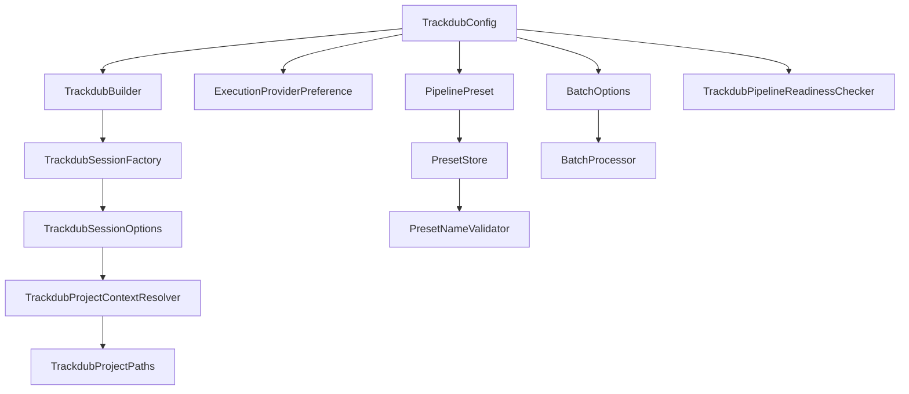
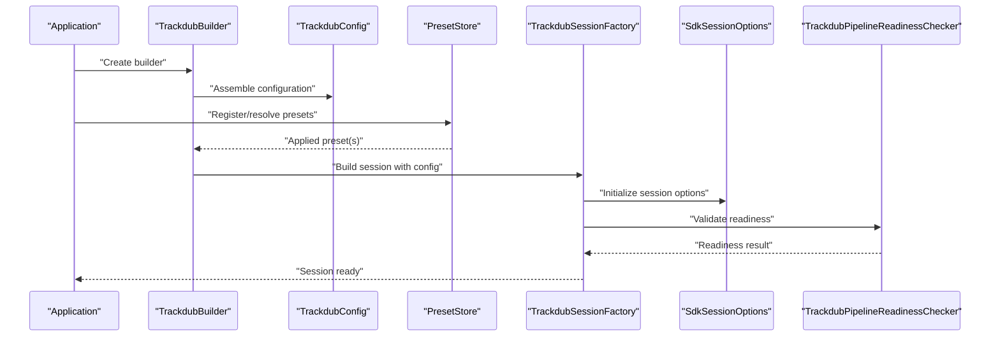
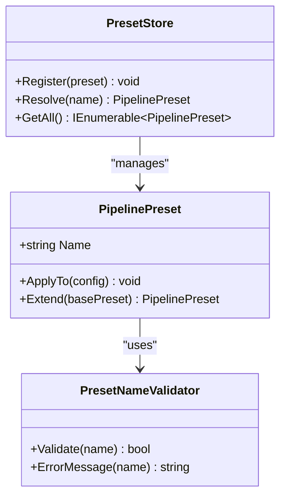
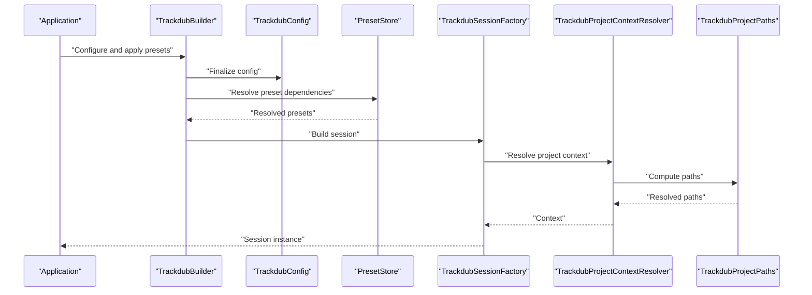
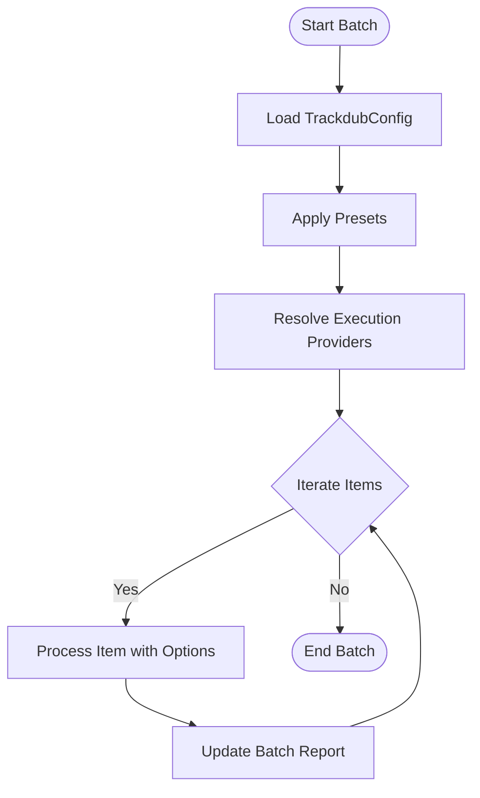
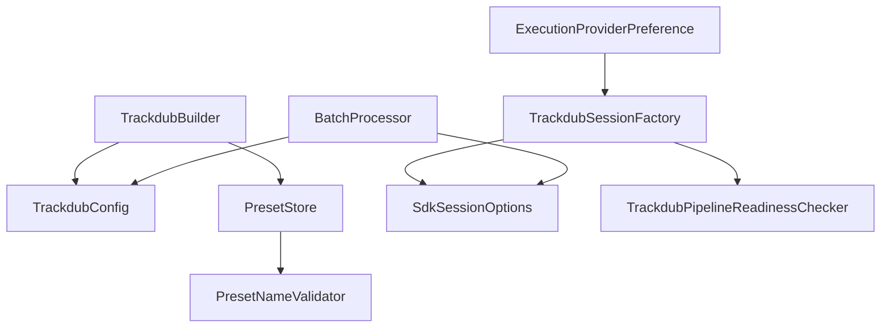

# Pipeline Configuration & Customization

<cite>
**Referenced Files in This Document**
- [TrackdubConfig.cs](file://src/Trackdub.Sdk/TrackdubConfig.cs)
- [ExecutionProviderPreference.cs](file://src/Trackdub.Sdk/ExecutionProviderPreference.cs)
- [PipelinePreset.cs](file://src/Trackdub.Sdk/PipelinePreset.cs)
- [PresetStore.cs](file://src/Trackdub.Sdk/PresetStore.cs)
- [PresetNameValidator.cs](file://src/Trackdub.Sdk/PresetNameValidator.cs)
- [TrackdubBuilder.cs](file://src/Trackdub.Sdk/TrackdubBuilder.cs)
- [SdkSessionOptions.cs](file://src/Trackdub.Sdk/SdkSessionOptions.cs)
- [TrackdubSessionFactory.cs](file://src/Trackdub.Sdk/TrackdubSessionFactory.cs)
- [TrackdubProjectContextResolver.cs](file://src/Trackdub.Sdk/TrackdubProjectContextResolver.cs)
- [TrackdubProjectPaths.cs](file://src/Trackdub.Sdk/TrackdubProjectPaths.cs)
- [TrackdubPipelineReadinessChecker.cs](file://src/Trackdub.Sdk/TrackdubPipelineReadinessChecker.cs)
- [TrackdubDubbingEngine.cs](file://src/Trackdub.Sdk/TrackdubDubbingEngine.cs)
- [BatchOptions.cs](file://src/Trackdub.Sdk/BatchOptions.cs)
- [BatchProcessor.cs](file://src/Trackdub.Sdk/BatchProcessor.cs)
</cite>

## Table of Contents
1. [Introduction](#introduction)
2. [Project Structure](#project-structure)
3. [Core Components](#core-components)
4. [Architecture Overview](#architecture-overview)
5. [Detailed Component Analysis](#detailed-component-analysis)
6. [Dependency Analysis](#dependency-analysis)
7. [Performance Considerations](#performance-considerations)
8. [Troubleshooting Guide](#troubleshooting-guide)
9. [Conclusion](#conclusion)
10. [Appendices](#appendices)

## Introduction
This document explains how to configure and customize the Trackdub SDK pipeline, focusing on configuration structures, preset management, execution provider preferences, validation, and environment-specific settings. It also covers dynamic configuration at runtime, integration with configuration files, and advanced customization patterns for extending the pipeline behavior.

## Project Structure
The SDK exposes a cohesive set of types for configuring the pipeline:
- TrackdubConfig: central configuration object for audio, models, outputs, and processing parameters
- ExecutionProviderPreference: hardware acceleration selection and fallback strategy
- PipelinePreset: named presets that encapsulate common configurations
- PresetStore: registry and lifecycle for presets
- PresetNameValidator: rules for safe preset naming
- Builders and factories: TrackdubBuilder, TrackdubSessionFactory, and related context resolvers
- Batch options and processor: batch-oriented configuration and execution

**Diagram sources**
- [TrackdubConfig.cs](file://src/Trackdub.Sdk/TrackdubConfig.cs)
- [ExecutionProviderPreference.cs](file://src/Trackdub.Sdk/ExecutionProviderPreference.cs)
- [PipelinePreset.cs](file://src/Trackdub.Sdk/PipelinePreset.cs)
- [PresetStore.cs](file://src/Trackdub.Sdk/PresetStore.cs)
- [PresetNameValidator.cs](file://src/Trackdub.Sdk/PresetNameValidator.cs)
- [TrackdubBuilder.cs](file://src/Trackdub.Sdk/TrackdubBuilder.cs)
- [SdkSessionOptions.cs](file://src/Trackdub.Sdk/SdkSessionOptions.cs)
- [TrackdubSessionFactory.cs](file://src/Trackdub.Sdk/TrackdubSessionFactory.cs)
- [TrackdubProjectContextResolver.cs](file://src/Trackdub.Sdk/TrackdubProjectContextResolver.cs)
- [TrackdubProjectPaths.cs](file://src/Trackdub.Sdk/TrackdubProjectPaths.cs)
- [TrackdubPipelineReadinessChecker.cs](file://src/Trackdub.Sdk/TrackdubPipelineReadinessChecker.cs)
- [BatchOptions.cs](file://src/Trackdub.Sdk/BatchOptions.cs)
- [BatchProcessor.cs](file://src/Trackdub.Sdk/BatchProcessor.cs)

**Section sources**
- [TrackdubConfig.cs](file://src/Trackdub.Sdk/TrackdubConfig.cs)
- [ExecutionProviderPreference.cs](file://src/Trackdub.Sdk/ExecutionProviderPreference.cs)
- [PipelinePreset.cs](file://src/Trackdub.Sdk/PipelinePreset.cs)
- [PresetStore.cs](file://src/Trackdub.Sdk/PresetStore.cs)
- [PresetNameValidator.cs](file://src/Trackdub.Sdk/PresetNameValidator.cs)
- [TrackdubBuilder.cs](file://src/Trackdub.Sdk/TrackdubBuilder.cs)
- [SdkSessionOptions.cs](file://src/Trackdub.Sdk/SdkSessionOptions.cs)
- [TrackdubSessionFactory.cs](file://src/Trackdub.Sdk/TrackdubSessionFactory.cs)
- [TrackdubProjectContextResolver.cs](file://src/Trackdub.Sdk/TrackdubProjectContextResolver.cs)
- [TrackdubProjectPaths.cs](file://src/Trackdub.Sdk/TrackdubProjectPaths.cs)
- [TrackdubPipelineReadinessChecker.cs](file://src/Trackdub.Sdk/TrackdubPipelineReadinessChecker.cs)
- [BatchOptions.cs](file://src/Trackdub.Sdk/BatchOptions.cs)
- [BatchProcessor.cs](file://src/Trackdub.Sdk/BatchProcessor.cs)

## Core Components
- TrackdubConfig: aggregates all pipeline configuration including audio settings, model references, output paths, and processing parameters. It is the primary input to builders and session factories.
- ExecutionProviderPreference: defines preferred hardware execution providers (e.g., CPU, GPU) and fallback strategies when a preferred provider is unavailable.
- PipelinePreset: represents a named, reusable configuration bundle that can be applied to TrackdubConfig or used as a base for custom presets.
- PresetStore: manages registration, retrieval, and lifecycle of presets; supports built-in and user-defined presets.
- PresetNameValidator: enforces naming conventions and constraints for preset identifiers.
- TrackdubBuilder: fluent API to assemble TrackdubConfig and build sessions.
- SdkSessionOptions: runtime options passed into sessions created from TrackdubConfig.
- TrackdubSessionFactory: constructs sessions using resolved configuration and options.
- TrackdubProjectContextResolver and TrackdubProjectPaths: resolve project-scoped paths and context for artifact storage and outputs.
- TrackdubPipelineReadinessChecker: validates environment readiness based on configuration and available hardware.
- BatchOptions and BatchProcessor: support batch processing scenarios with shared configuration.

**Section sources**
- [TrackdubConfig.cs](file://src/Trackdub.Sdk/TrackdubConfig.cs)
- [ExecutionProviderPreference.cs](file://src/Trackdub.Sdk/ExecutionProviderPreference.cs)
- [PipelinePreset.cs](file://src/Trackdub.Sdk/PipelinePreset.cs)
- [PresetStore.cs](file://src/Trackdub.Sdk/PresetStore.cs)
- [PresetNameValidator.cs](file://src/Trackdub.Sdk/PresetNameValidator.cs)
- [TrackdubBuilder.cs](file://src/Trackdub.Sdk/TrackdubBuilder.cs)
- [SdkSessionOptions.cs](file://src/Trackdub.Sdk/SdkSessionOptions.cs)
- [TrackdubSessionFactory.cs](file://src/Trackdub.Sdk/TrackdubSessionFactory.cs)
- [TrackdubProjectContextResolver.cs](file://src/Trackdub.Sdk/TrackdubProjectContextResolver.cs)
- [TrackdubProjectPaths.cs](file://src/Trackdub.Sdk/TrackdubProjectPaths.cs)
- [TrackdubPipelineReadinessChecker.cs](file://src/Trackdub.Sdk/TrackdubPipelineReadinessChecker.cs)
- [BatchOptions.cs](file://src/Trackdub.Sdk/BatchOptions.cs)
- [BatchProcessor.cs](file://src/Trackdub.Sdk/BatchProcessor.cs)

## Architecture Overview
The SDK composes configuration through TrackdubConfig, applies presets via PresetStore, selects execution providers with ExecutionProviderPreference, and builds sessions using TrackdubSessionFactory. Readiness checks ensure environment compatibility before execution.

**Diagram sources**
- [TrackdubBuilder.cs](file://src/Trackdub.Sdk/TrackdubBuilder.cs)
- [TrackdubConfig.cs](file://src/Trackdub.Sdk/TrackdubConfig.cs)
- [PresetStore.cs](file://src/Trackdub.Sdk/PresetStore.cs)
- [TrackdubSessionFactory.cs](file://src/Trackdub.Sdk/TrackdubSessionFactory.cs)
- [SdkSessionOptions.cs](file://src/Trackdub.Sdk/SdkSessionOptions.cs)
- [TrackdubPipelineReadinessChecker.cs](file://src/Trackdub.Sdk/TrackdubPipelineReadinessChecker.cs)

## Detailed Component Analysis

### TrackdubConfig
TrackdubConfig is the central configuration container. It typically includes:
- Audio settings: sample rate, channels, loudness normalization, format preferences
- Model configurations: ASR/TTS/translation model references, quantization, device affinity
- Output options: artifact directories, export formats, metadata handling
- Processing parameters: concurrency limits, retry policies, stage toggles, logging verbosity

Usage patterns:
- Construct via TrackdubBuilder fluent API
- Merge with presets from PresetStore
- Validate with readiness checker before building sessions

**Section sources**
- [TrackdubConfig.cs](file://src/Trackdub.Sdk/TrackdubConfig.cs)
- [TrackdubBuilder.cs](file://src/Trackdub.Sdk/TrackdubBuilder.cs)
- [TrackdubPipelineReadinessChecker.cs](file://src/Trackdub.Sdk/TrackdubPipelineReadinessChecker.cs)

### ExecutionProviderPreference
ExecutionProviderPreference controls hardware acceleration selection and fallbacks:
- Preferred provider enumeration (CPU, CUDA, WebGPU, etc.)
- Fallback chain order when preferred provider is unavailable
- Device selection hints and memory budgets where applicable

Behavior:
- Applied during session initialization
- Influences ONNX runtime provider selection
- Can be overridden per-model if supported

**Section sources**
- [ExecutionProviderPreference.cs](file://src/Trackdub.Sdk/ExecutionProviderPreference.cs)
- [TrackdubSessionFactory.cs](file://src/Trackdub.Sdk/TrackdubSessionFactory.cs)

### PipelinePreset and PresetStore
PipelinePreset encapsulates reusable configuration bundles:
- Named presets for common workflows (e.g., “fast”, “balanced”, “high-quality”)
- Base presets that can be extended by custom presets
- Validation of preset names via PresetNameValidator

PresetStore manages:
- Registration of built-in and custom presets
- Resolution by name or inheritance chains
- Lifecycle and caching of preset instances

**Diagram sources**
- [PipelinePreset.cs](file://src/Trackdub.Sdk/PipelinePreset.cs)
- [PresetStore.cs](file://src/Trackdub.Sdk/PresetStore.cs)
- [PresetNameValidator.cs](file://src/Trackdub.Sdk/PresetNameValidator.cs)

**Section sources**
- [PipelinePreset.cs](file://src/Trackdub.Sdk/PipelinePreset.cs)
- [PresetStore.cs](file://src/Trackdub.Sdk/PresetStore.cs)
- [PresetNameValidator.cs](file://src/Trackdub.Sdk/PresetNameValidator.cs)

### Builders, Sessions, and Context Resolution
TrackdubBuilder provides a fluent interface to construct TrackdubConfig and apply presets. TrackdubSessionFactory creates sessions using resolved configuration and options. TrackdubProjectContextResolver and TrackdubProjectPaths determine artifact locations and environment-specific paths.

**Diagram sources**
- [TrackdubBuilder.cs](file://src/Trackdub.Sdk/TrackdubBuilder.cs)
- [TrackdubConfig.cs](file://src/Trackdub.Sdk/TrackdubConfig.cs)
- [PresetStore.cs](file://src/Trackdub.Sdk/PresetStore.cs)
- [TrackdubSessionFactory.cs](file://src/Trackdub.Sdk/TrackdubSessionFactory.cs)
- [TrackdubProjectContextResolver.cs](file://src/Trackdub.Sdk/TrackdubProjectContextResolver.cs)
- [TrackdubProjectPaths.cs](file://src/Trackdub.Sdk/TrackdubProjectPaths.cs)

**Section sources**
- [TrackdubBuilder.cs](file://src/Trackdub.Sdk/TrackdubBuilder.cs)
- [TrackdubSessionFactory.cs](file://src/Trackdub.Sdk/TrackdubSessionFactory.cs)
- [TrackdubProjectContextResolver.cs](file://src/Trackdub.Sdk/TrackdubProjectContextResolver.cs)
- [TrackdubProjectPaths.cs](file://src/Trackdub.Sdk/TrackdubProjectPaths.cs)

### Batch Configuration and Execution
BatchOptions and BatchProcessor enable running multiple jobs with shared configuration:
- Shared TrackdubConfig across batch items
- Per-item overrides where supported
- Aggregated reporting and outcome tracking

**Diagram sources**
- [BatchOptions.cs](file://src/Trackdub.Sdk/BatchOptions.cs)
- [BatchProcessor.cs](file://src/Trackdub.Sdk/BatchProcessor.cs)
- [TrackdubConfig.cs](file://src/Trackdub.Sdk/TrackdubConfig.cs)

**Section sources**
- [BatchOptions.cs](file://src/Trackdub.Sdk/BatchOptions.cs)
- [BatchProcessor.cs](file://src/Trackdub.Sdk/BatchProcessor.cs)

## Dependency Analysis
Key relationships:
- TrackdubBuilder depends on TrackdubConfig and PresetStore to assemble final configuration
- TrackdubSessionFactory depends on SdkSessionOptions and readiness checker to validate environment
- ExecutionProviderPreference influences runtime provider selection within session creation
- PresetStore depends on PresetNameValidator for safe naming
- BatchProcessor uses shared TrackdubConfig and per-item options

**Diagram sources**
- [TrackdubBuilder.cs](file://src/Trackdub.Sdk/TrackdubBuilder.cs)
- [TrackdubConfig.cs](file://src/Trackdub.Sdk/TrackdubConfig.cs)
- [PresetStore.cs](file://src/Trackdub.Sdk/PresetStore.cs)
- [TrackdubSessionFactory.cs](file://src/Trackdub.Sdk/TrackdubSessionFactory.cs)
- [SdkSessionOptions.cs](file://src/Trackdub.Sdk/SdkSessionOptions.cs)
- [TrackdubPipelineReadinessChecker.cs](file://src/Trackdub.Sdk/TrackdubPipelineReadinessChecker.cs)
- [ExecutionProviderPreference.cs](file://src/Trackdub.Sdk/ExecutionProviderPreference.cs)
- [BatchProcessor.cs](file://src/Trackdub.Sdk/BatchProcessor.cs)

**Section sources**
- [TrackdubBuilder.cs](file://src/Trackdub.Sdk/TrackdubBuilder.cs)
- [TrackdubConfig.cs](file://src/Trackdub.Sdk/TrackdubConfig.cs)
- [PresetStore.cs](file://src/Trackdub.Sdk/PresetStore.cs)
- [TrackdubSessionFactory.cs](file://src/Trackdub.Sdk/TrackdubSessionFactory.cs)
- [SdkSessionOptions.cs](file://src/Trackdub.Sdk/SdkSessionOptions.cs)
- [TrackdubPipelineReadinessChecker.cs](file://src/Trackdub.Sdk/TrackdubPipelineReadinessChecker.cs)
- [ExecutionProviderPreference.cs](file://src/Trackdub.Sdk/ExecutionProviderPreference.cs)
- [BatchProcessor.cs](file://src/Trackdub.Sdk/BatchProcessor.cs)

## Performance Considerations
- Prefer GPU execution providers when available; define fallback to CPU for robustness
- Use presets to tune quality vs. speed trade-offs consistently across runs
- Limit concurrency based on device memory and CPU capacity
- Enable readiness checks early to avoid wasted work on incompatible environments
- For batch processing, reuse sessions where possible to reduce startup overhead

[No sources needed since this section provides general guidance]

## Troubleshooting Guide
Common issues and resolutions:
- Invalid preset names: use PresetNameValidator to catch errors early
- Hardware provider unavailability: adjust ExecutionProviderPreference fallback order
- Path resolution failures: verify project context and paths via resolver
- Readiness check failures: inspect environment capabilities and model availability

**Section sources**
- [PresetNameValidator.cs](file://src/Trackdub.Sdk/PresetNameValidator.cs)
- [ExecutionProviderPreference.cs](file://src/Trackdub.Sdk/ExecutionProviderPreference.cs)
- [TrackdubProjectContextResolver.cs](file://src/Trackdub.Sdk/TrackdubProjectContextResolver.cs)
- [TrackdubPipelineReadinessChecker.cs](file://src/Trackdub.Sdk/TrackdubPipelineReadinessChecker.cs)

## Conclusion
Trackdub SDK’s configuration system centers around TrackdubConfig, enriched by presets and execution provider preferences. Builders and factories streamline session creation, while readiness checks and validators ensure reliability. Batch processing leverages shared configuration for efficiency. By following the patterns outlined here, you can create robust, customizable pipelines tailored to your environment and performance goals.

[No sources needed since this section summarizes without analyzing specific files]

## Appendices

### Dynamic Configuration and Runtime Adjustment
- Modify TrackdubConfig properties before building sessions
- Apply different presets at runtime for different workloads
- Override execution provider preferences per session if needed

**Section sources**
- [TrackdubConfig.cs](file://src/Trackdub.Sdk/TrackdubConfig.cs)
- [PresetStore.cs](file://src/Trackdub.Sdk/PresetStore.cs)
- [ExecutionProviderPreference.cs](file://src/Trackdub.Sdk/ExecutionProviderPreference.cs)

### Configuration File Integration
- Serialize TrackdubConfig to JSON/YAML for persistence
- Load configuration at startup and merge with presets
- Validate configuration against environment capabilities

**Section sources**
- [TrackdubConfig.cs](file://src/Trackdub.Sdk/TrackdubConfig.cs)
- [TrackdubPipelineReadinessChecker.cs](file://src/Trackdub.Sdk/TrackdubPipelineReadinessChecker.cs)

### Advanced Customization Patterns
- Extend PipelinePreset to implement domain-specific defaults
- Implement custom execution provider selection logic via ExecutionProviderPreference
- Hook into session lifecycle through SdkSessionOptions for telemetry or metrics

**Section sources**
- [PipelinePreset.cs](file://src/Trackdub.Sdk/PipelinePreset.cs)
- [ExecutionProviderPreference.cs](file://src/Trackdub.Sdk/ExecutionProviderPreference.cs)
- [SdkSessionOptions.cs](file://src/Trackdub.Sdk/SdkSessionOptions.cs)