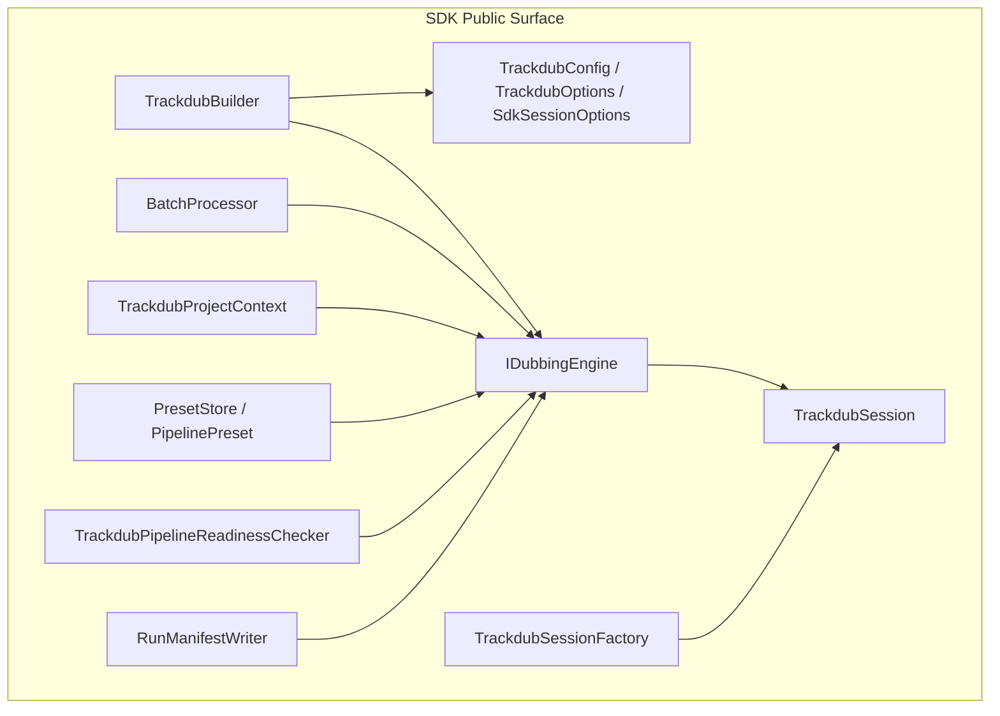
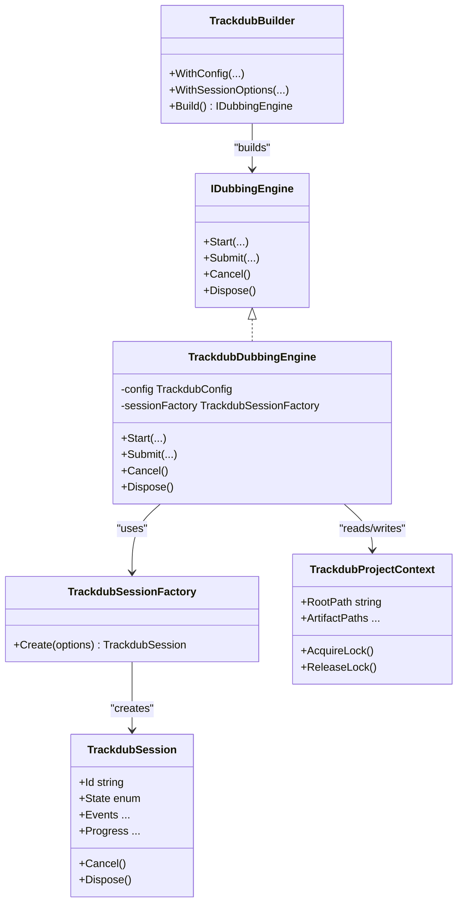
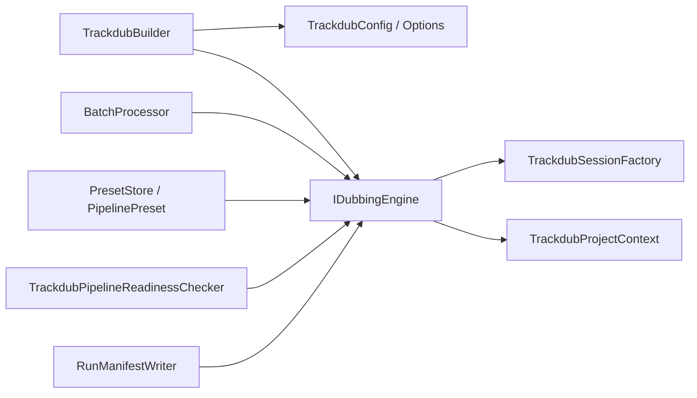

# SDK API Reference

<cite>
**Referenced Files in This Document**
- [IDubbingEngine.cs](file://src/Trackdub.Sdk/IDubbingEngine.cs)
- [TrackdubBuilder.cs](file://src/Trackdub.Sdk/TrackdubBuilder.cs)
- [TrackdubSession.cs](file://src/Trackdub.Sdk/TrackdubSession.cs)
- [TrackdubSessionFactory.cs](file://src/Trackdub.Sdk/TrackdubSessionFactory.cs)
- [TrackdubConfig.cs](file://src/Trackdub.Sdk/TrackdubConfig.cs)
- [TrackdubOptions.cs](file://src/Trackdub.Sdk/TrackdubOptions.cs)
- [SdkSessionOptions.cs](file://src/Trackdub.Sdk/SdkSessionOptions.cs)
- [BatchProcessor.cs](file://src/Trackdub.Sdk/BatchProcessor.cs)
- [BatchOptions.cs](file://src/Trackdub.Sdk/BatchOptions.cs)
- [BatchFileStatus.cs](file://src/Trackdub.Sdk/BatchFileStatus.cs)
- [BatchFileOutcome.cs](file://src/Trackdub.Sdk/BatchFileOutcome.cs)
- [ErrorCode.cs](file://src/Trackdub.Sdk/ErrorCode.cs)
- [ProjectLockedException.cs](file://src/Trackdub.Sdk/ProjectLockedException.cs)
- [TrackdubDubbingEngine.cs](file://src/Trackdub.Sdk/TrackdubDubbingEngine.cs)
- [TrackdubProjectContext.cs](file://src/Trackdub.Sdk/TrackdubProjectContext.cs)
- [TrackdubProjectContextResolver.cs](file://src/Trackdub.Sdk/TrackdubProjectContextResolver.cs)
- [TrackdubProjectPaths.cs](file://src/Trackdub.Sdk/TrackdubProjectPaths.cs)
- [ExecutionProviderPreference.cs](file://src/Trackdub.Sdk/ExecutionProviderPreference.cs)
- [PipelinePreset.cs](file://src/Trackdub.Sdk/PipelinePreset.cs)
- [PresetStore.cs](file://src/Trackdub.Sdk/PresetStore.cs)
- [PresetNameValidator.cs](file://src/Trackdub.Sdk/PresetNameValidator.cs)
- [TrackdubPipelineReadinessChecker.cs](file://src/Trackdub.Sdk/TrackdubPipelineReadinessChecker.cs)
- [RunManifestWriter.cs](file://src/Trackdub.Sdk/RunManifestWriter.cs)
</cite>

## Table of Contents
1. [Introduction](#introduction)
2. [Project Structure](#project-structure)
3. [Core Components](#core-components)
4. [Architecture Overview](#architecture-overview)
5. [Detailed Component Analysis](#detailed-component-analysis)
6. [Dependency Analysis](#dependency-analysis)
7. [Performance Considerations](#performance-considerations)
8. [Troubleshooting Guide](#troubleshooting-guide)
9. [Conclusion](#conclusion)
10. [Appendices](#appendices)

## Introduction
This document provides a comprehensive SDK API reference for programmatic integration with Trackdub. It focuses on the IDubbingEngine interface, TrackdubBuilder configuration, and TrackdubSession lifecycle management. It also covers batch processing, custom pipeline development, real-time dubbing patterns, configuration options, event handling, progress tracking, threading models, resource management, performance optimization, authentication/licensing integration, migration guidance, error handling strategies, logging integration, and debugging techniques.

## Project Structure
The Trackdub SDK is implemented under src/Trackdub.Sdk and exposes a clean public surface for consumers:
- Engine abstraction: IDubbingEngine defines the core dubbing operations.
- Builder and configuration: TrackdubBuilder and related config types provide fluent setup.
- Session management: TrackdubSession and TrackdubSessionFactory manage per-run state and resources.
- Batch processing: BatchProcessor and associated models support high-throughput workflows.
- Project context: TrackdubProjectContext and helpers encapsulate project paths and locking.
- Pipeline presets and readiness: PresetStore, PipelinePreset, and readiness checker streamline pipeline selection and validation.
- Diagnostics and manifests: RunManifestWriter supports run provenance and diagnostics.

[No sources needed since this diagram shows conceptual structure, not specific code mappings]

## Core Components
- IDubbingEngine: The primary interface for starting, controlling, and monitoring dubbing runs. It exposes methods to start sessions, submit work items, observe progress, and dispose resources.
- TrackdubBuilder: Fluent builder used to configure the engine, set execution providers, select presets, and bind project context and session options before creating an engine instance.
- TrackdubSession: Represents a single dubbing run or job scope. It manages lifecycle (start, pause/resume if supported, cancel), emits events, and tracks progress and outcomes.
- TrackdubSessionFactory: Factory responsible for constructing TrackdubSession instances from configured builders and options.
- BatchProcessor: Orchestrates batch jobs across multiple files, reporting per-file status and aggregated results.
- TrackdubProjectContext: Encapsulates project root, artifact directories, and locking semantics to prevent concurrent modifications.
- Configuration objects: TrackdubConfig, TrackdubOptions, and SdkSessionOptions define runtime behavior such as execution provider preferences, model selection, concurrency, and output paths.
- Presets and readiness: PresetStore and PipelinePreset allow selecting predefined pipeline configurations; TrackdubPipelineReadinessChecker validates environment and model availability.
- Diagnostics: RunManifestWriter writes structured run metadata for traceability and post-run analysis.

**Section sources**
- [IDubbingEngine.cs](file://src/Trackdub.Sdk/IDubbingEngine.cs)
- [TrackdubBuilder.cs](file://src/Trackdub.Sdk/TrackdubBuilder.cs)
- [TrackdubSession.cs](file://src/Trackdub.Sdk/TrackdubSession.cs)
- [TrackdubSessionFactory.cs](file://src/Trackdub.Sdk/TrackdubSessionFactory.cs)
- [BatchProcessor.cs](file://src/Trackdub.Sdk/BatchProcessor.cs)
- [TrackdubProjectContext.cs](file://src/Trackdub.Sdk/TrackdubProjectContext.cs)
- [TrackdubConfig.cs](file://src/Trackdub.Sdk/TrackdubConfig.cs)
- [TrackdubOptions.cs](file://src/Trackdub.Sdk/TrackdubOptions.cs)
- [SdkSessionOptions.cs](file://src/Trackdub.Sdk/SdkSessionOptions.cs)
- [PresetStore.cs](file://src/Trackdub.Sdk/PresetStore.cs)
- [PipelinePreset.cs](file://src/Trackdub.Sdk/PipelinePreset.cs)
- [TrackdubPipelineReadinessChecker.cs](file://src/Trackdub.Sdk/TrackdubPipelineReadinessChecker.cs)
- [RunManifestWriter.cs](file://src/Trackdub.Sdk/RunManifestWriter.cs)

## Architecture Overview
The SDK follows a layered architecture:
- Consumer layer: Your application uses TrackdubBuilder to configure and obtain an IDubbingEngine.
- Engine layer: IDubbingEngine abstracts dubbing orchestration and delegates to concrete implementations (e.g., TrackdubDubbingEngine).
- Session layer: TrackdubSession encapsulates per-run state, events, and progress.
- Context layer: TrackdubProjectContext ensures consistent project layout and locking.
- Infrastructure layer: Execution providers, model loaders, and IO utilities are selected via configuration and readiness checks.

**Diagram sources**
- [IDubbingEngine.cs](file://src/Trackdub.Sdk/IDubbingEngine.cs)
- [TrackdubDubbingEngine.cs](file://src/Trackdub.Sdk/TrackdubDubbingEngine.cs)
- [TrackdubSession.cs](file://src/Trackdub.Sdk/TrackdubSession.cs)
- [TrackdubSessionFactory.cs](file://src/Trackdub.Sdk/TrackdubSessionFactory.cs)
- [TrackdubBuilder.cs](file://src/Trackdub.Sdk/TrackdubBuilder.cs)
- [TrackdubProjectContext.cs](file://src/Trackdub.Sdk/TrackdubProjectContext.cs)

## Detailed Component Analysis

### IDubbingEngine Interface
Responsibilities:
- Start a new dubbing run and return a session handle.
- Submit work items (files, segments, or tasks) to the engine.
- Cancel ongoing operations gracefully.
- Dispose resources safely.

Key behaviors:
- Thread-safety: Methods should be safe to call from multiple threads where appropriate.
- Progress and events: Consumers can subscribe to progress updates and lifecycle events through the returned session.
- Resource management: Ensure proper disposal to release model handles, file locks, and temporary artifacts.

Common usage pattern:
- Build an engine using TrackdubBuilder.
- Start a session and subscribe to events.
- Submit one or more work items.
- Monitor progress and handle completion or cancellation.
- Dispose the engine when done.

**Section sources**
- [IDubbingEngine.cs](file://src/Trackdub.Sdk/IDubbingEngine.cs)

### TrackdubBuilder Configuration
Responsibilities:
- Configure TrackdubConfig and SdkSessionOptions.
- Select execution providers and pipeline presets.
- Bind project context and output paths.
- Validate preset names and readiness constraints.

Configuration highlights:
- ExecutionProviderPreference: Choose CPU/GPU backends and fallback order.
- PipelinePreset: Select predefined pipelines optimized for different scenarios.
- PresetNameValidator: Ensure preset names conform to supported values.
- TrackdubPipelineReadinessChecker: Verify environment and model availability before running.

Typical flow:
- Create TrackdubBuilder.
- WithConfig(...), WithSessionOptions(...), WithPreset(...), WithExecutionProviders(...).
- Build() returns IDubbingEngine.

**Section sources**
- [TrackdubBuilder.cs](file://src/Trackdub.Sdk/TrackdubBuilder.cs)
- [TrackdubConfig.cs](file://src/Trackdub.Sdk/TrackdubConfig.cs)
- [TrackdubOptions.cs](file://src/Trackdub.Sdk/TrackdubOptions.cs)
- [SdkSessionOptions.cs](file://src/Trackdub.Sdk/SdkSessionOptions.cs)
- [ExecutionProviderPreference.cs](file://src/Trackdub.Sdk/ExecutionProviderPreference.cs)
- [PipelinePreset.cs](file://src/Trackdub.Sdk/PipelinePreset.cs)
- [PresetNameValidator.cs](file://src/Trackdub.Sdk/PresetNameValidator.cs)
- [TrackdubPipelineReadinessChecker.cs](file://src/Trackdub.Sdk/TrackdubPipelineReadinessChecker.cs)

### TrackdubSession Lifecycle Management
Responsibilities:
- Represent a single dubbing run with unique Id and State.
- Emit events for lifecycle transitions (created, started, paused, completed, failed).
- Provide progress tracking (percent complete, ETA, stage details).
- Support cancellation and graceful shutdown.
- Dispose to release resources.

Lifecycle states:
- Created -> Started -> Processing -> Completed or Failed
- Optional Paused during processing depending on implementation.

Event handling:
- Subscribe to progress events to update UI or log metrics.
- Handle completion/failure events to collect outputs or errors.

Cancellation:
- Call Cancel to request early termination; ensure handlers respect cancellation tokens.

Disposal:
- Always dispose sessions to free memory and file handles.

**Section sources**
- [TrackdubSession.cs](file://src/Trackdub.Sdk/TrackdubSession.cs)

### TrackdubSessionFactory
Responsibilities:
- Construct TrackdubSession instances based on provided options.
- Apply default settings and validate inputs.
- Initialize necessary infrastructure (e.g., model caches, IO contexts).

Usage:
- Obtain via TrackdubBuilder.Build() or directly if you already have a configured engine.
- Use factory to create multiple sessions for parallel runs.

**Section sources**
- [TrackdubSessionFactory.cs](file://src/Trackdub.Sdk/TrackdubSessionFactory.cs)

### TrackdubProjectContext and Paths
Responsibilities:
- Resolve project root and artifact directories.
- Enforce project locking to avoid concurrent modifications.
- Provide path utilities for input/output consistency.

Concurrency:
- AcquireLock() prevents overlapping writes; ReleaseLock() must be called after use.

**Section sources**
- [TrackdubProjectContext.cs](file://src/Trackdub.Sdk/TrackdubProjectContext.cs)
- [TrackdubProjectContextResolver.cs](file://src/Trackdub.Sdk/TrackdubProjectContextResolver.cs)
- [TrackdubProjectPaths.cs](file://src/Trackdub.Sdk/TrackdubProjectPaths.cs)

### Batch Processing with BatchProcessor
Responsibilities:
- Process multiple files concurrently or sequentially based on options.
- Report per-file status and aggregate outcomes.
- Support resuming partial batches and generating reports.

Key types:
- BatchOptions: Controls concurrency, retry policies, and output paths.
- BatchFileStatus: Per-file processing state.
- BatchFileOutcome: Final result including success, failure, and diagnostics.
- BatchReport: Aggregated summary of batch execution.

Flow:
- Prepare list of input files.
- Configure BatchOptions (parallelism, retries, output directory).
- Invoke processor to run and collect report.

**Section sources**
- [BatchProcessor.cs](file://src/Trackdub.Sdk/BatchProcessor.cs)
- [BatchOptions.cs](file://src/Trackdub.Sdk/BatchOptions.cs)
- [BatchFileStatus.cs](file://src/Trackdub.Sdk/BatchFileStatus.cs)
- [BatchFileOutcome.cs](file://src/Trackdub.Sdk/BatchFileOutcome.cs)

### Error Handling and Exceptions
Error codes:
- ErrorCode enumerates common failure categories for structured error handling.

Exceptions:
- ProjectLockedException indicates concurrent access violations.

Strategies:
- Catch specific exceptions and map to user-friendly messages.
- Log detailed diagnostics using RunManifestWriter for post-mortem analysis.
- Implement retry logic for transient failures where applicable.

**Section sources**
- [ErrorCode.cs](file://src/Trackdub.Sdk/ErrorCode.cs)
- [ProjectLockedException.cs](file://src/Trackdub.Sdk/ProjectLockedException.cs)

### Real-Time Dubbing Patterns
Guidelines:
- Use short-lived sessions for low-latency streams.
- Prefer lightweight presets and smaller models for faster inference.
- Stream audio chunks and process incrementally; buffer carefully to maintain latency targets.
- Monitor GPU/CPU utilization and adjust concurrency accordingly.

Threading model:
- Offload heavy processing to background threads.
- Avoid blocking the UI thread; use async patterns and cancellation tokens.

**Section sources**
- [TrackdubSession.cs](file://src/Trackdub.Sdk/TrackdubSession.cs)
- [ExecutionProviderPreference.cs](file://src/Trackdub.Sdk/ExecutionProviderPreference.cs)

### Custom Pipeline Development
Approach:
- Define custom stages that implement required interfaces.
- Register stages via configuration or composition root.
- Use presets to bundle reusable configurations.

Validation:
- Use TrackdubPipelineReadinessChecker to ensure all dependencies are available.
- Validate preset names with PresetNameValidator.

**Section sources**
- [PipelinePreset.cs](file://src/Trackdub.Sdk/PipelinePreset.cs)
- [PresetStore.cs](file://src/Trackdub.Sdk/PresetStore.cs)
- [PresetNameValidator.cs](file://src/Trackdub.Sdk/PresetNameValidator.cs)
- [TrackdubPipelineReadinessChecker.cs](file://src/Trackdub.Sdk/TrackdubPipelineReadinessChecker.cs)

### Authentication and Licensing Integration
Patterns:
- Integrate licensing checks at application startup before creating the engine.
- Store license tokens securely and refresh as needed.
- Fail fast with clear error messages if licensing fails.

Implementation tips:
- Wrap licensing calls with retry and timeout handling.
- Cache hardware fingerprints to reduce overhead.

**Section sources**
- [TrackdubConfig.cs](file://src/Trackdub.Sdk/TrackdubConfig.cs)
- [TrackdubOptions.cs](file://src/Trackdub.Sdk/TrackdubOptions.cs)

### Logging Integration and Debugging
Logging:
- Route SDK logs through your application logger.
- Enable verbose logging during development and capture diagnostics.

Debugging:
- Use RunManifestWriter to generate run manifests for each session.
- Inspect intermediate artifacts and logs to identify bottlenecks.

**Section sources**
- [RunManifestWriter.cs](file://src/Trackdub.Sdk/RunManifestWriter.cs)

## Dependency Analysis
The SDK components exhibit clear separation of concerns:
- IDubbingEngine depends on TrackdubSessionFactory and TrackdubProjectContext.
- TrackdubBuilder composes configuration and returns an engine instance.
- BatchProcessor relies on IDubbingEngine for per-file processing.
- PresetStore and PipelinePreset provide declarative pipeline definitions.
- ReadinessChecker validates environment prerequisites.

**Diagram sources**
- [TrackdubBuilder.cs](file://src/Trackdub.Sdk/TrackdubBuilder.cs)
- [IDubbingEngine.cs](file://src/Trackdub.Sdk/IDubbingEngine.cs)
- [TrackdubSessionFactory.cs](file://src/Trackdub.Sdk/TrackdubSessionFactory.cs)
- [TrackdubProjectContext.cs](file://src/Trackdub.Sdk/TrackdubProjectContext.cs)
- [BatchProcessor.cs](file://src/Trackdub.Sdk/BatchProcessor.cs)
- [PresetStore.cs](file://src/Trackdub.Sdk/PresetStore.cs)
- [PipelinePreset.cs](file://src/Trackdub.Sdk/PipelinePreset.cs)
- [TrackdubPipelineReadinessChecker.cs](file://src/Trackdub.Sdk/TrackdubPipelineReadinessChecker.cs)
- [RunManifestWriter.cs](file://src/Trackdub.Sdk/RunManifestWriter.cs)

**Section sources**
- [TrackdubBuilder.cs](file://src/Trackdub.Sdk/TrackdubBuilder.cs)
- [IDubbingEngine.cs](file://src/Trackdub.Sdk/IDubbingEngine.cs)
- [BatchProcessor.cs](file://src/Trackdub.Sdk/BatchProcessor.cs)
- [PresetStore.cs](file://src/Trackdub.Sdk/PresetStore.cs)
- [PipelinePreset.cs](file://src/Trackdub.Sdk/PipelinePreset.cs)
- [TrackdubPipelineReadinessChecker.cs](file://src/Trackdub.Sdk/TrackdubPipelineReadinessChecker.cs)
- [RunManifestWriter.cs](file://src/Trackdub.Sdk/RunManifestWriter.cs)

## Performance Considerations
- Execution Providers: Prefer GPU acceleration when available; fall back to CPU gracefully.
- Concurrency: Tune batch parallelism based on hardware capacity; avoid oversubscription.
- Model Selection: Use smaller models for real-time scenarios; larger models for offline batch processing.
- Memory Management: Dispose sessions promptly; reuse engines where possible.
- I/O Optimization: Buffer reads/writes; prefer streaming for large media.
- Readiness Checks: Run TrackdubPipelineReadinessChecker once at startup to avoid repeated validations.

[No sources needed since this section provides general guidance]

## Troubleshooting Guide
Common issues:
- Project lock conflicts: Ensure only one process modifies a project at a time; handle ProjectLockedException.
- Missing models or dependencies: Use readiness checker and verify preset compatibility.
- High memory usage: Reduce concurrency, switch to lighter models, or increase system memory.
- Slow inference: Check execution provider selection and GPU utilization.

Diagnostics:
- Generate run manifests with RunManifestWriter for detailed traces.
- Enable verbose logging and capture logs alongside artifacts.

Recovery:
- Retry transient failures with exponential backoff.
- Resume partial batches by reprocessing failed files.

**Section sources**
- [ProjectLockedException.cs](file://src/Trackdub.Sdk/ProjectLockedException.cs)
- [TrackdubPipelineReadinessChecker.cs](file://src/Trackdub.Sdk/TrackdubPipelineReadinessChecker.cs)
- [RunManifestWriter.cs](file://src/Trackdub.Sdk/RunManifestWriter.cs)

## Conclusion
The Trackdub SDK offers a robust, configurable, and extensible platform for dubbing automation. By leveraging IDubbingEngine, TrackdubBuilder, and TrackdubSession, developers can build everything from simple batch processors to real-time dubbing applications. Proper configuration, error handling, and performance tuning are key to reliable integrations.

[No sources needed since this section summarizes without analyzing specific files]

## Appendices

### Migration Guide and Deprecation Notices
- Review preset names and pipeline configurations when upgrading versions.
- Replace deprecated APIs with current equivalents documented here.
- Update licensing integration to match new token formats and validation flows.

[No sources needed since this section provides general guidance]

### Example Scenarios (Conceptual)
- Batch processing: Use BatchProcessor with BatchOptions to process many files efficiently.
- Custom pipeline: Define custom stages and register them via presets.
- Real-time dubbing: Stream audio chunks, use lightweight models, and monitor latency.

[No sources needed since this section provides general guidance]