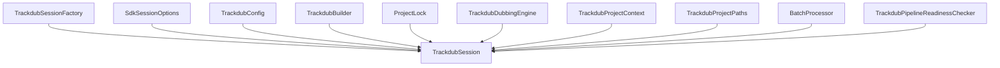
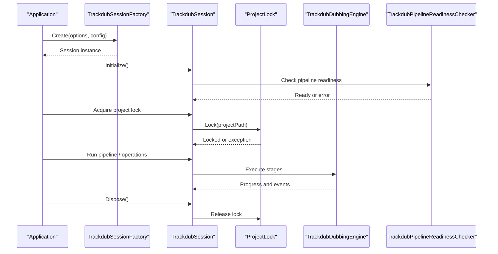
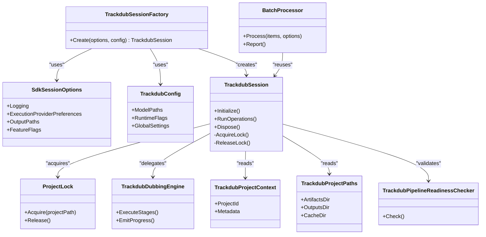
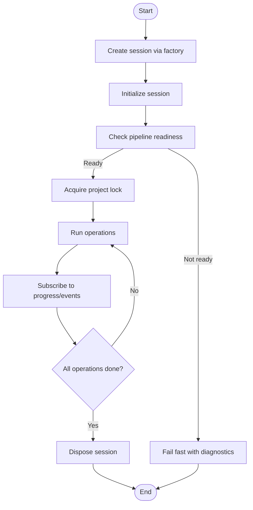

# Session Management & Lifecycle

<cite>
**Referenced Files in This Document**
- [TrackdubSession.cs](file://src/Trackdub.Sdk/TrackdubSession.cs)
- [TrackdubSessionFactory.cs](file://src/Trackdub.Sdk/TrackdubSessionFactory.cs)
- [ProjectLock.cs](file://src/Trackdub.Sdk/ProjectLock.cs)
- [ProjectLockedException.cs](file://src/Trackdub.Sdk/ProjectLockedException.cs)
- [SdkSessionOptions.cs](file://src/Trackdub.Sdk/SdkSessionOptions.cs)
- [TrackdubConfig.cs](file://src/Trackdub.Sdk/TrackdubConfig.cs)
- [TrackdubBuilder.cs](file://src/Trackdub.Sdk/TrackdubBuilder.cs)
- [TrackdubDubbingEngine.cs](file://src/Trackdub.Sdk/TrackdubDubbingEngine.cs)
- [TrackdubProjectContext.cs](file://src/Trackdub.Sdk/TrackdubProjectContext.cs)
- [TrackdubProjectPaths.cs](file://src/Trackdub.Sdk/TrackdubProjectPaths.cs)
- [BatchProcessor.cs](file://src/Trackdub.Sdk/BatchProcessor.cs)
- [BatchOptions.cs](file://src/Trackdub.Sdk/BatchOptions.cs)
- [RunManifestWriter.cs](file://src/Trackdub.Sdk/RunManifestWriter.cs)
- [TrackdubPipelineReadinessChecker.cs](file://src/Trackdub.Sdk/TrackdubPipelineReadinessChecker.cs)
</cite>

## Table of Contents
1. [Introduction](#introduction)
2. [Project Structure](#project-structure)
3. [Core Components](#core-components)
4. [Architecture Overview](#architecture-overview)
5. [Detailed Component Analysis](#detailed-component-analysis)
6. [Dependency Analysis](#dependency-analysis)
7. [Performance Considerations](#performance-considerations)
8. [Troubleshooting Guide](#troubleshooting-guide)
9. [Conclusion](#conclusion)
10. [Appendices](#appendices)

## Introduction
This document explains how to manage Trackdub SDK sessions and their lifecycle in production-grade applications. It covers session creation, configuration, disposal, project locking for concurrency control, state management, progress tracking, event subscription patterns, resource allocation and memory considerations, long-running sessions, background processing, graceful shutdown, isolation, multi-threading scenarios, and best practices.

## Project Structure
The SDK’s session management is centered around a small set of cohesive classes:
- Session factory and options for creating configured sessions
- The session itself for orchestration and lifecycle
- Project lock for preventing concurrent access
- Configuration and builder utilities
- Batch processor for long-running workloads
- Pipeline readiness checker for pre-flight validation

**Diagram sources**
- [TrackdubSessionFactory.cs](file://src/Trackdub.Sdk/TrackdubSessionFactory.cs)
- [TrackdubSession.cs](file://src/Trackdub.Sdk/TrackdubSession.cs)
- [SdkSessionOptions.cs](file://src/Trackdub.Sdk/SdkSessionOptions.cs)
- [TrackdubConfig.cs](file://src/Trackdub.Sdk/TrackdubConfig.cs)
- [TrackdubBuilder.cs](file://src/Trackdub.Sdk/TrackdubBuilder.cs)
- [ProjectLock.cs](file://src/Trackdub.Sdk/ProjectLock.cs)
- [TrackdubDubbingEngine.cs](file://src/Trackdub.Sdk/TrackdubDubbingEngine.cs)
- [TrackdubProjectContext.cs](file://src/Trackdub.Sdk/TrackdubProjectContext.cs)
- [TrackdubProjectPaths.cs](file://src/Trackdub.Sdk/TrackdubProjectPaths.cs)
- [BatchProcessor.cs](file://src/Trackdub.Sdk/BatchProcessor.cs)
- [TrackdubPipelineReadinessChecker.cs](file://src/Trackdub.Sdk/TrackdubPipelineReadinessChecker.cs)

**Section sources**
- [TrackdubSession.cs](file://src/Trackdub.Sdk/TrackdubSession.cs)
- [TrackdubSessionFactory.cs](file://src/Trackdub.Sdk/TrackdubSessionFactory.cs)
- [SdkSessionOptions.cs](file://src/Trackdub.Sdk/SdkSessionOptions.cs)
- [TrackdubConfig.cs](file://src/Trackdub.Sdk/TrackdubConfig.cs)
- [TrackdubBuilder.cs](file://src/Trackdub.Sdk/TrackdubBuilder.cs)
- [ProjectLock.cs](file://src/Trackdub.Sdk/ProjectLock.cs)
- [TrackdubDubbingEngine.cs](file://src/Trackdub.Sdk/TrackdubDubbingEngine.cs)
- [TrackdubProjectContext.cs](file://src/Trackdub.Sdk/TrackdubProjectContext.cs)
- [TrackdubProjectPaths.cs](file://src/Trackdub.Sdk/TrackdubProjectPaths.cs)
- [BatchProcessor.cs](file://src/Trackdub.Sdk/BatchProcessor.cs)
- [TrackdubPipelineReadinessChecker.cs](file://src/Trackdub.Sdk/TrackdubPipelineReadinessChecker.cs)

## Core Components
- TrackdubSession: Encapsulates the active workspace, pipeline execution, progress/events, and resource ownership. It should be created per logical workload and disposed when done.
- TrackdubSessionFactory: Creates sessions with provided options and configuration, centralizing initialization logic.
- SdkSessionOptions: Defines session-level settings such as logging, execution provider preferences, output paths, and feature toggles.
- TrackdubConfig: Global or process-wide configuration that can influence session behavior (e.g., model paths, runtime flags).
- ProjectLock: Ensures only one session operates on a given project at a time, preventing concurrent corruption.
- TrackdubDubbingEngine: Provides high-level dubbing operations exposed through the session.
- TrackdubProjectContext and TrackdubProjectPaths: Provide context and path resolution for the active project.
- BatchProcessor: Orchestrates long-running batch jobs using sessions, reporting progress and outcomes.
- TrackdubPipelineReadinessChecker: Validates environment readiness before starting heavy work.

**Section sources**
- [TrackdubSession.cs](file://src/Trackdub.Sdk/TrackdubSession.cs)
- [TrackdubSessionFactory.cs](file://src/Trackdub.Sdk/TrackdubSessionFactory.cs)
- [SdkSessionOptions.cs](file://src/Trackdub.Sdk/SdkSessionOptions.cs)
- [TrackdubConfig.cs](file://src/Trackdub.Sdk/TrackdubConfig.cs)
- [ProjectLock.cs](file://src/Trackdub.Sdk/ProjectLock.cs)
- [TrackdubDubbingEngine.cs](file://src/Trackdub.Sdk/TrackdubDubbingEngine.cs)
- [TrackdubProjectContext.cs](file://src/Trackdub.Sdk/TrackdubProjectContext.cs)
- [TrackdubProjectPaths.cs](file://src/Trackdub.Sdk/TrackdubProjectPaths.cs)
- [BatchProcessor.cs](file://src/Trackdub.Sdk/BatchProcessor.cs)
- [TrackdubPipelineReadinessChecker.cs](file://src/Trackdub.Sdk/TrackdubPipelineReadinessChecker.cs)

## Architecture Overview
The SDK follows a clear separation between session lifecycle, project isolation, and pipeline execution. Sessions are short-lived or long-lived objects that encapsulate resources and coordinate work. Project locks prevent overlapping operations on the same project. Batch processing builds on top of sessions for sustained workloads.

**Diagram sources**
- [TrackdubSessionFactory.cs](file://src/Trackdub.Sdk/TrackdubSessionFactory.cs)
- [TrackdubSession.cs](file://src/Trackdub.Sdk/TrackdubSession.cs)
- [ProjectLock.cs](file://src/Trackdub.Sdk/ProjectLock.cs)
- [TrackdubDubbingEngine.cs](file://src/Trackdub.Sdk/TrackdubDubbingEngine.cs)
- [TrackdubPipelineReadinessChecker.cs](file://src/Trackdub.Sdk/TrackdubPipelineReadinessChecker.cs)

## Detailed Component Analysis

### TrackdubSession
Responsibilities:
- Owns the active project context and paths
- Manages lifecycle: initialization, running operations, disposal
- Subscribes to pipeline events and exposes progress
- Coordinates with ProjectLock to ensure exclusive access
- Delegates heavy work to TrackdubDubbingEngine and other services

Lifecycle patterns:
- Creation via TrackdubSessionFactory with SdkSessionOptions
- Initialization validates environment and prepares resources
- Operations run under an acquired project lock
- Disposal releases locks and cleans up resources

Resource management:
- Holds references to engines and contexts; dispose must be called to free native and managed resources
- Avoid holding sessions longer than necessary to minimize memory pressure

Concurrency:
- Not thread-safe across operations; each operation should be invoked from a single thread or coordinated by the caller
- Use ProjectLock to serialize access to the same project

Progress and events:
- Exposes progress updates and stage events for UI or telemetry
- Consumers subscribe to events during the session lifetime

Best practices:
- Wrap usage in try/finally or use using constructs to guarantee disposal
- Validate readiness before starting long runs
- Keep sessions scoped to a single project

**Section sources**
- [TrackdubSession.cs](file://src/Trackdub.Sdk/TrackdubSession.cs)

### TrackdubSessionFactory
Responsibilities:
- Centralizes session construction with options and configuration
- Applies defaults and validates inputs
- Returns a fully initialized session ready for use

Usage pattern:
- Build options via SdkSessionOptions
- Optionally configure TrackdubConfig
- Call factory to create a session

**Section sources**
- [TrackdubSessionFactory.cs](file://src/Trackdub.Sdk/TrackdubSessionFactory.cs)
- [SdkSessionOptions.cs](file://src/Trackdub.Sdk/SdkSessionOptions.cs)
- [TrackdubConfig.cs](file://src/Trackdub.Sdk/TrackdubConfig.cs)

### ProjectLock
Responsibilities:
- Prevents concurrent access to a project directory
- Throws ProjectLockedException if another session holds the lock
- Ensures deterministic cleanup on disposal

Behavior:
- Lock acquisition blocks until available or fails based on policy
- Lock release occurs automatically on disposal or explicit unlock

Use cases:
- Enforce single-writer semantics for projects
- Coordinate multiple processes or threads operating on the same project

**Section sources**
- [ProjectLock.cs](file://src/Trackdub.Sdk/ProjectLock.cs)
- [ProjectLockedException.cs](file://src/Trackdub.Sdk/ProjectLockedException.cs)

### TrackdubDubbingEngine
Responsibilities:
- High-level API for dubbing operations
- Invokes pipeline stages and returns results
- Emits progress and events consumed by the session

Integration:
- Called by TrackdubSession during pipeline execution
- Works with project context and paths to locate assets and outputs

**Section sources**
- [TrackdubDubbingEngine.cs](file://src/Trackdub.Sdk/TrackdubDubbingEngine.cs)

### TrackdubProjectContext and TrackdubProjectPaths
Responsibilities:
- Provide resolved paths for project artifacts, outputs, and caches
- Maintain contextual information about the active project

Usage:
- Accessed by session and engine to read/write files consistently
- Ensure consistent layout across runs

**Section sources**
- [TrackdubProjectContext.cs](file://src/Trackdub.Sdk/TrackdubProjectContext.cs)
- [TrackdubProjectPaths.cs](file://src/Trackdub.Sdk/TrackdubProjectPaths.cs)

### BatchProcessor
Responsibilities:
- Orchestrates long-running batch jobs using sessions
- Reports per-file status and aggregate outcomes
- Manages progress and errors across many items

Patterns:
- Create a session once and reuse it for multiple items where safe
- Apply backpressure and cancellation support for long runs
- Write manifests for reproducibility and auditability

**Section sources**
- [BatchProcessor.cs](file://src/Trackdub.Sdk/BatchProcessor.cs)
- [BatchOptions.cs](file://src/Trackdub.Sdk/BatchOptions.cs)
- [RunManifestWriter.cs](file://src/Trackdub.Sdk/RunManifestWriter.cs)

### TrackdubPipelineReadinessChecker
Responsibilities:
- Validates environment prerequisites before starting pipelines
- Detects missing models, incompatible providers, or insufficient resources

Usage:
- Call early in session initialization to fail fast
- Use results to guide user feedback or automatic remediation

**Section sources**
- [TrackdubPipelineReadinessChecker.cs](file://src/Trackdub.Sdk/TrackdubPipelineReadinessChecker.cs)

### TrackdubBuilder
Responsibilities:
- Fluent configuration helper for building TrackdubConfig and related settings
- Simplifies setup for common scenarios

Usage:
- Chain configuration calls to produce a finalized config used by the factory

**Section sources**
- [TrackdubBuilder.cs](file://src/Trackdub.Sdk/TrackdubBuilder.cs)

## Dependency Analysis
Key relationships:
- TrackdubSessionFactory depends on SdkSessionOptions and TrackdubConfig to construct TrackdubSession
- TrackdubSession depends on ProjectLock, TrackdubDubbingEngine, TrackdubProjectContext, and TrackdubProjectPaths
- BatchProcessor composes TrackdubSession for batch workflows
- TrackdubPipelineReadinessChecker is consulted during session initialization

**Diagram sources**
- [TrackdubSessionFactory.cs](file://src/Trackdub.Sdk/TrackdubSessionFactory.cs)
- [SdkSessionOptions.cs](file://src/Trackdub.Sdk/SdkSessionOptions.cs)
- [TrackdubConfig.cs](file://src/Trackdub.Sdk/TrackdubConfig.cs)
- [TrackdubSession.cs](file://src/Trackdub.Sdk/TrackdubSession.cs)
- [ProjectLock.cs](file://src/Trackdub.Sdk/ProjectLock.cs)
- [TrackdubDubbingEngine.cs](file://src/Trackdub.Sdk/TrackdubDubbingEngine.cs)
- [TrackdubProjectContext.cs](file://src/Trackdub.Sdk/TrackdubProjectContext.cs)
- [TrackdubProjectPaths.cs](file://src/Trackdub.Sdk/TrackdubProjectPaths.cs)
- [BatchProcessor.cs](file://src/Trackdub.Sdk/BatchProcessor.cs)
- [TrackdubPipelineReadinessChecker.cs](file://src/Trackdub.Sdk/TrackdubPipelineReadinessChecker.cs)

**Section sources**
- [TrackdubSessionFactory.cs](file://src/Trackdub.Sdk/TrackdubSessionFactory.cs)
- [TrackdubSession.cs](file://src/Trackdub.Sdk/TrackdubSession.cs)
- [ProjectLock.cs](file://src/Trackdub.Sdk/ProjectLock.cs)
- [TrackdubDubbingEngine.cs](file://src/Trackdub.Sdk/TrackdubDubbingEngine.cs)
- [TrackdubProjectContext.cs](file://src/Trackdub.Sdk/TrackdubProjectContext.cs)
- [TrackdubProjectPaths.cs](file://src/Trackdub.Sdk/TrackdubProjectPaths.cs)
- [BatchProcessor.cs](file://src/Trackdub.Sdk/BatchProcessor.cs)
- [TrackdubPipelineReadinessChecker.cs](file://src/Trackdub.Sdk/TrackdubPipelineReadinessChecker.cs)

## Performance Considerations
- Reuse sessions for multiple operations on the same project to avoid repeated initialization costs
- Pre-check pipeline readiness to fail fast and reduce wasted work
- Limit concurrent sessions per project to one due to ProjectLock semantics
- Monitor memory usage during long runs; dispose sessions promptly after completion
- Prefer batch processing for large datasets to amortize startup overhead
- Tune execution provider preferences based on hardware capabilities

[No sources needed since this section provides general guidance]

## Troubleshooting Guide
Common issues and resolutions:
- ProjectLockedException: Indicates another session or process holds the lock. Wait, retry with backoff, or ensure proper disposal of previous sessions.
- Pipeline readiness failures: Missing models or incompatible providers. Install required components or adjust configuration.
- Memory pressure during long runs: Reduce parallelism, enable streaming where possible, and ensure timely disposal.
- Stalled progress: Inspect event subscriptions and logs; verify that progress callbacks are not blocking.

Operational tips:
- Always wrap session usage in try/finally or using constructs
- Log readiness check results and lock acquisition attempts
- Implement graceful shutdown by canceling ongoing operations and disposing sessions

**Section sources**
- [ProjectLock.cs](file://src/Trackdub.Sdk/ProjectLock.cs)
- [ProjectLockedException.cs](file://src/Trackdub.Sdk/ProjectLockedException.cs)
- [TrackdubPipelineReadinessChecker.cs](file://src/Trackdub.Sdk/TrackdubPipelineReadinessChecker.cs)

## Conclusion
Trackdub SDK session management centers on disciplined lifecycle handling, strict project isolation via locks, and robust progress/event reporting. By following the recommended patterns—creating sessions through the factory, validating readiness, acquiring locks, delegating work to the engine, and disposing promptly—you can build reliable, scalable, and maintainable applications. For long-running workloads, leverage BatchProcessor and manifest writing to ensure reproducibility and observability.

[No sources needed since this section summarizes without analyzing specific files]

## Appendices

### Session Lifecycle Flow

**Diagram sources**
- [TrackdubSessionFactory.cs](file://src/Trackdub.Sdk/TrackdubSessionFactory.cs)
- [TrackdubSession.cs](file://src/Trackdub.Sdk/TrackdubSession.cs)
- [TrackdubPipelineReadinessChecker.cs](file://src/Trackdub.Sdk/TrackdubPipelineReadinessChecker.cs)
- [ProjectLock.cs](file://src/Trackdub.Sdk/ProjectLock.cs)

### Best Practices Checklist
- Use TrackdubSessionFactory to create sessions with explicit SdkSessionOptions
- Validate pipeline readiness before starting heavy work
- Acquire and release ProjectLock around project-scoped operations
- Subscribe to progress and events for telemetry and UI updates
- Dispose sessions immediately after use to free resources
- For long-running tasks, use BatchProcessor and write manifests
- Avoid sharing sessions across threads unless explicitly supported by the API

[No sources needed since this section provides general guidance]