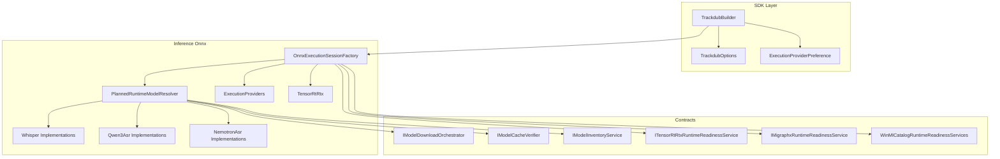
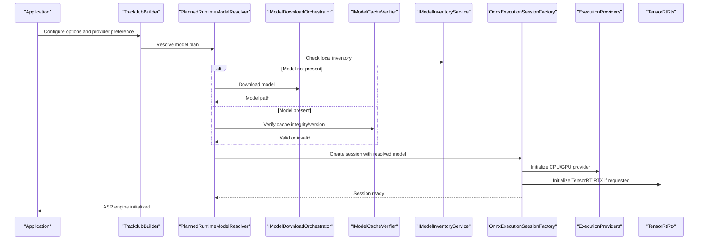
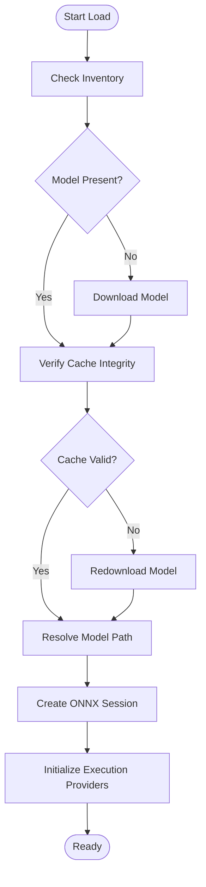
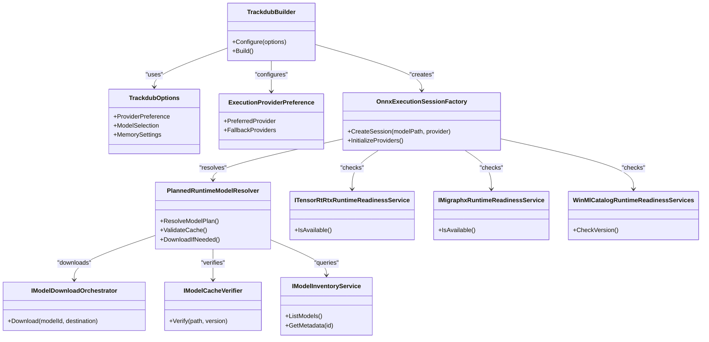

# ASR Models & Configuration

<cite>
**Referenced Files in This Document**
- [Trackdub.Inference.Onnx.csproj](file://src/Trackdub.Inference.Onnx/Trackdub.Inference.Onnx.csproj)
- [OnnxExecutionSessionFactory.cs](file://src/Trackdub.Inference.Onnx/OnnxExecutionSessionFactory.cs)
- [PlannedRuntimeModelResolver.cs](file://src/Trackdub.Inference.Onnx/PlannedRuntimeModelResolver.cs)
- [Whisper/](file://src/Trackdub.Inference.Onnx/Whisper/)
- [Qwen3Asr/](file://src/Trackdub.Inference.Onnx/Qwen3Asr/)
- [ExecutionProviders/](file://src/Trackdub.Inference.Onnx/ExecutionProviders/)
- [TensorRtRtx/](file://src/Trackdub.Inference.Onnx/TensorRtRtx/)
- [NemotronAsr/](file://src/Trackdub.Inference.Onnx/NemotronAsr/)
- [IModelDownloadOrchestrator.cs](file://src/Trackdub.Contracts/IModelDownloadOrchestrator.cs)
- [IModelCacheVerifier.cs](file://src/Trackdub.Contracts/IModelCacheVerifier.cs)
- [IModelInventoryService.cs](file://src/Trackdub.Contracts/IModelInventoryService.cs)
- [ITensorRtRtxRuntimeReadinessService.cs](file://src/Trackdub.Contracts/ITensorRtRtxRuntimeReadinessService.cs)
- [IMigraphxRuntimeReadinessService.cs](file://src/Trackdub.Contracts/IMigraphxRuntimeReadinessService.cs)
- [WinMlCatalogRuntimeReadinessServices.cs](file://src/Trackdub.Contracts/WinMlCatalogRuntimeReadinessServices.cs)
- [TrackdubBuilder.cs](file://src/Trackdub.Sdk/TrackdubBuilder.cs)
- [TrackdubOptions.cs](file://src/Trackdub.Sdk/TrackdubOptions.cs)
- [ExecutionProviderPreference.cs](file://src/Trackdub.Sdk/ExecutionProviderPreference.cs)
- [BenchmarkSelectionDefaultsStore.cs](file://src/Trackdub.Benchmarks/BenchmarkSelectionDefaultsStore.cs)
- [README.md](file://assets/demo-media/README.md)
</cite>

## Table of Contents
1. [Introduction](#introduction)
2. [Project Structure](#project-structure)
3. [Core Components](#core-components)
4. [Architecture Overview](#architecture-overview)
5. [Detailed Component Analysis](#detailed-component-analysis)
6. [Dependency Analysis](#dependency-analysis)
7. [Performance Considerations](#performance-considerations)
8. [Troubleshooting Guide](#troubleshooting-guide)
9. [Conclusion](#conclusion)
10. [Appendices](#appendices)

## Introduction
This document explains how Trackdub selects and configures Automatic Speech Recognition (ASR) models, focusing on the Whisper family (base, small, medium, large) and Qwen3 ASR variants. It covers performance characteristics, accuracy trade-offs, hardware requirements, initialization parameters, execution provider selection (CPU, GPU, TensorRT), memory optimization, model loading pipeline, caching mechanisms, version compatibility checks, configuration examples for real-time transcription, batch processing, and high-accuracy scenarios, as well as model download workflows, local model management, custom model integration, and troubleshooting guidance.

## Project Structure
Trackdub’s ASR capabilities are implemented primarily under the ONNX inference layer with dedicated folders per model family and execution providers:
- Model families:
  - Whisper implementations reside under src/Trackdub.Inference.Onnx/Whisper
  - Qwen3 ASR implementations reside under src/Trackdub.Inference.Onnx/Qwen3Asr
  - Additional ASR engines such as Nemotron reside under src/Trackdub.Inference.Onnx/NemotronAsr
- Execution providers and runtime integrations:
  - CPU/GPU providers and TensorRT RTX integration live under src/Trackdub.Inference.Onnx/ExecutionProviders and src/Trackdub.Inference.Onnx/TensorRtRtx
- SDK configuration and builder:
  - High-level configuration and session creation are exposed via src/Trackdub.Sdk/TrackdubBuilder.cs and related options
- Contracts for model orchestration and readiness:
  - Download, cache verification, inventory, and runtime readiness services are defined in src/Trackdub.Contracts

**Diagram sources**
- [TrackdubBuilder.cs](file://src/Trackdub.Sdk/TrackdubBuilder.cs)
- [TrackdubOptions.cs](file://src/Trackdub.Sdk/TrackdubOptions.cs)
- [ExecutionProviderPreference.cs](file://src/Trackdub.Sdk/ExecutionProviderPreference.cs)
- [OnnxExecutionSessionFactory.cs](file://src/Trackdub.Inference.Onnx/OnnxExecutionSessionFactory.cs)
- [PlannedRuntimeModelResolver.cs](file://src/Trackdub.Inference.Onnx/PlannedRuntimeModelResolver.cs)
- [IModelDownloadOrchestrator.cs](file://src/Trackdub.Contracts/IModelDownloadOrchestrator.cs)
- [IModelCacheVerifier.cs](file://src/Trackdub.Contracts/IModelCacheVerifier.cs)
- [IModelInventoryService.cs](file://src/Trackdub.Contracts/IModelInventoryService.cs)
- [ITensorRtRtxRuntimeReadinessService.cs](file://src/Trackdub.Contracts/ITensorRtRtxRuntimeReadinessService.cs)
- [IMigraphxRuntimeReadinessService.cs](file://src/Trackdub.Contracts/IMigraphxRuntimeReadinessService.cs)
- [WinMlCatalogRuntimeReadinessServices.cs](file://src/Trackdub.Contracts/WinMlCatalogRuntimeReadinessServices.cs)

**Section sources**
- [Trackdub.Inference.Onnx.csproj](file://src/Trackdub.Inference.Onnx/Trackdub.Inference.Onnx.csproj)
- [README.md](file://assets/demo-media/README.md)

## Core Components
- OnnxExecutionSessionFactory: Creates ONNX runtime sessions with selected execution providers and model paths.
- PlannedRuntimeModelResolver: Resolves which model variant to load based on runtime capabilities, preferences, and availability; coordinates downloads and cache validation.
- Execution Providers: CPU, CUDA/GPU, and TensorRT RTX providers are configured through the execution provider layer.
- Model Families:
  - Whisper: base/small/medium/large variants with different accuracy and speed profiles.
  - Qwen3 ASR: multiple parameter sizes optimized for speech recognition tasks.
- Contracts:
  - IModelDownloadOrchestrator: orchestrates downloading models from remote repositories.
  - IModelCacheVerifier: validates cached model integrity and versions.
  - IModelInventoryService: manages local model metadata and catalog.
  - Runtime readiness services: ensure required runtimes (TensorRT RTX, MIGraphX, Windows ML Catalog) are available.

Key responsibilities:
- Selection: Choose appropriate model variant based on hardware, latency targets, and quality goals.
- Initialization: Configure ONNX runtime, execution providers, memory settings, and model-specific options.
- Loading: Resolve model path, validate cache, download if missing, and load into runtime.
- Execution: Run inference with chosen provider and handle errors gracefully.

**Section sources**
- [OnnxExecutionSessionFactory.cs](file://src/Trackdub.Inference.Onnx/OnnxExecutionSessionFactory.cs)
- [PlannedRuntimeModelResolver.cs](file://src/Trackdub.Inference.Onnx/PlannedRuntimeModelResolver.cs)
- [IModelDownloadOrchestrator.cs](file://src/Trackdub.Contracts/IModelDownloadOrchestrator.cs)
- [IModelCacheVerifier.cs](file://src/Trackdub.Contracts/IModelCacheVerifier.cs)
- [IModelInventoryService.cs](file://src/Trackdub.Contracts/IModelInventoryService.cs)
- [ITensorRtRtxRuntimeReadinessService.cs](file://src/Trackdub.Contracts/ITensorRtRtxRuntimeReadinessService.cs)
- [IMigraphxRuntimeReadinessService.cs](file://src/Trackdub.Contracts/IMigraphxRuntimeReadinessService.cs)
- [WinMlCatalogRuntimeReadinessServices.cs](file://src/Trackdub.Contracts/WinMlCatalogRuntimeReadinessServices.cs)

## Architecture Overview
The ASR model selection and configuration flow integrates SDK configuration, runtime readiness checks, model resolution, and ONNX session creation. The following sequence diagram maps a typical request to select and initialize an ASR model:

**Diagram sources**
- [TrackdubBuilder.cs](file://src/Trackdub.Sdk/TrackdubBuilder.cs)
- [PlannedRuntimeModelResolver.cs](file://src/Trackdub.Inference.Onnx/PlannedRuntimeModelResolver.cs)
- [IModelDownloadOrchestrator.cs](file://src/Trackdub.Contracts/IModelDownloadOrchestrator.cs)
- [IModelCacheVerifier.cs](file://src/Trackdub.Contracts/IModelCacheVerifier.cs)
- [IModelInventoryService.cs](file://src/Trackdub.Contracts/IModelInventoryService.cs)
- [OnnxExecutionSessionFactory.cs](file://src/Trackdub.Inference.Onnx/OnnxExecutionSessionFactory.cs)
- [ExecutionProviders/](file://src/Trackdub.Inference.Onnx/ExecutionProviders/)
- [TensorRtRtx/](file://src/Trackdub.Inference.Onnx/TensorRtRtx/)

## Detailed Component Analysis

### Whisper Family Models (base, small, medium, large)
- Performance characteristics:
  - Base: Fastest, lowest memory footprint, suitable for real-time transcription on constrained devices.
  - Small: Balanced speed and accuracy; good default for many use cases.
  - Medium: Higher accuracy with increased compute and memory needs; ideal for batch processing where latency is less critical.
  - Large: Highest accuracy among Whisper variants; requires significant GPU memory and compute; best for offline high-quality transcription.
- Accuracy trade-offs:
  - Larger models capture more linguistic context and speaker nuances but increase latency and resource usage.
- Hardware requirements:
  - CPU-only runs feasible for base/small; medium/large benefit significantly from GPU acceleration.
  - TensorRT RTX can further optimize throughput for supported GPUs.

Implementation notes:
- Whisper implementations are located under src/Trackdub.Inference.Onnx/Whisper.
- Model selection typically considers target latency, available VRAM, and desired WER (word error rate).

Configuration tips:
- For real-time transcription: prefer base/small with CPU or lightweight GPU provider.
- For batch processing: medium/large with GPU or TensorRT RTX for throughput.
- For high-accuracy scenarios: large model with TensorRT RTX and sufficient VRAM.

**Section sources**
- [Whisper/](file://src/Trackdub.Inference.Onnx/Whisper/)

### Qwen3 ASR Variants
- Parameter sizes and profiles:
  - Multiple sizes exist (e.g., 0.6B, 1.7B, 4B, 8B, 14B) with increasing accuracy and resource demands.
- Performance characteristics:
  - Smaller variants (0.6B–1.7B) offer low-latency transcription suitable for edge devices.
  - Mid-size (4B) balances accuracy and efficiency for general-purpose ASR.
  - Larger variants (8B–14B) deliver higher accuracy at the cost of memory and compute.
- Hardware requirements:
  - CPU-only viable for smallest variants; GPU strongly recommended for mid-to-large sizes.
  - TensorRT RTX provides optimal performance on compatible NVIDIA GPUs.

Implementation notes:
- Qwen3 ASR implementations are located under src/Trackdub.Inference.Onnx/Qwen3Asr.
- Model resolution considers runtime capabilities and user preferences to pick the most suitable variant.

Configuration tips:
- Real-time: 0.6B–1.7B with CPU or minimal GPU.
- Batch: 4B with GPU or TensorRT RTX.
- High-accuracy: 8B–14B with TensorRT RTX and ample VRAM.

**Section sources**
- [Qwen3Asr/](file://src/Trackdub.Inference.Onnx/Qwen3Asr/)

### Execution Provider Selection (CPU, GPU, TensorRT)
- CPU:
  - Universal support; lower throughput; suitable for development and constrained environments.
- GPU (CUDA):
  - Significant speedup over CPU; requires compatible NVIDIA drivers and libraries.
- TensorRT RTX:
  - Optimized inference engine for NVIDIA GPUs; best performance when available.
  - Requires runtime readiness check before use.

Provider configuration:
- Use ExecutionProviderPreference to specify preferred provider order.
- OnnxExecutionSessionFactory initializes providers based on availability and preference.

**Section sources**
- [ExecutionProviderPreference.cs](file://src/Trackdub.Sdk/ExecutionProviderPreference.cs)
- [OnnxExecutionSessionFactory.cs](file://src/Trackdub.Inference.Onnx/OnnxExecutionSessionFactory.cs)
- [ExecutionProviders/](file://src/Trackdub.Inference.Onnx/ExecutionProviders/)
- [TensorRtRtx/](file://src/Trackdub.Inference.Onnx/TensorRtRtx/)
- [ITensorRtRtxRuntimeReadinessService.cs](file://src/Trackdub.Contracts/ITensorRtRtxRuntimeReadinessService.cs)

### Memory Optimization Settings
- Model quantization and precision:
  - FP16 or INT8 variants reduce memory footprint and improve throughput on supported hardware.
- Session memory limits:
  - Configure ONNX runtime memory pools to avoid excessive allocation.
- Batch sizing:
  - Adjust batch size to fit within available VRAM while maintaining throughput.
- Provider-specific optimizations:
  - TensorRT RTX benefits from graph optimization and kernel fusion.

Recommendations:
- Start with FP16 on GPU; fall back to FP32 if stability issues occur.
- Limit concurrent sessions to prevent memory pressure.
- Monitor memory usage and adjust batch sizes accordingly.

**Section sources**
- [OnnxExecutionSessionFactory.cs](file://src/Trackdub.Inference.Onnx/OnnxExecutionSessionFactory.cs)
- [TensorRtRtx/](file://src/Trackdub.Inference.Onnx/TensorRtRtx/)

### Model Loading Pipeline, Caching, and Version Compatibility
- Loading pipeline:
  - PlannedRuntimeModelResolver determines the target model variant and path.
  - If missing, IModelDownloadOrchestrator downloads the model.
  - IModelCacheVerifier validates cache integrity and version compatibility.
  - OnnxExecutionSessionFactory creates the runtime session with selected provider.
- Caching mechanisms:
  - Local cache stores model artifacts and metadata; verifier ensures consistency.
  - Inventory service tracks available models and their versions.
- Version compatibility:
  - Runtime readiness services verify that required components (TensorRT RTX, MIGraphX, Windows ML Catalog) match expected versions.

**Diagram sources**
- [PlannedRuntimeModelResolver.cs](file://src/Trackdub.Inference.Onnx/PlannedRuntimeModelResolver.cs)
- [IModelDownloadOrchestrator.cs](file://src/Trackdub.Contracts/IModelDownloadOrchestrator.cs)
- [IModelCacheVerifier.cs](file://src/Trackdub.Contracts/IModelCacheVerifier.cs)
- [IModelInventoryService.cs](file://src/Trackdub.Contracts/IModelInventoryService.cs)
- [OnnxExecutionSessionFactory.cs](file://src/Trackdub.Inference.Onnx/OnnxExecutionSessionFactory.cs)

**Section sources**
- [PlannedRuntimeModelResolver.cs](file://src/Trackdub.Inference.Onnx/PlannedRuntimeModelResolver.cs)
- [IModelDownloadOrchestrator.cs](file://src/Trackdub.Contracts/IModelDownloadOrchestrator.cs)
- [IModelCacheVerifier.cs](file://src/Trackdub.Contracts/IModelCacheVerifier.cs)
- [IModelInventoryService.cs](file://src/Trackdub.Contracts/IModelInventoryService.cs)
- [OnnxExecutionSessionFactory.cs](file://src/Trackdub.Inference.Onnx/OnnxExecutionSessionFactory.cs)

### Configuration Examples by Use Case
- Real-time transcription:
  - Prefer Whisper base/small or Qwen3 0.6B–1.7B.
  - Use CPU or lightweight GPU provider; enable streaming-friendly settings.
  - Keep batch size small; prioritize low latency.
- Batch processing:
  - Use Whisper medium/large or Qwen3 4B–8B.
  - Enable GPU or TensorRT RTX; maximize throughput with larger batches.
  - Optimize memory pools and disable unnecessary logging.
- High-accuracy scenarios:
  - Use Whisper large or Qwen3 8B–14B.
  - Require TensorRT RTX and sufficient VRAM; enable FP16/INT8 if supported.
  - Increase session memory limits cautiously; monitor stability.

SDK configuration entry points:
- TrackdubBuilder and TrackdubOptions allow specifying provider preferences and model selections.
- BenchmarkSelectionDefaultsStore provides baseline configurations for common scenarios.

**Section sources**
- [TrackdubBuilder.cs](file://src/Trackdub.Sdk/TrackdubBuilder.cs)
- [TrackdubOptions.cs](file://src/Trackdub.Sdk/TrackdubOptions.cs)
- [BenchmarkSelectionDefaultsStore.cs](file://src/Trackdub.Benchmarks/BenchmarkSelectionDefaultsStore.cs)

### Model Download Workflows and Local Model Management
- Download workflow:
  - IModelDownloadOrchestrator fetches models from configured repositories.
  - Supports resume and integrity checks during download.
- Local model management:
  - IModelInventoryService maintains metadata, versions, and locations.
  - IModelCacheVerifier ensures cache consistency and prevents corrupted loads.
- Custom model integration:
  - Place custom ONNX models in the managed directory; update inventory metadata.
  - Ensure model inputs/outputs align with expected interfaces.

Best practices:
- Pin model versions for reproducibility.
- Validate checksums post-download.
- Maintain separate directories for dev vs production models.

**Section sources**
- [IModelDownloadOrchestrator.cs](file://src/Trackdub.Contracts/IModelDownloadOrchestrator.cs)
- [IModelInventoryService.cs](file://src/Trackdub.Contracts/IModelInventoryService.cs)
- [IModelCacheVerifier.cs](file://src/Trackdub.Contracts/IModelCacheVerifier.cs)

## Dependency Analysis
The ASR subsystem depends on several contracts and runtime services to function reliably:

**Diagram sources**
- [TrackdubBuilder.cs](file://src/Trackdub.Sdk/TrackdubBuilder.cs)
- [TrackdubOptions.cs](file://src/Trackdub.Sdk/TrackdubOptions.cs)
- [ExecutionProviderPreference.cs](file://src/Trackdub.Sdk/ExecutionProviderPreference.cs)
- [OnnxExecutionSessionFactory.cs](file://src/Trackdub.Inference.Onnx/OnnxExecutionSessionFactory.cs)
- [PlannedRuntimeModelResolver.cs](file://src/Trackdub.Inference.Onnx/PlannedRuntimeModelResolver.cs)
- [IModelDownloadOrchestrator.cs](file://src/Trackdub.Contracts/IModelDownloadOrchestrator.cs)
- [IModelCacheVerifier.cs](file://src/Trackdub.Contracts/IModelCacheVerifier.cs)
- [IModelInventoryService.cs](file://src/Trackdub.Contracts/IModelInventoryService.cs)
- [ITensorRtRtxRuntimeReadinessService.cs](file://src/Trackdub.Contracts/ITensorRtRtxRuntimeReadinessService.cs)
- [IMigraphxRuntimeReadinessService.cs](file://src/Trackdub.Contracts/IMigraphxRuntimeReadinessService.cs)
- [WinMlCatalogRuntimeReadinessServices.cs](file://src/Trackdub.Contracts/WinMlCatalogRuntimeReadinessServices.cs)

**Section sources**
- [TrackdubBuilder.cs](file://src/Trackdub.Sdk/TrackdubBuilder.cs)
- [TrackdubOptions.cs](file://src/Trackdub.Sdk/TrackdubOptions.cs)
- [ExecutionProviderPreference.cs](file://src/Trackdub.Sdk/ExecutionProviderPreference.cs)
- [OnnxExecutionSessionFactory.cs](file://src/Trackdub.Inference.Onnx/OnnxExecutionSessionFactory.cs)
- [PlannedRuntimeModelResolver.cs](file://src/Trackdub.Inference.Onnx/PlannedRuntimeModelResolver.cs)
- [IModelDownloadOrchestrator.cs](file://src/Trackdub.Contracts/IModelDownloadOrchestrator.cs)
- [IModelCacheVerifier.cs](file://src/Trackdub.Contracts/IModelCacheVerifier.cs)
- [IModelInventoryService.cs](file://src/Trackdub.Contracts/IModelInventoryService.cs)
- [ITensorRtRtxRuntimeReadinessService.cs](file://src/Trackdub.Contracts/ITensorRtRtxRuntimeReadinessService.cs)
- [IMigraphxRuntimeReadinessService.cs](file://src/Trackdub.Contracts/IMigraphxRuntimeReadinessService.cs)
- [WinMlCatalogRuntimeReadinessServices.cs](file://src/Trackdub.Contracts/WinMlCatalogRuntimeReadinessServices.cs)

## Performance Considerations
- Model choice impacts latency and accuracy:
  - Smaller models (Whisper base/small, Qwen3 0.6B–1.7B) favor speed.
  - Larger models (Whisper large, Qwen3 8B–14B) favor accuracy.
- Execution provider selection:
  - TensorRT RTX offers best performance on supported GPUs.
  - CUDA provides strong acceleration; CPU is fallback.
- Memory management:
  - Tune session memory pools and batch sizes to avoid OOM.
  - Use FP16/INT8 where supported to reduce memory and improve throughput.
- Concurrency:
  - Limit concurrent sessions to balance throughput and stability.
- Profiling:
  - Use benchmarking tools to measure latency and throughput across configurations.

[No sources needed since this section provides general guidance]

## Troubleshooting Guide
Common issues and resolutions:
- Model loading failures:
  - Verify cache integrity using IModelCacheVerifier; redownload if corrupted.
  - Check model version compatibility against runtime expectations.
- Memory issues:
  - Reduce batch size or switch to smaller model variants.
  - Lower precision (FP16/INT8) and disable unnecessary features.
  - Monitor GPU memory usage and adjust provider settings.
- Performance bottlenecks:
  - Ensure TensorRT RTX is available and enabled; otherwise fall back to CUDA.
  - Profile model graphs and consider quantization or pruning.
  - Avoid excessive concurrency; tune session pooling.
- Runtime readiness:
  - Confirm TensorRT RTX, MIGraphX, and Windows ML Catalog versions meet requirements.
  - Update drivers and runtime libraries if necessary.

Diagnostic steps:
- Inspect logs from OnnxExecutionSessionFactory and PlannedRuntimeModelResolver.
- Use IModelInventoryService to list installed models and versions.
- Validate network connectivity and repository access for downloads.

**Section sources**
- [OnnxExecutionSessionFactory.cs](file://src/Trackdub.Inference.Onnx/OnnxExecutionSessionFactory.cs)
- [PlannedRuntimeModelResolver.cs](file://src/Trackdub.Inference.Onnx/PlannedRuntimeModelResolver.cs)
- [IModelCacheVerifier.cs](file://src/Trackdub.Contracts/IModelCacheVerifier.cs)
- [IModelInventoryService.cs](file://src/Trackdub.Contracts/IModelInventoryService.cs)
- [ITensorRtRtxRuntimeReadinessService.cs](file://src/Trackdub.Contracts/ITensorRtRtxRuntimeReadinessService.cs)
- [IMigraphxRuntimeReadinessService.cs](file://src/Trackdub.Contracts/IMigraphxRuntimeReadinessService.cs)
- [WinMlCatalogRuntimeReadinessServices.cs](file://src/Trackdub.Contracts/WinMlCatalogRuntimeReadinessServices.cs)

## Conclusion
Trackdub’s ASR model selection and configuration provide flexible options across Whisper and Qwen3 families, enabling tailored performance for real-time, batch, and high-accuracy scenarios. By leveraging execution providers like CPU, GPU, and TensorRT RTX, along with robust model loading, caching, and readiness checks, users can achieve reliable and efficient transcription. Proper configuration and troubleshooting ensure optimal performance and stability across diverse hardware environments.

[No sources needed since this section summarizes without analyzing specific files]

## Appendices
- Additional resources:
  - Demo media documentation for usage examples and sample workflows.
  - Benchmarking defaults for quick start configurations.

**Section sources**
- [README.md](file://assets/demo-media/README.md)
- [BenchmarkSelectionDefaultsStore.cs](file://src/Trackdub.Benchmarks/BenchmarkSelectionDefaultsStore.cs)