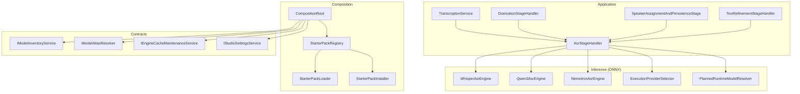
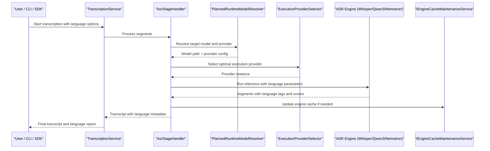
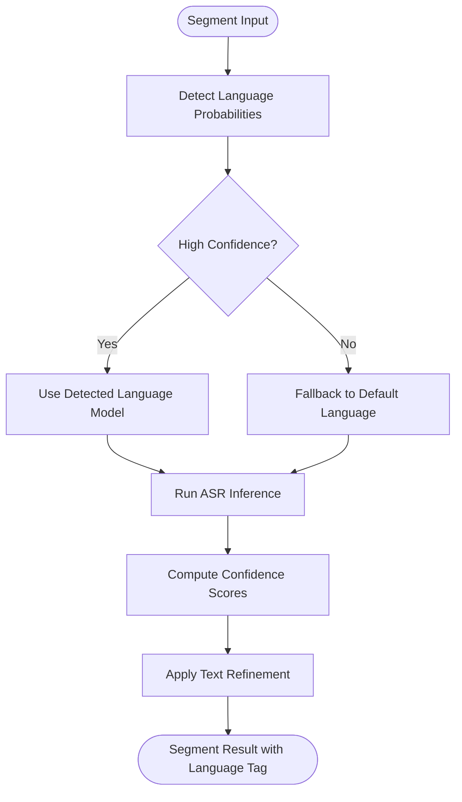
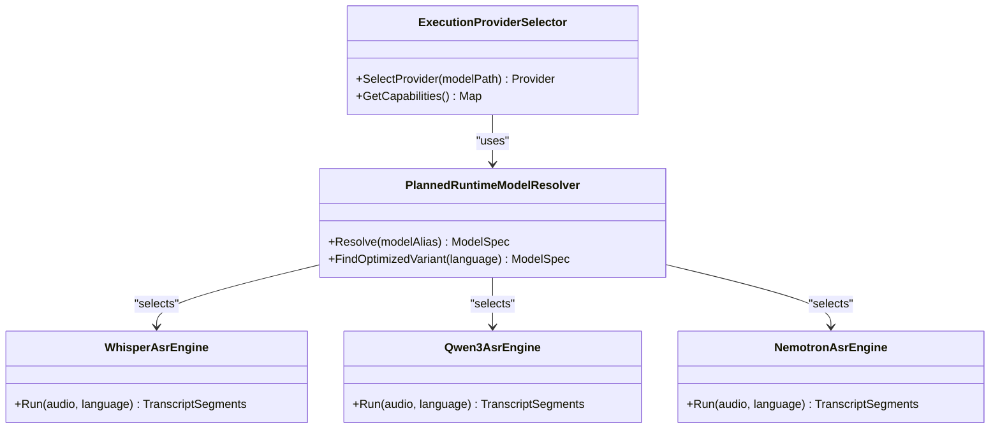
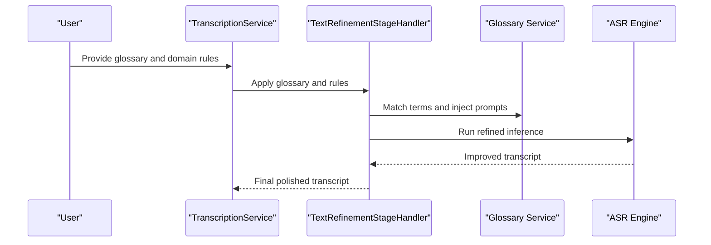
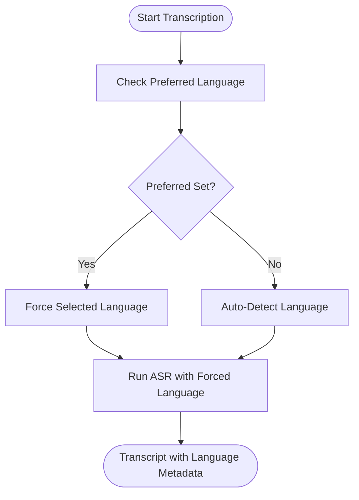
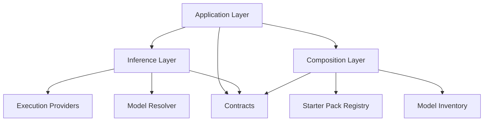

# Multi-Language Support

<cite>
**Referenced Files in This Document**
- [README.md](file://README.md)
- [adding-a-new-language.md](file://docs/development/adding-a-new-language.md)
- [ARCHITECTURE.md](file://docs/architecture/ARCHITECTURE.md)
- [pipeline-principles-review-grok-2026-07-08.md](file://docs/architecture/pipeline-principles-review-grok-2026-07-08.md)
- [local-pipeline-audit-unified-2026-07-08.md](file://docs/architecture/local-pipeline-audit-unified-2026-07-08.md)
- [ADR-0003-whisper-license-investigation.md](file://docs/decisions/ADR-0003-whisper-license-investigation.md)
- [ADR-0010-event-sourced-pipeline.md](file://docs/decisions/ADR-0010-event-sourced-pipeline.md)
- [ADR-0015-pipeline-transient-telemetry.md](file://docs/decisions/ADR-0015-pipeline-transient-telemetry.md)
- [Trackdub.Application.csproj](file://src/Trackdub.Application/Trackdub.Application.csproj)
- [Trackdub.Inference.Onnx.csproj](file://src/Trackdub.Inference.Onnx/Trackdub.Inference.Onnx.csproj)
- [Trackdub.Infrastructure.csproj](file://src/Trackdub.Infrastructure/Trackdub.Infrastructure.csproj)
- [Program.cs](file://src/Trackdub.Cli/Program.cs)
- [CliModelOverrides.cs](file://src/Trackdub.Cli/CliModelOverrides.cs)
- [TrackdubBuilder.cs](file://src/Trackdub.Sdk/TrackdubBuilder.cs)
- [TrackdubOptions.cs](file://src/Trackdub.Sdk/TrackdubOptions.cs)
- [TrackdubProjectContextResolver.cs](file://src/Trackdub.Sdk/TrackdubProjectContextResolver.cs)
- [CompositionRoot.cs](file://src/Trackdub.Composition/CompositionRoot.cs)
- [TranscriptWorkspaceFactory.cs](file://src/Trackdub.Composition/TranscriptWorkspaceFactory.cs)
- [TranscriptWorkspaceSession.cs](file://src/Trackdub.Composition/TranscriptWorkspaceSession.cs)
- [TranscriptionService.cs](file://src/Trackdub.Application/Services/TranscriptionService.cs)
- [TranscriptService.cs](file://src/Trackdub.Application/Services/TranscriptService.cs)
- [IModelInventoryService.cs](file://src/Trackdub.Contracts/IModelInventoryService.cs)
- [IModelAliasResolver.cs](file://src/Trackdub.Contracts/IModelAliasResolver.cs)
- [IEngineCacheMaintenanceService.cs](file://src/Trackdub.Contracts/IEngineCacheMaintenanceService.cs)
- [IStudioSettingsService.cs](file://src/Trackdub.Contracts/IStudioSettingsService.cs)
- [Transcripts/AsrGenerationStage.cs](file://src/Trackdub.Application/Transcripts/AsrGenerationStage.cs)
- [Transcripts/AsrStageHandler.cs](file://src/Trackdub.Application/Transcripts/AsrStageHandler.cs)
- [Transcripts/DiarizationStageHandler.cs](file://src/Trackdub.Application/Transcripts/DiarizationStageHandler.cs)
- [Transcripts/SpeakerAssignmentAndPersistenceStage.cs](file://src/Trackdub.Application/Transcripts/SpeakerAssignmentAndPersistenceStage.cs)
- [Transcripts/TextRefinementStageHandler.cs](file://src/Trackdub.Application/Transcripts/TextRefinementStageHandler.cs)
- [Transcripts/SubtitleExportService.cs](file://src/Trackdub.Application/Transcripts/SubtitleExportService.cs)
- [Whisper/WhisperAsrEngine.cs](file://src/Trackdub.Inference.Onnx/Whisper/WhisperAsrEngine.cs)
- [Qwen3Asr/Qwen3AsrEngine.cs](file://src/Trackdub.Inference.Onnx/Qwen3Asr/Qwen3AsrEngine.cs)
- [NemotronAsr/NemotronAsrEngine.cs](file://src/Trackdub.Inference.Onnx/NemotronAsr/NemotronAsrEngine.cs)
- [OpenVino/OpenVinoProvider.cs](file://src/Trackdub.Inference.Onnx/OpenVino/OpenVinoProvider.cs)
- [TensorRtRtx/TensorRtRtxProvider.cs](file://src/Trackdub.Inference.Onnx/TensorRtRtx/TensorRtRtxProvider.cs)
- [WinMlCatalog/WinMlCatalogProvider.cs](file://src/Trackdub.Inference.Onnx/WinMlCatalog/WinMlCatalogProvider.cs)
- [ExecutionProviders/ExecutionProviderSelector.cs](file://src/Trackdub.Inference.Onnx/ExecutionProviders/ExecutionProviderSelector.cs)
- [PlannedRuntimeModelResolver.cs](file://src/Trackdub.Inference.Onnx/PlannedRuntimeModelResolver.cs)
- [OnnxModelBenchmarkRunner.cs](file://src/Trackdub.Inference.Onnx/OnnxModelBenchmarkRunner.cs)
- [StarterPacks/StarterPackManifest.cs](file://src/Trackdub.Composition/StarterPacks/StarterPackManifest.cs)
- [StarterPacks/StarterPackLoader.cs](file://src/Trackdub.Composition/StarterPacks/StarterPackLoader.cs)
- [StarterPacks/StarterPackRegistry.cs](file://src/Trackdub.Composition/StarterPacks/StarterPackRegistry.cs)
- [StarterPacks/StarterPackInstaller.cs](file://src/Trackdub.Composition/StarterPacks/StarterPackInstaller.cs)
</cite>

## Table of Contents
1. [Introduction](#introduction)
2. [Project Structure](#project-structure)
3. [Core Components](#core-components)
4. [Architecture Overview](#architecture-overview)
5. [Detailed Component Analysis](#detailed-component-analysis)
6. [Dependency Analysis](#dependency-analysis)
7. [Performance Considerations](#performance-considerations)
8. [Troubleshooting Guide](#troubleshooting-guide)
9. [Conclusion](#conclusion)
10. [Appendices](#appendices)

## Introduction
This document explains Trackdub’s multi-language speech recognition capabilities, including supported languages, language detection and switching strategies, model optimizations per language, vocabulary customization, domain-specific adaptations, mixed-language processing, code-switching handling, confidence scoring, user-facing language selection and override options, custom model integration, performance characteristics across languages, memory usage patterns, accuracy variations, and guidance for regional dialects, accent variations, and low-resource languages.

## Project Structure
Trackdub organizes multilingual ASR across several layers:
- Application layer orchestrates transcription stages and services
- Inference layer implements multiple ASR engines (Whisper, Qwen3-ASR, Nemotron) with execution providers
- Composition layer wires models, starter packs, and runtime resolution
- Contracts define interfaces for model inventory, alias resolution, settings, and cache maintenance
- CLI and SDK expose configuration and programmatic control over language and model selection

**Diagram sources**
- [CompositionRoot.cs](file://src/Trackdub.Composition/CompositionRoot.cs)
- [StarterPackRegistry.cs](file://src/Trackdub.Composition/StarterPacks/StarterPackRegistry.cs)
- [StarterPackLoader.cs](file://src/Trackdub.Composition/StarterPacks/StarterPackLoader.cs)
- [StarterPackInstaller.cs](file://src/Trackdub.Composition/StarterPacks/StarterPackInstaller.cs)
- [TranscriptionService.cs](file://src/Trackdub.Application/Services/TranscriptionService.cs)
- [AsrStageHandler.cs](file://src/Trackdub.Application/Transcripts/AsrStageHandler.cs)
- [DiarizationStageHandler.cs](file://src/Trackdub.Application/Transcripts/DiarizationStageHandler.cs)
- [SpeakerAssignmentAndPersistenceStage.cs](file://src/Trackdub.Application/Transcripts/SpeakerAssignmentAndPersistenceStage.cs)
- [TextRefinementStageHandler.cs](file://src/Trackdub.Application/Transcripts/TextRefinementStageHandler.cs)
- [WhisperAsrEngine.cs](file://src/Trackdub.Inference.Onnx/Whisper/WhisperAsrEngine.cs)
- [Qwen3AsrEngine.cs](file://src/Trackdub.Inference.Onnx/Qwen3Asr/Qwen3AsrEngine.cs)
- [NemotronAsrEngine.cs](file://src/Trackdub.Inference.Onnx/NemotronAsr/NemotronAsrEngine.cs)
- [ExecutionProviderSelector.cs](file://src/Trackdub.Inference.Onnx/ExecutionProviders/ExecutionProviderSelector.cs)
- [PlannedRuntimeModelResolver.cs](file://src/Trackdub.Inference.Onnx/PlannedRuntimeModelResolver.cs)
- [IModelInventoryService.cs](file://src/Trackdub.Contracts/IModelInventoryService.cs)
- [IModelAliasResolver.cs](file://src/Trackdub.Contracts/IModelAliasResolver.cs)
- [IEngineCacheMaintenanceService.cs](file://src/Trackdub.Contracts/IEngineCacheMaintenanceService.cs)
- [IStudioSettingsService.cs](file://src/Trackdub.Contracts/IStudioSettingsService.cs)

**Section sources**
- [ARCHITECTURE.md](file://docs/architecture/ARCHITECTURE.md)
- [pipeline-principles-review-grok-2026-07-08.md](file://docs/architecture/pipeline-principles-review-grok-2026-07-08.md)
- [local-pipeline-audit-unified-2026-07-08.md](file://docs/architecture/local-pipeline-audit-unified-2026-07-08.md)

## Core Components
- Transcription pipeline stages handle audio segmentation, diarization, speaker assignment, and text refinement around ASR outputs
- ASR engines implement language-aware inference via ONNX models with provider selection (CPU, CUDA/TensorRT, OpenVINO, Windows ML)
- Model inventory and alias resolution manage available multilingual models and their mappings to aliases or starter packs
- Settings and cache services expose user preferences and engine lifecycle management
- CLI and SDK provide configuration entry points for language selection, overrides, and custom model paths

Key responsibilities:
- Language detection and switching are coordinated by the ASR stage handler and engine selection logic
- Vocabulary and domain adaptation are applied through model configuration and optional glossary injection at the application layer
- Mixed-language and code-switching scenarios are handled by segment-level language decisions and post-processing refinements

**Section sources**
- [AsrStageHandler.cs](file://src/Trackdub.Application/Transcripts/AsrStageHandler.cs)
- [DiarizationStageHandler.cs](file://src/Trackdub.Application/Transcripts/DiarizationStageHandler.cs)
- [SpeakerAssignmentAndPersistenceStage.cs](file://src/Trackdub.Application/Transcripts/SpeakerAssignmentAndPersistenceStage.cs)
- [TextRefinementStageHandler.cs](file://src/Trackdub.Application/Transcripts/TextRefinementStageHandler.cs)
- [WhisperAsrEngine.cs](file://src/Trackdub.Inference.Onnx/Whisper/WhisperAsrEngine.cs)
- [Qwen3AsrEngine.cs](file://src/Trackdub.Inference.Onnx/Qwen3Asr/Qwen3AsrEngine.cs)
- [NemotronAsrEngine.cs](file://src/Trackdub.Inference.Onnx/NemotronAsr/NemotronAsrEngine.cs)
- [ExecutionProviderSelector.cs](file://src/Trackdub.Inference.Onnx/ExecutionProviders/ExecutionProviderSelector.cs)
- [PlannedRuntimeModelResolver.cs](file://src/Trackdub.Inference.Onnx/PlannedRuntimeModelResolver.cs)
- [IModelInventoryService.cs](file://src/Trackdub.Contracts/IModelInventoryService.cs)
- [IModelAliasResolver.cs](file://src/Trackdub.Contracts/IModelAliasResolver.cs)
- [IEngineCacheMaintenanceService.cs](file://src/Trackdub.Contracts/IEngineCacheMaintenanceService.cs)
- [IStudioSettingsService.cs](file://src/Trackdub.Contracts/IStudioSettingsService.cs)

## Architecture Overview
The multilingual ASR architecture integrates application orchestration with pluggable inference engines and runtime providers. The pipeline is event-sourced and telemetry-enabled, allowing robust tracking of language decisions and performance metrics.

**Diagram sources**
- [TranscriptionService.cs](file://src/Trackdub.Application/Services/TranscriptionService.cs)
- [AsrStageHandler.cs](file://src/Trackdub.Application/Transcripts/AsrStageHandler.cs)
- [PlannedRuntimeModelResolver.cs](file://src/Trackdub.Inference.Onnx/PlannedRuntimeModelResolver.cs)
- [ExecutionProviderSelector.cs](file://src/Trackdub.Inference.Onnx/ExecutionProviders/ExecutionProviderSelector.cs)
- [WhisperAsrEngine.cs](file://src/Trackdub.Inference.Onnx/Whisper/WhisperAsrEngine.cs)
- [Qwen3AsrEngine.cs](file://src/Trackdub.Inference.Onnx/Qwen3Asr/Qwen3AsrEngine.cs)
- [NemotronAsrEngine.cs](file://src/Trackdub.Inference.Onnx/NemotronAsr/NemotronAsrEngine.cs)
- [IEngineCacheMaintenanceService.cs](file://src/Trackdub.Contracts/IEngineCacheMaintenanceService.cs)

## Detailed Component Analysis

### Supported Languages and Detection Strategy
- Supported languages are determined by the set of installed multilingual ASR models (e.g., Whisper variants, Qwen3-ASR, Nemotron). Each engine exposes language tokens or configuration keys used during inference.
- Language detection can be automatic per segment or forced globally based on user preference. Segment-level detection enables mixed-language content and code-switching.
- Confidence scoring is provided per segment and per word where available, enabling downstream filtering and refinement.

Implementation highlights:
- ASR engines accept language parameters and return structured results including language tags and confidence metrics
- The stage handler aggregates segment-level decisions and may switch languages between segments based on detected signals
- Diarization and speaker assignment operate independently of language but benefit from accurate language tagging

**Section sources**
- [WhisperAsrEngine.cs](file://src/Trackdub.Inference.Onnx/Whisper/WhisperAsrEngine.cs)
- [Qwen3AsrEngine.cs](file://src/Trackdub.Inference.Onnx/Qwen3Asr/Qwen3AsrEngine.cs)
- [NemotronAsrEngine.cs](file://src/Trackdub.Inference.Onnx/NemotronAsr/NemotronAsrEngine.cs)
- [AsrStageHandler.cs](file://src/Trackdub.Application/Transcripts/AsrStageHandler.cs)
- [DiarizationStageHandler.cs](file://src/Trackdub.Application/Transcripts/DiarizationStageHandler.cs)

### Automatic Language Switching During Transcription
- Automatic switching is achieved by analyzing acoustic features and language probabilities per segment. When confidence exceeds a threshold, the pipeline switches to the corresponding language model variant.
- Segment boundaries are aligned with diarization output to ensure consistent speaker turns and language transitions.
- Post-processing refines transcripts using context-aware rules and optional glossaries.

**Diagram sources**
- [AsrStageHandler.cs](file://src/Trackdub.Application/Transcripts/AsrStageHandler.cs)
- [TextRefinementStageHandler.cs](file://src/Trackdub.Application/Transcripts/TextRefinementStageHandler.cs)

**Section sources**
- [AsrStageHandler.cs](file://src/Trackdub.Application/Transcripts/AsrStageHandler.cs)
- [TextRefinementStageHandler.cs](file://src/Trackdub.Application/Transcripts/TextRefinementStageHandler.cs)

### Language-Specific Model Optimizations
- Execution providers are selected based on hardware capabilities and model compatibility. Providers include CPU, CUDA/TensorRT, OpenVINO, and Windows ML.
- Planned runtime model resolution chooses optimized model variants (e.g., quantized or provider-specific builds) for each language when available.
- Benchmarking utilities help evaluate latency and throughput across providers and languages.

**Diagram sources**
- [ExecutionProviderSelector.cs](file://src/Trackdub.Inference.Onnx/ExecutionProviders/ExecutionProviderSelector.cs)
- [PlannedRuntimeModelResolver.cs](file://src/Trackdub.Inference.Onnx/PlannedRuntimeModelResolver.cs)
- [WhisperAsrEngine.cs](file://src/Trackdub.Inference.Onnx/Whisper/WhisperAsrEngine.cs)
- [Qwen3AsrEngine.cs](file://src/Trackdub.Inference.Onnx/Qwen3Asr/Qwen3AsrEngine.cs)
- [NemotronAsrEngine.cs](file://src/Trackdub.Inference.Onnx/NemotronAsr/NemotronAsrEngine.cs)

**Section sources**
- [ExecutionProviderSelector.cs](file://src/Trackdub.Inference.Onnx/ExecutionProviders/ExecutionProviderSelector.cs)
- [PlannedRuntimeModelResolver.cs](file://src/Trackdub.Inference.Onnx/PlannedRuntimeModelResolver.cs)
- [OnnxModelBenchmarkRunner.cs](file://src/Trackdub.Inference.Onnx/OnnxModelBenchmarkRunner.cs)

### Vocabulary Customization and Domain Adaptation
- Vocabulary customization is supported via glossary injection and prompt-based refinement. Glossaries can be scoped to specific speakers or segments.
- Domain adaptation leverages text refinement stages to correct terminology and enforce style guides post-ASR.
- Starter packs bundle domain-specific models and configurations for quick deployment.

**Diagram sources**
- [TextRefinementStageHandler.cs](file://src/Trackdub.Application/Transcripts/TextRefinementStageHandler.cs)
- [SubtitleExportService.cs](file://src/Trackdub.Application/Transcripts/SubtitleExportService.cs)

**Section sources**
- [TextRefinementStageHandler.cs](file://src/Trackdub.Application/Transcripts/TextRefinementStageHandler.cs)
- [SubtitleExportService.cs](file://src/Trackdub.Application/Transcripts/SubtitleExportService.cs)

### Mixed-Language Audio Processing and Code-Switching
- Segment-level language detection enables seamless handling of mixed-language audio.
- Code-switching is preserved by maintaining language tags per segment and aligning them with speaker turns.
- Confidence thresholds determine when to switch languages; low-confidence segments may fall back to default language or trigger manual review.

**Section sources**
- [AsrStageHandler.cs](file://src/Trackdub.Application/Transcripts/AsrStageHandler.cs)
- [DiarizationStageHandler.cs](file://src/Trackdub.Application/Transcripts/DiarizationStageHandler.cs)

### Language Confidence Scoring
- Each segment includes confidence scores derived from model logits and decoding statistics.
- Word-level confidence is available in some engines, enabling granular quality assessment.
- Confidence metrics guide automatic switching and post-processing decisions.

**Section sources**
- [WhisperAsrEngine.cs](file://src/Trackdub.Inference.Onnx/Whisper/WhisperAsrEngine.cs)
- [Qwen3AsrEngine.cs](file://src/Trackdub.Inference.Onnx/Qwen3Asr/Qwen3AsrEngine.cs)
- [NemotronAsrEngine.cs](file://src/Trackdub.Inference.Onnx/NemotronAsr/NemotronAsrEngine.cs)

### Language Selection Interface and Manual Override
- Users can select a preferred language globally or per project via settings.
- CLI and SDK allow explicit language overrides for batch processing or programmatic workflows.
- Studio settings service centralizes language preferences and persistence.

**Diagram sources**
- [IStudioSettingsService.cs](file://src/Trackdub.Contracts/IStudioSettingsService.cs)
- [CliModelOverrides.cs](file://src/Trackdub.Cli/CliModelOverrides.cs)
- [TrackdubOptions.cs](file://src/Trackdub.Sdk/TrackdubOptions.cs)

**Section sources**
- [IStudioSettingsService.cs](file://src/Trackdub.Contracts/IStudioSettingsService.cs)
- [CliModelOverrides.cs](file://src/Trackdub.Cli/CliModelOverrides.cs)
- [TrackdubOptions.cs](file://src/Trackdub.Sdk/TrackdubOptions.cs)

### Custom Language Model Integration
- Custom models can be integrated via model inventory and alias resolution.
- Starter packs simplify installation and registration of new language models.
- Execution provider selection ensures compatibility with hardware and model formats.

**Section sources**
- [IModelInventoryService.cs](file://src/Trackdub.Contracts/IModelInventoryService.cs)
- [IModelAliasResolver.cs](file://src/Trackdub.Contracts/IModelAliasResolver.cs)
- [StarterPackRegistry.cs](file://src/Trackdub.Composition/StarterPacks/StarterPackRegistry.cs)
- [StarterPackLoader.cs](file://src/Trackdub.Composition/StarterPacks/StarterPackLoader.cs)
- [StarterPackInstaller.cs](file://src/Trackdub.Composition/StarterPacks/StarterPackInstaller.cs)

### Performance Considerations for Multilingual Processing
- Memory usage scales with model size and concurrency. Smaller models (tiny/small) reduce memory footprint but may sacrifice accuracy for low-resource languages.
- Execution provider selection impacts throughput; GPU providers (CUDA/TensorRT) offer significant speedups for large models.
- Benchmarking tools help identify bottlenecks and optimize provider/model combinations per language.

**Section sources**
- [OnnxModelBenchmarkRunner.cs](file://src/Trackdub.Inference.Onnx/OnnxModelBenchmarkRunner.cs)
- [ExecutionProviderSelector.cs](file://src/Trackdub.Inference.Onnx/ExecutionProviders/ExecutionProviderSelector.cs)

### Accuracy Variations Across Languages
- High-resource languages (e.g., English, Chinese) typically achieve higher accuracy with larger models.
- Low-resource languages benefit from specialized models or fine-tuned variants.
- Accent variations and regional dialects may require additional training data or domain adaptation.

**Section sources**
- [WhisperAsrEngine.cs](file://src/Trackdub.Inference.Onnx/Whisper/WhisperAsrEngine.cs)
- [Qwen3AsrEngine.cs](file://src/Trackdub.Inference.Onnx/Qwen3Asr/Qwen3AsrEngine.cs)
- [NemotronAsrEngine.cs](file://src/Trackdub.Inference.Onnx/NemotronAsr/NemotronAsrEngine.cs)

### Handling Regional Dialects, Accent Variations, and Low-Resource Languages
- Use region-specific model variants when available (e.g., zh-CN vs zh-TW).
- Apply glossaries and text refinement to improve terminology consistency across dialects.
- For low-resource languages, consider ensemble approaches combining multiple engines or fallback strategies.

**Section sources**
- [TextRefinementStageHandler.cs](file://src/Trackdub.Application/Transcripts/TextRefinementStageHandler.cs)
- [AsrStageHandler.cs](file://src/Trackdub.Application/Transcripts/AsrStageHandler.cs)

## Dependency Analysis
Trackdub’s multilingual ASR depends on well-defined contracts and modular components:
- Application layer depends on inference engines and composition services
- Inference layer depends on execution providers and model resolvers
- Composition layer depends on starter pack manifests and registry services
- Contracts define stable interfaces for extensibility and testing

**Diagram sources**
- [CompositionRoot.cs](file://src/Trackdub.Composition/CompositionRoot.cs)
- [TranscriptionService.cs](file://src/Trackdub.Application/Services/TranscriptionService.cs)
- [ExecutionProviderSelector.cs](file://src/Trackdub.Inference.Onnx/ExecutionProviders/ExecutionProviderSelector.cs)
- [PlannedRuntimeModelResolver.cs](file://src/Trackdub.Inference.Onnx/PlannedRuntimeModelResolver.cs)
- [StarterPackRegistry.cs](file://src/Trackdub.Composition/StarterPacks/StarterPackRegistry.cs)
- [IModelInventoryService.cs](file://src/Trackdub.Contracts/IModelInventoryService.cs)

**Section sources**
- [CompositionRoot.cs](file://src/Trackdub.Composition/CompositionRoot.cs)
- [TranscriptionService.cs](file://src/Trackdub.Application/Services/TranscriptionService.cs)
- [ExecutionProviderSelector.cs](file://src/Trackdub.Inference.Onnx/ExecutionProviders/ExecutionProviderSelector.cs)
- [PlannedRuntimeModelResolver.cs](file://src/Trackdub.Inference.Onnx/PlannedRuntimeModelResolver.cs)
- [StarterPackRegistry.cs](file://src/Trackdub.Composition/StarterPacks/StarterPackRegistry.cs)
- [IModelInventoryService.cs](file://src/Trackdub.Contracts/IModelInventoryService.cs)

## Performance Considerations
- Memory usage: Larger models consume more RAM/VRAM; use smaller variants for constrained environments
- Throughput: GPU acceleration significantly improves speed for large models; CPU-only mode is slower but portable
- Concurrency: Batch processing increases throughput but requires careful resource management
- Latency: Real-time streaming benefits from lightweight models and optimized providers

[No sources needed since this section provides general guidance]

## Troubleshooting Guide
Common issues and resolutions:
- Language detection failures: Verify model support for target languages and adjust confidence thresholds
- Poor accuracy: Switch to larger models or apply domain-specific glossaries
- Performance bottlenecks: Profile with benchmarking tools and switch execution providers
- Model loading errors: Ensure proper installation via starter packs and verify file paths

**Section sources**
- [AsrStageHandler.cs](file://src/Trackdub.Application/Transcripts/AsrStageHandler.cs)
- [TextRefinementStageHandler.cs](file://src/Trackdub.Application/Transcripts/TextRefinementStageHandler.cs)
- [OnnxModelBenchmarkRunner.cs](file://src/Trackdub.Inference.Onnx/OnnxModelBenchmarkRunner.cs)

## Conclusion
Trackdub’s multilingual speech recognition system combines flexible ASR engines, intelligent language detection, and robust optimization strategies to deliver high-quality transcription across diverse languages and accents. By leveraging starter packs, glossaries, and execution providers, users can tailor performance and accuracy to their specific needs while maintaining scalability and reliability.

[No sources needed since this section summarizes without analyzing specific files]

## Appendices

### Adding New Languages
Guidelines for extending language support:
- Install new models via starter packs or manual deployment
- Register models in the inventory and configure aliases
- Test with benchmarking tools and validate accuracy across dialects

**Section sources**
- [adding-a-new-language.md](file://docs/development/adding-a-new-language.md)
- [StarterPackRegistry.cs](file://src/Trackdub.Composition/StarterPacks/StarterPackRegistry.cs)
- [IModelInventoryService.cs](file://src/Trackdub.Contracts/IModelInventoryService.cs)

### License and Legal Considerations
- Review model licenses before deployment, especially for commercial use
- Ensure compliance with third-party notices and attribution requirements

**Section sources**
- [ADR-0003-whisper-license-investigation.md](file://docs/decisions/ADR-0003-whisper-license-investigation.md)
- [README.md](file://README.md)

### Pipeline Principles and Telemetry
- Event-sourced pipeline design enables robust tracking of language decisions and performance metrics
- Transient telemetry captures runtime insights for debugging and optimization

**Section sources**
- [ADR-0010-event-sourced-pipeline.md](file://docs/decisions/ADR-0010-event-sourced-pipeline.md)
- [ADR-0015-pipeline-transient-telemetry.md](file://docs/decisions/ADR-0015-pipeline-transient-telemetry.md)