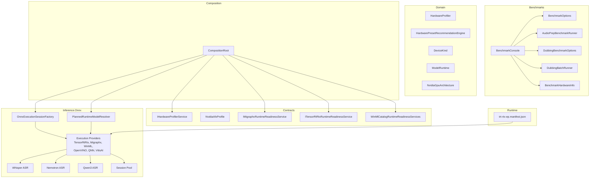
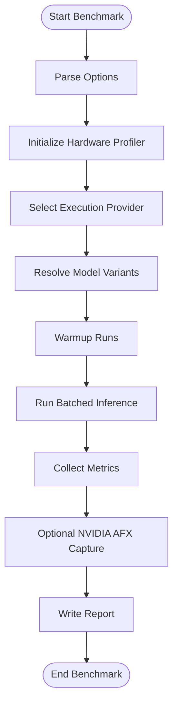
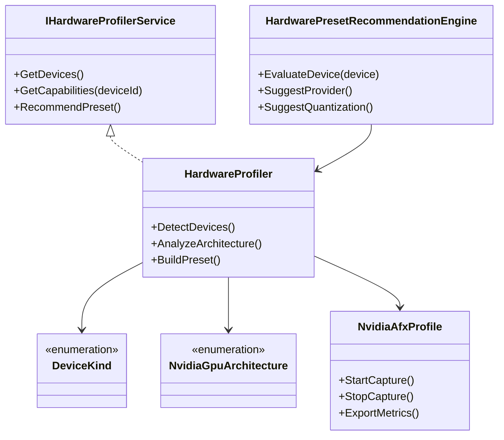
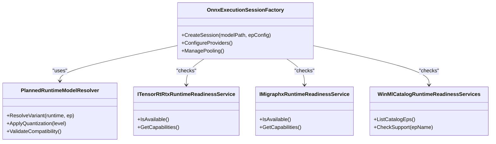
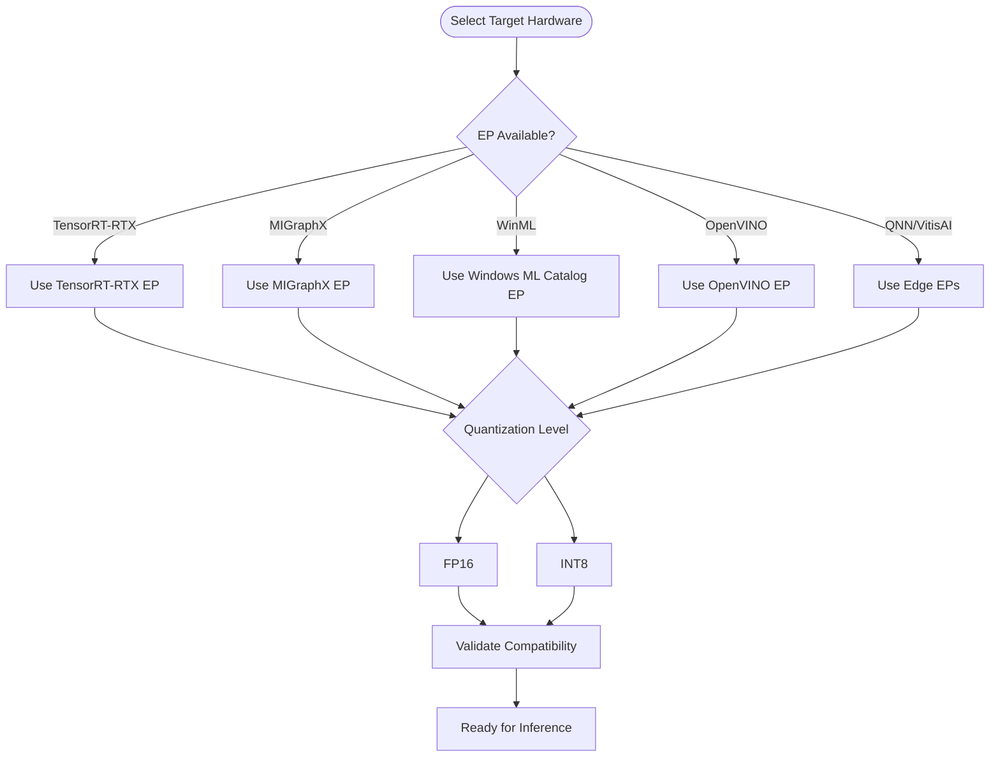
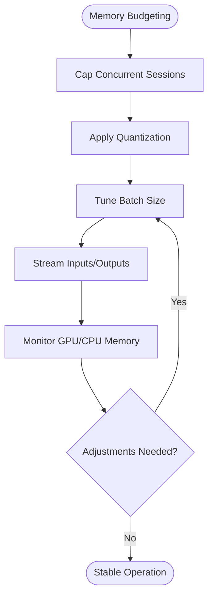
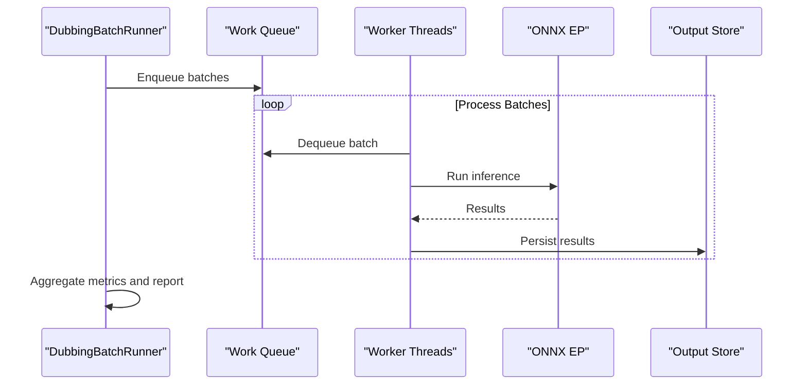
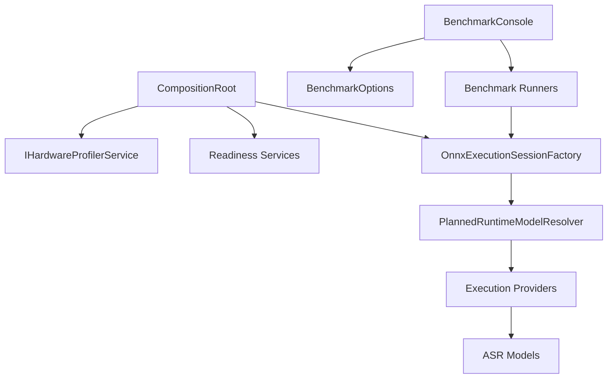

# Performance Optimization

<cite>
**Referenced Files in This Document**
- [Trackdub.Benchmarks.csproj](file://src/Trackdub.Benchmarks/Trackdub.Benchmarks.csproj)
- [BenchmarkConsole.cs](file://src/Trackdub.Benchmarks/BenchmarkConsole.cs)
- [BenchmarkHardwareInfo.cs](file://src/Trackdub.Benchmarks/BenchmarkHardwareInfo.cs)
- [BenchmarkOnnxExecutionBootstrap.cs](file://src/Trackdub.Benchmarks/BenchmarkOnnxExecutionBootstrap.cs)
- [BenchmarkTensorRtRtxBootstrap.cs](file://src/Trackdub.Benchmarks/BenchmarkTensorRtRtxBootstrap.cs)
- [AudioPrepBenchmarkRunner.cs](file://src/Trackdub.Benchmarks/AudioPrepBenchmarkRunner.cs)
- [DubbingBatchOptions.cs](file://src/Trackdub.Benchmarks/DubbingBatchOptions.cs)
- [DubbingBenchmarkOptions.cs](file://src/Trackdub.Benchmarks/DubbingBenchmarkOptions.cs)
- [Program.cs](file://src/Trackdub.Benchmarks/Program.cs)
- [README.md](file://src/Trackdub.Benchmarks/README.md)
- [IHardwareProfilerService.cs](file://src/Trackdub.Contracts/IHardwareProfilerService.cs)
- [NvidiaAfxProfile.cs](file://src/Trackdub.Contracts/NvidiaAfxProfile.cs)
- [IMigraphxRuntimeReadinessService.cs](file://src/Trackdub.Contracts/IMigraphxRuntimeReadinessService.cs)
- [ITensorRtRtxRuntimeReadinessService.cs](file://src/Trackdub.Contracts/ITensorRtRtxRuntimeReadinessService.cs)
- [WinMlCatalogRuntimeReadinessServices.cs](file://src/Trackdub.Contracts/WinMlCatalogRuntimeReadinessServices.cs)
- [CompositionRoot.cs](file://src/Trackdub.Composition/CompositionRoot.cs)
- [HardwareProfiler.cs](file://src/Trackdub.Domain/HardwareProfiler.cs)
- [HardwarePresetRecommendationEngine.cs](file://src/Trackdub.Domain/HardwarePresetRecommendationEngine.cs)
- [DeviceKind.cs](file://src/Trackdub.Domain/DeviceKind.cs)
- [ModelRuntime.cs](file://src/Trackdub.Domain/ModelRuntime.cs)
- [NvidiaGpuArchitecture.cs](file://src/Trackdub.Domain/NvidiaGpuArchitecture.cs)
- [Trackdub.Inference.Onnx.csproj](file://src/Trackdub.Inference.Onnx/Trackdub.Inference.Onnx.csproj)
- [OnnxExecutionSessionFactory.cs](file://src/Trackdub.Inference.Onnx/OnnxExecutionSessionFactory.cs)
- [PlannedRuntimeModelResolver.cs](file://src/Trackdub.Inference.Onnx/PlannedRuntimeModelResolver.cs)
- [ExecutionProviders/](file://src/Trackdub.Inference.Onnx/ExecutionProviders/)
- [TensorRtRtx/](file://src/Trackdub.Inference.Onnx/TensorRtRtx/)
- [Migraphx/](file://src/Trackdub.Inference.Onnx/Migraphx/)
- [WindowsMl/](file://src/Trackdub.Inference.Onnx/WindowsMl/)
- [OpenVino/](file://src/Trackdub.Inference.Onnx/OpenVino/)
- [Qnn/](file://src/Trackdub.Inference.Onnx/Qnn/)
- [VitisAi/](file://src/Trackdub.Inference.Onnx/VitisAi/)
- [Whisper/](file://src/Trackdub.Inference.Onnx/Whisper/)
- [NemotronAsr/](file://src/Trackdub.Inference.Onnx/NemotronAsr/)
- [Qwen3Asr/](file://src/Trackdub.Inference.Onnx/Qwen3Asr/)
- [Pool/](file://src/Trackdub.Inference.Onnx/Pool/)
- [runtime/trt-rtx-ep.manifest.json](file://runtime/trt-rtx-ep.manifest.json)
- [ADR-0002-windows-ml-provider-strategy.md](file://docs/decisions/ADR-0002-windows-ml-provider-strategy.md)
- [ADR-0009-gpu-memory-budget-planner.md](file://docs/decisions/ADR-0009-gpu-memory-budget-planner.md)
- [profiling-report.md](file://docs/reference/profiling-report.md)
- [windows-ml-phase-5-catalog-eps.md](file://docs/reference/windows-ml-phase-5-catalog-eps.md)
- [tensorrt-rtx-ep-abi-plugin.md](file://docs/reference/tensorrt-rtx-ep-abi-plugin.md)
</cite>

## Table of Contents
1. Introduction
2. Project Structure
3. Core Components
4. Architecture Overview
5. Detailed Component Analysis
6. Dependency Analysis
7. Performance Considerations
8. Troubleshooting Guide
9. Conclusion
10. Appendices

## Introduction
This document provides a comprehensive guide to optimizing Automatic Speech Recognition (ASR) performance in Trackdub. It covers hardware profiling, GPU acceleration settings, execution provider selection, model quantization, batch processing, benchmarking tools, monitoring utilities, and bottleneck identification. It also includes guidance for CPU vs GPU utilization, memory usage patterns, concurrency limits, optimization strategies across different hardware configurations and cloud environments, and troubleshooting techniques for performance issues, memory leaks, and throughput optimization.

## Project Structure
Trackdub organizes performance-related capabilities across several modules:
- Benchmarks: Standalone benchmarking tooling for ASR and audio preparation pipelines.
- Contracts: Interfaces for hardware profiling, runtime readiness, and NVIDIA AFX profiling data.
- Domain: Hardware profiling logic, device kinds, model runtime abstractions, and preset recommendation engines.
- Inference.Onnx: ONNX Runtime integration with multiple execution providers (EPs), including TensorRT-RTX, MIGraphX, Windows ML, OpenVINO, QNN, Vitis AI, and others.
- Composition: DI composition root wiring services and runtimes.
- Runtime manifest: EP plugin manifests for TensorRT-RTX.



**Diagram sources**
- [BenchmarkConsole.cs](file://src/Trackdub.Benchmarks/BenchmarkConsole.cs)
- [BenchmarkHardwareInfo.cs](file://src/Trackdub.Benchmarks/BenchmarkHardwareInfo.cs)
- [AudioPrepBenchmarkRunner.cs](file://src/Trackdub.Benchmarks/AudioPrepBenchmarkRunner.cs)
- [DubbingBenchmarkOptions.cs](file://src/Trackdub.Benchmarks/DubbingBenchmarkOptions.cs)
- [IHardwareProfilerService.cs](file://src/Trackdub.Contracts/IHardwareProfilerService.cs)
- [IMigraphxRuntimeReadinessService.cs](file://src/Trackdub.Contracts/IMigraphxRuntimeReadinessService.cs)
- [ITensorRtRtxRuntimeReadinessService.cs](file://src/Trackdub.Contracts/ITensorRtRtxRuntimeReadinessService.cs)
- [WinMlCatalogRuntimeReadinessServices.cs](file://src/Trackdub.Contracts/WinMlCatalogRuntimeReadinessServices.cs)
- [CompositionRoot.cs](file://src/Trackdub.Composition/CompositionRoot.cs)
- [OnnxExecutionSessionFactory.cs](file://src/Trackdub.Inference.Onnx/OnnxExecutionSessionFactory.cs)
- [PlannedRuntimeModelResolver.cs](file://src/Trackdub.Inference.Onnx/PlannedRuntimeModelResolver.cs)
- [runtime/trt-rtx-ep.manifest.json](file://runtime/trt-rtx-ep.manifest.json)

**Section sources**
- [Trackdub.Benchmarks.csproj](file://src/Trackdub.Benchmarks/Trackdub.Benchmarks.csproj)
- [Trackdub.Inference.Onnx.csproj](file://src/Trackdub.Inference.Onnx/Trackdub.Inference.Onnx.csproj)
- [README.md](file://src/Trackdub.Benchmarks/README.md)

## Core Components
- Benchmark Console and Options: Entry points and configuration for running benchmarks, including options for ASR models, execution providers, and batch sizes.
- Hardware Profiler: Detects devices, GPU architectures, and recommends presets based on hardware capabilities.
- Execution Provider Factory: Creates ONNX Runtime sessions with selected EPs and manages session pooling.
- Runtime Readiness Services: Validates availability and compatibility of EPs (TensorRT-RTX, MIGraphX, Windows ML).
- Model Resolvers: Resolve optimal model variants and quantization levels per target runtime and EP.
- NVIDIA AFX Profiling: Captures GPU-level metrics for deep analysis.

Key responsibilities:
- Provide consistent interfaces for hardware detection and profiling.
- Select the best execution provider and model variant at runtime.
- Offer benchmarking and reporting tools for throughput and latency measurement.
- Enable memory budgeting and concurrency controls for stable operation.

**Section sources**
- [BenchmarkConsole.cs](file://src/Trackdub.Benchmarks/BenchmarkConsole.cs)
- [BenchmarkHardwareInfo.cs](file://src/Trackdub.Benchmarks/BenchmarkHardwareInfo.cs)
- [IHardwareProfilerService.cs](file://src/Trackdub.Contracts/IHardwareProfilerService.cs)
- [OnnxExecutionSessionFactory.cs](file://src/Trackdub.Inference.Onnx/OnnxExecutionSessionFactory.cs)
- [PlannedRuntimeModelResolver.cs](file://src/Trackdub.Inference.Onnx/PlannedRuntimeModelResolver.cs)
- [NvidiaAfxProfile.cs](file://src/Trackdub.Contracts/NvidiaAfxProfile.cs)

## Architecture Overview
The performance architecture centers around an ONNX Runtime-based inference layer with pluggable execution providers. The benchmarking subsystem drives workloads and collects metrics, while domain services provide hardware insights and preset recommendations. Composition wires readiness checks and profiling hooks.

```mermaid
sequenceDiagram
participant CLI as "Benchmark Console"
participant Opt as "Benchmark Options"
participant Prof as "Hardware Profiler"
participant EPF as "Execution Provider Factory"
participant Res as "Model Resolver"
participant EP as "ONNX EP (TensorRT-RTX/MIGraphX/WinML)"
participant ASR as "ASR Models (Whisper/Nemotron/Qwen3)"
participant Pool as "Session Pool"
CLI->>Opt : Parse options (provider, batch, quantization)
CLI->>Prof : Query device info and presets
CLI->>EPF : Create session with selected EP
EPF->>Res : Resolve model variant and quantization
Res-->>EPF : Model path + config
EPF->>EP : Initialize provider and load model
EP-->>EPF : Session ready
CLI->>Pool : Acquire session
CLI->>ASR : Run inference with batched inputs
ASR-->>CLI : Latency, throughput, memory stats
CLI->>Prof : Record NVIDIA AFX profile if enabled
CLI-->>CLI : Generate benchmark report
```

**Diagram sources**
- [BenchmarkConsole.cs](file://src/Trackdub.Benchmarks/BenchmarkConsole.cs)
- [BenchmarkHardwareInfo.cs](file://src/Trackdub.Benchmarks/BenchmarkHardwareInfo.cs)
- [OnnxExecutionSessionFactory.cs](file://src/Trackdub.Inference.Onnx/OnnxExecutionSessionFactory.cs)
- [PlannedRuntimeModelResolver.cs](file://src/Trackdub.Inference.Onnx/PlannedRuntimeModelResolver.cs)
- [IHardwareProfilerService.cs](file://src/Trackdub.Contracts/IHardwareProfilerService.cs)

## Detailed Component Analysis

### Benchmarking Tools and Workflows
- BenchmarkConsole orchestrates runs using options like provider selection, batch size, and quantization flags.
- AudioPrepBenchmarkRunner measures preprocessing stages (audio decoding, normalization, feature extraction).
- DubbingBenchmarkOptions and DubbingBatchRunner support end-to-end dubbing pipeline benchmarks including ASR, translation, TTS, and mixing.
- Reports are written via BenchmarkReportWriter and aggregated into structured outputs.



**Diagram sources**
- [BenchmarkConsole.cs](file://src/Trackdub.Benchmarks/BenchmarkConsole.cs)
- [AudioPrepBenchmarkRunner.cs](file://src/Trackdub.Benchmarks/AudioPrepBenchmarkRunner.cs)
- [DubbingBenchmarkOptions.cs](file://src/Trackdub.Benchmarks/DubbingBenchmarkOptions.cs)
- [BenchmarkHardwareInfo.cs](file://src/Trackdub.Benchmarks/BenchmarkHardwareInfo.cs)

**Section sources**
- [BenchmarkConsole.cs](file://src/Trackdub.Benchmarks/BenchmarkConsole.cs)
- [AudioPrepBenchmarkRunner.cs](file://src/Trackdub.Benchmarks/AudioPrepBenchmarkRunner.cs)
- [DubbingBenchmarkOptions.cs](file://src/Trackdub.Benchmarks/DubbingBenchmarkOptions.cs)
- [Program.cs](file://src/Trackdub.Benchmarks/Program.cs)
- [README.md](file://src/Trackdub.Benchmarks/README.md)

### Hardware Profiling and Device Detection
- IHardwareProfilerService exposes methods to enumerate devices, detect GPU architectures, and gather capabilities.
- NvidiaAfxProfile integrates NVIDIA profiling APIs to capture detailed GPU metrics during inference.
- HardwareProfiler and HardwarePresetRecommendationEngine map device characteristics to recommended presets (e.g., quantization level, EP choice).
- DeviceKind and NvidiaGpuArchitecture define canonical device types and GPU families.



**Diagram sources**
- [IHardwareProfilerService.cs](file://src/Trackdub.Contracts/IHardwareProfilerService.cs)
- [HardwareProfiler.cs](file://src/Trackdub.Domain/HardwareProfiler.cs)
- [NvidiaAfxProfile.cs](file://src/Trackdub.Contracts/NvidiaAfxProfile.cs)
- [HardwarePresetRecommendationEngine.cs](file://src/Trackdub.Domain/HardwarePresetRecommendationEngine.cs)
- [DeviceKind.cs](file://src/Trackdub.Domain/DeviceKind.cs)
- [NvidiaGpuArchitecture.cs](file://src/Trackdub.Domain/NvidiaGpuArchitecture.cs)

**Section sources**
- [IHardwareProfilerService.cs](file://src/Trackdub.Contracts/IHardwareProfilerService.cs)
- [HardwareProfiler.cs](file://src/Trackdub.Domain/HardwareProfiler.cs)
- [NvidiaAfxProfile.cs](file://src/Trackdub.Contracts/NvidiaAfxProfile.cs)
- [HardwarePresetRecommendationEngine.cs](file://src/Trackdub.Domain/HardwarePresetRecommendationEngine.cs)
- [DeviceKind.cs](file://src/Trackdub.Domain/DeviceKind.cs)
- [NvidiaGpuArchitecture.cs](file://src/Trackdub.Domain/NvidiaGpuArchitecture.cs)

### Execution Provider Selection Strategy
- OnnxExecutionSessionFactory constructs ONNX Runtime sessions with provider-specific configurations.
- PlannedRuntimeModelResolver selects model variants and quantization based on target runtime and EP.
- Readiness services validate EP availability:
  - ITensorRtRtxRuntimeReadinessService for TensorRT-RTX
  - IMigraphxRuntimeReadinessService for MIGraphX
  - WinMlCatalogRuntimeReadinessServices for Windows ML catalog EPs
- EPs include TensorRT-RTX, MIGraphX, Windows ML, OpenVINO, QNN, Vitis AI.



**Diagram sources**
- [OnnxExecutionSessionFactory.cs](file://src/Trackdub.Inference.Onnx/OnnxExecutionSessionFactory.cs)
- [PlannedRuntimeModelResolver.cs](file://src/Trackdub.Inference.Onnx/PlannedRuntimeModelResolver.cs)
- [ITensorRtRtxRuntimeReadinessService.cs](file://src/Trackdub.Contracts/ITensorRtRtxRuntimeReadinessService.cs)
- [IMigraphxRuntimeReadinessService.cs](file://src/Trackdub.Contracts/IMigraphxRuntimeReadinessService.cs)
- [WinMlCatalogRuntimeReadinessServices.cs](file://src/Trackdub.Contracts/WinMlCatalogRuntimeReadinessServices.cs)

**Section sources**
- [OnnxExecutionSessionFactory.cs](file://src/Trackdub.Inference.Onnx/OnnxExecutionSessionFactory.cs)
- [PlannedRuntimeModelResolver.cs](file://src/Trackdub.Inference.Onnx/PlannedRuntimeModelResolver.cs)
- [ITensorRtRtxRuntimeReadinessService.cs](file://src/Trackdub.Contracts/ITensorRtRtxRuntimeReadinessService.cs)
- [IMigraphxRuntimeReadinessService.cs](file://src/Trackdub.Contracts/IMigraphxRuntimeReadinessService.cs)
- [WinMlCatalogRuntimeReadinessServices.cs](file://src/Trackdub.Contracts/WinMlCatalogRuntimeReadinessServices.cs)

### GPU Acceleration Settings and Quantization
- TensorRT-RTX: Best-in-class GPU acceleration for supported NVIDIA GPUs; requires compatible drivers and plugins.
- MIGraphX: AMD ROCm backend for GPU acceleration on compatible hardware.
- Windows ML: Leverages Windows ML runtime and catalog EPs for optimized inference paths.
- OpenVINO: Intel CPU/GPU acceleration; useful for heterogeneous setups.
- QNN and Vitis AI: Edge and specialized accelerator targets.
- Quantization: INT8/FP16 options controlled by model resolver and EP capabilities; lower precision reduces memory footprint and improves throughput.



**Diagram sources**
- [PlannedRuntimeModelResolver.cs](file://src/Trackdub.Inference.Onnx/PlannedRuntimeModelResolver.cs)
- [ITensorRtRtxRuntimeReadinessService.cs](file://src/Trackdub.Contracts/ITensorRtRtxRuntimeReadinessService.cs)
- [IMigraphxRuntimeReadinessService.cs](file://src/Trackdub.Contracts/IMigraphxRuntimeReadinessService.cs)
- [WinMlCatalogRuntimeReadinessServices.cs](file://src/Trackdub.Contracts/WinMlCatalogRuntimeReadinessServices.cs)

**Section sources**
- [PlannedRuntimeModelResolver.cs](file://src/Trackdub.Inference.Onnx/PlannedRuntimeModelResolver.cs)
- [ITensorRtRtxRuntimeReadinessService.cs](file://src/Trackdub.Contracts/ITensorRtRtxRuntimeReadinessService.cs)
- [IMigraphxRuntimeReadinessService.cs](file://src/Trackdub.Contracts/IMigraphxRuntimeReadinessService.cs)
- [WinMlCatalogRuntimeReadinessServices.cs](file://src/Trackdub.Contracts/WinMlCatalogRuntimeReadinessServices.cs)

### Memory Optimization Techniques
- Session pooling: Reuse ONNX sessions to avoid repeated model loading overhead.
- Quantization: Reduce model size and memory bandwidth requirements.
- Batch sizing: Tune batch size to balance throughput and memory pressure.
- GPU memory budgeting: Use ADR guidelines to cap concurrent sessions and prevent OOM.
- Prefetching and streaming: For real-time transcription, stream audio chunks and process incrementally.



[No sources needed since this diagram shows conceptual workflow, not actual code structure]

**Section sources**
- [ADR-0009-gpu-memory-budget-planner.md](file://docs/decisions/ADR-0009-gpu-memory-budget-planner.md)
- [OnnxExecutionSessionFactory.cs](file://src/Trackdub.Inference.Onnx/OnnxExecutionSessionFactory.cs)
- [PlannedRuntimeModelResolver.cs](file://src/Trackdub.Inference.Onnx/PlannedRuntimeModelResolver.cs)

### Batch Processing Configurations
- DubbingBatchOptions and DubbingBatchRunner configure batch sizes, concurrency, and output aggregation.
- AudioPrepBenchmarkRunner supports batched preprocessing tasks for throughput evaluation.
- Recommendations:
  - Increase batch size until memory saturation or latency degradation occurs.
  - Use asynchronous processing to overlap I/O and compute.
  - Monitor queue lengths and backpressure signals.



**Diagram sources**
- [DubbingBatchOptions.cs](file://src/Trackdub.Benchmarks/DubbingBatchOptions.cs)
- [AudioPrepBenchmarkRunner.cs](file://src/Trackdub.Benchmarks/AudioPrepBenchmarkRunner.cs)

**Section sources**
- [DubbingBatchOptions.cs](file://src/Trackdub.Benchmarks/DubbingBatchOptions.cs)
- [AudioPrepBenchmarkRunner.cs](file://src/Trackdub.Benchmarks/AudioPrepBenchmarkRunner.cs)

### Monitoring Utilities and Bottleneck Identification
- NVIDIA AFX profiling captures GPU kernel timings, memory transfers, and utilization.
- Benchmark reports aggregate latency, throughput, and resource usage.
- Readiness services help identify missing dependencies or incompatible EP versions.
- Recommended steps:
  - Enable AFX profiling during high-load scenarios.
  - Compare CPU vs GPU utilization to find bottlenecks.
  - Inspect EP logs for initialization errors or fallbacks.

**Section sources**
- [NvidiaAfxProfile.cs](file://src/Trackdub.Contracts/NvidiaAfxProfile.cs)
- [BenchmarkConsole.cs](file://src/Trackdub.Benchmarks/BenchmarkConsole.cs)
- [ITensorRtRtxRuntimeReadinessService.cs](file://src/Trackdub.Contracts/ITensorRtRtxRuntimeReadinessService.cs)
- [IMigraphxRuntimeReadinessService.cs](file://src/Trackdub.Contracts/IMigraphxRuntimeReadinessService.cs)
- [WinMlCatalogRuntimeReadinessServices.cs](file://src/Trackdub.Contracts/WinMlCatalogRuntimeReadinessServices.cs)

## Dependency Analysis
Trackdub’s performance stack depends on ONNX Runtime and various EPs. The composition root wires readiness services and profiling hooks. Benchmarks depend on options and runners that orchestrate workloads.



**Diagram sources**
- [CompositionRoot.cs](file://src/Trackdub.Composition/CompositionRoot.cs)
- [OnnxExecutionSessionFactory.cs](file://src/Trackdub.Inference.Onnx/OnnxExecutionSessionFactory.cs)
- [PlannedRuntimeModelResolver.cs](file://src/Trackdub.Inference.Onnx/PlannedRuntimeModelResolver.cs)
- [BenchmarkConsole.cs](file://src/Trackdub.Benchmarks/BenchmarkConsole.cs)

**Section sources**
- [CompositionRoot.cs](file://src/Trackdub.Composition/CompositionRoot.cs)
- [OnnxExecutionSessionFactory.cs](file://src/Trackdub.Inference.Onnx/OnnxExecutionSessionFactory.cs)
- [PlannedRuntimeModelResolver.cs](file://src/Trackdub.Inference.Onnx/PlannedRuntimeModelResolver.cs)
- [BenchmarkConsole.cs](file://src/Trackdub.Benchmarks/BenchmarkConsole.cs)

## Performance Considerations
- CPU vs GPU Utilization:
  - Prefer GPU EPs when available (TensorRT-RTX, MIGraphX) for ASR models.
  - Use OpenVINO for Intel CPUs/GPUs where GPU is unavailable.
  - Monitor CPU spikes indicating I/O bottlenecks or preprocessing overhead.
- Memory Usage Patterns:
  - Quantized models reduce memory footprint; INT8 offers best compression.
  - Limit concurrent sessions to avoid GPU OOM; use session pooling.
  - Stream large audio files to minimize peak memory.
- Concurrency Limits:
  - Tune worker threads and batch sizes based on hardware capacity.
  - Use backpressure mechanisms to prevent queue overflow.
- Cloud Deployment:
  - Use containerized EPs with proper driver mounts.
  - Scale horizontally with stateless workers and shared model caches.
- Resource-Constrained Environments:
  - Favor smaller models (tiny/small variants) and INT8 quantization.
  - Disable non-essential profiling to reduce overhead.

[No sources needed since this section provides general guidance]

## Troubleshooting Guide
Common issues and resolutions:
- EP Initialization Failures:
  - Verify driver versions and EP plugin manifests (e.g., trt-rtx-ep.manifest.json).
  - Check readiness service outputs for capability mismatches.
- Memory Leaks:
  - Ensure sessions are properly disposed and pooled.
  - Avoid holding references to large intermediate buffers.
- Throughput Degradation:
  - Reduce batch size or increase concurrency cautiously.
  - Profile GPU kernels with AFX to identify hotspots.
- Fallback to CPU:
  - Investigate why GPU EP was not selected; check compatibility and availability.
- Real-Time Transcription Latency:
  - Use streaming input and small batch sizes.
  - Preload models and warm up EPs before serving requests.

**Section sources**
- [runtime/trt-rtx-ep.manifest.json](file://runtime/trt-rtx-ep.manifest.json)
- [ITensorRtRtxRuntimeReadinessService.cs](file://src/Trackdub.Contracts/ITensorRtRtxRuntimeReadinessService.cs)
- [OnnxExecutionSessionFactory.cs](file://src/Trackdub.Inference.Onnx/OnnxExecutionSessionFactory.cs)
- [NvidiaAfxProfile.cs](file://src/Trackdub.Contracts/NvidiaAfxProfile.cs)

## Conclusion
Trackdub provides a robust, extensible framework for optimizing ASR performance through hardware-aware profiling, flexible execution provider selection, and comprehensive benchmarking tools. By leveraging GPU acceleration, quantization, and careful memory management, users can achieve high throughput and low latency across diverse hardware configurations and deployment scenarios. Continuous monitoring and iterative tuning are essential to maintain optimal performance under varying workloads.

[No sources needed since this section summarizes without analyzing specific files]

## Appendices

### Execution Provider Matrix and References
- Windows ML Provider Strategy: Decision document outlining provider selection policies.
- Windows ML Catalog EPs: Reference for catalog-based EP discovery and validation.
- TensorRT-RTX EP ABI Plugin: Technical reference for plugin compatibility and versioning.
- Profiling Report: Template and guidance for generating performance reports.

**Section sources**
- [ADR-0002-windows-ml-provider-strategy.md](file://docs/decisions/ADR-0002-windows-ml-provider-strategy.md)
- [windows-ml-phase-5-catalog-eps.md](file://docs/reference/windows-ml-phase-5-catalog-eps.md)
- [tensorrt-rtx-ep-abi-plugin.md](file://docs/reference/tensorrt-rtx-ep-abi-plugin.md)
- [profiling-report.md](file://docs/reference/profiling-report.md)