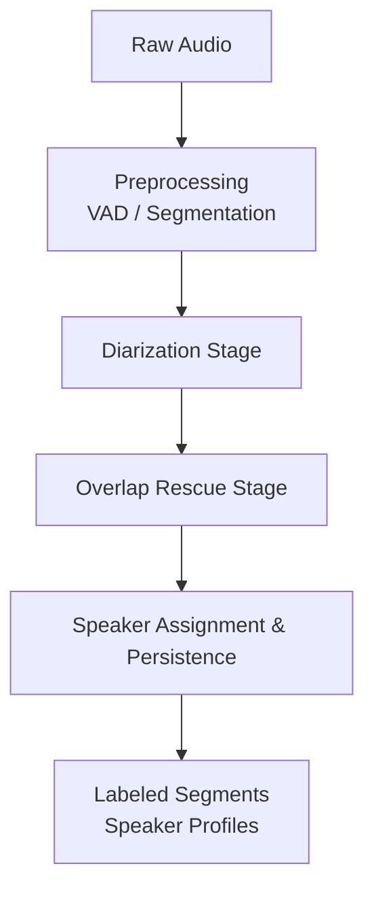
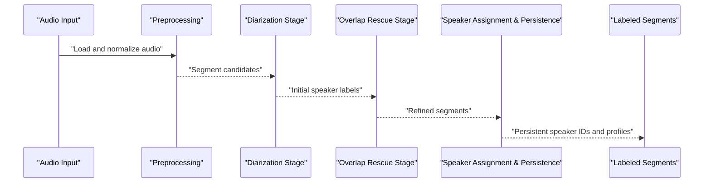
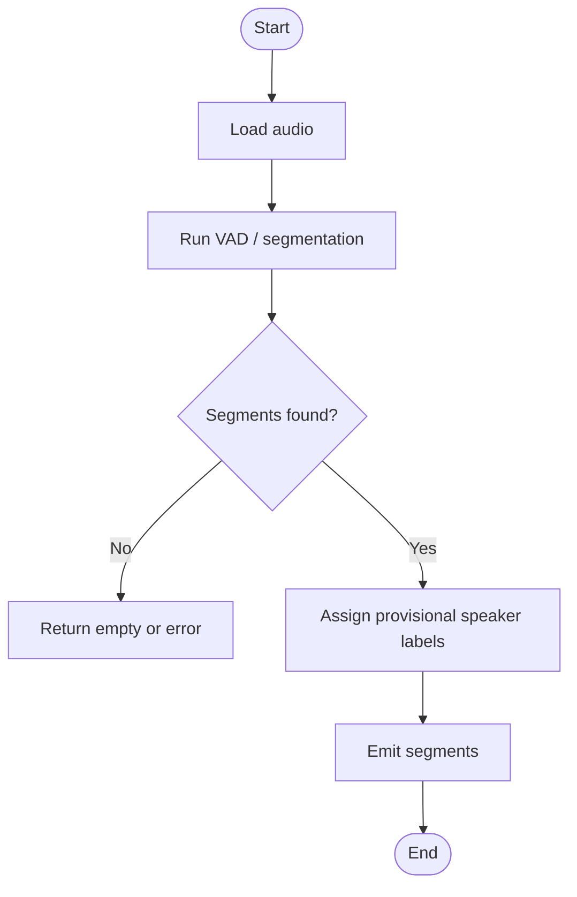
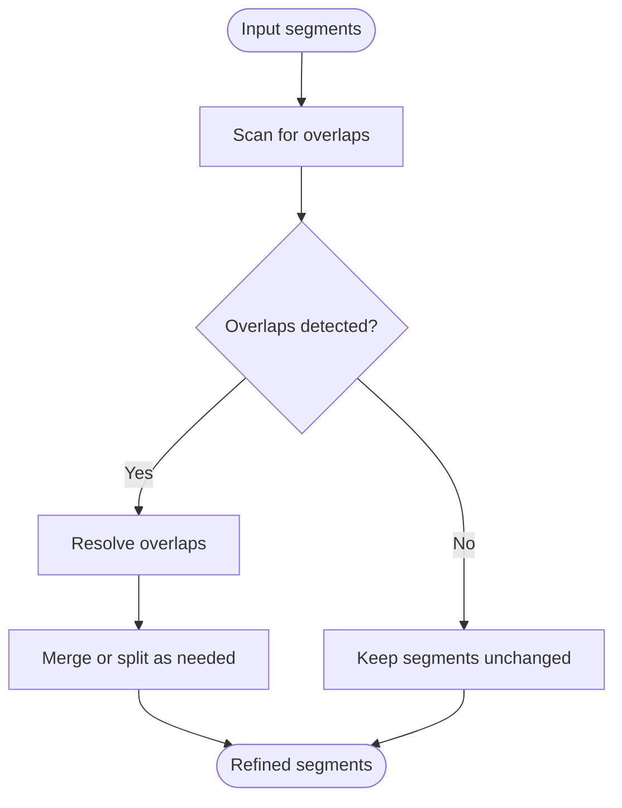
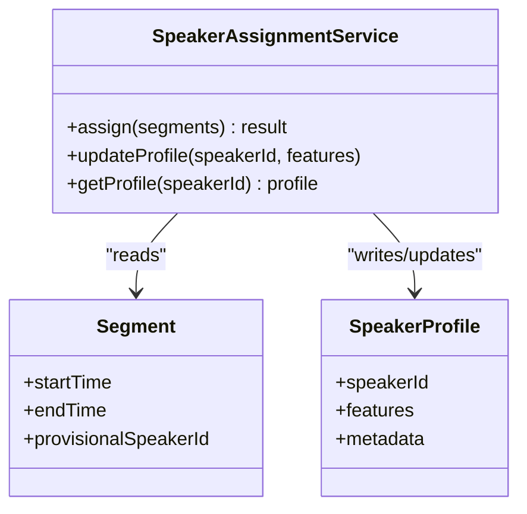
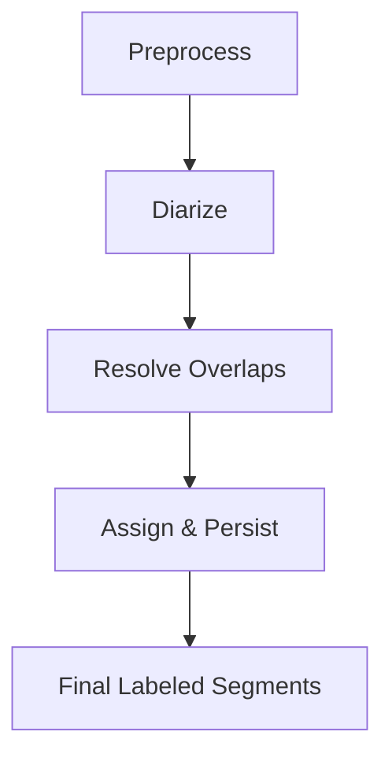
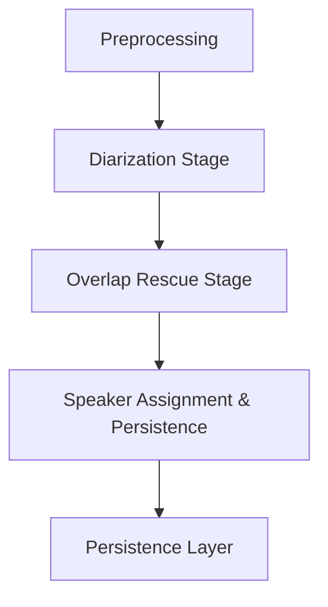

# Speaker Diarization

<cite>
**Referenced Files in This Document**
- [DiarizationStageHandlerTests.cs](file://tests/Trackdub.Application.Tests/DiarizationStageHandlerTests.cs)
- [SpeakerAssignmentAndPersistenceStageTests.cs](file://tests/Trackdub.Application.Tests/SpeakerAssignmentAndPersistenceStageTests.cs)
- [SpeakerAssignmentServiceTests.cs](file://tests/Trackdub.Application.Tests/SpeakerAssignmentServiceTests.cs)
- [OverlapRescueStageHandlerTests.cs](file://tests/Trackdub.Application.Tests/OverlapRescueStageHandlerTests.cs)
- [SpeakerDiarizationStageTests.cs](file://tests/Trackdub.Application.Tests/SpeakerDiarizationStageTests.cs)
</cite>

## Table of Contents
1. Introduction
2. Project Structure
3. Core Components
4. Architecture Overview
5. Detailed Component Analysis
6. Dependency Analysis
7. Performance Considerations
8. Troubleshooting Guide
9. Conclusion

## Introduction
This document explains Trackdub’s speaker diarization system: how raw audio is segmented into speaker turns, how speakers are identified and clustered, and how segments are assigned to persistent speaker profiles. It covers the end-to-end pipeline from pre-processing through post-processing refinement, including overlap detection, transition handling, configuration options, performance optimization for long-form audio, memory management across multiple speakers, and accuracy improvement techniques for challenging audio conditions.

## Project Structure
The diarization functionality is implemented as part of the application pipeline with dedicated stages and services. Tests reveal the presence of:
- A diarization stage that produces initial speaker segmentation and labels
- An overlap rescue stage that refines overlapping speech regions
- A speaker assignment and persistence stage that maps segments to stable speaker identities and persists them

[No sources needed since this diagram shows conceptual workflow, not actual code structure]

## Core Components
Based on the test suite, the diarization pipeline includes:
- Diarization stage: performs voice activity detection and initial speaker segmentation
- Overlap rescue stage: detects and resolves overlapping speech between adjacent segments
- Speaker assignment and persistence stage: assigns consistent speaker IDs and persists speaker profiles and segment mappings

Key responsibilities:
- Segment generation and labeling
- Overlap detection and correction
- Speaker clustering and profile management
- Persistence of results and metadata

**Section sources**
- [DiarizationStageHandlerTests.cs](file://tests/Trackdub.Application.Tests/DiarizationStageHandlerTests.cs)
- [OverlapRescueStageHandlerTests.cs](file://tests/Trackdub.Application.Tests/OverlapRescueStageHandlerTests.cs)
- [SpeakerAssignmentAndPersistenceStageTests.cs](file://tests/Trackdub.Application.Tests/SpeakerAssignmentAndPersistenceStageTests.cs)
- [SpeakerAssignmentServiceTests.cs](file://tests/Trackdub.Application.Tests/SpeakerAssignmentServiceTests.cs)
- [SpeakerDiarizationStageTests.cs](file://tests/Trackdub.Application.Tests/SpeakerDiarizationStageTests.cs)

## Architecture Overview
The diarization pipeline transforms raw audio into labeled segments with consistent speaker identities. The flow emphasizes robustness against overlaps and ensures stable speaker identity mapping.

[No sources needed since this diagram shows conceptual workflow, not actual code structure]

## Detailed Component Analysis

### Diarization Stage
Purpose:
- Perform voice activity detection and generate initial speaker segments
- Produce preliminary speaker labels for each segment

Behavior highlights (from tests):
- Validates input audio readiness and handles edge cases
- Produces segments with timestamps and provisional speaker IDs
- Integrates with preprocessing outputs

**Section sources**
- [DiarizationStageHandlerTests.cs](file://tests/Trackdub.Application.Tests/DiarizationStageHandlerTests.cs)
- [SpeakerDiarizationStageTests.cs](file://tests/Trackdub.Application.Tests/SpeakerDiarizationStageTests.cs)

### Overlap Rescue Stage
Purpose:
- Detect overlapping speech regions between adjacent segments
- Refine boundaries and resolve conflicts to improve accuracy

Behavior highlights (from tests):
- Identifies overlaps using temporal analysis
- Applies resolution strategies to minimize mis-segmentation
- Outputs corrected segments for downstream assignment

**Section sources**
- [OverlapRescueStageHandlerTests.cs](file://tests/Trackdub.Application.Tests/OverlapRescueStageHandlerTests.cs)

### Speaker Assignment and Persistence Stage
Purpose:
- Map provisional speaker labels to stable speaker identities
- Persist speaker profiles and segment-to-speaker mappings

Behavior highlights (from tests):
- Uses clustering or similarity-based assignment to ensure consistency
- Persists speaker metadata and segment assignments
- Supports reassignment when new evidence emerges

**Diagram sources**
- [SpeakerAssignmentServiceTests.cs](file://tests/Trackdub.Application.Tests/SpeakerAssignmentServiceTests.cs)
- [SpeakerAssignmentAndPersistenceStageTests.cs](file://tests/Trackdub.Application.Tests/SpeakerAssignmentAndPersistenceStageTests.cs)

**Section sources**
- [SpeakerAssignmentServiceTests.cs](file://tests/Trackdub.Application.Tests/SpeakerAssignmentServiceTests.cs)
- [SpeakerAssignmentAndPersistenceStageTests.cs](file://tests/Trackdub.Application.Tests/SpeakerAssignmentAndPersistenceStageTests.cs)

### Conceptual Overview
High-level processing logic:
- Preprocessing normalizes audio and prepares it for segmentation
- Diarization generates initial segments and provisional labels
- Overlap rescue improves boundary accuracy by resolving overlaps
- Assignment and persistence map segments to stable speaker identities and store results

[No sources needed since this diagram shows conceptual workflow, not actual code structure]

## Dependency Analysis
The diarization pipeline depends on:
- Preprocessing utilities for audio normalization and feature extraction
- Voice activity detection and segmentation models
- Clustering or similarity algorithms for speaker assignment
- Persistence layer for storing speaker profiles and segment mappings

[No sources needed since this diagram shows conceptual workflow, not actual code structure]

**Section sources**
- [DiarizationStageHandlerTests.cs](file://tests/Trackdub.Application.Tests/DiarizationStageHandlerTests.cs)
- [OverlapRescueStageHandlerTests.cs](file://tests/Trackdub.Application.Tests/OverlapRescueStageHandlerTests.cs)
- [SpeakerAssignmentAndPersistenceStageTests.cs](file://tests/Trackdub.Application.Tests/SpeakerAssignmentAndPersistenceStageTests.cs)
- [SpeakerAssignmentServiceTests.cs](file://tests/Trackdub.Application.Tests/SpeakerAssignmentServiceTests.cs)
- [SpeakerDiarizationStageTests.cs](file://tests/Trackdub.Application.Tests/SpeakerDiarizationStageTests.cs)

## Performance Considerations
- Long-form audio: Use chunked processing to manage memory and enable incremental diarization
- Memory management: Stream audio data and avoid loading entire files into memory; reuse buffers where possible
- Accuracy improvements: Tune VAD thresholds, apply overlap resolution heuristics, and refine clustering based on acoustic features
- Parallelism: Process independent segments concurrently while maintaining temporal order
- Model selection: Choose appropriate ASR/VAD models balancing speed and accuracy for target hardware

[No sources needed since this section provides general guidance]

## Troubleshooting Guide
Common issues and remedies:
- No segments detected: Verify audio quality, noise levels, and VAD sensitivity settings
- Excessive overlaps: Adjust overlap detection thresholds and refine boundary resolution
- Inconsistent speaker IDs: Review clustering parameters and update speaker profiles with additional samples
- Slow processing: Enable chunked processing, reduce model size, or leverage GPU acceleration if available

[No sources needed since this section provides general guidance]

## Conclusion
Trackdub’s speaker diarization system integrates preprocessing, segmentation, overlap resolution, and speaker assignment into a cohesive pipeline. By leveraging robust VAD, overlap rescue, and persistent speaker profiling, it delivers accurate and consistent speaker labeling even in challenging audio conditions. Proper configuration and performance tuning further enhance reliability and scalability for long-form content.

[No sources needed since this section summarizes without analyzing specific files]