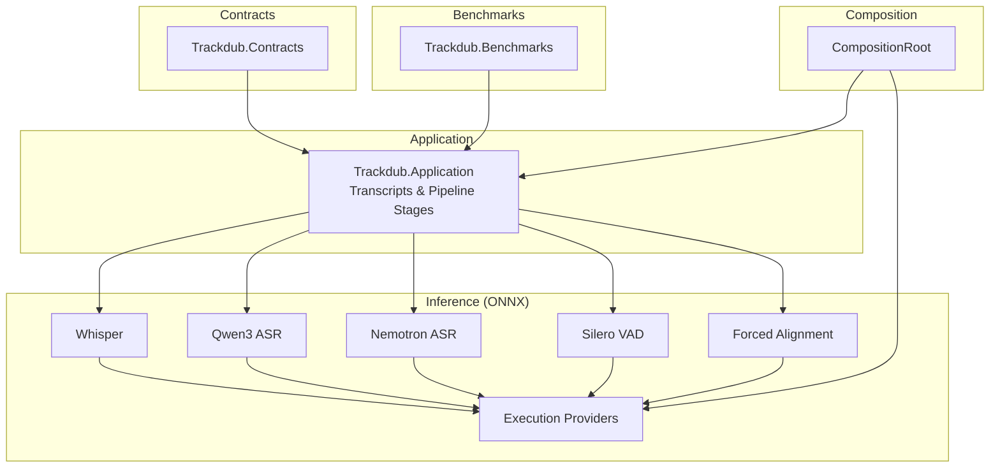
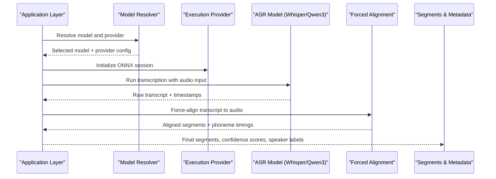
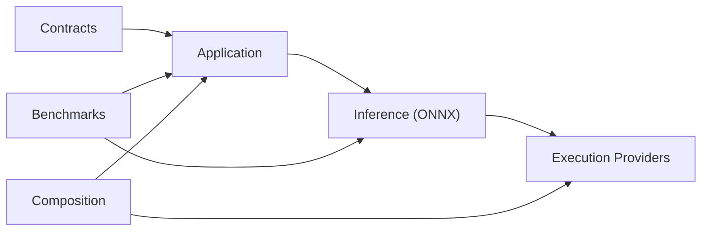

# Speech Recognition (ASR)

<cite>
**Referenced Files in This Document**
- [README.md](file://README.md)
- [Trackdub.Inference.Onnx.csproj](file://src/Trackdub.Inference.Onnx/Trackdub.Inference.Onnx.csproj)
- [OnnxModelBenchmarkRunner.cs](file://src/Trackdub.Inference.Onnx/OnnxModelBenchmarkRunner.cs)
- [PlannedRuntimeModelResolver.cs](file://src/Trackdub.Inference.Onnx/PlannedRuntimeModelResolver.cs)
- [Whisper directory](file://src/Trackdub.Inference.Onnx/Whisper)
- [Qwen3Asr directory](file://src/Trackdub.Inference.Onnx/Qwen3Asr)
- [ForcedAlignment directory](file://src/Trackdub.Inference.Onnx/ForcedAlignment)
- [NemotronAsr directory](file://src/Trackdub.Inference.Onnx/NemotronAsr)
- [SileroVad directory](file://src/Trackdub.Inference.Onnx/SileroVad)
- [OpenVino directory](file://src/Trackdub.Inference.Onnx/OpenVino)
- [TensorRtRtx directory](file://src/Trackdub.Inference.Onnx/TensorRtRtx)
- [ExecutionProviders directory](file://src/Trackdub.Inference.Onnx/ExecutionProviders)
- [runtime/trt-rtx-ep.manifest.json](file://runtime/trt-rtx-ep.manifest.json)
- [ADR-0003-whisper-license-investigation.md](file://docs/decisions/ADR-0003-whisper-license-investigation.md)
- [ADR-0009-gpu-memory-budget-planner.md](file://docs/decisions/ADR-0009-gpu-memory-budget-planner.md)
- [ADR-0012-wave-pcm16-loudness-policy.md](file://docs/decisions/ADR-0012-wave-pcm16-loudness-policy.md)
- [benchmarking README](file://src/Trackdub.Benchmarks/README.md)
- [AudioPrepBenchmarkRunner.cs](file://src/Trackdub.Benchmarks/AudioPrepBenchmarkRunner.cs)
- [DubbingBenchmarkRunner.cs](file://src/Trackdub.Benchmarks/DubbingBenchmarkRunner.cs)
- [BenchmarkOptions.cs](file://src/Trackdub.Benchmarks/BenchmarkOptions.cs)
- [Program.cs (Benchmarks)](file://src/Trackdub.Benchmarks/Program.cs)
- [Trackdub.Application.csproj](file://src/Trackdub.Application/Trackdub.Application.csproj)
- [Transcripts directory](file://src/Trackdub.Application/Transcripts)
- [CompositionRoot.cs](file://src/Trackdub.Composition/CompositionRoot.cs)
- [Trackdub.Contracts.csproj](file://src/Trackdub.Contracts/Trackdub.Contracts.csproj)
- [Trackdub.Domain.csproj](file://src/Trackdub.Domain/Trackdub.Domain.csproj)
</cite>

## Table of Contents
1. [Introduction](#introduction)
2. [Project Structure](#project-structure)
3. [Core Components](#core-components)
4. [Architecture Overview](#architecture-overview)
5. [Detailed Component Analysis](#detailed-component-analysis)
6. [Dependency Analysis](#dependency-analysis)
7. [Performance Considerations](#performance-considerations)
8. [Troubleshooting Guide](#troubleshooting-guide)
9. [Conclusion](#conclusion)
10. [Appendices](#appendices)

## Introduction
This document explains Trackdub’s speech recognition (Automatic Speech Recognition, ASR) capabilities powered by Whisper and Qwen3 ASR models. It covers multi-language transcription, speaker diarization, confidence scoring, model selection criteria, accuracy optimization techniques, language-specific tuning, transcript editing interfaces, segment alignment, manual correction workflows, forced alignment engine, phoneme timing calculation, synchronization with video frames, configuration options for accuracy vs speed trade-offs, vocabulary customization, domain-specific adaptations, performance benchmarking tools, memory usage optimization, GPU acceleration settings, and troubleshooting guidance for common issues.

## Project Structure
Trackdub organizes ASR-related functionality across several layers:
- Contracts define shared interfaces and data types used by application and inference layers.
- Application layer orchestrates pipeline stages, including ASR generation, diarization, and text refinement.
- Inference layer implements ONNX-based execution for Whisper, Qwen3 ASR, Nemotron ASR, Silero VAD, and forced alignment engines.
- Benchmarks provide tools to measure latency, throughput, and resource usage across different configurations.
- Composition wires runtime providers (e.g., TensorRT-RTX, OpenVINO) and model resolvers.

**Diagram sources**
- [Trackdub.Contracts.csproj](file://src/Trackdub.Contracts/Trackdub.Contracts.csproj)
- [Trackdub.Application.csproj](file://src/Trackdub.Application/Trackdub.Application.csproj)
- [Trackdub.Inference.Onnx.csproj](file://src/Trackdub.Inference.Onnx/Trackdub.Inference.Onnx.csproj)
- [CompositionRoot.cs](file://src/Trackdub.Composition/CompositionRoot.cs)
- [Program.cs (Benchmarks)](file://src/Trackdub.Benchmarks/Program.cs)

**Section sources**
- [README.md](file://README.md)
- [Trackdub.Contracts.csproj](file://src/Trackdub.Contracts/Trackdub.Contracts.csproj)
- [Trackdub.Application.csproj](file://src/Trackdub.Application/Trackdub.Application.csproj)
- [Trackdub.Inference.Onnx.csproj](file://src/Trackdub.Inference.Onnx/Trackdub.Inference.Onnx.csproj)
- [CompositionRoot.cs](file://src/Trackdub.Composition/CompositionRoot.cs)

## Core Components
- Whisper ASR: Multi-language transcription with configurable model sizes and execution providers.
- Qwen3 ASR: Alternative ASR model supporting multiple languages and optimized inference paths.
- Forced Alignment Engine: Aligns transcripts to audio segments and computes phoneme-level timing for synchronization.
- Speaker Diarization: Identifies and labels distinct speakers within audio streams.
- Confidence Scoring: Provides per-segment or per-word confidence metrics to guide editing and quality checks.
- Execution Providers: Hardware-accelerated backends (e.g., TensorRT-RTX, OpenVINO) for performance optimization.

Key implementation locations:
- Whisper integration: [Whisper directory](file://src/Trackdub.Inference.Onnx/Whisper)
- Qwen3 ASR integration: [Qwen3Asr directory](file://src/Trackdub.Inference.Onnx/Qwen3Asr)
- Forced alignment: [ForcedAlignment directory](file://src/Trackdub.Inference.Onnx/ForcedAlignment)
- Speaker diarization and VAD: [SileroVad directory](file://src/Trackdub.Inference.Onnx/SileroVad), [NemotronAsr directory](file://src/Trackdub.Inference.Onnx/NemotronAsr)
- Execution providers: [ExecutionProviders directory](file://src/Trackdub.Inference.Onnx/ExecutionProviders), [OpenVino directory](file://src/Trackdub.Inference.Onnx/OpenVino), [TensorRtRtx directory](file://src/Trackdub.Inference.Onnx/TensorRtRtx)

**Section sources**
- [Whisper directory](file://src/Trackdub.Inference.Onnx/Whisper)
- [Qwen3Asr directory](file://src/Trackdub.Inference.Onnx/Qwen3Asr)
- [ForcedAlignment directory](file://src/Trackdub.Inference.Onnx/ForcedAlignment)
- [SileroVad directory](file://src/Trackdub.Inference.Onnx/SileroVad)
- [NemotronAsr directory](file://src/Trackdub.Inference.Onnx/NemotronAsr)
- [ExecutionProviders directory](file://src/Trackdub.Inference.Onnx/ExecutionProviders)
- [OpenVino directory](file://src/Trackdub.Inference.Onnx/OpenVino)
- [TensorRtRtx directory](file://src/Trackdub.Inference.Onnx/TensorRtRtx)

## Architecture Overview
The ASR pipeline integrates model selection, inference execution, and post-processing:
- Model selection resolves the appropriate ASR model (Whisper or Qwen3) based on hardware, language, and performance targets.
- Inference runs via ONNX Runtime with selected execution providers for CPU/GPU acceleration.
- Post-processing includes diarization, confidence scoring, and forced alignment to produce synchronized segments.
- Benchmarking measures latency, throughput, and memory usage to validate configurations.

**Diagram sources**
- [PlannedRuntimeModelResolver.cs](file://src/Trackdub.Inference.Onnx/PlannedRuntimeModelResolver.cs)
- [ExecutionProviders directory](file://src/Trackdub.Inference.Onnx/ExecutionProviders)
- [Whisper directory](file://src/Trackdub.Inference.Onnx/Whisper)
- [Qwen3Asr directory](file://src/Trackdub.Inference.Onnx/Qwen3Asr)
- [ForcedAlignment directory](file://src/Trackdub.Inference.Onnx/ForcedAlignment)

## Detailed Component Analysis

### Whisper ASR Integration
- Multi-language support: Configurable language codes and automatic detection where applicable.
- Model variants: Tiny/small/medium/large variants with trade-offs between speed and accuracy.
- Execution providers: CPU, CUDA/TensorRT, WebGPU; selection impacts performance and memory footprint.
- Configuration: Beam search, temperature, prompt tuning, and vocabulary constraints.

Implementation references:
- Whisper module location: [Whisper directory](file://src/Trackdub.Inference.Onnx/Whisper)
- License considerations: [ADR-0003-whisper-license-investigation.md](file://docs/decisions/ADR-0003-whisper-license-investigation.md)

**Section sources**
- [Whisper directory](file://src/Trackdub.Inference.Onnx/Whisper)
- [ADR-0003-whisper-license-investigation.md](file://docs/decisions/ADR-0003-whisper-license-investigation.md)

### Qwen3 ASR Integration
- Multi-language transcription with optimized ONNX graphs.
- Supports various quantization and execution provider combinations for speed/accuracy balance.
- Integrates with model resolver to select appropriate variant based on device capabilities.

Implementation references:
- Qwen3 ASR module location: [Qwen3Asr directory](file://src/Trackdub.Inference.Onnx/Qwen3Asr)

**Section sources**
- [Qwen3Asr directory](file://src/Trackdub.Inference.Onnx/Qwen3Asr)

### Forced Alignment Engine
- Aligns word/phoneme boundaries to audio timestamps for precise synchronization.
- Computes phoneme timing to enable frame-accurate lip-sync and subtitle alignment.
- Uses acoustic models and lexicons to refine segment boundaries.

Implementation references:
- Forced alignment module location: [ForcedAlignment directory](file://src/Trackdub.Inference.Onnx/ForcedAlignment)

**Section sources**
- [ForcedAlignment directory](file://src/Trackdub.Inference.Onnx/ForcedAlignment)

### Speaker Diarization and Voice Activity Detection
- Detects speaker turns and labels segments with speaker IDs.
- Uses VAD to segment speech from non-speech regions, improving diarization accuracy.
- Integrates with Nemotron ASR for enhanced speaker separation when needed.

Implementation references:
- VAD module: [SileroVad directory](file://src/Trackdub.Inference.Onnx/SileroVad)
- Speaker separation: [NemotronAsr directory](file://src/Trackdub.Inference.Onnx/NemotronAsr)

**Section sources**
- [SileroVad directory](file://src/Trackdub.Inference.Onnx/SileroVad)
- [NemotronAsr directory](file://src/Trackdub.Inference.Onnx/NemotronAsr)

### Execution Providers and GPU Acceleration
- ONNX Runtime execution providers include CPU, CUDA/TensorRT, OpenVINO, and others.
- TensorRT-RTX manifest enables GPU acceleration on supported platforms.
- Provider selection affects memory usage, latency, and compatibility.

Implementation references:
- Execution providers: [ExecutionProviders directory](file://src/Trackdub.Inference.Onnx/ExecutionProviders)
- OpenVINO provider: [OpenVino directory](file://src/Trackdub.Inference.Onnx/OpenVino)
- TensorRT-RTX provider: [TensorRtRtx directory](file://src/Trackdub.Inference.Onnx/TensorRtRtx)
- Manifest: [runtime/trt-rtx-ep.manifest.json](file://runtime/trt-rtx-ep.manifest.json)

**Section sources**
- [ExecutionProviders directory](file://src/Trackdub.Inference.Onnx/ExecutionProviders)
- [OpenVino directory](file://src/Trackdub.Inference.Onnx/OpenVino)
- [TensorRtRtx directory](file://src/Trackdub.Inference.Onnx/TensorRtRtx)
- [runtime/trt-rtx-ep.manifest.json](file://runtime/trt-rtx-ep.manifest.json)

### Model Selection and Resolution
- Resolves optimal model and execution provider based on hardware profile, language, and performance goals.
- Supports fallback strategies and readiness checks for available devices.

Implementation references:
- Model resolver: [PlannedRuntimeModelResolver.cs](file://src/Trackdub.Inference.Onnx/PlannedRuntimeModelResolver.cs)

**Section sources**
- [PlannedRuntimeModelResolver.cs](file://src/Trackdub.Inference.Onnx/PlannedRuntimeModelResolver.cs)

### Benchmarking Tools
- Benchmarks measure ASR latency, throughput, and resource usage across configurations.
- Includes audio preparation and dubbing scenarios to evaluate end-to-end performance.

Implementation references:
- Benchmark runner: [OnnxModelBenchmarkRunner.cs](file://src/Trackdub.Inference.Onnx/OnnxModelBenchmarkRunner.cs)
- Audio prep benchmarks: [AudioPrepBenchmarkRunner.cs](file://src/Trackdub.Benchmarks/AudioPrepBenchmarkRunner.cs)
- Dubbing benchmarks: [DubbingBenchmarkRunner.cs](file://src/Trackdub.Benchmarks/DubbingBenchmarkRunner.cs)
- Options and CLI: [BenchmarkOptions.cs](file://src/Trackdub.Benchmarks/BenchmarkOptions.cs), [Program.cs (Benchmarks)](file://src/Trackdub.Benchmarks/Program.cs)
- Documentation: [benchmarking README](file://src/Trackdub.Benchmarks/README.md)

**Section sources**
- [OnnxModelBenchmarkRunner.cs](file://src/Trackdub.Inference.Onnx/OnnxModelBenchmarkRunner.cs)
- [AudioPrepBenchmarkRunner.cs](file://src/Trackdub.Benchmarks/AudioPrepBenchmarkRunner.cs)
- [DubbingBenchmarkRunner.cs](file://src/Trackdub.Benchmarks/DubbingBenchmarkRunner.cs)
- [BenchmarkOptions.cs](file://src/Trackdub.Benchmarks/BenchmarkOptions.cs)
- [Program.cs (Benchmarks)](file://src/Trackdub.Benchmarks/Program.cs)
- [benchmarking README](file://src/Trackdub.Benchmarks/README.md)

## Dependency Analysis
Trackdub’s ASR components depend on contracts for shared interfaces, application layer for orchestration, and inference layer for model execution. Benchmarks interact with both application and inference layers to validate performance.

**Diagram sources**
- [Trackdub.Contracts.csproj](file://src/Trackdub.Contracts/Trackdub.Contracts.csproj)
- [Trackdub.Application.csproj](file://src/Trackdub.Application/Trackdub.Application.csproj)
- [Trackdub.Inference.Onnx.csproj](file://src/Trackdub.Inference.Onnx/Trackdub.Inference.Onnx.csproj)
- [CompositionRoot.cs](file://src/Trackdub.Composition/CompositionRoot.cs)

**Section sources**
- [Trackdub.Contracts.csproj](file://src/Trackdub.Contracts/Trackdub.Contracts.csproj)
- [Trackdub.Application.csproj](file://src/Trackdub.Application/Trackdub.Application.csproj)
- [Trackdub.Inference.Onnx.csproj](file://src/Trackdub.Inference.Onnx/Trackdub.Inference.Onnx.csproj)
- [CompositionRoot.cs](file://src/Trackdub.Composition/CompositionRoot.cs)

## Performance Considerations
- Accuracy vs Speed Trade-offs:
  - Choose smaller Whisper models (tiny/small) for faster processing with lower accuracy; larger models (medium/large) for higher accuracy at increased latency.
  - Qwen3 ASR variants offer different sizes and quantization levels; select based on target device capabilities.
- Memory Optimization:
  - Use GPU memory budget planning to avoid out-of-memory errors on constrained devices.
  - Prefer quantized models and efficient execution providers (e.g., TensorRT-RTX) for reduced memory footprint.
- GPU Acceleration:
  - Enable TensorRT-RTX or OpenVINO providers for significant speedups on compatible hardware.
  - Validate provider availability and driver compatibility before enabling GPU modes.
- Language-Specific Tuning:
  - Set explicit language codes to improve recognition accuracy for non-English content.
  - Use language-specific prompts or vocabulary lists to constrain output and reduce hallucinations.
- Vocabulary Customization:
  - Inject domain-specific terms into the ASR vocabulary to improve recognition of specialized jargon.
  - Leverage Whisper’s prompt mechanism or Qwen3 ASR’s token constraints for targeted improvements.
- Domain Adaptation:
  - Fine-tune or adapt models using domain corpora where licensing permits.
  - Use forced alignment to refine segment boundaries and improve downstream tasks like lip-sync.

[No sources needed since this section provides general guidance]

## Troubleshooting Guide
Common issues and resolutions:
- Recognition Accuracy Issues:
  - Verify language code settings and ensure correct model selection for the target language.
  - Adjust beam search parameters and temperature to balance creativity and precision.
  - Add domain-specific vocabulary or prompts to improve terminology recognition.
- Language Detection Problems:
  - Explicitly set the language instead of relying on auto-detection when possible.
  - Check audio quality and noise levels; apply preprocessing (noise reduction, normalization) if needed.
- Model Loading Failures:
  - Ensure required execution providers are installed and compatible with the OS/hardware.
  - Validate model files and manifests; re-download corrupted models if necessary.
- GPU Acceleration Failures:
  - Confirm GPU drivers and runtime libraries are correctly installed.
  - Check TensorRT-RTX or OpenVINO provider logs for initialization errors.
- Memory Exhaustion:
  - Reduce batch sizes or switch to CPU execution temporarily to diagnose memory bottlenecks.
  - Use smaller model variants or quantized versions to fit within memory constraints.

**Section sources**
- [ADR-0009-gpu-memory-budget-planner.md](file://docs/decisions/ADR-0009-gpu-memory-budget-planner.md)
- [ADR-0012-wave-pcm16-loudness-policy.md](file://docs/decisions/ADR-0012-wave-pcm16-loudness-policy.md)

## Conclusion
Trackdub’s ASR system combines Whisper and Qwen3 models with robust execution providers, forced alignment, and speaker diarization to deliver accurate, multi-language transcription. By leveraging benchmarking tools, memory optimization, and GPU acceleration, users can tailor performance to their specific needs. The modular architecture supports customization through vocabulary injection and domain adaptation, while comprehensive troubleshooting guidance ensures reliable operation across diverse environments.

[No sources needed since this section summarizes without analyzing specific files]

## Appendices
- Configuration Options:
  - Model size, beam width, temperature, language code, prompt, vocabulary list.
  - Execution provider selection (CPU, CUDA/TensorRT, OpenVINO).
  - Batch size, chunk duration, overlap settings for streaming or long-form audio.
- Transcript Editing Interfaces:
  - Segment alignment visualization for manual corrections.
  - Confidence score overlays to prioritize review of low-confidence segments.
  - Speaker label management and merge/split operations for diarization refinement.
- Phoneme Timing Calculation:
  - Forced alignment outputs phoneme-level timestamps for precise synchronization.
  - Integration with video frames enables frame-accurate lip-sync and subtitle placement.

[No sources needed since this section provides general guidance]