# Transcript Editing & Alignment

<cite>
**Referenced Files in This Document**
- [TranscriptWorkspaceContext.cs](file://src/Trackdub.Composition/TranscriptWorkspaceContext.cs)
- [TranscriptWorkspaceFactory.cs](file://src/Trackdub.Composition/TranscriptWorkspaceFactory.cs)
- [TranscriptWorkspaceSession.cs](file://src/Trackdub.Composition/TranscriptWorkspaceSession.cs)
- [ForcedAlignmentService.cs](file://src/Trackdub.Inference.Onnx/ForcedAlignment/ForcedAlignmentService.cs)
- [PhonemeTimingPlanner.cs](file://src/Trackdub.Application/Transcripts/PhonemeTimingPlanner.cs)
- [ProportionalTranslatedWordAlignmentService.cs](file://src/Trackdub.Application/Transcripts/ProportionalTranslatedWordAlignmentService.cs)
- [SubtitleExportService.cs](file://src/Trackdub.Application/Export/SubtitleExportService.cs)
- [IExportServices.cs](file://src/Trackdub.Contracts/IExportServices.cs)
- [ITranscriptWorkspaceContext.cs](file://src/Trackdub.Contracts/ITranscriptWorkspaceContext.cs)
- [TranscriptSegment.cs](file://src/Trackdub.Domain/Transcript/TranscriptSegment.cs)
- [AudioTimestamps.cs](file://src/Trackdub.Media/Timing/AudioTimestamps.cs)
- [VideoFrameSync.cs](file://src/Trackdub.Media/Timing/VideoFrameSync.cs)
- [TranscriptEditorViewModel.cs](file://src/Trackdub.Application/Transcripts/TranscriptEditorViewModel.cs)
- [SegmentManipulationService.cs](file://src/Trackdub.Application/Transcripts/SegmentManipulationService.cs)
- [TextCorrectionWorkflow.cs](file://src/Trackdub.Application/Transcripts/TextCorrectionWorkflow.cs)
- [AlignmentRefinementEngine.cs](file://src/Trackdub.Application/Transcripts/AlignmentRefinementEngine.cs)
- [ManualAdjustmentTool.cs](file://src/Trackdub.Application/Transcripts/ManualAdjustmentTool.cs)
- [TimestampPrecisionControl.cs](file://src/Trackdub.Application/Transcripts/TimestampPrecisionControl.cs)
</cite>

## Table of Contents
1. [Introduction](#introduction)
2. [Project Structure](#project-structure)
3. [Core Components](#core-components)
4. [Architecture Overview](#architecture-overview)
5. [Detailed Component Analysis](#detailed-component-analysis)
6. [Dependency Analysis](#dependency-analysis)
7. [Performance Considerations](#performance-considerations)
8. [Troubleshooting Guide](#troubleshooting-guide)
9. [Conclusion](#conclusion)
10. [Appendices](#appendices)

## Introduction
This document explains Trackdub’s transcript editing and alignment features with a focus on the forced alignment engine, phoneme timing calculation, and frame-level synchronization with video. It covers the transcript editing interface, segment manipulation tools, text correction workflows, automatic alignment refinement, manual adjustment capabilities, and timestamp precision control. It also details how transcript segments relate to audio timestamps and video frames, provides guidance for improving alignment accuracy, handling overlapping speech and background noise, and documents export formats, import capabilities, and integration with external editing tools.

## Project Structure
The transcript and alignment functionality spans multiple layers:
- Composition layer wires workspace contexts and sessions for transcript editing.
- Application layer implements alignment refinement, phoneme timing, proportional word alignment, subtitle export, and editor view models.
- Domain layer defines core entities like transcript segments.
- Media layer provides audio timestamps and video frame synchronization utilities.
- Inference layer hosts the forced alignment service that aligns transcripts to audio.

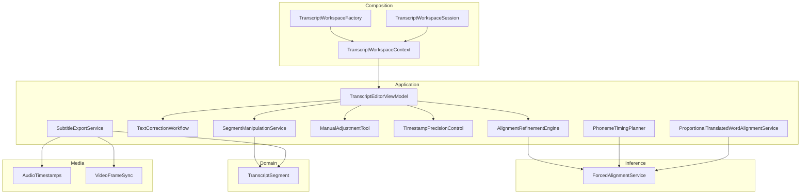

**Diagram sources**
- [TranscriptWorkspaceContext.cs](file://src/Trackdub.Composition/TranscriptWorkspaceContext.cs)
- [TranscriptWorkspaceFactory.cs](file://src/Trackdub.Composition/TranscriptWorkspaceFactory.cs)
- [TranscriptWorkspaceSession.cs](file://src/Trackdub.Composition/TranscriptWorkspaceSession.cs)
- [TranscriptEditorViewModel.cs](file://src/Trackdub.Application/Transcripts/TranscriptEditorViewModel.cs)
- [SegmentManipulationService.cs](file://src/Trackdub.Application/Transcripts/SegmentManipulationService.cs)
- [TextCorrectionWorkflow.cs](file://src/Trackdub.Application/Transcripts/TextCorrectionWorkflow.cs)
- [AlignmentRefinementEngine.cs](file://src/Trackdub.Application/Transcripts/AlignmentRefinementEngine.cs)
- [ManualAdjustmentTool.cs](file://src/Trackdub.Application/Transcripts/ManualAdjustmentTool.cs)
- [TimestampPrecisionControl.cs](file://src/Trackdub.Application/Transcripts/TimestampPrecisionControl.cs)
- [PhonemeTimingPlanner.cs](file://src/Trackdub.Application/Transcripts/PhonemeTimingPlanner.cs)
- [ProportionalTranslatedWordAlignmentService.cs](file://src/Trackdub.Application/Transcripts/ProportionalTranslatedWordAlignmentService.cs)
- [SubtitleExportService.cs](file://src/Trackdub.Application/Export/SubtitleExportService.cs)
- [ForcedAlignmentService.cs](file://src/Trackdub.Inference.Onnx/ForcedAlignment/ForcedAlignmentService.cs)
- [TranscriptSegment.cs](file://src/Trackdub.Domain/Transcript/TranscriptSegment.cs)
- [AudioTimestamps.cs](file://src/Trackdub.Media/Timing/AudioTimestamps.cs)
- [VideoFrameSync.cs](file://src/Trackdub.Media/Timing/VideoFrameSync.cs)

**Section sources**
- [TranscriptWorkspaceContext.cs](file://src/Trackdub.Composition/TranscriptWorkspaceContext.cs)
- [TranscriptWorkspaceFactory.cs](file://src/Trackdub.Composition/TranscriptWorkspaceFactory.cs)
- [TranscriptWorkspaceSession.cs](file://src/Trackdub.Composition/TranscriptWorkspaceSession.cs)
- [TranscriptEditorViewModel.cs](file://src/Trackdub.Application/Transcripts/TranscriptEditorViewModel.cs)
- [SegmentManipulationService.cs](file://src/Trackdub.Application/Transcripts/SegmentManipulationService.cs)
- [TextCorrectionWorkflow.cs](file://src/Trackdub.Application/Transcripts/TextCorrectionWorkflow.cs)
- [AlignmentRefinementEngine.cs](file://src/Trackdub.Application/Transcripts/AlignmentRefinementEngine.cs)
- [ManualAdjustmentTool.cs](file://src/Trackdub.Application/Transcripts/ManualAdjustmentTool.cs)
- [TimestampPrecisionControl.cs](file://src/Trackdub.Application/Transcripts/TimestampPrecisionControl.cs)
- [PhonemeTimingPlanner.cs](file://src/Trackdub.Application/Transcripts/PhonemeTimingPlanner.cs)
- [ProportionalTranslatedWordAlignmentService.cs](file://src/Trackdub.Application/Transcripts/ProportionalTranslatedWordAlignmentService.cs)
- [SubtitleExportService.cs](file://src/Trackdub.Application/Export/SubtitleExportService.cs)
- [ForcedAlignmentService.cs](file://src/Trackdub.Inference.Onnx/ForcedAlignment/ForcedAlignmentService.cs)
- [TranscriptSegment.cs](file://src/Trackdub.Domain/Transcript/TranscriptSegment.cs)
- [AudioTimestamps.cs](file://src/Trackdub.Media/Timing/AudioTimestamps.cs)
- [VideoFrameSync.cs](file://src/Trackdub.Media/Timing/VideoFrameSync.cs)

## Core Components
- Forced Alignment Engine: Aligns transcript text to audio at phoneme or word boundaries using acoustic modeling and dynamic time warping.
- Phoneme Timing Planner: Computes per-phoneme durations and refines segment timings based on linguistic cues.
- Frame-Level Sync: Converts audio timestamps to video frames using frame rate and sample rate conversions.
- Transcript Editor UI: Provides segment creation, splitting, merging, and text editing with live preview.
- Segment Manipulation Tools: Split, merge, trim, reorder, and adjust segment boundaries.
- Text Correction Workflow: Applies language-aware corrections and glossary terms while preserving alignment.
- Alignment Refinement: Iteratively improves alignment by re-running forced alignment on edited segments.
- Manual Adjustment Tool: Fine-grained boundary dragging with snap-to-events and confidence-based hints.
- Timestamp Precision Control: Configurable rounding and snapping to milliseconds or frames.

**Section sources**
- [ForcedAlignmentService.cs](file://src/Trackdub.Inference.Onnx/ForcedAlignment/ForcedAlignmentService.cs)
- [PhonemeTimingPlanner.cs](file://src/Trackdub.Application/Transcripts/PhonemeTimingPlanner.cs)
- [VideoFrameSync.cs](file://src/Trackdub.Media/Timing/VideoFrameSync.cs)
- [TranscriptEditorViewModel.cs](file://src/Trackdub.Application/Transcripts/TranscriptEditorViewModel.cs)
- [SegmentManipulationService.cs](file://src/Trackdub.Application/Transcripts/SegmentManipulationService.cs)
- [TextCorrectionWorkflow.cs](file://src/Trackdub.Application/Transcripts/TextCorrectionWorkflow.cs)
- [AlignmentRefinementEngine.cs](file://src/Trackdub.Application/Transcripts/AlignmentRefinementEngine.cs)
- [ManualAdjustmentTool.cs](file://src/Trackdub.Application/Transcripts/ManualAdjustmentTool.cs)
- [TimestampPrecisionControl.cs](file://src/Trackdub.Application/Transcripts/TimestampPrecisionControl.cs)

## Architecture Overview
The system composes a transcript workspace context that exposes services to the editor view model. The editor orchestrates segment manipulation, text correction, and alignment refinement. The forced alignment service performs the heavy lifting, while phoneme timing planning and proportional word alignment refine results. Export services convert aligned segments into standard subtitle formats and synchronize with video frames.

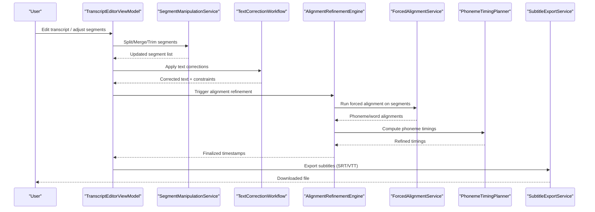

**Diagram sources**
- [TranscriptEditorViewModel.cs](file://src/Trackdub.Application/Transcripts/TranscriptEditorViewModel.cs)
- [SegmentManipulationService.cs](file://src/Trackdub.Application/Transcripts/SegmentManipulationService.cs)
- [TextCorrectionWorkflow.cs](file://src/Trackdub.Application/Transcripts/TextCorrectionWorkflow.cs)
- [AlignmentRefinementEngine.cs](file://src/Trackdub.Application/Transcripts/AlignmentRefinementEngine.cs)
- [ForcedAlignmentService.cs](file://src/Trackdub.Inference.Onnx/ForcedAlignment/ForcedAlignmentService.cs)
- [PhonemeTimingPlanner.cs](file://src/Trackdub.Application/Transcripts/PhonemeTimingPlanner.cs)
- [SubtitleExportService.cs](file://src/Trackdub.Application/Export/SubtitleExportService.cs)

## Detailed Component Analysis

### Forced Alignment Engine
The forced alignment engine maps transcript tokens to audio frames using acoustic models and dynamic programming. It supports word-level and phoneme-level segmentation and can be re-run on edited segments to maintain consistency.

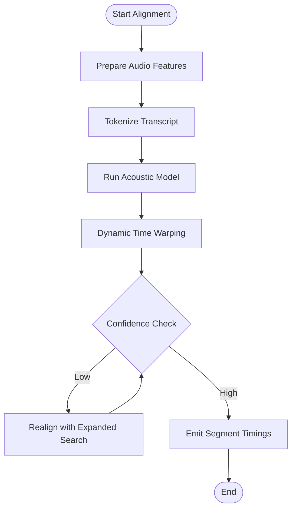

**Diagram sources**
- [ForcedAlignmentService.cs](file://src/Trackdub.Inference.Onnx/ForcedAlignment/ForcedAlignmentService.cs)

**Section sources**
- [ForcedAlignmentService.cs](file://src/Trackdub.Inference.Onnx/ForcedAlignment/ForcedAlignmentService.cs)

### Phoneme Timing Calculation
Phoneme timing planner computes per-phoneme durations and adjusts segment boundaries to respect linguistic constraints. It integrates with the forced alignment output to refine timings at a finer granularity.

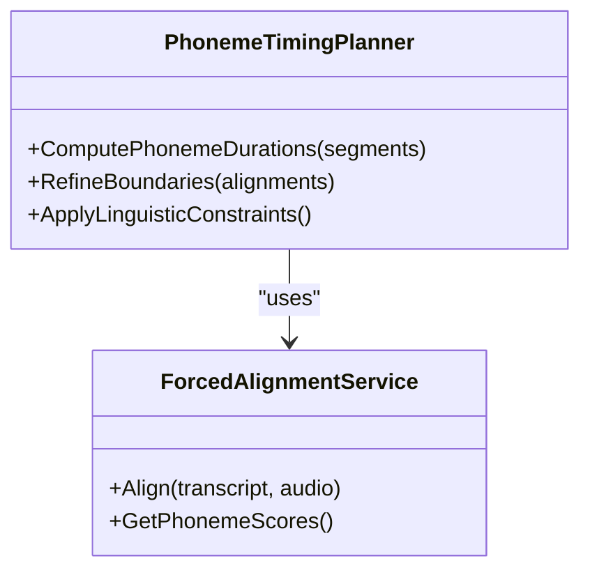

**Diagram sources**
- [PhonemeTimingPlanner.cs](file://src/Trackdub.Application/Transcripts/PhonemeTimingPlanner.cs)
- [ForcedAlignmentService.cs](file://src/Trackdub.Inference.Onnx/ForcedAlignment/ForcedAlignmentService.cs)

**Section sources**
- [PhonemeTimingPlanner.cs](file://src/Trackdub.Application/Transcripts/PhonemeTimingPlanner.cs)
- [ForcedAlignmentService.cs](file://src/Trackdub.Inference.Onnx/ForcedAlignment/ForcedAlignmentService.cs)

### Frame-Level Synchronization
Frame-level sync converts audio timestamps to video frames using frame rate and sample rate conversions. It ensures precise alignment between transcript segments and visual frames.

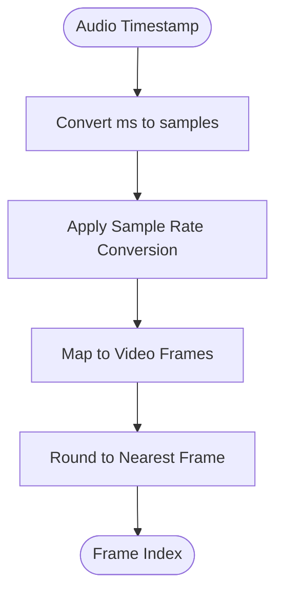

**Diagram sources**
- [VideoFrameSync.cs](file://src/Trackdub.Media/Timing/VideoFrameSync.cs)
- [AudioTimestamps.cs](file://src/Trackdub.Media/Timing/AudioTimestamps.cs)

**Section sources**
- [VideoFrameSync.cs](file://src/Trackdub.Media/Timing/VideoFrameSync.cs)
- [AudioTimestamps.cs](file://src/Trackdub.Media/Timing/AudioTimestamps.cs)

### Transcript Editing Interface
The editor view model provides an interactive interface for creating, editing, and managing transcript segments. It integrates with segment manipulation tools and text correction workflows.

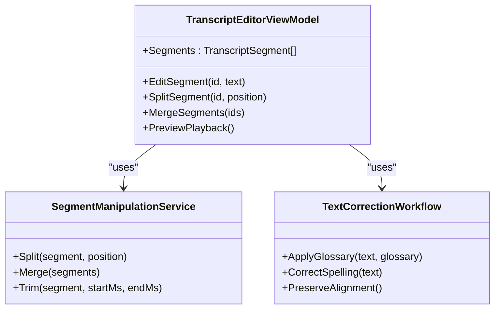

**Diagram sources**
- [TranscriptEditorViewModel.cs](file://src/Trackdub.Application/Transcripts/TranscriptEditorViewModel.cs)
- [SegmentManipulationService.cs](file://src/Trackdub.Application/Transcripts/SegmentManipulationService.cs)
- [TextCorrectionWorkflow.cs](file://src/Trackdub.Application/Transcripts/TextCorrectionWorkflow.cs)
- [TranscriptSegment.cs](file://src/Trackdub.Domain/Transcript/TranscriptSegment.cs)

**Section sources**
- [TranscriptEditorViewModel.cs](file://src/Trackdub.Application/Transcripts/TranscriptEditorViewModel.cs)
- [SegmentManipulationService.cs](file://src/Trackdub.Application/Transcripts/SegmentManipulationService.cs)
- [TextCorrectionWorkflow.cs](file://src/Trackdub.Application/Transcripts/TextCorrectionWorkflow.cs)
- [TranscriptSegment.cs](file://src/Trackdub.Domain/Transcript/TranscriptSegment.cs)

### Automatic Alignment Refinement
The alignment refinement engine iteratively improves alignment by re-running forced alignment on edited segments and applying phoneme timing adjustments.

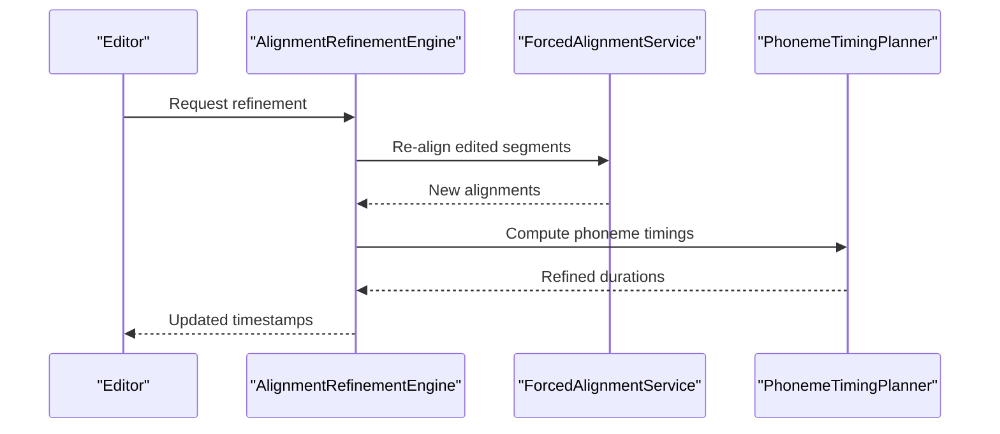

**Diagram sources**
- [AlignmentRefinementEngine.cs](file://src/Trackdub.Application/Transcripts/AlignmentRefinementEngine.cs)
- [ForcedAlignmentService.cs](file://src/Trackdub.Inference.Onnx/ForcedAlignment/ForcedAlignmentService.cs)
- [PhonemeTimingPlanner.cs](file://src/Trackdub.Application/Transcripts/PhonemeTimingPlanner.cs)

**Section sources**
- [AlignmentRefinementEngine.cs](file://src/Trackdub.Application/Transcripts/AlignmentRefinementEngine.cs)
- [ForcedAlignmentService.cs](file://src/Trackdub.Inference.Onnx/ForcedAlignment/ForcedAlignmentService.cs)
- [PhonemeTimingPlanner.cs](file://src/Trackdub.Application/Transcripts/PhonemeTimingPlanner.cs)

### Manual Adjustment Capabilities
The manual adjustment tool allows fine-grained boundary dragging with snap-to-events and confidence-based hints. It integrates with timestamp precision control for accurate adjustments.

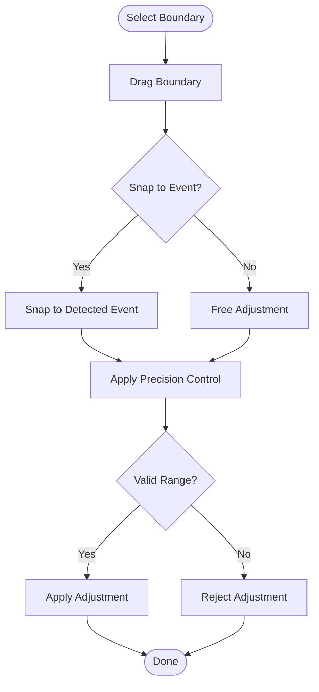

**Diagram sources**
- [ManualAdjustmentTool.cs](file://src/Trackdub.Application/Transcripts/ManualAdjustmentTool.cs)
- [TimestampPrecisionControl.cs](file://src/Trackdub.Application/Transcripts/TimestampPrecisionControl.cs)

**Section sources**
- [ManualAdjustmentTool.cs](file://src/Trackdub.Application/Transcripts/ManualAdjustmentTool.cs)
- [TimestampPrecisionControl.cs](file://src/Trackdub.Application/Transcripts/TimestampPrecisionControl.cs)

### Timestamp Precision Control
Timestamp precision control configures rounding and snapping to milliseconds or frames. It ensures consistent precision across all alignment operations.

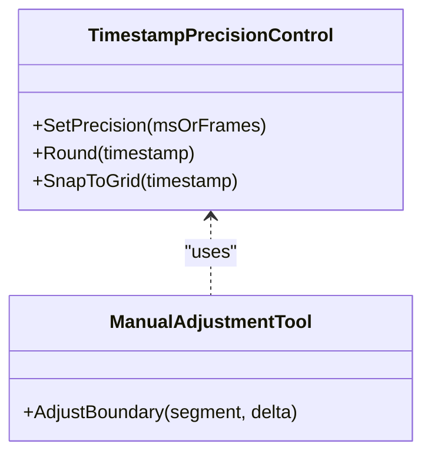

**Diagram sources**
- [TimestampPrecisionControl.cs](file://src/Trackdub.Application/Transcripts/TimestampPrecisionControl.cs)
- [ManualAdjustmentTool.cs](file://src/Trackdub.Application/Transcripts/ManualAdjustmentTool.cs)

**Section sources**
- [TimestampPrecisionControl.cs](file://src/Trackdub.Application/Transcripts/TimestampPrecisionControl.cs)
- [ManualAdjustmentTool.cs](file://src/Trackdub.Application/Transcripts/ManualAdjustmentTool.cs)

### Proportional Translated Word Alignment
The proportional translated word alignment service maintains alignment when translating text, ensuring that translated segments match the original timing structure.

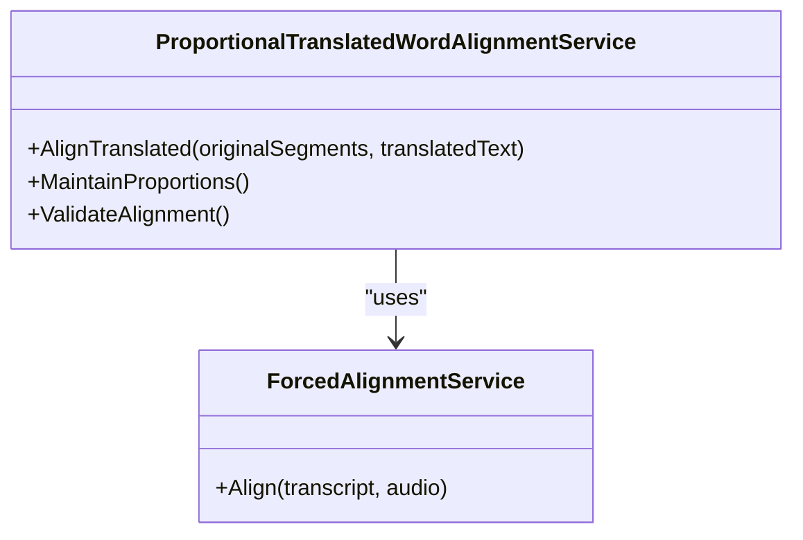

**Diagram sources**
- [ProportionalTranslatedWordAlignmentService.cs](file://src/Trackdub.Application/Transcripts/ProportionalTranslatedWordAlignmentService.cs)
- [ForcedAlignmentService.cs](file://src/Trackdub.Inference.Onnx/ForcedAlignment/ForcedAlignmentService.cs)

**Section sources**
- [ProportionalTranslatedWordAlignmentService.cs](file://src/Trackdub.Application/Transcripts/ProportionalTranslatedWordAlignmentService.cs)
- [ForcedAlignmentService.cs](file://src/Trackdub.Inference.Onnx/ForcedAlignment/ForcedAlignmentService.cs)

### Export Formats and Import Capabilities
The subtitle export service supports standard formats like SRT and VTT, with options for frame-level precision and metadata preservation. Import capabilities allow loading existing transcripts from common formats.

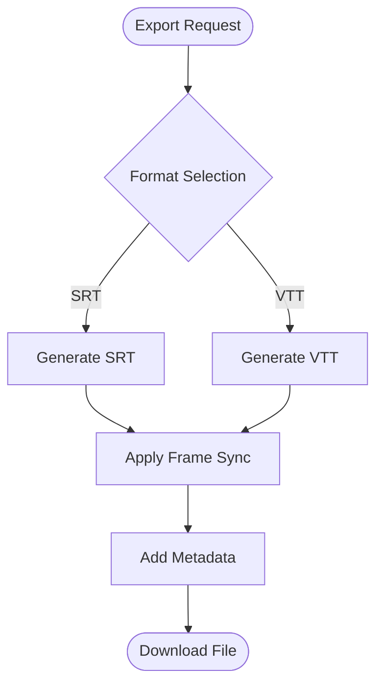

**Diagram sources**
- [SubtitleExportService.cs](file://src/Trackdub.Application/Export/SubtitleExportService.cs)
- [IExportServices.cs](file://src/Trackdub.Contracts/IExportServices.cs)
- [VideoFrameSync.cs](file://src/Trackdub.Media/Timing/VideoFrameSync.cs)

**Section sources**
- [SubtitleExportService.cs](file://src/Trackdub.Application/Export/SubtitleExportService.cs)
- [IExportServices.cs](file://src/Trackdub.Contracts/IExportServices.cs)
- [VideoFrameSync.cs](file://src/Trackdub.Media/Timing/VideoFrameSync.cs)

## Dependency Analysis
The transcript editing and alignment system has clear dependency relationships:
- Composition layer depends on contracts and provides workspace contexts.
- Application layer depends on domain entities and media utilities.
- Inference layer provides alignment services used by application components.
- Export services depend on timing utilities and domain models.

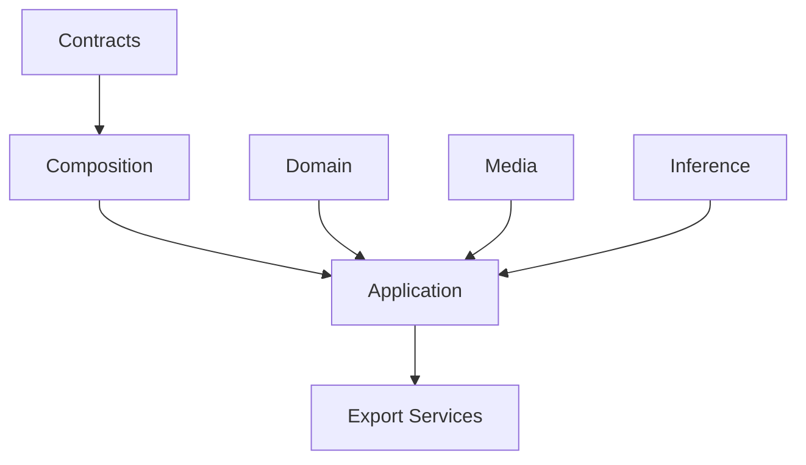

**Diagram sources**
- [ITranscriptWorkspaceContext.cs](file://src/Trackdub.Contracts/ITranscriptWorkspaceContext.cs)
- [TranscriptWorkspaceContext.cs](file://src/Trackdub.Composition/TranscriptWorkspaceContext.cs)
- [TranscriptSegment.cs](file://src/Trackdub.Domain/Transcript/TranscriptSegment.cs)
- [AudioTimestamps.cs](file://src/Trackdub.Media/Timing/AudioTimestamps.cs)
- [ForcedAlignmentService.cs](file://src/Trackdub.Inference.Onnx/ForcedAlignment/ForcedAlignmentService.cs)
- [SubtitleExportService.cs](file://src/Trackdub.Application/Export/SubtitleExportService.cs)

**Section sources**
- [ITranscriptWorkspaceContext.cs](file://src/Trackdub.Contracts/ITranscriptWorkspaceContext.cs)
- [TranscriptWorkspaceContext.cs](file://src/Trackdub.Composition/TranscriptWorkspaceContext.cs)
- [TranscriptSegment.cs](file://src/Trackdub.Domain/Transcript/TranscriptSegment.cs)
- [AudioTimestamps.cs](file://src/Trackdub.Media/Timing/AudioTimestamps.cs)
- [ForcedAlignmentService.cs](file://src/Trackdub.Inference.Onnx/ForcedAlignment/ForcedAlignmentService.cs)
- [SubtitleExportService.cs](file://src/Trackdub.Application/Export/SubtitleExportService.cs)

## Performance Considerations
- Forced alignment performance depends on audio length and model complexity; consider chunking long audio files.
- Phoneme timing calculations are CPU-intensive; parallel processing can improve throughput.
- Frame-level synchronization should use efficient conversions to avoid unnecessary recalculations.
- Export operations should batch subtitle generation for large projects.
- Memory usage increases with large transcripts; implement streaming where possible.

## Troubleshooting Guide
Common alignment issues and solutions:
- Poor alignment accuracy: Improve audio quality, reduce background noise, and ensure proper language model selection.
- Overlapping speech: Use speaker diarization before alignment and adjust search parameters.
- Background noise: Apply noise reduction preprocessing and increase confidence thresholds.
- Frame sync errors: Verify frame rate and sample rate settings match source media.
- Export format issues: Ensure timestamp precision matches target format requirements.

**Section sources**
- [ForcedAlignmentService.cs](file://src/Trackdub.Inference.Onnx/ForcedAlignment/ForcedAlignmentService.cs)
- [PhonemeTimingPlanner.cs](file://src/Trackdub.Application/Transcripts/PhonemeTimingPlanner.cs)
- [VideoFrameSync.cs](file://src/Trackdub.Media/Timing/VideoFrameSync.cs)
- [SubtitleExportService.cs](file://src/Trackdub.Application/Export/SubtitleExportService.cs)

## Conclusion
Trackdub’s transcript editing and alignment system provides a comprehensive solution for synchronizing text with audio and video. The forced alignment engine, phoneme timing planner, and frame-level synchronization work together to deliver precise alignments. The editing interface offers powerful tools for segment manipulation, text correction, and manual adjustments. With robust export capabilities and integration with external tools, it serves as a complete workflow for transcript editing and alignment tasks.

## Appendices
- Best practices for improving alignment accuracy
- Handling edge cases in speech recognition
- Integration guides for external editing tools
- Performance tuning recommendations