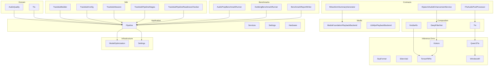
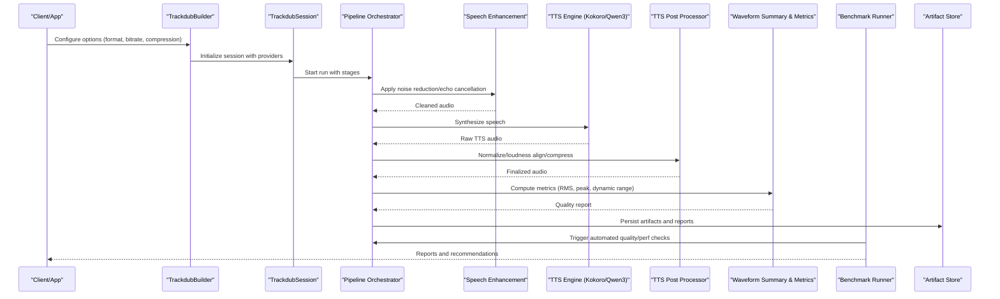
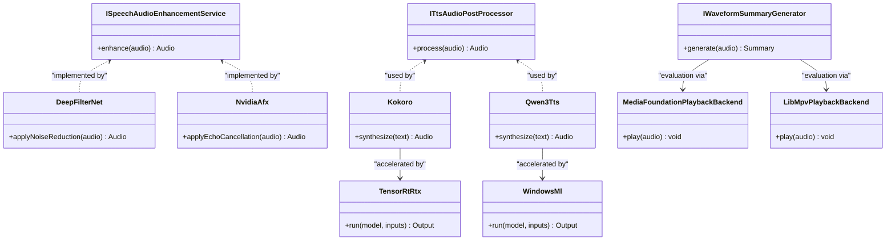

# Quality Optimization

<cite>
**Referenced Files in This Document**
- [ADR-0012-wave-pcm16-loudness-policy.md](file://docs/decisions/ADR-0012-wave-pcm16-loudness-policy.md)
- [ADR-0009-gpu-memory-budget-planner.md](file://docs/decisions/ADR-0009-gpu-memory-budget-planner.md)
- [Trackdub.Contracts.csproj](file://src/Trackdub.Contracts/Trackdub.Contracts.csproj)
- [ISpeechAudioEnhancementService.cs](file://src/Trackdub.Contracts/ISpeechAudioEnhancementService.cs)
- [ITtsAudioPostProcessor.cs](file://src/Trackdub.Contracts/ITtsAudioPostProcessor.cs)
- [IWaveformSummaryGenerator.cs](file://src/Trackdub.Contracts/IWaveformSummaryGenerator.cs)
- [AudioQuality](file://src/Trackdub.Domain/AudioQuality)
- [Tts](file://src/Trackdub.Domain/Tts)
- [DeepFilterNet](file://src/Trackdub.Composition/DeepFilterNet)
- [NvidiaAfx](file://src/Trackdub.Composition/NvidiaAfx)
- [Tts](file://src/Trackdub.Composition/Tts)
- [Kokoro](file://src/Trackdub.Inference.Onnx/Kokoro)
- [Qwen3Tts](file://src/Trackdub.Inference.Onnx/Qwen3Tts)
- [SepFormer](file://src/Trackdub.Inference.Onnx/SepFormer)
- [SileroVad](file://src/Trackdub.Inference.Onnx/SileroVad)
- [TensorRtRtx](file://src/Trackdub.Inference.Onnx/TensorRtRtx)
- [WindowsMl](file://src/Trackdub.Inference.Onnx/WindowsMl)
- [MediaFoundationPlaybackBackend.cs](file://src/Trackdub.Media.Playback/MediaFoundationPlaybackBackend.cs)
- [LibMpvPlaybackBackend.cs](file://src/Trackdub.Media.Playback/LibMpvPlaybackBackend.cs)
- [Trackdub.Media.csproj](file://src/Trackdub.Media/Trackdub.Media.csproj)
- [Trackdub.Benchmarks.csproj](file://src/Trackdub.Benchmarks/Trackdub.Benchmarks.csproj)
- [AudioPrepBenchmarkRunner.cs](file://src/Trackdub.Benchmarks/AudioPrepBenchmarkRunner.cs)
- [DubbingBenchmarkRunner.cs](file://src/Trackdub.Benchmarks/DubbingBenchmarkRunner.cs)
- [BenchmarkReportWriter.cs](file://src/Trackdub.Benchmarks/BenchmarkReportWriter.cs)
- [Trackdub.Application.csproj](file://src/Trackdub.Application/Trackdub.Application.csproj)
- [Pipeline](file://src/Trackdub.Application/Pipeline)
- [Services](file://src/Trackdub.Application/Services)
- [Settings](file://src/Trackdub.Application/Settings)
- [Hardware](file://src/Trackdub.Application/Hardware)
- [Trackdub.Infrastructure.csproj](file://src/Trackdub.Infrastructure/Trackdub.Infrastructure.csproj)
- [ModelOptimization](file://src/Trackdub.Infrastructure/ModelOptimization)
- [Settings](file://src/Trackdub.Infrastructure/Settings)
- [Trackdub.Sdk.csproj](file://src/Trackdub.Sdk/Trackdub.Sdk.csproj)
- [TrackdubBuilder.cs](file://src/Trackdub.Sdk/TrackdubBuilder.cs)
- [TrackdubConfig.cs](file://src/Trackdub.Sdk/TrackdubConfig.cs)
- [TrackdubSession.cs](file://src/Trackdub.Sdk/TrackdubSession.cs)
- [TrackdubPipelineStages.cs](file://src/Trackdub.Sdk/TrackdubPipelineStages.cs)
- [TrackdubPipelineReadinessChecker.cs](file://src/Trackdub.Sdk/TrackdubPipelineReadinessChecker.cs)
</cite>

## Table of Contents
1. Introduction
2. Project Structure
3. Core Components
4. Architecture Overview
5. Detailed Component Analysis
6. Dependency Analysis
7. Performance Considerations
8. Troubleshooting Guide
9. Conclusion

## Introduction
This document provides comprehensive guidance for optimizing TTS audio quality within Trackdub. It covers audio format selection, bitrate and compression settings, noise reduction, echo cancellation, enhancement techniques, quality assessment metrics, automated checks, manual evaluation methods, GPU acceleration, memory optimization, real-time processing considerations, balancing quality versus performance, adaptive quality scaling, platform-specific optimizations, artifact detection, troubleshooting, and post-processing workflows. The content is grounded in the repository’s architecture, contracts, inference modules, and benchmarking tools.

## Project Structure
Trackdub organizes TTS and audio quality features across several layers:
- Contracts define interfaces for speech enhancement, TTS post-processing, and waveform analysis.
- Domain models encapsulate TTS-related entities and audio quality concepts.
- Composition wires inference providers (e.g., DeepFilterNet, Nvidia AFX, Kokoro, Qwen3 TTS).
- Inference modules implement TTS engines, voice activity detection, separation, and execution providers.
- Media layer handles playback backends and media processing.
- Application and Infrastructure layers provide pipeline orchestration, model optimization, and settings.
- Sdk exposes configuration and session management for programmatic control.
- Benchmarks enable automated quality and performance measurement.

**Diagram sources**
- [ISpeechAudioEnhancementService.cs](file://src/Trackdub.Contracts/ISpeechAudioEnhancementService.cs)
- [ITtsAudioPostProcessor.cs](file://src/Trackdub.Contracts/ITtsAudioPostProcessor.cs)
- [IWaveformSummaryGenerator.cs](file://src/Trackdub.Contracts/IWaveformSummaryGenerator.cs)
- [AudioQuality](file://src/Trackdub.Domain/AudioQuality)
- [Tts](file://src/Trackdub.Domain/Tts)
- [DeepFilterNet](file://src/Trackdub.Composition/DeepFilterNet)
- [NvidiaAfx](file://src/Trackdub.Composition/NvidiaAfx)
- [Tts](file://src/Trackdub.Composition/Tts)
- [Kokoro](file://src/Trackdub.Inference.Onnx/Kokoro)
- [Qwen3Tts](file://src/Trackdub.Inference.Onnx/Qwen3Tts)
- [SepFormer](file://src/Trackdub.Inference.Onnx/SepFormer)
- [SileroVad](file://src/Trackdub.Inference.Onnx/SileroVad)
- [TensorRtRtx](file://src/Trackdub.Inference.Onnx/TensorRtRtx)
- [WindowsMl](file://src/Trackdub.Inference.Onnx/WindowsMl)
- [MediaFoundationPlaybackBackend.cs](file://src/Trackdub.Media.Playback/MediaFoundationPlaybackBackend.cs)
- [LibMpvPlaybackBackend.cs](file://src/Trackdub.Media.Playback/LibMpvPlaybackBackend.cs)
- [Pipeline](file://src/Trackdub.Application/Pipeline)
- [Services](file://src/Trackdub.Application/Services)
- [Settings](file://src/Trackdub.Application/Settings)
- [Hardware](file://src/Trackdub.Application/Hardware)
- [ModelOptimization](file://src/Trackdub.Infrastructure/ModelOptimization)
- [Settings](file://src/Trackdub.Infrastructure/Settings)
- [TrackdubBuilder.cs](file://src/Trackdub.Sdk/TrackdubBuilder.cs)
- [TrackdubConfig.cs](file://src/Trackdub.Sdk/TrackdubConfig.cs)
- [TrackdubSession.cs](file://src/Trackdub.Sdk/TrackdubSession.cs)
- [TrackdubPipelineStages.cs](file://src/Trackdub.Sdk/TrackdubPipelineStages.cs)
- [TrackdubPipelineReadinessChecker.cs](file://src/Trackdub.Sdk/TrackdubPipelineReadinessChecker.cs)
- [AudioPrepBenchmarkRunner.cs](file://src/Trackdub.Benchmarks/AudioPrepBenchmarkRunner.cs)
- [DubbingBenchmarkRunner.cs](file://src/Trackdub.Benchmarks/DubbingBenchmarkRunner.cs)
- [BenchmarkReportWriter.cs](file://src/Trackdub.Benchmarks/BenchmarkReportWriter.cs)

**Section sources**
- [Trackdub.Contracts.csproj](file://src/Trackdub.Contracts/Trackdub.Contracts.csproj)
- [Trackdub.Media.csproj](file://src/Trackdub.Media/Trackdub.Media.csproj)
- [Trackdub.Benchmarks.csproj](file://src/Trackdub.Benchmarks/Trackdub.Benchmarks.csproj)
- [Trackdub.Application.csproj](file://src/Trackdub.Application/Trackdub.Application.csproj)
- [Trackdub.Infrastructure.csproj](file://src/Trackdub.Infrastructure/Trackdub.Infrastructure.csproj)
- [Trackdub.Sdk.csproj](file://src/Trackdub.Sdk/Trackdub.Sdk.csproj)

## Core Components
- Speech Enhancement Service: Provides noise reduction and echo cancellation via composition providers (e.g., DeepFilterNet, Nvidia AFX).
- TTS Audio Post Processor: Applies finalization steps such as normalization, loudness alignment, and optional compression.
- Waveform Summary Generator: Computes metrics like RMS, peak, dynamic range, and spectral summaries to support quality assessment.
- Playback Backends: Media Foundation and LibMpv backends ensure consistent playback across platforms for subjective evaluation.
- Benchmark Runners: Automated pipelines measure latency, throughput, and audio prep quality to guide optimization decisions.

Key responsibilities:
- Format selection and conversion to PCM16 WAV aligned with loudness policy.
- Bitrate and compression tuning based on target use cases (streaming vs archival).
- Noise reduction and echo cancellation integrated into the pipeline before TTS synthesis or after post-processing.
- Quality metrics computation and reporting for both automated checks and manual review.

**Section sources**
- [ISpeechAudioEnhancementService.cs](file://src/Trackdub.Contracts/ISpeechAudioEnhancementService.cs)
- [ITtsAudioPostProcessor.cs](file://src/Trackdub.Contracts/ITtsAudioPostProcessor.cs)
- [IWaveformSummaryGenerator.cs](file://src/Trackdub.Contracts/IWaveformSummaryGenerator.cs)
- [MediaFoundationPlaybackBackend.cs](file://src/Trackdub.Media.Playback/MediaFoundationPlaybackBackend.cs)
- [LibMpvPlaybackBackend.cs](file://src/Trackdub.Media.Playback/LibMpvPlaybackBackend.cs)
- [AudioPrepBenchmarkRunner.cs](file://src/Trackdub.Benchmarks/AudioPrepBenchmarkRunner.cs)
- [DubbingBenchmarkRunner.cs](file://src/Trackdub.Benchmarks/DubbingBenchmarkRunner.cs)

## Architecture Overview
The TTS quality optimization pipeline integrates enhancement, synthesis, and post-processing stages with hardware-aware execution providers and benchmarking feedback loops.

**Diagram sources**
- [TrackdubBuilder.cs](file://src/Trackdub.Sdk/TrackdubBuilder.cs)
- [TrackdubSession.cs](file://src/Trackdub.Sdk/TrackdubSession.cs)
- [TrackdubPipelineStages.cs](file://src/Trackdub.Sdk/TrackdubPipelineStages.cs)
- [ISpeechAudioEnhancementService.cs](file://src/Trackdub.Contracts/ISpeechAudioEnhancementService.cs)
- [ITtsAudioPostProcessor.cs](file://src/Trackdub.Contracts/ITtsAudioPostProcessor.cs)
- [IWaveformSummaryGenerator.cs](file://src/Trackdub.Contracts/IWaveformSummaryGenerator.cs)
- [Kokoro](file://src/Trackdub.Inference.Onnx/Kokoro)
- [Qwen3Tts](file://src/Trackdub.Inference.Onnx/Qwen3Tts)
- [AudioPrepBenchmarkRunner.cs](file://src/Trackdub.Benchmarks/AudioPrepBenchmarkRunner.cs)
- [DubbingBenchmarkRunner.cs](file://src/Trackdub.Benchmarks/DubbingBenchmarkRunner.cs)

## Detailed Component Analysis

### Audio Format Selection and Loudness Policy
- PCM16 WAV is the canonical internal format for consistency and loudness alignment.
- Loudness targets are enforced to ensure perceptual uniformity across outputs.
- Conversion pipelines maintain bit depth and sample rate integrity where required.

Recommendations:
- Use PCM16 WAV for intermediate artifacts; convert to target formats only at export.
- Enforce loudness normalization early to avoid clipping during subsequent processing.

**Section sources**
- [ADR-0012-wave-pcm16-loudness-policy.md](file://docs/decisions/ADR-0012-wave-pcm16-loudness-policy.md)

### Bitrate and Compression Settings
- Choose lossless PCM16 for archival and editing; apply controlled compression for distribution.
- For streaming or constrained bandwidth, select appropriate codecs and bitrates balancing clarity and size.
- Avoid over-compression that introduces audible artifacts; validate with metrics and listening tests.

Guidelines:
- Set target bitrate based on use case (e.g., higher for studio, lower for mobile).
- Monitor spectral artifacts and transient smearing when adjusting compression parameters.

**Section sources**
- [ITtsAudioPostProcessor.cs](file://src/Trackdub.Contracts/ITtsAudioPostProcessor.cs)

### Noise Reduction and Echo Cancellation
- Integrate DeepFilterNet or Nvidia AFX for robust noise suppression and echo cancellation.
- Tune thresholds to preserve speech naturalness while reducing background interference.
- Validate improvements using objective metrics and subjective listening.

Best practices:
- Apply enhancement before TTS synthesis if input contains noise; otherwise, apply post-synthesis cleanup.
- Use VAD to gate processing and reduce unnecessary operations.

**Section sources**
- [ISpeechAudioEnhancementService.cs](file://src/Trackdub.Contracts/ISpeechAudioEnhancementService.cs)
- [DeepFilterNet](file://src/Trackdub.Composition/DeepFilterNet)
- [NvidiaAfx](file://src/Trackdub.Composition/NvidiaAfx)
- [SileroVad](file://src/Trackdub.Inference.Onnx/SileroVad)

### TTS Engines and Post-Processing
- Kokoro and Qwen3 TTS engines produce raw speech; post-processing normalizes levels and applies optional compression.
- Ensure sample rate and channel layout compatibility across engines and backends.
- Use waveform summaries to detect anomalies (clipping, silence, excessive noise).

Workflow tips:
- Chain enhancement -> synthesis -> normalization -> compression -> validation.
- Cache engine warm-up results to reduce startup latency.

**Section sources**
- [Kokoro](file://src/Trackdub.Inference.Onnx/Kokoro)
- [Qwen3Tts](file://src/Trackdub.Inference.Onnx/Qwen3Tts)
- [ITtsAudioPostProcessor.cs](file://src/Trackdub.Contracts/ITtsAudioPostProcessor.cs)
- [IWaveformSummaryGenerator.cs](file://src/Trackdub.Contracts/IWaveformSummaryGenerator.cs)

### Quality Assessment Metrics and Automated Checks
- Compute RMS, peak amplitude, dynamic range, and spectral descriptors for objective evaluation.
- Use benchmark runners to automate latency, throughput, and quality checks across scenarios.
- Generate reports to track regressions and guide parameter tuning.

Automation strategy:
- Integrate metric thresholds into pipeline gates to fail fast on quality violations.
- Correlate performance metrics with quality scores to identify bottlenecks.

**Section sources**
- [IWaveformSummaryGenerator.cs](file://src/Trackdub.Contracts/IWaveformSummaryGenerator.cs)
- [AudioPrepBenchmarkRunner.cs](file://src/Trackdub.Benchmarks/AudioPrepBenchmarkRunner.cs)
- [DubbingBenchmarkRunner.cs](file://src/Trackdub.Benchmarks/DubbingBenchmarkRunner.cs)
- [BenchmarkReportWriter.cs](file://src/Trackdub.Benchmarks/BenchmarkReportWriter.cs)

### Manual Evaluation Methods
- Use playback backends (Media Foundation, LibMpv) for consistent subjective testing.
- Employ AB comparisons between enhanced and unenhanced outputs.
- Record listener feedback and correlate with objective metrics.

Evaluation checklist:
- Check for residual noise, echo tails, and unnatural prosody.
- Verify loudness consistency across segments and speakers.

**Section sources**
- [MediaFoundationPlaybackBackend.cs](file://src/Trackdub.Media.Playback/MediaFoundationPlaybackBackend.cs)
- [LibMpvPlaybackBackend.cs](file://src/Trackdub.Media.Playback/LibMpvPlaybackBackend.cs)

### GPU Acceleration and Memory Optimization
- Prefer TensorRT RTX and Windows ML execution providers for accelerated inference.
- Apply GPU memory budget planning to avoid OOM conditions under load.
- Quantize or optimize models where acceptable to reduce memory footprint.

Optimization tactics:
- Batch requests carefully to balance throughput and latency.
- Reuse sessions and warm up providers to minimize cold start overhead.

**Section sources**
- [TensorRtRtx](file://src/Trackdub.Inference.Onnx/TensorRtRtx)
- [WindowsMl](file://src/Trackdub.Inference.Onnx/WindowsMl)
- [ADR-0009-gpu-memory-budget-planner.md](file://docs/decisions/ADR-0009-gpu-memory-budget-planner.md)

### Real-Time Processing Considerations
- Minimize buffering and pipeline stages for low-latency paths.
- Use VAD to skip processing during silence and reduce CPU/GPU usage.
- Stream chunks where possible to improve responsiveness.

Real-time guidelines:
- Profile per-frame latency and adjust chunk sizes accordingly.
- Ensure thread safety and avoid blocking calls in hot paths.

**Section sources**
- [SileroVad](file://src/Trackdub.Inference.Onnx/SileroVad)
- [TrackdubPipelineStages.cs](file://src/Trackdub.Sdk/TrackdubPipelineStages.cs)

### Balancing Quality vs Performance
- Trade-off curves can be derived from benchmark reports correlating quality metrics with latency/throughput.
- Adaptive scaling adjusts enhancement intensity and compression aggressiveness based on device capabilities.

Balancing strategies:
- Lower enhancement complexity on constrained devices; prioritize clarity over noise suppression.
- Reduce post-processing steps for real-time modes; retain essential normalization.

**Section sources**
- [AudioPrepBenchmarkRunner.cs](file://src/Trackdub.Benchmarks/AudioPrepBenchmarkRunner.cs)
- [DubbingBenchmarkRunner.cs](file://src/Trackdub.Benchmarks/DubbingBenchmarkRunner.cs)

### Adaptive Quality Scaling
- Dynamically tune parameters (noise threshold, compression ratio) based on runtime telemetry.
- Use readiness checks to select optimal provider and fallbacks gracefully.

Adaptive approach:
- Monitor GPU/CPU utilization and memory pressure; scale down processing when needed.
- Adjust output format/bitrate according to network or storage constraints.

**Section sources**
- [TrackdubPipelineReadinessChecker.cs](file://src/Trackdub.Sdk/TrackdubPipelineReadinessChecker.cs)
- [TrackdubConfig.cs](file://src/Trackdub.Sdk/TrackdubConfig.cs)

### Platform-Specific Optimizations
- Windows: Leverage Media Foundation and Windows ML for native acceleration.
- Linux/macOS: Use LibMpv and optimized ONNX providers; consider OpenVINO or other EPs where available.

Platform tips:
- Validate codec availability and fallback chains per OS.
- Tune playback backend options for lowest latency and best fidelity.

**Section sources**
- [MediaFoundationPlaybackBackend.cs](file://src/Trackdub.Media.Playback/MediaFoundationPlaybackBackend.cs)
- [LibMpvPlaybackBackend.cs](file://src/Trackdub.Media.Playback/LibMpvPlaybackBackend.cs)
- [WindowsMl](file://src/Trackdub.Inference.Onnx/WindowsMl)

### Audio Artifact Detection
- Detect clipping by monitoring peak levels and headroom.
- Identify silence gaps or unexpected drops using RMS thresholds.
- Flag spectral anomalies indicating over-compression or poor enhancement.

Detection workflow:
- Compute summary metrics and compare against thresholds.
- Log warnings and trigger reprocessing or parameter adjustments.

**Section sources**
- [IWaveformSummaryGenerator.cs](file://src/Trackdub.Contracts/IWaveformSummaryGenerator.cs)

### Post-Processing Workflows
- Normalize amplitude, align loudness, and optionally compress for distribution.
- Apply final validation before persisting artifacts.
- Maintain provenance metadata for traceability.

Workflow steps:
- Input cleaned/synthesized audio -> normalize -> loudness align -> compress -> validate -> store.

**Section sources**
- [ITtsAudioPostProcessor.cs](file://src/Trackdub.Contracts/ITtsAudioPostProcessor.cs)

## Dependency Analysis
Trackdub’s TTS quality optimization depends on well-defined contracts, domain models, and inference providers. The following diagram highlights key dependencies among core components.

**Diagram sources**
- [ISpeechAudioEnhancementService.cs](file://src/Trackdub.Contracts/ISpeechAudioEnhancementService.cs)
- [ITtsAudioPostProcessor.cs](file://src/Trackdub.Contracts/ITtsAudioPostProcessor.cs)
- [IWaveformSummaryGenerator.cs](file://src/Trackdub.Contracts/IWaveformSummaryGenerator.cs)
- [DeepFilterNet](file://src/Trackdub.Composition/DeepFilterNet)
- [NvidiaAfx](file://src/Trackdub.Composition/NvidiaAfx)
- [Kokoro](file://src/Trackdub.Inference.Onnx/Kokoro)
- [Qwen3Tts](file://src/Trackdub.Inference.Onnx/Qwen3Tts)
- [TensorRtRtx](file://src/Trackdub.Inference.Onnx/TensorRtRtx)
- [WindowsMl](file://src/Trackdub.Inference.Onnx/WindowsMl)
- [MediaFoundationPlaybackBackend.cs](file://src/Trackdub.Media.Playback/MediaFoundationPlaybackBackend.cs)
- [LibMpvPlaybackBackend.cs](file://src/Trackdub.Media.Playback/LibMpvPlaybackBackend.cs)

**Section sources**
- [Trackdub.Contracts.csproj](file://src/Trackdub.Contracts/Trackdub.Contracts.csproj)
- [Trackdub.Media.csproj](file://src/Trackdub.Media/Trackdub.Media.csproj)

## Performance Considerations
- Prioritize PCM16 WAV internally to simplify processing and ensure loudness consistency.
- Use hardware-accelerated execution providers to reduce inference latency.
- Implement adaptive scaling to maintain quality under resource constraints.
- Automate quality checks to catch regressions early and inform tuning.

[No sources needed since this section provides general guidance]

## Troubleshooting Guide
Common issues and resolutions:
- Excessive noise after enhancement: Lower suppression thresholds or switch providers.
- Audible artifacts post-compression: Reduce compression ratio or switch to less aggressive codecs.
- Clipping or distortion: Verify normalization and headroom; adjust gain staging.
- High latency: Optimize batch sizes, reuse sessions, and prefer GPU acceleration.
- Platform playback inconsistencies: Validate backend selection and codec availability.

Diagnostic steps:
- Inspect waveform summaries for anomalies.
- Review benchmark reports for performance regressions.
- Test with known-good inputs to isolate environment issues.

**Section sources**
- [IWaveformSummaryGenerator.cs](file://src/Trackdub.Contracts/IWaveformSummaryGenerator.cs)
- [AudioPrepBenchmarkRunner.cs](file://src/Trackdub.Benchmarks/AudioPrepBenchmarkRunner.cs)
- [DubbingBenchmarkRunner.cs](file://src/Trackdub.Benchmarks/DubbingBenchmarkRunner.cs)

## Conclusion
Trackdub’s TTS audio quality optimization leverages a modular architecture with clear contracts, robust inference providers, and comprehensive benchmarking. By adhering to the PCM16 WAV loudness policy, applying targeted enhancement and compression, and utilizing GPU acceleration with adaptive scaling, developers can achieve high-quality outputs while maintaining performance. Automated metrics and manual evaluation complement each other to ensure consistent, reliable TTS audio across platforms and use cases.

[No sources needed since this section summarizes without analyzing specific files]