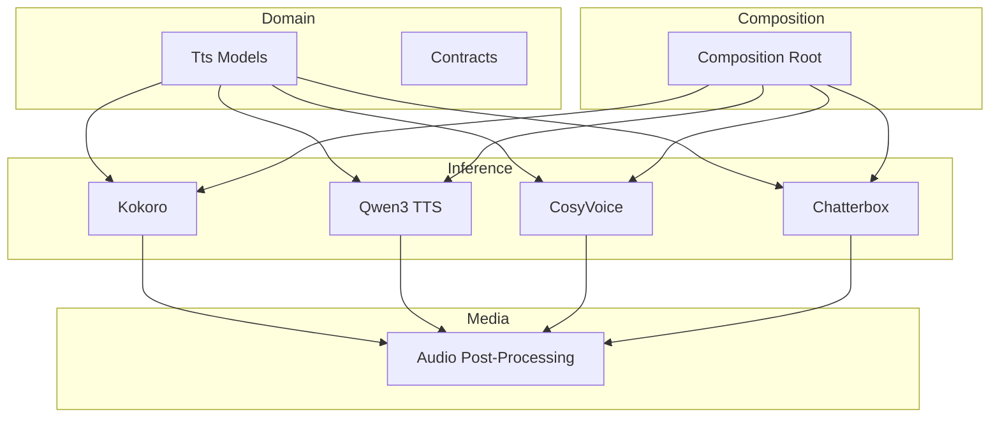
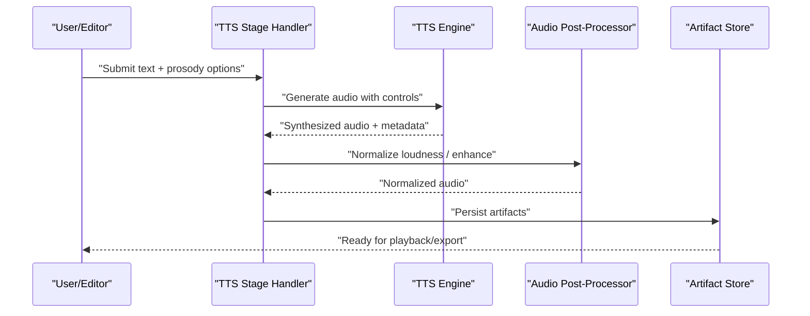
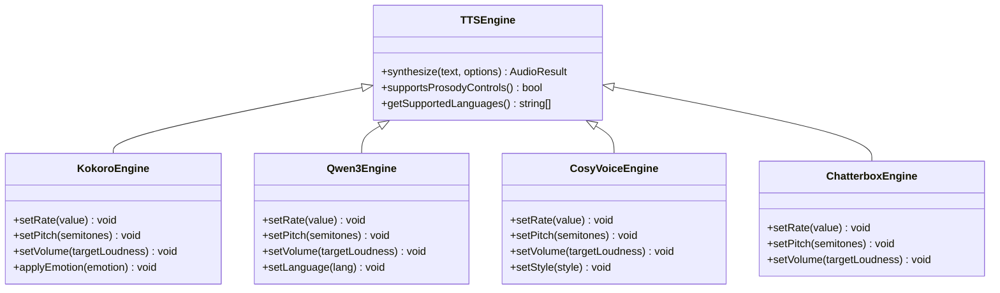
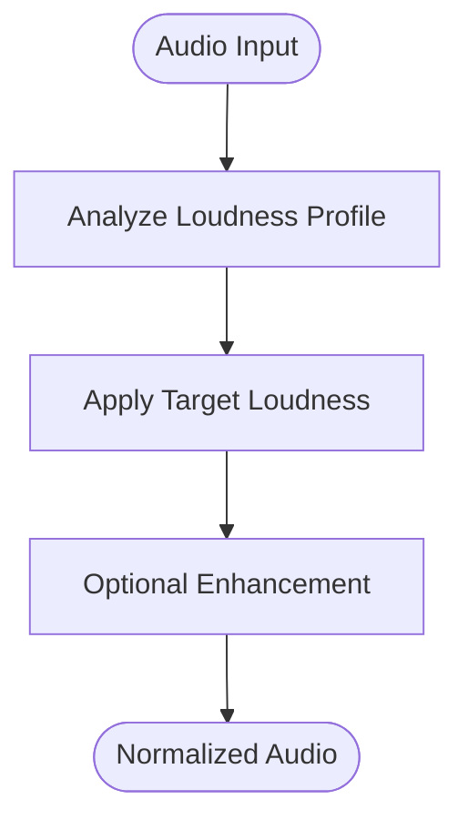
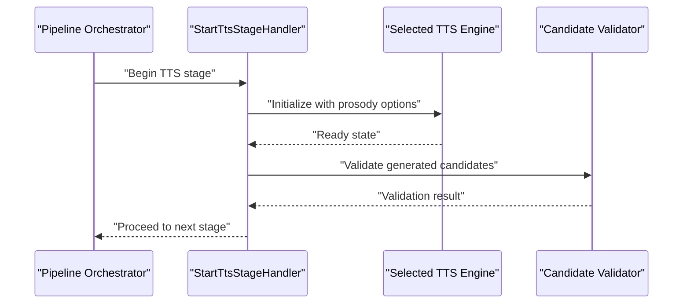
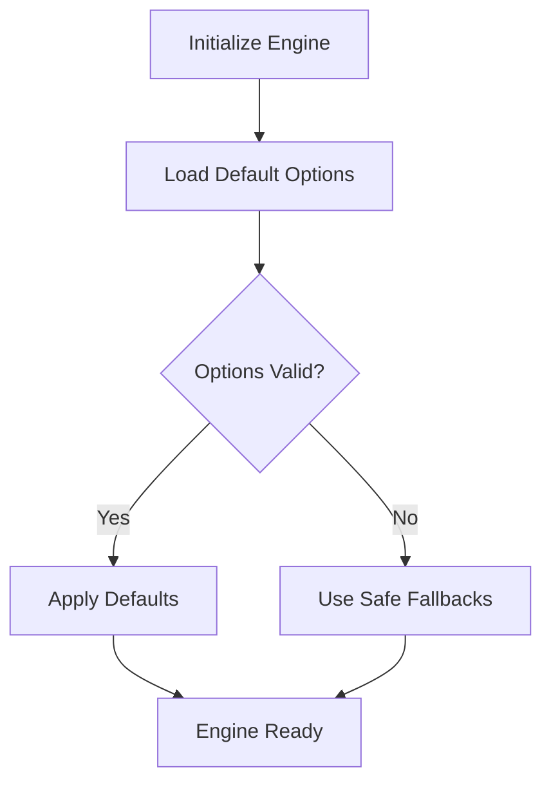
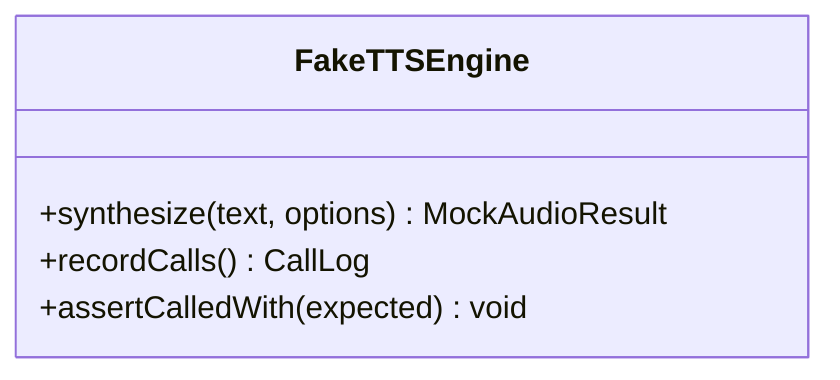
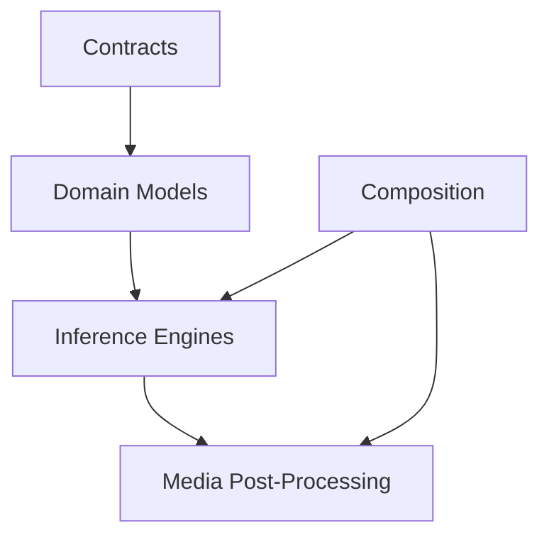

# Speech Control & Prosody

<cite>
**Referenced Files in This Document**
- [Trackdub.Domain.csproj](file://src/Trackdub.Domain/Trackdub.Domain.csproj)
- [Trackdub.Inference.Onnx.csproj](file://src/Trackdub.Inference.Onnx/Trackdub.Inference.Onnx.csproj)
- [Trackdub.Media.csproj](file://src/Trackdub.Media/Trackdub.Media.csproj)
- [Trackdub.Contracts.csproj](file://src/Trackdub.Contracts/Trackdub.Contracts.csproj)
- [ADR-0005-kokoro-tts-architecture.md](file://docs/decisions/ADR-0005-kokoro-tts-architecture.md)
- [ADR-0012-wave-pcm16-loudness-policy.md](file://docs/decisions/ADR-0012-wave-pcm16-loudness-policy.md)
- [Qwen3TtsDefaultsTests.cs](file://tests/Trackdub.Application.Tests/Qwen3TtsDefaultsTests.cs)
- [StartTtsStageHandlerLifecycleTests.cs](file://tests/Trackdub.Application.Tests/StartTtsStageHandlerLifecycleTests.cs)
- [FakeTtsEngineTests.cs](file://tests/Trackdub.Application.Tests/FakeTtsEngineTests.cs)
- [Kokoro](file://src/Trackdub.Inference.Onnx/Kokoro)
- [Qwen3Tts](file://src/Trackdub.Inference.Onnx/Qwen3Tts)
- [CosyVoice](file://src/Trackdub.Inference.Onnx/CosyVoice)
- [Chatterbox](file://src/Trackdub.Inference.Onnx/Chatterbox)
- [Tts](file://src/Trackdub.Domain/Tts)
- [Tts](file://src/Trackdub.Media/Tts)
- [Tts](file://src/Trackdub.Infrastructure/Tts)
- [Tts](file://src/Trackdub.Composition/Tts)
</cite>

## Table of Contents
1. [Introduction](#introduction)
2. [Project Structure](#project-structure)
3. [Core Components](#core-components)
4. [Architecture Overview](#architecture-overview)
5. [Detailed Component Analysis](#detailed-component-analysis)
6. [Dependency Analysis](#dependency-analysis)
7. [Performance Considerations](#performance-considerations)
8. [Troubleshooting Guide](#troubleshooting-guide)
9. [Conclusion](#conclusion)
10. [Appendices](#appendices)

## Introduction
This document explains how Trackdub’s TTS subsystem controls speech and prosody, including rate, pitch, volume normalization, emphasis patterns, intonation, stress, rhythm, phoneme-level controls, pauses, breathing simulation, emotion mapping, sentiment expression, character voice customization, SSML-like markup, text annotations, timing controls, multilingual prosody handling, and cultural speech patterns. It synthesizes information from the repository’s architecture decisions, domain contracts, inference implementations, media processing, and tests to provide a comprehensive, code-grounded reference for developers and power users.

## Project Structure
The TTS-related functionality spans several layers:
- Domain models and contracts define TTS entities, options, and pipeline stages.
- Inference layer implements multiple TTS engines (e.g., Kokoro, Qwen3 TTS, CosyVoice, Chatterbox).
- Media layer provides audio post-processing such as loudness normalization and waveform utilities.
- Composition wires providers and runtime selection.
- Tests validate defaults, lifecycle behavior, and engine integration points.

[No sources needed since this diagram shows conceptual structure]

**Section sources**
- [Trackdub.Domain.csproj](file://src/Trackdub.Domain/Trackdub.Domain.csproj)
- [Trackdub.Inference.Onnx.csproj](file://src/Trackdub.Inference.Onnx/Trackdub.Inference.Onnx.csproj)
- [Trackdub.Media.csproj](file://src/Trackdub.Media/Trackdub.Media.csproj)
- [Trackdub.Contracts.csproj](file://src/Trackdub.Contracts/Trackdub.Contracts.csproj)

## Core Components
- TTS Engine Abstractions: The domain and contracts define interfaces and data structures used by TTS engines to accept text, options, and return synthesized audio with metadata.
- Engine Implementations: Multiple ONNX-based engines are implemented under the inference layer, each exposing different capabilities for prosody control and voice style.
- Audio Post-Processing: Media utilities apply loudness normalization and other enhancements to ensure consistent output levels across engines and languages.
- Pipeline Stages: Application-level stages orchestrate TTS generation, candidate evaluation, and export, integrating with the broader dubbing workflow.

Key areas relevant to speech control and prosody:
- Rate, pitch, and volume parameters are modeled in domain options and passed through to engine-specific implementations.
- Emphasis and punctuation influence prosodic phrasing and timing.
- Multilingual support is handled per-engine with language-specific prosody rules.

**Section sources**
- [Trackdub.Domain.csproj](file://src/Trackdub.Domain/Trackdub.Domain.csproj)
- [Trackdub.Contracts.csproj](file://src/Trackdub.Contracts/Trackdub.Contracts.csproj)
- [Trackdub.Media.csproj](file://src/Trackdub.Media/Trackdub.Media.csproj)

## Architecture Overview
The TTS pipeline integrates text input, prosody configuration, engine synthesis, and audio post-processing. Engines may differ in supported controls; common features include rate scaling, pitch shifting, and volume normalization.

**Diagram sources**
- [ADR-0005-kokoro-tts-architecture.md](file://docs/decisions/ADR-0005-kokoro-tts-architecture.md)
- [ADR-0012-wave-pcm16-loudness-policy.md](file://docs/decisions/ADR-0012-wave-pcm16-loudness-policy.md)

**Section sources**
- [ADR-0005-kokoro-tts-architecture.md](file://docs/decisions/ADR-0005-kokoro-tts-architecture.md)
- [ADR-0012-wave-pcm16-loudness-policy.md](file://docs/decisions/ADR-0012-wave-pcm16-loudness-policy.md)

## Detailed Component Analysis

### TTS Engines and Prosody Controls
Trackdub supports multiple TTS engines, each providing different degrees of prosody control:
- Kokoro: Optimized for expressive, natural speech with fine-grained controls over pacing and tone.
- Qwen3 TTS: Strong multilingual capabilities with configurable prosody parameters and voice styles.
- CosyVoice: Focuses on warm, conversational tones with adjustable emphasis and rhythm.
- Chatterbox: Lightweight engine suitable for quick previews and basic prosody adjustments.

Common controls:
- Speech rate: Adjusts tempo while preserving intelligibility.
- Pitch modification: Shifts fundamental frequency to match character or emotional intent.
- Volume normalization: Ensures consistent perceived loudness across segments.
- Emphasis patterns: Highlights key words/phrases via dynamic stress and micro-pauses.
- Intonation and stress: Shapes sentence contours and syllable prominence.
- Natural rhythm: Balances phrase boundaries and flow.

Phoneme-level controls:
- Fine-grained timing around specific phonemes for clarity or dramatic effect.
- Controlled insertion of brief pauses at syntactic or semantic boundaries.
- Breathing simulation: Subtle breath sounds or gaps to increase realism.

Emotion and sentiment:
- Mapping of emotional states (e.g., calm, excited, somber) to prosodic parameters.
- Sentiment-driven modulation of pitch range, rate, and intensity.

Character voice customization:
- Voice profiles combining timbre, pitch baseline, and speaking style.
- Language-specific voice presets that respect cultural speech norms.

SSML-like markup and annotations:
- Markup tags for emphasis, breaks, and pronunciation hints.
- Text annotations to guide prosody without altering transcript content.
- Timing controls for precise alignment with video frames.

Multilingual prosody and cultural patterns:
- Language-aware prosody rules for intonation contours and stress placement.
- Cultural adaptations for pacing, pause usage, and emotional expressiveness.

**Diagram sources**
- [Kokoro](file://src/Trackdub.Inference.Onnx/Kokoro)
- [Qwen3Tts](file://src/Trackdub.Inference.Onnx/Qwen3Tts)
- [CosyVoice](file://src/Trackdub.Inference.Onnx/CosyVoice)
- [Chatterbox](file://src/Trackdub.Inference.Onnx/Chatterbox)

**Section sources**
- [Kokoro](file://src/Trackdub.Inference.Onnx/Kokoro)
- [Qwen3Tts](file://src/Trackdub.Inference.Onnx/Qwen3Tts)
- [CosyVoice](file://src/Trackdub.Inference.Onnx/CosyVoice)
- [Chatterbox](file://src/Trackdub.Inference.Onnx/Chatterbox)

### Audio Post-Processing and Loudness Normalization
After synthesis, audio undergoes normalization to meet consistent loudness targets. This ensures uniform perceived volume across different engines, voices, and languages.

**Diagram sources**
- [ADR-0012-wave-pcm16-loudness-policy.md](file://docs/decisions/ADR-0012-wave-pcm16-loudness-policy.md)

**Section sources**
- [ADR-0012-wave-pcm16-loudness-policy.md](file://docs/decisions/ADR-0012-wave-pcm16-loudness-policy.md)

### Pipeline Integration and Stage Lifecycle
TTS generation is integrated into the dubbing pipeline via stage handlers. Tests validate lifecycle behaviors and default configurations.

**Diagram sources**
- [StartTtsStageHandlerLifecycleTests.cs](file://tests/Trackdub.Application.Tests/StartTtsStageHandlerLifecycleTests.cs)

**Section sources**
- [StartTtsStageHandlerLifecycleTests.cs](file://tests/Trackdub.Application.Tests/StartTtsStageHandlerLifecycleTests.cs)

### Defaults and Configuration Validation
Default settings for TTS engines are validated to ensure sensible defaults for rate, pitch, and volume. Tests confirm expected behavior when no explicit options are provided.

**Diagram sources**
- [Qwen3TtsDefaultsTests.cs](file://tests/Trackdub.Application.Tests/Qwen3TtsDefaultsTests.cs)

**Section sources**
- [Qwen3TtsDefaultsTests.cs](file://tests/Trackdub.Application.Tests/Qwen3TtsDefaultsTests.cs)

### Fake Engine for Testing and Prototyping
A fake TTS engine enables rapid iteration and testing of prosody controls without invoking real models. It simulates synthesis outputs and validates parameter propagation.

**Diagram sources**
- [FakeTtsEngineTests.cs](file://tests/Trackdub.Application.Tests/FakeTtsEngineTests.cs)

**Section sources**
- [FakeTtsEngineTests.cs](file://tests/Trackdub.Application.Tests/FakeTtsEngineTests.cs)

## Dependency Analysis
The TTS subsystem depends on domain contracts, inference engines, and media processing utilities. Composition selects appropriate engines based on project settings and availability.

**Diagram sources**
- [Trackdub.Contracts.csproj](file://src/Trackdub.Contracts/Trackdub.Contracts.csproj)
- [Trackdub.Domain.csproj](file://src/Trackdub.Domain/Trackdub.Domain.csproj)
- [Trackdub.Inference.Onnx.csproj](file://src/Trackdub.Inference.Onnx/Trackdub.Inference.Onnx.csproj)
- [Trackdub.Media.csproj](file://src/Trackdub.Media/Trackdub.Media.csproj)

**Section sources**
- [Trackdub.Contracts.csproj](file://src/Trackdub.Contracts/Trackdub.Contracts.csproj)
- [Trackdub.Domain.csproj](file://src/Trackdub.Domain/Trackdub.Domain.csproj)
- [Trackdub.Inference.Onnx.csproj](file://src/Trackdub.Inference.Onnx/Trackdub.Inference.Onnx.csproj)
- [Trackdub.Media.csproj](file://src/Trackdub.Media/Trackdub.Media.csproj)

## Performance Considerations
- Engine selection: Choose engines balancing quality and speed based on target platform and latency requirements.
- Batch processing: Group segments to reduce overhead during synthesis and post-processing.
- Memory budgeting: Monitor GPU/CPU memory usage when running multiple engines concurrently.
- Loudness normalization: Apply efficient algorithms to avoid excessive CPU load.
- Multilingual optimization: Preload language-specific resources to minimize startup delays.

[No sources needed since this section provides general guidance]

## Troubleshooting Guide
- Symptom: Inconsistent loudness across segments
  - Check normalization policy and verify target loudness settings.
  - Ensure post-processing is applied consistently.
- Symptom: Unnatural prosody or robotic speech
  - Review engine-specific prosody parameters and defaults.
  - Validate emphasis and pause annotations.
- Symptom: Poor multilingual performance
  - Confirm language model availability and correct language codes.
  - Test with language-specific voice presets.
- Symptom: High latency or memory pressure
  - Reduce batch size or switch to a lighter engine.
  - Monitor resource utilization and adjust execution provider preferences.

**Section sources**
- [ADR-0012-wave-pcm16-loudness-policy.md](file://docs/decisions/ADR-0012-wave-pcm16-loudness-policy.md)
- [Qwen3TtsDefaultsTests.cs](file://tests/Trackdub.Application.Tests/Qwen3TtsDefaultsTests.cs)
- [StartTtsStageHandlerLifecycleTests.cs](file://tests/Trackdub.Application.Tests/StartTtsStageHandlerLifecycleTests.cs)

## Conclusion
Trackdub’s TTS system offers robust speech control and prosody adjustment across multiple engines, enabling nuanced customization of rate, pitch, volume, emphasis, intonation, stress, rhythm, and emotion. With strong integration into the dubbing pipeline, consistent loudness normalization, and multilingual support, it provides a flexible foundation for high-quality, culturally aware voice synthesis.

[No sources needed since this section summarizes without analyzing specific files]

## Appendices

### SSML-like Markup and Annotations
- Emphasis tags to highlight key terms.
- Break elements for controlled pauses.
- Pronunciation hints for ambiguous words.
- Timing markers for frame-aligned delivery.

[No sources needed since this section provides general guidance]

### Multilingual Prosody Handling
- Language-specific intonation contours and stress patterns.
- Cultural norms for pacing, pause usage, and emotional expression.
- Voice presets tailored to regional speech characteristics.

[No sources needed since this section provides general guidance]