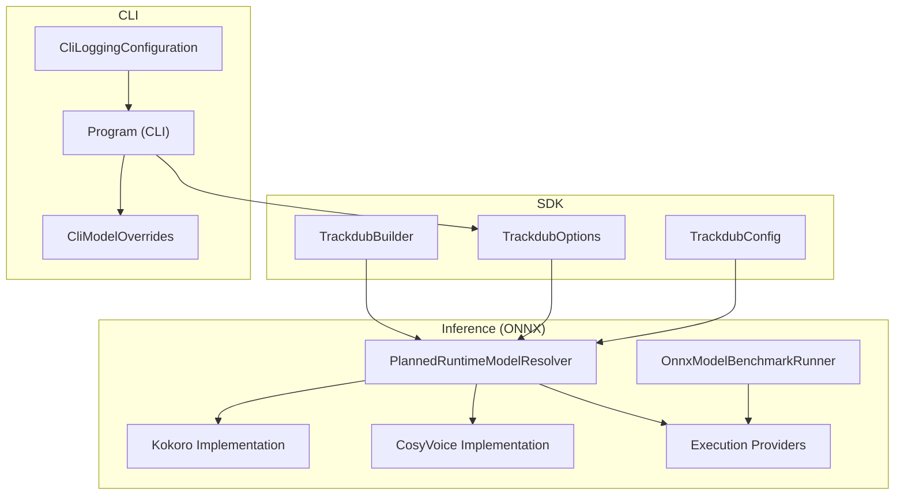
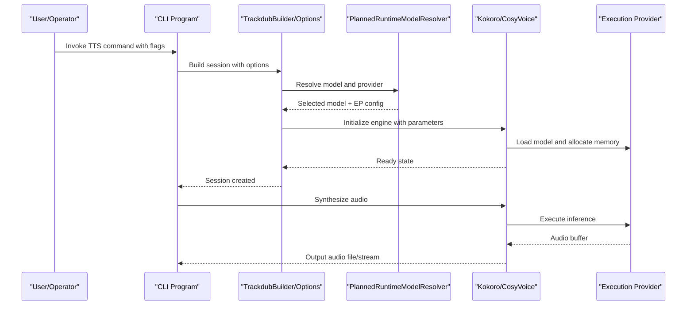
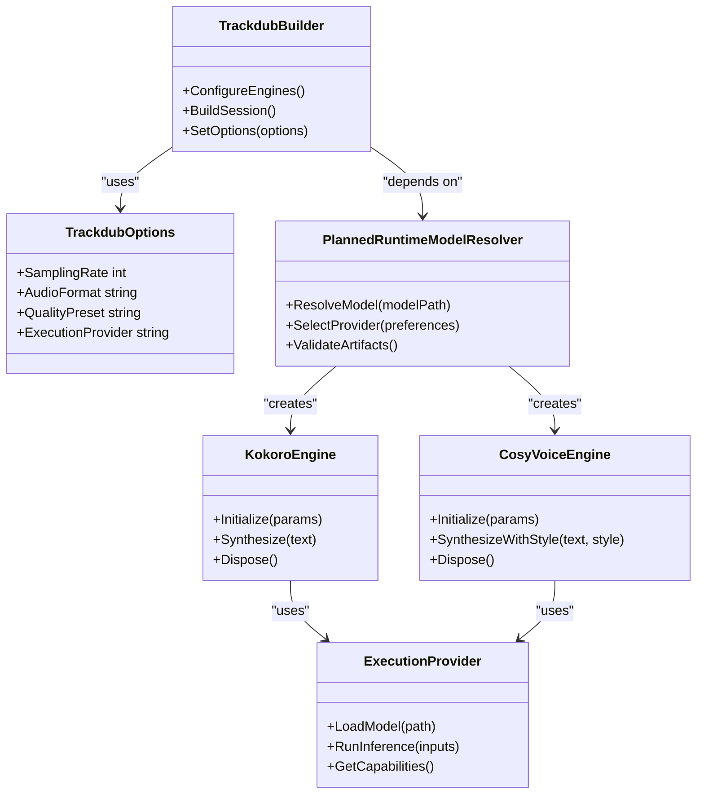

# TTS Engine Configuration

<cite>
**Referenced Files in This Document**
- [ADR-0005-kokoro-tts-architecture.md](file://docs/decisions/ADR-0005-kokoro-tts-architecture.md)
- [Trackdub.Inference.Onnx.csproj](file://src/Trackdub.Inference.Onnx/Trackdub.Inference.Onnx.csproj)
- [Kokoro directory](file://src/Trackdub.Inference.Onnx/Kokoro)
- [CosyVoice directory](file://src/Trackdub.Inference.Onnx/CosyVoice)
- [ExecutionProviders directory](file://src/Trackdub.Inference.Onnx/ExecutionProviders)
- [OnnxModelBenchmarkRunner.cs](file://src/Trackdub.Inference.Onnx/OnnxModelBenchmarkRunner.cs)
- [PlannedRuntimeModelResolver.cs](file://src/Trackdub.Inference.Onnx/PlannedRuntimeModelResolver.cs)
- [TrackdubBuilder.cs](file://src/Trackdub.Sdk/TrackdubBuilder.cs)
- [TrackdubOptions.cs](file://src/Trackdub.Sdk/TrackdubOptions.cs)
- [TrackdubConfig.cs](file://src/Trackdub.Sdk/TrackdubConfig.cs)
- [Program.cs (CLI)](file://src/Trackdub.Cli/Program.cs)
- [CliLoggingConfiguration.cs](file://src/Trackdub.Cli/CliLoggingConfiguration.cs)
- [CliModelOverrides.cs](file://src/Trackdub.Cli/CliModelOverrides.cs)
- [README.md (Inference Onnx)](file://src/Trackdub.Inference.Onnx/README.md)
</cite>

## Table of Contents
1. [Introduction](#introduction)
2. [Project Structure](#project-structure)
3. [Core Components](#core-components)
4. [Architecture Overview](#architecture-overview)
5. [Detailed Component Analysis](#detailed-component-analysis)
6. [Dependency Analysis](#dependency-analysis)
7. [Performance Considerations](#performance-considerations)
8. [Troubleshooting Guide](#troubleshooting-guide)
9. [Conclusion](#conclusion)
10. [Appendices](#appendices)

## Introduction
This document explains how to configure and operate Text-to-Speech (TTS) engines in Trackdub, with a focus on Kokoro and CosyVoice. It covers model loading, initialization parameters, runtime configuration, execution provider selection, engine-specific settings (sampling rates, audio formats, quality presets), configuration files, environment variables, command-line options, deployment scenarios, compatibility/version management, and fallback mechanisms. The goal is to enable both developers and operators to set up reliable TTS pipelines across development and production environments.

## Project Structure
Trackdub organizes TTS-related code under the Inference layer for ONNX-based models. Kokoro and CosyVoice implementations live in dedicated directories within the ONNX inference module. Execution providers and runtime resolution are centralized to support GPU acceleration and cross-platform deployments. SDK-level builders and options provide programmatic configuration, while CLI components expose command-line interfaces for operational use.

**Diagram sources**
- [TrackdubBuilder.cs](file://src/Trackdub.Sdk/TrackdubBuilder.cs)
- [TrackdubOptions.cs](file://src/Trackdub.Sdk/TrackdubOptions.cs)
- [TrackdubConfig.cs](file://src/Trackdub.Sdk/TrackdubConfig.cs)
- [PlannedRuntimeModelResolver.cs](file://src/Trackdub.Inference.Onnx/PlannedRuntimeModelResolver.cs)
- [OnnxModelBenchmarkRunner.cs](file://src/Trackdub.Inference.Onnx/OnnxModelBenchmarkRunner.cs)
- [Kokoro directory](file://src/Trackdub.Inference.Onnx/Kokoro)
- [CosyVoice directory](file://src/Trackdub.Inference.Onnx/CosyVoice)
- [ExecutionProviders directory](file://src/Trackdub.Inference.Onnx/ExecutionProviders)
- [Program.cs (CLI)](file://src/Trackdub.Cli/Program.cs)
- [CliLoggingConfiguration.cs](file://src/Trackdub.Cli/CliLoggingConfiguration.cs)
- [CliModelOverrides.cs](file://src/Trackdub.Cli/CliModelOverrides.cs)

**Section sources**
- [Trackdub.Inference.Onnx.csproj](file://src/Trackdub.Inference.Onnx/Trackdub.Inference.Onnx.csproj)
- [README.md (Inference Onnx)](file://src/Trackdub.Inference.Onnx/README.md)

## Core Components
- Kokoro TTS: ONNX-based implementation located under the Kokoro directory. Handles text normalization, phoneme processing, and audio synthesis according to its model specifications.
- CosyVoice TTS: ONNX-based implementation located under the CosyVoice directory. Supports voice cloning and style transfer features as defined by its model artifacts.
- Execution Providers: Centralized provider selection for CPU, CUDA, TensorRT-RTX, and other accelerators. Selection impacts performance and memory usage.
- Runtime Model Resolver: Determines which model variant and execution provider to load based on platform capabilities and configuration.
- SDK Builder and Options: Programmatic APIs to configure TTS engines, sampling rates, output formats, and quality presets.
- CLI Integration: Command-line entry points that translate user flags into runtime configuration and logging behavior.

Key responsibilities:
- Model discovery and validation
- Provider selection and initialization
- Audio format and sampling rate configuration
- Quality preset mapping
- Error handling and fallback strategies

**Section sources**
- [Kokoro directory](file://src/Trackdub.Inference.Onnx/Kokoro)
- [CosyVoice directory](file://src/Trackdub.Inference.Onnx/CosyVoice)
- [ExecutionProviders directory](file://src/Trackdub.Inference.Onnx/ExecutionProviders)
- [PlannedRuntimeModelResolver.cs](file://src/Trackdub.Inference.Onnx/PlannedRuntimeModelResolver.cs)
- [TrackdubBuilder.cs](file://src/Trackdub.Sdk/TrackdubBuilder.cs)
- [TrackdubOptions.cs](file://src/Trackdub.Sdk/TrackdubOptions.cs)

## Architecture Overview
The TTS architecture follows a layered approach:
- SDK Layer: Provides builder patterns and options for configuring engines programmatically.
- Inference Layer: Implements ONNX model execution with provider abstraction and benchmarking utilities.
- CLI Layer: Exposes commands to run TTS tasks with overrides and logging controls.

**Diagram sources**
- [Program.cs (CLI)](file://src/Trackdub.Cli/Program.cs)
- [TrackdubBuilder.cs](file://src/Trackdub.Sdk/TrackdubBuilder.cs)
- [TrackdubOptions.cs](file://src/Trackdub.Sdk/TrackdubOptions.cs)
- [PlannedRuntimeModelResolver.cs](file://src/Trackdub.Inference.Onnx/PlannedRuntimeModelResolver.cs)
- [Kokoro directory](file://src/Trackdub.Inference.Onnx/Kokoro)
- [CosyVoice directory](file://src/Trackdub.Inference.Onnx/CosyVoice)
- [ExecutionProviders directory](file://src/Trackdub.Inference.Onnx/ExecutionProviders)

## Detailed Component Analysis

### Kokoro TTS Engine
Kokoro implements an ONNX-based speech synthesis pipeline. Configuration includes:
- Model path and variant selection
- Sampling rate and audio format settings
- Quality presets affecting prosody and clarity
- Execution provider preference for CPU or GPU

Initialization steps:
- Validate model artifacts and metadata
- Configure audio I/O parameters
- Select execution provider based on availability
- Allocate memory buffers for inference

Runtime behavior:
- Text preprocessing and tokenization
- Phoneme-to-speech generation
- Post-processing for audio quality
- Error handling for invalid inputs or resource constraints

**Section sources**
- [Kokoro directory](file://src/Trackdub.Inference.Onnx/Kokoro)
- [PlannedRuntimeModelResolver.cs](file://src/Trackdub.Inference.Onnx/PlannedRuntimeModelResolver.cs)

### CosyVoice TTS Engine
CosyVoice provides advanced voice synthesis capabilities including voice cloning and style control. Configuration includes:
- Voice reference model paths
- Style transfer parameters
- Sampling rate and output format
- Quality presets for naturalness and clarity

Initialization steps:
- Load base voice model and reference embeddings
- Configure synthesis parameters
- Select optimal execution provider
- Prepare memory for large model artifacts

Runtime behavior:
- Embedding extraction from reference audio
- Style-aware text-to-speech generation
- Adaptive post-processing for voice consistency
- Graceful degradation when resources are limited

**Section sources**
- [CosyVoice directory](file://src/Trackdub.Inference.Onnx/CosyVoice)
- [PlannedRuntimeModelResolver.cs](file://src/Trackdub.Inference.Onnx/PlannedRuntimeModelResolver.cs)

### Execution Provider Selection
Provider selection determines where model inference runs:
- CPU: Universal compatibility, lower performance
- CUDA: NVIDIA GPU acceleration, requires drivers
- TensorRT-RTX: Optimized NVIDIA inference, best performance
- Other providers: Platform-specific optimizations

Selection logic:
- Check hardware capabilities and driver availability
- Apply user preferences from configuration
- Fall back to available providers if preferred ones fail
- Log provider selection decisions for debugging

**Section sources**
- [ExecutionProviders directory](file://src/Trackdub.Inference.Onnx/ExecutionProviders)
- [OnnxModelBenchmarkRunner.cs](file://src/Trackdub.Inference.Onnx/OnnxModelBenchmarkRunner.cs)

### SDK Configuration and Options
Programmatic configuration through SDK components:
- TrackdubBuilder: Constructs sessions with engine-specific settings
- TrackdubOptions: Defines runtime parameters like sampling rate, format, and quality
- TrackdubConfig: Manages persistent configuration and defaults

Key configuration areas:
- Engine selection (Kokoro vs CosyVoice)
- Model paths and version management
- Execution provider preferences
- Audio I/O settings and quality presets
- Logging and diagnostic options

**Section sources**
- [TrackdubBuilder.cs](file://src/Trackdub.Sdk/TrackdubBuilder.cs)
- [TrackdubOptions.cs](file://src/Trackdub.Sdk/TrackdubOptions.cs)
- [TrackdubConfig.cs](file://src/Trackdub.Sdk/TrackdubConfig.cs)

### CLI Integration and Command-Line Options
Command-line interface exposes TTS functionality:
- Program entry point handles argument parsing
- Logging configuration controls verbosity and output format
- Model overrides allow runtime specification of model paths and versions

Common commands:
- Synthesis commands with input text and output options
- Model validation and health checks
- Benchmarking and profiling tools
- Configuration management utilities

**Section sources**
- [Program.cs (CLI)](file://src/Trackdub.Cli/Program.cs)
- [CliLoggingConfiguration.cs](file://src/Trackdub.Cli/CliLoggingConfiguration.cs)
- [CliModelOverrides.cs](file://src/Trackdub.Cli/CliModelOverrides.cs)

## Dependency Analysis
TTS engine dependencies follow clear separation of concerns:
- Engine implementations depend only on ONNX runtime abstractions
- Provider selection is isolated from engine logic
- Configuration flows from SDK through resolver to engines
- CLI depends on SDK for programmatic access

**Diagram sources**
- [TrackdubBuilder.cs](file://src/Trackdub.Sdk/TrackdubBuilder.cs)
- [TrackdubOptions.cs](file://src/Trackdub.Sdk/TrackdubOptions.cs)
- [PlannedRuntimeModelResolver.cs](file://src/Trackdub.Inference.Onnx/PlannedRuntimeModelResolver.cs)
- [Kokoro directory](file://src/Trackdub.Inference.Onnx/Kokoro)
- [CosyVoice directory](file://src/Trackdub.Inference.Onnx/CosyVoice)
- [ExecutionProviders directory](file://src/Trackdub.Inference.Onnx/ExecutionProviders)

**Section sources**
- [Trackdub.Inference.Onnx.csproj](file://src/Trackdub.Inference.Onnx/Trackdub.Inference.Onnx.csproj)

## Performance Considerations
Optimization strategies for TTS engines:
- Use appropriate execution providers based on hardware capabilities
- Configure optimal batch sizes and memory allocation
- Leverage model quantization where supported
- Monitor GPU memory usage and implement cleanup strategies
- Profile synthesis latency and throughput for different configurations

Memory management:
- Implement proper disposal patterns for large model artifacts
- Use streaming for long audio generation
- Cache frequently used model components
- Monitor memory leaks during extended operation

**Section sources**
- [OnnxModelBenchmarkRunner.cs](file://src/Trackdub.Inference.Onnx/OnnxModelBenchmarkRunner.cs)
- [ExecutionProviders directory](file://src/Trackdub.Inference.Onnx/ExecutionProviders)

## Troubleshooting Guide
Common issues and solutions:
- Model loading failures: Verify model paths and artifact integrity
- Provider initialization errors: Check driver installation and permissions
- Memory allocation failures: Reduce model size or increase system memory
- Audio output problems: Validate format settings and codec availability
- Performance degradation: Profile provider selection and model optimization

Diagnostic tools:
- Enable detailed logging for engine initialization
- Use benchmarking utilities to identify bottlenecks
- Check hardware capability detection logs
- Validate model compatibility with runtime versions

**Section sources**
- [CliLoggingConfiguration.cs](file://src/Trackdub.Cli/CliLoggingConfiguration.cs)
- [OnnxModelBenchmarkRunner.cs](file://src/Trackdub.Inference.Onnx/OnnxModelBenchmarkRunner.cs)

## Conclusion
Trackdub's TTS engine configuration provides a flexible and robust framework for deploying Kokoro and CosyVoice engines across various environments. The modular architecture separates concerns between engine implementation, provider selection, and configuration management. By following the guidelines in this document, users can optimize performance, ensure compatibility, and maintain reliable operation in both development and production scenarios.

## Appendices

### Deployment Scenarios
Development environment:
- Use CPU execution provider for simplicity
- Enable verbose logging for debugging
- Utilize smaller model variants for faster iteration

Production environment:
- Deploy with GPU acceleration when available
- Implement proper resource monitoring and alerting
- Use optimized model builds and quantization
- Configure automatic fallback mechanisms

### Version Management
- Pin specific model versions for reproducibility
- Implement model validation and upgrade procedures
- Maintain backward compatibility layers
- Document breaking changes in model updates

### Fallback Mechanisms
- Automatic provider fallback when primary fails
- Graceful degradation to lower quality settings
- Retry logic for transient failures
- Circuit breaker patterns for resource exhaustion