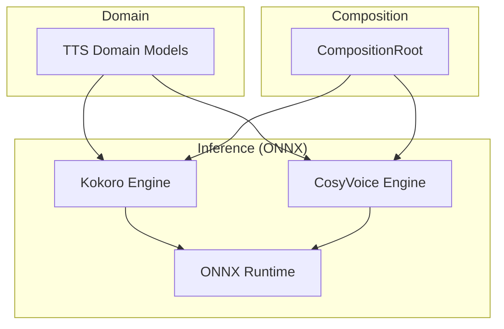
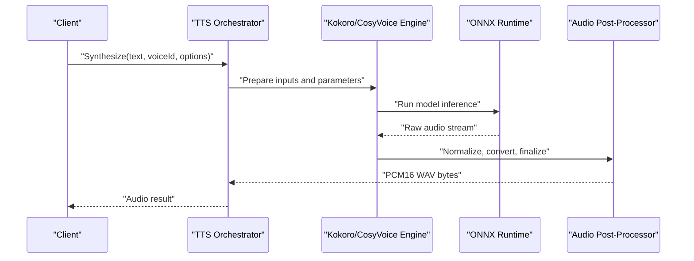
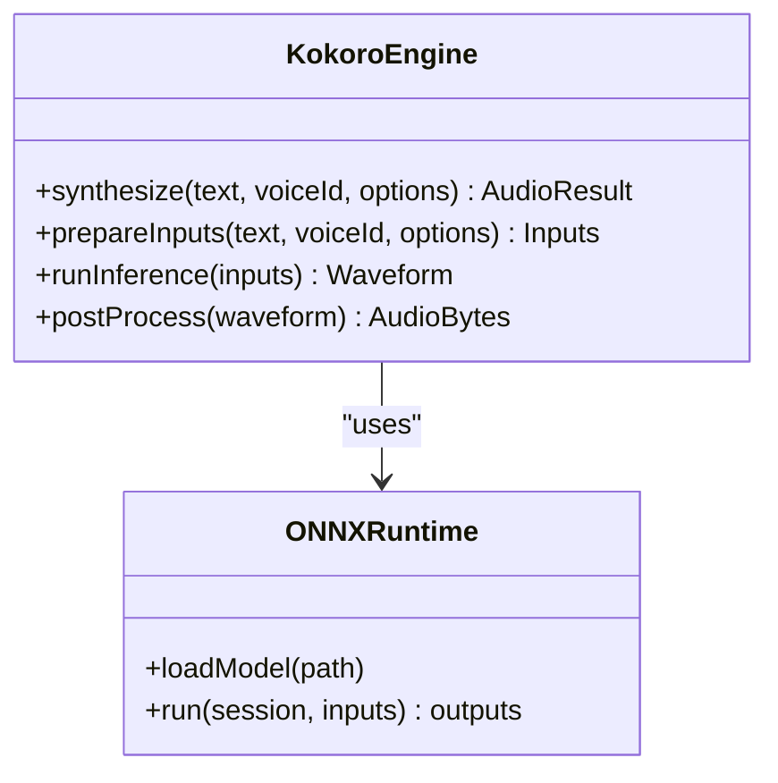
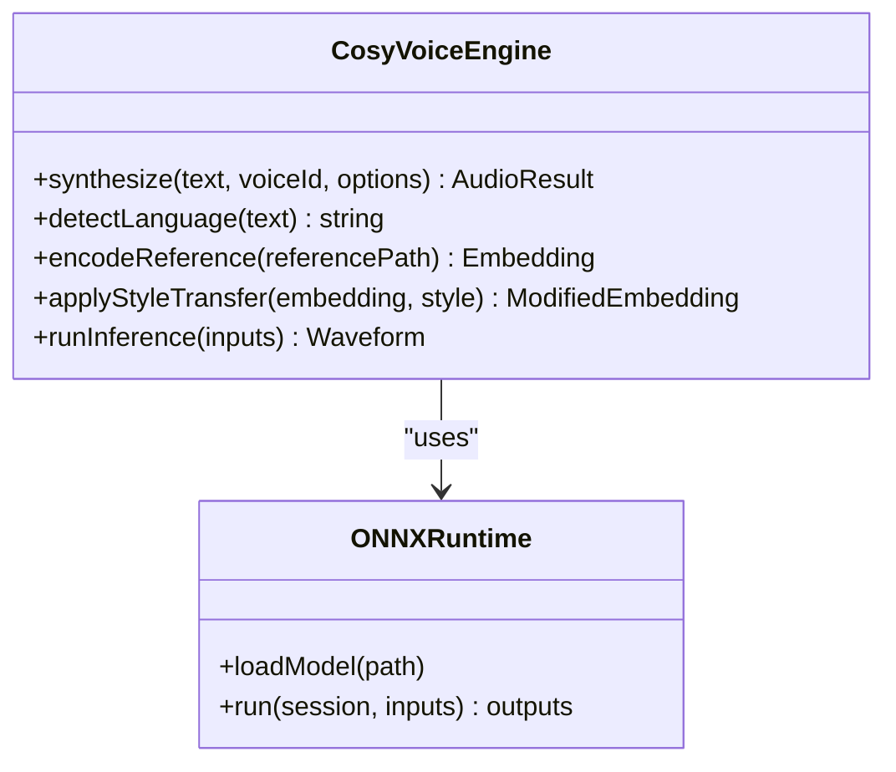
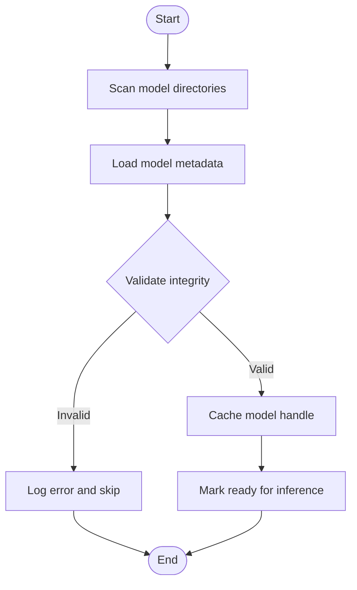
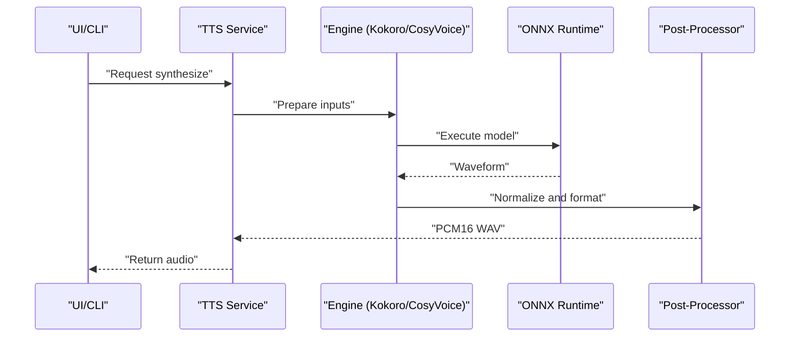
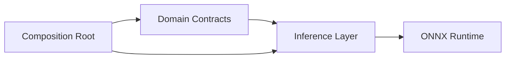

# Text-to-Speech Synthesis

<cite>
**Referenced Files in This Document**
- [ADR-0005-kokoro-tts-architecture.md](file://docs/decisions/ADR-0005-kokoro-tts-architecture.md)
- [ADR-0006-chatterbox-commercial-use-verification.md](file://docs/decisions/ADR-0006-chatterbox-commercial-use-verification.md)
- [ADR-0009-gpu-memory-budget-planner.md](file://docs/decisions/ADR-0009-gpu-memory-budget-planner.md)
- [ADR-0012-wave-pcm16-loudness-policy.md](file://docs/decisions/ADR-0012-wave-pcm16-loudness-policy.md)
- [Trackdub.Domain.csproj](file://src/Trackdub.Domain/Trackdub.Domain.csproj)
- [Trackdub.Inference.Onnx.csproj](file://src/Trackdub.Inference.Onnx/Trackdub.Inference.Onnx.csproj)
- [CompositionRoot.cs](file://src/Trackdub.Composition/CompositionRoot.cs)
- [Kokoro directory](file://src/Trackdub.Inference.Onnx/Kokoro)
- [CosyVoice directory](file://src/Trackdub.Inference.Onnx/CosyVoice)
</cite>

## Table of Contents
1. [Introduction](#introduction)
2. [Project Structure](#project-structure)
3. [Core Components](#core-components)
4. [Architecture Overview](#architecture-overview)
5. [Detailed Component Analysis](#detailed-component-analysis)
6. [Dependency Analysis](#dependency-analysis)
7. [Performance Considerations](#performance-considerations)
8. [Troubleshooting Guide](#troubleshooting-guide)
9. [Conclusion](#conclusion)
10. [Appendices](#appendices)

## Introduction
This document explains Trackdub’s text-to-speech synthesis capabilities powered by Kokoro and CosyVoice engines. It covers voice cloning, emotional tone control, natural speech generation, model management, custom voice creation, style transfer, configuration options (speech rate, pitch, prosody), the synthesis pipeline, audio quality optimization, format conversion, voice selection, accent adaptation, multilingual synthesis, performance tuning for real-time synthesis, memory management, GPU acceleration, troubleshooting, and licensing considerations for commercial usage and model distribution.

## Project Structure
Trackdub organizes TTS-related logic across domain contracts, inference implementations, composition wiring, and decision records:
- Domain layer defines TTS entities and contracts.
- Inference layer implements engine-specific pipelines for Kokoro and CosyVoice using ONNX runtime.
- Composition wires services and providers at runtime.
- Decision records capture architectural choices, licensing, and performance policies.

**Diagram sources**
- [CompositionRoot.cs](file://src/Trackdub.Composition/CompositionRoot.cs)
- [Trackdub.Domain.csproj](file://src/Trackdub.Domain/Trackdub.Domain.csproj)
- [Trackdub.Inference.Onnx.csproj](file://src/Trackdub.Inference.Onnx/Trackdub.Inference.Onnx.csproj)
- [Kokoro directory](file://src/Trackdub.Inference.Onnx/Kokoro)
- [CosyVoice directory](file://src/Trackdub.Inference.Onnx/CosyVoice)

**Section sources**
- [CompositionRoot.cs](file://src/Trackdub.Composition/CompositionRoot.cs)
- [Trackdub.Domain.csproj](file://src/Trackdub.Domain/Trackdub.Domain.csproj)
- [Trackdub.Inference.Onnx.csproj](file://src/Trackdub.Inference.Onnx/Trackdub.Inference.Onnx.csproj)

## Core Components
- Kokoro Engine: ONNX-based synthesis with support for voice cloning and expressive controls.
- CosyVoice Engine: ONNX-based synthesis emphasizing natural prosody and multilingual capabilities.
- Model Management: Discovery, loading, caching, and lifecycle management for TTS models.
- Configuration: Speech rate, pitch, prosody parameters, and output format settings.
- Audio Pipeline: Post-processing, loudness normalization, and format conversion to PCM16 WAV.

Key implementation locations:
- Kokoro engine files under src/Trackdub.Inference.Onnx/Kokoro
- CosyVoice engine files under src/Trackdub.Inference.Onnx/CosyVoice
- Composition wiring in src/Trackdub.Composition/CompositionRoot.cs
- Domain contracts and models in src/Trackdub.Domain

**Section sources**
- [Kokoro directory](file://src/Trackdub.Inference.Onnx/Kokoro)
- [CosyVoice directory](file://src/Trackdub.Inference.Onnx/CosyVoice)
- [CompositionRoot.cs](file://src/Trackdub.Composition/CompositionRoot.cs)
- [Trackdub.Domain.csproj](file://src/Trackdub.Domain/Trackdub.Domain.csproj)

## Architecture Overview
The TTS architecture separates concerns between orchestration, engine implementations, and runtime execution:
- Orchestration selects an engine based on configuration and availability.
- Engines implement a common interface for synthesis, enabling interchangeable use of Kokoro and CosyVoice.
- ONNX Runtime executes models efficiently across CPU/GPU backends.
- Post-processing ensures consistent audio quality and format compliance.

**Diagram sources**
- [CompositionRoot.cs](file://src/Trackdub.Composition/CompositionRoot.cs)
- [Kokoro directory](file://src/Trackdub.Inference.Onnx/Kokoro)
- [CosyVoice directory](file://src/Trackdub.Inference.Onnx/CosyVoice)

## Detailed Component Analysis

### Kokoro Engine
- Voice Cloning: Supports reference-based cloning via provided samples or stored voice profiles.
- Emotional Tone Control: Parameters allow modulation of expressiveness and affective qualities.
- Natural Speech Generation: Optimized phoneme-to-speech mapping for fluent output.
- Configuration: Rate, pitch, prosody shaping, and language/accent selection.

Implementation highlights:
- Input preprocessing normalizes text and encodes references.
- Inference runs ONNX graph with optional GPU acceleration.
- Output post-processes waveform to target sample rate and bit depth.

**Diagram sources**
- [Kokoro directory](file://src/Trackdub.Inference.Onnx/Kokoro)

**Section sources**
- [Kokoro directory](file://src/Trackdub.Inference.Onnx/Kokoro)

### CosyVoice Engine
- Multilingual Synthesis: Built-in support for multiple languages with robust phonemization.
- Accent Adaptation: Fine-grained control over regional accents and pronunciation variants.
- Prosody Optimization: Emphasis on natural intonation and rhythm.
- Style Transfer: Ability to adapt speaking style from reference audio or presets.

Implementation highlights:
- Language detection and routing to appropriate lexicons.
- Reference encoding for style and voice characteristics.
- Streaming-friendly inference for low-latency playback.

**Diagram sources**
- [CosyVoice directory](file://src/Trackdub.Inference.Onnx/CosyVoice)

**Section sources**
- [CosyVoice directory](file://src/Trackdub.Inference.Onnx/CosyVoice)

### Model Management
- Discovery: Scans configured directories for available TTS models.
- Loading: Lazy loading with caching to minimize startup time.
- Lifecycle: Graceful shutdown and resource cleanup.
- Validation: Integrity checks and compatibility verification.

**Diagram sources**
- [CompositionRoot.cs](file://src/Trackdub.Composition/CompositionRoot.cs)

**Section sources**
- [CompositionRoot.cs](file://src/Trackdub.Composition/CompositionRoot.cs)

### Configuration Options
- Speech Rate: Controls tempo of synthesized speech.
- Pitch Control: Adjusts fundamental frequency for tonal variation.
- Prosody Adjustments: Modulates stress, intonation, and rhythm.
- Output Format: PCM16 WAV with loudness normalization policy.

Configuration is applied per synthesis request and can be persisted as presets.

**Section sources**
- [ADR-0012-wave-pcm16-loudness-policy.md](file://docs/decisions/ADR-0012-wave-pcm16-loudness-policy.md)

### Custom Voice Creation and Style Transfer
- Custom Voices: Create voices from reference audio; store embeddings for reuse.
- Style Transfer: Apply speaking style from a reference to target text.
- Voice Profiles: Manage and version custom voice assets.

Workflow:
1. Upload reference audio.
2. Extract voice embedding.
3. Store profile with metadata.
4. Use profile during synthesis.

**Section sources**
- [Kokoro directory](file://src/Trackdub.Inference.Onnx/Kokoro)
- [CosyVoice directory](file://src/Trackdub.Inference.Onnx/CosyVoice)

### Synthesis Pipeline
End-to-end flow from text to final audio:
- Text normalization and phonemization.
- Voice embedding retrieval or computation.
- ONNX inference with selected engine.
- Post-processing: resampling, normalization, formatting.

**Diagram sources**
- [CompositionRoot.cs](file://src/Trackdub.Composition/CompositionRoot.cs)
- [Kokoro directory](file://src/Trackdub.Inference.Onnx/Kokoro)
- [CosyVoice directory](file://src/Trackdub.Inference.Onnx/CosyVoice)

**Section sources**
- [CompositionRoot.cs](file://src/Trackdub.Composition/CompositionRoot.cs)

## Dependency Analysis
Dependencies are organized by layer:
- Domain layer defines contracts used by inference.
- Inference layer depends on ONNX runtime and engine-specific code.
- Composition binds services and resolves dependencies.

**Diagram sources**
- [Trackdub.Domain.csproj](file://src/Trackdub.Domain/Trackdub.Domain.csproj)
- [Trackdub.Inference.Onnx.csproj](file://src/Trackdub.Inference.Onnx/Trackdub.Inference.Onnx.csproj)
- [CompositionRoot.cs](file://src/Trackdub.Composition/CompositionRoot.cs)

**Section sources**
- [Trackdub.Domain.csproj](file://src/Trackdub.Domain/Trackdub.Domain.csproj)
- [Trackdub.Inference.Onnx.csproj](file://src/Trackdub.Inference.Onnx/Trackdub.Inference.Onnx.csproj)
- [CompositionRoot.cs](file://src/Trackdub.Composition/CompositionRoot.cs)

## Performance Considerations
- Real-Time Synthesis: Stream inference where supported; minimize buffering.
- Memory Management: Implement GPU memory budgeting to avoid OOM conditions.
- GPU Acceleration: Prefer CUDA/TensorRT backends when available; fallback to CPU.
- Model Optimization: Quantization and graph optimizations reduce latency.

Guidance:
- Configure execution provider preferences based on hardware.
- Pre-warm models during application startup.
- Monitor memory usage and adjust batch sizes.

**Section sources**
- [ADR-0009-gpu-memory-budget-planner.md](file://docs/decisions/ADR-0009-gpu-memory-budget-planner.md)

## Troubleshooting Guide
Common issues and resolutions:
- Voice Quality Issues: Check reference audio quality; adjust prosody parameters.
- Pronunciation Problems: Verify language setting; update lexicon or phonemizer.
- Synthesis Artifacts: Reduce aggressive pitch/rate changes; ensure proper normalization.
- GPU Memory Errors: Lower batch size; enable memory budget planner.

Diagnostic steps:
- Log inference inputs and outputs.
- Validate model integrity and compatibility.
- Test with known-good reference audio.

**Section sources**
- [ADR-0012-wave-pcm16-loudness-policy.md](file://docs/decisions/ADR-0012-wave-pcm16-loudness-policy.md)
- [ADR-0009-gpu-memory-budget-planner.md](file://docs/decisions/ADR-0009-gpu-memory-budget-planner.md)

## Conclusion
Trackdub’s TTS system integrates Kokoro and CosyVoice engines through a modular architecture that supports voice cloning, emotional control, and multilingual synthesis. With robust model management, configurable parameters, and performance optimizations, it delivers high-quality, natural speech suitable for diverse applications. Proper configuration and troubleshooting ensure reliable operation across hardware environments.

## Appendices

### Licensing Considerations
- Commercial Usage: Verify licenses for each model and engine before commercial deployment.
- Model Distribution: Ensure redistribution rights for bundled models and voices.
- Attribution: Follow required notices and license terms.

**Section sources**
- [ADR-0006-chatterbox-commercial-use-verification.md](file://docs/decisions/ADR-0006-chatterbox-commercial-use-verification.md)

### Architecture Decision Records
- Kokoro TTS Architecture: Design rationale and component interactions.
- GPU Memory Budget Planner: Strategies for managing memory under load.
- Wave PCM16 Loudness Policy: Standards for audio output consistency.

**Section sources**
- [ADR-0005-kokoro-tts-architecture.md](file://docs/decisions/ADR-0005-kokoro-tts-architecture.md)
- [ADR-0009-gpu-memory-budget-planner.md](file://docs/decisions/ADR-0009-gpu-memory-budget-planner.md)
- [ADR-0012-wave-pcm16-loudness-policy.md](file://docs/decisions/ADR-0012-wave-pcm16-loudness-policy.md)