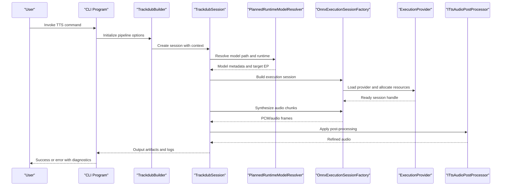
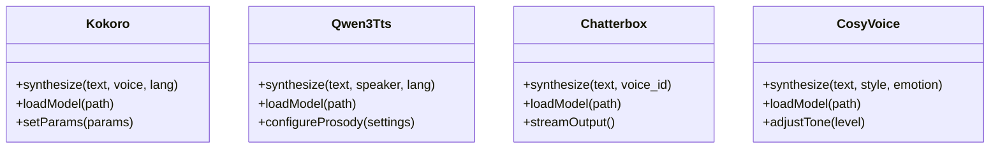
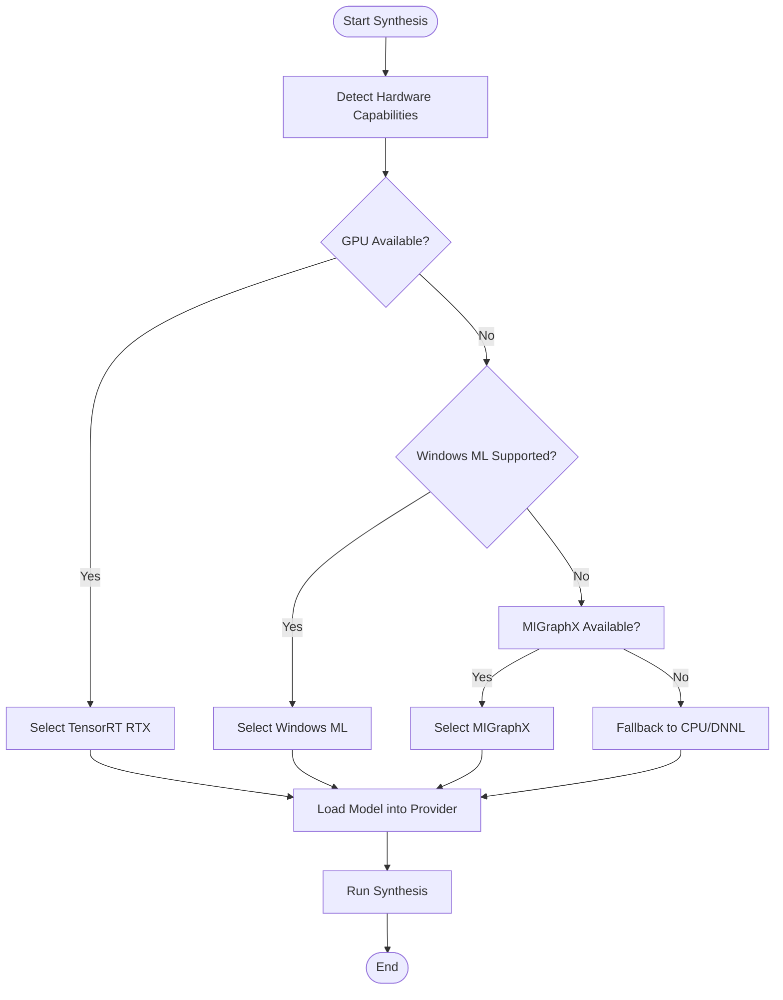
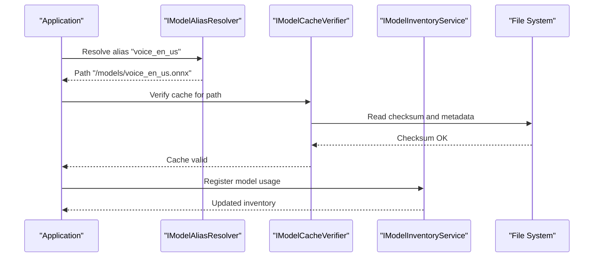
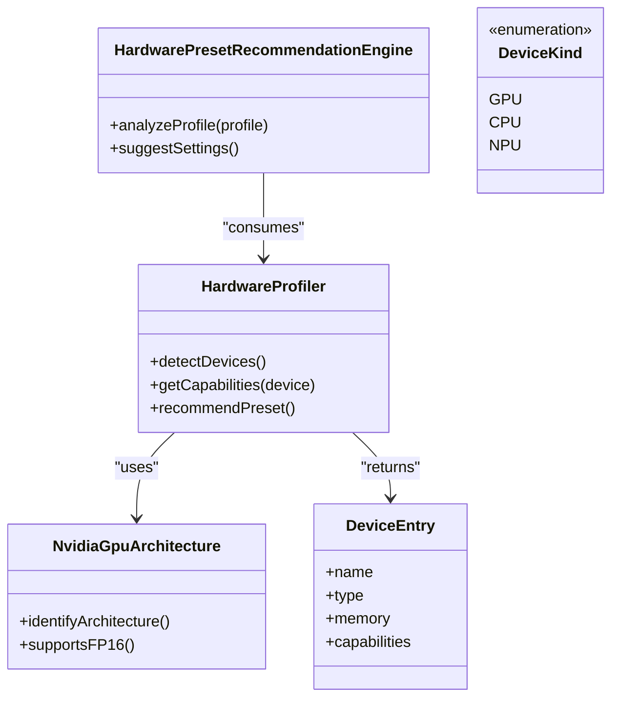
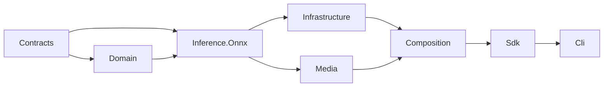

# Troubleshooting TTS Issues

<cite>
**Referenced Files in This Document**
- [ADR-0005-kokoro-tts-architecture.md](file://docs/decisions/ADR-0005-kokoro-tts-architecture.md)
- [Trackdub.Domain.csproj](file://src/Trackdub.Domain/Trackdub.Domain.csproj)
- [Trackdub.Inference.Onnx.csproj](file://src/Trackdub.Inference.Onnx/Trackdub.Inference.Onnx.csproj)
- [Trackdub.Infrastructure.csproj](file://src/Trackdub.Infrastructure/Trackdub.Infrastructure.csproj)
- [Trackdub.Contracts.csproj](file://src/Trackdub.Contracts/Trackdub.Contracts.csproj)
- [Trackdub.Media.csproj](file://src/Trackdub.Media/Trackdub.Media.csproj)
- [Trackdub.Benchmarks.csproj](file://src/Trackdub.Benchmarks/Trackdub.Benchmarks.csproj)
- [Trackdub.Cli.csproj](file://src/Trackdub.Cli/Trackdub.Cli.csproj)
- [Trackdub.Licensing.csproj](file://src/Trackdub.Licensing/Trackdub.Licensing.csproj)
- [Trackdub.Application.csproj](file://src/Trackdub.Application/Trackdub.Application.csproj)
- [Trackdub.Composition.csproj](file://src/Trackdub.Composition/Trackdub.Composition.csproj)
- [Trackdub.Inference.csproj](file://src/Trackdub.Inference/Trackdub.Inference.csproj)
- [Trackdub.Sdk.csproj](file://src/Trackdub.Sdk/Trackdub.Sdk.csproj)
- [Trackdub.Tools.csproj](file://src/Trackdub.Tools/Trackdub.Tools.csproj)
- [README.md](file://README.md)
- [TROUBLESHOOTING.md](file://docs/development/TROUBLESHOOTING.md)
- [MODEL_LICENSE_POLICY.md](file://docs/legal/MODEL_LICENSE_POLICY.md)
- [THIRD_PARTY_NOTICES.md](file://docs/legal/THIRD_PARTY_NOTICES.md)
- [LICENSE-HISTORY.md](file://docs/legal/LICENSE-HISTORY.md)
- [profiling-report.md](file://docs/reference/profiling-report.md)
- [windows-ml-phase-3-device-policies.md](file://docs/reference/windows-ml-phase-3-device-policies.md)
- [tensorrt-rtx-ep-abi-plugin.md](file://docs/reference/tensorrt-rtx-ep-abi-plugin.md)
- [windows-ml-phase-4-closeout.md](file://docs/reference/windows-ml-phase-4-closeout.md)
- [windows-ml-phase-5-catalog-eps.md](file://docs/reference/windows-ml-phase-5-catalog-eps.md)
- [windows-ml-stage-provider-matrix.md](file://docs/reference/windows-ml-stage-provider-matrix.md)
- [migraphx-phase0-seams.md](file://docs/reference/migraphx-phase0-seams.md)
- [pipeline-principles-review-grok-2026-07-08.md](file://docs/architecture/pipeline-principles-review-grok-2026-07-08.md)
- [local-pipeline-audit-unified-2026-07-08.md](file://docs/architecture/local-pipeline-audit-unified-2026-07-08.md)
- [ARCHITECTURE.md](file://docs/architecture/ARCHITECTURE.md)
- [ARCHITECTURE-source.md](file://docs/architecture/ARCHITECTURE-source.md)
- [TtsCandidateGroupRepository.cs](file://src/Trackdub.Contracts/ITtsCandidateGroupRepository.cs)
- [ITtsAudioPostProcessor.cs](file://src/Trackdub.Contracts/ITtsAudioPostProcessor.cs)
- [IModelCacheVerifier.cs](file://src/Trackdub.Contracts/IModelCacheVerifier.cs)
- [IModelInventoryService.cs](file://src/Trackdub.Contracts/IModelInventoryService.cs)
- [IModelAliasResolver.cs](file://src/Trackdub.Contracts/IModelAliasResolver.cs)
- [IEngineCacheMaintenanceService.cs](file://src/Trackdub.Contracts/IEngineCacheMaintenanceService.cs)
- [ITensorRtRtxRuntimeReadinessService.cs](file://src/Trackdub.Contracts/ITensorRtRtxRuntimeReadinessService.cs)
- [IMigraphxRuntimeReadinessService.cs](file://src/Trackdub.Contracts/IMigraphxRuntimeReadinessService.cs)
- [WinMlCatalogRuntimeReadinessServices.cs](file://src/Trackdub.Contracts/WinMlCatalogRuntimeReadinessServices.cs)
- [Kokoro directory](file://src/Trackdub.Inference.Onnx/Kokoro)
- [Qwen3Tts directory](file://src/Trackdub.Inference.Onnx/Qwen3Tts)
- [Chatterbox directory](file://src/Trackdub.Inference.Onnx/Chatterbox)
- [CosyVoice directory](file://src/Trackdub.Inference.Onnx/CosyVoice)
- [ExecutionProviders directory](file://src/Trackdub.Inference.Onnx/ExecutionProviders)
- [TensorRtRtx directory](file://src/Trackdub.Inference.Onnx/TensorRtRtx)
- [WindowsMl directory](file://src/Trackdub.Inference.Onnx/WindowsMl)
- [OnnxExecutionSessionFactory.cs](file://src/Trackdub.Inference.Onnx/OnnxExecutionSessionFactory.cs)
- [PlannedRuntimeModelResolver.cs](file://src/Trackdub.Inference.Onnx/PlannedRuntimeModelResolver.cs)
- [BenchmarkModelPathResolver.cs](file://src/Trackdub.Inference.Onnx/BenchmarkModelPathResolver.cs)
- [Tts directory (Domain)](file://src/Trackdub.Domain/Tts)
- [Tts directory (Infrastructure)](file://src/Trackdub.Infrastructure/Tts)
- [Tts directory (Media)](file://src/Trackdub.Media/Tts)
- [Tts directory (Composition)](file://src/Trackdub.Composition/Tts)
- [HardwareProfiler.cs](file://src/Trackdub.Domain/HardwareProfiler.cs)
- [HardwarePresetRecommendationEngine.cs](file://src/Trackdub.Domain/HardwarePresetRecommendationEngine.cs)
- [NvidiaGpuArchitecture.cs](file://src/Trackdub.Domain/NvidiaGpuArchitecture.cs)
- [ModelRuntime.cs](file://src/Trackdub.Domain/ModelRuntime.cs)
- [DeviceEntry.cs](file://src/Trackdub.Domain/DeviceEntry.cs)
- [DeviceKind.cs](file://src/Trackdub.Domain/DeviceKind.cs)
- [TrackdubBuilder.cs](file://src/Trackdub.Sdk/TrackdubBuilder.cs)
- [TrackdubSession.cs](file://src/Trackdub.Sdk/TrackdubSession.cs)
- [TrackdubProjectContext.cs](file://src/Trackdub.Sdk/TrackdubProjectContext.cs)
- [TrackdubOptions.cs](file://src/Trackdub.Sdk/TrackdubOptions.cs)
- [TrackdubPipelineReadinessChecker.cs](file://src/Trackdub.Sdk/TrackdubPipelineReadinessChecker.cs)
- [TrackdubDubbingEngine.cs](file://src/Trackdub.Sdk/TrackdubDubbingEngine.cs)
- [Program.cs (Cli)](file://src/Trackdub.Cli/Program.cs)
- [CliLoggingBootstrap.cs](file://src/Trackdub.Cli/CliLoggingBootstrap.cs)
- [StderrApplicationLogger.cs](file://src/Trackdub.Cli/StderrApplicationLogger.cs)
- [LicenseService.cs](file://src/Trackdub.Licensing/LicenseService.cs)
- [LicenseTokenValidator.cs](file://src/Trackdub.Licensing/LicenseTokenValidator.cs)
- [LicenseFileStore.cs](file://src/Trackdub.Licensing/LicenseFileStore.cs)
- [IAppStoragePaths.cs](file://src/Trackdub.Contracts/IAppStoragePaths.cs)
</cite>

## Table of Contents
1. [Introduction](#introduction)
2. [Project Structure](#project-structure)
3. [Core Components](#core-components)
4. [Architecture Overview](#architecture-overview)
5. [Detailed Component Analysis](#detailed-component-analysis)
6. [Dependency Analysis](#dependency-analysis)
7. [Performance Considerations](#performance-considerations)
8. [Troubleshooting Guide](#troubleshooting-guide)
9. [Conclusion](#conclusion)
10. [Appendices](#appendices)

## Introduction
This document provides comprehensive troubleshooting guidance for Text-to-Speech (TTS) issues in Trackdub. It covers common symptoms such as poor voice quality, pronunciation errors, synthesis artifacts, and performance problems. It also includes diagnostic steps, log analysis techniques, debugging tools, and solutions for model loading failures, memory issues, hardware compatibility, multilingual synthesis, accent inconsistencies, emotional tone variability, licensing conflicts, model version mismatches, and dependency resolution problems.

## Project Structure
Trackdub organizes TTS-related functionality across multiple projects:
- Domain models and hardware profiling live under the Domain project.
- Inference runtime implementations are primarily in the Onnx project with execution providers and model resolvers.
- Infrastructure encapsulates persistence, logging, settings, and licensing.
- Contracts define interfaces for TTS services, model cache verification, and readiness checks.
- Media handles audio post-processing and waveform utilities.
- Composition wires up components and runtime selection.
- Sdk exposes high-level APIs for building sessions and pipelines.
- Cli provides command-line entry points and logging bootstrap.
- Benchmarks and Tools support profiling and diagnostics.

```mermaid
graph TB
subgraph "Contracts"
C1["ITtsCandidateGroupRepository"]
C2["ITtsAudioPostProcessor"]
C3["IModelCacheVerifier"]
C4["IModelInventoryService"]
C5["IModelAliasResolver"]
C6["IEngineCacheMaintenanceService"]
C7["ITensorRtRtxRuntimeReadinessService"]
C8["IMigraphxRuntimeReadinessService"]
C9["WinMlCatalogRuntimeReadinessServices"]
end
subgraph "Domain"
D1["HardwareProfiler"]
D2["HardwarePresetRecommendationEngine"]
D3["NvidiaGpuArchitecture"]
D4["ModelRuntime"]
D5["DeviceEntry"]
D6["DeviceKind"]
end
subgraph "Inference.Onnx"
I1["OnnxExecutionSessionFactory"]
I2["PlannedRuntimeModelResolver"]
I3["BenchmarkModelPathResolver"]
I4["Kokoro"]
I5["Qwen3Tts"]
I6["Chatterbox"]
I7["CosyVoice"]
I8["ExecutionProviders"]
I9["TensorRtRtx"]
I10["WindowsMl"]
end
subgraph "Infrastructure"
F1["Tts"]
F2["Licensing"]
F3["Logging"]
F4["Settings"]
end
subgraph "Media"
M1["Tts"]
end
subgraph "Composition"
S1["Tts"]
end
subgraph "Sdk"
E1["TrackdubBuilder"]
E2["TrackdubSession"]
E3["TrackdubProjectContext"]
E4["TrackdubOptions"]
E5["TrackdubPipelineReadinessChecker"]
E6["TrackdubDubbingEngine"]
end
subgraph "Cli"
L1["Program"]
L2["CliLoggingBootstrap"]
L3["StderrApplicationLogger"]
end
C1 --> I1
C2 --> M1
C3 --> I2
C4 --> I2
C5 --> I2
C6 --> I1
C7 --> I9
C8 --> I8
C9 --> I10
D1 --> I1
D2 --> I1
D3 --> I1
D4 --> I1
D5 --> I1
D6 --> I1
I1 --> I4
I1 --> I5
I1 --> I6
I1 --> I7
E1 --> I1
E2 --> I1
E3 --> I1
E4 --> I1
E5 --> I1
E6 --> I1
L1 --> L2
L2 --> L3
```

**Diagram sources**
- [Trackdub.Contracts.csproj](file://src/Trackdub.Contracts/Trackdub.Contracts.csproj)
- [Trackdub.Domain.csproj](file://src/Trackdub.Domain/Trackdub.Domain.csproj)
- [Trackdub.Inference.Onnx.csproj](file://src/Trackdub.Inference.Onnx/Trackdub.Inference.Onnx.csproj)
- [Trackdub.Infrastructure.csproj](file://src/Trackdub.Infrastructure/Trackdub.Infrastructure.csproj)
- [Trackdub.Media.csproj](file://src/Trackdub.Media/Trackdub.Media.csproj)
- [Trackdub.Composition.csproj](file://src/Trackdub.Composition/Trackdub.Composition.csproj)
- [Trackdub.Sdk.csproj](file://src/Trackdub.Sdk/Trackdub.Sdk.csproj)
- [Trackdub.Cli.csproj](file://src/Trackdub.Cli/Trackdub.Cli.csproj)

**Section sources**
- [README.md](file://README.md)
- [ARCHITECTURE.md](file://docs/architecture/ARCHITECTURE.md)
- [ARCHITECTURE-source.md](file://docs/architecture/ARCHITECTURE-source.md)

## Core Components
Key TTS-related contracts and services include:
- Candidate group repository for managing TTS candidate outputs.
- Audio post-processor interface for refining synthesized audio.
- Model cache verifier and inventory service for model lifecycle management.
- Model alias resolver to map logical names to concrete model paths.
- Engine cache maintenance for inference engine state.
- Runtime readiness services for TensorRT RTX, MIGraphX, and Windows ML catalog.

These components collectively ensure robust model discovery, caching, and execution provider selection.

**Section sources**
- [ITtsCandidateGroupRepository.cs](file://src/Trackdub.Contracts/ITtsCandidateGroupRepository.cs)
- [ITtsAudioPostProcessor.cs](file://src/Trackdub.Contracts/ITtsAudioPostProcessor.cs)
- [IModelCacheVerifier.cs](file://src/Trackdub.Contracts/IModelCacheVerifier.cs)
- [IModelInventoryService.cs](file://src/Trackdub.Contracts/IModelInventoryService.cs)
- [IModelAliasResolver.cs](file://src/Trackdub.Contracts/IModelAliasResolver.cs)
- [IEngineCacheMaintenanceService.cs](file://src/Trackdub.Contracts/IEngineCacheMaintenanceService.cs)
- [ITensorRtRtxRuntimeReadinessService.cs](file://src/Trackdub.Contracts/ITensorRtRtxRuntimeReadinessService.cs)
- [IMigraphxRuntimeReadinessService.cs](file://src/Trackdub.Contracts/IMigraphxRuntimeReadinessService.cs)
- [WinMlCatalogRuntimeReadinessServices.cs](file://src/Trackdub.Contracts/WinMlCatalogRuntimeReadinessServices.cs)

## Architecture Overview
The TTS pipeline integrates domain hardware profiling, inference session factories, and execution providers to select optimal runtime configurations. The SDK orchestrates builders and sessions, while CLI bootstraps logging and error reporting. Licensing ensures compliance and access control.

**Diagram sources**
- [Program.cs (Cli)](file://src/Trackdub.Cli/Program.cs)
- [TrackdubBuilder.cs](file://src/Trackdub.Sdk/TrackdubBuilder.cs)
- [TrackdubSession.cs](file://src/Trackdub.Sdk/TrackdubSession.cs)
- [PlannedRuntimeModelResolver.cs](file://src/Trackdub.Inference.Onnx/PlannedRuntimeModelResolver.cs)
- [OnnxExecutionSessionFactory.cs](file://src/Trackdub.Inference.Onnx/OnnxExecutionSessionFactory.cs)
- [ExecutionProviders directory](file://src/Trackdub.Inference.Onnx/ExecutionProviders)
- [ITtsAudioPostProcessor.cs](file://src/Trackdub.Contracts/ITtsAudioPostProcessor.cs)

## Detailed Component Analysis

### TTS Engines and Implementations
Trackdub supports multiple TTS engines via ONNX models:
- Kokoro: High-quality neural TTS with language-specific variants.
- Qwen3Tts: Multimodal text-to-speech with advanced prosody control.
- Chatterbox: Lightweight conversational TTS suitable for real-time use.
- CosyVoice: Expressive voice synthesis with emotion and style parameters.

Each engine is implemented under dedicated directories within the Onnx project, enabling modular selection and configuration.

**Diagram sources**
- [Kokoro directory](file://src/Trackdub.Inference.Onnx/Kokoro)
- [Qwen3Tts directory](file://src/Trackdub.Inference.Onnx/Qwen3Tts)
- [Chatterbox directory](file://src/Trackdub.Inference.Onnx/Chatterbox)
- [CosyVoice directory](file://src/Trackdub.Inference.Onnx/CosyVoice)

**Section sources**
- [Trackdub.Inference.Onnx.csproj](file://src/Trackdub.Inference.Onnx/Trackdub.Inference.Onnx.csproj)

### Execution Providers and Runtime Selection
Execution providers determine where inference runs:
- TensorRT RTX: GPU-accelerated on NVIDIA GPUs.
- Windows ML: Native Windows ML runtime.
- MIGraphX: AMD/Intel optimized backend.
- CPU/DNNL: Fallbacks for compatibility.

The factory selects providers based on hardware capabilities and model requirements.

**Diagram sources**
- [OnnxExecutionSessionFactory.cs](file://src/Trackdub.Inference.Onnx/OnnxExecutionSessionFactory.cs)
- [TensorRtRtx directory](file://src/Trackdub.Inference.Onnx/TensorRtRtx)
- [WindowsMl directory](file://src/Trackdub.Inference.Onnx/WindowsMl)
- [ExecutionProviders directory](file://src/Trackdub.Inference.Onnx/ExecutionProviders)

**Section sources**
- [OnnxExecutionSessionFactory.cs](file://src/Trackdub.Inference.Onnx/OnnxExecutionSessionFactory.cs)
- [TensorRtRtx directory](file://src/Trackdub.Inference.Onnx/TensorRtRtx)
- [WindowsMl directory](file://src/Trackdub.Inference.Onnx/WindowsMl)

### Model Resolution and Caching
Model resolution maps aliases to concrete paths and verifies cache integrity:
- Alias resolver translates logical names to file locations.
- Cache verifier checks model checksums and versions.
- Inventory service tracks available models and their metadata.

**Diagram sources**
- [IModelAliasResolver.cs](file://src/Trackdub.Contracts/IModelAliasResolver.cs)
- [IModelCacheVerifier.cs](file://src/Trackdub.Contracts/IModelCacheVerifier.cs)
- [IModelInventoryService.cs](file://src/Trackdub.Contracts/IModelInventoryService.cs)

**Section sources**
- [IModelAliasResolver.cs](file://src/Trackdub.Contracts/IModelAliasResolver.cs)
- [IModelCacheVerifier.cs](file://src/Trackdub.Contracts/IModelCacheVerifier.cs)
- [IModelInventoryService.cs](file://src/Trackdub.Contracts/IModelInventoryService.cs)

### Hardware Profiling and Preset Recommendations
Hardware profiling informs optimal TTS settings:
- GPU architecture detection influences precision and batch size.
- Preset recommendation engine suggests configurations based on device capabilities.
- Device entries track available accelerators and constraints.

**Diagram sources**
- [HardwareProfiler.cs](file://src/Trackdub.Domain/HardwareProfiler.cs)
- [HardwarePresetRecommendationEngine.cs](file://src/Trackdub.Domain/HardwarePresetRecommendationEngine.cs)
- [NvidiaGpuArchitecture.cs](file://src/Trackdub.Domain/NvidiaGpuArchitecture.cs)
- [DeviceEntry.cs](file://src/Trackdub.Domain/DeviceEntry.cs)
- [DeviceKind.cs](file://src/Trackdub.Domain/DeviceKind.cs)

**Section sources**
- [HardwareProfiler.cs](file://src/Trackdub.Domain/HardwareProfiler.cs)
- [HardwarePresetRecommendationEngine.cs](file://src/Trackdub.Domain/HardwarePresetRecommendationEngine.cs)
- [NvidiaGpuArchitecture.cs](file://src/Trackdub.Domain/NvidiaGpuArchitecture.cs)
- [DeviceEntry.cs](file://src/Trackdub.Domain/DeviceEntry.cs)
- [DeviceKind.cs](file://src/Trackdub.Domain/DeviceKind.cs)

## Dependency Analysis
TTS components depend on contracts, domain models, and runtime implementations:
- Contracts define interfaces for TTS services and model management.
- Domain provides hardware profiling and device abstractions.
- Inference.Onnx implements execution providers and model resolvers.
- Infrastructure handles logging, settings, and licensing.
- Media processes audio output and waveforms.
- Composition wires dependencies together.
- Sdk exposes high-level APIs for orchestration.
- CLI provides entry points and logging bootstrap.

**Diagram sources**
- [Trackdub.Contracts.csproj](file://src/Trackdub.Contracts/Trackdub.Contracts.csproj)
- [Trackdub.Domain.csproj](file://src/Trackdub.Domain/Trackdub.Domain.csproj)
- [Trackdub.Inference.Onnx.csproj](file://src/Trackdub.Inference.Onnx/Trackdub.Inference.Onnx.csproj)
- [Trackdub.Infrastructure.csproj](file://src/Trackdub.Infrastructure/Trackdub.Infrastructure.csproj)
- [Trackdub.Media.csproj](file://src/Trackdub.Media/Trackdub.Media.csproj)
- [Trackdub.Composition.csproj](file://src/Trackdub.Composition/Trackdub.Composition.csproj)
- [Trackdub.Sdk.csproj](file://src/Trackdub.Sdk/Trackdub.Sdk.csproj)
- [Trackdub.Cli.csproj](file://src/Trackdub.Cli/Trackdub.Cli.csproj)

**Section sources**
- [Trackdub.Contracts.csproj](file://src/Trackdub.Contracts/Trackdub.Contracts.csproj)
- [Trackdub.Domain.csproj](file://src/Trackdub.Domain/Trackdub.Domain.csproj)
- [Trackdub.Inference.Onnx.csproj](file://src/Trackdub.Inference.Onnx/Trackdub.Inference.Onnx.csproj)
- [Trackdub.Infrastructure.csproj](file://src/Trackdub.Infrastructure/Trackdub.Infrastructure.csproj)
- [Trackdub.Media.csproj](file://src/Trackdub.Media/Trackdub.Media.csproj)
- [Trackdub.Composition.csproj](file://src/Trackdub.Composition/Trackdub.Composition.csproj)
- [Trackdub.Sdk.csproj](file://src/Trackdub.Sdk/Trackdub.Sdk.csproj)
- [Trackdub.Cli.csproj](file://src/Trackdub.Cli/Trackdub.Cli.csproj)

## Performance Considerations
Performance optimization strategies for TTS include:
- Selecting appropriate execution providers based on hardware capabilities.
- Using quantized models for faster inference on constrained devices.
- Batching synthesis requests to maximize throughput.
- Monitoring memory usage and adjusting buffer sizes.
- Profiling bottlenecks using benchmarking tools and telemetry.

Refer to profiling documentation for detailed metrics collection and analysis techniques.

[No sources needed since this section provides general guidance]

## Troubleshooting Guide

### Poor Voice Quality
Symptoms: Muffled speech, robotic tones, or unnatural intonation.
Diagnostic steps:
- Verify model version and language pack compatibility.
- Check audio post-processing settings for clipping or distortion.
- Ensure correct sample rate conversion during synthesis.
- Validate input text normalization and phoneme mapping.

Solutions:
- Switch to a higher-quality model variant if available.
- Adjust post-processing filters to reduce artifacts.
- Re-run text normalization with updated rules.

**Section sources**
- [ITtsAudioPostProcessor.cs](file://src/Trackdub.Contracts/ITtsAudioPostProcessor.cs)
- [Trackdub.Media.csproj](file://src/Trackdub.Media/Trackdub.Media.csproj)

### Pronunciation Errors
Symptoms: Mispronounced words, incorrect stress patterns, or foreign accents.
Diagnostic steps:
- Inspect text preprocessing for phonetic transcription accuracy.
- Check language-specific lexicon files for missing entries.
- Validate speaker voice model alignment with target language.

Solutions:
- Update lexicon files with corrected pronunciations.
- Use language-specific voice models for better accuracy.
- Enable phoneme-level adjustments in synthesis parameters.

**Section sources**
- [Kokoro directory](file://src/Trackdub.Inference.Onnx/Kokoro)
- [Qwen3Tts directory](file://src/Trackdub.Inference.Onnx/Qwen3Tts)

### Synthesis Artifacts
Symptoms: Clicks, pops, background noise, or discontinuities in audio.
Diagnostic steps:
- Monitor audio buffer boundaries for overlap issues.
- Check for improper silence insertion or trimming.
- Validate encoder-decoder synchronization in streaming mode.

Solutions:
- Increase buffer size to reduce boundary artifacts.
- Apply smoothing filters to eliminate clicks.
- Adjust streaming chunk size for seamless playback.

**Section sources**
- [Chatterbox directory](file://src/Trackdub.Inference.Onnx/Chatterbox)
- [CosyVoice directory](file://src/Trackdub.Inference.Onnx/CosyVoice)

### Performance Issues
Symptoms: Slow synthesis, high CPU/GPU usage, or memory spikes.
Diagnostic steps:
- Profile execution provider selection and model loading times.
- Monitor memory allocation patterns during synthesis.
- Check for thread contention or blocking operations.

Solutions:
- Switch to GPU acceleration if available.
- Reduce batch size to lower memory pressure.
- Preload models to avoid repeated initialization overhead.

**Section sources**
- [OnnxExecutionSessionFactory.cs](file://src/Trackdub.Inference.Onnx/OnnxExecutionSessionFactory.cs)
- [HardwareProfiler.cs](file://src/Trackdub.Domain/HardwareProfiler.cs)

### Model Loading Failures
Symptoms: Errors during model initialization or runtime crashes.
Diagnostic steps:
- Verify model file integrity and checksum validation.
- Check for missing dependencies or incompatible runtime versions.
- Review license status and access permissions.

Solutions:
- Re-download corrupted model files.
- Update runtime libraries to compatible versions.
- Renew licenses if expired or invalid.

**Section sources**
- [IModelCacheVerifier.cs](file://src/Trackdub.Contracts/IModelCacheVerifier.cs)
- [LicenseService.cs](file://src/Trackdub.Licensing/LicenseService.cs)

### Memory Issues
Symptoms: Out-of-memory errors, slow garbage collection, or system instability.
Diagnostic steps:
- Analyze memory usage trends during long synthesis sessions.
- Identify large model allocations or uncached resources.
- Check for memory leaks in custom post-processing code.

Solutions:
- Implement model pooling to reuse loaded instances.
- Clear intermediate buffers after synthesis completion.
- Optimize audio processing algorithms for lower memory footprint.

**Section sources**
- [IEngineCacheMaintenanceService.cs](file://src/Trackdub.Contracts/IEngineCacheMaintenanceService.cs)
- [Trackdub.Media.csproj](file://src/Trackdub.Media/Trackdub.Media.csproj)

### Hardware Compatibility Problems
Symptoms: Incompatible execution providers, driver errors, or feature unavailability.
Diagnostic steps:
- Query hardware capabilities and supported features.
- Verify driver versions and firmware updates.
- Check for platform-specific limitations or restrictions.

Solutions:
- Fall back to CPU execution if GPU features are unsupported.
- Update drivers to latest stable versions.
- Disable unsupported features in configuration.

**Section sources**
- [ITensorRtRtxRuntimeReadinessService.cs](file://src/Trackdub.Contracts/ITensorRtRtxRuntimeReadinessService.cs)
- [IMigraphxRuntimeReadinessService.cs](file://src/Trackdub.Contracts/IMigraphxRuntimeReadinessService.cs)
- [WinMlCatalogRuntimeReadinessServices.cs](file://src/Trackdub.Contracts/WinMlCatalogRuntimeReadinessServices.cs)

### Multilingual Synthesis Issues
Symptoms: Incorrect language detection, mixed language output, or accent mismatches.
Diagnostic steps:
- Validate language codes and region-specific models.
- Check text preprocessing for language tagging accuracy.
- Verify voice model compatibility with target language.

Solutions:
- Use language-specific voice models for each target language.
- Improve language detection algorithms with context clues.
- Configure region-specific pronunciation rules.

**Section sources**
- [Qwen3Tts directory](file://src/Trackdub.Inference.Onnx/Qwen3Tts)
- [Kokoro directory](file://src/Trackdub.Inference.Onnx/Kokoro)

### Accent Problems
Symptoms: Unnatural accents, regional dialect issues, or inconsistent pronunciation.
Diagnostic steps:
- Inspect accent-specific voice models and training data.
- Check for proper phoneme mapping in text preprocessing.
- Validate speaker assignment and voice cloning results.

Solutions:
- Select voice models trained on specific regional datasets.
- Fine-tune accent parameters in synthesis configuration.
- Use speaker embedding controls for accent modulation.

**Section sources**
- [CosyVoice directory](file://src/Trackdub.Inference.Onnx/CosyVoice)
- [Chatterbox directory](file://src/Trackdub.Inference.Onnx/Chatterbox)

### Emotional Tone Inconsistencies
Symptoms: Flat delivery, inappropriate emotions, or sudden tone shifts.
Diagnostic steps:
- Review emotion parameter settings and intensity levels.
- Check for consistent voice model behavior across segments.
- Validate text sentiment analysis for emotion cues.

Solutions:
- Calibrate emotion parameters based on content type.
- Use emotion-aware voice models with dynamic adjustment.
- Implement smooth transitions between emotional states.

**Section sources**
- [CosyVoice directory](file://src/Trackdub.Inference.Onnx/CosyVoice)
- [Qwen3Tts directory](file://src/Trackdub.Inference.Onnx/Qwen3Tts)

### Licensing Issues
Symptoms: License validation failures, access denied errors, or feature restrictions.
Diagnostic steps:
- Verify license token validity and expiration dates.
- Check hardware fingerprint matching and device binding.
- Review license tier permissions and feature flags.

Solutions:
- Renew expired licenses or obtain new tokens.
- Update hardware fingerprint if device changes occur.
- Upgrade license tier for additional features.

**Section sources**
- [LicenseService.cs](file://src/Trackdub.Licensing/LicenseService.cs)
- [LicenseTokenValidator.cs](file://src/Trackdub.Licensing/LicenseTokenValidator.cs)
- [LicenseFileStore.cs](file://src/Trackdub.Licensing/LicenseFileStore.cs)

### Model Version Conflicts
Symptoms: Incompatible model formats, runtime errors, or unexpected behavior.
Diagnostic steps:
- Compare model manifest versions with runtime expectations.
- Check for breaking changes in model schema or API.
- Validate model dependencies and required assets.

Solutions:
- Update models to compatible versions specified by runtime.
- Pin model versions in configuration to prevent drift.
- Implement migration scripts for schema updates.

**Section sources**
- [IModelCacheVerifier.cs](file://src/Trackdub.Contracts/IModelCacheVerifier.cs)
- [IModelInventoryService.cs](file://src/Trackdub.Contracts/IModelInventoryService.cs)

### Dependency Resolution Problems
Symptoms: Missing DLLs, package conflicts, or build failures.
Diagnostic steps:
- Audit NuGet packages and native dependencies.
- Check for conflicting versions in project references.
- Verify platform-specific binaries and architectures.

Solutions:
- Clean and restore NuGet packages to resolve conflicts.
- Pin dependency versions to known working combinations.
- Use platform-specific build targets for deployment.

**Section sources**
- [Trackdub.Inference.Onnx.csproj](file://src/Trackdub.Inference.Onnx/Trackdub.Inference.Onnx.csproj)
- [Trackdub.Infrastructure.csproj](file://src/Trackdub.Infrastructure/Trackdub.Infrastructure.csproj)

## Conclusion
This troubleshooting guide addresses common TTS issues in Trackdub through systematic diagnosis and targeted solutions. By leveraging hardware profiling, execution provider selection, and model management services, users can optimize performance and resolve quality concerns. Regular monitoring of licensing, model versions, and dependencies ensures reliable operation across diverse environments.

[No sources needed since this section summarizes without analyzing specific files]

## Appendices

### Log Analysis Techniques
Enable detailed logging to capture synthesis workflows and error traces:
- Use CLI logging bootstrap for structured output.
- Filter logs by severity and component modules.
- Export logs for offline analysis and bug reports.

**Section sources**
- [CliLoggingBootstrap.cs](file://src/Trackdub.Cli/CliLoggingBootstrap.cs)
- [StderrApplicationLogger.cs](file://src/Trackdub.Cli/StderrApplicationLogger.cs)

### Debugging Tools
Utilize built-in tools for deeper investigation:
- Benchmark runner for performance profiling.
- Model lab for inspecting model contents and metadata.
- Artifact inspector for examining generated outputs.

**Section sources**
- [Trackdub.Benchmarks.csproj](file://src/Trackdub.Benchmarks/Trackdub.Benchmarks.csproj)
- [Trackdub.Tools.csproj](file://src/Trackdub.Tools/Trackdub.Tools.csproj)

### Hardware Compatibility Matrix
Reference platform-specific documentation for supported features:
- Windows ML device policies and provider matrices.
- TensorRT RTX ABI plugin compatibility.
- MIGraphX backend requirements and optimizations.

**Section sources**
- [windows-ml-phase-3-device-policies.md](file://docs/reference/windows-ml-phase-3-device-policies.md)
- [tensorrt-rtx-ep-abi-plugin.md](file://docs/reference/tensorrt-rtx-ep-abi-plugin.md)
- [migraphx-phase0-seams.md](file://docs/reference/migraphx-phase0-seams.md)

### Licensing Policy Reference
Consult legal documents for model usage rights and restrictions:
- Model license policy guidelines and compliance requirements.
- Third-party notices and attribution obligations.
- License history and version compatibility matrix.

**Section sources**
- [MODEL_LICENSE_POLICY.md](file://docs/legal/MODEL_LICENSE_POLICY.md)
- [THIRD_PARTY_NOTIES.md](file://docs/legal/THIRD_PARTY_NOTICES.md)
- [LICENSE-HISTORY.md](file://docs/legal/LICENSE-HISTORY.md)