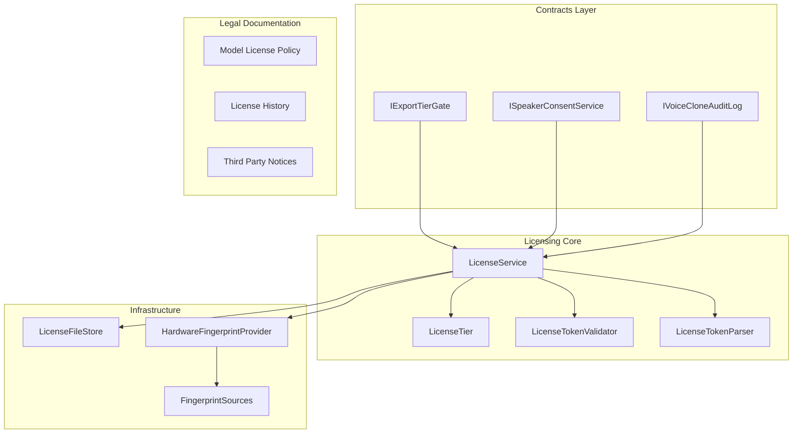
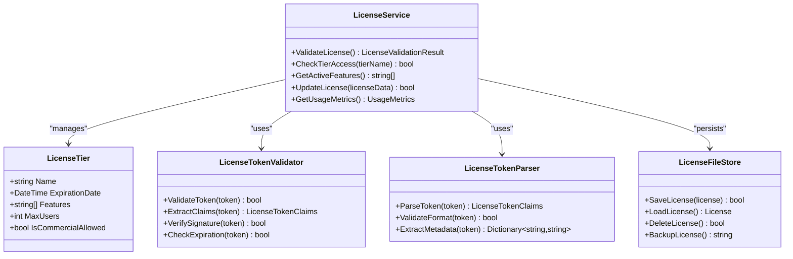
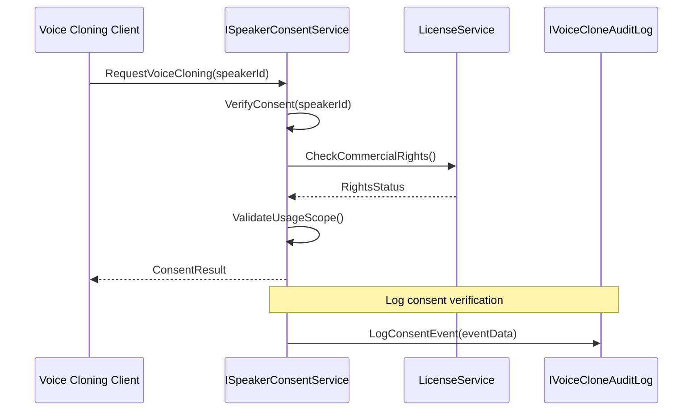
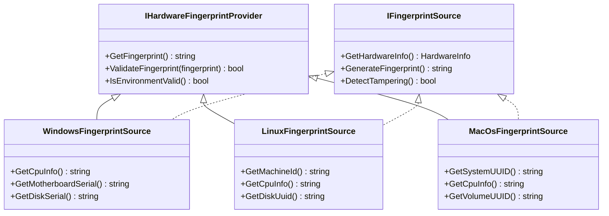
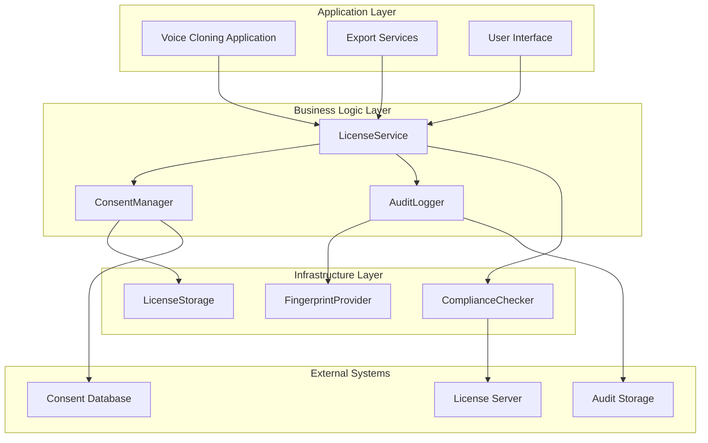
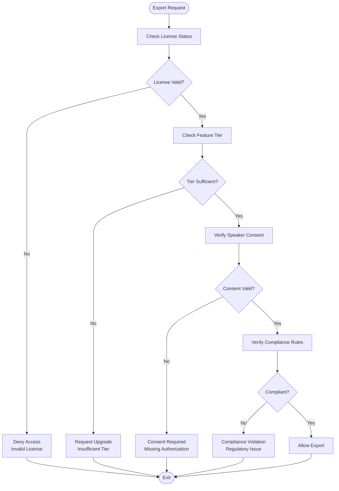
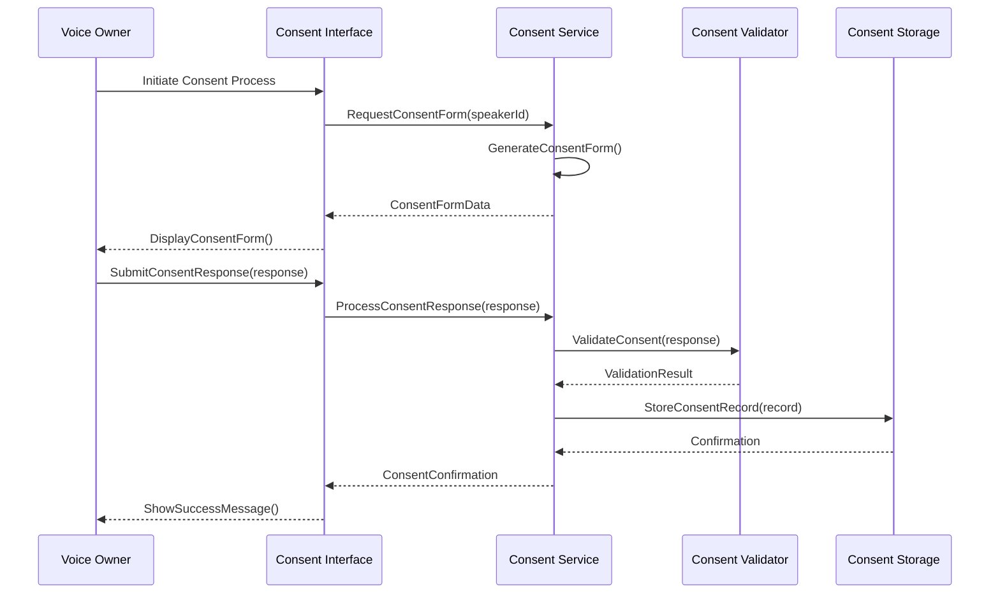
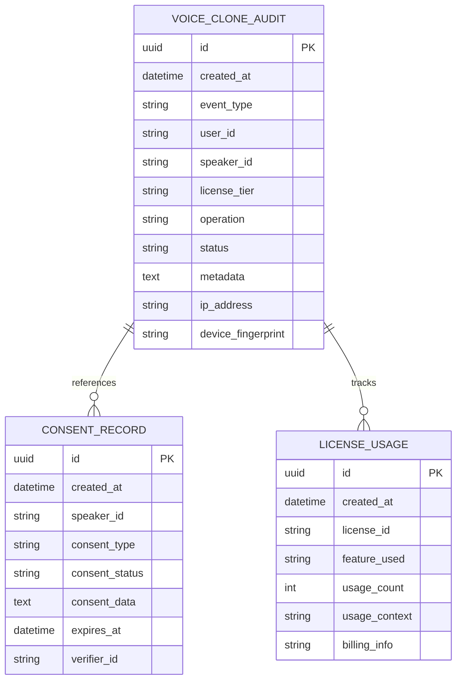
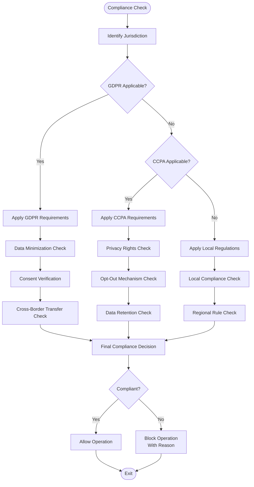
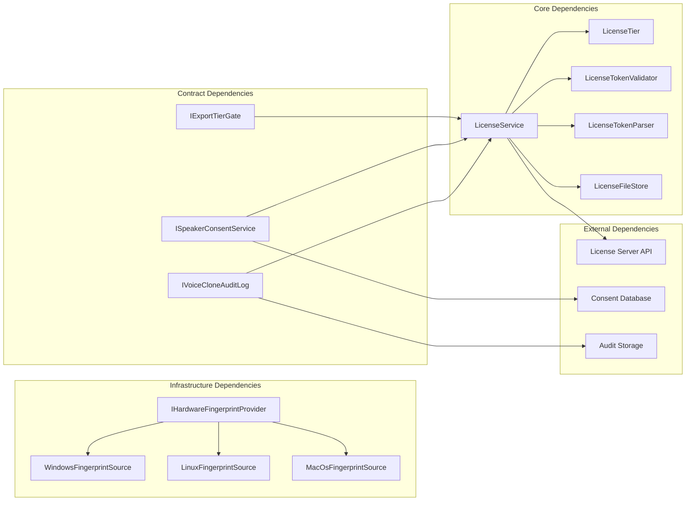

# Licensing & Compliance

<cite>
**Referenced Files in This Document**
- [LicenseService.cs](file://src/Trackdub.Licensing/LicenseService.cs)
- [LicenseTier.cs](file://src/Trackdub.Licensing/LicenseTier.cs)
- [IFingerprintSource.cs](file://src/Trackdub.Licensing/IFingerprintSource.cs)
- [IHardwareFingerprintProvider.cs](file://src/Trackdub.Licensing/IHardwareFingerprintProvider.cs)
- [ILicenseInitializer.cs](file://src/Trackdub.Licensing/ILicenseInitializer.cs)
- [ILicenseSignatureTrustStore.cs](file://src/Trackdub.Licensing/ILicenseSignatureTrustStore.cs)
- [ILicenseTierProvider.cs](file://src/Trackdub.Licensing/ILicenseTierProvider.cs)
- [ILicenseTokenStore.cs](file://src/Trackdub.Licensing/ILicenseTokenStore.cs)
- [LicenseFileStore.cs](file://src/Trackdub.Licensing/LicenseFileStore.cs)
- [LicenseTokenClaims.cs](file://src/Trackdub.Licensing/LicenseTokenClaims.cs)
- [LicenseTokenParser.cs](file://src/Trackdub.Licensing/LicenseTokenParser.cs)
- [LicenseTokenValidator.cs](file://src/Trackdub.Licensing/LicenseTokenValidator.cs)
- [LicenseValidationResult.cs](file://src/Trackdub.Licensing/LicenseValidationResult.cs)
- [WindowsFingerprintSource.cs](file://src/Trackdub.Licensing/WindowsFingerprintSource.cs)
- [LinuxFingerprintSource.cs](file://src/Trackdub.Licensing/LinuxFingerprintSource.cs)
- [MacOsFingerprintSource.cs](file://src/Trackdub.Licensing/MacOsFingerprintSource.cs)
- [IExportTierGate.cs](file://src/Trackdub.Contracts/IExportTierGate.cs)
- [ISpeakerConsentService.cs](file://src/Trackdub.Contracts/ISpeakerConsentService.cs)
- [IVoiceCloneAuditLog.cs](file://src/Trackdub.Contracts/IVoiceCloneAuditLog.cs)
- [MODEL_LICENSE_POLICY.md](file://docs/legal/MODEL_LICENSE_POLICY.md)
- [LICENSE-HISTORY.md](file://docs/legal/LICENSE-HISTORY.md)
- [THIRD_PARTY_NOTICES.md](file://docs/legal/THIRD_PARTY_NOTICES.md)
</cite>

## Table of Contents
1. [Introduction](#introduction)
2. [Project Structure](#project-structure)
3. [Core Components](#core-components)
4. [Architecture Overview](#architecture-overview)
5. [Detailed Component Analysis](#detailed-component-analysis)
6. [Dependency Analysis](#dependency-analysis)
7. [Performance Considerations](#performance-considerations)
8. [Troubleshooting Guide](#troubleshooting-guide)
9. [Conclusion](#conclusion)
10. [Appendices](#appendices)

## Introduction

This document provides comprehensive guidance for licensing and compliance considerations in voice cloning technology within the Trackdub platform. It covers legal requirements for voice cloning including consent verification, rights management, and commercial usage restrictions. The document also details the licensing framework for custom voices, ethical guidelines, compliance features, and international regulations such as GDPR and CCPA.

Voice cloning technology involves sensitive personal data and intellectual property considerations. Proper licensing ensures that voice cloning operations are conducted legally, ethically, and in compliance with applicable regulations. The Trackdub platform implements a robust licensing system that supports tier-based access control, audit logging, and compliance monitoring.

## Project Structure

The licensing and compliance system is organized across multiple layers:

**Diagram sources**
- [LicenseService.cs](file://src/Trackdub.Licensing/LicenseService.cs)
- [IExportTierGate.cs](file://src/Trackdub.Contracts/IExportTierGate.cs)
- [ISpeakerConsentService.cs](file://src/Trackdub.Contracts/ISpeakerConsentService.cs)
- [IVoiceCloneAuditLog.cs](file://src/Trackdub.Contracts/IVoiceCloneAuditLog.cs)

**Section sources**
- [LicenseService.cs](file://src/Trackdub.Licensing/LicenseService.cs)
- [MODEL_LICENSE_POLICY.md](file://docs/legal/MODEL_LICENSE_POLICY.md)

## Core Components

### License Management System

The core license management system provides comprehensive licensing capabilities for voice cloning operations:

#### License Service Architecture

**Diagram sources**
- [LicenseService.cs](file://src/Trackdub.Licensing/LicenseService.cs)
- [LicenseTier.cs](file://src/Trackdub.Licensing/LicenseTier.cs)
- [LicenseTokenValidator.cs](file://src/Trackdub.Licensing/LicenseTokenValidator.cs)
- [LicenseTokenParser.cs](file://src/Trackdub.Licensing/LicenseTokenParser.cs)
- [LicenseFileStore.cs](file://src/Trackdub.Licensing/LicenseFileStore.cs)

### Consent Management

The consent management system ensures proper authorization for voice cloning operations:

#### Speaker Consent Service

**Diagram sources**
- [ISpeakerConsentService.cs](file://src/Trackdub.Contracts/ISpeakerConsentService.cs)
- [LicenseService.cs](file://src/Trackdub.Licensing/LicenseService.cs)
- [IVoiceCloneAuditLog.cs](file://src/Trackdub.Contracts/IVoiceCloneAuditLog.cs)

### Hardware Fingerprinting

The system includes hardware fingerprinting for license validation and anti-piracy measures:

#### Fingerprint Provider Architecture

**Diagram sources**
- [IHardwareFingerprintProvider.cs](file://src/Trackdub.Licensing/IHardwareFingerprintProvider.cs)
- [IFingerprintSource.cs](file://src/Trackdub.Licensing/IFingerprintSource.cs)
- [WindowsFingerprintSource.cs](file://src/Trackdub.Licensing/WindowsFingerprintSource.cs)
- [LinuxFingerprintSource.cs](file://src/Trackdub.Licensing/LinuxFingerprintSource.cs)
- [MacOsFingerprintSource.cs](file://src/Trackdub.Licensing/MacOsFingerprintSource.cs)

## Architecture Overview

The licensing and compliance architecture follows a layered approach with clear separation of concerns:

**Diagram sources**
- [LicenseService.cs](file://src/Trackdub.Licensing/LicenseService.cs)
- [ISpeakerConsentService.cs](file://src/Trackdub.Contracts/ISpeakerConsentService.cs)
- [IVoiceCloneAuditLog.cs](file://src/Trackdub.Contracts/IVoiceCloneAuditLog.cs)

## Detailed Component Analysis

### Tier-Based Access Control

The licensing system implements sophisticated tier-based access control for different voice cloning capabilities:

#### Export Tier Gate Implementation

**Diagram sources**
- [IExportTierGate.cs](file://src/Trackdub.Contracts/IExportTierGate.cs)
- [LicenseService.cs](file://src/Trackdub.Licensing/LicenseService.cs)

### Consent Verification Process

The consent verification process ensures proper authorization for voice cloning operations:

#### Consent Collection Workflow

**Diagram sources**
- [ISpeakerConsentService.cs](file://src/Trackdub.Contracts/ISpeakerConsentService.cs)

### Audit Logging System

The audit logging system provides comprehensive tracking of all voice cloning activities:

#### Audit Log Structure

**Diagram sources**
- [IVoiceCloneAuditLog.cs](file://src/Trackdub.Contracts/IVoiceCloneAuditLog.cs)

### Compliance Monitoring

The compliance monitoring system ensures adherence to regulatory requirements:

#### Regulatory Compliance Framework

**Diagram sources**
- [MODEL_LICENSE_POLICY.md](file://docs/legal/MODEL_LICENSE_POLICY.md)

## Dependency Analysis

The licensing system has well-defined dependencies between components:

**Diagram sources**
- [LicenseService.cs](file://src/Trackdub.Licensing/LicenseService.cs)
- [IExportTierGate.cs](file://src/Trackdub.Contracts/IExportTierGate.cs)
- [ISpeakerConsentService.cs](file://src/Trackdub.Contracts/ISpeakerConsentService.cs)
- [IVoiceCloneAuditLog.cs](file://src/Trackdub.Contracts/IVoiceCloneAuditLog.cs)

**Section sources**
- [LicenseService.cs](file://src/Trackdub.Licensing/LicenseService.cs)
- [LicenseTier.cs](file://src/Trackdub.Licensing/LicenseTier.cs)
- [LicenseTokenValidator.cs](file://src/Trackdub.Licensing/LicenseTokenValidator.cs)

## Performance Considerations

### License Validation Performance

The license validation system is optimized for performance while maintaining security:

- **Caching Strategy**: License tokens are cached in memory with configurable expiration times
- **Hardware Fingerprinting**: Efficient hardware identification algorithms minimize overhead
- **Concurrent Access**: Thread-safe license checking with minimal locking
- **Batch Operations**: Support for batch license validation to reduce network calls

### Audit Logging Optimization

- **Asynchronous Logging**: Non-blocking audit log writes to prevent performance impact
- **Log Aggregation**: Batched log entries to reduce database write operations
- **Selective Logging**: Configurable log levels to balance detail with performance
- **Compression**: Optional compression for large audit datasets

### Memory Management

- **Lazy Loading**: License data loaded on-demand rather than at startup
- **Resource Cleanup**: Proper disposal of cryptographic resources
- **Connection Pooling**: Efficient database connection management
- **Garbage Collection**: Optimized object lifecycle management

## Troubleshooting Guide

### Common Licensing Issues

#### License Validation Failures

**Symptoms**: 
- License validation errors during startup
- Feature access denied despite valid license
- Hardware fingerprint mismatches

**Resolution Steps**:
1. Verify license file integrity and format
2. Check hardware fingerprint consistency
3. Ensure license server connectivity
4. Review license expiration dates
5. Validate digital signatures

#### Consent Management Problems

**Symptoms**:
- Missing consent records
- Consent validation failures
- Consent form display issues

**Resolution Steps**:
1. Verify consent database connectivity
2. Check consent record completeness
3. Validate consent form templates
4. Review consent expiration policies
5. Ensure proper consent storage permissions

#### Audit Logging Issues

**Symptoms**:
- Missing audit entries
- Log corruption or formatting errors
- Audit storage capacity issues

**Resolution Steps**:
1. Check audit storage permissions
2. Verify log rotation configuration
3. Monitor storage capacity
4. Review log aggregation settings
5. Validate audit schema compatibility

### Compliance Troubleshooting

#### GDPR Compliance Issues

**Common Problems**:
- Missing consent records for EU users
- Inadequate data retention policies
- Cross-border data transfer violations

**Solutions**:
1. Implement proper consent collection mechanisms
2. Configure data retention according to GDPR requirements
3. Establish lawful cross-border data transfer mechanisms
4. Provide data subject access and deletion capabilities

#### CCPA Compliance Issues

**Common Problems**:
- Missing privacy notices
- Inadequate opt-out mechanisms
- Insufficient data sale disclosures

**Solutions**:
1. Implement comprehensive privacy notices
2. Provide easy-to-use opt-out mechanisms
3. Maintain accurate data sale disclosures
4. Establish consumer request handling procedures

## Conclusion

The Trackdub licensing and compliance system provides a comprehensive foundation for legal and ethical voice cloning operations. The system addresses key requirements including consent verification, rights management, commercial usage restrictions, and regulatory compliance.

Key strengths of the implementation include:

- **Robust License Management**: Tier-based access control with hardware fingerprinting
- **Comprehensive Consent Management**: Automated consent collection and verification
- **Thorough Audit Logging**: Complete tracking of all voice cloning activities
- **Regulatory Compliance**: Built-in support for GDPR, CCPA, and other regulations
- **Scalable Architecture**: Modular design supporting future compliance requirements

The system's modular architecture allows for easy extension and customization while maintaining strong security and compliance guarantees. Regular updates to legal documentation and compliance checks ensure ongoing adherence to evolving regulations.

## Appendices

### International Regulations Reference

#### GDPR Requirements
- Lawful basis for processing
- Explicit consent requirements
- Data minimization principles
- Right to erasure
- Data portability
- Cross-border transfer restrictions

#### CCPA Requirements
- Notice at collection
- Right to know
- Right to delete
- Right to opt-out
- Non-discrimination provisions
- Consumer request procedures

#### Commercial Usage Guidelines
- License tier limitations
- Attribution requirements
- Modification restrictions
- Redistribution policies
- Warranty disclaimers
- Liability limitations

**Section sources**
- [MODEL_LICENSE_POLICY.md](file://docs/legal/MODEL_LICENSE_POLICY.md)
- [LICENSE-HISTORY.md](file://docs/legal/LICENSE-HISTORY.md)
- [THIRD_PARTY_NOTICES.md](file://docs/legal/THIRD_PARTY_NOTICES.md)