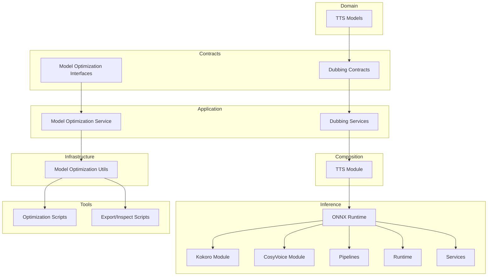
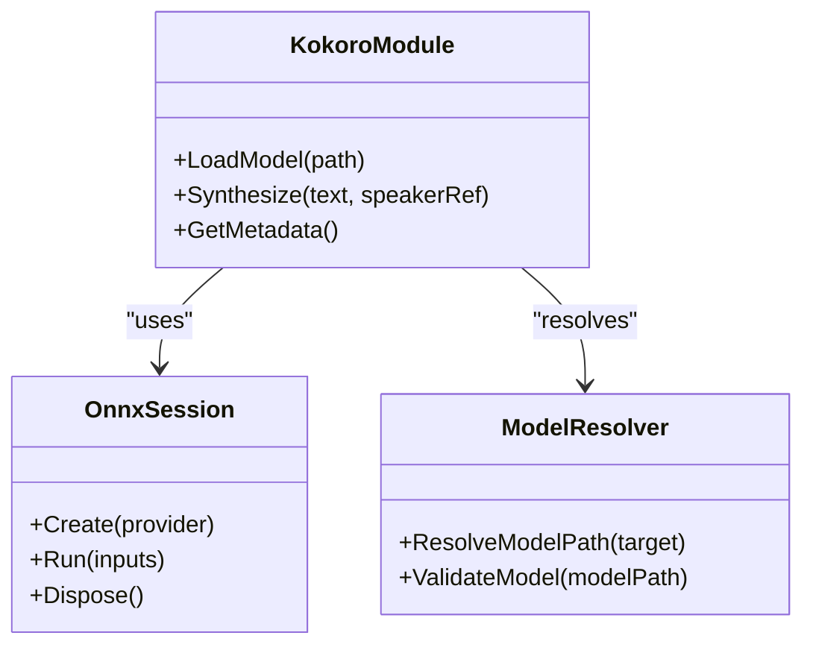
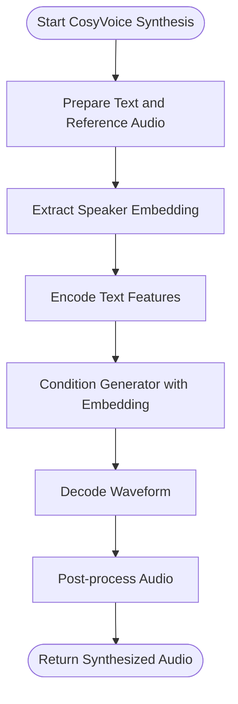
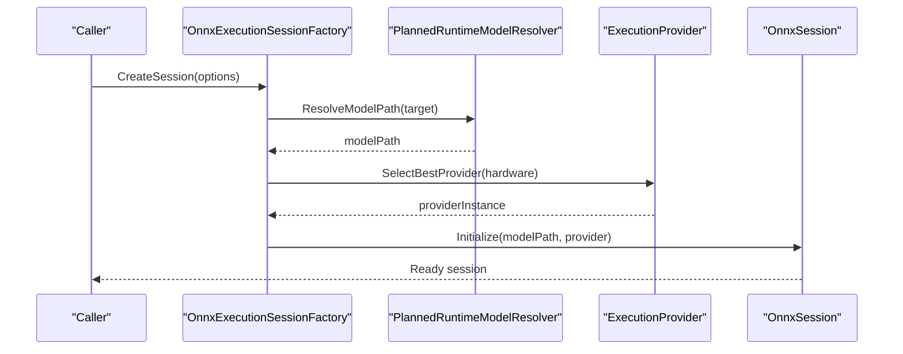
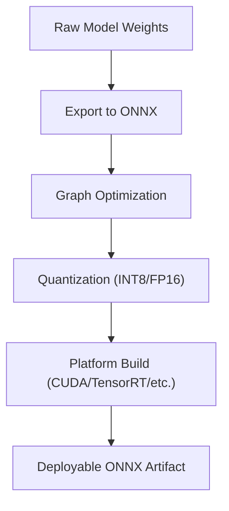
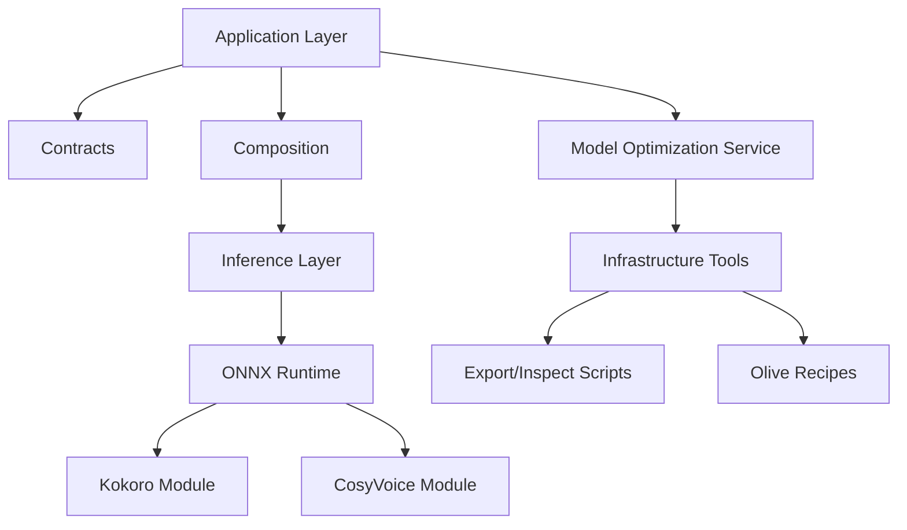

# Model Training & Fine-tuning

<cite>
**Referenced Files in This Document**
- [ADR-0005-kokoro-tts-architecture.md](file://docs/decisions/ADR-0005-kokoro-tts-architecture.md)
- [Trackdub.Inference.Onnx.csproj](file://src/Trackdub.Inference.Onnx/Trackdub.Inference.Onnx.csproj)
- [Kokoro directory](file://src/Trackdub.Inference.Onnx/Kokoro)
- [CosyVoice directory](file://src/Trackdub.Inference.Onnx/CosyVoice)
- [OnnxExecutionSessionFactory.cs](file://src/Trackdub.Inference.Onnx/OnnxExecutionSessionFactory.cs)
- [PlannedRuntimeModelResolver.cs](file://src/Trackdub.Inference.Onnx/PlannedRuntimeModelResolver.cs)
- [BenchmarkModelPathResolver.cs](file://src/Trackdub.Inference.Onnx/BenchmarkModelPathResolver.cs)
- [README.md](file://src/Trackdub.Inference.Onnx/README.md)
- [olive-recipes directory](file://resources/olive-recipes)
- [trackdub-optimize.ps1](file://tools/trackdub-optimize.ps1)
- [trackdub-optimize.sh](file://tools/trackdub-optimize.sh)
- [export-sepformer-onnx.py](file://scripts/export-sepformer-onnx.py)
- [inspect-deepfilternet-onnx.py](file://scripts/inspect-deepfilternet-onnx.py)
- [ADR-0009-gpu-memory-budget-planner.md](file://docs/decisions/ADR-0009-gpu-memory-budget-planner.md)
- [ADR-0012-wave-pcm16-loudness-policy.md](file://docs/decisions/ADR-0012-wave-pcm16-loudness-policy.md)
- [ADR-0015-pipeline-transient-telemetry.md](file://docs/decisions/ADR-0015-pipeline-transient-telemetry.md)
- [TTS domain models](file://src/Trackdub.Domain/Tts)
- [TTS contracts](file://src/Trackdub.Contracts/Dubbing)
- [TTS application services](file://src/Trackdub.Application/Dubbing)
- [Composition TTS module](file://src/Trackdub.Composition/Tts)
- [Inference pipelines](file://src/Trackdub.Inference/Pipelines)
- [Inference runtime](file://src/Trackdub.Inference/Runtime)
- [Inference services](file://src/Trackdub.Inference/Services)
- [Model optimization interfaces](file://src/Trackdub.Contracts/ModelOptimization)
- [Model optimization implementations](file://src/Trackdub.Infrastructure/ModelOptimization)
- [Model optimization application service](file://src/Trackdub.Application/ModelOptimization)
</cite>

## Table of Contents
1. [Introduction](#introduction)
2. [Project Structure](#project-structure)
3. [Core Components](#core-components)
4. [Architecture Overview](#architecture-overview)
5. [Detailed Component Analysis](#detailed-component-analysis)
6. [Dependency Analysis](#dependency-analysis)
7. [Performance Considerations](#performance-considerations)
8. [Troubleshooting Guide](#troubleshooting-guide)
9. [Conclusion](#conclusion)
10. [Appendices](#appendices)

## Introduction
This document explains how Trackdub trains and fine-tunes voice models for text-to-speech (TTS), focusing on Kokoro and CosyVoice architectures, the training pipeline from raw audio to optimized ONNX artifacts, hyperparameter tuning, duration optimization, quality assessment, fine-tuning workflows, quantization/compression, and deployment optimization. It also provides troubleshooting guidance for common training issues, convergence problems, and quality degradation scenarios.

## Project Structure
The relevant code for model training, fine-tuning, and optimization is distributed across several layers:
- Domain and contracts define TTS entities and interfaces for model optimization and inference.
- Application layer orchestrates training/fine-tuning workflows and integrates with optimization tools.
- Composition wires up providers and runtime selection.
- Inference layer implements ONNX execution, including Kokoro and CosyVoice modules.
- Infrastructure provides model optimization utilities and tooling integration.
- Tools and scripts support export, inspection, and optimization of ONNX models.



**Diagram sources**
- [Trackdub.Inference.Onnx.csproj](file://src/Trackdub.Inference.Onnx/Trackdub.Inference.Onnx.csproj)
- [README.md](file://src/Trackdub.Inference.Onnx/README.md)

**Section sources**
- [Trackdub.Inference.Onnx.csproj](file://src/Trackdub.Inference.Onnx/Trackdub.Inference.Onnx.csproj)
- [README.md](file://src/Trackdub.Inference.Onnx/README.md)

## Core Components
- Kokoro TTS module: Implements ONNX-based inference for Kokoro TTS within Trackdub’s inference stack.
- CosyVoice module: Provides ONNX-based inference for CosyVoice, enabling voice cloning capabilities.
- ONNX execution factory and model resolvers: Manage session creation, provider selection, and model path resolution for optimal runtime performance.
- Model optimization utilities: Integrate with external tools (e.g., Olive) to produce optimized ONNX artifacts.
- Export/inspect scripts: Convert and validate intermediate models into ONNX format suitable for deployment.

Key responsibilities:
- Provide consistent inference APIs for Kokoro and CosyVoice.
- Resolve and load optimized ONNX models at runtime.
- Support quantization and compression via infrastructure tooling.
- Expose telemetry and diagnostics for training and inference monitoring.

**Section sources**
- [Kokoro directory](file://src/Trackdub.Inference.Onnx/Kokoro)
- [CosyVoice directory](file://src/Trackdub.Inference.Onnx/CosyVoice)
- [OnnxExecutionSessionFactory.cs](file://src/Trackdub.Inference.Onnx/OnnxExecutionSessionFactory.cs)
- [PlannedRuntimeModelResolver.cs](file://src/Trackdub.Inference.Onnx/PlannedRuntimeModelResolver.cs)
- [BenchmarkModelPathResolver.cs](file://src/Trackdub.Inference.Onnx/BenchmarkModelPathResolver.cs)

## Architecture Overview
The training and fine-tuning architecture spans data preparation, model adaptation, optimization, and deployment:

```mermaid
sequenceDiagram
participant User as "User/CLI"
participant App as "Application Layer"
participant Opt as "Model Optimization Service"
participant Infra as "Infrastructure Tools"
participant Onnx as "ONNX Runtime"
participant Kokoro as "Kokoro Module"
participant Cosy as "CosyVoice Module"
User->>App : Start training/fine-tuning job
App->>Opt : Configure dataset, hyperparameters, target device
Opt->>Infra : Invoke export/inspect/optimization scripts
Infra-->>Opt : Produce optimized ONNX artifacts
Opt-->>App : Return model manifest and paths
App->>Onnx : Create execution session with provider
Onnx->>Kokoro : Load Kokoro ONNX model
Onnx->>Cosy : Load CosyVoice ONNX model
App-->>User : Report progress, metrics, and outputs
```

**Diagram sources**
- [OnnxExecutionSessionFactory.cs](file://src/Trackdub.Inference.Onnx/OnnxExecutionSessionFactory.cs)
- [PlannedRuntimeModelResolver.cs](file://src/Trackdub.Inference.Onnx/PlannedRuntimeModelResolver.cs)
- [export-sepformer-onnx.py](file://scripts/export-sepformer-onnx.py)
- [inspect-deepfilternet-onnx.py](file://scripts/inspect-deepfilternet-onnx.py)

## Detailed Component Analysis

### Kokoro TTS Integration
Kokoro is integrated as an ONNX-based TTS engine within Trackdub’s inference layer. The module encapsulates model loading, preprocessing, and synthesis steps, exposing a clean API for higher-level dubbing services.



**Diagram sources**
- [Kokoro directory](file://src/Trackdub.Inference.Onnx/Kokoro)
- [OnnxExecutionSessionFactory.cs](file://src/Trackdub.Inference.Onnx/OnnxExecutionSessionFactory.cs)
- [PlannedRuntimeModelResolver.cs](file://src/Trackdub.Inference.Onnx/PlannedRuntimeModelResolver.cs)

**Section sources**
- [Kokoro directory](file://src/Trackdub.Inference.Onnx/Kokoro)
- [OnnxExecutionSessionFactory.cs](file://src/Trackdub.Inference.Onnx/OnnxExecutionSessionFactory.cs)
- [PlannedRuntimeModelResolver.cs](file://src/Trackdub.Inference.Onnx/PlannedRuntimeModelResolver.cs)

### CosyVoice Voice Cloning Integration
CosyVoice enables voice cloning by leveraging reference audio to adapt synthesized speech characteristics. The module handles reference extraction, embedding generation, and conditional synthesis through ONNX execution.



**Diagram sources**
- [CosyVoice directory](file://src/Trackdub.Inference.Onnx/CosyVoice)
- [OnnxExecutionSessionFactory.cs](file://src/Trackdub.Inference.Onnx/OnnxExecutionSessionFactory.cs)

**Section sources**
- [CosyVoice directory](file://src/Trackdub.Inference.Onnx/CosyVoice)
- [OnnxExecutionSessionFactory.cs](file://src/Trackdub.Inference.Onnx/OnnxExecutionSessionFactory.cs)

### ONNX Execution Factory and Model Resolution
The ONNX execution factory manages provider selection (CPU, CUDA, TensorRT, etc.) and session lifecycle. The planned runtime model resolver selects appropriate model variants based on hardware capabilities and optimization targets.



**Diagram sources**
- [OnnxExecutionSessionFactory.cs](file://src/Trackdub.Inference.Onnx/OnnxExecutionSessionFactory.cs)
- [PlannedRuntimeModelResolver.cs](file://src/Trackdub.Inference.Onnx/PlannedRuntimeModelResolver.cs)

**Section sources**
- [OnnxExecutionSessionFactory.cs](file://src/Trackdub.Inference.Onnx/OnnxExecutionSessionFactory.cs)
- [PlannedRuntimeModelResolver.cs](file://src/Trackdub.Inference.Onnx/PlannedRuntimeModelResolver.cs)

### Model Optimization Pipeline
Trackdub uses infrastructure utilities and external tools to convert and optimize models into ONNX format. Olive recipes and custom scripts facilitate quantization, graph optimizations, and platform-specific builds.



**Diagram sources**
- [olive-recipes directory](file://resources/olive-recipes)
- [trackdub-optimize.ps1](file://tools/trackdub-optimize.ps1)
- [trackdub-optimize.sh](file://tools/trackdub-optimize.sh)
- [export-sepformer-onnx.py](file://scripts/export-sepformer-onnx.py)
- [inspect-deepfilternet-onnx.py](file://scripts/inspect-deepfilternet-onnx.py)

**Section sources**
- [olive-recipes directory](file://resources/olive-recipes)
- [trackdub-optimize.ps1](file://tools/trackdub-optimize.ps1)
- [trackdub-optimize.sh](file://tools/trackdub-optimize.sh)
- [export-sepformer-onnx.py](file://scripts/export-sepformer-onnx.py)
- [inspect-deepfilternet-onnx.py](file://scripts/inspect-deepfilternet-onnx.py)

### Training and Fine-tuning Workflows
Training and fine-tuning are orchestrated by application services that coordinate dataset ingestion, hyperparameter configuration, and optimization steps. The workflow supports both full training from scratch and fine-tuning existing models with new voice data.

```mermaid
sequenceDiagram
participant User as "User"
participant App as "Application Service"
participant Data as "Dataset Manager"
participant Trainer as "Training Engine"
participant Opt as "Optimization Service"
participant Store as "Artifact Store"
User->>App : Submit training/fine-tuning request
App->>Data : Validate and prepare dataset
Data-->>App : Dataset manifest
App->>Trainer : Configure hyperparameters and epochs
Trainer-->>App : Checkpoints and logs
App->>Opt : Optimize final checkpoint to ONNX
Opt-->>App : Optimized model artifacts
App->>Store : Persist artifacts and metadata
App-->>User : Completion report and links
```

**Diagram sources**
- [TTS application services](file://src/Trackdub.Application/Dubbing)
- [Model optimization application service](file://src/Trackdub.Application/ModelOptimization)
- [Model optimization interfaces](file://src/Trackdub.Contracts/ModelOptimization)

**Section sources**
- [TTS application services](file://src/Trackdub.Application/Dubbing)
- [Model optimization application service](file://src/Trackdub.Application/ModelOptimization)
- [Model optimization interfaces](file://src/Trackdub.Contracts/ModelOptimization)

### Hyperparameter Tuning and Duration Optimization
Hyperparameter tuning involves adjusting learning rates, batch sizes, and regularization terms to balance convergence speed and generalization. Duration optimization focuses on aligning synthesized speech timing with source transcripts, minimizing drift and improving naturalness.

Guidance:
- Use validation loss curves to detect overfitting or underfitting.
- Employ early stopping based on validation metrics to prevent overtraining.
- Monitor synthesis duration vs. transcript length to ensure accurate pacing.
- Tune prosody parameters (pitch, energy, speaking rate) for better expressiveness.

[No sources needed since this section provides general guidance]

### Quality Assessment Metrics
Quality assessment combines objective and subjective measures:
- Objective: PESQ, STOI, MOS-like proxies,WER alignment error, duration deviation.
- Subjective: ABX testing, listener preference surveys, naturalness ratings.

Integration points:
- Telemetry captures training losses and validation scores.
- Benchmarking tools evaluate latency and throughput for deployed models.

**Section sources**
- [ADR-0015-pipeline-transient-telemetry.md](file://docs/decisions/ADR-0015-pipeline-transient-telemetry.md)

### Fine-tuning Process for New Voices
Fine-tuning adapts pre-trained Kokoro or CosyVoice models to new speakers using reference audio and target transcripts:
- Prepare high-quality reference clips and aligned transcripts.
- Extract speaker embeddings (for CosyVoice) or style tokens (for Kokoro).
- Run fine-tuning with reduced learning rate and limited epochs to avoid catastrophic forgetting.
- Validate on held-out samples and compare against baseline quality.

**Section sources**
- [CosyVoice directory](file://src/Trackdub.Inference.Onnx/CosyVoice)
- [Kokoro directory](file://src/Trackdub.Inference.Onnx/Kokoro)

### Model Quantization, Compression, and Deployment Optimization
Quantization reduces model size and improves inference speed:
- INT8 quantization for CPU and edge devices.
- FP16 for GPU acceleration where supported.
- Graph pruning and operator fusion via Olive recipes.

Deployment considerations:
- Choose execution providers based on target hardware (CPU, CUDA, TensorRT).
- Cache model sessions to reduce startup latency.
- Profile memory usage and adjust batch sizes accordingly.

**Section sources**
- [olive-recipes directory](file://resources/olive-recipes)
- [OnnxExecutionSessionFactory.cs](file://src/Trackdub.Inference.Onnx/OnnxExecutionSessionFactory.cs)
- [PlannedRuntimeModelResolver.cs](file://src/Trackdub.Inference.Onnx/PlannedRuntimeModelResolver.cs)

## Dependency Analysis
The following diagram illustrates key dependencies between components involved in training, fine-tuning, and inference:



**Diagram sources**
- [Trackdub.Inference.Onnx.csproj](file://src/Trackdub.Inference.Onnx/Trackdub.Inference.Onnx.csproj)
- [README.md](file://src/Trackdub.Inference.Onnx/README.md)

**Section sources**
- [Trackdub.Inference.Onnx.csproj](file://src/Trackdub.Inference.Onnx/Trackdub.Inference.Onnx.csproj)
- [README.md](file://src/Trackdub.Inference.Onnx/README.md)

## Performance Considerations
- Memory budget planning: Allocate GPU memory carefully to avoid OOM during training and large-batch inference.
- Loudness normalization: Ensure consistent audio levels across datasets to improve training stability.
- Telemetry: Capture transient metrics to diagnose bottlenecks and track convergence.

**Section sources**
- [ADR-0009-gpu-memory-budget-planner.md](file://docs/decisions/ADR-0009-gpu-memory-budget-planner.md)
- [ADR-0012-wave-pcm16-loudness-policy.md](file://docs/decisions/ADR-0012-wave-pcm16-loudness-policy.md)
- [ADR-0015-pipeline-transient-telemetry.md](file://docs/decisions/ADR-0015-pipeline-transient-telemetry.md)

## Troubleshooting Guide
Common issues and resolutions:
- Convergence problems:
  - Symptom: Loss plateaus or diverges.
  - Action: Reduce learning rate, increase batch size, check data quality, verify gradient clipping.
- Quality degradation:
  - Symptom: Muffled or robotic output.
  - Action: Increase reference audio quality, adjust prosody parameters, validate phoneme alignment.
- Runtime errors:
  - Symptom: ONNX session fails to initialize.
  - Action: Verify model path, provider availability, and input tensor shapes.
- Performance bottlenecks:
  - Symptom: Slow inference or training.
  - Action: Enable quantization, switch to faster execution provider, profile memory usage.

**Section sources**
- [OnnxExecutionSessionFactory.cs](file://src/Trackdub.Inference.Onnx/OnnxExecutionSessionFactory.cs)
- [PlannedRuntimeModelResolver.cs](file://src/Trackdub.Inference.Onnx/PlannedRuntimeModelResolver.cs)
- [ADR-0009-gpu-memory-budget-planner.md](file://docs/decisions/ADR-0009-gpu-memory-budget-planner.md)

## Conclusion
Trackdub’s voice model training and fine-tuning pipeline integrates Kokoro and CosyVoice architectures within a robust ONNX-based inference stack. By leveraging infrastructure tools and optimization scripts, it delivers deployable, high-performance models tailored to diverse hardware environments. Proper hyperparameter tuning, quality assessment, and troubleshooting practices ensure reliable convergence and superior synthesis quality.

## Appendices
- Kokoro TTS architecture decision: [ADR-0005-kokoro-tts-architecture.md](file://docs/decisions/ADR-0005-kokoro-tts-architecture.md)
- Inference README for ONNX runtime details: [README.md](file://src/Trackdub.Inference.Onnx/README.md)