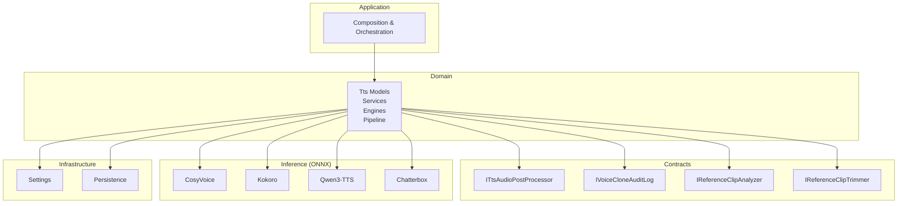
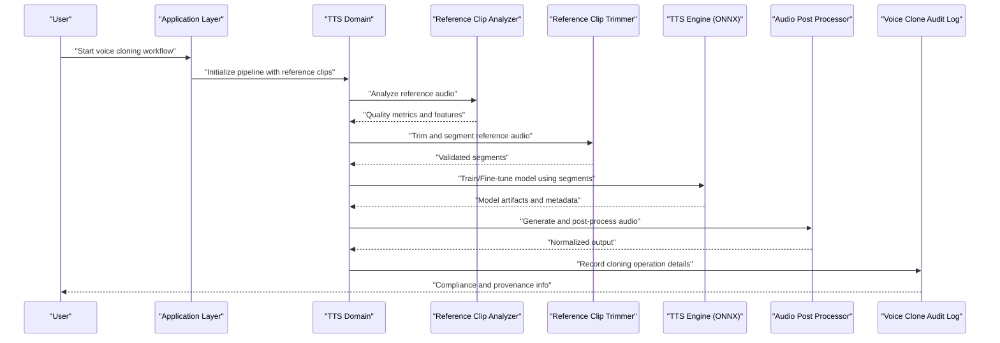
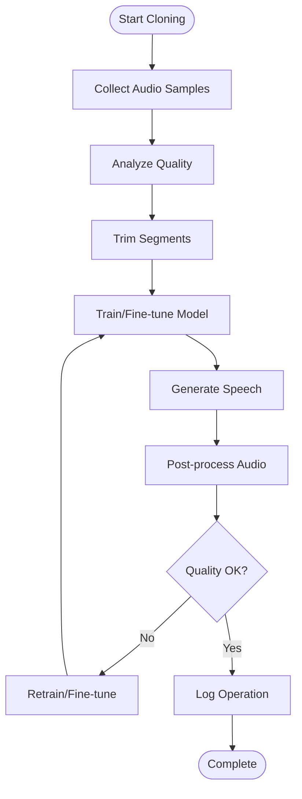
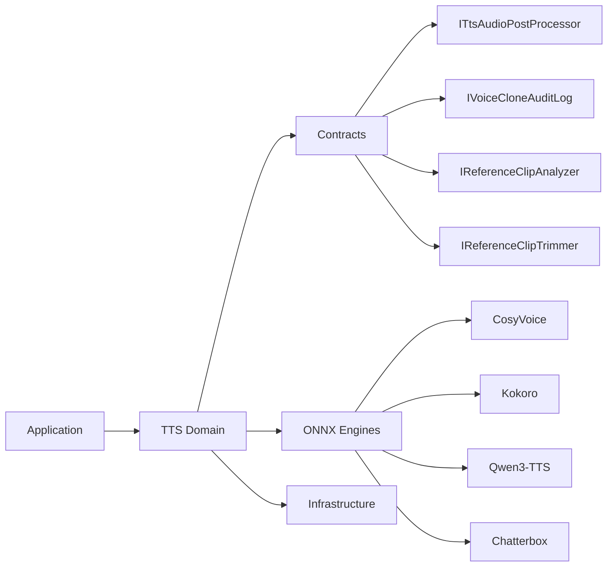

# Voice Cloning & Custom Voices

<cite>
**Referenced Files in This Document**
- [README.md](file://README.md)
- [Trackdub.Application.csproj](file://src/Trackdub.Application/Trackdub.Application.csproj)
- [Trackdub.Domain.csproj](file://src/Trackdub.Domain/Trackdub.Domain.csproj)
- [Trackdub.Inference.Onnx.csproj](file://src/Trackdub.Inference.Onnx/Trackdub.Inference.Onnx.csproj)
- [Trackdub.Infrastructure.csproj](file://src/Trackdub.Infrastructure/Trackdub.Infrastructure.csproj)
- [Trackdub.Contracts.csproj](file://src/Trackdub.Contracts/Trackdub.Contracts.csproj)
- [ADR-0005-kokoro-tts-architecture.md](file://docs/decisions/ADR-0005-kokoro-tts-architecture.md)
- [ADR-0006-chatterbox-commercial-use-verification.md](file://docs/decisions/ADR-0006-chatterbox-commercial-use-verification.md)
- [ADR-0012-wave-pcm16-loudness-policy.md](file://docs/decisions/ADR-0012-wave-pcm16-loudness-policy.md)
- [windows-ml-stage-provider-matrix.md](file://docs/reference/windows-ml-stage-provider-matrix.md)
- [windows-ml-phase-5-catalog-eps.md](file://docs/reference/windows-ml-phase-5-catalog-eps.md)
- [TTS README](file://src/Trackdub.Domain/Tts/README.md)
- [TTS Models README](file://src/Trackdub.Domain/Tts/Models/README.md)
- [TTS Services README](file://src/Trackdub.Domain/Tts/Services/README.md)
- [TTS Engines README](file://src/Trackdub.Domain/Tts/Engines/README.md)
- [TTS Pipeline README](file://src/Trackdub.Domain/Tts/Pipeline/README.md)
- [TtsAudioPostProcessor.cs](file://src/Trackdub.Contracts/ITtsAudioPostProcessor.cs)
- [IVoiceCloneAuditLog.cs](file://src/Trackdub.Contracts/IVoiceCloneAuditLog.cs)
- [IReferenceClipAnalyzer.cs](file://src/Trackdub.Contracts/IReferenceClipAnalyzer.cs)
- [IReferenceClipTrimmer.cs](file://src/Trackdub.Contracts/IReferenceClipTrimmer.cs)
- [CosyVoice Directory](file://src/Trackdub.Inference.Onnx/CosyVoice/)
- [Kokoro Directory](file://src/Trackdub.Inference.Onnx/Kokoro/)
- [Qwen3Tts Directory](file://src/Trackdub.Inference.Onnx/Qwen3Tts/)
- [Chatterbox Directory](file://src/Trackdub.Inference.Onnx/Chatterbox/)
</cite>

## Table of Contents
1. [Introduction](#introduction)
2. [Project Structure](#project-structure)
3. [Core Components](#core-components)
4. [Architecture Overview](#architecture-overview)
5. [Detailed Component Analysis](#detailed-component-analysis)
6. [Dependency Analysis](#dependency-analysis)
7. [Performance Considerations](#performance-considerations)
8. [Troubleshooting Guide](#troubleshooting-guide)
9. [Conclusion](#conclusion)
10. [Appendices](#appendices)

## Introduction
This document explains how Trackdub supports voice cloning and custom voice creation, including the end-to-end process from audio sample collection to model training, fine-tuning, optimization, style transfer, accent adaptation, emotional tone control, catalog management, metadata, versioning, validation, licensing, and ethical usage guidelines. It is intended for both technical users who implement or extend TTS pipelines and non-technical users who need to understand requirements and best practices for high-quality cloned voices.

## Project Structure
Trackdub organizes voice synthesis and cloning across several layers:
- Domain layer defines TTS concepts, models, services, engines, and pipeline orchestration.
- Contracts define interfaces for post-processing, audit logging, reference clip analysis, and trimming.
- Inference layer implements ONNX-based engines (e.g., CosyVoice, Kokoro, Qwen3-TTS, Chatterbox).
- Infrastructure provides persistence, settings, and runtime support.
- Application composes services and orchestrates workflows.

**Diagram sources**
- [Trackdub.Domain.csproj](file://src/Trackdub.Domain/Trackdub.Domain.csproj)
- [Trackdub.Contracts.csproj](file://src/Trackdub.Contracts/Trackdub.Contracts.csproj)
- [Trackdub.Inference.Onnx.csproj](file://src/Trackdub.Inference.Onnx/Trackdub.Inference.Onnx.csproj)
- [Trackdub.Infrastructure.csproj](file://src/Trackdub.Infrastructure/Trackdub.Infrastructure.csproj)
- [Trackdub.Application.csproj](file://src/Trackdub.Application/Trackdub.Application.csproj)

**Section sources**
- [README.md](file://README.md)
- [Trackdub.Domain.csproj](file://src/Trackdub.Domain/Trackdub.Domain.csproj)
- [Trackdub.Contracts.csproj](file://src/Trackdub.Contracts/Trackdub.Contracts.csproj)
- [Trackdub.Inference.Onnx.csproj](file://src/Trackdub.Inference.Onnx/Trackdub.Inference.Onnx.csproj)
- [Trackdub.Infrastructure.csproj](file://src/Trackdub.Infrastructure/Trackdub.Infrastructure.csproj)
- [Trackdub.Application.csproj](file://src/Trackdub.Application/Trackdub.Application.csproj)

## Core Components
- TTS domain models, services, engines, and pipeline orchestration define the voice synthesis workflow and data contracts.
- Contract interfaces standardize post-processing, audit logging, and reference clip handling used by multiple engines.
- ONNX inference engines encapsulate specific TTS implementations and their runtime behaviors.
- Infrastructure and application layers provide configuration, persistence, and orchestration.

Key responsibilities:
- Reference clip analysis and trimming to prepare high-quality samples for cloning.
- Post-processing to ensure consistent output quality and loudness.
- Audit logging to track cloning operations for compliance and reproducibility.
- Engine selection and execution based on hardware capabilities and model availability.

**Section sources**
- [TTS README](file://src/Trackdub.Domain/Tts/README.md)
- [TTS Models README](file://src/Trackdub.Domain/Tts/Models/README.md)
- [TTS Services README](file://src/Trackdub.Domain/Tts/Services/README.md)
- [TTS Engines README](file://src/Trackdub.Domain/Tts/Engines/README.md)
- [TTS Pipeline README](file://src/Trackdub.Domain/Tts/Pipeline/README.md)
- [TtsAudioPostProcessor.cs](file://src/Trackdub.Contracts/ITtsAudioPostProcessor.cs)
- [IVoiceCloneAuditLog.cs](file://src/Trackdub.Contracts/IVoiceCloneAuditLog.cs)
- [IReferenceClipAnalyzer.cs](file://src/Trackdub.Contracts/IReferenceClipAnalyzer.cs)
- [IReferenceClipTrimmer.cs](file://src/Trackdub.Contracts/IReferenceClipTrimmer.cs)

## Architecture Overview
The voice cloning architecture integrates reference audio processing, model training/fine-tuning, inference via ONNX engines, and post-processing with standardized contracts. The system supports multiple TTS backends and enforces quality and compliance through audit logs and policy decisions.

**Diagram sources**
- [TTS Pipeline README](file://src/Trackdub.Domain/Tts/Pipeline/README.md)
- [IReferenceClipAnalyzer.cs](file://src/Trackdub.Contracts/IReferenceClipAnalyzer.cs)
- [IReferenceClipTrimmer.cs](file://src/Trackdub.Contracts/IReferenceClipTrimmer.cs)
- [TtsAudioPostProcessor.cs](file://src/Trackdub.Contracts/ITtsAudioPostProcessor.cs)
- [IVoiceCloneAuditLog.cs](file://src/Trackdub.Contracts/IVoiceCloneAuditLog.cs)

## Detailed Component Analysis

### Voice Cloning Process
- Input preparation: Collect clean speech samples; analyze quality; trim to relevant segments.
- Model training/fine-tuning: Use validated segments to train or adapt a base TTS model.
- Inference: Generate speech from text using selected engine; apply post-processing.
- Validation and audit: Verify output quality; log operations for compliance.

**Diagram sources**
- [IReferenceClipAnalyzer.cs](file://src/Trackdub.Contracts/IReferenceClipAnalyzer.cs)
- [IReferenceClipTrimmer.cs](file://src/Trackdub.Contracts/IReferenceClipTrimmer.cs)
- [TtsAudioPostProcessor.cs](file://src/Trackdub.Contracts/ITtsAudioPostProcessor.cs)
- [IVoiceCloneAuditLog.cs](file://src/Trackdub.Contracts/IVoiceCloneAuditLog.cs)

**Section sources**
- [TTS Pipeline README](file://src/Trackdub.Domain/Tts/Pipeline/README.md)
- [IReferenceClipAnalyzer.cs](file://src/Trackdub.Contracts/IReferenceClipAnalyzer.cs)
- [IReferenceClipTrimmer.cs](file://src/Trackdub.Contracts/IReferenceClipTrimmer.cs)
- [TtsAudioPostProcessor.cs](file://src/Trackdub.Contracts/ITtsAudioPostProcessor.cs)
- [IVoiceCloneAuditLog.cs](file://src/Trackdub.Contracts/IVoiceCloneAuditLog.cs)

### Required Audio Samples and Quality Requirements
- Sample characteristics: Clear speech, minimal background noise, consistent recording conditions.
- Duration and diversity: Sufficient length and variety to capture phonetic coverage and prosody.
- Preprocessing: Normalize loudness, remove silence, segment into coherent utterances.
- Validation: Automated checks for SNR, duration, and content consistency before training.

**Section sources**
- [ADR-0012-wave-pcm16-loudness-policy.md](file://docs/decisions/ADR-0012-wave-pcm16-loudness-policy.md)
- [IReferenceClipAnalyzer.cs](file://src/Trackdub.Contracts/IReferenceClipAnalyzer.cs)
- [IReferenceClipTrimmer.cs](file://src/Trackdub.Contracts/IReferenceClipTrimmer.cs)

### Voice Model Training, Fine-tuning, and Optimization
- Base models: Select appropriate TTS backbone (e.g., CosyVoice, Kokoro, Qwen3-TTS).
- Fine-tuning: Adapt to target speaker using curated reference segments.
- Optimization: Quantization, graph optimizations, and execution provider selection for performance.
- Hardware considerations: GPU acceleration where available; fallback strategies for CPU-only environments.

**Section sources**
- [CosyVoice Directory](file://src/Trackdub.Inference.Onnx/CosyVoice/)
- [Kokoro Directory](file://src/Trackdub.Inference.Onnx/Kokoro/)
- [Qwen3Tts Directory](file://src/Trackdub.Inference.Onnx/Qwen3Tts/)
- [windows-ml-stage-provider-matrix.md](file://docs/reference/windows-ml-stage-provider-matrix.md)
- [windows-ml-phase-5-catalog-eps.md](file://docs/reference/windows-ml-phase-5-catalog-eps.md)

### Voice Style Transfer, Accent Adaptation, and Emotional Tone Control
- Style transfer: Encode speaker style from reference audio and apply during synthesis.
- Accent adaptation: Adjust phoneme realization and prosodic patterns to match target accents.
- Emotional tone: Modulate pitch, tempo, and intensity to convey desired emotions.
- Controls: Expose parameters for style strength, accent weight, and emotion intensity.

**Section sources**
- [TTS Engines README](file://src/Trackdub.Domain/Tts/Engines/README.md)
- [TTS Models README](file://src/Trackdub.Domain/Tts/Models/README.md)

### Voice Catalog Management, Metadata, and Versioning
- Catalog entries: Store voice identity, source references, training artifacts, and metadata.
- Metadata fields: Speaker ID, language, gender cues, accent tags, emotion profiles, license info.
- Versioning: Track model versions, training runs, and dataset revisions for reproducibility.
- Lifecycle: Create, validate, publish, deprecate, and archive voice models.

**Section sources**
- [TTS Models README](file://src/Trackdub.Domain/Tts/Models/README.md)
- [IVoiceCloneAuditLog.cs](file://src/Trackdub.Contracts/IVoiceCloneAuditLog.cs)

### Data Collection, Preprocessing, and Validation
- Collection guidelines: High-fidelity recordings, controlled environments, diverse content.
- Preprocessing steps: Noise reduction, normalization, segmentation, labeling.
- Validation checks: Automated metrics for clarity, duration, and content integrity.
- Human review: Optional QA pass for critical voices.

**Section sources**
- [IReferenceClipAnalyzer.cs](file://src/Trackdub.Contracts/IReferenceClipAnalyzer.cs)
- [IReferenceClipTrimmer.cs](file://src/Trackdub.Contracts/IReferenceClipTrimmer.cs)
- [ADR-0012-wave-pcm16-loudness-policy.md](file://docs/decisions/ADR-0012-wave-pcm16-loudness-policy.md)

### Licensing Considerations, Ethical Usage, and Commercial Distribution Rights
- License verification: Ensure TTS engines and models comply with usage policies.
- Ethical guidelines: Consent for voice cloning, avoid misuse, respect privacy.
- Commercial rights: Confirm distribution permissions for cloned voices and outputs.
- Compliance logging: Record provenance and consent for auditable use.

**Section sources**
- [ADR-0006-chatterbox-commercial-use-verification.md](file://docs/decisions/ADR-0006-chatterbox-commercial-use-verification.md)
- [ADR-0005-kokoro-tts-architecture.md](file://docs/decisions/ADR-0005-kokoro-tts-architecture.md)
- [IVoiceCloneAuditLog.cs](file://src/Trackdub.Contracts/IVoiceCloneAuditLog.cs)

## Dependency Analysis
The TTS subsystem depends on contract interfaces for standardized behavior, ONNX engines for inference, and infrastructure for settings and persistence. Application composition wires these components together.

**Diagram sources**
- [Trackdub.Application.csproj](file://src/Trackdub.Application/Trackdub.Application.csproj)
- [Trackdub.Domain.csproj](file://src/Trackdub.Domain/Trackdub.Domain.csproj)
- [Trackdub.Contracts.csproj](file://src/Trackdub.Contracts/Trackdub.Contracts.csproj)
- [Trackdub.Inference.Onnx.csproj](file://src/Trackdub.Inference.Onnx/Trackdub.Inference.Onnx.csproj)
- [Trackdub.Infrastructure.csproj](file://src/Trackdub.Infrastructure/Trackdub.Infrastructure.csproj)

**Section sources**
- [Trackdub.Application.csproj](file://src/Trackdub.Application/Trackdub.Application.csproj)
- [Trackdub.Domain.csproj](file://src/Trackdub.Domain/Trackdub.Domain.csproj)
- [Trackdub.Contracts.csproj](file://src/Trackdub.Contracts/Trackdub.Contracts.csproj)
- [Trackdub.Inference.Onnx.csproj](file://src/Trackdub.Inference.Onnx/Trackdub.Inference.Onnx.csproj)
- [Trackdub.Infrastructure.csproj](file://src/Trackdub.Infrastructure/Trackdub.Infrastructure.csproj)

## Performance Considerations
- Execution providers: Prefer GPU acceleration when available; fall back to CPU if necessary.
- Model optimization: Apply quantization and graph-level optimizations to reduce latency.
- Batch processing: Group synthesis tasks to improve throughput.
- Memory budgeting: Monitor VRAM usage and adjust batch sizes accordingly.

[No sources needed since this section provides general guidance]

## Troubleshooting Guide
- Reference clip issues: Inspect quality metrics; re-trim segments; verify loudness normalization.
- Inference failures: Check engine availability, model paths, and hardware readiness.
- Output quality problems: Adjust post-processing parameters; refine training data; re-run fine-tuning.
- Compliance errors: Review audit logs; confirm licenses and consent records.

**Section sources**
- [IReferenceClipAnalyzer.cs](file://src/Trackdub.Contracts/IReferenceClipAnalyzer.cs)
- [IReferenceClipTrimmer.cs](file://src/Trackdub.Contracts/IReferenceClipTrimmer.cs)
- [TtsAudioPostProcessor.cs](file://src/Trackdub.Contracts/ITtsAudioPostProcessor.cs)
- [IVoiceCloneAuditLog.cs](file://src/Trackdub.Contracts/IVoiceCloneAuditLog.cs)

## Conclusion
Trackdub’s voice cloning and custom voice creation pipeline integrates robust preprocessing, flexible model training and fine-tuning, optimized inference across multiple ONNX engines, and standardized contracts for post-processing and auditing. By following the documented requirements and best practices, users can produce high-quality cloned voices while maintaining compliance and ethical standards.

[No sources needed since this section summarizes without analyzing specific files]

## Appendices
- ADRs and policies: Refer to architectural decision records for TTS architecture, commercial use verification, and loudness policy.
- Engine directories: Explore CosyVoice, Kokoro, Qwen3-TTS, and Chatterbox implementations for detailed configuration and usage.

**Section sources**
- [ADR-0005-kokoro-tts-architecture.md](file://docs/decisions/ADR-0005-kokoro-tts-architecture.md)
- [ADR-0006-chatterbox-commercial-use-verification.md](file://docs/decisions/ADR-0006-chatterbox-commercial-use-verification.md)
- [ADR-0012-wave-pcm16-loudness-policy.md](file://docs/decisions/ADR-0012-wave-pcm16-loudness-policy.md)
- [CosyVoice Directory](file://src/Trackdub.Inference.Onnx/CosyVoice/)
- [Kokoro Directory](file://src/Trackdub.Inference.Onnx/Kokoro/)
- [Qwen3Tts Directory](file://src/Trackdub.Inference.Onnx/Qwen3Tts/)
- [Chatterbox Directory](file://src/Trackdub.Inference.Onnx/Chatterbox/)