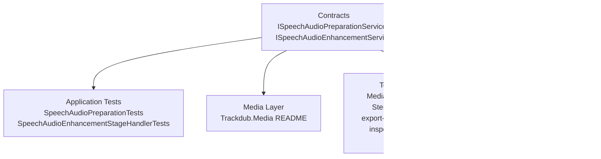
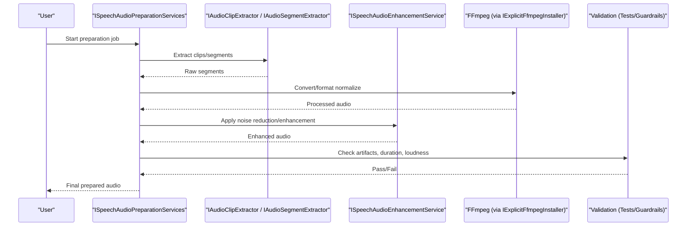
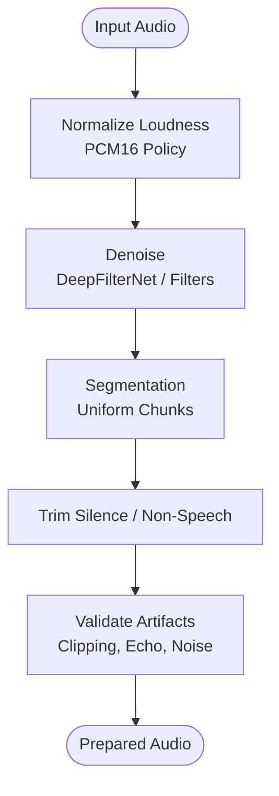
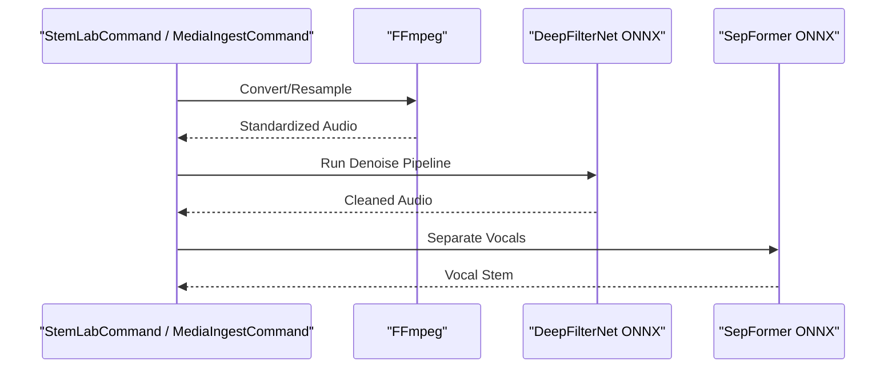
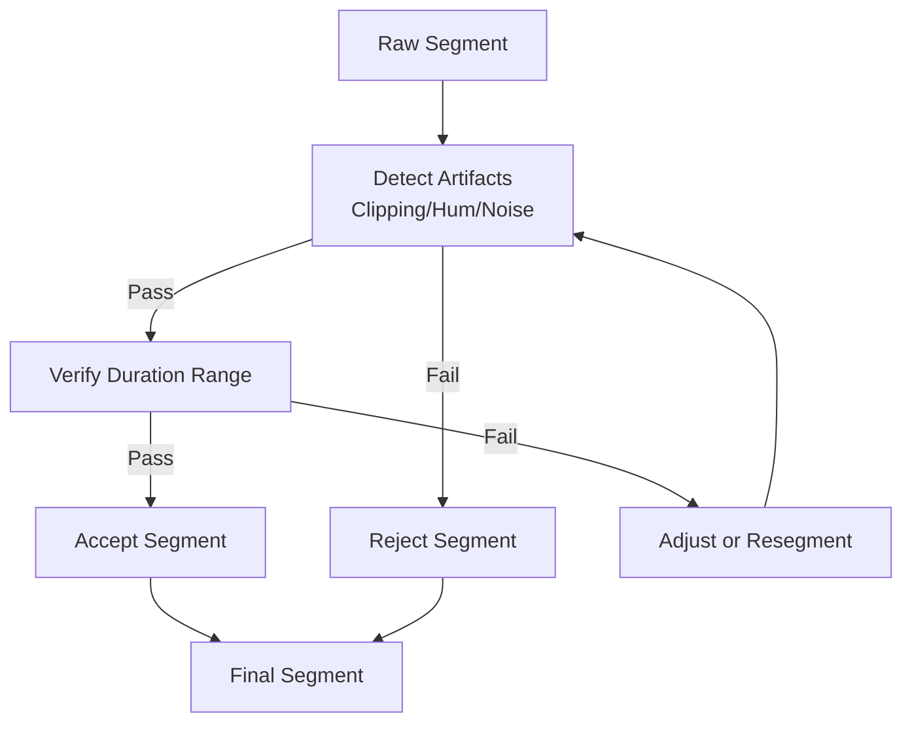
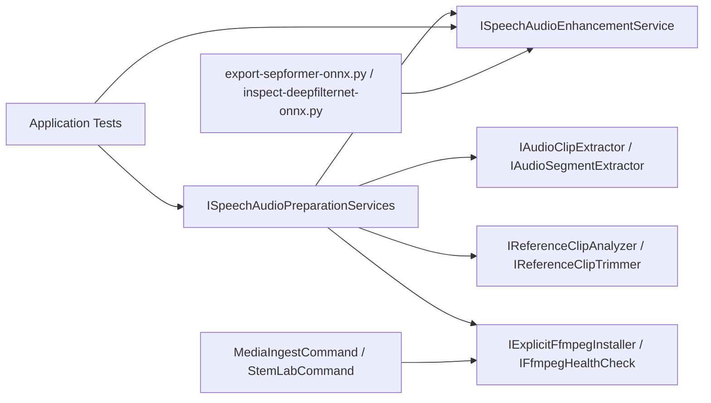

# Voice Data Preparation

<cite>
**Referenced Files in This Document**
- [Trackdub.Contracts.csproj](file://src/Trackdub.Contracts/Trackdub.Contracts.csproj)
- [ISpeechAudioPreparationServices.cs](file://src/Trackdub.Contracts/ISpeechAudioPreparationServices.cs)
- [ISpeechAudioEnhancementService.cs](file://src/Trackdub.Contracts/ISpeechAudioEnhancementService.cs)
- [IExplicitFfmpegInstaller.cs](file://src/Trackdub.Contracts/IExplicitFfmpegInstaller.cs)
- [IFfmpegHealthCheck.cs](file://src/Trackdub.Contracts/IFfmpegHealthCheck.cs)
- [IAudioClipExtractor.cs](file://src/Trackdub.Contracts/IAudioClipExtractor.cs)
- [IAudioSegmentExtractor.cs](file://src/Trackdub.Contracts/IAudioSegmentExtractor.cs)
- [IReferenceClipAnalyzer.cs](file://src/Trackdub.Contracts/IReferenceClipAnalyzer.cs)
- [IReferenceClipTrimmer.cs](file://src/Trackdub.Contracts/IReferenceClipTrimmer.cs)
- [SpeechAudioPreparationTests.cs](file://tests/Trackdub.Application.Tests/SpeechAudioPreparationTests.cs)
- [SpeechAudioPreparationGuardrailTests.cs](file://tests/Trackdub.Application.Tests/SpeechAudioPreparationGuardrailTests.cs)
- [SpeechAudioEnhancementStageHandlerTests.cs](file://tests/Trackdub.Application.Tests/SpeechAudioEnhancementStageHandlerTests.cs)
- [AudioArtifactValidatorTests.cs](file://tests/Trackdub.Application.Tests/AudioArtifactValidatorTests.cs)
- [DurationAnalysisServiceTests.cs](file://tests/Trackdub.Application.Tests/DurationAnalysisServiceTests.cs)
- [ADR-0012-wave-pcm16-loudness-policy.md](file://docs/decisions/ADR-0012-wave-pcm16-loudness-policy.md)
- [README.md](file://src/Trackdub.Media/README.md)
- [MediaIngestCommand.cs](file://src/Trackdub.Tools/MediaIngestCommand.cs)
- [StemLabCommand.cs](file://src/Trackdub.Tools/StemLabCommand.cs)
- [export-sepformer-onnx.py](file://scripts/export-sepformer-onnx.py)
- [inspect-deepfilternet-onnx.py](file://scripts/inspect-deepfilternet-onnx.py)
</cite>

## Table of Contents
1. [Introduction](#introduction)
2. [Project Structure](#project-structure)
3. [Core Components](#core-components)
4. [Architecture Overview](#architecture-overview)
5. [Detailed Component Analysis](#detailed-component-analysis)
6. [Dependency Analysis](#dependency-analysis)
7. [Performance Considerations](#performance-considerations)
8. [Troubleshooting Guide](#troubleshooting-guide)
9. [Conclusion](#conclusion)
10. [Appendices](#appendices)

## Introduction
This document explains how to prepare voice data for Trackdub’s voice cloning system. It covers input requirements, preprocessing steps (noise reduction, normalization, segmentation), best practices for collecting training data, audio enhancement using FFmpeg and built-in tools, validation techniques, and common issues such as background noise, echo, and inconsistent volume levels. The guidance is grounded in the repository’s contracts, tests, and tooling that implement speech preparation and enhancement stages.

## Project Structure
Voice data preparation spans several layers:
- Contracts define interfaces for preparation, enhancement, extraction, and analysis.
- Application tests validate behavior and guardrails for preparation and enhancement.
- Media utilities provide processing primitives and documentation.
- Tools and scripts support ingestion, stem separation, and model inspection.

**Diagram sources**
- [ISpeechAudioPreparationServices.cs](file://src/Trackdub.Contracts/ISpeechAudioPreparationServices.cs)
- [ISpeechAudioEnhancementService.cs](file://src/Trackdub.Contracts/ISpeechAudioEnhancementService.cs)
- [SpeechAudioPreparationTests.cs](file://tests/Trackdub.Application.Tests/SpeechAudioPreparationTests.cs)
- [SpeechAudioEnhancementStageHandlerTests.cs](file://tests/Trackdub.Application.Tests/SpeechAudioEnhancementStageHandlerTests.cs)
- [README.md](file://src/Trackdub.Media/README.md)
- [MediaIngestCommand.cs](file://src/Trackdub.Tools/MediaIngestCommand.cs)
- [StemLabCommand.cs](file://src/Trackdub.Tools/StemLabCommand.cs)
- [export-sepformer-onnx.py](file://scripts/export-sepformer-onnx.py)
- [inspect-deepfilternet-onnx.py](file://scripts/inspect-deepfilternet-onnx.py)
- [IExplicitFfmpegInstaller.cs](file://src/Trackdub.Contracts/IExplicitFfmpegInstaller.cs)
- [IFfmpegHealthCheck.cs](file://src/Trackdub.Contracts/IFfmpegHealthCheck.cs)

**Section sources**
- [Trackdub.Contracts.csproj](file://src/Trackdub.Contracts/Trackdub.Contracts.csproj)
- [README.md](file://src/Trackdub.Media/README.md)

## Core Components
The following interfaces and services are central to voice data preparation:
- Speech preparation orchestration: ISpeechAudioPreparationServices defines the pipeline entry points for preparing reference or training audio.
- Enhancement: ISpeechAudioEnhancementService encapsulates noise reduction, denoising, and other enhancements.
- Extraction and trimming: IAudioClipExtractor and IAudioSegmentExtractor handle clipping and segmenting; IReferenceClipAnalyzer and IReferenceClipTrimmer focus on reference clip quality and trimming.
- FFmpeg integration: IExplicitFfmpegInstaller and IFfmpegHealthCheck manage FFmpeg availability and health checks used by media processing.

These components collectively ensure consistent, high-quality audio inputs for downstream voice cloning models.

**Section sources**
- [ISpeechAudioPreparationServices.cs](file://src/Trackdub.Contracts/ISpeechAudioPreparationServices.cs)
- [ISpeechAudioEnhancementService.cs](file://src/Trackdub.Contracts/ISpeechAudioEnhancementService.cs)
- [IAudioClipExtractor.cs](file://src/Trackdub.Contracts/IAudioClipExtractor.cs)
- [IAudioSegmentExtractor.cs](file://src/Trackdub.Contracts/IAudioSegmentExtractor.cs)
- [IReferenceClipAnalyzer.cs](file://src/Trackdub.Contracts/IReferenceClipAnalyzer.cs)
- [IReferenceClipTrimmer.cs](file://src/Trackdub.Contracts/IReferenceClipTrimmer.cs)
- [IExplicitFfmpegInstaller.cs](file://src/Trackdub.Contracts/IExplicitFfmpegInstaller.cs)
- [IFfmpegHealthCheck.cs](file://src/Trackdub.Contracts/IFfmpegHealthCheck.cs)

## Architecture Overview
The voice data preparation flow integrates extraction, enhancement, normalization, segmentation, and validation. FFmpeg is used for format conversion and basic processing, while deep learning-based enhancement (e.g., DeepFilterNet) can be applied via ONNX pipelines exposed through the enhancement service.

**Diagram sources**
- [ISpeechAudioPreparationServices.cs](file://src/Trackdub.Contracts/ISpeechAudioPreparationServices.cs)
- [IAudioClipExtractor.cs](file://src/Trackdub.Contracts/IAudioClipExtractor.cs)
- [IAudioSegmentExtractor.cs](file://src/Trackdub.Contracts/IAudioSegmentExtractor.cs)
- [ISpeechAudioEnhancementService.cs](file://src/Trackdub.Contracts/ISpeechAudioEnhancementService.cs)
- [IExplicitFfmpegInstaller.cs](file://src/Trackdub.Contracts/IExplicitFfmpegInstaller.cs)
- [SpeechAudioPreparationTests.cs](file://tests/Trackdub.Application.Tests/SpeechAudioPreparationTests.cs)
- [SpeechAudioEnhancementStageHandlerTests.cs](file://tests/Trackdub.Application.Tests/SpeechAudioEnhancementStageHandlerTests.cs)

## Detailed Component Analysis

### Audio Input Requirements and Quality Standards
- Format specifications: Prefer PCM WAV files at 16-bit depth and a sample rate aligned with model expectations. Loudness policy and waveform standards are defined in the architecture decision record.
- Duration guidelines: Segments should be long enough to capture speaker characteristics but short enough to avoid excessive variability within a single clip. Use segmentation tools to split longer recordings into consistent chunks.
- Quality standards: Minimize background noise, avoid clipping, maintain consistent volume, and reduce echo/reverb. Ensure clean vocal presence without competing sounds.

Best practices for collection:
- Speaking styles: Include varied intonations, pacing, and emotional tones while keeping the speaker consistent.
- Content diversity: Cover different phonetic contexts, sentence lengths, and speaking rates.
- Environmental conditions: Record in quiet spaces with minimal reverb; use directional microphones when possible.

**Section sources**
- [ADR-0012-wave-pcm16-loudness-policy.md](file://docs/decisions/ADR-0012-wave-pcm16-loudness-policy.md)
- [SpeechAudioPreparationTests.cs](file://tests/Trackdub.Application.Tests/SpeechAudioPreparationTests.cs)
- [DurationAnalysisServiceTests.cs](file://tests/Trackdub.Application.Tests/DurationAnalysisServiceTests.cs)

### Audio Preprocessing Steps
- Noise reduction: Apply deep learning-based denoising via ISpeechAudioEnhancementService. For quick fixes, use FFmpeg filters where appropriate.
- Normalization: Follow the PCM16 loudness policy to achieve consistent perceived loudness across samples.
- Segmentation: Use IAudioSegmentExtractor to split continuous audio into uniform segments suitable for training. Trim silence and remove non-speech portions.
- Clipping: Use IAudioClipExtractor to isolate relevant portions and discard irrelevant content.

**Diagram sources**
- [ISpeechAudioEnhancementService.cs](file://src/Trackdub.Contracts/ISpeechAudioEnhancementService.cs)
- [IAudioSegmentExtractor.cs](file://src/Trackdub.Contracts/IAudioSegmentExtractor.cs)
- [IAudioClipExtractor.cs](file://src/Trackdub.Contracts/IAudioClipExtractor.cs)
- [ADR-0012-wave-pcm16-loudness-policy.md](file://docs/decisions/ADR-0012-wave-pcm16-loudness-policy.md)
- [SpeechAudioPreparationGuardrailTests.cs](file://tests/Trackdub.Application.Tests/SpeechAudioPreparationGuardrailTests.cs)

### Best Practices for Collecting Training Data
- Consistency: Keep recording equipment and environment stable across sessions.
- Diversity: Capture multiple topics, speaking speeds, and prosodic patterns to improve generalization.
- Cleanliness: Avoid overlapping voices, music, and heavy reverberation. If unavoidable, rely on enhancement tools to mitigate.
- Metadata: Tag samples with speaker ID, language, and context to aid curation and evaluation.

[No sources needed since this section provides general guidance]

### Audio Enhancement Techniques Using FFmpeg and Built-in Tools
- FFmpeg usage: Employ FFmpeg for format conversion, resampling, and basic filtering. Health checks and explicit installation are managed via IFfmpegHealthCheck and IExplicitFfmpegInstaller.
- DeepFilterNet: Inspect and export ONNX models using provided scripts to integrate advanced denoising.
- Stem separation: Use SepFormer-based separation to isolate vocals from background tracks.

**Diagram sources**
- [MediaIngestCommand.cs](file://src/Trackdub.Tools/MediaIngestCommand.cs)
- [StemLabCommand.cs](file://src/Trackdub.Tools/StemLabCommand.cs)
- [export-sepformer-onnx.py](file://scripts/export-sepformer-onnx.py)
- [inspect-deepfilternet-onnx.py](file://scripts/inspect-deepfilternet-onnx.py)
- [IExplicitFfmpegInstaller.cs](file://src/Trackdub.Contracts/IExplicitFfmpegInstaller.cs)
- [IFfmpegHealthCheck.cs](file://src/Trackdub.Contracts/IFfmpegHealthCheck.cs)

### Validating Audio Quality and Ensuring Consistent Recording Conditions
- Artifact detection: Use AudioArtifactValidatorTests patterns to detect clipping, hum, and unnatural artifacts introduced by processing.
- Duration checks: Validate segment durations align with expected ranges using DurationAnalysisServiceTests methodologies.
- Guardrails: Enforce preparation guardrails to reject low-quality inputs before training.

**Diagram sources**
- [AudioArtifactValidatorTests.cs](file://tests/Trackdub.Application.Tests/AudioArtifactValidatorTests.cs)
- [DurationAnalysisServiceTests.cs](file://tests/Trackdub.Application.Tests/DurationAnalysisServiceTests.cs)
- [SpeechAudioPreparationGuardrailTests.cs](file://tests/Trackdub.Application.Tests/SpeechAudioPreparationGuardrailTests.cs)

**Section sources**
- [AudioArtifactValidatorTests.cs](file://tests/Trackdub.Application.Tests/AudioArtifactValidatorTests.cs)
- [DurationAnalysisServiceTests.cs](file://tests/Trackdub.Application.Tests/DurationAnalysisServiceTests.cs)
- [SpeechAudioPreparationGuardrailTests.cs](file://tests/Trackdub.Application.Tests/SpeechAudioPreparationGuardrailTests.cs)

## Dependency Analysis
Voice data preparation depends on contracts for orchestration and enhancement, FFmpeg for media processing, and ONNX-based models for advanced enhancement. Tests validate correctness and guardrails.

**Diagram sources**
- [ISpeechAudioPreparationServices.cs](file://src/Trackdub.Contracts/ISpeechAudioPreparationServices.cs)
- [ISpeechAudioEnhancementService.cs](file://src/Trackdub.Contracts/ISpeechAudioEnhancementService.cs)
- [IAudioClipExtractor.cs](file://src/Trackdub.Contracts/IAudioClipExtractor.cs)
- [IAudioSegmentExtractor.cs](file://src/Trackdub.Contracts/IAudioSegmentExtractor.cs)
- [IReferenceClipAnalyzer.cs](file://src/Trackdub.Contracts/IReferenceClipAnalyzer.cs)
- [IReferenceClipTrimmer.cs](file://src/Trackdub.Contracts/IReferenceClipTrimmer.cs)
- [IExplicitFfmpegInstaller.cs](file://src/Trackdub.Contracts/IExplicitFfmpegInstaller.cs)
- [IFfmpegHealthCheck.cs](file://src/Trackdub.Contracts/IFfmpegHealthCheck.cs)
- [SpeechAudioPreparationTests.cs](file://tests/Trackdub.Application.Tests/SpeechAudioPreparationTests.cs)
- [SpeechAudioEnhancementStageHandlerTests.cs](file://tests/Trackdub.Application.Tests/SpeechAudioEnhancementStageHandlerTests.cs)
- [MediaIngestCommand.cs](file://src/Trackdub.Tools/MediaIngestCommand.cs)
- [StemLabCommand.cs](file://src/Trackdub.Tools/StemLabCommand.cs)
- [export-sepformer-onnx.py](file://scripts/export-sepformer-onnx.py)
- [inspect-deepfilternet-onnx.py](file://scripts/inspect-deepfilternet-onnx.py)

**Section sources**
- [Trackdub.Contracts.csproj](file://src/Trackdub.Contracts/Trackdub.Contracts.csproj)

## Performance Considerations
- Prefer batch processing for large datasets to minimize overhead.
- Use GPU-accelerated ONRUNTIME execution providers where available for enhancement models.
- Limit unnecessary conversions; keep audio in PCM16 WAV throughout the pipeline to avoid repeated resampling.
- Cache intermediate results (enhanced segments) to speed up iterative refinement.

[No sources needed since this section provides general guidance]

## Troubleshooting Guide
Common issues and resolutions:
- Background noise: Apply DeepFilterNet denoising; verify filter settings and ensure adequate SNR before enhancement.
- Echo/reverberation: Record in treated spaces; if unavoidable, use stem separation to isolate vocals and apply room correction filters.
- Inconsistent volume levels: Normalize loudness according to PCM16 policy; check for clipping and adjust gain staging.
- Artifacts from processing: Validate outputs with artifact detection; revert or adjust enhancement parameters if artifacts appear.

**Section sources**
- [SpeechAudioEnhancementStageHandlerTests.cs](file://tests/Trackdub.Application.Tests/SpeechAudioEnhancementStageHandlerTests.cs)
- [AudioArtifactValidatorTests.cs](file://tests/Trackdub.Application.Tests/AudioArtifactValidatorTests.cs)
- [ADR-0012-wave-pcm16-loudness-policy.md](file://docs/decisions/ADR-0012-wave-pcm16-loudness-policy.md)

## Conclusion
Effective voice data preparation combines strict input standards, robust preprocessing, and rigorous validation. By leveraging FFmpeg for media operations and ONNX-based enhancement models, Trackdub ensures high-quality, consistent audio inputs for voice cloning. Adhering to the documented best practices and troubleshooting strategies will yield reliable training data and improved model performance.

[No sources needed since this section summarizes without analyzing specific files]

## Appendices
- Reference clip analysis and trimming workflows are supported by dedicated interfaces for quality assessment and precise editing.
- Media layer documentation provides additional details on processing primitives and recommended workflows.

**Section sources**
- [IReferenceClipAnalyzer.cs](file://src/Trackdub.Contracts/IReferenceClipAnalyzer.cs)
- [IReferenceClipTrimmer.cs](file://src/Trackdub.Contracts/IReferenceClipTrimmer.cs)
- [README.md](file://src/Trackdub.Media/README.md)