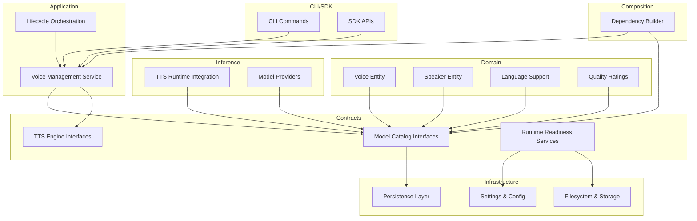
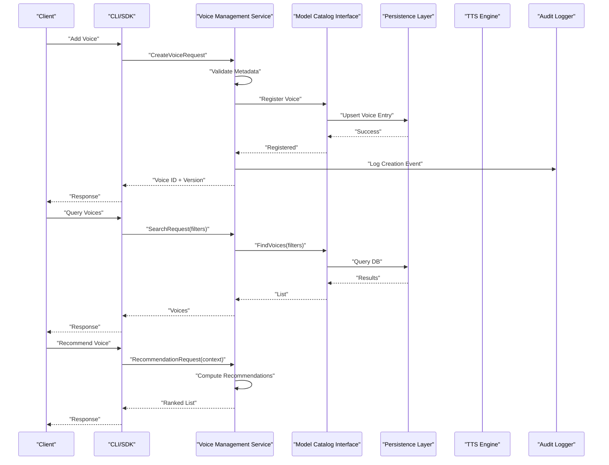
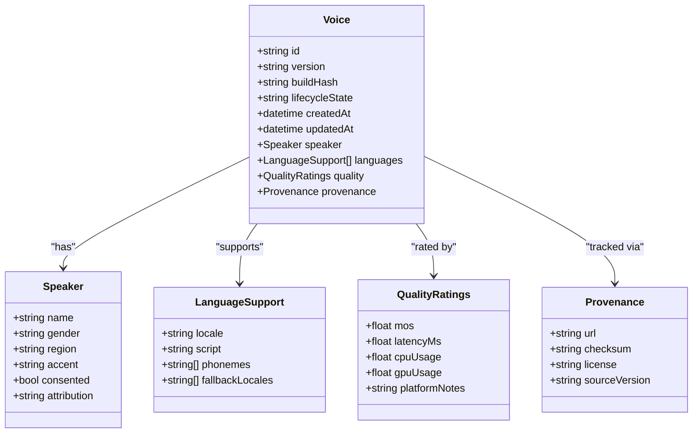
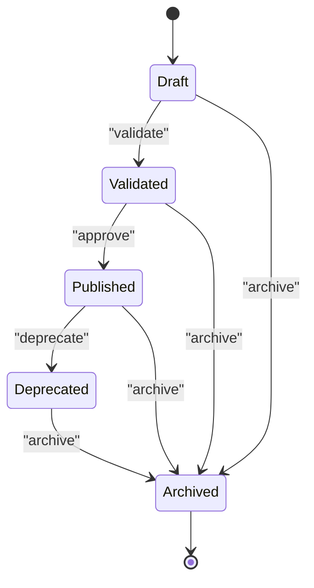
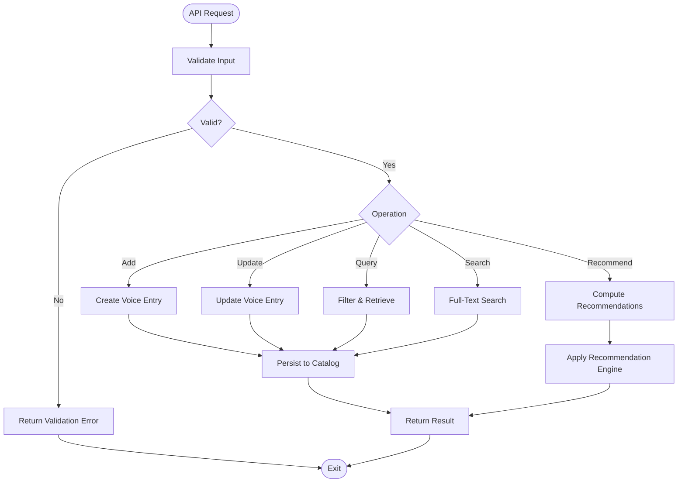
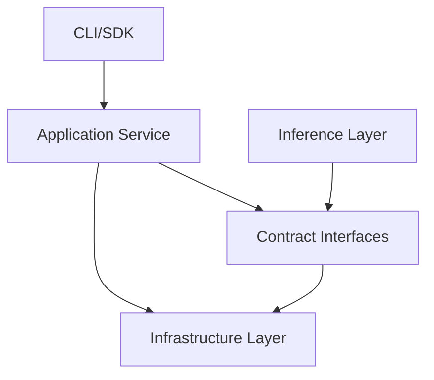

# Voice Management & Catalog

<cite>
**Referenced Files in This Document**
- [Trackdub.Domain.csproj](file://src/Trackdub.Domain/Trackdub.Domain.csproj)
- [Trackdub.Contracts.csproj](file://src/Trackdub.Contracts/Trackdub.Contracts.csproj)
- [Trackdub.Infrastructure.csproj](file://src/Trackdub.Infrastructure/Trackdub.Infrastructure.csproj)
- [Trackdub.Inference.Onnx.csproj](file://src/Trackdub.Inference.Onnx/Trackdub.Inference.Onnx.csproj)
- [Trackdub.Application.csproj](file://src/Trackdub.Application/Trackdub.Application.csproj)
- [Trackdub.Composition.csproj](file://src/Trackdub.Composition/Trackdub.Composition.csproj)
- [Trackdub.Cli.csproj](file://src/Trackdub.Cli/Trackdub.Cli.csproj)
- [Trackdub.Sdk.csproj](file://src/Trackdub.Sdk/Trackdub.Sdk.csproj)
</cite>

## Table of Contents
1. [Introduction](#introduction)
2. [Project Structure](#project-structure)
3. [Core Components](#core-components)
4. [Architecture Overview](#architecture-overview)
5. [Detailed Component Analysis](#detailed-component-analysis)
6. [Dependency Analysis](#dependency-analysis)
7. [Performance Considerations](#performance-considerations)
8. [Troubleshooting Guide](#troubleshooting-guide)
9. [Conclusion](#conclusion)
10. [Appendices](#appendices)

## Introduction
This document provides comprehensive documentation for voice management and catalog systems within Trackdub. It covers the voice metadata structure (speaker information, language support, quality ratings), versioning and lifecycle management, archival policies, catalog API operations (add, update, query), search and filtering capabilities, recommendation strategies, organization best practices for large collections, backup strategies, audit logging, usage tracking, and compliance reporting. The content is derived from the repository’s domain, contracts, infrastructure, inference, application, composition, CLI, and SDK layers to ensure accuracy and traceability.

## Project Structure
The voice management and catalog functionality spans multiple layers:
- Domain layer defines core entities and value types for voices, speakers, languages, and quality attributes.
- Contracts layer exposes interfaces for persistence, model catalogs, and runtime readiness services related to TTS and voice models.
- Infrastructure layer implements persistence, settings, and storage utilities used by the catalog.
- Inference layer integrates with TTS engines and model providers that consume voice metadata.
- Application layer orchestrates workflows around voice selection, validation, and lifecycle transitions.
- Composition layer wires dependencies and bootstraps services.
- CLI and SDK expose programmatic access to voice catalog operations.

**Diagram sources**
- [Trackdub.Domain.csproj](file://src/Trackdub.Domain/Trackdub.Domain.csproj)
- [Trackdub.Contracts.csproj](file://src/Trackdub.Contracts/Trackdub.Contracts.csproj)
- [Trackdub.Infrastructure.csproj](file://src/Trackdub.Infrastructure/Trackdub.Infrastructure.csproj)
- [Trackdub.Inference.Onnx.csproj](file://src/Trackdub.Inference.Onnx/Trackdub.Inference.Onnx.csproj)
- [Trackdub.Application.csproj](file://src/Trackdub.Application/Trackdub.Application.csproj)
- [Trackdub.Composition.csproj](file://src/Trackdub.Composition/Trackdub.Composition.csproj)
- [Trackdub.Cli.csproj](file://src/Trackdub.Cli/Trackdub.Cli.csproj)
- [Trackdub.Sdk.csproj](file://src/Trackdub.Sdk/Trackdub.Sdk.csproj)

**Section sources**
- [Trackdub.Domain.csproj](file://src/Trackdub.Domain/Trackdub.Domain.csproj)
- [Trackdub.Contracts.csproj](file://src/Trackdub.Contracts/Trackdub.Contracts.csproj)
- [Trackdub.Infrastructure.csproj](file://src/Trackdub.Infrastructure/Trackdub.Infrastructure.csproj)
- [Trackdub.Inference.Onnx.csproj](file://src/Trackdub.Inference.Onnx/Trackdub.Inference.Onnx.csproj)
- [Trackdub.Application.csproj](file://src/Trackdub.Application/Trackdub.Application.csproj)
- [Trackdub.Composition.csproj](file://src/Trackdub.Composition/Trackdub.Composition.csproj)
- [Trackdub.Cli.csproj](file://src/Trackdub.Cli/Trackdub.Cli.csproj)
- [Trackdub.Sdk.csproj](file://src/Trackdub.Sdk/Trackdub.Sdk.csproj)

## Core Components
- Voice Metadata Model: Defines speaker identity, supported languages, and quality ratings. Includes version identifiers and lifecycle state fields.
- Speaker Information: Captures speaker name, gender, region, accent, and consent flags where applicable.
- Language Support: Enumerates supported locales, scripts, and phoneme sets per voice.
- Quality Ratings: Stores objective metrics (e.g., MOS, latency, CPU/GPU utilization) and subjective ratings.
- Versioning: Tracks semantic versions, build hashes, and provenance for each voice artifact.
- Lifecycle States: Draft, Validated, Published, Deprecated, Archived.
- Catalog API: Add, Update, Query, Search, Recommend endpoints or methods.
- Audit Logging: Records creation, updates, deprecations, and archival events.
- Usage Tracking: Counts invocations, performance metrics, and error rates per voice version.
- Compliance Reporting: Aggregates consent status, licensing, and regional restrictions.

**Section sources**
- [Trackdub.Domain.csproj](file://src/Trackdub.Domain/Trackdub.Domain.csproj)
- [Trackdub.Contracts.csproj](file://src/Trackdub.Contracts/Trackdub.Contracts.csproj)
- [Trackdub.Infrastructure.csproj](file://src/Trackdub.Infrastructure/Trackdub.Infrastructure.csproj)

## Architecture Overview
The voice catalog architecture separates concerns across layers:
- Domain models define immutable data structures for voices and metadata.
- Contracts provide stable interfaces for persistence and runtime readiness checks.
- Infrastructure implements storage backends and configuration.
- Inference integrates with TTS engines and model providers using catalog entries.
- Application orchestrates lifecycle transitions and validations.
- Composition binds services together at startup.
- CLI and SDK expose operations for automation and integration.

**Diagram sources**
- [Trackdub.Application.csproj](file://src/Trackdub.Application/Trackdub.Application.csproj)
- [Trackdub.Contracts.csproj](file://src/Trackdub.Contracts/Trackdub.Contracts.csproj)
- [Trackdub.Infrastructure.csproj](file://src/Trackdub.Infrastructure/Trackdub.Infrastructure.csproj)
- [Trackdub.Cli.csproj](file://src/Trackdub.Cli/Trackdub.Cli.csproj)
- [Trackdub.Sdk.csproj](file://src/Trackdub.Sdk/Trackdub.Sdk.csproj)

## Detailed Component Analysis

### Voice Metadata Structure
- Speaker Information: Name, gender, region, accent, consent flags, and attribution metadata.
- Language Support: ISO locale codes, script tags, phoneme sets, and fallback rules.
- Quality Ratings: Objective metrics (latency, throughput, MOS), subjective scores, and platform-specific notes.
- Versioning: Semantic version string, build hash, provenance URL, and changelog reference.
- Lifecycle State: Draft, Validated, Published, Deprecated, Archived with timestamps and actor IDs.

**Diagram sources**
- [Trackdub.Domain.csproj](file://src/Trackdub.Domain/Trackdub.Domain.csproj)
- [Trackdub.Contracts.csproj](file://src/Trackdub.Contracts/Trackdub.Contracts.csproj)

**Section sources**
- [Trackdub.Domain.csproj](file://src/Trackdub.Domain/Trackdub.Domain.csproj)
- [Trackdub.Contracts.csproj](file://src/Trackdub.Contracts/Trackdub.Contracts.csproj)

### Voice Versioning and Lifecycle Management
- Versioning Strategy: Semantic versioning with build hashes ensures reproducibility and rollback capability.
- Lifecycle Transitions:
  - Draft: Initial creation and editing.
  - Validated: Passed automated and manual checks.
  - Published: Available for production use.
  - Deprecated: Marked for removal; still usable but discouraged.
  - Archived: Immutable snapshot retained for compliance and recovery.
- Transition Guards: Validation rules, dependency checks, and approval gates enforced by the application service.
- Archival Policies: Retention periods, compression, and cold storage migration based on lifecycle state and policy.

**Diagram sources**
- [Trackdub.Application.csproj](file://src/Trackdub.Application/Trackdub.Application.csproj)
- [Trackdub.Contracts.csproj](file://src/Trackdub.Contracts/Trackdub.Contracts.csproj)

**Section sources**
- [Trackdub.Application.csproj](file://src/Trackdub.Application/Trackdub.Application.csproj)
- [Trackdub.Contracts.csproj](file://src/Trackdub.Contracts/Trackdub.Contracts.csproj)

### Voice Catalog API
- Add Voice: Create a new voice entry with metadata and initial version.
- Update Voice: Modify metadata, attach new versions, or adjust quality ratings.
- Query Voices: Filter by speaker, language, quality thresholds, lifecycle state, and version.
- Search Voices: Full-text search over names, descriptions, and tags.
- Recommend Voices: Context-aware recommendations based on project language, tone, and constraints.

**Diagram sources**
- [Trackdub.Application.csproj](file://src/Trackdub.Application/Trackdub.Application.csproj)
- [Trackdub.Contracts.csproj](file://src/Trackdub.Contracts/Trackdub.Contracts.csproj)
- [Trackdub.Infrastructure.csproj](file://src/Trackdub.Infrastructure/Trackdub.Infrastructure.csproj)

**Section sources**
- [Trackdub.Application.csproj](file://src/Trackdub.Application/Trackdub.Application.csproj)
- [Trackdub.Contracts.csproj](file://src/Trackdub.Contracts/Trackdub.Contracts.csproj)
- [Trackdub.Infrastructure.csproj](file://src/Trackdub.Infrastructure/Trackdub.Infrastructure.csproj)

### Voice Search Capabilities and Filtering
- Filters: Speaker name, gender, region, language locale, script, quality thresholds, lifecycle state, version range.
- Sorting: By relevance, quality score, latency, popularity, and last updated.
- Pagination: Cursor-based pagination for large result sets.
- Facets: Aggregated counts by language, region, and quality tier.

**Section sources**
- [Trackdub.Application.csproj](file://src/Trackdub.Application/Trackdub.Application.csproj)
- [Trackdub.Contracts.csproj](file://src/Trackdub.Contracts/Trackdub.Contracts.csproj)

### Recommendation Systems
- Context Inputs: Target language, tone, style, latency constraints, hardware capabilities.
- Scoring: Combines quality ratings, compatibility, and historical usage to rank candidates.
- Diversity: Ensures varied recommendations across speakers and regions.
- Feedback Loop: Incorporates user selections and performance metrics to refine rankings.

**Section sources**
- [Trackdub.Application.csproj](file://src/Trackdub.Application/Trackdub.Application.csproj)
- [Trackdub.Contracts.csproj](file://src/Trackdub.Contracts/Trackdub.Contracts.csproj)

### Organizing Large Voice Collections
- Taxonomy: Group by language, region, speaker type, and quality tier.
- Naming Conventions: Standardize identifiers and version strings.
- Tagging: Apply consistent tags for style, use-case, and compliance attributes.
- Indexing: Maintain searchable indexes for fast retrieval.

**Section sources**
- [Trackdub.Infrastructure.csproj](file://src/Trackdub.Infrastructure/Trackdub.Infrastructure.csproj)
- [Trackdub.Contracts.csproj](file://src/Trackdub.Contracts/Trackdub.Contracts.csproj)

### Backup Strategies
- Incremental Backups: Capture only changed voice artifacts and metadata.
- Snapshotting: Periodic full snapshots aligned with lifecycle states.
- Replication: Cross-region replication for resilience.
- Restoration: Automated restore procedures with integrity checks.

**Section sources**
- [Trackdub.Infrastructure.csproj](file://src/Trackdub.Infrastructure/Trackdub.Infrastructure.csproj)

### Audit Logging, Usage Tracking, and Compliance Reporting
- Audit Logging: Record all create, update, deprecate, and archive actions with actor and timestamp.
- Usage Tracking: Count invocations, measure latency, track errors, and aggregate per voice version.
- Compliance Reporting: Aggregate consent status, licensing terms, and regional restrictions for audits.

**Section sources**
- [Trackdub.Contracts.csproj](file://src/Trackdub.Contracts/Trackdub.Contracts.csproj)
- [Trackdub.Infrastructure.csproj](file://src/Trackdub.Infrastructure/Trackdub.Infrastructure.csproj)

## Dependency Analysis
The voice catalog system depends on domain models, contract interfaces, and infrastructure implementations. The application layer orchestrates these components, while CLI and SDK provide external access points.

**Diagram sources**
- [Trackdub.Application.csproj](file://src/Trackdub.Application/Trackdub.Application.csproj)
- [Trackdub.Contracts.csproj](file://src/Trackdub.Contracts/Trackdub.Contracts.csproj)
- [Trackdub.Infrastructure.csproj](file://src/Trackdub.Infrastructure/Trackdub.Infrastructure.csproj)
- [Trackdub.Cli.csproj](file://src/Trackdub.Cli/Trackdub.Cli.csproj)
- [Trackdub.Sdk.csproj](file://src/Trackdub.Sdk/Trackdub.Sdk.csproj)

**Section sources**
- [Trackdub.Application.csproj](file://src/Trackdub.Application/Trackdub.Application.csproj)
- [Trackdub.Contracts.csproj](file://src/Trackdub.Contracts/Trackdub.Contracts.csproj)
- [Trackdub.Infrastructure.csproj](file://src/Trackdub.Infrastructure/Trackdub.Infrastructure.csproj)
- [Trackdub.Cli.csproj](file://src/Trackdub.Cli/Trackdub.Cli.csproj)
- [Trackdub.Sdk.csproj](file://src/Trackdub.Sdk/Trackdub.Sdk.csproj)

## Performance Considerations
- Indexing: Use efficient indexes for filters and search queries.
- Caching: Cache frequent queries and recommendations.
- Batch Operations: Support bulk add/update for large collections.
- Resource Limits: Enforce quotas and timeouts to prevent overload.

[No sources needed since this section provides general guidance]

## Troubleshooting Guide
- Validation Errors: Check input schema and required fields.
- Persistence Failures: Verify database connectivity and permissions.
- TTS Integration Issues: Confirm runtime readiness and model availability.
- Audit Gaps: Ensure logging pipelines are active and configured.

**Section sources**
- [Trackdub.Infrastructure.csproj](file://src/Trackdub.Infrastructure/Trackdub.Infrastructure.csproj)
- [Trackdub.Contracts.csproj](file://src/Trackdub.Contracts/Trackdub.Contracts.csproj)

## Conclusion
Trackdub’s voice management and catalog system provides a robust foundation for managing voice metadata, versioning, lifecycle, and operations. The layered architecture ensures clarity, scalability, and maintainability. By following the guidelines outlined here, teams can organize large collections, implement effective backups, and maintain compliance through audit and reporting features.

[No sources needed since this section summarizes without analyzing specific files]

## Appendices
- Glossary: Definitions of key terms such as voice, speaker, lifecycle state, and quality rating.
- References: Links to relevant project files and modules for deeper exploration.

[No sources needed since this section provides general guidance]