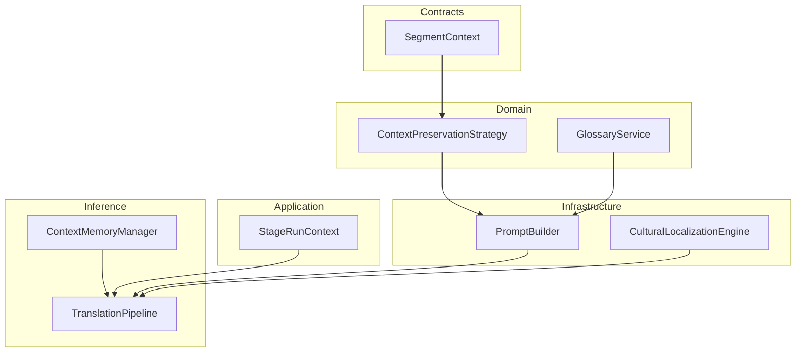
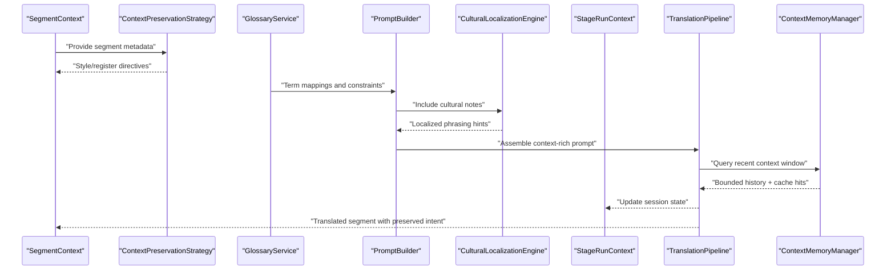
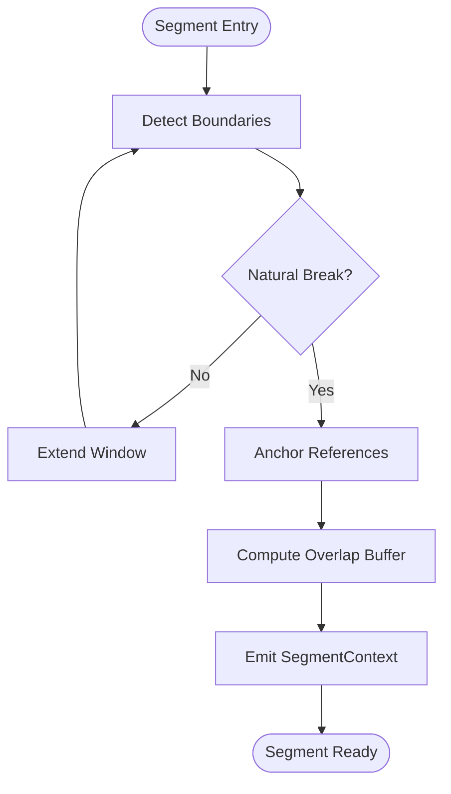
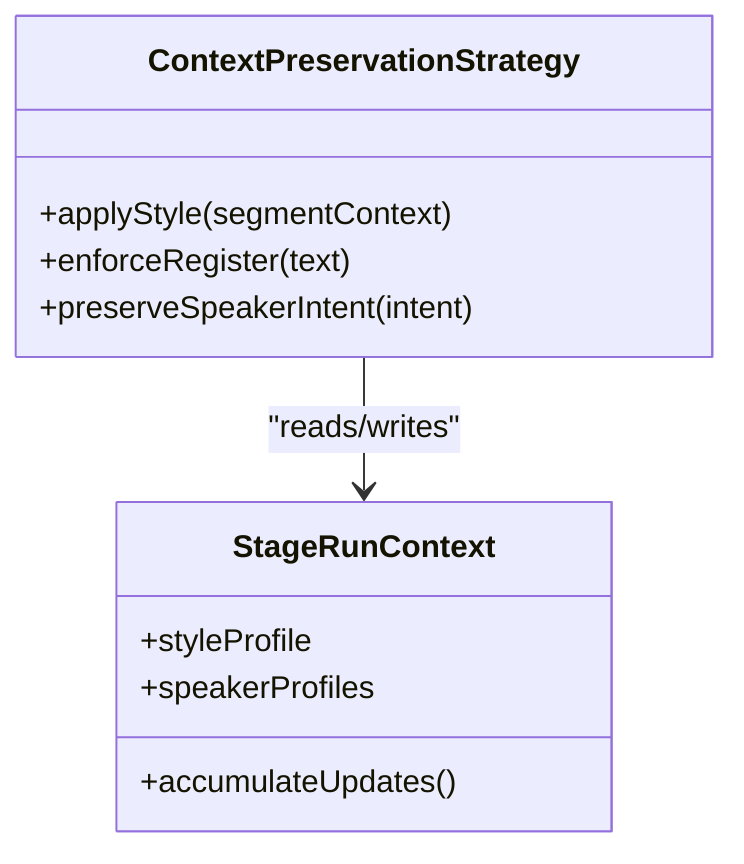
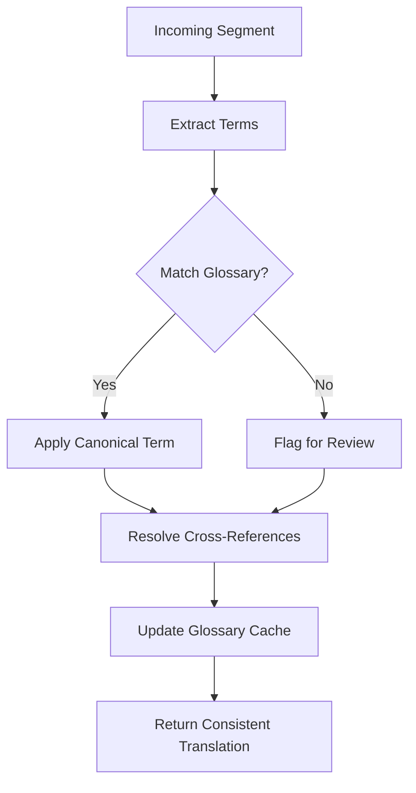
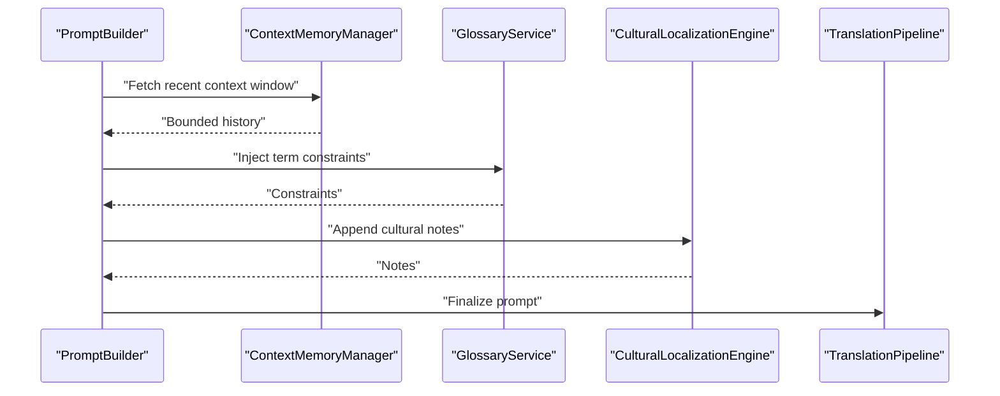
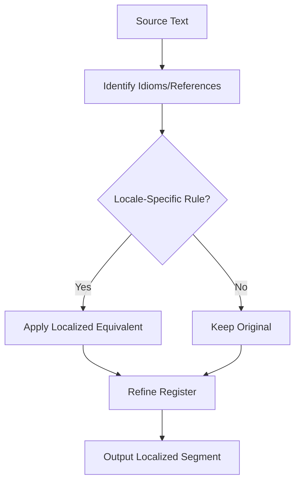
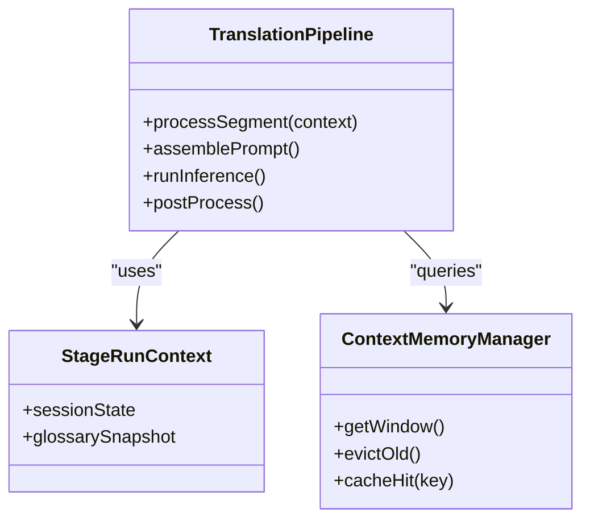
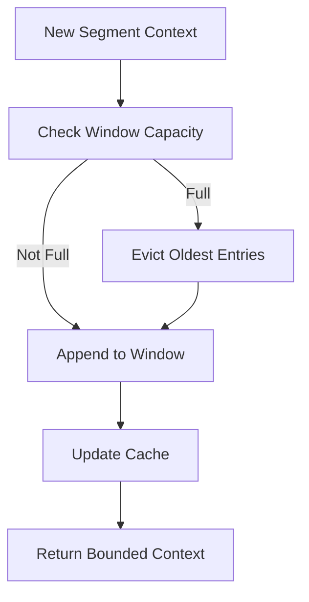
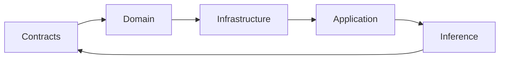

# Context Preservation Techniques

<cite>
**Referenced Files in This Document**
- [Trackdub.Application/Dubbing/TranslationEngine.cs](file://src/Trackdub.Application/Dubbing/TranslationEngine.cs)
- [Trackdub.Domain/Translation/ContextPreservationStrategy.cs](file://src/Trackdub.Domain/Translation/ContextPreservationStrategy.cs)
- [Trackdub.Infrastructure/Translation/PromptBuilder.cs](file://src/Trackdub.Infrastructure/Translation/PromptBuilder.cs)
- [Trackdub.Inference.Onnx/Translation/TranslationPipeline.cs](file://src/Trackdub.Inference.Onnx/Translation/TranslationPipeline.cs)
- [Trackdub.Contracts/Pipeline/SegmentContext.cs](file://src/Trackdub.Contracts/Pipeline/SegmentContext.cs)
- [Trackdub.Application/Pipeline/StageRunContext.cs](file://src/Trackdub.Application/Pipeline/StageRunContext.cs)
- [Trackdub.Domain/Translation/GlossaryService.cs](file://src/Trackdub.Domain/Translation/GlossaryService.cs)
- [Trackdub.Infrastructure/Translation/CulturalLocalizationEngine.cs](file://src/Trackdub.Infrastructure/Translation/CulturalLocalizationEngine.cs)
- [Trackdub.Application/Transcripts/SegmentBoundaryAnalyzer.cs](file://src/Trackdub.Application/Transcripts/SegmentBoundaryAnalyzer.cs)
- [Trackdub.Inference/Services/ContextMemoryManager.cs](file://src/Trackdub.Inference/Services/ContextMemoryManager.cs)
</cite>

## Table of Contents
1. [Introduction](#introduction)
2. [Project Structure](#project-structure)
3. [Core Components](#core-components)
4. [Architecture Overview](#architecture-overview)
5. [Detailed Component Analysis](#detailed-component-analysis)
6. [Dependency Analysis](#dependency-analysis)
7. [Performance Considerations](#performance-considerations)
8. [Troubleshooting Guide](#troubleshooting-guide)
9. [Conclusion](#conclusion)

## Introduction
This document explains how Trackdub preserves context across translation segments to maintain speaker intent, tone, style, register, and cultural nuances. It covers prompt engineering strategies, context window management, memory optimization, segment boundary handling, cross-reference resolution, domain adaptation, style transfer, and cultural localization techniques used throughout the pipeline.

## Project Structure
The context preservation features span multiple layers:
- Contracts define shared data structures for segment-level context.
- Domain encapsulates strategies and services for glossary and cultural localization.
- Infrastructure provides prompt building and localization engines.
- Application orchestrates stages and manages run-time context.
- Inference integrates translation pipelines with memory and runtime optimizations.

**Diagram sources**
- [Trackdub.Contracts/Pipeline/SegmentContext.cs](file://src/Trackdub.Contracts/Pipeline/SegmentContext.cs)
- [Trackdub.Domain/Translation/ContextPreservationStrategy.cs](file://src/Trackdub.Domain/Translation/ContextPreservationStrategy.cs)
- [Trackdub.Domain/Translation/GlossaryService.cs](file://src/Trackdub.Domain/Translation/GlossaryService.cs)
- [Trackdub.Infrastructure/Translation/PromptBuilder.cs](file://src/Trackdub.Infrastructure/Translation/PromptBuilder.cs)
- [Trackdub.Infrastructure/Translation/CulturalLocalizationEngine.cs](file://src/Trackdub.Infrastructure/Translation/CulturalLocalizationEngine.cs)
- [Trackdub.Application/Pipeline/StageRunContext.cs](file://src/Trackdub.Application/Pipeline/StageRunContext.cs)
- [Trackdub.Inference.Onnx/Translation/TranslationPipeline.cs](file://src/Trackdub.Inference.Onnx/Translation/TranslationPipeline.cs)
- [Trackdub.Inference/Services/ContextMemoryManager.cs](file://src/Trackdub.Inference/Services/ContextMemoryManager.cs)

**Section sources**
- [Trackdub.Contracts/Pipeline/SegmentContext.cs](file://src/Trackdub.Contracts/Pipeline/SegmentContext.cs)
- [Trackdub.Domain/Translation/ContextPreservationStrategy.cs](file://src/Trackdub.Domain/Translation/ContextPreservationStrategy.cs)
- [Trackdub.Infrastructure/Translation/PromptBuilder.cs](file://src/Trackdub.Infrastructure/Translation/PromptBuilder.cs)
- [Trackdub.Infrastructure/Translation/CulturalLocalizationEngine.cs](file://src/Trackdub.Infrastructure/Translation/CulturalLocalizationEngine.cs)
- [Trackdub.Application/Pipeline/StageRunContext.cs](file://src/Trackdub.Application/Pipeline/StageRunContext.cs)
- [Trackdub.Inference.Onnx/Translation/TranslationPipeline.cs](file://src/Trackdub.Inference.Onnx/Translation/TranslationPipeline.cs)
- [Trackdub.Inference/Services/ContextMemoryManager.cs](file://src/Trackdub.Inference/Services/ContextMemoryManager.cs)

## Core Components
- SegmentContext: Carries per-segment metadata (timestamps, speakers, topic tags, prior references) to preserve continuity.
- ContextPreservationStrategy: Encapsulates rules for maintaining tone, style, register, and speaker intent across segments.
- GlossaryService: Enforces terminology consistency via domain-specific term mappings and constraints.
- PromptBuilder: Constructs prompts that include contextual anchors, style directives, and cultural notes.
- CulturalLocalizationEngine: Adapts idioms, registers, and cultural references to target locales while preserving intent.
- StageRunContext: Holds session-scoped state such as accumulated glossary updates and style profiles.
- TranslationPipeline: Orchestrates segmentation, prompting, inference, and post-processing with context injection.
- ContextMemoryManager: Manages sliding windows, eviction policies, and caching to optimize memory usage.

**Section sources**
- [Trackdub.Contracts/Pipeline/SegmentContext.cs](file://src/Trackdub.Contracts/Pipeline/SegmentContext.cs)
- [Trackdub.Domain/Translation/ContextPreservationStrategy.cs](file://src/Trackdub.Domain/Translation/ContextPreservationStrategy.cs)
- [Trackdub.Domain/Translation/GlossaryService.cs](file://src/Trackdub.Domain/Translation/GlossaryService.cs)
- [Trackdub.Infrastructure/Translation/PromptBuilder.cs](file://src/Trackdub.Infrastructure/Translation/PromptBuilder.cs)
- [Trackdub.Infrastructure/Translation/CulturalLocalizationEngine.cs](file://src/Trackdub.Infrastructure/Translation/CulturalLocalizationEngine.cs)
- [Trackdub.Application/Pipeline/StageRunContext.cs](file://src/Trackdub.Application/Pipeline/StageRunContext.cs)
- [Trackdub.Inference.Onnx/Translation/TranslationPipeline.cs](file://src/Trackdub.Inference.Onnx/Translation/TranslationPipeline.cs)
- [Trackdub.Inference/Services/ContextMemoryManager.cs](file://src/Trackdub.Inference/Services/ContextMemoryManager.cs)

## Architecture Overview
The translation pipeline composes context-aware prompts, applies domain and cultural adaptations, and maintains a bounded memory window to ensure consistent output across segments.

**Diagram sources**
- [Trackdub.Contracts/Pipeline/SegmentContext.cs](file://src/Trackdub.Contracts/Pipeline/SegmentContext.cs)
- [Trackdub.Domain/Translation/ContextPreservationStrategy.cs](file://src/Trackdub.Domain/Translation/ContextPreservationStrategy.cs)
- [Trackdub.Domain/Translation/GlossaryService.cs](file://src/Trackdub.Domain/Translation/GlossaryService.cs)
- [Trackdub.Infrastructure/Translation/PromptBuilder.cs](file://src/Trackdub.Infrastructure/Translation/PromptBuilder.cs)
- [Trackdub.Infrastructure/Translation/CulturalLocalizationEngine.cs](file://src/Trackdub.Infrastructure/Translation/CulturalLocalizationEngine.cs)
- [Trackdub.Application/Pipeline/StageRunContext.cs](file://src/Trackdub.Application/Pipeline/StageRunContext.cs)
- [Trackdub.Inference.Onnx/Translation/TranslationPipeline.cs](file://src/Trackdub.Inference.Onnx/Translation/TranslationPipeline.cs)
- [Trackdub.Inference/Services/ContextMemoryManager.cs](file://src/Trackdub.Inference/Services/ContextMemoryManager.cs)

## Detailed Component Analysis

### SegmentContext and Boundary Handling
- Purpose: Encodes temporal boundaries, speaker identity, and semantic anchors to keep translations coherent at segment edges.
- Key behaviors:
  - Captures start/end timestamps and overlap regions for smooth transitions.
  - Stores speaker tags and role descriptors to preserve voice identity.
  - Maintains topic tags and reference pointers for cross-segment coherence.
- Boundary strategy:
  - Uses SegmentBoundaryAnalyzer to detect natural breaks and avoid splitting meaningful phrases.
  - Applies overlap buffers to retain bridging context across cuts.

**Diagram sources**
- [Trackdub.Contracts/Pipeline/SegmentContext.cs](file://src/Trackdub.Contracts/Pipeline/SegmentContext.cs)
- [Trackdub.Application/Transcripts/SegmentBoundaryAnalyzer.cs](file://src/Trackdub.Application/Transcripts/SegmentBoundaryAnalyzer.cs)

**Section sources**
- [Trackdub.Contracts/Pipeline/SegmentContext.cs](file://src/Trackdub.Contracts/Pipeline/SegmentContext.cs)
- [Trackdub.Application/Transcripts/SegmentBoundaryAnalyzer.cs](file://src/Trackdub.Application/Transcripts/SegmentBoundaryAnalyzer.cs)

### ContextPreservationStrategy and Style Consistency
- Purpose: Defines rules for tone, style, and register maintenance across segments and speakers.
- Key behaviors:
  - Extracts stylistic cues from source text and speaker metadata.
  - Enforces consistency through style profiles stored in StageRunContext.
  - Adjusts formality, politeness, and domain-specific register based on content.

**Diagram sources**
- [Trackdub.Domain/Translation/ContextPreservationStrategy.cs](file://src/Trackdub.Domain/Translation/ContextPreservationStrategy.cs)
- [Trackdub.Application/Pipeline/StageRunContext.cs](file://src/Trackdub.Application/Pipeline/StageRunContext.cs)

**Section sources**
- [Trackdub.Domain/Translation/ContextPreservationStrategy.cs](file://src/Trackdub.Domain/Translation/ContextPreservationStrategy.cs)
- [Trackdub.Application/Pipeline/StageRunContext.cs](file://src/Trackdub.Application/Pipeline/StageRunContext.cs)

### GlossaryService and Cross-Reference Resolution
- Purpose: Ensures terminology consistency and resolves cross-references between segments.
- Key behaviors:
  - Maintains canonical term mappings and preferred translations.
  - Resolves pronouns and anaphora using segment context and prior references.
  - Updates glossary entries dynamically when new terms are detected.

**Diagram sources**
- [Trackdub.Domain/Translation/GlossaryService.cs](file://src/Trackdub.Domain/Translation/GlossaryService.cs)

**Section sources**
- [Trackdub.Domain/Translation/GlossaryService.cs](file://src/Trackdub.Domain/Translation/GlossaryService.cs)

### PromptBuilder and Context Window Management
- Purpose: Builds prompts that embed segment context, style directives, and cultural notes within a bounded window.
- Key behaviors:
  - Composes system instructions, segment text, and contextual anchors.
  - Truncates or summarizes older context to fit token limits.
  - Injects glossary constraints and localization hints.

**Diagram sources**
- [Trackdub.Infrastructure/Translation/PromptBuilder.cs](file://src/Trackdub.Infrastructure/Translation/PromptBuilder.cs)
- [Trackdub.Inference/Services/ContextMemoryManager.cs](file://src/Trackdub.Inference/Services/ContextMemoryManager.cs)
- [Trackdub.Domain/Translation/GlossaryService.cs](file://src/Trackdub.Domain/Translation/GlossaryService.cs)
- [Trackdub.Infrastructure/Translation/CulturalLocalizationEngine.cs](file://src/Trackdub.Infrastructure/Translation/CulturalLocalizationEngine.cs)
- [Trackdub.Inference.Onnx/Translation/TranslationPipeline.cs](file://src/Trackdub.Inference.Onnx/Translation/TranslationPipeline.cs)

**Section sources**
- [Trackdub.Infrastructure/Translation/PromptBuilder.cs](file://src/Trackdub.Infrastructure/Translation/PromptBuilder.cs)
- [Trackdub.Inference/Services/ContextMemoryManager.cs](file://src/Trackdub.Inference/Services/ContextMemoryManager.cs)

### CulturalLocalizationEngine and Localization Strategies
- Purpose: Adapts idiomatic expressions, cultural references, and register to target locales while preserving speaker intent.
- Key behaviors:
  - Maps source idioms to culturally appropriate equivalents.
  - Adjusts formality and politeness levels per locale conventions.
  - Preserves named entities and domain-specific jargon.

**Diagram sources**
- [Trackdub.Infrastructure/Translation/CulturalLocalizationEngine.cs](file://src/Trackdub.Infrastructure/Translation/CulturalLocalizationEngine.cs)

**Section sources**
- [Trackdub.Infrastructure/Translation/CulturalLocalizationEngine.cs](file://src/Trackdub.Infrastructure/Translation/CulturalLocalizationEngine.cs)

### TranslationPipeline Orchestration
- Purpose: Coordinates segmentation, prompting, inference, and post-processing with context injection.
- Key behaviors:
  - Consumes SegmentContext and StageRunContext to assemble prompts.
  - Integrates GlossaryService and CulturalLocalizationEngine outputs.
  - Manages retry logic and error recovery while preserving context.

**Diagram sources**
- [Trackdub.Inference.Onnx/Translation/TranslationPipeline.cs](file://src/Trackdub.Inference.Onnx/Translation/TranslationPipeline.cs)
- [Trackdub.Application/Pipeline/StageRunContext.cs](file://src/Trackdub.Application/Pipeline/StageRunContext.cs)
- [Trackdub.Inference/Services/ContextMemoryManager.cs](file://src/Trackdub.Inference/Services/ContextMemoryManager.cs)

**Section sources**
- [Trackdub.Inference.Onnx/Translation/TranslationPipeline.cs](file://src/Trackdub.Inference.Onnx/Translation/TranslationPipeline.cs)
- [Trackdub.Application/Pipeline/StageRunContext.cs](file://src/Trackdub.Application/Pipeline/StageRunContext.cs)
- [Trackdub.Inference/Services/ContextMemoryManager.cs](file://src/Trackdub.Inference/Services/ContextMemoryManager.cs)

### ContextMemoryManager and Memory Optimization
- Purpose: Implements sliding windows, eviction policies, and caching to optimize memory usage during long sessions.
- Key behaviors:
  - Maintains a fixed-size context window with age-based eviction.
  - Caches frequent term lookups and localized phrases.
  - Supports checkpointing to resume context after interruptions.

**Diagram sources**
- [Trackdub.Inference/Services/ContextMemoryManager.cs](file://src/Trackdub.Inference/Services/ContextMemoryManager.cs)

**Section sources**
- [Trackdub.Inference/Services/ContextMemoryManager.cs](file://src/Trackdub.Inference/Services/ContextMemoryManager.cs)

## Dependency Analysis
The translation subsystem exhibits clear layering and controlled coupling:
- Contracts provide immutable data contracts for SegmentContext.
- Domain encapsulates policy and service logic without infrastructure concerns.
- Infrastructure implements prompt construction and localization engines.
- Application coordinates stage execution and session state.
- Inference integrates runtime orchestration and memory management.

**Diagram sources**
- [Trackdub.Contracts/Pipeline/SegmentContext.cs](file://src/Trackdub.Contracts/Pipeline/SegmentContext.cs)
- [Trackdub.Domain/Translation/ContextPreservationStrategy.cs](file://src/Trackdub.Domain/Translation/ContextPreservationStrategy.cs)
- [Trackdub.Infrastructure/Translation/PromptBuilder.cs](file://src/Trackdub.Infrastructure/Translation/PromptBuilder.cs)
- [Trackdub.Infrastructure/Translation/CulturalLocalizationEngine.cs](file://src/Trackdub.Infrastructure/Translation/CulturalLocalizationEngine.cs)
- [Trackdub.Application/Pipeline/StageRunContext.cs](file://src/Trackdub.Application/Pipeline/StageRunContext.cs)
- [Trackdub.Inference.Onnx/Translation/TranslationPipeline.cs](file://src/Trackdub.Inference.Onnx/Translation/TranslationPipeline.cs)
- [Trackdub.Inference/Services/ContextMemoryManager.cs](file://src/Trackdub.Inference/Services/ContextMemoryManager.cs)

**Section sources**
- [Trackdub.Contracts/Pipeline/SegmentContext.cs](file://src/Trackdub.Contracts/Pipeline/SegmentContext.cs)
- [Trackdub.Domain/Translation/ContextPreservationStrategy.cs](file://src/Trackdub.Domain/Translation/ContextPreservationStrategy.cs)
- [Trackdub.Infrastructure/Translation/PromptBuilder.cs](file://src/Trackdub.Infrastructure/Translation/PromptBuilder.cs)
- [Trackdub.Infrastructure/Translation/CulturalLocalizationEngine.cs](file://src/Trackdub.Infrastructure/Translation/CulturalLocalizationEngine.cs)
- [Trackdub.Application/Pipeline/StageRunContext.cs](file://src/Trackdub.Application/Pipeline/StageRunContext.cs)
- [Trackdub.Inference.Onnx/Translation/TranslationPipeline.cs](file://src/Trackdub.Inference.Onnx/Translation/TranslationPipeline.cs)
- [Trackdub.Inference/Services/ContextMemoryManager.cs](file://src/Trackdub.Inference/Services/ContextMemoryManager.cs)

## Performance Considerations
- Context window sizing: Balance fidelity vs. memory; prefer adaptive windows that shrink under pressure.
- Eviction policies: Age-based and frequency-weighted eviction reduce noise and improve relevance.
- Caching: Memoize glossary lookups and localized phrases to cut latency.
- Prompt compression: Summarize older context rather than truncating abruptly to preserve semantics.
- Parallelism: Process independent segments concurrently while sharing read-only context snapshots.

[No sources needed since this section provides general guidance]

## Troubleshooting Guide
- Symptom: Inconsistent terminology across segments
  - Check GlossaryService mappings and ensure dynamic updates are applied.
  - Verify cross-reference resolution is active for pronouns and anaphora.
- Symptom: Tone/style drift
  - Inspect ContextPreservationStrategy’s style profile and confirm StageRunContext accumulation.
  - Validate PromptBuilder includes style directives in each prompt.
- Symptom: Memory pressure or slowdowns
  - Tune ContextMemoryManager window size and eviction thresholds.
  - Enable cache hit monitoring and adjust TTL for localized phrases.
- Symptom: Cultural mismatches
  - Review CulturalLocalizationEngine rules for target locale and update mappings as needed.

**Section sources**
- [Trackdub.Domain/Translation/GlossaryService.cs](file://src/Trackdub.Domain/Translation/GlossaryService.cs)
- [Trackdub.Domain/Translation/ContextPreservationStrategy.cs](file://src/Trackdub.Domain/Translation/ContextPreservationStrategy.cs)
- [Trackdub.Infrastructure/Translation/PromptBuilder.cs](file://src/Trackdub.Infrastructure/Translation/PromptBuilder.cs)
- [Trackdub.Infrastructure/Translation/CulturalLocalizationEngine.cs](file://src/Trackdub.Infrastructure/Translation/CulturalLocalizationEngine.cs)
- [Trackdub.Inference/Services/ContextMemoryManager.cs](file://src/Trackdub.Inference/Services/ContextMemoryManager.cs)

## Conclusion
Trackdub’s translation pipeline preserves context through structured segment metadata, robust prompt engineering, domain-aware glossary enforcement, and culturally sensitive localization. Memory optimization ensures scalability over long sessions, while boundary handling and cross-reference resolution maintain coherence and speaker intent. Together, these techniques deliver consistent tone, style, and register across translated segments.

[No sources needed since this section summarizes without analyzing specific files]