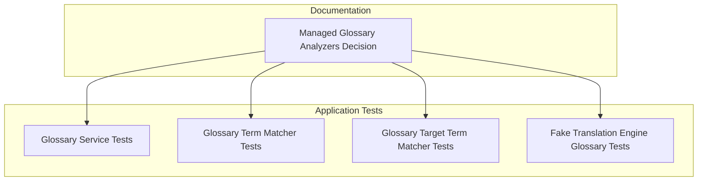
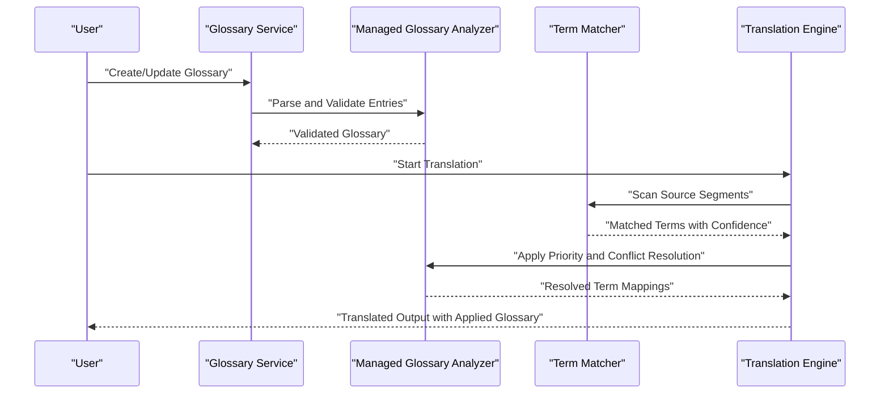
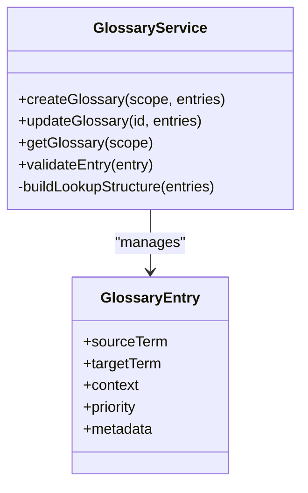
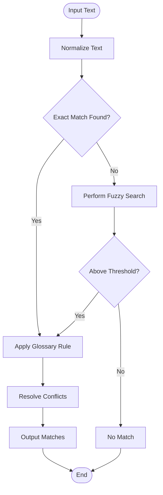
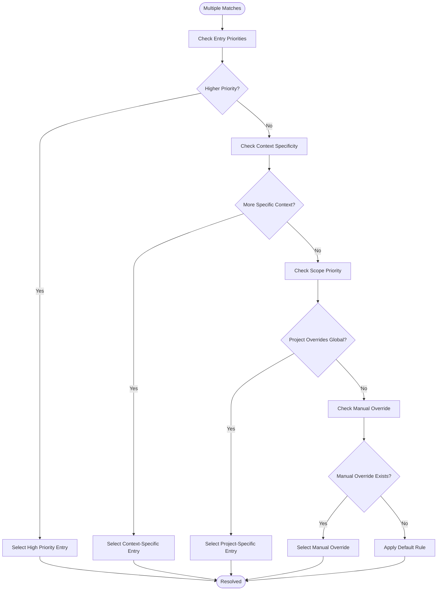
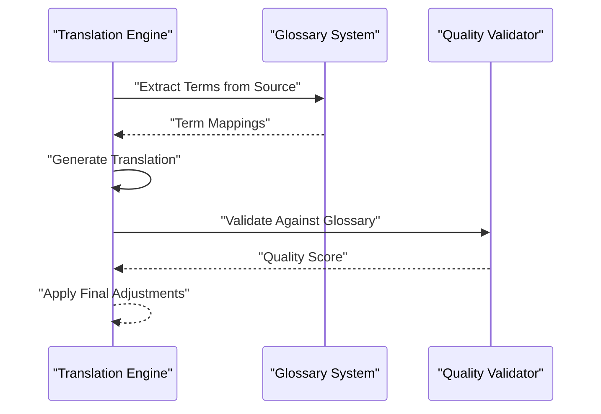
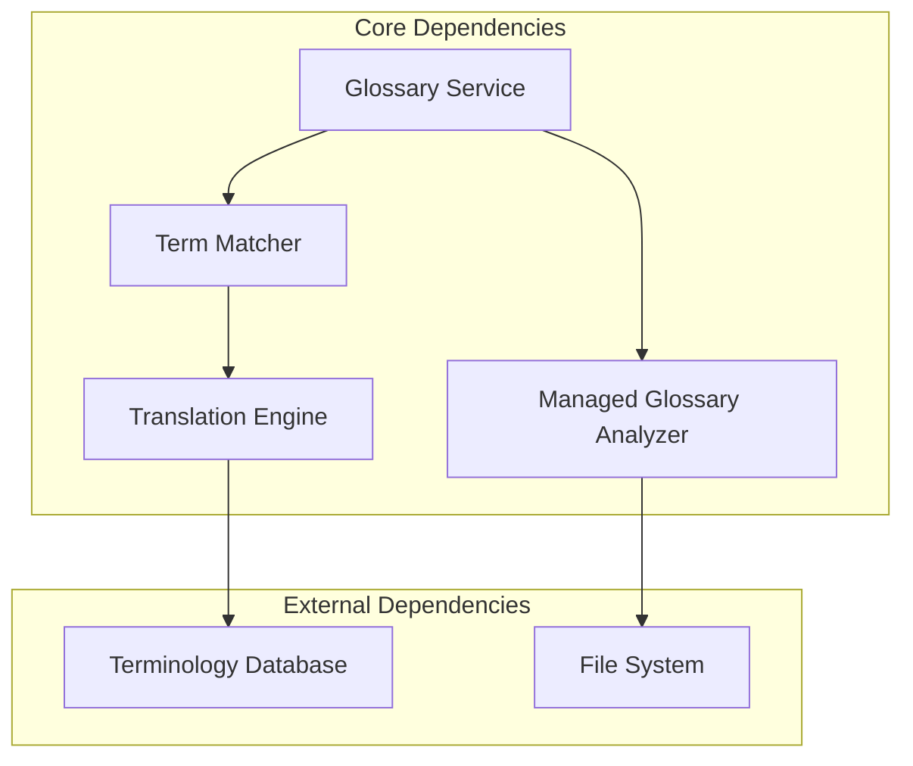

# Glossary & Terminology Management

<cite>
**Referenced Files in This Document**
- [ADR-0007-managed-glossary-analyzers.md](file://docs/decisions/ADR-0007-managed-glossary-analyzers.md)
- [GlossaryServiceTests.cs](file://tests/Trackdub.Application.Tests/GlossaryServiceTests.cs)
- [GlossaryTargetTermMatcherTests.cs](file://tests/Trackdub.Application.Tests/GlossaryTargetTermMatcherTests.cs)
- [GlossaryTermMatcherTests.cs](file://tests/Trackdub.Application.Tests/GlossaryTermMatcherTests.cs)
- [FakeTranslationEngineGlossaryTests.cs](file://tests/Trackdub.Application.Tests/FakeTranslationEngineGlossaryTests.cs)
</cite>

## Table of Contents
1. [Introduction](#introduction)
2. [Project Structure](#project-structure)
3. [Core Components](#core-components)
4. [Architecture Overview](#architecture-overview)
5. [Detailed Component Analysis](#detailed-component-analysis)
6. [Dependency Analysis](#dependency-analysis)
7. [Performance Considerations](#performance-considerations)
8. [Troubleshooting Guide](#troubleshooting-guide)
9. [Conclusion](#conclusion)
10. [Appendices](#appendices)

## Introduction
This document explains how Trackdub manages glossaries and terminology across its translation pipeline. It covers the purpose, scope (global vs project-specific), file formats, entry structure, matching algorithms, fuzzy search capabilities, conflict resolution strategies, import/export workflows, integration with external terminology databases, and the impact on translation quality. The goal is to help users create, maintain, and apply glossaries consistently to improve terminology accuracy and consistency in translations.

## Project Structure
The glossary and terminology features are primarily represented by:
- A design decision that defines managed glossary analyzers and their role in the pipeline
- Application-level tests that validate glossary services, term matchers, and integration points with translation engines

These components collectively define how glossaries are analyzed, matched, and applied during translation processing.

**Diagram sources**
- [ADR-0007-managed-glossary-analyzers.md](file://docs/decisions/ADR-0007-managed-glossary-analyzers.md)
- [GlossaryServiceTests.cs](file://tests/Trackdub.Application.Tests/GlossaryServiceTests.cs)
- [GlossaryTermMatcherTests.cs](file://tests/Trackdub.Application.Tests/GlossaryTermMatcherTests.cs)
- [GlossaryTargetTermMatcherTests.cs](file://tests/Trackdub.Application.Tests/GlossaryTargetTermMatcherTests.cs)
- [FakeTranslationEngineGlossaryTests.cs](file://tests/Trackdub.Application.Tests/FakeTranslationEngineGlossaryTests.cs)

**Section sources**
- [ADR-0007-managed-glossary-analyzers.md](file://docs/decisions/ADR-0007-managed-glossary-analyzers.md)
- [GlossaryServiceTests.cs](file://tests/Trackdub.Application.Tests/GlossaryServiceTests.cs)
- [GlossaryTermMatcherTests.cs](file://tests/Trackdub.Application.Tests/GlossaryTermMatcherTests.cs)
- [GlossaryTargetTermMatcherTests.cs](file://tests/Trackdub.Application.Tests/GlossaryTargetTermMatcherTests.cs)
- [FakeTranslationEngineGlossaryTests.cs](file://tests/Trackdub.Application.Tests/FakeTranslationEngineGlossaryTests.cs)

## Core Components
- Managed Glossary Analyzers: Define how glossaries are parsed, validated, and integrated into the translation pipeline. They ensure consistent application of terminology rules and support both global and project-scoped glossaries.
- Glossary Service: Provides operations for managing glossaries, including creation, updates, and retrieval within a given scope.
- Term Matchers: Implement exact and fuzzy matching strategies to find glossary terms in source text and map them to target terms.
- Integration with Translation Engines: Ensures glossary constraints are respected during translation generation, including priority and conflict resolution.

Key responsibilities:
- Parsing and validating glossary entries
- Building efficient lookup structures for fast matching
- Applying term replacements or constraints during translation
- Handling conflicts between overlapping or contradictory terms
- Supporting bulk import/export and integration with external terminology databases

**Section sources**
- [ADR-0007-managed-glossary-analyzers.md](file://docs/decisions/ADR-0007-managed-glossary-analyzers.md)
- [GlossaryServiceTests.cs](file://tests/Trackdub.Application.Tests/GlossaryServiceTests.cs)
- [GlossaryTermMatcherTests.cs](file://tests/Trackdub.Application.Tests/GlossaryTermMatcherTests.cs)
- [GlossaryTargetTermMatcherTests.cs](file://tests/Trackdub.Application.Tests/GlossaryTargetTermMatcherTests.cs)
- [FakeTranslationEngineGlossaryTests.cs](file://tests/Trackdub.Application.Tests/FakeTranslationEngineGlossaryTests.cs)

## Architecture Overview
The glossary system integrates into the translation pipeline through managed analyzers. During translation, source segments are scanned for glossary terms using matchers. When matches are found, the system applies prioritization and conflict resolution rules before generating translated output. Global glossaries provide organization-wide terminology, while project-specific glossaries override or extend global rules for particular projects.

**Diagram sources**
- [ADR-0007-managed-glossary-analyzers.md](file://docs/decisions/ADR-0007-managed-glossary-analyzers.md)
- [GlossaryServiceTests.cs](file://tests/Trackdub.Application.Tests/GlossaryServiceTests.cs)
- [GlossaryTermMatcherTests.cs](file://tests/Trackdub.Application.Tests/GlossaryTermMatcherTests.cs)
- [GlossaryTargetTermMatcherTests.cs](file://tests/Trackdub.Application.Tests/GlossaryTargetTermMatcherTests.cs)
- [FakeTranslationEngineGlossaryTests.cs](file://tests/Trackdub.Application.Tests/FakeTranslationEngineGlossaryTests.cs)

## Detailed Component Analysis

### Glossary Service
The Glossary Service handles lifecycle operations for glossaries, including creation, updates, and retrieval. It ensures that glossary entries are valid and properly scoped.

Key operations:
- Create new glossary with specified scope (global or project-specific)
- Update existing glossary entries
- Retrieve glossaries by scope
- Validate entry structure and format

**Diagram sources**
- [GlossaryServiceTests.cs](file://tests/Trackdub.Application.Tests/GlossaryServiceTests.cs)

**Section sources**
- [GlossaryServiceTests.cs](file://tests/Trackdub.Application.Tests/GlossaryServiceTests.cs)

### Term Matching Algorithms
Term matchers implement both exact and fuzzy matching strategies to identify glossary terms in source text. The system supports various matching approaches to handle variations in spelling, capitalization, and context.

Matching strategies:
- Exact matching for precise term identification
- Case-insensitive matching for flexibility
- Fuzzy matching for handling typos and variations
- Context-aware matching to avoid false positives

**Diagram sources**
- [GlossaryTermMatcherTests.cs](file://tests/Trackdub.Application.Tests/GlossaryTermMatcherTests.cs)
- [GlossaryTargetTermMatcherTests.cs](file://tests/Trackdub.Application.Tests/GlossaryTargetTermMatcherTests.cs)

**Section sources**
- [GlossaryTermMatcherTests.cs](file://tests/Trackdub.Application.Tests/GlossaryTermMatcherTests.cs)
- [GlossaryTargetTermMatcherTests.cs](file://tests/Trackdub.Application.Tests/GlossaryTargetTermMatcherTests.cs)

### Conflict Resolution Strategies
When multiple glossary entries match the same text segment, the system applies conflict resolution strategies to determine which term mapping should be used.

Resolution priorities:
- Higher priority entries take precedence
- More specific context matches are preferred
- Project-specific glossaries override global glossaries
- Manual overrides have highest priority

**Diagram sources**
- [ADR-0007-managed-glossary-analyzers.md](file://docs/decisions/ADR-0007-managed-glossary-analyzers.md)

**Section sources**
- [ADR-0007-managed-glossary-analyzers.md](file://docs/decisions/ADR-0007-managed-glossary-analyzers.md)

### Integration with Translation Engines
Glossary constraints are integrated into translation engines to ensure terminology consistency during translation generation. The system provides hooks for engines to respect glossary mappings and constraints.

Integration points:
- Pre-translation term extraction
- Post-translation validation
- Real-time term replacement during generation
- Quality metrics based on glossary adherence

**Diagram sources**
- [FakeTranslationEngineGlossaryTests.cs](file://tests/Trackdub.Application.Tests/FakeTranslationEngineGlossaryTests.cs)

**Section sources**
- [FakeTranslationEngineGlossaryTests.cs](file://tests/Trackdub.Application.Tests/FakeTranslationEngineGlossaryTests.cs)

## Dependency Analysis
The glossary system has clear dependencies between components:
- Glossary Service depends on managed analyzers for parsing and validation
- Term matchers depend on normalized text processing utilities
- Translation engine integration depends on contract interfaces for consistency

**Diagram sources**
- [ADR-0007-managed-glossary-analyzers.md](file://docs/decisions/ADR-0007-managed-glossary-analyzers.md)
- [GlossaryServiceTests.cs](file://tests/Trackdub.Application.Tests/GlossaryServiceTests.cs)

**Section sources**
- [ADR-0007-managed-glossary-analyzers.md](file://docs/decisions/ADR-0007-managed-glossary-analyzers.md)
- [GlossaryServiceTests.cs](file://tests/Trackdub.Application.Tests/GlossaryServiceTests.cs)

## Performance Considerations
- Efficient indexing of glossary entries for fast lookups
- Caching mechanisms for frequently accessed terms
- Batch processing for large glossary files
- Memory optimization for large-scale terminology databases
- Asynchronous processing for non-blocking operations

## Troubleshooting Guide
Common issues and solutions:
- **Glossary parsing errors**: Verify entry format and structure
- **Missing term matches**: Check normalization settings and matching thresholds
- **Conflict resolution failures**: Review priority settings and scope definitions
- **Performance degradation**: Optimize glossary size and indexing strategy

**Section sources**
- [GlossaryServiceTests.cs](file://tests/Trackdub.Application.Tests/GlossaryServiceTests.cs)
- [GlossaryTermMatcherTests.cs](file://tests/Trackdub.Application.Tests/GlossaryTermMatcherTests.cs)

## Conclusion
Trackdub's glossary and terminology management system provides comprehensive support for maintaining consistent terminology across translations. Through managed analyzers, sophisticated matching algorithms, and robust conflict resolution, the system ensures high-quality translations that adhere to organizational terminology standards. The modular architecture allows for easy integration with external systems and supports both global and project-specific terminology requirements.

## Appendices

### Glossary File Formats
Supported formats include structured data formats that can represent term pairs, context information, and metadata. The system validates entries against defined schemas to ensure consistency.

### Bulk Import/Export Operations
The system supports batch operations for importing and exporting glossaries, enabling efficient management of large terminology datasets.

### External Database Integration
Integration points allow connection to external terminology databases, enabling synchronization with enterprise terminology management systems.