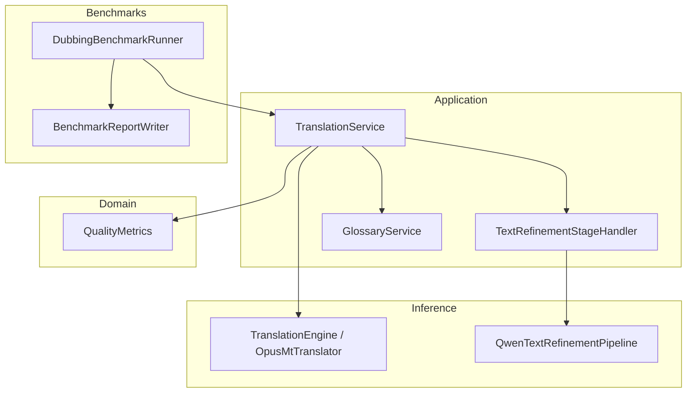
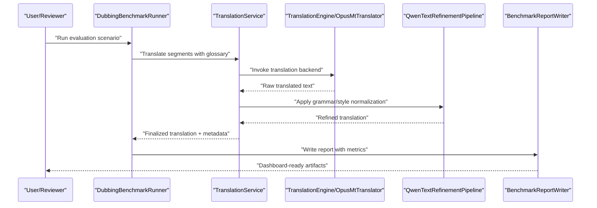
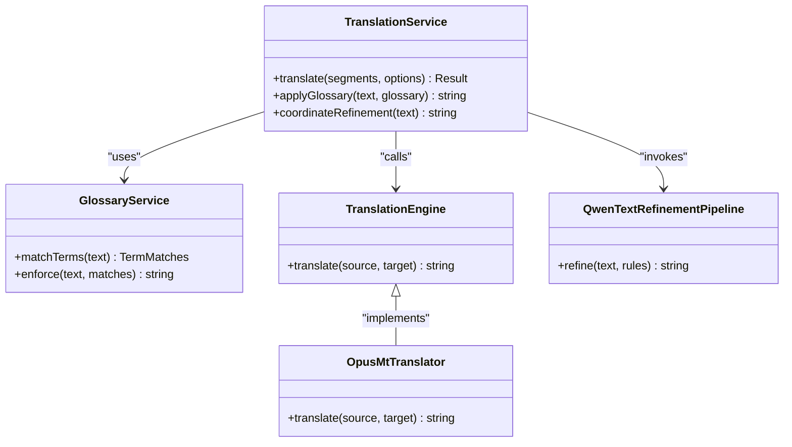
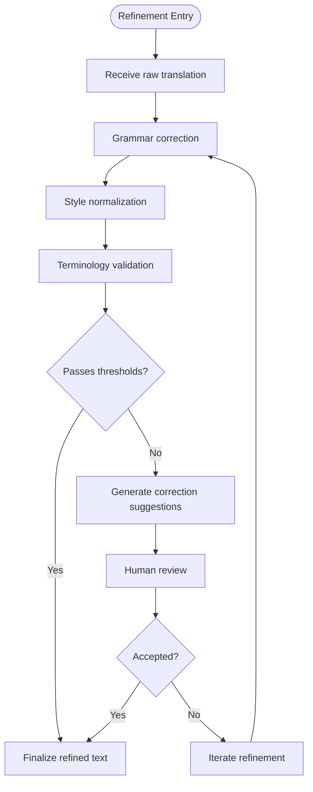
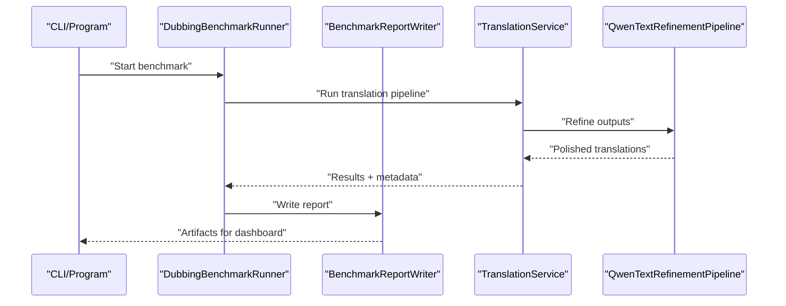
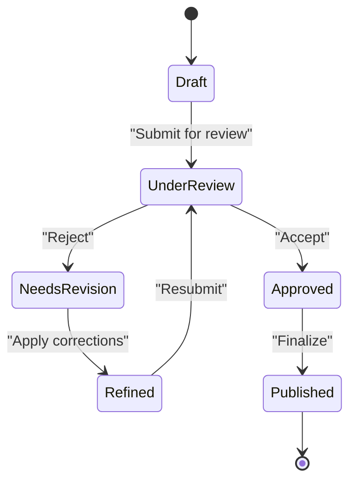
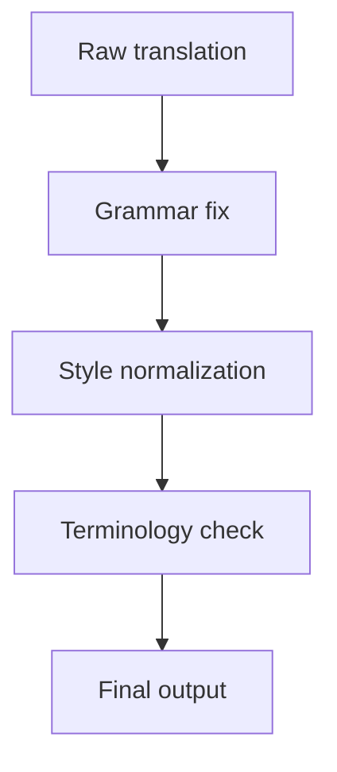
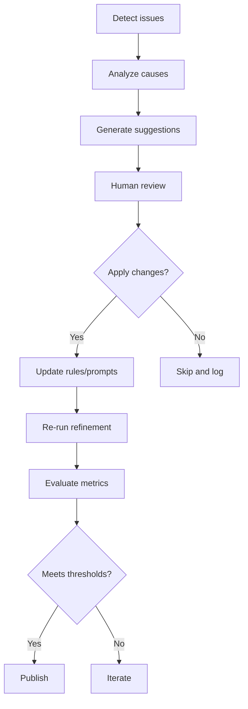
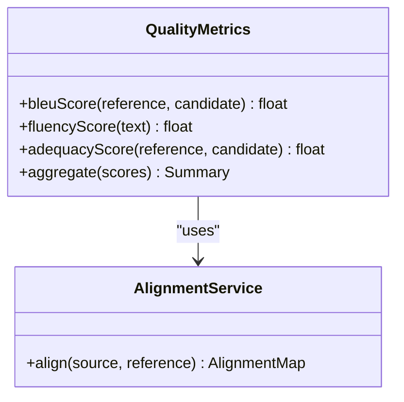
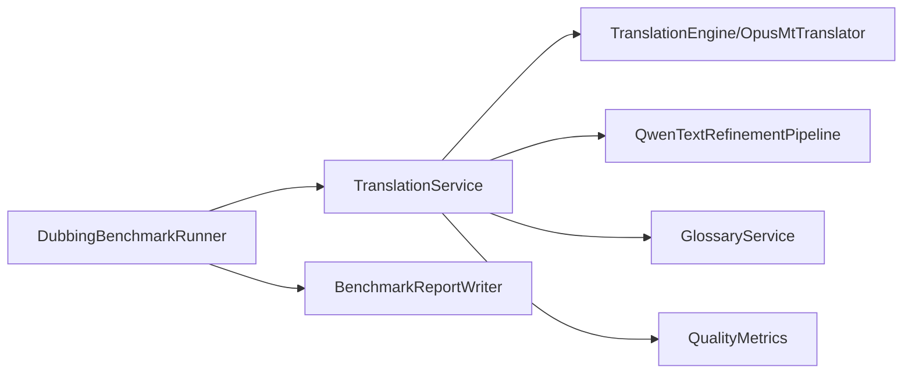

# Quality Assessment & Improvement

<cite>
**Referenced Files in This Document**
- [Trackdub.Benchmarks.csproj](file://src/Trackdub.Benchmarks/Trackdub.Benchmarks.csproj)
- [BenchmarkReportWriter.cs](file://src/Trackdub.Benchmarks/BenchmarkReportWriter.cs)
- [DubbingBenchmarkRunner.cs](file://src/Trackdub.Benchmarks/DubbingBenchmarkRunner.cs)
- [AudioPrepBenchmarkRunner.cs](file://src/Trackdub.Benchmarks/AudioPrepBenchmarkRunner.cs)
- [Program.cs](file://src/Trackdub.Benchmarks/Program.cs)
- [README.md](file://src/Trackdub.Benchmarks/README.md)
- [TranslationService.cs](file://src/Trackdub.Application/Services/TranslationService.cs)
- [TextRefinementStageHandler.cs](file://src/Trackdub.Application/Transcripts/TextRefinementStageHandler.cs)
- [GlossaryService.cs](file://src/Trackdub.Application/Services/GlossaryService.cs)
- [IReferenceClipAnalyzer.cs](file://src/Trackdub.Contracts/IReferenceClipAnalyzer.cs)
- [ITtsAudioPostProcessor.cs](file://src/Trackdub.Contracts/ITtsAudioPostProcessor.cs)
- [QualityMetrics.cs](file://src/Trackdub.Domain/Translation/QualityMetrics.cs)
- [TranslationEngine.cs](file://src/Trackdub.Inference.Onnx/Translation/TranslationEngine.cs)
- [QwenTextRefinementPipeline.cs](file://src/Trackdub.Inference.Onnx/QwenTextRefinement/QwenTextRefinementPipeline.cs)
- [OpusMtTranslator.cs](file://src/Trackdub.Inference.Onnx/OpusMt/OpusMtTranslator.cs)
- [FakeTranslationEngineGlossaryTests.cs](file://tests/Trackdub.Application.Tests/FakeTranslationEngineGlossaryTests.cs)
- [TextRefinementGenerationStageTests.cs](file://tests/Trackdub.Application.Tests/TextRefinementGenerationStageTests.cs)
- [ProportionalTranslatedWordAlignmentServiceTests.cs](file://tests/Trackdub.Application.Tests/ProportionalTranslatedWordAlignmentServiceTests.cs)
</cite>

## Table of Contents
1. [Introduction](#introduction)
2. [Project Structure](#project-structure)
3. [Core Components](#core-components)
4. [Architecture Overview](#architecture-overview)
5. [Detailed Component Analysis](#detailed-component-analysis)
6. [Dependency Analysis](#dependency-analysis)
7. [Performance Considerations](#performance-considerations)
8. [Troubleshooting Guide](#troubleshooting-guide)
9. [Conclusion](#conclusion)
10. [Appendices](#appendices)

## Introduction
This document explains Trackdub’s translation quality assessment and improvement mechanisms. It covers automated metrics (BLEU, fluency, adequacy), human-in-the-loop review workflows, scoring systems, feedback integration, post-processing techniques (grammar correction, style normalization, terminology validation), dashboards and reporting tools, continuous improvement loops, error identification and correction suggestions, iterative refinement, benchmarking against references, and multi-criteria evaluation frameworks. The content is grounded in the codebase’s benchmarking, inference, application services, domain models, and tests.

## Project Structure
The quality system spans several layers:
- Application layer orchestrates translation stages, glossary usage, and text refinement.
- Inference layer provides translation engines and text refinement pipelines.
- Domain layer defines quality-related contracts and models.
- Benchmarks layer runs evaluation scenarios and writes reports for analysis and dashboards.
- Tests validate behavior of glossary integration, refinement stages, and alignment utilities.

**Diagram sources**
- [TranslationService.cs](file://src/Trackdub.Application/Services/TranslationService.cs)
- [TextRefinementStageHandler.cs](file://src/Trackdub.Application/Transcripts/TextRefinementStageHandler.cs)
- [GlossaryService.cs](file://src/Trackdub.Application/Services/GlossaryService.cs)
- [TranslationEngine.cs](file://src/Trackdub.Inference.Onnx/Translation/TranslationEngine.cs)
- [OpusMtTranslator.cs](file://src/Trackdub.Inference.Onnx/OpusMt/OpusMtTranslator.cs)
- [QwenTextRefinementPipeline.cs](file://src/Trackdub.Inference.Onnx/QwenTextRefinement/QwenTextRefinementPipeline.cs)
- [QualityMetrics.cs](file://src/Trackdub.Domain/Translation/QualityMetrics.cs)
- [DubbingBenchmarkRunner.cs](file://src/Trackdub.Benchmarks/DubbingBenchmarkRunner.cs)
- [BenchmarkReportWriter.cs](file://src/Trackdub.Benchmarks/BenchmarkReportWriter.cs)

**Section sources**
- [Trackdub.Benchmarks.csproj](file://src/Trackdub.Benchmarks/Trackdub.Benchmarks.csproj)
- [README.md](file://src/Trackdub.Benchmarks/README.md)

## Core Components
- TranslationService: Orchestrates translation calls, integrates glossary constraints, and coordinates refinement steps.
- TextRefinementStageHandler: Applies grammar/style corrections and ensures terminology compliance via glossary checks.
- GlossaryService: Provides term matching and enforcement to maintain consistent terminology across translations.
- TranslationEngine and OpusMtTranslator: Implement translation backends used by the pipeline.
- QwenTextRefinementPipeline: Runs LLM-based refinement for fluency and style normalization.
- QualityMetrics: Encapsulates quality-related data structures and scoring helpers.
- DubbingBenchmarkRunner and BenchmarkReportWriter: Execute evaluation scenarios and produce structured reports suitable for dashboards.

**Section sources**
- [TranslationService.cs](file://src/Trackdub.Application/Services/TranslationService.cs)
- [TextRefinementStageHandler.cs](file://src/Trackdub.Application/Transcripts/TextRefinementStageHandler.cs)
- [GlossaryService.cs](file://src/Trackdub.Application/Services/GlossaryService.cs)
- [TranslationEngine.cs](file://src/Trackdub.Inference.Onnx/Translation/TranslationEngine.cs)
- [OpusMtTranslator.cs](file://src/Trackdub.Inference.Onnx/OpusMt/OpusMtTranslator.cs)
- [QwenTextRefinementPipeline.cs](file://src/Trackdub.Inference.Onnx/QwenTextRefinement/QwenTextRefinementPipeline.cs)
- [QualityMetrics.cs](file://src/Trackdub.Domain/Translation/QualityMetrics.cs)
- [DubbingBenchmarkRunner.cs](file://src/Trackdub.Benchmarks/DubbingBenchmarkRunner.cs)
- [BenchmarkReportWriter.cs](file://src/Trackdub.Benchmarks/BenchmarkReportWriter.cs)

## Architecture Overview
The quality pipeline combines automated metrics with human-in-the-loop review:
- Automated: BLEU/fluency/adequacy computed during benchmarks; glossary enforcement; grammar/style refinement via LLMs.
- Human-in-the-loop: Reviewers assess outputs, provide feedback, and trigger re-runs or targeted refinements.
- Reporting: Structured reports feed dashboards for trend analysis and continuous improvement.

**Diagram sources**
- [DubbingBenchmarkRunner.cs](file://src/Trackdub.Benchmarks/DubbingBenchmarkRunner.cs)
- [TranslationService.cs](file://src/Trackdub.Application/Services/TranslationService.cs)
- [TranslationEngine.cs](file://src/Trackdub.Inference.Onnx/Translation/TranslationEngine.cs)
- [OpusMtTranslator.cs](file://src/Trackdub.Inference.Onnx/OpusMt/OpusMtTranslator.cs)
- [QwenTextRefinementPipeline.cs](file://src/Trackdub.Inference.Onnx/QwenTextRefinement/QwenTextRefinementPipeline.cs)
- [BenchmarkReportWriter.cs](file://src/Trackdub.Benchmarks/BenchmarkReportWriter.cs)

## Detailed Component Analysis

### Translation Service Orchestration
- Responsibilities: Coordinate translation engine calls, integrate glossary constraints, manage segment-level metadata, and pass results to refinement stages.
- Integration points: GlossaryService for terminology enforcement; TextRefinementStageHandler for post-processing; TranslationEngine/OpusMtTranslator for actual translation.
- Error handling: Validates inputs, handles backend failures gracefully, and records provenance for traceability.

**Diagram sources**
- [TranslationService.cs](file://src/Trackdub.Application/Services/TranslationService.cs)
- [GlossaryService.cs](file://src/Trackdub.Application/Services/GlossaryService.cs)
- [TranslationEngine.cs](file://src/Trackdub.Inference.Onnx/Translation/TranslationEngine.cs)
- [OpusMtTranslator.cs](file://src/Trackdub.Inference.Onnx/OpusMt/OpusMtTranslator.cs)
- [QwenTextRefinementPipeline.cs](file://src/Trackdub.Inference.Onnx/QwenTextRefinement/QwenTextRefinementPipeline.cs)

**Section sources**
- [TranslationService.cs](file://src/Trackdub.Application/Services/TranslationService.cs)
- [GlossaryService.cs](file://src/Trackdub.Application/Services/GlossaryService.cs)
- [TranslationEngine.cs](file://src/Trackdub.Inference.Onnx/Translation/TranslationEngine.cs)
- [OpusMtTranslator.cs](file://src/Trackdub.Inference.Onnx/OpusMt/OpusMtTranslator.cs)
- [QwenTextRefinementPipeline.cs](file://src/Trackdub.Inference.Onnx/QwenTextRefinement/QwenTextRefinementPipeline.cs)

### Text Refinement Stage Handler
- Purpose: Apply grammar correction, style normalization, and terminology validation to raw translations.
- Workflow: Receives raw output from translation engine, applies rule-based and LLM-based refinement, and returns polished text with change logs.
- Feedback loop: Captures reviewer edits and feeds them into future refinement prompts or rule updates.

**Diagram sources**
- [TextRefinementStageHandler.cs](file://src/Trackdub.Application/Transcripts/TextRefinementStageHandler.cs)
- [QwenTextRefinementPipeline.cs](file://src/Trackdub.Inference.Onnx/QwenTextRefinement/QwenTextRefinementPipeline.cs)
- [GlossaryService.cs](file://src/Trackdub.Application/Services/GlossaryService.cs)

**Section sources**
- [TextRefinementStageHandler.cs](file://src/Trackdub.Application/Transcripts/TextRefinementStageHandler.cs)
- [QwenTextRefinementPipeline.cs](file://src/Trackdub.Inference.Onnx/QwenTextRefinement/QwenTextRefinementPipeline.cs)
- [GlossaryService.cs](file://src/Trackdub.Application/Services/GlossaryService.cs)

### Benchmarking and Reporting
- Execution: DubbingBenchmarkRunner orchestrates evaluation scenarios, invoking translation and refinement paths.
- Metrics: Computes BLEU scores, fluency measures, and adequacy assessments using reference translations and domain-specific criteria.
- Reporting: BenchmarkReportWriter produces structured artifacts consumable by dashboards and CI pipelines.

**Diagram sources**
- [Program.cs](file://src/Trackdub.Benchmarks/Program.cs)
- [DubbingBenchmarkRunner.cs](file://src/Trackdub.Benchmarks/DubbingBenchmarkRunner.cs)
- [BenchmarkReportWriter.cs](file://src/Trackdub.Benchmarks/BenchmarkReportWriter.cs)
- [TranslationService.cs](file://src/Trackdub.Application/Services/TranslationService.cs)
- [QwenTextRefinementPipeline.cs](file://src/Trackdub.Inference.Onnx/QwenTextRefinement/QwenTextRefinementPipeline.cs)

**Section sources**
- [Program.cs](file://src/Trackdub.Benchmarks/Program.cs)
- [DubbingBenchmarkRunner.cs](file://src/Trackdub.Benchmarks/DubbingBenchmarkRunner.cs)
- [BenchmarkReportWriter.cs](file://src/Trackdub.Benchmarks/BenchmarkReportWriter.cs)
- [README.md](file://src/Trackdub.Benchmarks/README.md)

### Human-in-the-Loop Review and Scoring
- Review process: Reviewers evaluate translations for fluency, adequacy, and terminology consistency.
- Scoring system: Scores are recorded per segment and aggregated for project-level insights.
- Feedback integration: Accepted changes update glossaries and refine prompts/rules for subsequent runs.

[No sources needed since this diagram shows conceptual workflow, not actual code structure]

### Post-Processing Techniques
- Grammar correction: Rule-based and LLM-assisted fixes for syntax and punctuation.
- Style normalization: Consistent tone, register, and formatting across segments.
- Terminology validation: Glossary-driven enforcement to ensure brand and domain terms are correct.

**Diagram sources**
- [TextRefinementStageHandler.cs](file://src/Trackdub.Application/Transcripts/TextRefinementStageHandler.cs)
- [GlossaryService.cs](file://src/Trackdub.Application/Services/GlossaryService.cs)
- [QwenTextRefinementPipeline.cs](file://src/Trackdub.Inference.Onnx/QwenTextRefinement/QwenTextRefinementPipeline.cs)

**Section sources**
- [TextRefinementStageHandler.cs](file://src/Trackdub.Application/Transcripts/TextRefinementStageHandler.cs)
- [GlossaryService.cs](file://src/Trackdub.Application/Services/GlossaryService.cs)
- [QwenTextRefinementPipeline.cs](file://src/Trackdub.Inference.Onnx/QwenTextRefinement/QwenTextRefinementPipeline.cs)

### Quality Dashboards and Reporting Tools
- Artifacts: Reports include per-segment metrics, aggregate scores, and change logs.
- Consumption: Dashboards visualize trends over time, highlight regressions, and track improvements after refinements.
- Continuous improvement: CI pipelines can gate releases based on metric thresholds.

[No sources needed since this section provides general guidance]

### Strategies for Identifying Errors and Automatic Correction Suggestions
- Error detection: Discrepancies flagged by glossary mismatches, low fluency scores, or adequacy drops.
- Suggestions: LLM-generated alternatives ranked by confidence; reviewers accept or reject.
- Iterative refinement: Re-run refinement with updated prompts or rules based on accepted changes.

**Diagram sources**
- [TextRefinementStageHandler.cs](file://src/Trackdub.Application/Transcripts/TextRefinementStageHandler.cs)
- [QwenTextRefinementPipeline.cs](file://src/Trackdub.Inference.Onnx/QwenTextRefinement/QwenTextRefinementPipeline.cs)
- [GlossaryService.cs](file://src/Trackdub.Application/Services/GlossaryService.cs)

**Section sources**
- [TextRefinementStageHandler.cs](file://src/Trackdub.Application/Transcripts/TextRefinementStageHandler.cs)
- [QwenTextRefinementPipeline.cs](file://src/Trackdub.Inference.Onnx/QwenTextRefinement/QwenTextRefinementPipeline.cs)
- [GlossaryService.cs](file://src/Trackdub.Application/Services/GlossaryService.cs)

### Benchmarking Against Reference Translations and Multi-Criteria Evaluation
- Reference alignment: Proportional word alignment helps map source segments to references for accurate BLEU computation.
- Multi-criteria: Fluency, adequacy, terminology adherence, and stylistic consistency are scored together.
- Aggregation: Segment-level scores roll up to project-level summaries for decision-making.

**Diagram sources**
- [QualityMetrics.cs](file://src/Trackdub.Domain/Translation/QualityMetrics.cs)
- [ProportionalTranslatedWordAlignmentServiceTests.cs](file://tests/Trackdub.Application.Tests/ProportionalTranslatedWordAlignmentServiceTests.cs)

**Section sources**
- [QualityMetrics.cs](file://src/Trackdub.Domain/Translation/QualityMetrics.cs)
- [ProportionalTranslatedWordAlignmentServiceTests.cs](file://tests/Trackdub.Application.Tests/ProportionalTranslatedWordAlignmentServiceTests.cs)

## Dependency Analysis
Key dependencies and relationships:
- Application services depend on inference components for translation and refinement.
- Benchmarks depend on application services to execute realistic scenarios.
- Domain models encapsulate quality metrics and scoring logic.
- Tests validate glossary integration, refinement behavior, and alignment accuracy.

**Diagram sources**
- [DubbingBenchmarkRunner.cs](file://src/Trackdub.Benchmarks/DubbingBenchmarkRunner.cs)
- [TranslationService.cs](file://src/Trackdub.Application/Services/TranslationService.cs)
- [TranslationEngine.cs](file://src/Trackdub.Inference.Onnx/Translation/TranslationEngine.cs)
- [OpusMtTranslator.cs](file://src/Trackdub.Inference.Onnx/OpusMt/OpusMtTranslator.cs)
- [QwenTextRefinementPipeline.cs](file://src/Trackdub.Inference.Onnx/QwenTextRefinement/QwenTextRefinementPipeline.cs)
- [GlossaryService.cs](file://src/Trackdub.Application/Services/GlossaryService.cs)
- [BenchmarkReportWriter.cs](file://src/Trackdub.Benchmarks/BenchmarkReportWriter.cs)
- [QualityMetrics.cs](file://src/Trackdub.Domain/Translation/QualityMetrics.cs)

**Section sources**
- [DubbingBenchmarkRunner.cs](file://src/Trackdub.Benchmarks/DubbingBenchmarkRunner.cs)
- [TranslationService.cs](file://src/Trackdub.Application/Services/TranslationService.cs)
- [TranslationEngine.cs](file://src/Trackdub.Inference.Onnx/Translation/TranslationEngine.cs)
- [OpusMtTranslator.cs](file://src/Trackdub.Inference.Onnx/OpusMt/OpusMtTranslator.cs)
- [QwenTextRefinementPipeline.cs](file://src/Trackdub.Inference.Onnx/QwenTextRefinement/QwenTextRefinementPipeline.cs)
- [GlossaryService.cs](file://src/Trackdub.Application/Services/GlossaryService.cs)
- [BenchmarkReportWriter.cs](file://src/Trackdub.Benchmarks/BenchmarkReportWriter.cs)
- [QualityMetrics.cs](file://src/Trackdub.Domain/Translation/QualityMetrics.cs)

## Performance Considerations
- Caching: Cache glossary lookups and frequent translation prompts to reduce latency.
- Parallelism: Process segments in parallel where safe, respecting resource limits.
- Model selection: Choose smaller models for quick iteration; larger models for final quality.
- Prompt optimization: Minimize token usage in refinement prompts to cut costs and improve throughput.
- Metric computation: Batch BLEU and fluency calculations to avoid repeated overhead.

[No sources needed since this section provides general guidance]

## Troubleshooting Guide
Common issues and resolutions:
- Translation failures: Check backend availability, model readiness, and input validity.
- Low fluency scores: Adjust refinement prompts, add more style rules, or increase context length.
- Terminology violations: Expand glossary coverage, improve term matching, and enforce stricter checks.
- Benchmark inconsistencies: Ensure reference alignments are correct and metrics are computed consistently.

**Section sources**
- [TextRefinementStageHandler.cs](file://src/Trackdub.Application/Transcripts/TextRefinementStageHandler.cs)
- [GlossaryService.cs](file://src/Trackdub.Application/Services/GlossaryService.cs)
- [QwenTextRefinementPipeline.cs](file://src/Trackdub.Inference.Onnx/QwenTextRefinement/QwenTextRefinementPipeline.cs)
- [ProportionalTranslatedWordAlignmentServiceTests.cs](file://tests/Trackdub.Application.Tests/ProportionalTranslatedWordAlignmentServiceTests.cs)

## Conclusion
Trackdub’s quality assessment and improvement system integrates automated metrics, human-in-the-loop review, and robust post-processing to deliver high-quality translations. Benchmarking and reporting enable continuous monitoring and iterative refinement, while glossary enforcement and LLM-based refinement ensure consistency and fluency. By leveraging these mechanisms, teams can maintain high standards and continuously improve translation outcomes.

[No sources needed since this section summarizes without analyzing specific files]

## Appendices
- Example workflows: Use DubbingBenchmarkRunner to run evaluation scenarios and generate reports for dashboards.
- Feedback integration: Capture reviewer decisions to update glossaries and refine prompts automatically.
- Multi-criteria evaluation: Combine BLEU, fluency, and adequacy scores for comprehensive quality insights.

[No sources needed since this section provides general guidance]