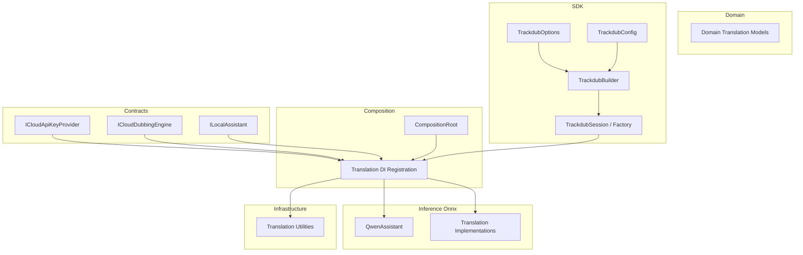
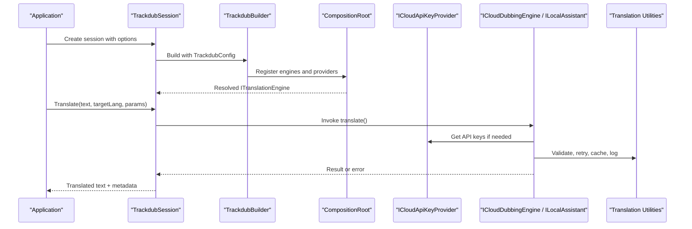
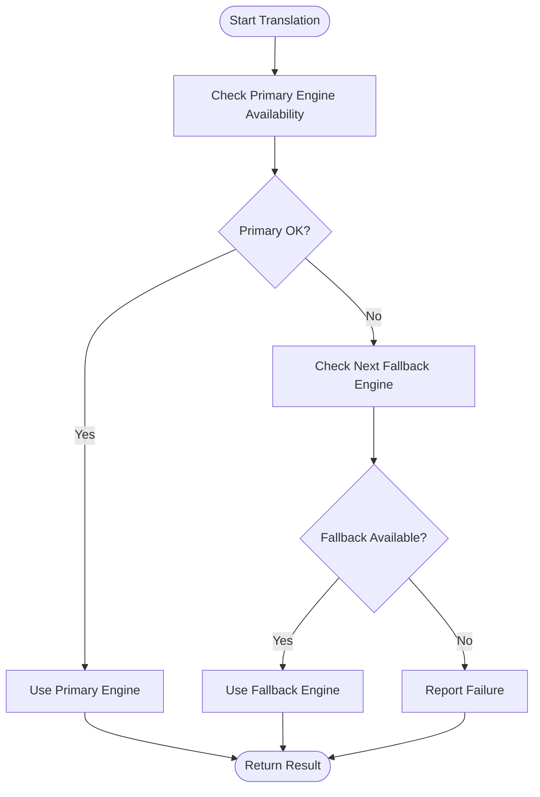
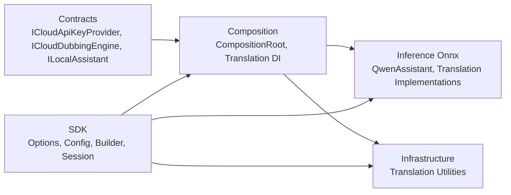

# Translation Engine Configuration

<cite>
**Referenced Files in This Document**
- [Trackdub.Contracts.csproj](file://src/Trackdub.Contracts/Trackdub.Contracts.csproj)
- [ICloudApiKeyProvider.cs](file://src/Trackdub.Contracts/ICloudApiKeyProvider.cs)
- [ICloudDubbingEngine.cs](file://src/Trackdub.Contracts/ICloudDubbingEngine.cs)
- [ILocalAssistant.cs](file://src/Trackdub.Contracts/ILocalAssistant.cs)
- [Translation](file://src/Trackdub.Domain/Translation)
- [CompositionRoot.cs](file://src/Trackdub.Composition/CompositionRoot.cs)
- [Translation](file://src/Trackdub.Composition/Translation)
- [QwenAssistant](file://src/Trackdub.Inference.Onnx/QwenAssistant)
- [Translation](file://src/Trackdub.Inference.Onnx/Translation)
- [Translation](file://src/Trackdub.Infrastructure/Translation)
- [TrackdubOptions.cs](file://src/Trackdub.Sdk/TrackdubOptions.cs)
- [TrackdubConfig.cs](file://src/Trackdub.Sdk/TrackdubConfig.cs)
- [TrackdubBuilder.cs](file://src/Trackdub.Sdk/TrackdubBuilder.cs)
- [TrackdubSession.cs](file://src/Trackdub.Sdk/TrackdubSession.cs)
- [TrackdubSessionFactory.cs](file://src/Trackdub.Sdk/TrackdubSessionFactory.cs)
</cite>

## Table of Contents
1. [Introduction](#introduction)
2. [Project Structure](#project-structure)
3. [Core Components](#core-components)
4. [Architecture Overview](#architecture-overview)
5. [Detailed Component Analysis](#detailed-component-analysis)
6. [Dependency Analysis](#dependency-analysis)
7. [Performance Considerations](#performance-considerations)
8. [Troubleshooting Guide](#troubleshooting-guide)
9. [Conclusion](#conclusion)
10. [Appendices](#appendices)

## Introduction
This document explains how to configure translation engines in Trackdub, including Qwen Assistant, cloud-based services, and local models. It covers supported engine types, configuration options, authentication setup, API key management, connection parameters, selection strategies, fallback mechanisms, performance tuning, environment variables, programmatic SDK configuration, and troubleshooting steps for common issues such as connectivity problems and model loading failures.

## Project Structure
Translation-related code spans contracts, domain models, composition (DI wiring), inference implementations, infrastructure utilities, and the public SDK surface. The following diagram shows the high-level structure relevant to translation engine configuration:

**Diagram sources**
- [CompositionRoot.cs](file://src/Trackdub.Composition/CompositionRoot.cs)
- [Translation](file://src/Trackdub.Composition/Translation)
- [QwenAssistant](file://src/Trackdub.Inference.Onnx/QwenAssistant)
- [Translation](file://src/Trackdub.Inference.Onnx/Translation)
- [Translation](file://src/Trackdub.Infrastructure/Translation)
- [TrackdubOptions.cs](file://src/Trackdub.Sdk/TrackdubOptions.cs)
- [TrackdubConfig.cs](file://src/Trackdub.Sdk/TrackdubConfig.cs)
- [TrackdubBuilder.cs](file://src/Trackdub.Sdk/TrackdubBuilder.cs)
- [TrackdubSession.cs](file://src/Trackdub.Sdk/TrackdubSession.cs)
- [TrackdubSessionFactory.cs](file://src/Trackdub.Sdk/TrackdubSessionFactory.cs)

**Section sources**
- [CompositionRoot.cs](file://src/Trackdub.Composition/CompositionRoot.cs)
- [Translation](file://src/Trackdub.Composition/Translation)
- [QwenAssistant](file://src/Trackdub.Inference.Onnx/QwenAssistant)
- [Translation](file://src/Trackdub.Inference.Onnx/Translation)
- [Translation](file://src/Trackdub.Infrastructure/Translation)
- [TrackdubOptions.cs](file://src/Trackdub.Sdk/TrackdubOptions.cs)
- [TrackdubConfig.cs](file://src/Trackdub.Sdk/TrackdubConfig.cs)
- [TrackdubBuilder.cs](file://src/Trackdub.Sdk/TrackdubBuilder.cs)
- [TrackdubSession.cs](file://src/Trackdub.Sdk/TrackdubSession.cs)
- [TrackdubSessionFactory.cs](file://src/Trackdub.Sdk/TrackdubSessionFactory.cs)

## Core Components
- Cloud API Key Provider: Centralizes retrieval of cloud provider credentials used by translation engines.
- Cloud Dubbing Engine Interface: Abstraction for cloud-based translation/dubbing backends.
- Local Assistant Interface: Abstraction for local model-based translation assistants.
- Domain Translation Models: Shared data structures for translation requests/responses.
- Composition Root and Translation DI: Wires concrete providers and engines into the runtime based on configuration.
- Inference Implementations: Concrete translation engines, including Qwen Assistant and other local or cloud-backed implementations.
- Infrastructure Translation Utilities: Helpers for validation, caching, retries, and telemetry around translation calls.
- SDK Surface: Options, configuration, builder, and session APIs for programmatic setup of translation engines.

Key responsibilities:
- Resolve which translation engine to use based on configuration and availability.
- Manage authentication and connection parameters per engine type.
- Provide fallback chains when primary engines fail.
- Expose performance tuning knobs (e.g., temperature, max tokens, context window).
- Offer consistent error handling and diagnostics.

**Section sources**
- [ICloudApiKeyProvider.cs](file://src/Trackdub.Contracts/ICloudApiKeyProvider.cs)
- [ICloudDubbingEngine.cs](file://src/Trackdub.Contracts/ICloudDubbingEngine.cs)
- [ILocalAssistant.cs](file://src/Trackdub.Contracts/ILocalAssistant.cs)
- [Translation](file://src/Trackdub.Domain/Translation)
- [CompositionRoot.cs](file://src/Trackdub.Composition/CompositionRoot.cs)
- [Translation](file://src/Trackdub.Composition/Translation)
- [QwenAssistant](file://src/Trackdub.Inference.Onnx/QwenAssistant)
- [Translation](file://src/Trackdub.Inference.Onnx/Translation)
- [Translation](file://src/Trackdub.Infrastructure/Translation)
- [TrackdubOptions.cs](file://src/Trackdub.Sdk/TrackdubOptions.cs)
- [TrackdubConfig.cs](file://src/Trackdub.Sdk/TrackdubConfig.cs)
- [TrackdubBuilder.cs](file://src/Trackdub.Sdk/TrackdubBuilder.cs)
- [TrackdubSession.cs](file://src/Trackdub.Sdk/TrackdubSession.cs)
- [TrackdubSessionFactory.cs](file://src/Trackdub.Sdk/TrackdubSessionFactory.cs)

## Architecture Overview
The translation subsystem follows a layered architecture with clear separation between contracts, composition, implementation, and SDK entry points. Engines are selected at runtime based on configuration and environment, with fallbacks managed centrally.

**Diagram sources**
- [CompositionRoot.cs](file://src/Trackdub.Composition/CompositionRoot.cs)
- [Translation](file://src/Trackdub.Composition/Translation)
- [ICloudApiKeyProvider.cs](file://src/Trackdub.Contracts/ICloudApiKeyProvider.cs)
- [ICloudDubbingEngine.cs](file://src/Trackdub.Contracts/ICloudDubbingEngine.cs)
- [ILocalAssistant.cs](file://src/Trackdub.Contracts/ILocalAssistant.cs)
- [TrackdubSession.cs](file://src/Trackdub.Sdk/TrackdubSession.cs)
- [TrackdubBuilder.cs](file://src/Trackdub.Sdk/TrackdubBuilder.cs)
- [TrackdubConfig.cs](file://src/Trackdub.Sdk/TrackdubConfig.cs)
- [Translation](file://src/Trackdub.Infrastructure/Translation)

## Detailed Component Analysis

### Cloud-Based Translation Engines
- Purpose: Use remote APIs for translation via configured providers.
- Authentication: Managed through a centralized API key provider interface.
- Connection Parameters: Base URL, timeouts, retry policies, and headers are typically resolved from configuration.
- Selection Strategy: Primary engine chosen by configuration; fallback engines can be specified.
- Performance Tuning: Request batching, concurrency limits, and response parsing optimizations.

Configuration highlights:
- API keys sourced from environment variables or secure stores.
- Per-engine settings like endpoint URLs, request/response size limits, and retry/backoff policies.
- Fallback chain order determines which engine is tried first and subsequent attempts on failure.

**Section sources**
- [ICloudApiKeyProvider.cs](file://src/Trackdub.Contracts/ICloudApiKeyProvider.cs)
- [ICloudDubbingEngine.cs](file://src/Trackdub.Contracts/ICloudDubbingEngine.cs)
- [Translation](file://src/Trackdub.Infrastructure/Translation)

### Local Model-Based Translation Engines
- Purpose: Run translation models locally for privacy and offline support.
- Supported Engines: Includes Qwen Assistant and other ONNX-based implementations.
- Model Loading: Models are discovered and loaded via inference runtime; readiness checks ensure availability.
- Parameters: Temperature, max tokens, and context window size are exposed where applicable.
- Performance Tuning: Execution provider selection (CPU/GPU), memory budgets, and batch sizes.

Configuration highlights:
- Model paths or identifiers, execution provider preferences, and quantization options.
- Context window sizing and token limits to balance quality and latency.
- Caching of model artifacts and warm-up routines to reduce cold start times.

**Section sources**
- [ILocalAssistant.cs](file://src/Trackdub.Contracts/ILocalAssistant.cs)
- [QwenAssistant](file://src/Trackdub.Inference.Onnx/QwenAssistant)
- [Translation](file://src/Trackdub.Inference.Onnx/Translation)
- [Translation](file://src/Trackdub.Infrastructure/Translation)

### Qwen Assistant Integration
- Role: Local assistant implementation for translation using Qwen models.
- Configuration: Model identifier, execution provider, and generation parameters.
- Parameters:
  - Temperature: Controls randomness in output.
  - Max Tokens: Limits response length.
  - Context Window Size: Maximum input tokens considered during generation.
- Readiness: Checks for model presence and GPU/CPU availability before use.

**Section sources**
- [QwenAssistant](file://src/Trackdub.Inference.Onnx/QwenAssistant)
- [ILocalAssistant.cs](file://src/Trackdub.Contracts/ILocalAssistant.cs)

### Engine Selection and Fallback Mechanisms
- Selection Logic:
  - Primary engine determined by configuration and environment.
  - Availability checks (API keys, network, model files) influence eligibility.
- Fallback Chain:
  - If primary fails due to auth, network, or model load errors, next engine in chain is attempted.
  - Errors are logged and surfaced consistently across engines.
- Diagnostics:
  - Telemetry captures engine choice, latency, and failure reasons.

**Diagram sources**
- [CompositionRoot.cs](file://src/Trackdub.Composition/CompositionRoot.cs)
- [Translation](file://src/Trackdub.Infrastructure/Translation)

**Section sources**
- [CompositionRoot.cs](file://src/Trackdub.Composition/CompositionRoot.cs)
- [Translation](file://src/Trackdub.Infrastructure/Translation)

### Programmatic Configuration via SDK
- TrackdubOptions: Define global settings including translation engine preferences and defaults.
- TrackdubConfig: Encapsulates configuration values for builders and sessions.
- TrackdubBuilder: Wires dependencies and applies configuration to the runtime.
- TrackdubSession and Factory: Create sessions that apply configuration and provide translation methods.

Typical flow:
- Configure options and secrets (API keys, model paths).
- Build a session using the builder with the provided configuration.
- Invoke translation methods on the session with engine-specific parameters.

**Section sources**
- [TrackdubOptions.cs](file://src/Trackdub.Sdk/TrackdubOptions.cs)
- [TrackdubConfig.cs](file://src/Trackdub.Sdk/TrackdubConfig.cs)
- [TrackdubBuilder.cs](file://src/Trackdub.Sdk/TrackdubBuilder.cs)
- [TrackdubSession.cs](file://src/Trackdub.Sdk/TrackdubSession.cs)
- [TrackdubSessionFactory.cs](file://src/Trackdub.Sdk/TrackdubSessionFactory.cs)

### Environment Variables and Secrets Management
- API Keys: Retrieved via the cloud API key provider interface; commonly backed by environment variables or secure storage.
- Model Paths: For local engines, specify model directories or identifiers.
- Runtime Flags: Control behavior like logging verbosity, retry policies, and execution provider preferences.

Best practices:
- Avoid hardcoding secrets; use environment variables or secret managers.
- Validate required keys at startup to fail fast with clear messages.
- Rotate keys regularly and audit access logs.

**Section sources**
- [ICloudApiKeyProvider.cs](file://src/Trackdub.Contracts/ICloudApiKeyProvider.cs)
- [TrackdubConfig.cs](file://src/Trackdub.Sdk/TrackdubConfig.cs)

## Dependency Analysis
The translation subsystem depends on contracts for abstraction, composition for dependency resolution, and inference implementations for actual processing. The SDK layer provides configuration and session management.

**Diagram sources**
- [ICloudApiKeyProvider.cs](file://src/Trackdub.Contracts/ICloudApiKeyProvider.cs)
- [ICloudDubbingEngine.cs](file://src/Trackdub.Contracts/ICloudDubbingEngine.cs)
- [ILocalAssistant.cs](file://src/Trackdub.Contracts/ILocalAssistant.cs)
- [CompositionRoot.cs](file://src/Trackdub.Composition/CompositionRoot.cs)
- [Translation](file://src/Trackdub.Composition/Translation)
- [QwenAssistant](file://src/Trackdub.Inference.Onnx/QwenAssistant)
- [Translation](file://src/Trackdub.Inference.Onnx/Translation)
- [Translation](file://src/Trackdub.Infrastructure/Translation)
- [TrackdubOptions.cs](file://src/Trackdub.Sdk/TrackdubOptions.cs)
- [TrackdubConfig.cs](file://src/Trackdub.Sdk/TrackdubConfig.cs)
- [TrackdubBuilder.cs](file://src/Trackdub.Sdk/TrackdubBuilder.cs)
- [TrackdubSession.cs](file://src/Trackdub.Sdk/TrackdubSession.cs)
- [TrackdubSessionFactory.cs](file://src/Trackdub.Sdk/TrackdubSessionFactory.cs)

**Section sources**
- [CompositionRoot.cs](file://src/Trackdub.Composition/CompositionRoot.cs)
- [Translation](file://src/Trackdub.Composition/Translation)
- [QwenAssistant](file://src/Trackdub.Inference.Onnx/QwenAssistant)
- [Translation](file://src/Trackdub.Inference.Onnx/Translation)
- [Translation](file://src/Trackdub.Infrastructure/Translation)
- [TrackdubOptions.cs](file://src/Trackdub.Sdk/TrackdubOptions.cs)
- [TrackdubConfig.cs](file://src/Trackdub.Sdk/TrackdubConfig.cs)
- [TrackdubBuilder.cs](file://src/Trackdub.Sdk/TrackdubBuilder.cs)
- [TrackdubSession.cs](file://src/Trackdub.Sdk/TrackdubSession.cs)
- [TrackdubSessionFactory.cs](file://src/Trackdub.Sdk/TrackdubSessionFactory.cs)

## Performance Considerations
- Concurrency: Tune parallelism for cloud requests and local model inference to match hardware capabilities.
- Caching: Cache model artifacts and frequently used translations to reduce latency.
- Execution Providers: Prefer GPU acceleration when available; fall back to CPU gracefully.
- Token Limits: Adjust max tokens and context window size to balance throughput and memory usage.
- Retry Policies: Configure exponential backoff and circuit breakers for resilient cloud calls.
- Warm-up: Preload models and establish connections at startup to minimize cold starts.

[No sources needed since this section provides general guidance]

## Troubleshooting Guide
Common issues and resolutions:
- Missing API Keys:
  - Ensure environment variables or secret store entries are present and accessible.
  - Validate keys at startup and log detailed errors.
- Connectivity Problems:
  - Check network reachability to cloud endpoints.
  - Inspect timeouts and retry configurations.
- Model Loading Failures:
  - Verify model paths or identifiers exist and are readable.
  - Confirm execution provider compatibility (GPU drivers, CUDA/OpenVINO).
- Parameter Validation:
  - Ensure temperature, max tokens, and context window are within supported ranges.
- Fallback Behavior:
  - Review fallback chain order and engine availability logs.
- Diagnostics:
  - Enable verbose logging and capture telemetry for failed requests.

**Section sources**
- [ICloudApiKeyProvider.cs](file://src/Trackdub.Contracts/ICloudApiKeyProvider.cs)
- [Translation](file://src/Trackdub.Infrastructure/Translation)
- [QwenAssistant](file://src/Trackdub.Inference.Onnx/QwenAssistant)

## Conclusion
Trackdub’s translation engine configuration supports a flexible mix of cloud-based and local models, with robust authentication, selection strategies, and fallback mechanisms. By leveraging the SDK’s options and configuration APIs, users can tailor performance, reliability, and security to their needs. Proper environment setup, parameter tuning, and proactive troubleshooting ensure smooth operation across diverse deployment scenarios.

[No sources needed since this section summarizes without analyzing specific files]

## Appendices
- Example Configuration Patterns:
  - Define engine priorities and fallback order in configuration.
  - Set environment variables for API keys and model paths.
  - Use SDK builder to wire configuration into sessions.
- Best Practices:
  - Validate configuration early and fail fast.
  - Monitor engine health and adjust parameters dynamically.
  - Keep secrets secure and rotate regularly.

[No sources needed since this section provides general guidance]