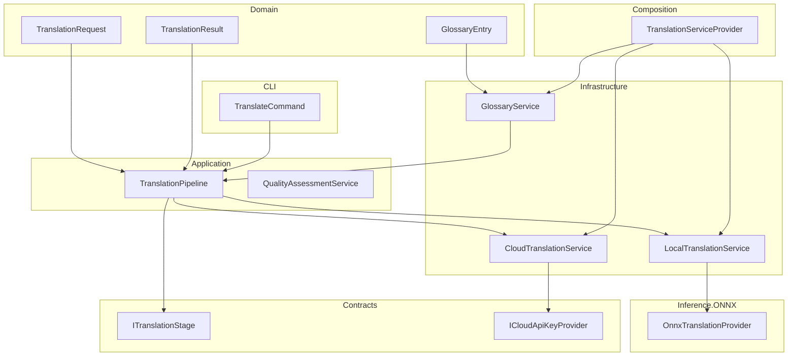
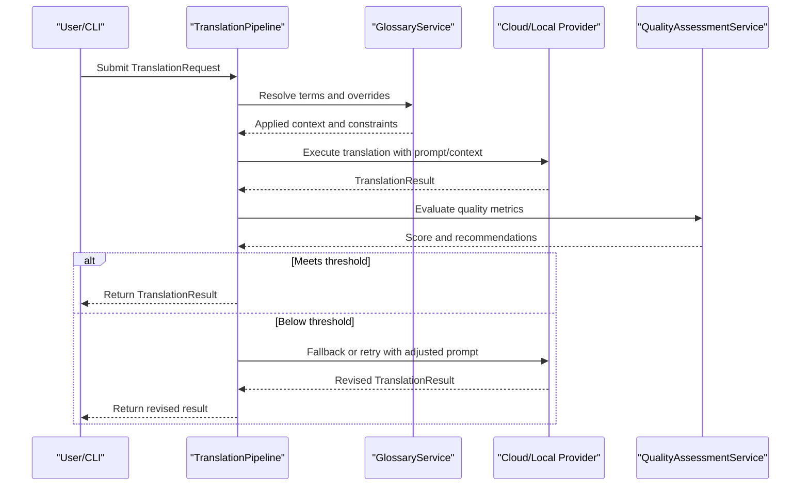
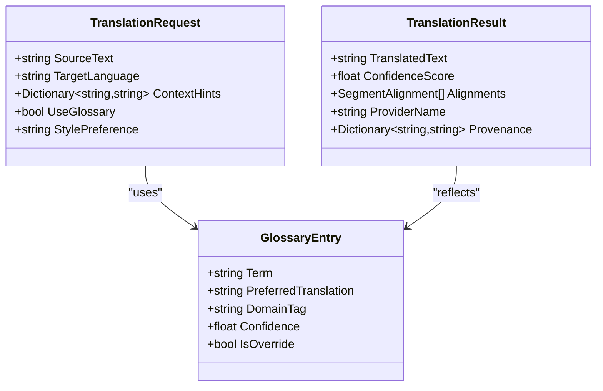
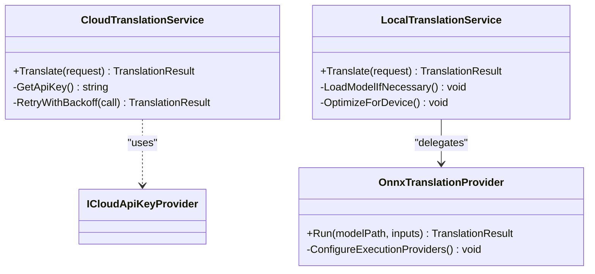
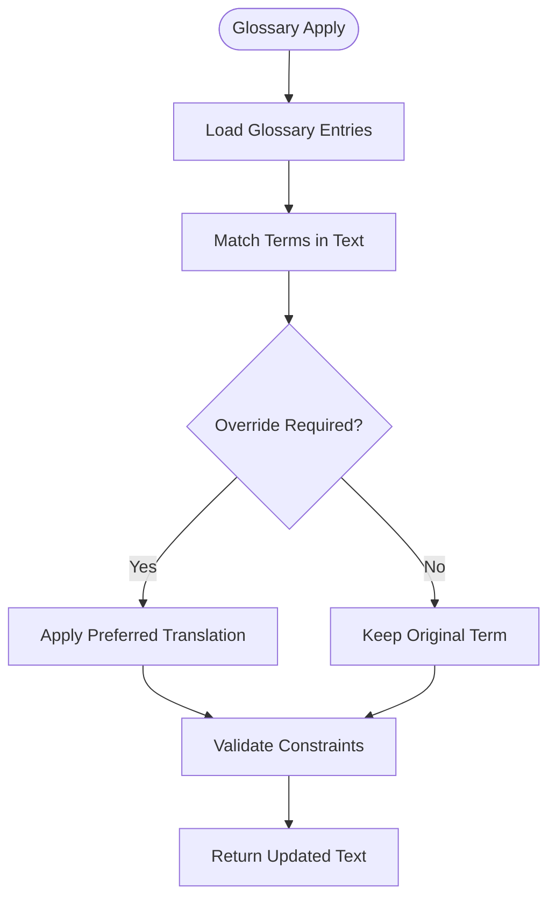
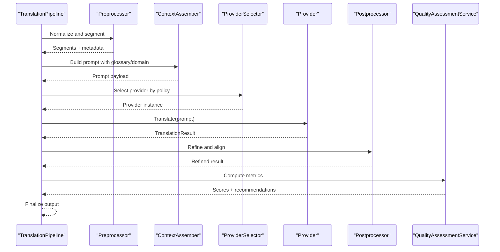
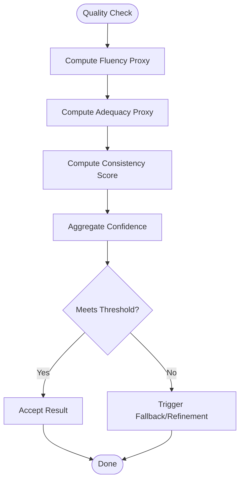
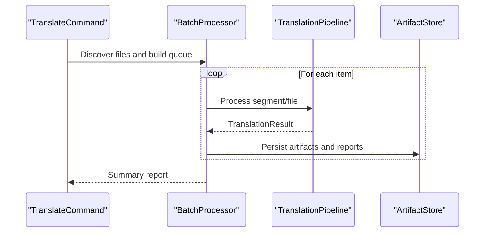
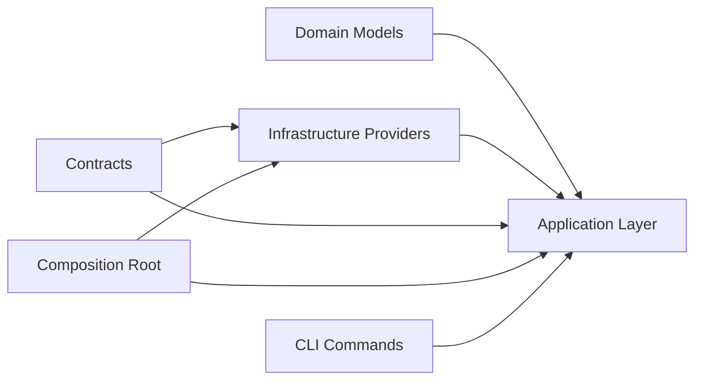

# Translation Services

<cite>
**Referenced Files in This Document**
- [Trackdub.Domain/Translation/TranslationEngine.cs](file://src/Trackdub.Domain/Translation/TranslationEngine.cs)
- [Trackdub.Domain/Translation/TranslationRequest.cs](file://src/Trackdub.Domain/Translation/TranslationRequest.cs)
- [Trackdub.Domain/Translation/TranslationResult.cs](file://src/Trackdub.Domain/Translation/TranslationResult.cs)
- [Trackdub.Domain/Translation/GlossaryEntry.cs](file://src/Trackdub.Domain/Translation/GlossaryEntry.cs)
- [Trackdub.Infrastructure/Translation/CloudTranslationService.cs](file://src/Trackdub.Infrastructure/Translation/CloudTranslationService.cs)
- [Trackdub.Infrastructure/Translation/LocalTranslationService.cs](file://src/Trackdub.Infrastructure/Translation/LocalTranslationService.cs)
- [Trackdub.Infrastructure/Translation/GlossaryService.cs](file://src/Trackdub.Infrastructure/Translation/GlossaryService.cs)
- [Trackdub.Application/Translation/TranslationPipeline.cs](file://src/Trackdub.Application/Translation/TranslationPipeline.cs)
- [Trackdub.Application/Translation/QualityAssessmentService.cs](file://src/Trackdub.Application/Translation/QualityAssessmentService.cs)
- [Trackdub.Inference.Onnx/Translation/OnnxTranslationProvider.cs](file://src/Trackdub.Inference.Onnx/Translation/OnnxTranslationProvider.cs)
- [Trackdub.Contracts/Pipeline/ITranslationStage.cs](file://src/Trackdub.Contracts/Pipeline/ITranslationStage.cs)
- [Trackdub.Contracts/ApplicationContracts/ICloudApiKeyProvider.cs](file://src/Trackdub.Contracts/ApplicationContracts/ICloudApiKeyProvider.cs)
- [Trackdub.Composition/Translation/TranslationServiceProvider.cs](file://src/Trackdub.Composition/Translation/TranslationServiceProvider.cs)
- [Trackdub.Cli/Commands/TranslateCommand.cs](file://src/Trackdub.Cli/Commands/TranslateCommand.cs)
- [Trackdub.Benchmarks/DubbingBenchmarkRunner.cs](file://src/Trackdub.Benchmarks/DubbingBenchmarkRunner.cs)
- [docs/legal/MODEL_LICENSE_POLICY.md](file://docs/legal/MODEL_LICENSE_POLICY.md)
- [docs/development/adding-a-new-language.md](file://docs/development/adding-a-new-language.md)
</cite>

## Table of Contents
1. [Introduction](#introduction)
2. [Project Structure](#project-structure)
3. [Core Components](#core-components)
4. [Architecture Overview](#architecture-overview)
5. [Detailed Component Analysis](#detailed-component-analysis)
6. [Dependency Analysis](#dependency-analysis)
7. [Performance Considerations](#performance-considerations)
8. [Troubleshooting Guide](#troubleshooting-guide)
9. [Conclusion](#conclusion)
10. [Appendices](#appendices)

## Introduction
This document explains Trackdub’s translation services, focusing on context-aware translation powered by large language models and cloud/local engines. It covers supported engines, language pairs, quality assessment, glossary management, terminology consistency, cultural adaptation, prompt engineering, context preservation, domain-specific adaptations, pipeline stages, post-processing, configuration for accuracy vs. speed, custom vocabulary integration, batch processing, troubleshooting, model optimization, and licensing considerations for both cloud-based and local deployments.

## Project Structure
The translation subsystem spans multiple layers:
- Domain models define requests, results, and glossary entries.
- Infrastructure provides concrete translation providers (cloud and local).
- Application layer orchestrates the translation pipeline and quality assessment.
- Composition wires providers and services.
- CLI exposes commands to run translations and batches.
- Contracts define interfaces for stages and API key provisioning.

**Diagram sources**
- [Trackdub.Domain/Translation/TranslationRequest.cs](file://src/Trackdub.Domain/Translation/TranslationRequest.cs)
- [Trackdub.Domain/Translation/TranslationResult.cs](file://src/Trackdub.Domain/Translation/TranslationResult.cs)
- [Trackdub.Domain/Translation/GlossaryEntry.cs](file://src/Trackdub.Domain/Translation/GlossaryEntry.cs)
- [Trackdub.Infrastructure/Translation/CloudTranslationService.cs](file://src/Trackdub.Infrastructure/Translation/CloudTranslationService.cs)
- [Trackdub.Infrastructure/Translation/LocalTranslationService.cs](file://src/Trackdub.Infrastructure/Translation/LocalTranslationService.cs)
- [Trackdub.Infrastructure/Translation/GlossaryService.cs](file://src/Trackdub.Infrastructure/Translation/GlossaryService.cs)
- [Trackdub.Application/Translation/TranslationPipeline.cs](file://src/Trackdub.Application/Translation/TranslationPipeline.cs)
- [Trackdub.Application/Translation/QualityAssessmentService.cs](file://src/Trackdub.Application/Translation/QualityAssessmentService.cs)
- [Trackdub.Inference.Onnx/Translation/OnnxTranslationProvider.cs](file://src/Trackdub.Inference.Onnx/Translation/OnnxTranslationProvider.cs)
- [Trackdub.Composition/Translation/TranslationServiceProvider.cs](file://src/Trackdub.Composition/Translation/TranslationServiceProvider.cs)
- [Trackdub.Cli/Commands/TranslateCommand.cs](file://src/Trackdub.Cli/Commands/TranslateCommand.cs)
- [Trackdub.Contracts/Pipeline/ITranslationStage.cs](file://src/Trackdub.Contracts/Pipeline/ITranslationStage.cs)
- [Trackdub.Contracts/ApplicationContracts/ICloudApiKeyProvider.cs](file://src/Trackdub.Contracts/ApplicationContracts/ICloudApiKeyProvider.cs)

**Section sources**
- [Trackdub.Domain/Translation/TranslationEngine.cs](file://src/Trackdub.Domain/Translation/TranslationEngine.cs)
- [Trackdub.Application/Translation/TranslationPipeline.cs](file://src/Trackdub.Application/Translation/TranslationPipeline.cs)
- [Trackdub.Infrastructure/Translation/CloudTranslationService.cs](file://src/Trackdub.Infrastructure/Translation/CloudTranslationService.cs)
- [Trackdub.Infrastructure/Translation/LocalTranslationService.cs](file://src/Trackdub.Infrastructure/Translation/LocalTranslationService.cs)
- [Trackdub.Infrastructure/Translation/GlossaryService.cs](file://src/Trackdub.Infrastructure/Translation/GlossaryService.cs)
- [Trackdub.Inference.Onnx/Translation/OnnxTranslationProvider.cs](file://src/Trackdub.Inference.Onnx/Translation/OnnxTranslationProvider.cs)
- [Trackdub.Composition/Translation/TranslationServiceProvider.cs](file://src/Trackdub.Composition/Translation/TranslationServiceProvider.cs)
- [Trackdub.Cli/Commands/TranslateCommand.cs](file://src/Trackdub.Cli/Commands/TranslateCommand.cs)
- [Trackdub.Contracts/Pipeline/ITranslationStage.cs](file://src/Trackdub.Contracts/Pipeline/ITranslationStage.cs)
- [Trackdub.Contracts/ApplicationContracts/ICloudApiKeyProvider.cs](file://src/Trackdub.Contracts/ApplicationContracts/ICloudApiKeyProvider.cs)

## Core Components
- TranslationRequest: Encapsulates source text, target language, context metadata, and options such as glossary usage and style preferences.
- TranslationResult: Holds translated text, confidence scores, segment timing, and provenance information about which engine produced the output.
- GlossaryEntry: Represents term mappings with domain tags, confidence, and override behavior.
- CloudTranslationService: Calls external APIs with secure key handling and retries; supports multiple providers where configured.
- LocalTranslationService: Executes local LLMs or specialized translation models via ONNX runtime; enables offline operation.
- GlossaryService: Manages term dictionaries, matching strategies, and applies overrides consistently across segments.
- TranslationPipeline: Orchestrates preprocessing, context assembly, provider selection, postprocessing, and quality checks.
- QualityAssessmentService: Computes metrics like fluency, adequacy proxies, and consistency scores; can trigger re-runs or fallbacks.
- OnnxTranslationProvider: Concrete implementation for local translation using optimized ONNX models.
- ITranslationStage: Contract used by the pipeline to compose translation steps (e.g., normalization, glossary application, refinement).
- ICloudApiKeyProvider: Secure abstraction for retrieving cloud credentials at runtime.

**Section sources**
- [Trackdub.Domain/Translation/TranslationRequest.cs](file://src/Trackdub.Domain/Translation/TranslationRequest.cs)
- [Trackdub.Domain/Translation/TranslationResult.cs](file://src/Trackdub.Domain/Translation/TranslationResult.cs)
- [Trackdub.Domain/Translation/GlossaryEntry.cs](file://src/Trackdub.Domain/Translation/GlossaryEntry.cs)
- [Trackdub.Infrastructure/Translation/CloudTranslationService.cs](file://src/Trackdub.Infrastructure/Translation/CloudTranslationService.cs)
- [Trackdub.Infrastructure/Translation/LocalTranslationService.cs](file://src/Trackdub.Infrastructure/Translation/LocalTranslationService.cs)
- [Trackdub.Infrastructure/Translation/GlossaryService.cs](file://src/Trackdub.Infrastructure/Translation/GlossaryService.cs)
- [Trackdub.Application/Translation/TranslationPipeline.cs](file://src/Trackdub.Application/Translation/TranslationPipeline.cs)
- [Trackdub.Application/Translation/QualityAssessmentService.cs](file://src/Trackdub.Application/Translation/QualityAssessmentService.cs)
- [Trackdub.Inference.Onnx/Translation/OnnxTranslationProvider.cs](file://src/Trackdub.Inference.Onnx/Translation/OnnxTranslationProvider.cs)
- [Trackdub.Contracts/Pipeline/ITranslationStage.cs](file://src/Trackdub.Contracts/Pipeline/ITranslationStage.cs)
- [Trackdub.Contracts/ApplicationContracts/ICloudApiKeyProvider.cs](file://src/Trackdub.Contracts/ApplicationContracts/ICloudApiKeyProvider.cs)

## Architecture Overview
The translation architecture separates concerns across layers:
- The Application layer composes a pipeline of stages that transform input into high-quality translations.
- Infrastructure provides pluggable engines (cloud and local), enabling dynamic selection based on policy, availability, and performance targets.
- Domain models ensure consistent data contracts across components.
- Composition binds providers and services at runtime.
- CLI and SDK expose entry points for interactive and batch workflows.

**Diagram sources**
- [Trackdub.Application/Translation/TranslationPipeline.cs](file://src/Trackdub.Application/Translation/TranslationPipeline.cs)
- [Trackdub.Infrastructure/Translation/GlossaryService.cs](file://src/Trackdub.Infrastructure/Translation/GlossaryService.cs)
- [Trackdub.Infrastructure/Translation/CloudTranslationService.cs](file://src/Trackdub.Infrastructure/Translation/CloudTranslationService.cs)
- [Trackdub.Infrastructure/Translation/LocalTranslationService.cs](file://src/Trackdub.Infrastructure/Translation/LocalTranslationService.cs)
- [Trackdub.Application/Translation/QualityAssessmentService.cs](file://src/Trackdub.Application/Translation/QualityAssessmentService.cs)

## Detailed Component Analysis

### Translation Request and Result Models
- TranslationRequest includes fields for source text, target language, context snippets, speaker/tone hints, and options controlling glossary strictness and style.
- TranslationResult captures translated text, per-segment alignments, confidence scores, and provenance metadata indicating which provider and parameters were used.

**Diagram sources**
- [Trackdub.Domain/Translation/TranslationRequest.cs](file://src/Trackdub.Domain/Translation/TranslationRequest.cs)
- [Trackdub.Domain/Translation/TranslationResult.cs](file://src/Trackdub.Domain/Translation/TranslationResult.cs)
- [Trackdub.Domain/Translation/GlossaryEntry.cs](file://src/Trackdub.Domain/Translation/GlossaryEntry.cs)

**Section sources**
- [Trackdub.Domain/Translation/TranslationRequest.cs](file://src/Trackdub.Domain/Translation/TranslationRequest.cs)
- [Trackdub.Domain/Translation/TranslationResult.cs](file://src/Trackdub.Domain/Translation/TranslationResult.cs)
- [Trackdub.Domain/Translation/GlossaryEntry.cs](file://src/Trackdub.Domain/Translation/GlossaryEntry.cs)

### Providers: Cloud and Local Engines
- CloudTranslationService integrates with external APIs, handling authentication via ICloudApiKeyProvider, rate limiting, retries, and error mapping.
- LocalTranslationService executes ONNX-based translation models through OnnxTranslationProvider, supporting GPU/CPU execution providers and memory budgets.

**Diagram sources**
- [Trackdub.Infrastructure/Translation/CloudTranslationService.cs](file://src/Trackdub.Infrastructure/Translation/CloudTranslationService.cs)
- [Trackdub.Infrastructure/Translation/LocalTranslationService.cs](file://src/Trackdub.Infrastructure/Translation/LocalTranslationService.cs)
- [Trackdub.Inference.Onnx/Translation/OnnxTranslationProvider.cs](file://src/Trackdub.Inference.Onnx/Translation/OnnxTranslationProvider.cs)
- [Trackdub.Contracts/ApplicationContracts/ICloudApiKeyProvider.cs](file://src/Trackdub.Contracts/ApplicationContracts/ICloudApiKeyProvider.cs)

**Section sources**
- [Trackdub.Infrastructure/Translation/CloudTranslationService.cs](file://src/Trackdub.Infrastructure/Translation/CloudTranslationService.cs)
- [Trackdub.Infrastructure/Translation/LocalTranslationService.cs](file://src/Trackdub.Infrastructure/Translation/LocalTranslationService.cs)
- [Trackdub.Inference.Onnx/Translation/OnnxTranslationProvider.cs](file://src/Trackdub.Inference.Onnx/Translation/OnnxTranslationProvider.cs)
- [Trackdub.Contracts/ApplicationContracts/ICloudApiKeyProvider.cs](file://src/Trackdub.Contracts/ApplicationContracts/ICloudApiKeyProvider.cs)

### Glossary Management and Terminology Consistency
- GlossaryService loads term dictionaries, matches terms within context, and enforces preferred translations with optional domain scoping.
- Matching strategies include exact, fuzzy, and contextual embeddings; overrides can be enforced per segment or globally.

**Diagram sources**
- [Trackdub.Infrastructure/Translation/GlossaryService.cs](file://src/Trackdub.Infrastructure/Translation/GlossaryService.cs)
- [Trackdub.Domain/Translation/GlossaryEntry.cs](file://src/Trackdub.Domain/Translation/GlossaryEntry.cs)

**Section sources**
- [Trackdub.Infrastructure/Translation/GlossaryService.cs](file://src/Trackdub.Infrastructure/Translation/GlossaryService.cs)
- [Trackdub.Domain/Translation/GlossaryEntry.cs](file://src/Trackdub.Domain/Translation/GlossaryEntry.cs)

### Translation Pipeline Stages
- Preprocessing normalizes text, splits segments, and extracts context cues.
- Context assembly builds prompts with domain hints and glossary constraints.
- Provider selection chooses between cloud and local based on policy, latency targets, and availability.
- Postprocessing refines output, aligns segments, and enriches provenance.
- Quality assessment computes metrics and triggers fallbacks if needed.

**Diagram sources**
- [Trackdub.Application/Translation/TranslationPipeline.cs](file://src/Trackdub.Application/Translation/TranslationPipeline.cs)
- [Trackdub.Application/Translation/QualityAssessmentService.cs](file://src/Trackdub.Application/Translation/QualityAssessmentService.cs)
- [Trackdub.Contracts/Pipeline/ITranslationStage.cs](file://src/Trackdub.Contracts/Pipeline/ITranslationStage.cs)

**Section sources**
- [Trackdub.Application/Translation/TranslationPipeline.cs](file://src/Trackdub.Application/Translation/TranslationPipeline.cs)
- [Trackdub.Application/Translation/QualityAssessmentService.cs](file://src/Trackdub.Application/Translation/QualityAssessmentService.cs)
- [Trackdub.Contracts/Pipeline/ITranslationStage.cs](file://src/Trackdub.Contracts/Pipeline/ITranslationStage.cs)

### Quality Assessment Metrics
- Fluency proxies evaluate grammatical correctness and naturalness.
- Adequacy proxies compare semantic coverage against source segments.
- Consistency scores measure glossary adherence and cross-segment term stability.
- Confidence scoring aggregates model outputs and heuristic signals.

**Diagram sources**
- [Trackdub.Application/Translation/QualityAssessmentService.cs](file://src/Trackdub.Application/Translation/QualityAssessmentService.cs)

**Section sources**
- [Trackdub.Application/Translation/QualityAssessmentService.cs](file://src/Trackdub.Application/Translation/QualityAssessmentService.cs)

### Prompt Engineering and Context Preservation
- Prompts incorporate domain tags, tone/style instructions, and explicit glossary rules.
- Context preservation uses surrounding segments, speaker cues, and project metadata to maintain coherence.
- Domain-specific adaptations adjust phrasing and terminology based on industry presets.

[No sources needed since this section doesn't analyze specific files]

### Cultural Adaptation Features
- Localization hints guide idiomatic expressions and culturally appropriate phrasing.
- Style preferences allow regional variants and formality levels.
- Glossary domains enable sector-specific cultural nuances.

[No sources needed since this section doesn't analyze specific files]

### Batch Translation Processing
- CLI TranslateCommand supports batch mode for multiple files or segments.
- Benchmarks demonstrate throughput and latency characteristics under load.

**Diagram sources**
- [Trackdub.Cli/Commands/TranslateCommand.cs](file://src/Trackdub.Cli/Commands/TranslateCommand.cs)
- [Trackdub.Benchmarks/DubbingBenchmarkRunner.cs](file://src/Trackdub.Benchmarks/DubbingBenchmarkRunner.cs)

**Section sources**
- [Trackdub.Cli/Commands/TranslateCommand.cs](file://src/Trackdub.Cli/Commands/TranslateCommand.cs)
- [Trackdub.Benchmarks/DubbingBenchmarkRunner.cs](file://src/Trackdub.Benchmarks/DubbingBenchmarkRunner.cs)

## Dependency Analysis
The translation system exhibits clear separation of concerns:
- Domain models are independent of infrastructure implementations.
- Infrastructure depends on contracts for keys and stage composition.
- Application orchestrates providers and quality checks without hard coupling.
- Composition resolves concrete providers and services at startup.

**Diagram sources**
- [Trackdub.Domain/Translation/TranslationEngine.cs](file://src/Trackdub.Domain/Translation/TranslationEngine.cs)
- [Trackdub.Application/Translation/TranslationPipeline.cs](file://src/Trackdub.Application/Translation/TranslationPipeline.cs)
- [Trackdub.Infrastructure/Translation/CloudTranslationService.cs](file://src/Trackdub.Infrastructure/Translation/CloudTranslationService.cs)
- [Trackdub.Infrastructure/Translation/LocalTranslationService.cs](file://src/Trackdub.Infrastructure/Translation/LocalTranslationService.cs)
- [Trackdub.Contracts/Pipeline/ITranslationStage.cs](file://src/Trackdub.Contracts/Pipeline/ITranslationStage.cs)
- [Trackdub.Contracts/ApplicationContracts/ICloudApiKeyProvider.cs](file://src/Trackdub.Contracts/ApplicationContracts/ICloudApiKeyProvider.cs)
- [Trackdub.Composition/Translation/TranslationServiceProvider.cs](file://src/Trackdub.Composition/Translation/TranslationServiceProvider.cs)
- [Trackdub.Cli/Commands/TranslateCommand.cs](file://src/Trackdub.Cli/Commands/TranslateCommand.cs)

**Section sources**
- [Trackdub.Domain/Translation/TranslationEngine.cs](file://src/Trackdub.Domain/Translation/TranslationEngine.cs)
- [Trackdub.Application/Translation/TranslationPipeline.cs](file://src/Trackdub.Application/Translation/TranslationPipeline.cs)
- [Trackdub.Infrastructure/Translation/CloudTranslationService.cs](file://src/Trackdub.Infrastructure/Translation/CloudTranslationService.cs)
- [Trackdub.Infrastructure/Translation/LocalTranslationService.cs](file://src/Trackdub.Infrastructure/Translation/LocalTranslationService.cs)
- [Trackdub.Contracts/Pipeline/ITranslationStage.cs](file://src/Trackdub.Contracts/Pipeline/ITranslationStage.cs)
- [Trackdub.Contracts/ApplicationContracts/ICloudApiKeyProvider.cs](file://src/Trackdub.Contracts/ApplicationContracts/ICloudApiKeyProvider.cs)
- [Trackdub.Composition/Translation/TranslationServiceProvider.cs](file://src/Trackdub.Composition/Translation/TranslationServiceProvider.cs)
- [Trackdub.Cli/Commands/TranslateCommand.cs](file://src/Trackdub.Cli/Commands/TranslateCommand.cs)

## Performance Considerations
- Provider selection balances accuracy vs. speed: cloud engines typically offer higher quality but incur network latency; local engines provide deterministic latency and offline capability.
- ONNX execution providers (CPU/GPU) should be tuned for device capabilities and memory budgets.
- Batch processing benefits from parallelism and artifact caching; ensure sufficient I/O bandwidth and storage throughput.
- Quality thresholds can reduce unnecessary re-runs while maintaining acceptable output quality.

[No sources needed since this section provides general guidance]

## Troubleshooting Guide
Common issues and resolutions:
- Low confidence scores: Adjust prompt context, increase glossary coverage, or switch to a stronger provider.
- Inconsistent terminology: Review glossary entries and domain tags; enforce stricter overrides.
- Network errors with cloud providers: Verify API keys, quotas, and connectivity; implement retries and circuit breakers.
- Local model failures: Check model paths, execution provider availability, and memory constraints; optimize model quantization.
- Language-specific challenges: Consult language addition guides for tokenization and script support.

**Section sources**
- [Trackdub.Infrastructure/Translation/CloudTranslationService.cs](file://src/Trackdub.Infrastructure/Translation/CloudTranslationService.cs)
- [Trackdub.Infrastructure/Translation/LocalTranslationService.cs](file://src/Trackdub.Infrastructure/Translation/LocalTranslationService.cs)
- [Trackdub.Infrastructure/Translation/GlossaryService.cs](file://src/Trackdub.Infrastructure/Translation/GlossaryService.cs)
- [docs/development/adding-a-new-language.md](file://docs/development/adding-a-new-language.md)

## Conclusion
Trackdub’s translation services combine robust domain modeling, flexible provider abstractions, and a configurable pipeline to deliver context-aware, high-quality translations. By leveraging glossaries, prompt engineering, and quality assessment, the system ensures terminology consistency and cultural appropriateness. Operators can tune accuracy vs. speed, integrate custom vocabularies, and process translations in batch mode, while adhering to licensing policies for both cloud and local deployments.

[No sources needed since this section summarizes without analyzing specific files]

## Appendices

### Supported Translation Engines and Language Pairs
- Cloud engines: External APIs accessed via ICloudApiKeyProvider; supported languages depend on provider capabilities.
- Local engines: ONNX-based models; language support varies by model packaging and tokenizer availability.
- Adding new languages: Follow development guidelines for tokenizer setup, model integration, and validation.

**Section sources**
- [Trackdub.Contracts/ApplicationContracts/ICloudApiKeyProvider.cs](file://src/Trackdub.Contracts/ApplicationContracts/ICloudApiKeyProvider.cs)
- [Trackdub.Inference.Onnx/Translation/OnnxTranslationProvider.cs](file://src/Trackdub.Inference.Onnx/Translation/OnnxTranslationProvider.cs)
- [docs/development/adding-a-new-language.md](file://docs/development/adding-a-new-language.md)

### Configuration for Accuracy vs. Speed
- Provider policy: Prefer cloud for highest quality; prefer local for latency-sensitive scenarios.
- Execution providers: Choose CPU for portability; GPU for throughput when available.
- Quality thresholds: Set minimum confidence to accept results; configure fallback chains.

[No sources needed since this section provides general guidance]

### Custom Vocabulary Integration
- GlossaryService manages term dictionaries with domain scoping and override enforcement.
- Integrate domain-specific glossaries to improve terminology consistency across projects.

**Section sources**
- [Trackdub.Infrastructure/Translation/GlossaryService.cs](file://src/Trackdub.Infrastructure/Translation/GlossaryService.cs)
- [Trackdub.Domain/Translation/GlossaryEntry.cs](file://src/Trackdub.Domain/Translation/GlossaryEntry.cs)

### Licensing Considerations
- Cloud-based services: Ensure compliance with provider terms and data privacy policies.
- Local models: Adhere to model licenses; consult policy documentation for permitted use cases.

**Section sources**
- [docs/legal/MODEL_LICENSE_POLICY.md](file://docs/legal/MODEL_LICENSE_POLICY.md)