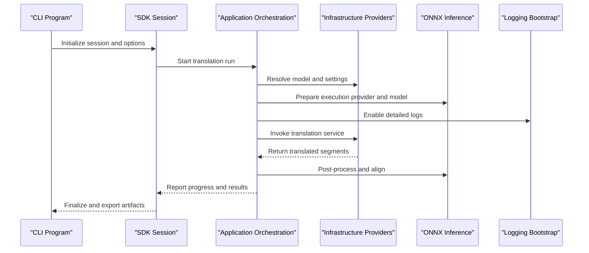
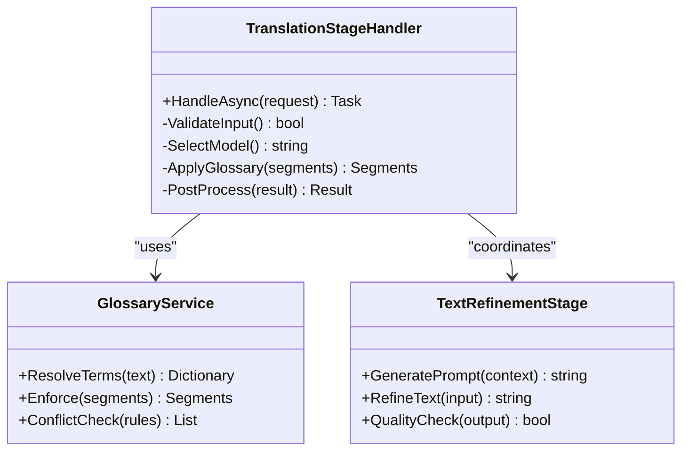
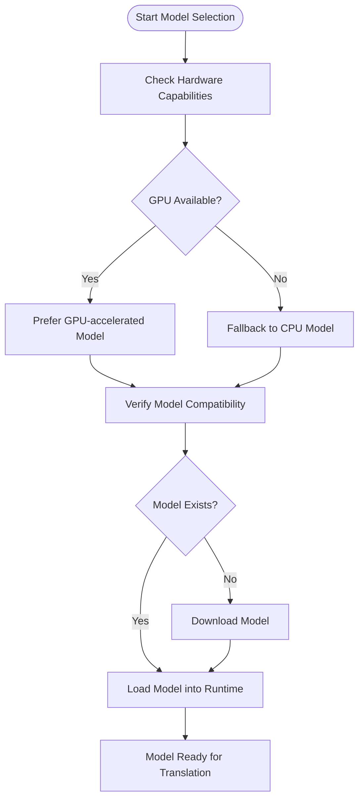
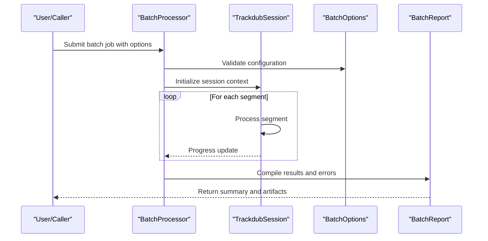
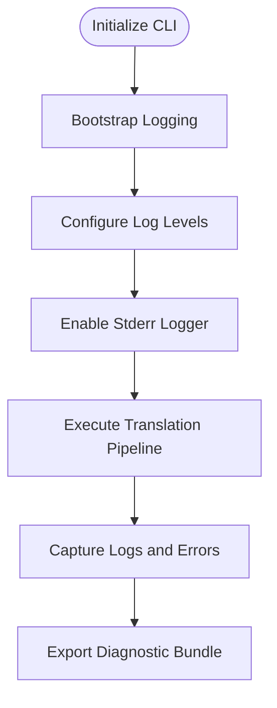
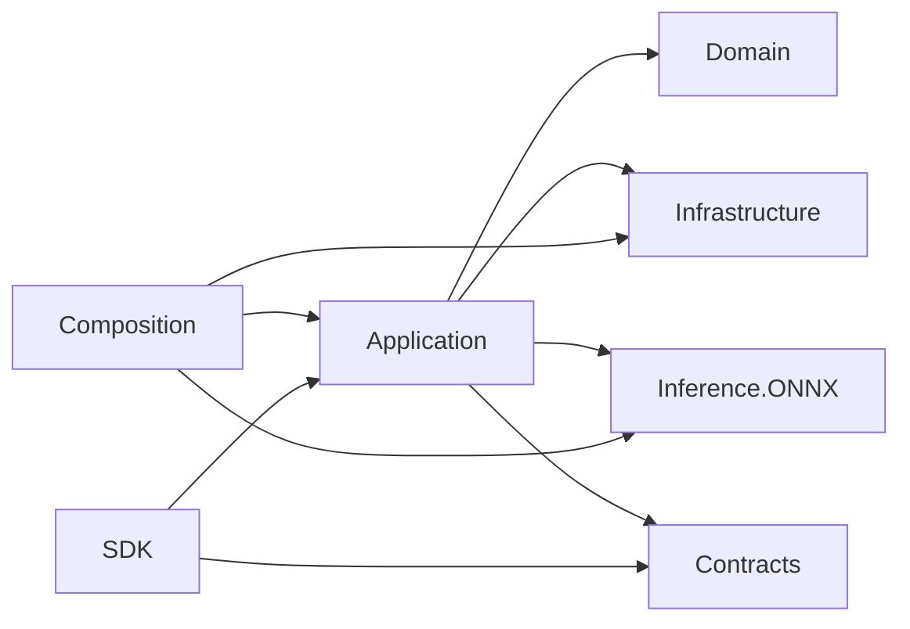

# Troubleshooting Translation Issues

<cite>
**Referenced Files in This Document**
- [TROUBLESHOOTING.md](file://docs/development/TROUBLESHOOTING.md)
- [ADR-0003-whisper-license-investigation.md](file://docs/decisions/ADR-0003-whisper-license-investigation.md)
- [MODEL_LICENSE_POLICY.md](file://docs/legal/MODEL_LICENSE_POLICY.md)
- [THIRD_PARTY_NOTICES.md](file://docs/legal/THIRD_PARTY_NOTICES.md)
- [Trackdub.Application.csproj](file://src/Trackdub.Application/Trackdub.Application.csproj)
- [Trackdub.Infrastructure.csproj](file://src/Trackdub.Infrastructure/Trackdub.Infrastructure.csproj)
- [Trackdub.Inference.Onnx.csproj](file://src/Trackdub.Inference.Onnx/Trackdub.Inference.Onnx.csproj)
- [Trackdub.Contracts.csproj](file://src/Trackdub.Contracts/Trackdub.Contracts.csproj)
- [Trackdub.Domain.csproj](file://src/Trackdub.Domain/Trackdub.Domain.csproj)
- [Trackdub.Composition.csproj](file://src/Trackdub.Composition/Trackdub.Composition.csproj)
- [Trackdub.Benchmarks.csproj](file://src/Trackdub.Benchmarks/Trackdub.Benchmarks.csproj)
- [Trackdub.Cli.csproj](file://src/Trackdub.Cli/Trackdub.Cli.csproj)
- [Trackdub.Media.csproj](file://src/Trackdub.Media/Trackdub.Media.csproj)
- [Trackdub.Licensing.csproj](file://src/Trackdub.Licensing/Trackdub.Licensing.csproj)
- [Trackdub.Sdk.csproj](file://src/Trackdub.Sdk/Trackdub.Sdk.csproj)
- [Trackdub.Tools.csproj](file://src/Trackdub.Tools/Trackdub.Tools.cs.csproj)
- [Program.cs](file://src/Trackdub.Cli/Program.cs)
- [CliLoggingBootstrap.cs](file://src/Trackdub.Cli/CliLoggingBootstrap.cs)
- [StderrApplicationLogger.cs](file://src/Trackdub.Cli/StderrApplicationLogger.cs)
- [TranslationStageHandlerTests.cs](file://tests/Trackdub.Application.Tests/TranslationStageHandlerTests.cs)
- [FakeTranslationEngineGlossaryTests.cs](file://tests/Trackdub.Application.Tests/FakeTranslationEngineGlossaryTests.cs)
- [GlossaryServiceTests.cs](file://tests/Trackdub.Application.Tests/GlossaryServiceTests.cs)
- [GlossaryTargetTermMatcherTests.cs](file://tests/Trackdub.Application.Tests/GlossaryTargetTermMatcherTests.cs)
- [GlossaryTermMatcherTests.cs](file://tests/Trackdub.Application.Tests/GlossaryTermMatcherTests.cs)
- [TextRefinementGenerationStageTests.cs](file://tests/Trackdub.Application.Tests/TextRefinementGenerationStageTests.cs)
- [TextRefinementStageHandlerFailureTests.cs](file://tests/Trackdub.Application.Tests/TextRefinementStageHandlerFailureTests.cs)
- [ProportionalTranslatedWordAlignmentServiceTests.cs](file://tests/Trackdub.Application.Tests/ProportionalTranslatedWordAlignmentServiceTests.cs)
- [RuntimeModelRequestFactoryTests.cs](file://tests/Trackdub.Application.Tests/RuntimeModelRequestFactoryTests.cs)
- [RuntimeModelSetupWorkflowTests.cs](file://tests/Trackdub.Application.Tests/RuntimeModelSetupWorkflowTests.cs)
- [MigraphxModelSupportTests.cs](file://tests/Trackdub.Application.Tests/MigraphxModelSupportTests.cs)
- [Qwen3TtsDefaultsTests.cs](file://tests/Trackdub.Application.Tests/Qwen3TtsDefaultsTests.cs)
- [HardwareOverrideCatalogTests.cs](file://tests/Trackdub.Application.Tests/HardwareOverrideCatalogTests.cs)
- [PipelineDegradationWriterTests.cs](file://tests/Trackdub.Application.Tests/PipelineDegradationWriterTests.cs)
- [StageRunHelperTests.cs](file://tests/Trackdub.Application.Tests/StageRunHelperTests.cs)
- [OrchestrationServiceTests.cs](file://tests/Trackdub.Application.Tests/OrchestrationServiceTests.cs)
- [StageReadinessOrchestratorTests.cs](file://tests/Trackdub.Application.Tests/StageReadinessOrchestratorTests.cs)
- [SegmentStageRunProvenanceStoreTests.cs](file://tests/Trackdub.Application.Tests/SegmentStageRunProvenanceStoreTests.cs)
- [BatchProcessor.cs](file://src/Trackdub.Sdk/BatchProcessor.cs)
- [BatchOptions.cs](file://src/Trackdub.Sdk/BatchOptions.cs)
- [BatchReport.cs](file://src/Trackdub.Sdk/BatchReport.cs)
- [ErrorCode.cs](file://src/Trackdub.Sdk/ErrorCode.cs)
- [TrackdubBuilder.cs](file://src/Trackdub.Sdk/TrackdubBuilder.cs)
- [TrackdubSession.cs](file://src/Trackdub.Sdk/TrackdubSession.cs)
- [TrackdubProjectContext.cs](file://src/Trackdub.Sdk/TrackdubProjectContext.cs)
- [TrackdubProjectPaths.cs](file://src/Trackdub.Sdk/TrackdubProjectPaths.cs)
- [TrackdubPipelineStages.cs](file://src/Trackdub.Sdk/TrackdubPipelineStages.cs)
- [TrackdubPipelineReadinessChecker.cs](file://src/Trackdub.Sdk/TrackdubPipelineReadinessChecker.cs)
- [TrackdubOptions.cs](file://src/Trackdub.Sdk/TrackdubOptions.cs)
- [SdkSessionOptions.cs](file://src/Trackdub.Sdk/SdkSessionOptions.cs)
- [PresetNameValidator.cs](file://src/Trackdub.Sdk/PresetNameValidator.cs)
- [PresetStore.cs](file://src/Trackdub.Sdk/PresetStore.cs)
- [ExecutionProviderPreference.cs](file://src/Trackdub.Sdk/ExecutionProviderPreference.cs)
- [IDubbingEngine.cs](file://src/Trackdub.Sdk/IDubbingEngine.cs)
- [TrackdubDubbingEngine.cs](file://src/Trackdub.Sdk/TrackdubDubbingEngine.cs)
- [TrackdubBuilder.cs](file://src/Trackdub.Sdk/TrackdubBuilder.cs)
- [TrackdubProjectContextResolver.cs](file://src/Trackdub.Sdk/TrackdubProjectContextResolver.cs)
- [TrackdubProjectPaths.cs](file://src/Trackdub.Sdk/TrackdubProjectPaths.cs)
- [TrackdubPipelineStages.cs](file://src/Trackdub.Sdk/TrackdubPipelineStages.cs)
- [TrackdubPipelineReadinessChecker.cs](file://src/Trackdub.Sdk/TrackdubPipelineReadinessChecker.cs)
- [TrackdubOptions.cs](file://src/Trackdub.Sdk/TrackdubOptions.cs)
- [SdkSessionOptions.cs](file://src/Trackdub.Sdk/SdkSessionOptions.cs)
- [PresetNameValidator.cs](file://src/Trackdub.Sdk/PresetNameValidator.cs)
- [PresetStore.cs](file://src/Trackdub.Sdk/PresetStore.cs)
- [ExecutionProviderPreference.cs](file://src/Trackdub.Sdk/ExecutionProviderPreference.cs)
- [IDubbingEngine.cs](file://src/Trackdub.Sdk/IDubbingEngine.cs)
- [TrackdubDubbingEngine.cs](file://src/Trackdub.Sdk/TrackdubDubbingEngine.cs)
- [TrackdubProjectContextResolver.cs](file://src/Trackdub.Sdk/TrackdubProjectContextResolver.cs)
</cite>

## Table of Contents
1. Introduction
2. Project Structure
3. Core Components
4. Architecture Overview
5. Detailed Component Analysis
6. Dependency Analysis
7. Performance Considerations
8. Troubleshooting Guide
9. Conclusion

## Introduction
This document provides comprehensive troubleshooting guidance for translation-related issues in Trackdub. It covers common problems such as poor translation quality, language-specific challenges, and model performance bottlenecks. It also includes diagnostic tools, logging techniques, memory and GPU acceleration troubleshooting, network connectivity checks with cloud services, debugging strategies for custom pipelines, prompt engineering pitfalls, glossary conflicts, performance optimization, batch processing issues, error recovery procedures, licensing considerations, model compatibility, and platform-specific deployment challenges.

## Project Structure
Trackdub organizes translation functionality across multiple layers:
- Application layer orchestrates stages and services
- Domain models define translation entities and contracts
- Infrastructure implements persistence, settings, and translation providers
- Inference layer integrates ONNX-based models and execution providers
- Composition wires dependencies and runtime configuration
- Sdk exposes programmatic interfaces for batch and session workflows
- Licensing and legal documents govern model usage and compliance

```mermaid
graph TB
subgraph "Application"
APP["Trackdub.Application"]
end
subgraph "Domain"
DOM["Trackdub.Domain"]
end
subgraph "Infrastructure"
INF["Trackdub.Infrastructure"]
end
subgraph "Inference (ONNX)"
INF_ONNX["Trackdub.Inference.Onnx"]
end
subgraph "Composition"
COMP["Trackdub.Composition"]
end
subgraph "SDK"
SDK["Trackdub.Sdk"]
end
subgraph "Contracts"
CTR["Trackdub.Contracts"]
end
APP --> DOM
APP --> INF
APP --> INF_ONNX
APP --> CTR
COMP --> APP
COMP --> INF
COMP --> INF_ONNX
SDK --> APP
SDK --> CTR
```

**Diagram sources**
- [Trackdub.Application.csproj](file://src/Trackdub.Application/Trackdub.Application.csproj)
- [Trackdub.Domain.csproj](file://src/Trackdub.Domain/Trackdub.Domain.csproj)
- [Trackdub.Infrastructure.csproj](file://src/Trackdub.Infrastructure/Trackdub.Infrastructure.cs.csproj)
- [Trackdub.Inference.Onnx.csproj](file://src/Trackdub.Inference.Onnx/Trackdub.Inference.Onnx.csproj)
- [Trackdub.Composition.csproj](file://src/Trackdub.Composition/Trackdub.Composition.csproj)
- [Trackdub.Sdk.csproj](file://src/Trackdub.Sdk/Trackdub.Sdk.csproj)
- [Trackdub.Contracts.csproj](file://src/Trackdub.Contracts/Trackdub.Contracts.csproj)

**Section sources**
- [Trackdub.Application.csproj](file://src/Trackdub.Application/Trackdub.Application.csproj)
- [Trackdub.Infrastructure.csproj](file://src/Trackdub.Infrastructure/Trackdub.Infrastructure.csproj)
- [Trackdub.Inference.Onnx.csproj](file://src/Trackdub.Inference.Onnx/Trackdub.Inference.Onnx.csproj)
- [Trackdub.Contracts.csproj](file://src/Trackdub.Contracts/Trackdub.Contracts.csproj)
- [Trackdub.Domain.csproj](file://src/Trackdub.Domain/Trackdub.Domain.csproj)
- [Trackdub.Composition.csproj](file://src/Trackdub.Composition/Trackdub.Composition.csproj)
- [Trackdub.Sdk.csproj](file://src/Trackdub.Sdk/Trackdub.Sdk.csproj)

## Core Components
Key components involved in translation include:
- Translation stage handlers and services that orchestrate text refinement and translation steps
- Glossary services and matchers to enforce terminology consistency
- Model request factories and setup workflows for selecting appropriate translation models
- Execution provider preferences for GPU acceleration and fallbacks
- Batch processor and session APIs for scalable translation runs
- Logging bootstrap and stderr logger for diagnostics

Common failure points:
- Poor translation quality due to inadequate prompts or mismatched model capabilities
- Language-specific tokenization or encoding issues
- Memory exhaustion during large batch processing
- GPU initialization failures or insufficient VRAM
- Network timeouts when using cloud endpoints
- Glossary conflicts causing term mismatches
- Licensing restrictions preventing model usage

**Section sources**
- [TranslationStageHandlerTests.cs](file://tests/Trackdub.Application.Tests/TranslationStageHandlerTests.cs)
- [FakeTranslationEngineGlossaryTests.cs](file://tests/Trackdub.Application.Tests/FakeTranslationEngineGlossaryTests.cs)
- [GlossaryServiceTests.cs](file://tests/Trackdub.Application.Tests/GlossaryServiceTests.cs)
- [GlossaryTargetTermMatcherTests.cs](file://tests/Trackdub.Application.Tests/GlossaryTargetTermMatcherTests.cs)
- [GlossaryTermMatcherTests.cs](file://tests/Trackdub.Application.Tests/GlossaryTermMatcherTests.cs)
- [TextRefinementGenerationStageTests.cs](file://tests/Trackdub.Application.Tests/TextRefinementGenerationStageTests.cs)
- [TextRefinementStageHandlerFailureTests.cs](file://tests/Trackdub.Application.Tests/TextRefinementStageHandlerFailureTests.cs)
- [ProportionalTranslatedWordAlignmentServiceTests.cs](file://tests/Trackdub.Application.Tests/ProportionalTranslatedWordAlignmentServiceTests.cs)
- [RuntimeModelRequestFactoryTests.cs](file://tests/Trackdub.Application.Tests/RuntimeModelRequestFactoryTests.cs)
- [RuntimeModelSetupWorkflowTests.cs](file://tests/Trackdub.Application.Tests/RuntimeModelSetupWorkflowTests.cs)
- [MigraphxModelSupportTests.cs](file://tests/Trackdub.Application.Tests/MigraphxModelSupportTests.cs)
- [Qwen3TtsDefaultsTests.cs](file://tests/Trackdub.Application.Tests/Qwen3TtsDefaultsTests.cs)
- [HardwareOverrideCatalogTests.cs](file://tests/Trackdub.Application.Tests/HardwareOverrideCatalogTests.cs)
- [PipelineDegradationWriterTests.cs](file://tests/Trackdub.Application.Tests/PipelineDegradationWriterTests.cs)
- [StageRunHelperTests.cs](file://tests/Trackdub.Application.Tests/StageRunHelperTests.cs)
- [OrchestrationServiceTests.cs](file://tests/Trackdub.Application.Tests/OrchestrationServiceTests.cs)
- [StageReadinessOrchestratorTests.cs](file://tests/Trackdub.Application.Tests/StageReadinessOrchestratorTests.cs)
- [SegmentStageRunProvenanceStoreTests.cs](file://tests/Trackdub.Application.Tests/SegmentStageRunProvenanceStoreTests.cs)

## Architecture Overview
The translation pipeline integrates application orchestration, domain modeling, infrastructure providers, inference engines, and SDK interfaces. The flow typically involves:
- Input preparation and segmentation
- Text refinement and prompt assembly
- Translation model invocation (local or cloud)
- Glossary enforcement and post-processing
- Alignment and output generation
- Logging and telemetry for diagnostics



**Diagram sources**
- [Program.cs](file://src/Trackdub.Cli/Program.cs)
- [CliLoggingBootstrap.cs](file://src/Trackdub.Cli/CliLoggingBootstrap.cs)
- [StderrApplicationLogger.cs](file://src/Trackdub.Cli/StderrApplicationLogger.cs)
- [BatchProcessor.cs](file://src/Trackdub.Sdk/BatchProcessor.cs)
- [TrackdubSession.cs](file://src/Trackdub.Sdk/TrackdubSession.cs)
- [TrackdubOptions.cs](file://src/Trackdub.Sdk/TrackdubOptions.cs)

## Detailed Component Analysis

### Translation Stage Handlers and Services
Translation stage handlers manage the lifecycle of translation tasks, including input validation, model selection, and result aggregation. They interact with glossary services to enforce terminology and coordinate with text refinement stages.



**Diagram sources**
- [TranslationStageHandlerTests.cs](file://tests/Trackdub.Application.Tests/TranslationStageHandlerTests.cs)
- [GlossaryServiceTests.cs](file://tests/Trackdub.Application.Tests/GlossaryServiceTests.cs)
- [TextRefinementGenerationStageTests.cs](file://tests/Trackdub.Application.Tests/TextRefinementGenerationStageTests.cs)

**Section sources**
- [TranslationStageHandlerTests.cs](file://tests/Trackdub.Application.Tests/TranslationStageHandlerTests.cs)
- [GlossaryServiceTests.cs](file://tests/Trackdub.Application.Tests/GlossaryServiceTests.cs)
- [TextRefinementGenerationStageTests.cs](file://tests/Trackdub.Application.Tests/TextRefinementGenerationStageTests.cs)

### Model Request Factory and Setup Workflow
The model request factory determines which translation model to use based on hardware capabilities, language support, and policy constraints. The setup workflow ensures models are downloaded, verified, and initialized correctly.



**Diagram sources**
- [RuntimeModelRequestFactoryTests.cs](file://tests/Trackdub.Application.Tests/RuntimeModelRequestFactoryTests.cs)
- [RuntimeModelSetupWorkflowTests.cs](file://tests/Trackdub.Application.Tests/RuntimeModelSetupWorkflowTests.cs)
- [MigraphxModelSupportTests.cs](file://tests/Trackdub.Application.Tests/MigraphxModelSupportTests.cs)

**Section sources**
- [RuntimeModelRequestFactoryTests.cs](file://tests/Trackdub.Application.Tests/RuntimeModelRequestFactoryTests.cs)
- [RuntimeModelSetupWorkflowTests.cs](file://tests/Trackdub.Application.Tests/RuntimeModelSetupWorkflowTests.cs)
- [MigraphxModelSupportTests.cs](file://tests/Trackdub.Application.Tests/MigraphxModelSupportTests.cs)

### Batch Processing and Session Management
Batch processing enables scalable translation runs with configurable options, progress tracking, and error handling. Sessions manage state and resources across multiple translation tasks.



**Diagram sources**
- [BatchProcessor.cs](file://src/Trackdub.Sdk/BatchProcessor.cs)
- [BatchOptions.cs](file://src/Trackdub.Sdk/BatchOptions.cs)
- [BatchReport.cs](file://src/Trackdub.Sdk/BatchReport.cs)
- [TrackdubSession.cs](file://src/Trackdub.Sdk/TrackdubSession.cs)

**Section sources**
- [BatchProcessor.cs](file://src/Trackdub.Sdk/BatchProcessor.cs)
- [BatchOptions.cs](file://src/Trackdub.Sdk/BatchOptions.cs)
- [BatchReport.cs](file://src/Trackdub.Sdk/BatchReport.cs)
- [TrackdubSession.cs](file://src/Trackdub.Sdk/TrackdubSession.cs)

### Logging and Diagnostics
Effective logging is crucial for diagnosing translation issues. The CLI bootstraps logging and provides stderr output for real-time feedback.



**Diagram sources**
- [Program.cs](file://src/Trackdub.Cli/Program.cs)
- [CliLoggingBootstrap.cs](file://src/Trackdub.Cli/CliLoggingBootstrap.cs)
- [StderrApplicationLogger.cs](file://src/Trackdub.Cli/StderrApplicationLogger.cs)

**Section sources**
- [Program.cs](file://src/Trackdub.Cli/Program.cs)
- [CliLoggingBootstrap.cs](file://src/Trackdub.Cli/CliLoggingBootstrap.cs)
- [StderrApplicationLogger.cs](file://src/Trackdub.Cli/StderrApplicationLogger.cs)

## Dependency Analysis
Translation components depend on various modules for functionality:
- Application layer depends on domain models and infrastructure services
- Infrastructure provides translation providers and persistence
- Inference layer integrates ONNX runtime and execution providers
- Composition wires dependencies and configures runtime behavior
- SDK exposes APIs for programmatic control



**Diagram sources**
- [Trackdub.Application.csproj](file://src/Trackdub.Application/Trackdub.Application.csproj)
- [Trackdub.Domain.csproj](file://src/Trackdub.Domain/Trackdub.Domain.csproj)
- [Trackdub.Infrastructure.csproj](file://src/Trackdub.Infrastructure/Trackdub.Infrastructure.csproj)
- [Trackdub.Inference.Onnx.csproj](file://src/Trackdub.Inference.Onnx/Trackdub.Inference.Onnx.csproj)
- [Trackdub.Composition.csproj](file://src/Trackdub.Composition/Trackdub.Composition.csproj)
- [Trackdub.Sdk.csproj](file://src/Trackdub.Sdk/Trackdub.Sdk.csproj)
- [Trackdub.Contracts.csproj](file://src/Trackdub.Contracts/Trackdub.Contracts.csproj)

**Section sources**
- [Trackdub.Application.csproj](file://src/Trackdub.Application/Trackdub.Application.csproj)
- [Trackdub.Infrastructure.csproj](file://src/Trackdub.Infrastructure/Trackdub.Infrastructure.csproj)
- [Trackdub.Inference.Onnx.csproj](file://src/Trackdub.Inference.Onnx/Trackdub.Inference.Onnx.csproj)
- [Trackdub.Contracts.csproj](file://src/Trackdub.Contracts/Trackdub.Contracts.csproj)
- [Trackdub.Domain.csproj](file://src/Trackdub.Domain/Trackdub.Domain.csproj)
- [Trackdub.Composition.csproj](file://src/Trackdub.Composition/Trackdub.Composition.csproj)
- [Trackdub.Sdk.csproj](file://src/Trackdub.Sdk/Trackdub.Sdk.csproj)

## Performance Considerations
Optimizing translation performance involves:
- Selecting appropriate models based on hardware capabilities
- Using GPU acceleration where available
- Implementing batch processing to reduce overhead
- Monitoring memory usage and adjusting batch sizes
- Leveraging caching for repeated translations
- Tuning execution provider settings for optimal throughput

[No sources needed since this section provides general guidance]

## Troubleshooting Guide

### Poor Translation Quality
Symptoms:
- Inaccurate translations or unnatural phrasing
- Missing context or tone
- Inconsistent terminology

Diagnostic steps:
- Review prompt engineering and context assembly
- Validate glossary rules and term mappings
- Test with different models or versions
- Analyze text refinement outputs

Solutions:
- Refine prompts with clearer instructions
- Update glossary entries for domain-specific terms
- Switch to higher-quality models if available
- Implement post-processing corrections

**Section sources**
- [TextRefinementGenerationStageTests.cs](file://tests/Trackdub.Application.Tests/TextRefinementGenerationStageTests.cs)
- [GlossaryServiceTests.cs](file://tests/Trackdub.Application.Tests/GlossaryServiceTests.cs)
- [GlossaryTargetTermMatcherTests.cs](file://tests/Trackdub.Application.Tests/GlossaryTargetTermMatcherTests.cs)

### Language-Specific Challenges
Symptoms:
- Tokenization errors for non-Latin scripts
- Incorrect character encoding
- Poor performance for specific languages

Diagnostic steps:
- Verify language support in selected models
- Check encoding configurations
- Test with language-specific samples

Solutions:
- Use models trained for target languages
- Configure proper encoding settings
- Implement language detection and routing

**Section sources**
- [RuntimeModelRequestFactoryTests.cs](file://tests/Trackdub.Application.Tests/RuntimeModelRequestFactoryTests.cs)
- [RuntimeModelSetupWorkflowTests.cs](file://tests/Trackdub.Application.Tests/RuntimeModelSetupWorkflowTests.cs)

### Model Performance Issues
Symptoms:
- Slow translation speeds
- High memory consumption
- Frequent timeouts

Diagnostic steps:
- Monitor GPU utilization and memory usage
- Check model size and complexity
- Evaluate batch processing efficiency

Solutions:
- Optimize batch sizes and concurrency
- Use quantized or smaller models
- Enable GPU acceleration
- Implement caching strategies

**Section sources**
- [MigraphxModelSupportTests.cs](file://tests/Trackdub.Application.Tests/MigraphxModelSupportTests.cs)
- [HardwareOverrideCatalogTests.cs](file://tests/Trackdub.Application.Tests/HardwareOverrideCatalogTests.cs)

### Memory Limitations
Symptoms:
- Out-of-memory errors
- System slowdowns
- Failed batch processing

Diagnostic steps:
- Monitor memory usage during translation
- Check for memory leaks
- Analyze batch size impact

Solutions:
- Reduce batch sizes
- Implement memory-efficient processing
- Use streaming for large inputs
- Clear unused resources

**Section sources**
- [BatchProcessor.cs](file://src/Trackdub.Sdk/BatchProcessor.cs)
- [TrackdubSession.cs](file://src/Trackdub.Sdk/TrackdubSession.cs)

### GPU Acceleration Problems
Symptoms:
- GPU not detected
- Initialization failures
- Performance degradation

Diagnostic steps:
- Verify GPU drivers and runtime
- Check CUDA/cuDNN compatibility
- Monitor GPU memory allocation

Solutions:
- Update GPU drivers
- Install required runtime libraries
- Configure execution provider preferences
- Fallback to CPU if necessary

**Section sources**
- [ExecutionProviderPreference.cs](file://src/Trackdub.Sdk/ExecutionProviderPreference.cs)
- [TrackdubOptions.cs](file://src/Trackdub.Sdk/TrackdubOptions.cs)

### Network Connectivity Issues
Symptoms:
- Connection timeouts
- Authentication failures
- Rate limiting errors

Diagnostic steps:
- Check network connectivity
- Verify API keys and credentials
- Monitor request rates

Solutions:
- Implement retry mechanisms
- Configure timeout settings
- Use local models as fallback
- Optimize request batching

**Section sources**
- [BatchOptions.cs](file://src/Trackdub.Sdk/BatchOptions.cs)
- [TrackdubPipelineReadinessChecker.cs](file://src/Trackdub.Sdk/TrackdubPipelineReadinessChecker.cs)

### Custom Translation Pipelines
Symptoms:
- Pipeline failures
- Integration errors
- Unexpected behavior

Diagnostic steps:
- Review pipeline configuration
- Check dependency injection setup
- Validate custom implementations

Solutions:
- Implement proper error handling
- Add comprehensive logging
- Test with mock services
- Follow established patterns

**Section sources**
- [TrackdubBuilder.cs](file://src/Trackdub.Sdk/TrackdubBuilder.cs)
- [TrackdubProjectContextResolver.cs](file://src/Trackdub.Sdk/TrackdubProjectContextResolver.cs)

### Prompt Engineering Issues
Symptoms:
- Inconsistent outputs
- Missing key information
- Overly verbose responses

Diagnostic steps:
- Analyze prompt structure
- Test with different formulations
- Review system instructions

Solutions:
- Simplify prompt instructions
- Provide clear examples
- Use structured formats
- Iterate based on feedback

**Section sources**
- [TextRefinementStageHandlerFailureTests.cs](file://tests/Trackdub.Application.Tests/TextRefinementStageHandlerFailureTests.cs)

### Glossary Conflicts
Symptoms:
- Terminology inconsistencies
- Override conflicts
- Missing term mappings

Diagnostic steps:
- Review glossary rules
- Check term priority settings
- Validate mappings

Solutions:
- Resolve conflicting rules
- Update term definitions
- Implement conflict resolution logic

**Section sources**
- [GlossaryTermMatcherTests.cs](file://tests/Trackdub.Application.Tests/GlossaryTermMatcherTests.cs)
- [GlossaryTargetTermMatcherTests.cs](file://tests/Trackdub.Application.Tests/GlossaryTargetTermMatcherTests.cs)

### Batch Processing Troubleshooting
Symptoms:
- Partial failures
- Progress stalls
- Resource exhaustion

Diagnostic steps:
- Monitor batch status
- Check individual segment results
- Analyze resource usage

Solutions:
- Implement chunked processing
- Add progress tracking
- Handle partial failures gracefully

**Section sources**
- [BatchReport.cs](file://src/Trackdub.Sdk/BatchReport.cs)
- [ErrorCode.cs](file://src/Trackdub.Sdk/ErrorCode.cs)

### Error Recovery Procedures
Symptoms:
- Unhandled exceptions
- Data corruption
- Inconsistent state

Diagnostic steps:
- Review error logs
- Check transaction boundaries
- Validate data integrity

Solutions:
- Implement retry logic
- Add checkpointing
- Use idempotent operations

**Section sources**
- [PipelineDegradationWriterTests.cs](file://tests/Trackdub.Application.Tests/PipelineDegradationWriterTests.cs)
- [StageRunHelperTests.cs](file://tests/Trackdub.Application.Tests/StageRunHelperTests.cs)

### Licensing Issues
Symptoms:
- License validation failures
- Feature restrictions
- Compliance violations

Diagnostic steps:
- Check license files
- Verify model permissions
- Review usage policies

Solutions:
- Obtain proper licenses
- Implement license checking
- Follow usage guidelines

**Section sources**
- [ADR-0003-whisper-license-investigation.md](file://docs/decisions/ADR-0003-whisper-license-investigation.md)
- [MODEL_LICENSE_POLICY.md](file://docs/legal/MODEL_LICENSE_POLICY.md)
- [THIRD_PARTY_NOTICES.md](file://docs/legal/THIRD_PARTY_NOTICES.md)

### Model Compatibility Problems
Symptoms:
- Runtime errors
- Incompatible formats
- Missing dependencies

Diagnostic steps:
- Verify model versions
- Check format requirements
- Validate dependencies

Solutions:
- Update model versions
- Convert formats as needed
- Install missing dependencies

**Section sources**
- [RuntimeModelSetupWorkflowTests.cs](file://tests/Trackdub.Application.Tests/RuntimeModelSetupWorkflowTests.cs)

### Platform-Specific Deployment Challenges
Symptoms:
- Installation failures
- Runtime errors
- Performance issues

Diagnostic steps:
- Check platform requirements
- Verify environment setup
- Test on target platforms

Solutions:
- Follow platform-specific guides
- Install required dependencies
- Configure environment variables

**Section sources**
- [TROUBLESHOOTING.md](file://docs/development/TROUBLESHOOTING.md)

## Conclusion
This troubleshooting guide addresses common translation issues in Trackdub, providing systematic approaches to diagnose and resolve problems. By leveraging the documented components, logging techniques, and diagnostic tools, users can effectively identify bottlenecks, optimize performance, and ensure reliable translation workflows. Regular monitoring, proper configuration, and adherence to best practices will help maintain high-quality translations across diverse scenarios.

[No sources needed since this section summarizes without analyzing specific files]