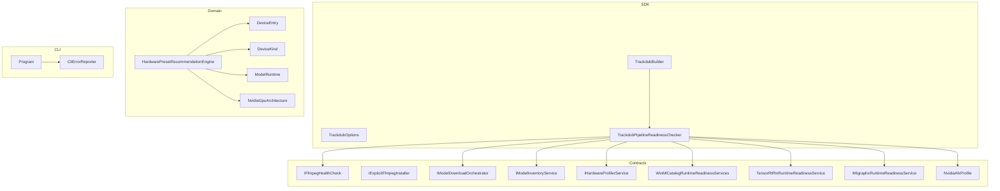
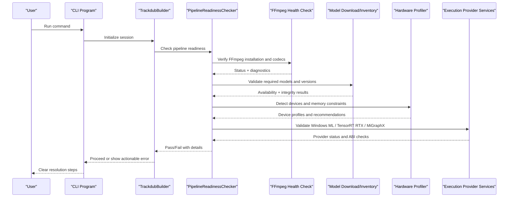
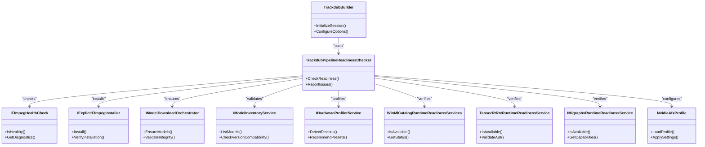

# Common Issues & Solutions

<cite>
**Referenced Files in This Document**
- [TROUBLESHOOTING.md](file://docs/development/TROUBLESHOOTING.md)
- [README.md](file://README.md)
- [TrackdubPipelineReadinessChecker.cs](file://src/Trackdub.Sdk/TrackdubPipelineReadinessChecker.cs)
- [IFfmpegHealthCheck.cs](file://src/Trackdub.Contracts/IFfmpegHealthCheck.cs)
- [IExplicitFfmpegInstaller.cs](file://src/Trackdub.Contracts/IExplicitFfmpegInstaller.cs)
- [IModelDownloadOrchestrator.cs](file://src/Trackdub.Contracts/IModelDownloadOrchestrator.cs)
- [IModelInventoryService.cs](file://src/Trackdub.Contracts/IModelInventoryService.cs)
- [IHardwareProfilerService.cs](file://src/Trackdub.Contracts/IHardwareProfilerService.cs)
- [WinMlCatalogRuntimeReadinessServices.cs](file://src/Trackdub.Contracts/WinMlCatalogRuntimeReadinessServices.cs)
- [TensorRtRtxRuntimeReadinessService.cs](file://src/Trackdub.Infrastructure/Runtime/TrtRtxEp/TensorRtRtxRuntimeReadinessService.cs)
- [IMigraphxRuntimeReadinessService.cs](file://src/Trackdub.Contracts/IMigraphxRuntimeReadinessService.cs)
- [CliErrorReporter.cs](file://src/Trackdub.Cli/CliErrorReporter.cs)
- [Program.cs](file://src/Trackdub.Cli/Program.cs)
- [TrackdubBuilder.cs](file://src/Trackdub.Sdk/TrackdubBuilder.cs)
- [TrackdubOptions.cs](file://src/Trackdub.Sdk/TrackdubOptions.cs)
- [NvidiaAfxProfile.cs](file://src/Trackdub.Contracts/NvidiaAfxProfile.cs)
- [HardwarePresetRecommendationEngine.cs](file://src/Trackdub.Domain/HardwarePresetRecommendationEngine.cs)
- [DeviceEntry.cs](file://src/Trackdub.Domain/DeviceEntry.cs)
- [DeviceKind.cs](file://src/Trackdub.Domain/DeviceKind.cs)
- [ModelRuntime.cs](file://src/Trackdub.Domain/ModelRuntime.cs)
- [NvidiaGpuArchitecture.cs](file://src/Trackdub.Domain/NvidiaGpuArchitecture.cs)
</cite>

## Table of Contents
1. Introduction
2. Project Structure
3. Core Components
4. Architecture Overview
5. Detailed Component Analysis
6. Dependency Analysis
7. Performance Considerations
8. Troubleshooting Guide
9. Conclusion
10. Appendices

## Introduction
This document provides comprehensive troubleshooting guidance for common Trackdub issues, including model loading failures, hardware compatibility problems, audio processing errors, transcription inaccuracies, and synthesis artifacts. It consolidates known error patterns, diagnostic commands, configuration fixes, and workarounds to help users resolve issues quickly and reliably.

## Project Structure
Trackdub is a modular .NET application with clear separation between contracts, domain logic, SDK orchestration, inference runtimes, CLI entry points, and infrastructure services. The following diagram highlights the components most relevant to troubleshooting:

**Diagram sources**
- [TrackdubPipelineReadinessChecker.cs](file://src/Trackdub.Sdk/TrackdubPipelineReadinessChecker.cs)
- [IFfmpegHealthCheck.cs](file://src/Trackdub.Contracts/IFfmpegHealthCheck.cs)
- [IExplicitFfmpegInstaller.cs](file://src/Trackdub.Contracts/IExplicitFfmpegInstaller.cs)
- [IModelDownloadOrchestrator.cs](file://src/Trackdub.Contracts/IModelDownloadOrchestrator.cs)
- [IModelInventoryService.cs](file://src/Trackdub.Contracts/IModelInventoryService.cs)
- [IHardwareProfilerService.cs](file://src/Trackdub.Contracts/IHardwareProfilerService.cs)
- [WinMlCatalogRuntimeReadinessServices.cs](file://src/Trackdub.Contracts/WinMlCatalogRuntimeReadinessServices.cs)
- [TensorRtRtxRuntimeReadinessService.cs](file://src/Trackdub.Infrastructure/Runtime/TrtRtxEp/TensorRtRtxRuntimeReadinessService.cs)
- [IMigraphxRuntimeReadinessService.cs](file://src/Trackdub.Contracts/IMigraphxRuntimeReadinessService.cs)
- [NvidiaAfxProfile.cs](file://src/Trackdub.Contracts/NvidiaAfxProfile.cs)
- [HardwarePresetRecommendationEngine.cs](file://src/Trackdub.Domain/HardwarePresetRecommendationEngine.cs)
- [DeviceEntry.cs](file://src/Trackdub.Domain/DeviceEntry.cs)
- [DeviceKind.cs](file://src/Trackdub.Domain/DeviceKind.cs)
- [ModelRuntime.cs](file://src/Trackdub.Domain/ModelRuntime.cs)
- [NvidiaGpuArchitecture.cs](file://src/Trackdub.Domain/NvidiaGpuArchitecture.cs)
- [Program.cs](file://src/Trackdub.Cli/Program.cs)
- [CliErrorReporter.cs](file://src/Trackdub.Cli/CliErrorReporter.cs)

**Section sources**
- [README.md](file://README.md)
- [TrackdubPipelineReadinessChecker.cs](file://src/Trackdub.Sdk/Trackdub.Sdk/TrackdubPipelineReadinessChecker.cs)
- [Program.cs](file://src/Trackdub.Cli/Program.cs)

## Core Components
- Pipeline readiness checker validates environment prerequisites (FFmpeg, execution providers, models).
- FFmpeg health check and installer ensure media processing dependencies are present and functional.
- Model download orchestrator and inventory service manage model availability, integrity, and versioning.
- Hardware profiler and preset recommendation engine guide GPU/CPU selection and memory budgets.
- Execution provider readiness services validate Windows ML, TensorRT RTX, and MiGraphX runtime availability.
- CLI error reporter centralizes user-facing diagnostics and actionable messages.

**Section sources**
- [TrackdubPipelineReadinessChecker.cs](file://src/Trackdub.Sdk/TrackdubPipelineReadinessChecker.cs)
- [IFfmpegHealthCheck.cs](file://src/Trackdub.Contracts/IFfmpegHealthCheck.cs)
- [IExplicitFfmpegInstaller.cs](file://src/Trackdub.Contracts/IExplicitFfmpegInstaller.cs)
- [IModelDownloadOrchestrator.cs](file://src/Trackdub.Contracts/IModelDownloadOrchestrator.cs)
- [IModelInventoryService.cs](file://src/Trackdub.Contracts/IModelInventoryService.cs)
- [IHardwareProfilerService.cs](file://src/Trackdub.Contracts/IHardwareProfilerService.cs)
- [WinMlCatalogRuntimeReadinessServices.cs](file://src/Trackdub.Contracts/WinMlCatalogRuntimeReadinessServices.cs)
- [TensorRtRtxRuntimeReadinessService.cs](file://src/Trackdub.Infrastructure/Runtime/TrtRtxEp/TensorRtRtxRuntimeReadinessService.cs)
- [IMigraphxRuntimeReadinessService.cs](file://src/Trackdub.Contracts/IMigraphxRuntimeReadinessService.cs)
- [CliErrorReporter.cs](file://src/Trackdub.Cli/CliErrorReporter.cs)

## Architecture Overview
The pipeline readiness flow ensures all critical subsystems are healthy before starting any operation. If any component fails, the system reports precise diagnostics and suggests remediation steps.

**Diagram sources**
- [TrackdubPipelineReadinessChecker.cs](file://src/Trackdub.Sdk/TrackdubPipelineReadinessChecker.cs)
- [IFfmpegHealthCheck.cs](file://src/Trackdub.Contracts/IFfmpegHealthCheck.cs)
- [IModelDownloadOrchestrator.cs](file://src/Trackdub.Contracts/IModelDownloadOrchestrator.cs)
- [IModelInventoryService.cs](file://src/Trackdub.Contracts/IModelInventoryService.cs)
- [IHardwareProfilerService.cs](file://src/Trackdub.Contracts/IHardwareProfilerService.cs)
- [WinMlCatalogRuntimeReadinessServices.cs](file://src/Trackdub.Contracts/WinMlCatalogRuntimeReadinessServices.cs)
- [TensorRtRtxRuntimeReadinessService.cs](file://src/Trackdub.Infrastructure/Runtime/TrtRtxEp/TensorRtRtxRuntimeReadinessService.cs)
- [IMigraphxRuntimeReadinessService.cs](file://src/Trackdub.Contracts/IMigraphxRuntimeReadinessService.cs)

## Detailed Component Analysis

### Model Loading Failures
Common causes include missing dependencies, corrupted downloads, and version incompatibilities. The model download orchestrator and inventory service coordinate validation and recovery.

- Missing dependencies: Ensure ONNX Runtime and provider-specific DLLs are installed; verify paths and permissions.
- Corrupted downloads: Re-run model download with checksum verification; clear partial caches if needed.
- Version incompatibilities: Align model runtime versions with the selected execution provider; prefer recommended presets.

Resolution steps:
- Use the CLI to re-download models and verify integrity.
- Inspect model inventory for mismatches and update to compatible versions.
- Switch execution provider if the current one is incompatible with the model variant.

**Section sources**
- [IModelDownloadOrchestrator.cs](file://src/Trackdub.Contracts/IModelDownloadOrchestrator.cs)
- [IModelInventoryService.cs](file://src/Trackdub.Contracts/IModelInventoryService.cs)
- [TrackdubPipelineReadinessChecker.cs](file://src/Trackdub.Sdk/TrackdubPipelineReadinessChecker.cs)

### Hardware Compatibility Problems
GPU driver issues, insufficient memory, and execution provider conflicts can prevent successful runs. The hardware profiler and preset recommendation engine provide device detection and guidance.

- GPU drivers: Update to latest stable drivers; confirm CUDA/TensorRT support on Windows.
- Insufficient memory: Reduce batch sizes, switch to smaller models, or enable CPU fallback.
- Execution provider conflicts: Disable conflicting providers; ensure ABI compatibility for TensorRT RTX and Windows ML.

Resolution steps:
- Run hardware profiling to detect device capabilities and memory limits.
- Apply preset recommendations to select optimal runtime and provider combinations.
- Validate provider readiness services and fix ABI/plugin issues.

**Section sources**
- [IHardwareProfilerService.cs](file://src/Trackdub.Contracts/IHardwareProfilerService.cs)
- [HardwarePresetRecommendationEngine.cs](file://src/Trackdub.Domain/HardwarePresetRecommendationEngine.cs)
- [DeviceEntry.cs](file://src/Trackdub.Domain/DeviceEntry.cs)
- [DeviceKind.cs](file://src/Trackdub.Domain/DeviceKind.cs)
- [ModelRuntime.cs](file://src/Trackdub.Domain/ModelRuntime.cs)
- [NvidiaGpuArchitecture.cs](file://src/Trackdub.Domain/NvidiaGpuArchitecture.cs)
- [WinMlCatalogRuntimeReadinessServices.cs](file://src/Trackdub.Contracts/WinMlCatalogRuntimeReadinessServices.cs)
- [TensorRtRtxRuntimeReadinessService.cs](file://src/Trackdub.Infrastructure/Runtime/TrtRtxEp/TensorRtRtxRuntimeReadinessService.cs)
- [IMigraphxRuntimeReadinessService.cs](file://src/Trackdub.Contracts/IMigraphxRuntimeReadinessService.cs)

### Audio Processing Errors
FFmpeg installation problems, codec issues, and format conversion failures disrupt media pipelines. The FFmpeg health check and installer ensure correct setup.

- FFmpeg not found: Install FFmpeg via explicit installer or add to PATH; verify executable location.
- Codec missing: Install required codecs; confirm supported formats for input/output.
- Format conversion failure: Normalize inputs to PCM/WAV; adjust sample rates and channel counts.

Resolution steps:
- Run FFmpeg health check to identify missing binaries or codecs.
- Use the explicit installer to provision FFmpeg with necessary components.
- Convert problematic files to standard formats before processing.

**Section sources**
- [IFfmpegHealthCheck.cs](file://src/Trackdub.Contracts/IFfmpegHealthCheck.cs)
- [IExplicitFfmpegInstaller.cs](file://src/Trackdub.Contracts/IExplicitFfmpegInstaller.cs)
- [TrackdubPipelineReadinessChecker.cs](file://src/Trackdub.Sdk/TrackdubPipelineReadinessChecker.cs)

### Transcription Inaccuracies
ASR model performance tuning, noise reduction settings, and language-specific optimizations improve accuracy.

- ASR tuning: Adjust model size, chunking, and beam search parameters; prefer larger models for noisy inputs.
- Noise reduction: Enable DeepFilterNet or similar enhancement; calibrate thresholds for background noise.
- Language optimization: Select appropriate language models; use glossaries and text refinement where available.

Resolution steps:
- Profile ASR performance and switch models based on quality vs speed trade-offs.
- Configure audio enhancement pipelines to reduce noise and improve clarity.
- Validate language packs and refine transcripts using built-in tools.

**Section sources**
- [TrackdubPipelineReadinessChecker.cs](file://src/Trackdub.Sdk/TrackdubPipelineReadinessChecker.cs)
- [NvidiaAfxProfile.cs](file://src/Trackdub.Contracts/NvidiaAfxProfile.cs)

### Synthesis Artifacts in TTS Generation
Voice cloning quality issues and lip-sync synchronization problems require careful configuration and validation.

- Voice cloning: Use high-quality reference clips; avoid excessive compression; tune synthesis parameters for stability.
- Lip-sync sync: Align phoneme timings; adjust segment boundaries; validate output durations against source.

Resolution steps:
- Re-capture reference audio with minimal noise and consistent prosody.
- Tune synthesis options to balance naturalness and artifact suppression.
- Validate lip-sync by comparing generated audio timing with visual cues.

**Section sources**
- [TrackdubPipelineReadinessChecker.cs](file://src/Trackdub.Sdk/TrackdubPipelineReadinessChecker.cs)

## Dependency Analysis
The following dependency graph shows how core components interact during pipeline initialization and execution.

**Diagram sources**
- [TrackdubBuilder.cs](file://src/Trackdub.Sdk/TrackdubBuilder.cs)
- [TrackdubPipelineReadinessChecker.cs](file://src/Trackdub.Sdk/TrackdubPipelineReadinessChecker.cs)
- [IFfmpegHealthCheck.cs](file://src/Trackdub.Contracts/IFfmpegHealthCheck.cs)
- [IExplicitFfmpegInstaller.cs](file://src/Trackdub.Contracts/IExplicitFfmpegInstaller.cs)
- [IModelDownloadOrchestrator.cs](file://src/Trackdub.Contracts/IModelDownloadOrchestrator.cs)
- [IModelInventoryService.cs](file://src/Trackdub.Contracts/IModelInventoryService.cs)
- [IHardwareProfilerService.cs](file://src/Trackdub.Contracts/IHardwareProfilerService.cs)
- [WinMlCatalogRuntimeReadinessServices.cs](file://src/Trackdub.Contracts/WinMlCatalogRuntimeReadinessServices.cs)
- [TensorRtRtxRuntimeReadinessService.cs](file://src/Trackdub.Infrastructure/Runtime/TrtRtxEp/TensorRtRtxRuntimeReadinessService.cs)
- [IMigraphxRuntimeReadinessService.cs](file://src/Trackdub.Contracts/IMigraphxRuntimeReadinessService.cs)
- [NvidiaAfxProfile.cs](file://src/Trackdub.Contracts/NvidiaAfxProfile.cs)

**Section sources**
- [TrackdubBuilder.cs](file://src/Trackdub.Sdk/TrackdubBuilder.cs)
- [TrackdubPipelineReadinessChecker.cs](file://src/Trackdub.Sdk/TrackdubPipelineReadinessChecker.cs)

## Performance Considerations
- Prefer GPU acceleration when available; fall back to CPU if memory is constrained.
- Use smaller model variants for faster iteration; switch to larger models for higher accuracy.
- Optimize audio preprocessing to reduce computational overhead (e.g., normalize formats early).
- Monitor execution provider performance and switch providers if bottlenecks are detected.

[No sources needed since this section provides general guidance]

## Troubleshooting Guide

### Model Loading Failures
Symptoms:
- Error indicating missing model files or invalid checksums.
- Version mismatch warnings during startup.
- Crashes when loading ONNX models due to provider incompatibility.

Diagnostic steps:
- Run model inventory check to list available models and versions.
- Re-run model download with integrity verification enabled.
- Validate execution provider ABI and runtime versions.

Resolution:
- Replace corrupted models and ensure network connectivity.
- Align model runtime versions with the selected provider.
- Use preset recommendations to select compatible configurations.

**Section sources**
- [IModelInventoryService.cs](file://src/Trackdub.Contracts/IModelInventoryService.cs)
- [IModelDownloadOrchestrator.cs](file://src/Trackdub.Contracts/IModelDownloadOrchestrator.cs)
- [TrackdubPipelineReadinessChecker.cs](file://src/Trackdub.Sdk/TrackdubPipelineReadinessChecker.cs)

### Hardware Compatibility Problems
Symptoms:
- GPU utilization not detected or low performance.
- Out-of-memory errors during inference.
- Execution provider initialization failures.

Diagnostic steps:
- Run hardware profiler to detect devices and memory limits.
- Check Windows ML catalog and TensorRT RTX readiness services.
- Inspect driver versions and CUDA toolkit compatibility.

Resolution:
- Update GPU drivers and runtime libraries.
- Reduce batch sizes or switch to CPU-only mode temporarily.
- Disable conflicting providers and ensure ABI compatibility.

**Section sources**
- [IHardwareProfilerService.cs](file://src/Trackdub.Contracts/IHardwareProfilerService.cs)
- [WinMlCatalogRuntimeReadinessServices.cs](file://src/Trackdub.Contracts/WinMlCatalogRuntimeReadinessServices.cs)
- [TensorRtRtxRuntimeReadinessService.cs](file://src/Trackdub.Infrastructure/Runtime/TrtRtxEp/TensorRtRtxRuntimeReadinessService.cs)
- [IMigraphxRuntimeReadinessService.cs](file://src/Trackdub.Contracts/IMigraphxRuntimeReadinessService.cs)

### Audio Processing Errors
Symptoms:
- FFmpeg not found or codec unsupported errors.
- Format conversion failures during ingestion.
- Playback issues due to missing libraries.

Diagnostic steps:
- Run FFmpeg health check to identify missing binaries or codecs.
- Verify file formats and sample rates using media probe tools.
- Check PATH and permissions for FFmpeg executable.

Resolution:
- Install FFmpeg via explicit installer or manually add to PATH.
- Convert inputs to standard formats (PCM/WAV) before processing.
- Install required codecs and validate playback.

**Section sources**
- [IFfmpegHealthCheck.cs](file://src/Trackdub.Contracts/IFfmpegHealthCheck.cs)
- [IExplicitFfmpegInstaller.cs](file://src/Trackdub.Contracts/IExplicitFfmpegInstaller.cs)
- [TrackdubPipelineReadinessChecker.cs](file://src/Trackdub.Sdk/TrackdubPipelineReadinessChecker.cs)

### Transcription Inaccuracies
Symptoms:
- Poor ASR accuracy on noisy or multi-speaker audio.
- Incorrect language detection or missing words.
- Inconsistent segmentation across segments.

Diagnostic steps:
- Profile ASR performance with different model sizes and parameters.
- Enable audio enhancement (DeepFilterNet) and adjust thresholds.
- Validate language model availability and glossary usage.

Resolution:
- Switch to larger ASR models for improved accuracy.
- Calibrate noise reduction settings for your environment.
- Use language-specific models and refine transcripts with tools.

**Section sources**
- [TrackdubPipelineReadinessChecker.cs](file://src/Trackdub.Sdk/TrackdubPipelineReadinessChecker.cs)
- [NvidiaAfxProfile.cs](file://src/Trackdub.Contracts/NvidiaAfxProfile.cs)

### Synthesis Artifacts in TTS Generation
Symptoms:
- Robotic or unnatural voice output.
- Lip-sync misalignment between audio and video.
- Clipping or distortion in synthesized speech.

Diagnostic steps:
- Review reference clip quality and synthesis parameters.
- Validate phoneme timing alignment and segment boundaries.
- Inspect output audio levels and normalization settings.

Resolution:
- Re-record reference audio with better quality and consistency.
- Tune synthesis options to balance naturalness and stability.
- Adjust timing and duration to match visual cues accurately.

**Section sources**
- [TrackdubPipelineReadinessChecker.cs](file://src/Trackdub.Sdk/TrackdubPipelineReadinessChecker.cs)

## Conclusion
This guide consolidates common Trackdub issues and their resolutions, focusing on model loading, hardware compatibility, audio processing, transcription accuracy, and synthesis quality. By leveraging the pipeline readiness checker, hardware profiler, and execution provider services, users can diagnose and fix problems efficiently. For persistent issues, consult CLI error reports and detailed logs for actionable insights.

[No sources needed since this section summarizes without analyzing specific files]

## Appendices
- Refer to development troubleshooting documentation for additional context and advanced scenarios.
- Use CLI commands to generate diagnostics bundles and export logs for further analysis.

**Section sources**
- [TROUBLESHOOTING.md](file://docs/development/TROUBLESHOOTING.md)
- [CliErrorReporter.cs](file://src/Trackdub.Cli/CliErrorReporter.cs)
- [Program.cs](file://src/Trackdub.Cli/Program.cs)