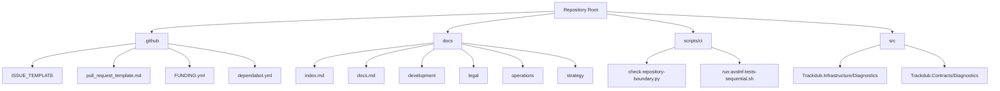
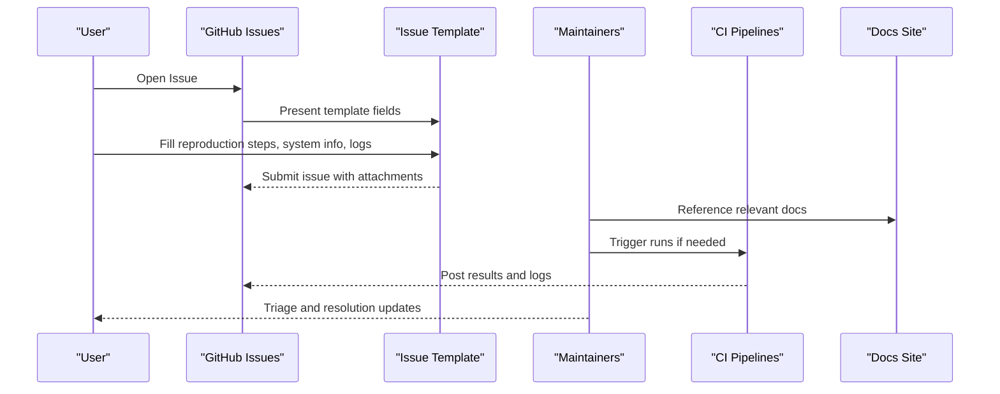
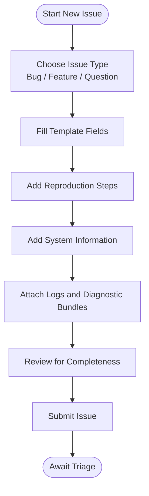
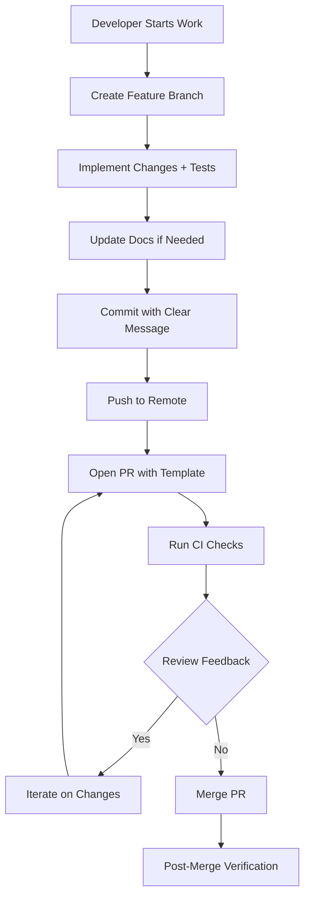
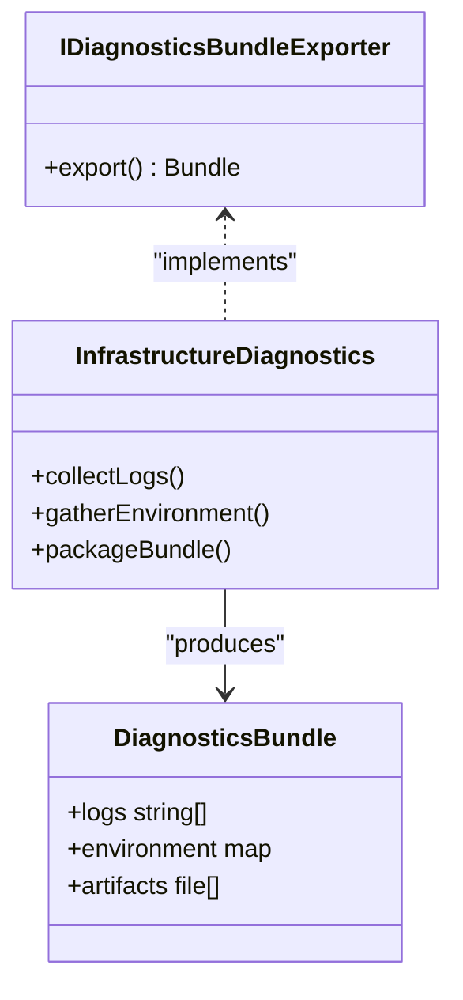
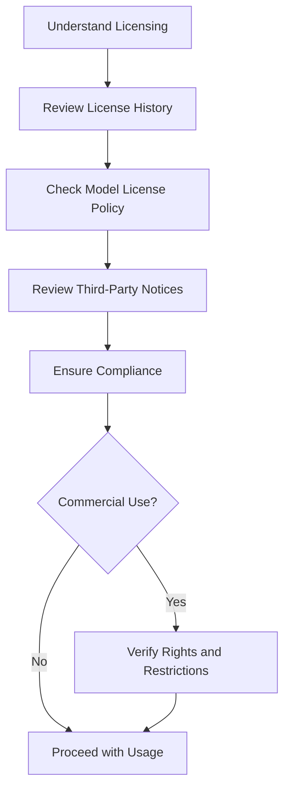
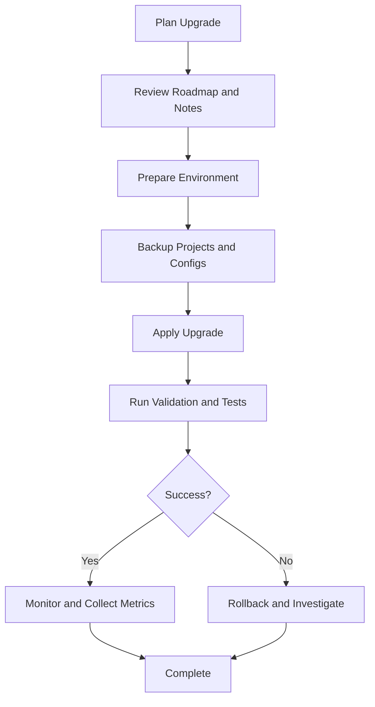
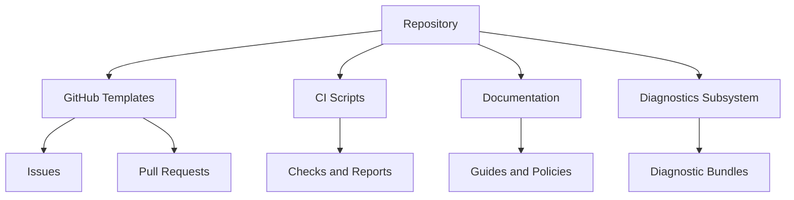

# Community Resources & Support

<cite>
**Referenced Files in This Document**
- [CONTRIBUTING.md](file://CONTRIBUTING.md)
- [README.md](file://README.md)
- [.github/ISSUE_TEMPLATE](file://.github/ISSUE_TEMPLATE)
- [.github/pull_request_template.md](file://.github/pull_request_template.md)
- [docs/repository-policy.md](file://docs/repository-policy.md)
- [docs/legal/LICENSE-HISTORY.md](file://docs/legal/LICENSE-HISTORY.md)
- [docs/legal/MODEL_LICENSE_POLICY.md](file://docs/legal/MODEL_LICENSE_POLICY.md)
- [docs/legal/THIRD_PARTY_NOTICES.md](file://docs/legal/THIRD_PARTY_NOTICES.md)
- [docs/legal/legal.md](file://docs/legal/legal.md)
- [docs/development/TROUBLESHOOTING.md](file://docs/development/TROUBLESHOOTING.md)
- [docs/development/development.md](file://docs/development/development.md)
- [docs/index.md](file://docs/index.md)
- [docs/docs.md](file://docs/docs.md)
- [docs/strategy/LONGTERM-ROADMAP.md](file://docs/strategy/LONGTERM-ROADMAP.md)
- [docs/operations/GITHUB_ACTIONS.md](file://docs/operations/GITHUB_ACTIONS.md)
- [scripts/ci/check-repository-boundary.py](file://scripts/ci/check-repository-boundary.py)
- [scripts/ci/run-avslnf-tests-sequential.sh](file://scripts/ci/run-avslnf-tests-sequential.sh)
- [src/Trackdub.Infrastructure/Diagnostics](file://src/Trackdub.Infrastructure/Diagnostics)
- [src/Trackdub.Contracts/Diagnostics](file://src/Trackdub.Contracts/Diagnostics)
</cite>

## Table of Contents
1. [Introduction](#introduction)
2. [Project Structure](#project-structure)
3. [Core Components](#core-components)
4. [Architecture Overview](#architecture-overview)
5. [Detailed Component Analysis](#detailed-component-analysis)
6. [Dependency Analysis](#dependency-analysis)
7. [Performance Considerations](#performance-considerations)
8. [Troubleshooting Guide](#troubleshooting-guide)
9. [Conclusion](#conclusion)
10. [Appendices](#appendices)

## Introduction
This document is the central hub for community resources and support for Trackdub users and contributors. It explains how to get help, report issues effectively, contribute code, understand licensing and legal considerations, and plan upgrades across versions. It also points to official documentation sites, development guides, and operational references that are part of this repository.

## Project Structure
The repository organizes community-facing materials under docs and GitHub templates:
- docs: Documentation index, development guidance, legal policies, operations, strategy, and reference materials.
- .github: Issue templates, pull request template, funding, dependabot configuration, and CI workflows.
- scripts/ci: Automation helpers used by CI pipelines.
- src: Source code modules (for context when referencing diagnostics or SDK).

**Diagram sources**
- [docs/index.md](file://docs/index.md)
- [docs/docs.md](file://docs/docs.md)
- [.github/ISSUE_TEMPLATE](file://.github/ISSUE_TEMPLATE)
- [.github/pull_request_template.md](file://.github/pull_request_template.md)
- [scripts/ci/check-repository-boundary.py](file://scripts/ci/check-repository-boundary.py)
- [scripts/ci/run-avslnf-tests-sequential.sh](file://scripts/ci/run-avslnf-tests-sequential.sh)
- [src/Trackdub.Infrastructure/Diagnostics](file://src/Trackdub.Infrastructure/Diagnostics)
- [src/Trackdub.Contracts/Diagnostics](file://src/Trackdub.Contracts/Diagnostics)

**Section sources**
- [docs/index.md](file://docs/index.md)
- [docs/docs.md](file://docs/docs.md)
- [docs/development/development.md](file://docs/development/development.md)
- [docs/legal/legal.md](file://docs/legal/legal.md)
- [docs/operations/GITHUB_ACTIONS.md](file://docs/operations/GITHUB_ACTIONS.md)

## Core Components
- Official support channels: GitHub Issues and Discussions (via .github templates), repository documentation, and CI logs.
- Contribution workflow: Defined by CONTRIBUTING.md and pull request template; enforced by CI checks.
- Diagnostics and logging: Infrastructure and contracts provide diagnostic bundles and logging interfaces used to collect evidence for bug reports.
- Legal and licensing: Centralized in docs/legal with license history, model license policy, and third-party notices.

Key entry points for community members:
- Start here: docs/index.md and docs/docs.md
- Development setup and troubleshooting: docs/development/development.md and docs/development/TROUBLESHOOTING.md
- Legal overview: docs/legal/legal.md

**Section sources**
- [CONTRIBUTING.md](file://CONTRIBUTING.md)
- [.github/pull_request_template.md](file://.github/pull_request_template.md)
- [docs/index.md](file://docs/index.md)
- [docs/docs.md](file://docs/docs.md)
- [docs/development/development.md](file://docs/development/development.md)
- [docs/development/TROUBLESHOOTING.md](file://docs/development/TROUBLESHOOTING.md)
- [docs/legal/legal.md](file://docs/legal/legal.md)

## Architecture Overview
Community support flows through GitHub-centric processes:
- Users open issues using standardized templates.
- Contributors follow contribution guidelines and PR templates.
- CI validates changes and provides feedback.
- Diagnostics and logs are attached to issues to accelerate triage.

[No sources needed since this diagram shows conceptual workflow, not actual code structure]

## Detailed Component Analysis

### Support Channels and Issue Reporting
- Use GitHub Issues with the provided templates to ensure consistent reporting.
- Include detailed reproduction steps, environment details, and diagnostic logs.
- For performance or runtime issues, attach diagnostic bundles produced by the diagnostics subsystem.

Best practices for effective bug reports:
- Reproducibility: Provide exact steps, inputs, and expected vs actual behavior.
- Environment: OS, hardware, GPU drivers, runtime versions, and model variants.
- Logs: Attach full logs and diagnostic bundles from the diagnostics layer.
- Scope: Isolate the minimal failing case.

**Section sources**
- [.github/ISSUE_TEMPLATE](file://.github/ISSUE_TEMPLATE)
- [docs/development/TROUBLESHOOTING.md](file://docs/development/TROUBLESHOOTING.md)
- [src/Trackdub.Infrastructure/Diagnostics](file://src/Trackdub.Infrastructure/Diagnostics)
- [src/Trackdub.Contracts/Diagnostics](file://src/Trackdub.Contracts/Diagnostics)

### Contribution Guidelines and Pull Requests
- Follow CONTRIBUTING.md for coding standards, testing requirements, and submission process.
- Use the pull request template to describe changes, tests, and impact.
- Ensure CI passes; review feedback is addressed before merging.

Contribution checklist:
- Read CONTRIBUTING.md and repository policy.
- Implement changes with tests and update docs where applicable.
- Create a PR using the template; link related issues.
- Address review comments and verify CI.

**Section sources**
- [CONTRIBUTING.md](file://CONTRIBUTING.md)
- [.github/pull_request_template.md](file://.github/pull_request_template.md)
- [docs/repository-policy.md](file://docs/repository-policy.md)

### Diagnostics and Logging
- The diagnostics subsystem provides tools and contracts to bundle logs, artifacts, and environment data for issue triage.
- When reporting bugs, include these bundles to speed up investigation.

Key areas:
- Contracts define diagnostic interfaces and data structures.
- Infrastructure implements bundling and export utilities.

**Diagram sources**
- [src/Trackdub.Contracts/Diagnostics](file://src/Trackdub.Contracts/Diagnostics)
- [src/Trackdub.Infrastructure/Diagnostics](file://src/Trackdub.Infrastructure/Diagnostics)

**Section sources**
- [src/Trackdub.Contracts/Diagnostics](file://src/Trackdub.Contracts/Diagnostics)
- [src/Trackdub.Infrastructure/Diagnostics](file://src/Trackdub.Infrastructure/Diagnostics)

### Licensing and Legal Compliance
- License history and evolution are documented.
- Model license policy clarifies usage constraints for bundled models.
- Third-party notices list dependencies and their licenses.
- Legal overview consolidates key policies.

Important considerations:
- Commercial usage rights depend on the active license and model licenses.
- Redistribution of third-party components must comply with their notices.
- Keep third-party notices updated when adding dependencies.

**Section sources**
- [docs/legal/LICENSE-HISTORY.md](file://docs/legal/LICENSE-HISTORY.md)
- [docs/legal/MODEL_LICENSE_POLICY.md](file://docs/legal/MODEL_LICENSE_POLICY.md)
- [docs/legal/THIRD_PARTY_NOTICES.md](file://docs/legal/THIRD_PARTY_NOTICES.md)
- [docs/legal/legal.md](file://docs/legal/legal.md)

### Upgrade Paths and Migration Guidance
- Strategy documents outline long-term roadmap and versioning direction.
- Operations docs detail CI and deployment notes that may affect upgrade procedures.
- Development docs provide guidance for adapting to changes.

Upgrade best practices:
- Review roadmap and release notes prior to upgrading.
- Validate environment compatibility (OS, drivers, runtimes).
- Run CI locally or in a sandbox to catch regressions early.
- Roll back plans should be prepared for critical upgrades.

**Section sources**
- [docs/strategy/LONGTERM-ROADMAP.md](file://docs/strategy/LONGTERM-ROADMAP.md)
- [docs/operations/GITHUB_ACTIONS.md](file://docs/operations/GITHUB_ACTIONS.md)
- [docs/development/development.md](file://docs/development/development.md)

### Community Resources and Documentation Sites
- docs/index.md and docs/docs.md serve as entry points to the documentation site.
- Development docs cover setup, troubleshooting, and contributing.
- Operations docs explain CI, actions, and deployment notes.

Where to find help:
- Documentation site: docs/index.md and docs/docs.md
- Development guide: docs/development/development.md
- Troubleshooting: docs/development/TROUBLESHOOTING.md
- Legal: docs/legal/legal.md

**Section sources**
- [docs/index.md](file://docs/index.md)
- [docs/docs.md](file://docs/docs.md)
- [docs/development/development.md](file://docs/development/development.md)
- [docs/development/TROUBLESHOOTING.md](file://docs/development/TROUBLESHOOTING.md)
- [docs/legal/legal.md](file://docs/legal/legal.md)

## Dependency Analysis
Community processes rely on GitHub templates, CI automation, and documentation:
- Issue and PR templates standardize communication.
- CI scripts enforce repository boundaries and test execution.
- Diagnostics subsystem supports evidence collection.

**Diagram sources**
- [.github/ISSUE_TEMPLATE](file://.github/ISSUE_TEMPLATE)
- [.github/pull_request_template.md](file://.github/pull_request_template.md)
- [scripts/ci/check-repository-boundary.py](file://scripts/ci/check-repository-boundary.py)
- [scripts/ci/run-avslnf-tests-sequential.sh](file://scripts/ci/run-avslnf-tests-sequential.sh)
- [src/Trackdub.Infrastructure/Diagnostics](file://src/Trackdub.Infrastructure/Diagnostics)
- [src/Trackdub.Contracts/Diagnostics](file://src/Trackdub.Contracts/Diagnostics)
- [docs/index.md](file://docs/index.md)

**Section sources**
- [.github/ISSUE_TEMPLATE](file://.github/ISSUE_TEMPLATE)
- [.github/pull_request_template.md](file://.github/pull_request_template.md)
- [scripts/ci/check-repository-boundary.py](file://scripts/ci/check-repository-boundary.py)
- [scripts/ci/run-avslnf-tests-sequential.sh](file://scripts/ci/run-avslnf-tests-sequential.sh)
- [docs/index.md](file://docs/index.md)

## Performance Considerations
- When diagnosing performance issues, include hardware details, driver versions, and model configurations.
- Use diagnostics bundles to capture runtime metrics and logs.
- Prefer reproducible benchmarks and minimal test cases to isolate bottlenecks.

[No sources needed since this section provides general guidance]

## Troubleshooting Guide
- Start with docs/development/TROUBLESHOOTING.md for common issues and resolutions.
- Gather environment information and logs; attach diagnostic bundles to issues.
- If CI fails locally, replicate the environment and rerun checks.

Effective troubleshooting steps:
- Reproduce the issue consistently.
- Collect logs and diagnostics.
- Search existing issues and docs.
- Ask focused questions with context and attachments.

**Section sources**
- [docs/development/TROUBLESHOOTING.md](file://docs/development/TROUBLESHOOTING.md)
- [src/Trackdub.Infrastructure/Diagnostics](file://src/Trackdub.Infrastructure/Diagnostics)
- [src/Trackdub.Contracts/Diagnostics](file://src/Trackdub.Contracts/Diagnostics)

## Conclusion
This guide consolidates how to seek help, report issues, contribute code, and navigate licensing and upgrades. Use the documentation site and GitHub templates as your primary resources. For complex scenarios, engage the community with well-structured issues and PRs, including diagnostics and clear context.

[No sources needed since this section summarizes without analyzing specific files]

## Appendices

### How to Ask Effective Questions
- Provide background, goal, and what you have tried.
- Include environment details and logs.
- Link to relevant docs or issues.
- Be concise and specific.

### Enterprise Support and Professional Services
- For enterprise needs, consult the repository’s legal and licensing documents to understand commercial usage rights.
- Reach out via GitHub discussions or issues for guidance on professional services and training availability.

[No sources needed since this section provides general guidance]