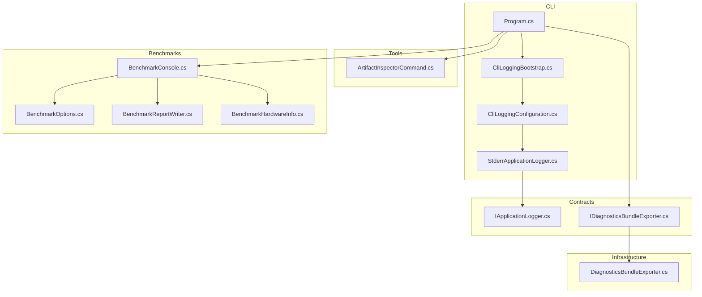
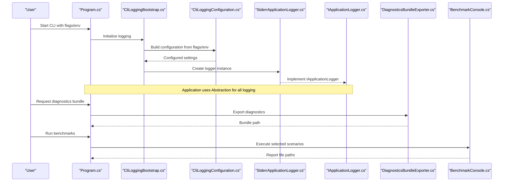
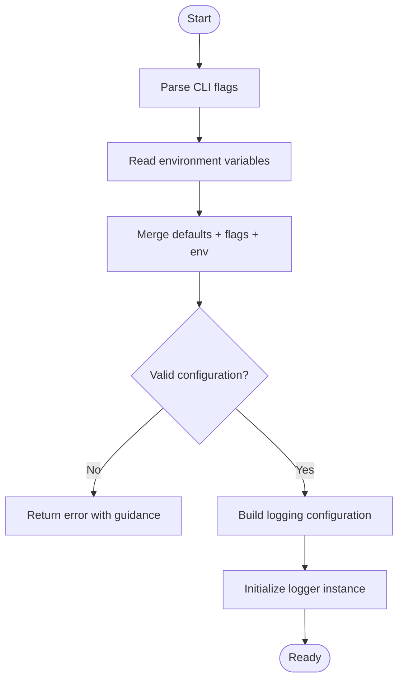
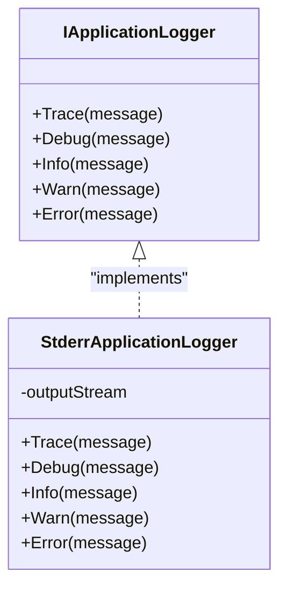
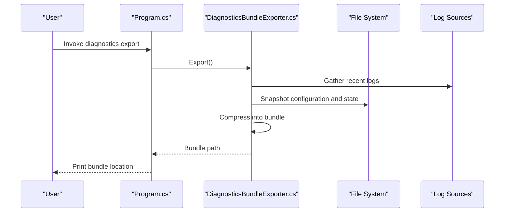
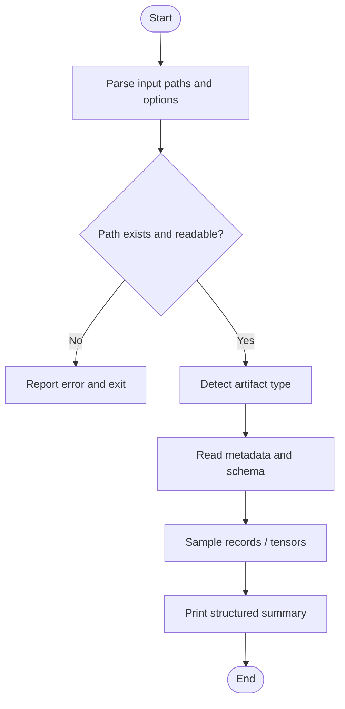
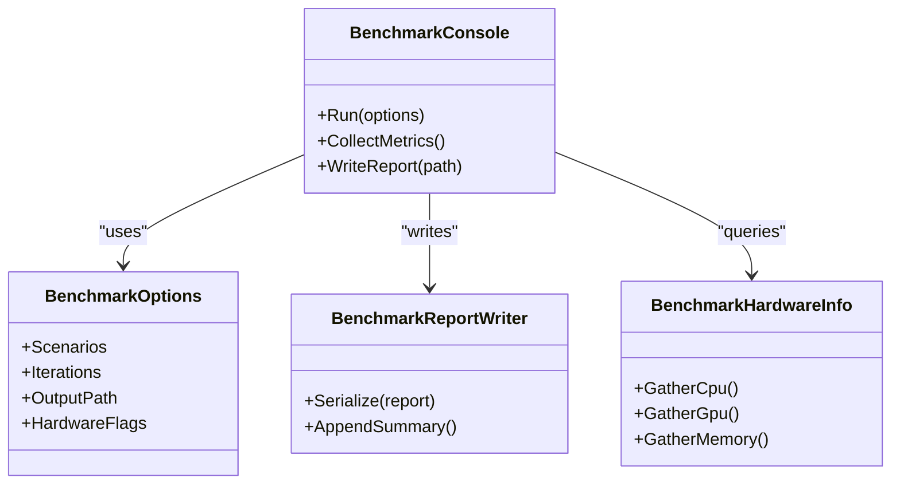
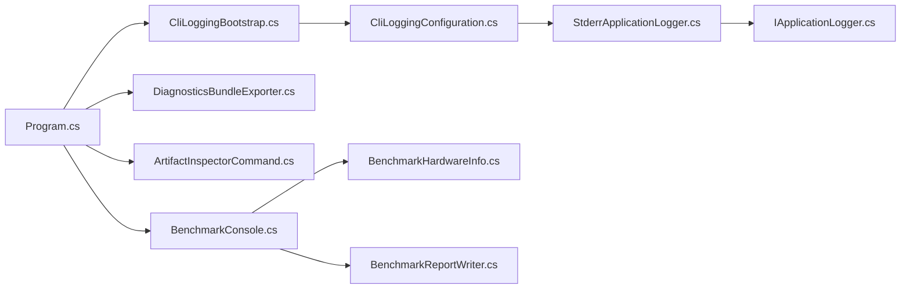

# Diagnostic Tools & Log Analysis

<cite>
**Referenced Files in This Document**
- [CliLoggingBootstrap.cs](file://src/Trackdub.Cli/CliLoggingBootstrap.cs)
- [CliLoggingConfiguration.cs](file://src/Trackdub.Cli/CliLoggingConfiguration.cs)
- [StderrApplicationLogger.cs](file://src/Trackdub.Cli/StderrApplicationLogger.cs)
- [Program.cs](file://src/Trackdub.Cli/Program.cs)
- [IApplicationLogger.cs](file://src/Trackdub.Contracts/IApplicationLogger.cs)
- [IDiagnosticsBundleExporter.cs](file://src/Trackdub.Contracts/IDiagnosticsBundleExporter.cs)
- [DiagnosticsBundleExporter.cs](file://src/Trackdub.Infrastructure/Diagnostics/DiagnosticsBundleExporter.cs)
- [ArtifactInspectorCommand.cs](file://src/Trackdub.Tools/ArtifactInspector/ArtifactInspectorCommand.cs)
- [BenchmarkConsole.cs](file://src/Trackdub.Benchmarks/BenchmarkConsole.cs)
- [BenchmarkOptions.cs](file://src/Trackdub.Benchmarks/BenchmarkOptions.cs)
- [BenchmarkReportWriter.cs](file://src/Trackdub.Benchmarks/BenchmarkReportWriter.cs)
- [BenchmarkHardwareInfo.cs](file://src/Trackdub.Benchmarks/BenchmarkHardwareInfo.cs)
- [README.md](file://src/Trackdub.Benchmarks/README.md)
- [TROUBLESHOOTING.md](file://docs/development/TROUBLESHOOTING.md)
</cite>

## Table of Contents
1. [Introduction](#introduction)
2. [Project Structure](#project-structure)
3. [Core Components](#core-components)
4. [Architecture Overview](#architecture-overview)
5. [Detailed Component Analysis](#detailed-component-analysis)
6. [Dependency Analysis](#dependency-analysis)
7. [Performance Considerations](#performance-considerations)
8. [Troubleshooting Guide](#troubleshooting-guide)
9. [Conclusion](#conclusion)
10. [Appendices](#appendices)

## Introduction
This document explains Trackdub’s diagnostic and logging capabilities with a focus on enabling verbose logging, configuring log levels, locating logs across platforms, and using built-in tools for diagnostics and performance profiling. It covers:
- Enabling and tuning logging via CLI flags and environment variables
- Locating log files on Windows, macOS, and Linux
- Using the DiagnosticsBundleExporter to create comprehensive diagnostic packages
- Inspecting artifacts with ArtifactInspector
- Running benchmarks for performance profiling, memory analysis, and hardware capability testing
- Interpreting logs for common errors, warnings, and performance indicators
- Integrating with external monitoring systems and health checks

## Project Structure
The diagnostic and logging features are implemented across several modules:
- CLI logging bootstrap and configuration
- Application logger abstraction and stderr-based implementation
- Contracts defining diagnostic bundle export interfaces
- Infrastructure implementation for bundling diagnostics
- Tools for artifact inspection
- Benchmarks suite for performance and hardware profiling

**Diagram sources**
- [Program.cs](file://src/Trackdub.Cli/Program.cs)
- [CliLoggingBootstrap.cs](file://src/Trackdub.Cli/CliLoggingBootstrap.cs)
- [CliLoggingConfiguration.cs](file://src/Trackdub.Cli/CliLoggingConfiguration.cs)
- [StderrApplicationLogger.cs](file://src/Trackdub.Cli/StderrApplicationLogger.cs)
- [IApplicationLogger.cs](file://src/Trackdub.Contracts/IApplicationLogger.cs)
- [IDiagnosticsBundleExporter.cs](file://src/Trackdub.Contracts/IDiagnosticsBundleExporter.cs)
- [DiagnosticsBundleExporter.cs](file://src/Trackdub.Infrastructure/Diagnostics/DiagnosticsBundleExporter.cs)
- [ArtifactInspectorCommand.cs](file://src/Trackdub.Tools/ArtifactInspector/ArtifactInspectorCommand.cs)
- [BenchmarkConsole.cs](file://src/Trackdub.Benchmarks/BenchmarkConsole.cs)
- [BenchmarkOptions.cs](file://src/Trackdub.Benchmarks/BenchmarkOptions.cs)
- [BenchmarkReportWriter.cs](file://src/Trackdub.Benchmarks/BenchmarkReportWriter.cs)
- [BenchmarkHardwareInfo.cs](file://src/Trackdub.Benchmarks/BenchmarkHardwareInfo.cs)

**Section sources**
- [Program.cs](file://src/Trackdub.Cli/Program.cs)
- [CliLoggingBootstrap.cs](file://src/Trackdub.Cli/CliLoggingBootstrap.cs)
- [CliLoggingConfiguration.cs](file://src/Trackdub.Cli/CliLoggingConfiguration.cs)
- [StderrApplicationLogger.cs](file://src/Trackdub.Cli/StderrApplicationLogger.cs)
- [IApplicationLogger.cs](file://src/Trackdub.Contracts/IApplicationLogger.cs)
- [IDiagnosticsBundleExporter.cs](file://src/Trackdub.Contracts/IDiagnosticsBundleExporter.cs)
- [DiagnosticsBundleExporter.cs](file://src/Trackdub.Infrastructure/Diagnostics/DiagnosticsBundleExporter.cs)
- [ArtifactInspectorCommand.cs](file://src/Trackdub.Tools/ArtifactInspector/ArtifactInspectorCommand.cs)
- [BenchmarkConsole.cs](file://src/Trackdub.Benchmarks/BenchmarkConsole.cs)
- [BenchmarkOptions.cs](file://src/Trackdub.Benchmarks/BenchmarkOptions.cs)
- [BenchmarkReportWriter.cs](file://src/Trackdub.Benchmarks/BenchmarkReportWriter.cs)
- [BenchmarkHardwareInfo.cs](file://src/Trackdub.Benchmarks/BenchmarkHardwareInfo.cs)

## Core Components
- Logging bootstrap and configuration: Initializes logging based on CLI options and environment variables, sets log level, and configures output destinations.
- Application logger: Provides a unified logging interface used by application components; includes a stderr-based implementation suitable for CLI usage.
- Diagnostics bundle exporter: Gathers runtime state, configuration, logs, and system information into a single package for support and debugging.
- Artifact inspector: Reads and displays metadata and contents of model artifacts, pipeline outputs, and intermediate data.
- Benchmarking suite: Runs performance scenarios, collects metrics, and writes structured reports including hardware capability details.

Key responsibilities:
- Centralized logging initialization and configuration
- Consistent log format and severity handling
- Exportable diagnostics for reproducible bug reports
- Artifact introspection for validation and troubleshooting
- Performance measurement and reporting

**Section sources**
- [CliLoggingBootstrap.cs](file://src/Trackdub.Cli/CliLoggingBootstrap.cs)
- [CliLoggingConfiguration.cs](file://src/Trackdub.Cli/CliLoggingConfiguration.cs)
- [StderrApplicationLogger.cs](file://src/Trackdub.Cli/StderrApplicationLogger.cs)
- [IApplicationLogger.cs](file://src/Trackdub.Contracts/IApplicationLogger.cs)
- [IDiagnosticsBundleExporter.cs](file://src/Trackdub.Contracts/IDiagnosticsBundleExporter.cs)
- [DiagnosticsBundleExporter.cs](file://src/Trackdub.Infrastructure/Diagnostics/DiagnosticsBundleExporter.cs)
- [ArtifactInspectorCommand.cs](file://src/Trackdub.Tools/ArtifactInspector/ArtifactInspectorCommand.cs)
- [BenchmarkConsole.cs](file://src/Trackdub.Benchmarks/BenchmarkConsole.cs)
- [BenchmarkOptions.cs](file://src/Trackdub.Benchmarks/BenchmarkOptions.cs)
- [BenchmarkReportWriter.cs](file://src/Trackdub.Benchmarks/BenchmarkReportWriter.cs)
- [BenchmarkHardwareInfo.cs](file://src/Trackdub.Benchmarks/BenchmarkHardwareInfo.cs)

## Architecture Overview
The logging subsystem is initialized early in the CLI entry point, then exposed through an abstraction that other components use. The diagnostics bundle exporter aggregates logs and system state. The benchmark console orchestrates runs and writes reports.

**Diagram sources**
- [Program.cs](file://src/Trackdub.Cli/Program.cs)
- [CliLoggingBootstrap.cs](file://src/Trackdub.Cli/CliLoggingBootstrap.cs)
- [CliLoggingConfiguration.cs](file://src/Trackdub.Cli/CliLoggingConfiguration.cs)
- [StderrApplicationLogger.cs](file://src/Trackdub.Cli/StderrApplicationLogger.cs)
- [IApplicationLogger.cs](file://src/Trackdub.Contracts/IApplicationLogger.cs)
- [DiagnosticsBundleExporter.cs](file://src/Trackdub.Infrastructure/Diagnostics/DiagnosticsBundleExporter.cs)
- [BenchmarkConsole.cs](file://src/Trackdub.Benchmarks/BenchmarkConsole.cs)

## Detailed Component Analysis

### Logging Bootstrap and Configuration
- Purpose: Parse CLI flags and environment variables to configure log levels, output targets, and formatting.
- Behavior: Creates a configured logger instance and wires it into the application via the logger abstraction.
- Typical flags and env: Verbose mode, log level selection, destination toggles (console/file), and optional structured logging switches.

**Diagram sources**
- [CliLoggingBootstrap.cs](file://src/Trackdub.Cli/CliLoggingBootstrap.cs)
- [CliLoggingConfiguration.cs](file://src/Trackdub.Cli/CliLoggingConfiguration.cs)

**Section sources**
- [CliLoggingBootstrap.cs](file://src/Trackdub.Cli/CliLoggingBootstrap.cs)
- [CliLoggingConfiguration.cs](file://src/Trackdub.Cli/CliLoggingConfiguration.cs)

### Application Logger Abstraction and Implementation
- Abstraction: Defines a consistent logging API used throughout the application.
- Implementation: Stderr-based logger suitable for CLI environments; can be swapped for file or structured logging backends if needed.

**Diagram sources**
- [IApplicationLogger.cs](file://src/Trackdub.Contracts/IApplicationLogger.cs)
- [StderrApplicationLogger.cs](file://src/Trackdub.Cli/StderrApplicationLogger.cs)

**Section sources**
- [IApplicationLogger.cs](file://src/Trackdub.Contracts/IApplicationLogger.cs)
- [StderrApplicationLogger.cs](file://src/Trackdub.Cli/StderrApplicationLogger.cs)

### Diagnostics Bundle Exporter
- Purpose: Collects logs, configuration snapshots, system info, and relevant runtime artifacts into a single archive for support requests.
- Usage: Triggered via CLI command; returns a path to the generated bundle.

**Diagram sources**
- [IDiagnosticsBundleExporter.cs](file://src/Trackdub.Contracts/IDiagnosticsBundleExporter.cs)
- [DiagnosticsBundleExporter.cs](file://src/Trackdub.Infrastructure/Diagnostics/DiagnosticsBundleExporter.cs)

**Section sources**
- [IDiagnosticsBundleExporter.cs](file://src/Trackdub.Contracts/IDiagnosticsBundleExporter.cs)
- [DiagnosticsBundleExporter.cs](file://src/Trackdub.Infrastructure/Diagnostics/DiagnosticsBundleExporter.cs)

### Artifact Inspector Utility
- Purpose: Inspect model files, pipeline outputs, and intermediate artifacts to validate structure and content.
- Usage: CLI command accepts input paths and prints metadata, schema details, and sample records.

**Diagram sources**
- [ArtifactInspectorCommand.cs](file://src/Trackdub.Tools/ArtifactInspector/ArtifactInspectorCommand.cs)

**Section sources**
- [ArtifactInspectorCommand.cs](file://src/Trackdub.Tools/ArtifactInspector/ArtifactInspectorCommand.cs)

### Benchmarking Suite
- Purpose: Profile performance, measure memory usage, and test hardware capabilities across selected scenarios.
- Components: Console runner, options parser, report writer, and hardware info collector.

**Diagram sources**
- [BenchmarkConsole.cs](file://src/Trackdub.Benchmarks/BenchmarkConsole.cs)
- [BenchmarkOptions.cs](file://src/Trackdub.Benchmarks/BenchmarkOptions.cs)
- [BenchmarkReportWriter.cs](file://src/Trackdub.Benchmarks/BenchmarkReportWriter.cs)
- [BenchmarkHardwareInfo.cs](file://src/Trackdub.Benchmarks/BenchmarkHardwareInfo.cs)

**Section sources**
- [BenchmarkConsole.cs](file://src/Trackdub.Benchmarks/BenchmarkConsole.cs)
- [BenchmarkOptions.cs](file://src/Trackdub.Benchmarks/BenchmarkOptions.cs)
- [BenchmarkReportWriter.cs](file://src/Trackdub.Benchmarks/BenchmarkReportWriter.cs)
- [BenchmarkHardwareInfo.cs](file://src/Trackdub.Benchmarks/BenchmarkHardwareInfo.cs)
- [README.md](file://src/Trackdub.Benchmarks/README.md)

## Dependency Analysis
- Logging depends on CLI parsing and environment reading; the logger abstraction decouples consumers from implementation specifics.
- Diagnostics exporter depends on filesystem access and log sources; it should handle missing files gracefully.
- Artifact inspector depends on artifact readers and validators; robustness against malformed inputs is essential.
- Benchmarks depend on hardware detection utilities and report serialization; ensure thread-safety when collecting metrics concurrently.

**Diagram sources**
- [Program.cs](file://src/Trackdub.Cli/Program.cs)
- [CliLoggingBootstrap.cs](file://src/Trackdub.Cli/CliLoggingBootstrap.cs)
- [CliLoggingConfiguration.cs](file://src/Trackdub.Cli/CliLoggingConfiguration.cs)
- [StderrApplicationLogger.cs](file://src/Trackdub.Cli/StderrApplicationLogger.cs)
- [IApplicationLogger.cs](file://src/Trackdub.Contracts/IApplicationLogger.cs)
- [DiagnosticsBundleExporter.cs](file://src/Trackdub.Infrastructure/Diagnostics/DiagnosticsBundleExporter.cs)
- [ArtifactInspectorCommand.cs](file://src/Trackdub.Tools/ArtifactInspector/ArtifactInspectorCommand.cs)
- [BenchmarkConsole.cs](file://src/Trackdub.Benchmarks/BenchmarkConsole.cs)
- [BenchmarkHardwareInfo.cs](file://src/Trackdub.Benchmarks/BenchmarkHardwareInfo.cs)
- [BenchmarkReportWriter.cs](file://src/Trackdub.Benchmarks/BenchmarkReportWriter.cs)

**Section sources**
- [Program.cs](file://src/Trackdub.Cli/Program.cs)
- [CliLoggingBootstrap.cs](file://src/Trackdub.Cli/CliLoggingBootstrap.cs)
- [CliLoggingConfiguration.cs](file://src/Trackdub.Cli/CliLoggingConfiguration.cs)
- [StderrApplicationLogger.cs](file://src/Trackdub.Cli/StderrApplicationLogger.cs)
- [IApplicationLogger.cs](file://src/Trackdub.Contracts/IApplicationLogger.cs)
- [DiagnosticsBundleExporter.cs](file://src/Trackdub.Infrastructure/Diagnostics/DiagnosticsBundleExporter.cs)
- [ArtifactInspectorCommand.cs](file://src/Trackdub.Tools/ArtifactInspector/ArtifactInspectorCommand.cs)
- [BenchmarkConsole.cs](file://src/Trackdub.Benchmarks/BenchmarkConsole.cs)
- [BenchmarkHardwareInfo.cs](file://src/Trackdub.Benchmarks/BenchmarkHardwareInfo.cs)
- [BenchmarkReportWriter.cs](file://src/Trackdub.Benchmarks/BenchmarkReportWriter.cs)

## Performance Considerations
- Logging overhead: Use appropriate log levels to minimize I/O; enable verbose only when necessary.
- Diagnostics bundle size: Limit captured logs to recent entries and exclude large artifacts unless required.
- Benchmark accuracy: Warm up runtimes, isolate CPU/GPU resources, and avoid background tasks during measurement.
- Memory usage: Monitor peak memory during artifact inspection and benchmark runs; consider streaming large datasets where possible.

[No sources needed since this section provides general guidance]

## Troubleshooting Guide
Common issues and resolutions:
- No logs produced: Verify CLI flags and environment variables for log level and output destination; ensure write permissions for target directories.
- Missing log files: Check platform-specific default locations and user permissions; confirm that logging was enabled during the failing run.
- Diagnostics bundle empty: Ensure logs exist at time of export; re-run the operation with verbose logging to capture more context.
- Artifact inspection failures: Validate file paths and formats; inspect error messages for unsupported types or corrupted files.
- Benchmark inconsistencies: Repeat runs, control environment variables affecting execution providers, and ensure hardware drivers are installed.

For additional guidance, consult the development troubleshooting documentation.

**Section sources**
- [TROUBLESHOOTING.md](file://docs/development/TROUBLESHOOTING.md)

## Conclusion
Trackdub provides a cohesive set of diagnostic and logging tools:
- Centralized logging configuration via CLI and environment variables
- Unified logger abstraction for consistent message handling
- Comprehensive diagnostics bundling for support workflows
- Artifact inspection for validating models and pipeline outputs
- Benchmarking suite for performance profiling and hardware capability assessment

Use these tools together to quickly identify issues, reproduce problems, and provide actionable data to support teams.

[No sources needed since this section summarizes without analyzing specific files]

## Appendices

### How to Enable Verbose Logging
- Use the CLI flag for verbose mode to increase log detail.
- Set the log level environment variable to debug or trace for maximum verbosity.
- Confirm output destination (console or file) and verify permissions.

**Section sources**
- [CliLoggingBootstrap.cs](file://src/Trackdub.Cli/CliLoggingBootstrap.cs)
- [CliLoggingConfiguration.cs](file://src/Trackdub.Cli/CliLoggingConfiguration.cs)

### Where to Find Log Files Across Platforms
- Default locations vary by OS; check standard user directories and application-specific folders.
- If logs are not found, re-run with explicit output path flags and ensure write permissions.

**Section sources**
- [CliLoggingConfiguration.cs](file://src/Trackdub.Cli/CliLoggingConfiguration.cs)

### Using DiagnosticsBundleExporter
- Invoke the diagnostics export command from the CLI.
- Review the generated bundle path and include it in support requests.
- Optionally filter included logs or add custom annotations.

**Section sources**
- [IDiagnosticsBundleExporter.cs](file://src/Trackdub.Contracts/IDiagnosticsBundleExporter.cs)
- [DiagnosticsBundleExporter.cs](file://src/Trackdub.Infrastructure/Diagnostics/DiagnosticsBundleExporter.cs)

### Using ArtifactInspector
- Provide one or more artifact paths to inspect.
- Review printed metadata, schema, and sample records.
- Use results to validate model compatibility and pipeline correctness.

**Section sources**
- [ArtifactInspectorCommand.cs](file://src/Trackdub.Tools/ArtifactInspector/ArtifactInspectorCommand.cs)

### Running Benchmarks
- Select scenarios and iterations via options.
- Capture hardware info and generate structured reports.
- Analyze reports for bottlenecks and memory usage patterns.

**Section sources**
- [BenchmarkConsole.cs](file://src/Trackdub.Benchmarks/BenchmarkConsole.cs)
- [BenchmarkOptions.cs](file://src/Trackdub.Benchmarks/BenchmarkOptions.cs)
- [BenchmarkReportWriter.cs](file://src/Trackdub.Benchmarks/BenchmarkReportWriter.cs)
- [BenchmarkHardwareInfo.cs](file://src/Trackdub.Benchmarks/BenchmarkHardwareInfo.cs)
- [README.md](file://src/Trackdub.Benchmarks/README.md)

### Interpreting Logs
- Look for error patterns indicating failed stages, missing dependencies, or resource constraints.
- Watch for warnings about deprecated features or fallback execution providers.
- Identify performance indicators such as long-running stages or high memory usage spikes.

**Section sources**
- [StderrApplicationLogger.cs](file://src/Trackdub.Cli/StderrApplicationLogger.cs)
- [IApplicationLogger.cs](file://src/Trackdub.Contracts/IApplicationLogger.cs)

### Command-Line Flags and Environment Variables
- Common flags: verbose, log-level, output-path, scenario selection, iteration count.
- Environment variables: log level, output destination toggles, feature flags for execution providers.

**Section sources**
- [CliLoggingBootstrap.cs](file://src/Trackdub.Cli/CliLoggingBootstrap.cs)
- [CliLoggingConfiguration.cs](file://src/Trackdub.Cli/CliLoggingConfiguration.cs)
- [BenchmarkOptions.cs](file://src/Trackdub.Benchmarks/BenchmarkOptions.cs)

### Health Checks and Readiness Probes
- Use CLI commands to query component readiness and runtime status.
- Integrate with external monitoring by exposing simple status endpoints or printing concise health summaries.

**Section sources**
- [Program.cs](file://src/Trackdub.Cli/Program.cs)