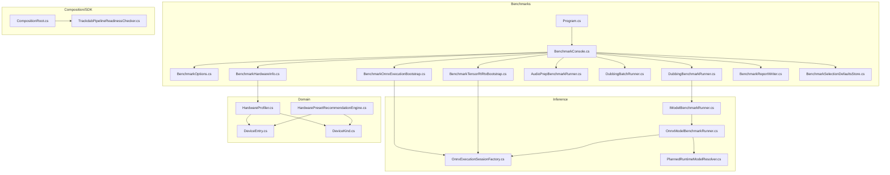
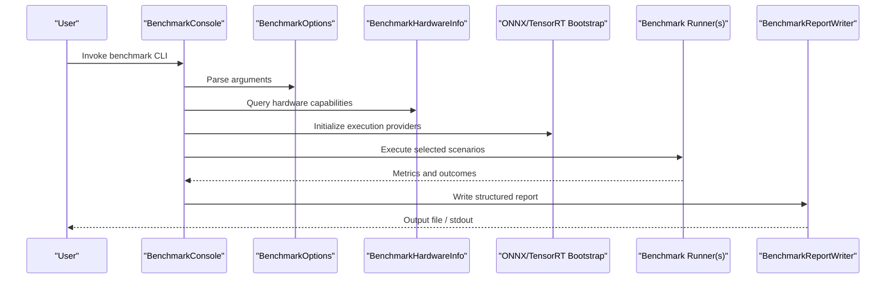
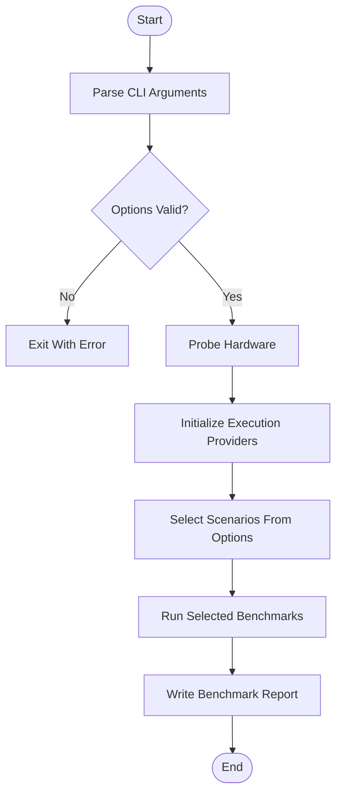
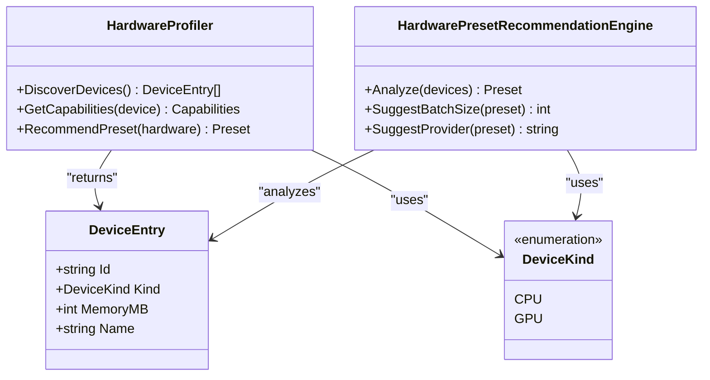
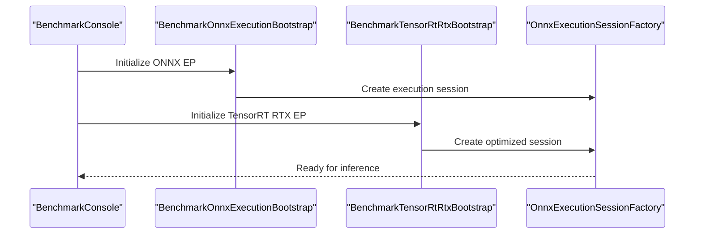
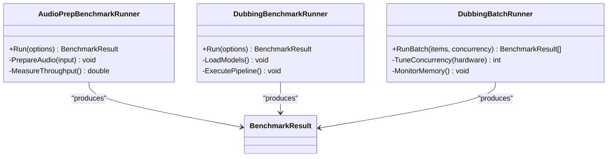
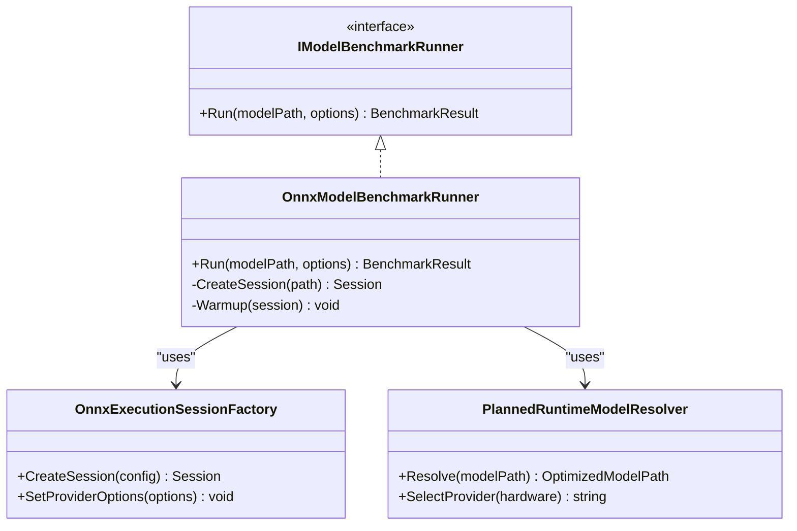
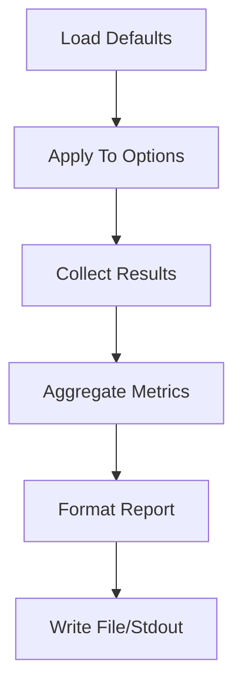
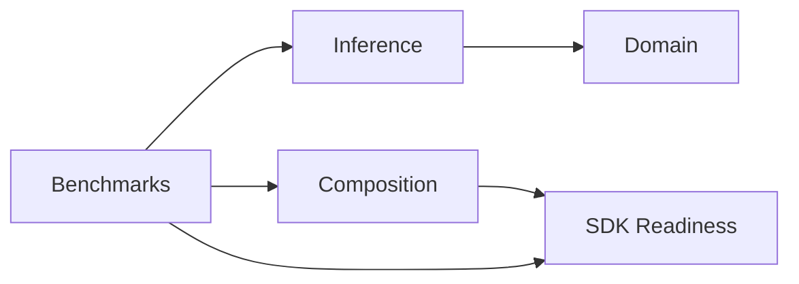

# Performance Issues & Optimization

<cite>
**Referenced Files in This Document**
- [Trackdub.Benchmarks.csproj](file://src/Trackdub.Benchmarks/Trackdub.Benchmarks.csproj)
- [Program.cs](file://src/Trackdub.Benchmarks/Program.cs)
- [BenchmarkConsole.cs](file://src/Trackdub.Benchmarks/BenchmarkConsole.cs)
- [BenchmarkOptions.cs](file://src/Trackdub.Benchmarks/BenchmarkOptions.cs)
- [BenchmarkHardwareInfo.cs](file://src/Trackdub.Benchmarks/BenchmarkHardwareInfo.cs)
- [BenchmarkOnnxExecutionBootstrap.cs](file://src/Trackdub.Benchmarks/BenchmarkOnnxExecutionBootstrap.cs)
- [BenchmarkTensorRtRtxBootstrap.cs](file://src/Trackdub.Benchmarks/BenchmarkTensorRtRtxBootstrap.cs)
- [AudioPrepBenchmarkRunner.cs](file://src/Trackdub.Benchmarks/AudioPrepBenchmarkRunner.cs)
- [DubbingBatchRunner.cs](file://src/Trackdub.Benchmarks/DubbingBatchRunner.cs)
- [DubbingBenchmarkRunner.cs](file://src/Trackdub.Benchmarks/DubbingBenchmarkRunner.cs)
- [BenchmarkReportWriter.cs](file://src/Trackdub.Benchmarks/BenchmarkReportWriter.cs)
- [BenchmarkSelectionDefaultsStore.cs](file://src/Trackdub.Benchmarks/BenchmarkSelectionDefaultsStore.cs)
- [IModelBenchmarkRunner.cs](file://src/Trackdub.Inference/IModelBenchmarkRunner.cs)
- [OnnxModelBenchmarkRunner.cs](file://src/Trackdub.Inference.Onnx/OnnxModelBenchmarkRunner.cs)
- [OnnxExecutionSessionFactory.cs](file://src/Trackdub.Inference.Onnx/OnnxExecutionSessionFactory.cs)
- [PlannedRuntimeModelResolver.cs](file://src/Trackdub.Inference.Onnx/PlannedRuntimeModelResolver.cs)
- [ADR-0009-gpu-memory-budget-planner.md](file://docs/decisions/ADR-0009-gpu-memory-budget-planner.md)
- [profiling-report.md](file://docs/reference/profiling-report.md)
- [windows-ml-phase-3-device-policies.md](file://docs/reference/windows-ml-phase-3-device-policies.md)
- [tensorrt-rtx-ep-abl-plugin.md](file://docs/reference/tensorrt-rtx-ep-abl-plugin.md)
- [hardwareProfiler.cs](file://src/Trackdub.Domain/HardwareProfiler.cs)
- [DeviceEntry.cs](file://src/Trackdub.Domain/DeviceEntry.cs)
- [DeviceKind.cs](file://src/Trackdub.Domain/DeviceKind.cs)
- [HardwarePresetRecommendationEngine.cs](file://src/Trackdub.Domain/HardwarePresetRecommendationEngine.cs)
- [CompositionRoot.cs](file://src/Trackdub.Composition/CompositionRoot.cs)
- [TrackdubPipelineReadinessChecker.cs](file://src/Trackdub.Sdk/TrackdubPipelineReadinessChecker.cs)
</cite>

## Table of Contents
1. Introduction
2. Project Structure
3. Core Components
4. Architecture Overview
5. Detailed Component Analysis
6. Dependency Analysis
7. Performance Considerations
8. Troubleshooting Guide
9. Conclusion
10. Appendices

## Introduction
This document provides a comprehensive guide to performance troubleshooting and optimization for the project, focusing on memory usage (GPU memory exhaustion, CPU memory leaks, garbage collection), slow processing times (model loading, batching, parallelism), GPU acceleration configuration (CUDA/OpenCL, memory allocation, device affinity), CPU optimizations (thread pools, SIMD, cache-friendly structures), profiling methodologies, resource monitoring, and production-grade tuning across hardware configurations and cloud environments. It also addresses thermal throttling, power management, and long-running process stability.

## Project Structure
The repository includes dedicated benchmarking and inference modules that expose performance measurement, execution provider bootstrapping, and hardware discovery utilities. Key areas:
- Benchmarks: Console-driven benchmark runner with options, hardware info, report generation, and ONNX/TensorRT bootstrap helpers.
- Inference: Benchmark runner interfaces and implementations, session factories, and runtime model resolvers.
- Domain: Hardware profiler, device abstractions, and preset recommendation engine.
- Composition and SDK: Pipeline readiness checks and composition root wiring.

**Diagram sources**
- [Program.cs](file://src/Trackdub.Benchmarks/Program.cs)
- [BenchmarkConsole.cs](file://src/Trackdub.Benchmarks/BenchmarkConsole.cs)
- [BenchmarkOptions.cs](file://src/Trackdub.Benchmarks/BenchmarkOptions.cs)
- [BenchmarkHardwareInfo.cs](file://src/Trackdub.Benchmarks/BenchmarkHardwareInfo.cs)
- [BenchmarkOnnxExecutionBootstrap.cs](file://src/Trackdub.Benchmarks/BenchmarkOnnxExecutionBootstrap.cs)
- [BenchmarkTensorRtRtxBootstrap.cs](file://src/Trackdub.Benchmarks/BenchmarkTensorRtRtxBootstrap.cs)
- [AudioPrepBenchmarkRunner.cs](file://src/Trackdub.Benchmarks/AudioPrepBenchmarkRunner.cs)
- [DubbingBatchRunner.cs](file://src/Trackdub.Benchmarks/DubbingBatchRunner.cs)
- [DubbingBenchmarkRunner.cs](file://src/Trackdub.Benchmarks/DubbingBenchmarkRunner.cs)
- [BenchmarkReportWriter.cs](file://src/Trackdub.Benchmarks/BenchmarkReportWriter.cs)
- [BenchmarkSelectionDefaultsStore.cs](file://src/Trackdub.Benchmarks/BenchmarkSelectionDefaultsStore.cs)
- [IModelBenchmarkRunner.cs](file://src/Trackdub.Inference/IModelBenchmarkRunner.cs)
- [OnnxModelBenchmarkRunner.cs](file://src/Trackdub.Inference.Onnx/OnnxModelBenchmarkRunner.cs)
- [OnnxExecutionSessionFactory.cs](file://src/Trackdub.Inference.Onnx/OnnxExecutionSessionFactory.cs)
- [PlannedRuntimeModelResolver.cs](file://src/Trackdub.Inference.Onnx/PlannedRuntimeModelResolver.cs)
- [HardwareProfiler.cs](file://src/Trackdub.Domain/HardwareProfiler.cs)
- [DeviceEntry.cs](file://src/Trackdub.Domain/DeviceEntry.cs)
- [DeviceKind.cs](file://src/Trackdub.Domain/DeviceKind.cs)
- [HardwarePresetRecommendationEngine.cs](file://src/Trackdub.Domain/HardwarePresetRecommendationEngine.cs)
- [CompositionRoot.cs](file://src/Trackdub.Composition/CompositionRoot.cs)
- [TrackdubPipelineReadinessChecker.cs](file://src/Trackdub.Sdk/TrackdubPipelineReadinessChecker.cs)

**Section sources**
- [Trackdub.Benchmarks.csproj](file://src/Trackdub.Benchmarks/Trackdub.Benchmarks.csproj)
- [Program.cs](file://src/Trackdub.Benchmarks/Program.cs)
- [BenchmarkConsole.cs](file://src/Trackdub.Benchmarks/BenchmarkConsole.cs)
- [BenchmarkOptions.cs](file://src/Trackdub.Benchmarks/BenchmarkOptions.cs)
- [BenchmarkHardwareInfo.cs](file://src/Trackdub.Benchmarks/BenchmarkHardwareInfo.cs)
- [BenchmarkOnnxExecutionBootstrap.cs](file://src/Trackdub.Benchmarks/BenchmarkOnnxExecutionBootstrap.cs)
- [BenchmarkTensorRtRtxBootstrap.cs](file://src/Trackdub.Benchmarks/BenchmarkTensorRtRtxBootstrap.cs)
- [AudioPrepBenchmarkRunner.cs](file://src/Trackdub.Benchmarks/AudioPrepBenchmarkRunner.cs)
- [DubbingBatchRunner.cs](file://src/Trackdub.Benchmarks/DubbingBatchRunner.cs)
- [DubbingBenchmarkRunner.cs](file://src/Trackdub.Benchmarks/DubbingBenchmarkRunner.cs)
- [BenchmarkReportWriter.cs](file://src/Trackdub.Benchmarks/BenchmarkReportWriter.cs)
- [BenchmarkSelectionDefaultsStore.cs](file://src/Trackdub.Benchmarks/BenchmarkSelectionDefaultsStore.cs)
- [IModelBenchmarkRunner.cs](file://src/Trackdub.Inference/IModelBenchmarkRunner.cs)
- [OnnxModelBenchmarkRunner.cs](file://src/Trackdub.Inference.Onnx/OnnxModelBenchmarkRunner.cs)
- [OnnxExecutionSessionFactory.cs](file://src/Trackdub.Inference.Onnx/OnnxExecutionSessionFactory.cs)
- [PlannedRuntimeModelResolver.cs](file://src/Trackdub.Inference.Onnx/PlannedRuntimeModelResolver.cs)
- [HardwareProfiler.cs](file://src/Trackdub.Domain/HardwareProfiler.cs)
- [DeviceEntry.cs](file://src/Trackdub.Domain/DeviceEntry.cs)
- [DeviceKind.cs](file://src/Trackdub.Domain/DeviceKind.cs)
- [HardwarePresetRecommendationEngine.cs](file://src/Trackdub.Domain/HardwarePresetRecommendationEngine.cs)
- [CompositionRoot.cs](file://src/Trackdub.Composition/CompositionRoot.cs)
- [TrackdubPipelineReadinessChecker.cs](file://src/Trackdub.Sdk/TrackdubPipelineReadinessChecker.cs)

## Core Components
- Benchmark console and options: Entry point orchestrating benchmark scenarios, parsing options, and writing reports.
- Hardware info and profiler: Discovery of devices, capabilities, and preset recommendations.
- Execution provider bootstraps: Initialization of ONNX execution providers including TensorRT RTX.
- Benchmark runners: Audio preparation and dubbing benchmarks; ONNX model benchmark runner.
- Session factory and model resolver: Creation of execution sessions and selection of optimized models.

Key responsibilities:
- Provide repeatable performance measurements across scenarios.
- Expose hardware characteristics to guide runtime decisions.
- Configure execution providers for optimal acceleration.
- Generate structured reports for analysis and regression detection.

**Section sources**
- [Program.cs](file://src/Trackdub.Benchmarks/Program.cs)
- [BenchmarkConsole.cs](file://src/Trackdub.Benchmarks/BenchmarkConsole.cs)
- [BenchmarkOptions.cs](file://src/Trackdub.Benchmarks/BenchmarkOptions.cs)
- [BenchmarkHardwareInfo.cs](file://src/Trackdub.Benchmarks/BenchmarkHardwareInfo.cs)
- [BenchmarkOnnxExecutionBootstrap.cs](file://src/Trackdub.Benchmarks/BenchmarkOnnxExecutionBootstrap.cs)
- [BenchmarkTensorRtRtxBootstrap.cs](file://src/Trackdub.Benchmarks/BenchmarkTensorRtRtxBootstrap.cs)
- [AudioPrepBenchmarkRunner.cs](file://src/Trackdub.Benchmarks/AudioPrepBenchmarkRunner.cs)
- [DubbingBatchRunner.cs](file://src/Trackdub.Benchmarks/DubbingBatchRunner.cs)
- [DubbingBenchmarkRunner.cs](file://src/Trackdub.Benchmarks/DubbingBenchmarkRunner.cs)
- [BenchmarkReportWriter.cs](file://src/Trackdub.Benchmarks/BenchmarkReportWriter.cs)
- [BenchmarkSelectionDefaultsStore.cs](file://src/Trackdub.Benchmarks/BenchmarkSelectionDefaultsStore.cs)
- [IModelBenchmarkRunner.cs](file://src/Trackdub.Inference/IModelBenchmarkRunner.cs)
- [OnnxModelBenchmarkRunner.cs](file://src/Trackdub.Inference.Onnx/OnnxModelBenchmarkRunner.cs)
- [OnnxExecutionSessionFactory.cs](file://src/Trackdub.Inference.Onnx/OnnxExecutionSessionFactory.cs)
- [PlannedRuntimeModelResolver.cs](file://src/Trackdub.Inference.Onnx/PlannedRuntimeModelResolver.cs)
- [HardwareProfiler.cs](file://src/Trackdub.Domain/HardwareProfiler.cs)
- [DeviceEntry.cs](file://src/Trackdub.Domain/DeviceEntry.cs)
- [DeviceKind.cs](file://src/Trackdub.Domain/DeviceKind.cs)
- [HardwarePresetRecommendationEngine.cs](file://src/Trackdub.Domain/HardwarePresetRecommendationEngine.cs)

## Architecture Overview
The benchmarking pipeline integrates with inference components to measure performance under realistic workloads. The flow starts from the console entry, selects scenarios based on options, initializes execution providers, runs benchmarks, and writes reports.

**Diagram sources**
- [BenchmarkConsole.cs](file://src/Trackdub.Benchmarks/BenchmarkConsole.cs)
- [BenchmarkOptions.cs](file://src/Trackdub.Benchmarks/BenchmarkOptions.cs)
- [BenchmarkHardwareInfo.cs](file://src/Trackdub.Benchmarks/BenchmarkHardwareInfo.cs)
- [BenchmarkOnnxExecutionBootstrap.cs](file://src/Trackdub.Benchmarks/BenchmarkOnnxExecutionBootstrap.cs)
- [BenchmarkTensorRtRtxBootstrap.cs](file://src/Trackdub.Benchmarks/BenchmarkTensorRtRtxBootstrap.cs)
- [AudioPrepBenchmarkRunner.cs](file://src/Trackdub.Benchmarks/AudioPrepBenchmarkRunner.cs)
- [DubbingBatchRunner.cs](file://src/Trackdub.Benchmarks/DubbingBatchRunner.cs)
- [DubbingBenchmarkRunner.cs](file://src/Trackdub.Benchmarks/DubbingBenchmarkRunner.cs)
- [BenchmarkReportWriter.cs](file://src/Trackdub.Benchmarks/BenchmarkReportWriter.cs)

## Detailed Component Analysis

### Benchmark Console and Options
- Parses command-line options to select scenarios, configure providers, and control output.
- Coordinates hardware probing and provider initialization before running benchmarks.
- Ensures consistent reporting format for downstream analysis.

**Diagram sources**
- [BenchmarkConsole.cs](file://src/Trackdub.Benchmarks/BenchmarkConsole.cs)
- [BenchmarkOptions.cs](file://src/Trackdub.Benchmarks/BenchmarkOptions.cs)

**Section sources**
- [BenchmarkConsole.cs](file://src/Trackdub.Benchmarks/BenchmarkConsole.cs)
- [BenchmarkOptions.cs](file://src/Trackdub.Benchmarks/BenchmarkOptions.cs)

### Hardware Info and Profiler
- Discovers devices and their kinds (CPU/GPU).
- Provides capability metadata used by presets and execution provider selection.
- Supports preset recommendations based on detected hardware.

**Diagram sources**
- [HardwareProfiler.cs](file://src/Trackdub.Domain/HardwareProfiler.cs)
- [DeviceEntry.cs](file://src/Trackdub.Domain/DeviceEntry.cs)
- [DeviceKind.cs](file://src/Trackdub.Domain/DeviceKind.cs)
- [HardwarePresetRecommendationEngine.cs](file://src/Trackdub.Domain/HardwarePresetRecommendationEngine.cs)

**Section sources**
- [BenchmarkHardwareInfo.cs](file://src/Trackdub.Benchmarks/BenchmarkHardwareInfo.cs)
- [HardwareProfiler.cs](file://src/Trackdub.Domain/HardwareProfiler.cs)
- [DeviceEntry.cs](file://src/Trackdub.Domain/DeviceEntry.cs)
- [DeviceKind.cs](file://src/Trackdub.Domain/DeviceKind.cs)
- [HardwarePresetRecommendationEngine.cs](file://src/Trackdub.Domain/HardwarePresetRecommendationEngine.cs)

### Execution Provider Bootstraps
- Initializes ONNX execution providers, including TensorRT RTX.
- Configures provider-specific settings such as memory allocation strategies and device affinity.
- Validates readiness before running benchmarks.

**Diagram sources**
- [BenchmarkOnnxExecutionBootstrap.cs](file://src/Trackdub.Benchmarks/BenchmarkOnnxExecutionBootstrap.cs)
- [BenchmarkTensorRtRtxBootstrap.cs](file://src/Trackdub.Benchmarks/BenchmarkTensorRtRtxBootstrap.cs)
- [OnnxExecutionSessionFactory.cs](file://src/Trackdub.Inference.Onnx/OnnxExecutionSessionFactory.cs)

**Section sources**
- [BenchmarkOnnxExecutionBootstrap.cs](file://src/Trackdub.Benchmarks/BenchmarkOnnxExecutionBootstrap.cs)
- [BenchmarkTensorRtRtxBootstrap.cs](file://src/Trackdub.Benchmarks/BenchmarkTensorRtRtxBootstrap.cs)
- [OnnxExecutionSessionFactory.cs](file://src/Trackdub.Inference.Onnx/OnnxExecutionSessionFactory.cs)

### Benchmark Runners
- Audio preparation benchmark: measures preprocessing throughput and memory behavior.
- Dubbing benchmark: measures end-to-end pipeline latency and throughput.
- Batch runner: controls concurrency and batch sizing for stable performance.

**Diagram sources**
- [AudioPrepBenchmarkRunner.cs](file://src/Trackdub.Benchmarks/AudioPrepBenchmarkRunner.cs)
- [DubbingBenchmarkRunner.cs](file://src/Trackdub.Benchmarks/DubbingBenchmarkRunner.cs)
- [DubbingBatchRunner.cs](file://src/Trackdub.Benchmarks/DubbingBatchRunner.cs)

**Section sources**
- [AudioPrepBenchmarkRunner.cs](file://src/Trackdub.Benchmarks/AudioPrepBenchmarkRunner.cs)
- [DubbingBenchmarkRunner.cs](file://src/Trackdub.Benchmarks/DubbingBenchmarkRunner.cs)
- [DubbingBatchRunner.cs](file://src/Trackdub.Benchmarks/DubbingBatchRunner.cs)

### ONNX Model Benchmark Runner and Session Factory
- Implements benchmark interface for ONNX models.
- Uses session factory to create execution sessions with appropriate providers.
- Resolves planned runtime models for optimized execution paths.

**Diagram sources**
- [IModelBenchmarkRunner.cs](file://src/Trackdub.Inference/IModelBenchmarkRunner.cs)
- [OnnxModelBenchmarkRunner.cs](file://src/Trackdub.Inference.Onnx/OnnxModelBenchmarkRunner.cs)
- [OnnxExecutionSessionFactory.cs](file://src/Trackdub.Inference.Onnx/OnnxExecutionSessionFactory.cs)
- [PlannedRuntimeModelResolver.cs](file://src/Trackdub.Inference.Onnx/PlannedRuntimeModelResolver.cs)

**Section sources**
- [IModelBenchmarkRunner.cs](file://src/Trackdub.Inference/IModelBenchmarkRunner.cs)
- [OnnxModelBenchmarkRunner.cs](file://src/Trackdub.Inference.Onnx/OnnxModelBenchmarkRunner.cs)
- [OnnxExecutionSessionFactory.cs](file://src/Trackdub.Inference.Onnx/OnnxExecutionSessionFactory.cs)
- [PlannedRuntimeModelResolver.cs](file://src/Trackdub.Inference.Onnx/PlannedRuntimeModelResolver.cs)

### Reporting and Defaults
- Writes structured benchmark reports for analysis and CI integration.
- Stores default selections for quick benchmark runs.

**Diagram sources**
- [BenchmarkReportWriter.cs](file://src/Trackdub.Benchmarks/BenchmarkReportWriter.cs)
- [BenchmarkSelectionDefaultsStore.cs](file://src/Trackdub.Benchmarks/BenchmarkSelectionDefaultsStore.cs)

**Section sources**
- [BenchmarkReportWriter.cs](file://src/Trackdub.Benchmarks/BenchmarkReportWriter.cs)
- [BenchmarkSelectionDefaultsStore.cs](file://src/Trackdub.Benchmarks/BenchmarkSelectionDefaultsStore.cs)

## Dependency Analysis
The benchmarking layer depends on inference components for model execution and domain services for hardware insights. Composition and SDK layers provide readiness checks and orchestration.

**Diagram sources**
- [Program.cs](file://src/Trackdub.Benchmarks/Program.cs)
- [CompositionRoot.cs](file://src/Trackdub.Composition/CompositionRoot.cs)
- [TrackdubPipelineReadinessChecker.cs](file://src/Trackdub.Sdk/TrackdubPipelineReadinessChecker.cs)

**Section sources**
- [CompositionRoot.cs](file://src/Trackdub.Composition/CompositionRoot.cs)
- [TrackdubPipelineReadinessChecker.cs](file://src/Trackdub.Sdk/TrackdubPipelineReadinessChecker.cs)

## Performance Considerations
- Memory usage problems:
  - GPU memory exhaustion: Use memory budget planning and provider-specific allocation strategies; reduce batch size; enable provider memory limits; monitor GPU memory via tools.
  - CPU memory leaks: Ensure proper disposal of buffers and sessions; avoid retaining large arrays; use pooling where applicable.
  - Garbage collection issues: Minimize allocations in hot paths; prefer structs and value types; preallocate buffers; tune GC settings for long-running processes.
- Slow processing times:
  - Model loading optimization: Preload models during startup; reuse sessions; leverage optimized model variants; warm up providers.
  - Batch processing strategies: Tune batch sizes based on hardware; balance throughput vs latency; implement backpressure.
  - Parallel execution tuning: Adjust concurrency levels; pin threads to cores; avoid oversubscription; use async I/O where possible.
- GPU acceleration:
  - CUDA/OpenCL configuration: Verify driver versions; set environment variables for device selection; enable FP16 when supported.
  - Memory allocation strategies: Use provider-specific allocators; limit peak memory; enable memory fragmentation mitigation.
  - Device affinity: Pin processes to specific GPUs; isolate workloads; avoid cross-device data transfers.
- CPU optimization:
  - Thread pool configuration: Set max concurrent tasks; align with physical cores; avoid blocking calls.
  - SIMD instruction usage: Prefer vectorized libraries; ensure alignment; avoid branching in tight loops.
  - Cache-friendly data structures: Use contiguous arrays; minimize pointer chasing; optimize access patterns.
- Profiling methodologies:
  - Built-in benchmarks: Use provided runners to capture metrics consistently.
  - External profilers: Integrate with OS-level tools (perf, ETW, VTune); collect traces and flame graphs.
  - Performance counters: Monitor CPU utilization, context switches, page faults, GPU memory, and I/O throughput.
- Resource monitoring:
  - Track CPU, GPU, memory, and disk I/O using system APIs and telemetry pipelines.
  - Alert on thresholds; log anomalies; correlate with application events.
- Production guidelines:
  - Different hardware configurations: Detect capabilities at runtime; apply presets; fallback gracefully.
  - Cloud deployment: Use autoscaling; right-size instances; manage ephemeral storage; monitor quotas.
  - Long-running stability: Implement health checks; periodic resets; graceful degradation; logging and diagnostics.
- Thermal and power:
  - Thermal throttling: Monitor temperatures; adjust workload; improve cooling; throttle proactively.
  - Power management: Set performance profiles; disable aggressive sleep states; tune governor settings.

[No sources needed since this section provides general guidance]

## Troubleshooting Guide
Common issues and resolutions:
- GPU out-of-memory errors:
  - Reduce batch size; enable memory budget planner; switch to lower precision; verify provider memory limits.
- High CPU usage or stalls:
  - Check thread pool saturation; profile hotspots; reduce contention; ensure non-blocking operations.
- GC pressure spikes:
  - Analyze heap dumps; identify allocations; introduce object pooling; tune GC server mode.
- Slow model load times:
  - Warm up models; cache sessions; use optimized formats; precompute constants.
- Provider initialization failures:
  - Validate drivers; check environment variables; inspect logs; fall back to CPU if necessary.
- Disk I/O bottlenecks:
  - Use SSDs; prefetch data; buffer reads/writes; avoid excessive small I/O.

**Section sources**
- [ADR-0009-gpu-memory-budget-planner.md](file://docs/decisions/ADR-0009-gpu-memory-budget-planner.md)
- [profiling-report.md](file://docs/reference/profiling-report.md)
- [windows-ml-phase-3-device-policies.md](file://docs/reference/windows-ml-phase-3-device-policies.md)
- [tensorrt-rtx-ep-abl-plugin.md](file://docs/reference/tensorrt-rtx-ep-abl-plugin.md)

## Conclusion
Effective performance troubleshooting requires systematic measurement, targeted optimization, and robust monitoring. Leverage the built-in benchmarks, hardware discovery, and execution provider bootstraps to identify bottlenecks. Apply memory budgeting, batching, and parallelism tuning to stabilize throughput. Monitor resources continuously and adapt configurations per hardware and deployment context. Maintain long-running stability through health checks, graceful degradation, and proactive thermal/power management.

[No sources needed since this section summarizes without analyzing specific files]

## Appendices
- Reference documents:
  - GPU memory budget planner decision record.
  - Profiling report template and methodology.
  - Windows ML device policies for provider selection.
  - TensorRT RTX EP ABI plugin notes.

[No sources needed since this section lists references without analyzing specific files]