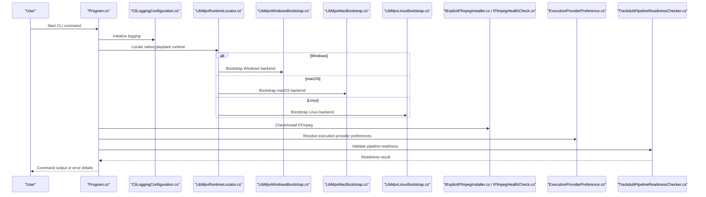
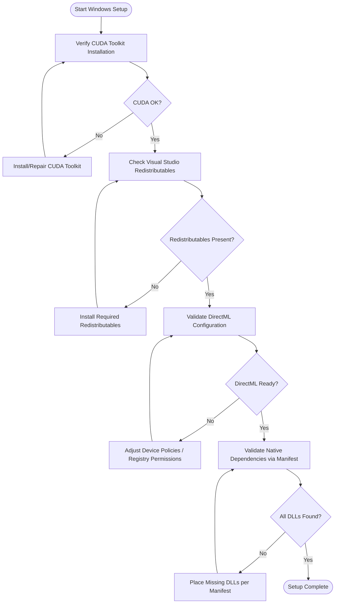
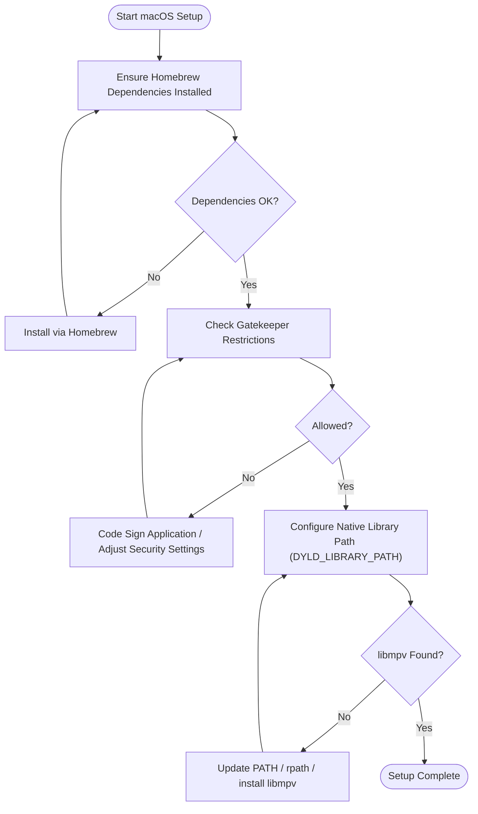
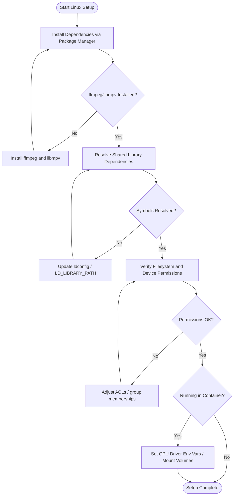
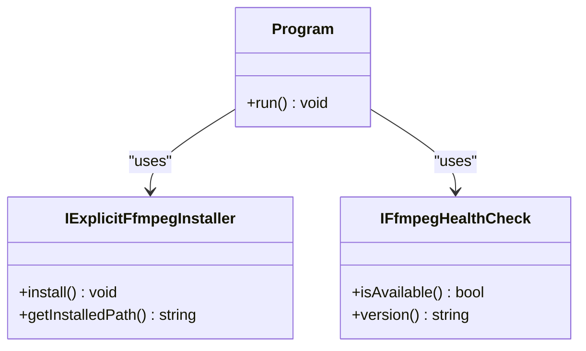
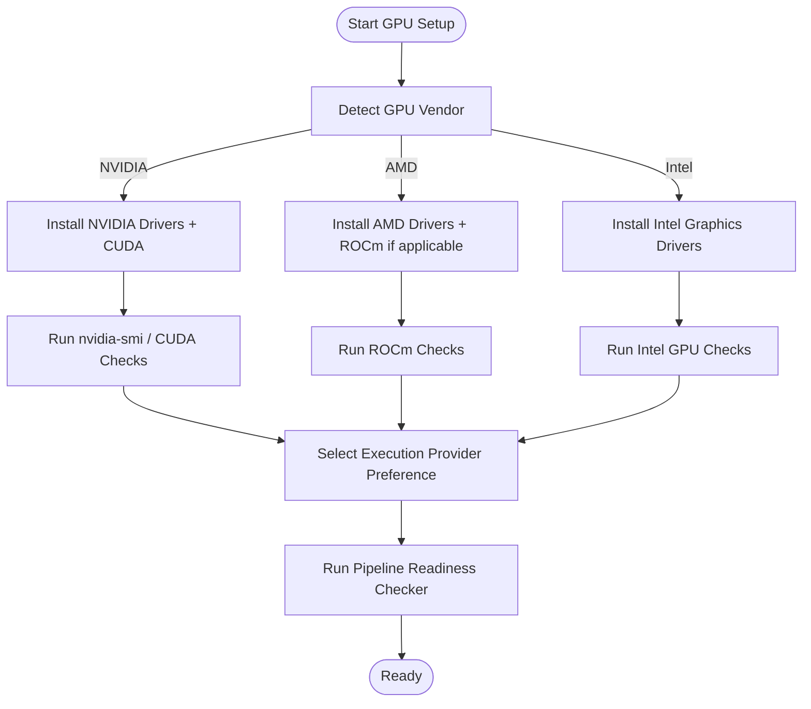
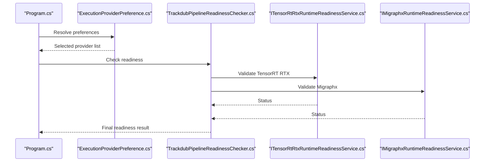
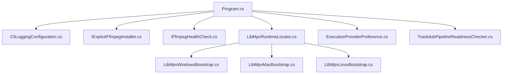

# Platform-Specific Problems

<cite>
**Referenced Files in This Document**
- [TROUBLESHOOTING.md](file://docs/development/TROUBLESHOOTING.md)
- [macos-deployment-notes.md](file://docs/operations/macos-deployment-notes.md)
- [windows-ml-phase-3-device-policies.md](file://docs/reference/windows-ml-phase-3-device-policies.md)
- [windows-ml-phase-4-closeout.md](file://docs/reference/windows-ml-phase-4-closeout.md)
- [windows-ml-phase-5-catalog-eps.md](file://docs/reference/windows-ml-phase-5-catalog-eps.md)
- [windows-ml-stage-provider-matrix.md](file://docs/reference/windows-ml-stage-provider-matrix.md)
- [tensorrt-rtx-ep-abi-plugin.md](file://docs/reference/tensorrt-rtx-ep-abi-plugin.md)
- [LibMpvWindowsBootstrap.cs](file://src/Trackdub.Media.Playback/LibMpvWindowsBootstrap.cs)
- [LibMpvMacBootstrap.cs](file://src/Trackdub.Media.Playback/LibMpvMacBootstrap.cs)
- [LibMpvLinuxBootstrap.cs](file://src/Trackdub.Media.Playback/LibMpvLinuxBootstrap.cs)
- [LibMpvRuntimeLocator.cs](file://src/Trackdub.Media.Playback/LibMpvRuntimeLocator.cs)
- [WinNativeDepsManifest.cs](file://src/Trackdub.Media.Playback/WinNativeDepsManifest.cs)
- [Program.cs](file://src/Trackdub.Cli/Program.cs)
- [CliLoggingConfiguration.cs](file://src/Trackdub.Cli/CliLoggingConfiguration.cs)
- [NvidiaAfxProfile.cs](file://src/Trackdub.Contracts/NvidiaAfxProfile.cs)
- [IExplicitFfmpegInstaller.cs](file://src/Trackdub.Contracts/IExplicitFfmpegInstaller.cs)
- [IFfmpegHealthCheck.cs](file://src/Trackdub.Contracts/IFfmpegHealthCheck.cs)
- [ITensorRtRtxRuntimeReadinessService.cs](file://src/Trackdub.Contracts/ITensorRtRtxRuntimeReadinessService.cs)
- [IMigraphxRuntimeReadinessService.cs](file://src/Trackdub.Contracts/IMigraphxRuntimeReadinessService.cs)
- [ExecutionProviderPreference.cs](file://src/Trackdub.Sdk/ExecutionProviderPreference.cs)
- [TrackdubPipelineReadinessChecker.cs](file://src/Trackdub.Sdk/TrackdubPipelineReadinessChecker.cs)
</cite>

## Table of Contents
1. [Introduction](#introduction)
2. [Project Structure](#project-structure)
3. [Core Components](#core-components)
4. [Architecture Overview](#architecture-overview)
5. [Detailed Component Analysis](#detailed-component-analysis)
6. [Dependency Analysis](#dependency-analysis)
7. [Performance Considerations](#performance-considerations)
8. [Troubleshooting Guide](#troubleshooting-guide)
9. [Conclusion](#conclusion)
10. [Appendices](#appendices)

## Introduction
This document provides platform-specific troubleshooting guidance for Windows, macOS, and Linux environments. It focuses on common setup and runtime issues such as GPU execution provider configuration, native library discovery, package manager dependencies, code signing and sandboxing policies, firewall and proxy settings, and FFmpeg installation. It also includes diagnostic workflows and environment variable configurations tailored to each operating system.

## Project Structure
The repository contains:
- Operations and development documentation with platform notes
- Code for media playback bootstrapping across platforms
- Contracts and SDK components for readiness checks and execution provider selection
- CLI entry points and logging configuration used during diagnostics

```mermaid
graph TB
subgraph "Documentation"
D1["docs/development/TROUBLESHOOTING.md"]
D2["docs/operations/macos-deployment-notes.md"]
D3["docs/reference/windows-ml-*.md"]
D4["docs/reference/tensorrt-rtx-ep-abi-plugin.md"]
end
subgraph "Media Playback Bootstrap"
P1["LibMpvWindowsBootstrap.cs"]
P2["LibMpvMacBootstrap.cs"]
P3["LibMpvLinuxBootstrap.cs"]
P4["LibMpvRuntimeLocator.cs"]
P5["WinNativeDepsManifest.cs"]
end
subgraph "Contracts & SDK"
C1["IExplicitFfmpegInstaller.cs"]
C2["IFfmpegHealthCheck.cs"]
C3["ITensorRtRtxRuntimeReadinessService.cs"]
C4["IMigraphxRuntimeReadinessService.cs"]
S1["ExecutionProviderPreference.cs"]
S2["TrackdubPipelineReadinessChecker.cs"]
end
subgraph "CLI"
L1["Program.cs"]
L2["CliLoggingConfiguration.cs"]
end
D1 --> L1
D2 --> L1
D3 --> L1
D4 --> L1
P1 --> L1
P2 --> L1
P3 --> L1
P4 --> L1
P5 --> L1
C1 --> L1
C2 --> L1
C3 --> L1
C4 --> L1
S1 --> L1
S2 --> L1
```

**Diagram sources**
- [TROUBLESHOOTING.md](file://docs/development/TROUBLESHOOTING.md)
- [macos-deployment-notes.md](file://docs/operations/macos-deployment-notes.md)
- [windows-ml-phase-3-device-policies.md](file://docs/reference/windows-ml-phase-3-device-policies.md)
- [windows-ml-phase-4-closeout.md](file://docs/reference/windows-ml-phase-4-closeout.md)
- [windows-ml-phase-5-catalog-eps.md](file://docs/reference/windows-ml-phase-5-catalog-eps.md)
- [tensorrt-rtx-ep-abi-plugin.md](file://docs/reference/tensorrt-rtx-ep-abi-plugin.md)
- [LibMpvWindowsBootstrap.cs](file://src/Trackdub.Media.Playback/LibMpvWindowsBootstrap.cs)
- [LibMpvMacBootstrap.cs](file://src/Trackdub.Media.Playback/LibMpvMacBootstrap.cs)
- [LibMpvLinuxBootstrap.cs](file://src/Trackdub.Media.Playback/LibMpvLinuxBootstrap.cs)
- [LibMpvRuntimeLocator.cs](file://src/Trackdub.Media.Playback/LibMpvRuntimeLocator.cs)
- [WinNativeDepsManifest.cs](file://src/Trackdub.Media.Playback/WinNativeDepsManifest.cs)
- [Program.cs](file://src/Trackdub.Cli/Program.cs)
- [CliLoggingConfiguration.cs](file://src/Trackdub.Cli/CliLoggingConfiguration.cs)
- [IExplicitFfmpegInstaller.cs](file://src/Trackdub.Contracts/IExplicitFfmpegInstaller.cs)
- [IFfmpegHealthCheck.cs](file://src/Trackdub.Contracts/IFfmpegHealthCheck.cs)
- [ITensorRtRtxRuntimeReadinessService.cs](file://src/Trackdub.Contracts/ITensorRtRtxRuntimeReadinessService.cs)
- [IMigraphxRuntimeReadinessService.cs](file://src/Trackdub.Contracts/IMigraphxRuntimeReadinessService.cs)
- [ExecutionProviderPreference.cs](file://src/Trackdub.Sdk/ExecutionProviderPreference.cs)
- [TrackdubPipelineReadinessChecker.cs](file://src/Trackdub.Sdk/TrackdubPipelineReadinessChecker.cs)

**Section sources**
- [TROUBLESHOOTING.md](file://docs/development/TROUBLESHOOTING.md)
- [macos-deployment-notes.md](file://docs/operations/macos-deployment-notes.md)
- [windows-ml-phase-3-device-policies.md](file://docs/reference/windows-ml-phase-3-device-policies.md)
- [windows-ml-phase-4-closeout.md](file://docs/reference/windows-ml-phase-4-closeout.md)
- [windows-ml-phase-5-catalog-eps.md](file://docs/reference/windows-ml-phase-5-catalog-eps.md)
- [tensorrt-rtx-ep-abi-plugin.md](file://docs/reference/tensorrt-rtx-ep-abi-plugin.md)
- [LibMpvWindowsBootstrap.cs](file://src/Trackdub.Media.Playback/LibMpvWindowsBootstrap.cs)
- [LibMpvMacBootstrap.cs](file://src/Trackdub.Media.Playback/LibMpvMacBootstrap.cs)
- [LibMpvLinuxBootstrap.cs](file://src/Trackdub.Media.Playback/LibMpvLinuxBootstrap.cs)
- [LibMpvRuntimeLocator.cs](file://src/Trackdub.Media.Playback/LibMpvRuntimeLocator.cs)
- [WinNativeDepsManifest.cs](file://src/Trackdub.Media.Playback/WinNativeDepsManifest.cs)
- [Program.cs](file://src/Trackdub.Cli/Program.cs)
- [CliLoggingConfiguration.cs](file://src/Trackdub.Cli/CliLoggingConfiguration.cs)
- [IExplicitFfmpegInstaller.cs](file://src/Trackdub.Contracts/IExplicitFfmpegInstaller.cs)
- [IFfmpegHealthCheck.cs](file://src/Trackdub.Contracts/IFfmpegHealthCheck.cs)
- [ITensorRtRtxRuntimeReadinessService.cs](file://src/Trackdub.Contracts/ITensorRtRtxRuntimeReadinessService.cs)
- [IMigraphxRuntimeReadinessService.cs](file://src/Trackdub.Contracts/IMigraphxRuntimeReadinessService.cs)
- [ExecutionProviderPreference.cs](file://src/Trackdub.Sdk/ExecutionProviderPreference.cs)
- [TrackdubPipelineReadinessChecker.cs](file://src/Trackdub.Sdk/TrackdubPipelineReadinessChecker.cs)

## Core Components
- Media playback bootstrap per platform (Windows, macOS, Linux)
- Runtime locator for native libraries
- FFmpeg installer and health check interfaces
- Execution provider preference and pipeline readiness checker
- Logging configuration for diagnostics

These components are central to diagnosing and resolving platform-specific issues such as missing native libraries, incorrect execution providers, and FFmpeg availability.

**Section sources**
- [LibMpvWindowsBootstrap.cs](file://src/Trackdub.Media.Playback/LibMpvWindowsBootstrap.cs)
- [LibMpvMacBootstrap.cs](file://src/Trackdub.Media.Playback/LibMpvMacBootstrap.cs)
- [LibMpvLinuxBootstrap.cs](file://src/Trackdub.Media.Playback/LibMpvLinuxBootstrap.cs)
- [LibMpvRuntimeLocator.cs](file://src/Trackdub.Media.Playback/LibMpvRuntimeLocator.cs)
- [IExplicitFfmpegInstaller.cs](file://src/Trackdub.Contracts/IExplicitFfmpegInstaller.cs)
- [IFfmpegHealthCheck.cs](file://src/Trackdub.Contracts/IFfmpegHealthCheck.cs)
- [ExecutionProviderPreference.cs](file://src/Trackdub.Sdk/ExecutionProviderPreference.cs)
- [TrackdubPipelineReadinessChecker.cs](file://src/Trackdub.Sdk/TrackdubPipelineReadinessChecker.cs)
- [CliLoggingConfiguration.cs](file://src/Trackdub.Cli/CliLoggingConfiguration.cs)

## Architecture Overview
The application initializes platform-specific playback backends and validates runtime readiness before executing inference or media tasks. The CLI orchestrates logging and commands, while contracts define FFmpeg and GPU runtime capabilities.

**Diagram sources**
- [Program.cs](file://src/Trackdub.Cli/Program.cs)
- [CliLoggingConfiguration.cs](file://src/Trackdub.Cli/CliLoggingConfiguration.cs)
- [LibMpvRuntimeLocator.cs](file://src/Trackdub.Media.Playback/LibMpvRuntimeLocator.cs)
- [LibMpvWindowsBootstrap.cs](file://src/Trackdub.Media.Playback/LibMpvWindowsBootstrap.cs)
- [LibMpvMacBootstrap.cs](file://src/Trackdub.Media.Playback/LibMpvMacBootstrap.cs)
- [LibMpvLinuxBootstrap.cs](file://src/Trackdub.Media.Playback/LibMpvLinuxBootstrap.cs)
- [IExplicitFfmpegInstaller.cs](file://src/Trackdub.Contracts/IExplicitFfmpegInstaller.cs)
- [IFfmpegHealthCheck.cs](file://src/Trackdub.Contracts/IFfmpegHealthCheck.cs)
- [ExecutionProviderPreference.cs](file://src/Trackdub.Sdk/ExecutionProviderPreference.cs)
- [TrackdubPipelineReadinessChecker.cs](file://src/Trackdub.Sdk/TrackdubPipelineReadinessChecker.cs)

## Detailed Component Analysis

### Windows Troubleshooting
Common issues include DirectML configuration, CUDA toolkit installation, Visual Studio redistributables, registry permissions, and native dependency resolution.

- DirectML and Windows ML
  - Device policies and catalog execution providers influence GPU acceleration paths.
  - Provider matrix documents compatibility and fallback behavior.
- CUDA Toolkit
  - Ensure correct version alignment with ONNX Runtime and TensorRT RTX plugin.
- Visual Studio Redistributables
  - Missing DLLs often indicate absent redistributable packages.
- Registry Permissions
  - Some Windows ML features require specific registry keys; verify access rights.
- Native Dependencies
  - Use the Windows native dependencies manifest to ensure required DLLs are present.

**Diagram sources**
- [windows-ml-phase-3-device-policies.md](file://docs/reference/windows-ml-phase-3-device-policies.md)
- [windows-ml-stage-provider-matrix.md](file://docs/reference/windows-ml-stage-provider-matrix.md)
- [WinNativeDepsManifest.cs](file://src/Trackdub.Media.Playback/WinNativeDepsManifest.cs)

**Section sources**
- [windows-ml-phase-3-device-policies.md](file://docs/reference/windows-ml-phase-3-device-policies.md)
- [windows-ml-phase-4-closeout.md](file://docs/reference/windows-ml-phase-4-closeout.md)
- [windows-ml-phase-5-catalog-eps.md](file://docs/reference/windows-ml-phase-5-catalog-eps.md)
- [windows-ml-stage-provider-matrix.md](file://docs/reference/windows-ml-stage-provider-matrix.md)
- [WinNativeDepsManifest.cs](file://src/Trackdub.Media.Playback/WinNativeDepsManifest.cs)

### macOS Troubleshooting
Key areas include Homebrew dependency management, Gatekeeper restrictions, code signing requirements, and native library path configuration.

- Homebrew
  - Manage dependencies consistently; ensure PATH includes Homebrew locations.
- Gatekeeper and Code Signing
  - Applications may be blocked by Gatekeeper; sign binaries or adjust security settings.
- Native Library Paths
  - Configure DYLD_LIBRARY_PATH or use rpath to locate libmpv and other native libraries.
- Playback Bootstrap
  - macOS bootstrap ensures proper initialization of libmpv and related frameworks.

**Diagram sources**
- [macos-deployment-notes.md](file://docs/operations/macos-deployment-notes.md)
- [LibMpvMacBootstrap.cs](file://src/Trackdub.Media.Playback/LibMpvMacBootstrap.cs)
- [LibMpvRuntimeLocator.cs](file://src/Trackdub.Media.Playback/LibMpvRuntimeLocator.cs)

**Section sources**
- [macos-deployment-notes.md](file://docs/operations/macos-deployment-notes.md)
- [LibMpvMacBootstrap.cs](file://src/Trackdub.Media.Playback/LibMpvMacBootstrap.cs)
- [LibMpvRuntimeLocator.cs](file://src/Trackdub.Media.Playback/LibMpvRuntimeLocator.cs)

### Linux Troubleshooting
Focus areas include distribution-specific package managers, shared library dependencies, permission handling, and containerized deployment challenges.

- Package Managers
  - Use apt/dnf/pacman depending on distribution; ensure ffmpeg and libmpv are installed.
- Shared Libraries
  - Verify ldconfig cache and library paths; resolve missing symbols.
- Permissions
  - Ensure user has read/write access to media directories and device nodes.
- Containers
  - Mount necessary volumes and set environment variables for GPU drivers and FFmpeg.
- Playback Bootstrap
  - Linux bootstrap initializes libmpv and resolves runtime dependencies.

**Diagram sources**
- [LibMpvLinuxBootstrap.cs](file://src/Trackdub.Media.Playback/LibMpvLinuxBootstrap.cs)
- [LibMpvRuntimeLocator.cs](file://src/Trackdub.Media.Playback/LibMpvRuntimeLocator.cs)

**Section sources**
- [LibMpvLinuxBootstrap.cs](file://src/Trackdub.Media.Playback/LibMpvLinuxBootstrap.cs)
- [LibMpvRuntimeLocator.cs](file://src/Trackdub.Media.Playback/LibMpvRuntimeLocator.cs)

### FFmpeg Installation Methods
- Windows
  - Use explicit installer interface to place FFmpeg binaries in a known location; validate health via health check service.
- macOS
  - Prefer Homebrew installation; ensure PATH includes brew bin directory; confirm binary accessibility.
- Linux
  - Install via distribution package manager; verify shared libraries and executable presence.

**Diagram sources**
- [IExplicitFfmpegInstaller.cs](file://src/Trackdub.Contracts/IExplicitFfmpegInstaller.cs)
- [IFfmpegHealthCheck.cs](file://src/Trackdub.Contracts/IFfmpegHealthCheck.cs)
- [Program.cs](file://src/Trackdub.Cli/Program.cs)

**Section sources**
- [IExplicitFfmpegInstaller.cs](file://src/Trackdub.Contracts/IExplicitFfmpegInstaller.cs)
- [IFfmpegHealthCheck.cs](file://src/Trackdub.Contracts/IFfmpegHealthCheck.cs)
- [Program.cs](file://src/Trackdub.Cli/Program.cs)

### GPU Driver Setup Procedures
- Windows
  - Install NVIDIA/AMD drivers; configure DirectML or CUDA as needed; verify device policies and provider matrix.
- macOS
  - Ensure Metal framework availability; libmpv should integrate with system graphics stack.
- Linux
  - Install proprietary drivers; configure nvidia-smi and CUDA paths; validate shared libraries.

**Diagram sources**
- [ExecutionProviderPreference.cs](file://src/Trackdub.Sdk/ExecutionProviderPreference.cs)
- [TrackdubPipelineReadinessChecker.cs](file://src/Trackdub.Sdk/TrackdubPipelineReadinessChecker.cs)
- [ITensorRtRtxRuntimeReadinessService.cs](file://src/Trackdub.Contracts/ITensorRtRtxRuntimeReadinessService.cs)
- [IMigraphxRuntimeReadinessService.cs](file://src/Trackdub.Contracts/IMigraphxRuntimeReadinessService.cs)

**Section sources**
- [ExecutionProviderPreference.cs](file://src/Trackdub.Sdk/ExecutionProviderPreference.cs)
- [TrackdubPipelineReadinessChecker.cs](file://src/Trackdub.Sdk/TrackdubPipelineReadinessChecker.cs)
- [ITensorRtRtxRuntimeReadinessService.cs](file://src/Trackdub.Contracts/ITensorRtRtxRuntimeReadinessService.cs)
- [IMigraphxRuntimeReadinessService.cs](file://src/Trackdub.Contracts/IMigraphxRuntimeReadinessService.cs)

### Execution Provider Configuration
- Preferences
  - Define preferred execution providers (CPU, CUDA, DirectML, TensorRT RTX, etc.).
- Readiness
  - Validate provider availability and runtime compatibility before running pipelines.

**Diagram sources**
- [Program.cs](file://src/Trackdub.Cli/Program.cs)
- [ExecutionProviderPreference.cs](file://src/Trackdub.Sdk/ExecutionProviderPreference.cs)
- [TrackdubPipelineReadinessChecker.cs](file://src/Trackdub.Sdk/TrackdubPipelineReadinessChecker.cs)
- [ITensorRtRtxRuntimeReadinessService.cs](file://src/Trackdub.Contracts/ITensorRtRtxRuntimeReadinessService.cs)
- [IMigraphxRuntimeReadinessService.cs](file://src/Trackdub.Contracts/IMigraphxRuntimeReadinessService.cs)

**Section sources**
- [ExecutionProviderPreference.cs](file://src/Trackdub.Sdk/ExecutionProviderPreference.cs)
- [TrackdubPipelineReadinessChecker.cs](file://src/Trackdub.Sdk/TrackdubPipelineReadinessChecker.cs)
- [ITensorRtRtxRuntimeReadinessService.cs](file://src/Trackdub.Contracts/ITensorRtRtxRuntimeReadinessService.cs)
- [IMigraphxRuntimeReadinessService.cs](file://src/Trackdub.Contracts/IMigraphxRuntimeReadinessService.cs)

### Sandbox and Security Policy Issues
- Windows
  - Adjust AppLocker or software restriction policies; ensure registry permissions for Windows ML features.
- macOS
  - Handle Gatekeeper and code signing; allow applications from identified developers.
- Linux
  - Manage SELinux/AppArmor profiles; ensure appropriate filesystem permissions.

[No sources needed since this section provides general guidance]

### Firewall and Network Proxy Settings
- Ensure outbound connectivity for model downloads and telemetry.
- Configure proxy environment variables (HTTP_PROXY, HTTPS_PROXY, NO_PROXY).
- Validate network reachability from CLI and services.

[No sources needed since this section provides general guidance]

## Dependency Analysis
The CLI depends on logging configuration, FFmpeg installer/health checks, playback bootstrap, and readiness services. Execution provider preferences guide runtime selection.

**Diagram sources**
- [Program.cs](file://src/Trackdub.Cli/Program.cs)
- [CliLoggingConfiguration.cs](file://src/Trackdub.Cli/CliLoggingConfiguration.cs)
- [IExplicitFfmpegInstaller.cs](file://src/Trackdub.Contracts/IExplicitFfmpegInstaller.cs)
- [IFfmpegHealthCheck.cs](file://src/Trackdub.Contracts/IFfmpegHealthCheck.cs)
- [LibMpvRuntimeLocator.cs](file://src/Trackdub.Media.Playback/LibMpvRuntimeLocator.cs)
- [ExecutionProviderPreference.cs](file://src/Trackdub.Sdk/ExecutionProviderPreference.cs)
- [TrackdubPipelineReadinessChecker.cs](file://src/Trackdub.Sdk/TrackdubPipelineReadinessChecker.cs)
- [LibMpvWindowsBootstrap.cs](file://src/Trackdub.Media.Playback/LibMpvWindowsBootstrap.cs)
- [LibMpvMacBootstrap.cs](file://src/Trackdub.Media.Playback/LibMpvMacBootstrap.cs)
- [LibMpvLinuxBootstrap.cs](file://src/Trackdub.Media.Playback/LibMpvLinuxBootstrap.cs)

**Section sources**
- [Program.cs](file://src/Trackdub.Cli/Program.cs)
- [CliLoggingConfiguration.cs](file://src/Trackdub.Cli/CliLoggingConfiguration.cs)
- [IExplicitFfmpegInstaller.cs](file://src/Trackdub.Contracts/IExplicitFfmpegInstaller.cs)
- [IFfmpegHealthCheck.cs](file://src/Trackdub.Contracts/IFfmpegHealthCheck.cs)
- [LibMpvRuntimeLocator.cs](file://src/Trackdub.Media.Playback/LibMpvRuntimeLocator.cs)
- [ExecutionProviderPreference.cs](file://src/Trackdub.Sdk/ExecutionProviderPreference.cs)
- [TrackdubPipelineReadinessChecker.cs](file://src/Trackdub.Sdk/TrackdubPipelineReadinessChecker.cs)
- [LibMpvWindowsBootstrap.cs](file://src/Trackdub.Media.Playback/LibMpvWindowsBootstrap.cs)
- [LibMpvMacBootstrap.cs](file://src/Trackdub.Media.Playback/LibMpvMacBootstrap.cs)
- [LibMpvLinuxBootstrap.cs](file://src/Trackdub.Media.Playback/LibMpvLinuxBootstrap.cs)

## Performance Considerations
- Prefer GPU execution providers when available (CUDA, DirectML, TensorRT RTX).
- Validate driver versions and library compatibility to avoid fallbacks.
- Use readiness checks to prevent runtime errors and optimize resource usage.

[No sources needed since this section provides general guidance]

## Troubleshooting Guide
- Enable detailed logging via CLI configuration to capture startup and runtime errors.
- Run FFmpeg health checks to confirm binary availability and version.
- Inspect execution provider preferences and readiness results to identify misconfiguration.
- For playback issues, verify native library discovery and platform bootstrap logs.

**Section sources**
- [CliLoggingConfiguration.cs](file://src/Trackdub.Cli/CliLoggingConfiguration.cs)
- [IFfmpegHealthCheck.cs](file://src/Trackdub.Contracts/IFfmpegHealthCheck.cs)
- [ExecutionProviderPreference.cs](file://src/Trackdub.Sdk/ExecutionProviderPreference.cs)
- [TrackdubPipelineReadinessChecker.cs](file://src/Trackdub.Sdk/TrackdubPipelineReadinessChecker.cs)
- [LibMpvRuntimeLocator.cs](file://src/Trackdub.Media.Playback/LibMpvRuntimeLocator.cs)

## Conclusion
Platform-specific troubleshooting requires attention to OS nuances: Windows registry and redistributables, macOS Gatekeeper and library paths, and Linux package managers and permissions. Using the provided contracts and SDK components, you can systematically diagnose and resolve issues related to FFmpeg, GPU execution providers, and native library discovery.

[No sources needed since this section summarizes without analyzing specific files]

## Appendices
- Diagnostic Commands
  - Windows: Check CUDA toolkit, DirectML devices, and DLL presence via manifest.
  - macOS: Verify Homebrew installations, code signing status, and DYLD_LIBRARY_PATH.
  - Linux: Confirm ffmpeg/libmpv installation, shared library resolution, and permissions.
- Environment Variables
  - HTTP_PROXY, HTTPS_PROXY, NO_PROXY for network access.
  - CUDA-related variables for GPU runtime configuration.
  - DYLD_LIBRARY_PATH or LD_LIBRARY_PATH for native library discovery.

[No sources needed since this section provides general guidance]