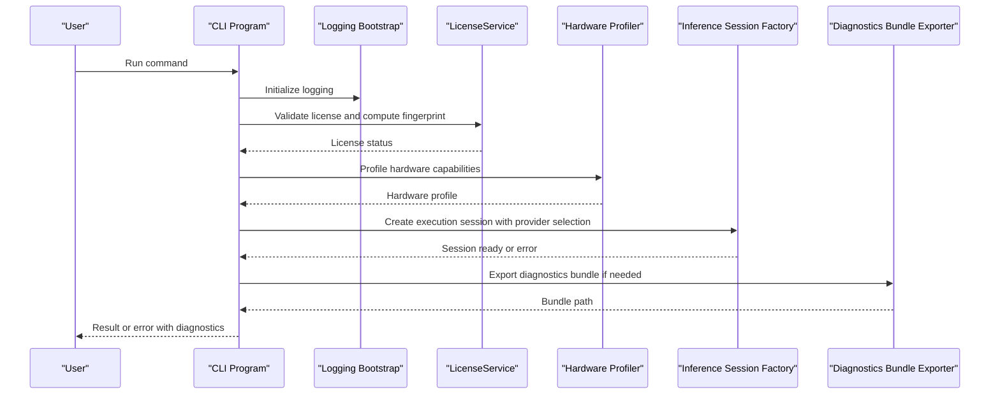
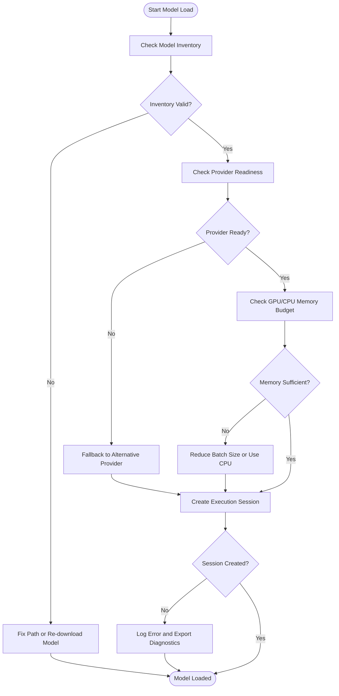
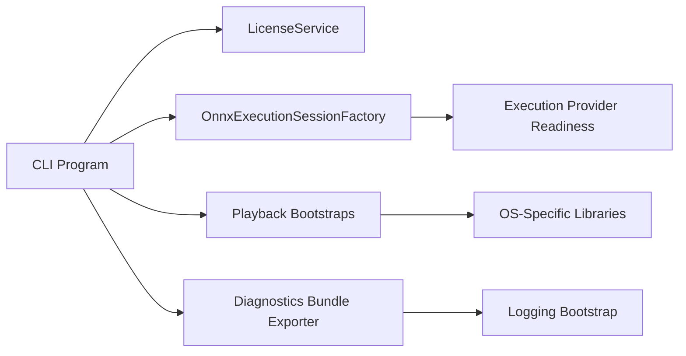

# Troubleshooting & FAQ

<cite>
**Referenced Files in This Document**
- [TROUBLESHOOTING.md](file://docs/development/TROUBLESHOOTING.md)
- [README.md](file://README.md)
- [Trackdub.Cli.csproj](file://src/Trackdub.Cli/Trackdub.Cli.csproj)
- [Program.cs](file://src/Trackdub.Cli/Program.cs)
- [CliLoggingBootstrap.cs](file://src/Trackdub.Cli/CliLoggingBootstrap.cs)
- [StderrApplicationLogger.cs](file://src/Trackdub.Cli/StderrApplicationLogger.cs)
- [Trackdub.Infrastructure.csproj](file://src/Trackdub.Infrastructure/Trackdub.Infrastructure.csproj)
- [LicenseService.cs](file://src/Trackdub.Licensing/LicenseService.cs)
- [WindowsFingerprintSource.cs](file://src/Trackdub.Licensing/WindowsFingerprintSource.cs)
- [MacOsFingerprintSource.cs](file://src/Trackdub.Licensing/MacOsFingerprintSource.cs)
- [LinuxFingerprintSource.cs](file://src/Trackdub.Licensing/LinuxFingerprintSource.cs)
- [Trackdub.Inference.Onnx.csproj](file://src/Trackdub.Inference.Onnx/Trackdub.Inference.Onnx.csproj)
- [OnnxExecutionSessionFactory.cs](file://src/Trackdub.Inference.Onnx/OnnxExecutionSessionFactory.cs)
- [TensorRtRtxRuntimeReadinessServices.cs](file://src/Trackdub.Contracts/WinMlCatalogRuntimeReadinessServices.cs)
- [LibMpvWindowsBootstrap.cs](file://src/Trackdub.Media.Playback/LibMpvWindowsBootstrap.cs)
- [LibMpvMacBootstrap.cs](file://src/Trackdub.Media.Playback/LibMpvMacBootstrap.cs)
- [LibMpvLinuxBootstrap.cs](file://src/Trackdub.Media.Playback/LibMpvLinuxBootstrap.cs)
- [media-probe-service.cs](file://src/Trackdub.Media/Probe/MediaProbeService.cs)
- [ffmpeg-health-check.cs](file://src/Trackdub.Contracts/IFfmpegHealthCheck.cs)
- [model-inventory-service.cs](file://src/Trackdub.Contracts/IModelInventoryService.cs)
- [model-download-orchestrator.cs](file://src/Trackdub.Contracts/IModelDownloadOrchestrator.cs)
- [diagnostics-bundle-exporter.cs](file://src/Trackdub.Contracts/IDiagnosticsBundleExporter.cs)
- [hardware-profiler-service.cs](file://src/Trackdub.Contracts/IHardwareProfilerService.cs)
- [gpu-memory-budget-planner-adr.md](file://docs/decisions/ADR-0009-gpu-memory-budget-planner.md)
- [windows-ml-phase-3-device-policies.md](file://docs/reference/windows-ml-phase-3-device-policies.md)
- [tensorrt-rtx-ep-abi-plugin.md](file://docs/reference/tensorrt-rtx-ep-ab i-plugin.md)
- [macos-deployment-notes.md](file://docs/operations/macos-deployment-notes.md)
- [GITHUB_ACTIONS.md](file://docs/operations/GITHUB_ACTIONS.md)
</cite>

## Table of Contents
1. Introduction
2. Project Structure
3. Core Components
4. Architecture Overview
5. Detailed Component Analysis
6. Dependency Analysis
7. Performance Considerations
8. Troubleshooting Guide
9. Conclusion
10. Appendices

## Introduction
This document provides comprehensive troubleshooting guidance for Trackdub across all components. It focuses on diagnosing and resolving model loading failures, hardware compatibility issues, performance bottlenecks, platform-specific problems (Windows, macOS, Linux), network connectivity issues, licensing errors, update failures, audio processing errors, transcription inaccuracies, synthesis artifacts, and more. It also includes diagnostic tool usage, log analysis techniques, error message interpretation, performance tuning recommendations, memory optimization tips, resource monitoring, community resources, support channels, bug reporting, known limitations, workarounds, and upcoming fixes.

## Project Structure
Trackdub is a modular .NET solution with clear separation between application logic, inference runtime, infrastructure, contracts, CLI, media handling, licensing, and diagnostics. Key areas relevant to troubleshooting include:
- CLI entry points and logging bootstrap
- Licensing subsystem with platform-specific fingerprinting
- Inference runtime selection and execution provider readiness
- Media playback bootstraps per platform
- Contracts for diagnostics, hardware profiling, model inventory, and health checks

```mermaid
graph TB
subgraph "CLI"
CLI_Program["Program.cs"]
CLI_Logging["CliLoggingBootstrap.cs"]
CLI_Stderr["StderrApplicationLogger.cs"]
end
subgraph "Licensing"
LIC_Service["LicenseService.cs"]
LIC_Win["WindowsFingerprintSource.cs"]
LIC_Mac["MacOsFingerprintSource.cs"]
LIC_Linux["LinuxFingerprintSource.cs"]
end
subgraph "Inference"
INF_Session["OnnxExecutionSessionFactory.cs"]
INF_Contracts["WinMlCatalogRuntimeReadinessServices.cs"]
end
subgraph "Media Playback"
MP_Win["LibMpvWindowsBootstrap.cs"]
MP_Mac["LibMpvMacBootstrap.cs"]
MP_Linux["LibMpvLinuxBootstrap.cs"]
end
subgraph "Contracts"
C_Diag["IDiagnosticsBundleExporter.cs"]
C_HW["IHardwareProfilerService.cs"]
C_ModelInv["IModelInventoryService.cs"]
C_ModelDL["IModelDownloadOrchestrator.cs"]
C_FFmpeg["IFfmpegHealthCheck.cs"]
end
CLI_Program --> CLI_Logging
CLI_Program --> CLI_Stderr
CLI_Program --> LIC_Service
CLI_Program --> INF_Session
CLI_Program --> MP_Win
CLI_Program --> MP_Mac
CLI_Program --> MP_Linux
INF_Session --> INF_Contracts
CLI_Program --> C_Diag
CLI_Program --> C_HW
CLI_Program --> C_ModelInv
CLI_Program --> C_ModelDL
CLI_Program --> C_FFmpeg
```

**Diagram sources**
- [Program.cs](file://src/Trackdub.Cli/Program.cs)
- [CliLoggingBootstrap.cs](file://src/Trackdub.Cli/CliLoggingBootstrap.cs)
- [StderrApplicationLogger.cs](file://src/Trackdub.Cli/StderrApplicationLogger.cs)
- [LicenseService.cs](file://src/Trackdub.Licensing/LicenseService.cs)
- [WindowsFingerprintSource.cs](file://src/Trackdub.Licensing/WindowsFingerprintSource.cs)
- [MacOsFingerprintSource.cs](file://src/Trackdub.Licensing/MacOsFingerprintSource.cs)
- [LinuxFingerprintSource.cs](file://src/Trackdub.Licensing/LinuxFingerprintSource.cs)
- [OnnxExecutionSessionFactory.cs](file://src/Trackdub.Inference.Onnx/OnnxExecutionSessionFactory.cs)
- [WinMlCatalogRuntimeReadinessServices.cs](file://src/Trackdub.Contracts/WinMlCatalogRuntimeReadinessServices.cs)
- [LibMpvWindowsBootstrap.cs](file://src/Trackdub.Media.Playback/LibMpvWindowsBootstrap.cs)
- [LibMpvMacBootstrap.cs](file://src/Trackdub.Media.Playback/LibMpvMacBootstrap.cs)
- [LibMpvLinuxBootstrap.cs](file://src/Trackdub.Media.Playback/LibMpvLinuxBootstrap.cs)
- [IDiagnosticsBundleExporter.cs](file://src/Trackdub.Contracts/IDiagnosticsBundleExporter.cs)
- [IHardwareProfilerService.cs](file://src/Trackdub.Contracts/IHardwareProfilerService.cs)
- [IModelInventoryService.cs](file://src/Trackdub.Contracts/IModelInventoryService.cs)
- [IModelDownloadOrchestrator.cs](file://src/Trackdub.Contracts/IModelDownloadOrchestrator.cs)
- [IFfmpegHealthCheck.cs](file://src/Trackdub.Contracts/IFfmpegHealthCheck.cs)

**Section sources**
- [README.md](file://README.md)
- [Trackdub.Cli.csproj](file://src/Trackdub.Cli/Trackdub.Cli.csproj)
- [Trackdub.Infrastructure.csproj](file://src/Trackdub.Infrastructure/Trackdub.Infrastructure.csproj)
- [Trackdub.Inference.Onnx.csproj](file://src/Trackdub.Inference.Onnx/Trackdub.Inference.Onnx.csproj)

## Core Components
- CLI Logging Bootstrap: Initializes structured logging and routes logs to stderr or files depending on configuration.
- Licensing Service: Validates licenses and computes platform-specific hardware fingerprints.
- Inference Session Factory: Creates ONNX execution sessions and selects appropriate execution providers based on availability.
- Media Playback Bootstraps: Platform-specific initialization for libmpv or other backends.
- Diagnostics and Profiling Contracts: Exportable diagnostics bundles, hardware profiling, model inventory, download orchestration, and FFmpeg health checks.

Key responsibilities:
- Provide robust error reporting and actionable diagnostics
- Ensure license compliance and detect platform constraints
- Select optimal inference runtime and handle provider fallbacks
- Validate media dependencies and report health status

**Section sources**
- [CliLoggingBootstrap.cs](file://src/Trackdub.Cli/CliLoggingBootstrap.cs)
- [StderrApplicationLogger.cs](file://src/Trackdub.Cli/StderrApplicationLogger.cs)
- [LicenseService.cs](file://src/Trackdub.Licensing/LicenseService.cs)
- [OnnxExecutionSessionFactory.cs](file://src/Trackdub.Inference.Onnx/OnnxExecutionSessionFactory.cs)
- [LibMpvWindowsBootstrap.cs](file://src/Trackdub.Media.Playback/LibMpvWindowsBootstrap.cs)
- [LibMpvMacBootstrap.cs](file://src/Trackdub.Media.Playback/LibMpvMacBootstrap.cs)
- [LibMpvLinuxBootstrap.cs](file://src/Trackdub.Media.Playback/LibMpvLinuxBootstrap.cs)
- [IDiagnosticsBundleExporter.cs](file://src/Trackdub.Contracts/IDiagnosticsBundleExporter.cs)
- [IHardwareProfilerService.cs](file://src/Trackdub.Contracts/IHardwareProfilerService.cs)
- [IModelInventoryService.cs](file://src/Trackdub.Contracts/IModelInventoryService.cs)
- [IModelDownloadOrchestrator.cs](file://src/Trackdub.Contracts/IModelDownloadOrchestrator.cs)
- [IFfmpegHealthCheck.cs](file://src/Trackdub.Contracts/IFfmpegHealthCheck.cs)

## Architecture Overview
The system composes CLI commands that initialize logging, validate licensing, probe hardware, select inference providers, and execute pipeline stages. Diagnostics are captured throughout the process to aid troubleshooting.

**Diagram sources**
- [Program.cs](file://src/Trackdub.Cli/Program.cs)
- [CliLoggingBootstrap.cs](file://src/Trackdub.Cli/CliLoggingBootstrap.cs)
- [LicenseService.cs](file://src/Trackdub.Licensing/LicenseService.cs)
- [IHardwareProfilerService.cs](file://src/Trackdub.Contracts/IHardwareProfilerService.cs)
- [OnnxExecutionSessionFactory.cs](file://src/Trackdub.Inference.Onnx/OnnxExecutionSessionFactory.cs)
- [IDiagnosticsBundleExporter.cs](file://src/Trackdub.Contracts/IDiagnosticsBundleExporter.cs)

## Detailed Component Analysis

### Model Loading Failures
Common causes:
- Missing or corrupted model files
- Execution provider not available or incompatible
- Insufficient GPU memory or CPU overload
- Network failure during model download
- Incorrect model paths or manifest mismatches

Resolution steps:
- Verify model inventory and integrity using model inventory service
- Check execution provider readiness and fallback behavior
- Monitor GPU memory budget planner decisions
- Retry downloads with retry/circuit breaker policies
- Validate model paths and manifests

Diagnostic tools:
- Export diagnostics bundle
- Review hardware profiler output
- Inspect inference session creation logs

**Diagram sources**
- [IModelInventoryService.cs](file://src/Trackdub.Contracts/IModelInventoryService.cs)
- [IModelDownloadOrchestrator.cs](file://src/Trackdub.Contracts/IModelDownloadOrchestrator.cs)
- [OnnxExecutionSessionFactory.cs](file://src/Trackdub.Inference.Onnx/OnnxExecutionSessionFactory.cs)
- [WinMlCatalogRuntimeReadinessServices.cs](file://src/Trackdub.Contracts/WinMlCatalogRuntimeReadinessServices.cs)
- [ADR-0009-gpu-memory-budget-planner.md](file://docs/decisions/ADR-0009-gpu-memory-budget-planner.md)

**Section sources**
- [IModelInventoryService.cs](file://src/Trackdub.Contracts/IModelInventoryService.cs)
- [IModelDownloadOrchestrator.cs](file://src/Trackdub.Contracts/IModelDownloadOrchestrator.cs)
- [OnnxExecutionSessionFactory.cs](file://src/Trackdub.Inference.Onnx/OnnxExecutionSessionFactory.cs)
- [WinMlCatalogRuntimeReadinessServices.cs](file://src/Trackdub.Contracts/WinMlCatalogRuntimeReadinessServices.cs)
- [ADR-0009-gpu-memory-budget-planner.md](file://docs/decisions/ADR-0009-gpu-memory-budget-planner.md)

### Hardware Compatibility Problems
Symptoms:
- Execution provider initialization fails
- GPU acceleration unavailable
- Audio playback backend missing native libraries

Resolution steps:
- Confirm hardware capabilities via profiler
- Install required drivers and runtime components
- Validate platform-specific playback bootstraps
- Use fallback providers when necessary

Platform specifics:
- Windows: Ensure Windows ML catalog and TensorRT RTX EP availability
- macOS: Verify libmpv bootstrap and native dependencies
- Linux: Check libmpv bootstrap and library paths

**Section sources**
- [IHardwareProfilerService.cs](file://src/Trackdub.Contracts/IHardwareProfilerService.cs)
- [WinMlCatalogRuntimeReadinessServices.cs](file://src/Trackdub.Contracts/WinMlCatalogRuntimeReadinessServices.cs)
- [LibMpvWindowsBootstrap.cs](file://src/Trackdub.Media.Playback/LibMpvWindowsBootstrap.cs)
- [LibMpvMacBootstrap.cs](file://src/Trackdub.Media.Playback/LibMpvMacBootstrap.cs)
- [LibMpvLinuxBootstrap.cs](file://src/Trackdub.Media.Playback/LibMpvLinuxBootstrap.cs)
- [windows-ml-phase-3-device-policies.md](file://docs/reference/windows-ml-phase-3-device-policies.md)
- [tensorrt-rtx-ep-abi-plugin.md](file://docs/reference/tensorrt-rtx-ep-ab i-plugin.md)

### Performance Bottlenecks
Indicators:
- High CPU utilization during inference
- GPU memory pressure causing slowdowns
- Slow model downloads or I/O latency

Optimization strategies:
- Adjust batch sizes and concurrency
- Prefer GPU execution when available
- Enable model caching and prewarming
- Monitor memory budgets and reduce workload

**Section sources**
- [ADR-0009-gpu-memory-budget-planner.md](file://docs/decisions/ADR-0009-gpu-memory-budget-planner.md)
- [IHardwareProfilerService.cs](file://src/Trackdub.Contracts/IHardwareProfilerService.cs)

### Network Connectivity Problems
Causes:
- Firewall or proxy restrictions
- Unstable internet connection
- Model repository access denied

Resolution steps:
- Configure proxy settings if applicable
- Retry downloads with exponential backoff
- Validate network reachability to model endpoints

**Section sources**
- [IModelDownloadOrchestrator.cs](file://src/Trackdub.Contracts/IModelDownloadOrchestrator.cs)

### Licensing Issues
Symptoms:
- License validation fails
- Hardware fingerprint mismatch
- Tier restrictions block features

Resolution steps:
- Verify license file validity and permissions
- Recalculate hardware fingerprint
- Ensure correct license tier for requested features

**Section sources**
- [LicenseService.cs](file://src/Trackdub.Licensing/LicenseService.cs)
- [WindowsFingerprintSource.cs](file://src/Trackdub.Licensing/WindowsFingerprintSource.cs)
- [MacOsFingerprintSource.cs](file://src/Trackdub.Licensing/MacOsFingerprintSource.cs)
- [LinuxFingerprintSource.cs](file://src/Trackdub.Licensing/LinuxFingerprintSource.cs)

### Update Failures
Causes:
- Corrupted update cache
- Network interruptions
- Permission issues writing updates

Resolution steps:
- Clear update cache and retry
- Check write permissions to update directories
- Validate update channel configuration

**Section sources**
- [GITHUB_ACTIONS.md](file://docs/operations/GITHUB_ACTIONS.md)

### Audio Processing Errors
Common issues:
- FFmpeg not found or incompatible version
- Unsupported audio formats
- Playback backend missing dependencies

Resolution steps:
- Ensure FFmpeg health check passes
- Install supported codecs and formats
- Validate playback backend bootstrap

**Section sources**
- [IFfmpegHealthCheck.cs](file://src/Trackdub.Contracts/IFfmpegHealthCheck.cs)
- [LibMpvWindowsBootstrap.cs](file://src/Trackdub.Media.Playback/LibMpvWindowsBootstrap.cs)
- [LibMpvMacBootstrap.cs](file://src/Trackdub.Media.Playback/LibMpvMacBootstrap.cs)
- [LibMpvLinuxBootstrap.cs](file://src/Trackdub.Media.Playback/LibMpvLinuxBootstrap.cs)

### Transcription Inaccuracies
Factors:
- Poor audio quality or noise
- Incorrect language model selection
- Insufficient preprocessing

Resolution steps:
- Enhance audio input (noise reduction, normalization)
- Choose appropriate ASR model variant
- Apply speech preparation guardrails

**Section sources**
- [IModelInventoryService.cs](file://src/Trackdub.Contracts/IModelInventoryService.cs)

### Synthesis Artifacts
Causes:
- TTS model misconfiguration
- Insufficient GPU memory
- Post-processing errors

Resolution steps:
- Validate TTS model parameters
- Monitor GPU memory budget
- Inspect post-processing pipeline logs

**Section sources**
- [ADR-0009-gpu-memory-budget-planner.md](file://docs/decisions/ADR-0009-gpu-memory-budget-planner.md)

## Dependency Analysis
Trackdub’s modules depend on each other through well-defined contracts. The CLI orchestrates licensing, inference, media, and diagnostics. Inference depends on execution provider readiness services. Media playback depends on platform-specific bootstraps.

**Diagram sources**
- [Program.cs](file://src/Trackdub.Cli/Program.cs)
- [LicenseService.cs](file://src/Trackdub.Licensing/LicenseService.cs)
- [OnnxExecutionSessionFactory.cs](file://src/Trackdub.Inference.Onnx/OnnxExecutionSessionFactory.cs)
- [WinMlCatalogRuntimeReadinessServices.cs](file://src/Trackdub.Contracts/WinMlCatalogRuntimeReadinessServices.cs)
- [LibMpvWindowsBootstrap.cs](file://src/Trackdub.Media.Playback/LibMpvWindowsBootstrap.cs)
- [LibMpvMacBootstrap.cs](file://src/Trackdub.Media.Playback/LibMpvMacBootstrap.cs)
- [LibMpvLinuxBootstrap.cs](file://src/Trackdub.Media.Playback/LibMpvLinuxBootstrap.cs)
- [IDiagnosticsBundleExporter.cs](file://src/Trackdub.Contracts/IDiagnosticsBundleExporter.cs)
- [CliLoggingBootstrap.cs](file://src/Trackdub.Cli/CliLoggingBootstrap.cs)

**Section sources**
- [Program.cs](file://src/Trackdub.Cli/Program.cs)
- [OnnxExecutionSessionFactory.cs](file://src/Trackdub.Inference.Onnx/OnnxExecutionSessionFactory.cs)
- [WinMlCatalogRuntimeReadinessServices.cs](file://src/Trackdub.Contracts/WinMlCatalogRuntimeReadinessServices.cs)

## Performance Considerations
- Use GPU acceleration when available; fall back to CPU if memory constrained
- Tune batch sizes and concurrency to balance throughput and latency
- Enable model caching and prewarm frequently used models
- Monitor memory budgets and adjust workload accordingly
- Profile hardware capabilities to select optimal execution providers

[No sources needed since this section provides general guidance]

## Troubleshooting Guide

### Diagnostic Tools Usage
- Export diagnostics bundle to capture logs, hardware profile, and state
- Review structured logs from CLI logging bootstrap
- Inspect hardware profiler output for device capabilities
- Validate FFmpeg health and media probe results

**Section sources**
- [IDiagnosticsBundleExporter.cs](file://src/Trackdub.Contracts/IDiagnosticsBundleExporter.cs)
- [CliLoggingBootstrap.cs](file://src/Trackdub.Cli/CliLoggingBootstrap.cs)
- [IHardwareProfilerService.cs](file://src/Trackdub.Contracts/IHardwareProfilerService.cs)
- [IFfmpegHealthCheck.cs](file://src/Trackdub.Contracts/IFfmpegHealthCheck.cs)

### Log Analysis Techniques
- Filter logs by severity and component
- Correlate timestamps across licensing, inference, and media events
- Identify repeated error patterns indicating systemic issues
- Use diagnostics bundle for offline analysis

**Section sources**
- [StderrApplicationLogger.cs](file://src/Trackdub.Cli/StderrApplicationLogger.cs)
- [CliLoggingBootstrap.cs](file://src/Trackdub.Cli/CliLoggingBootstrap.cs)

### Error Message Interpretation
- Licensing errors often indicate invalid tokens or fingerprint mismatches
- Inference errors may point to provider unavailability or memory limits
- Media errors typically reference missing dependencies or unsupported formats

**Section sources**
- [LicenseService.cs](file://src/Trackdub.Licensing/LicenseService.cs)
- [OnnxExecutionSessionFactory.cs](file://src/Trackdub.Inference.Onnx/OnnxExecutionSessionFactory.cs)
- [IFfmpegHealthCheck.cs](file://src/Trackdub.Contracts/IFfmpegHealthCheck.cs)

### Platform-Specific Issues

#### Windows
- Ensure Windows ML catalog and TensorRT RTX EP are installed
- Validate playback native dependencies
- Check device policies for execution provider selection

**Section sources**
- [windows-ml-phase-3-device-policies.md](file://docs/reference/windows-ml-phase-3-device-policies.md)
- [tensorrt-rtx-ep-abi-plugin.md](file://docs/reference/tensorrt-rtx-ep-ab i-plugin.md)
- [LibMpvWindowsBootstrap.cs](file://src/Trackdub.Media.Playback/LibMpvWindowsBootstrap.cs)

#### macOS
- Verify libmpv bootstrap and native library paths
- Confirm deployment notes for macOS-specific requirements

**Section sources**
- [macos-deployment-notes.md](file://docs/operations/macos-deployment-notes.md)
- [LibMpvMacBootstrap.cs](file://src/Trackdub.Media.Playback/LibMpvMacBootstrap.cs)

#### Linux
- Check libmpv bootstrap and shared library availability
- Ensure proper permissions for model and cache directories

**Section sources**
- [LibMpvLinuxBootstrap.cs](file://src/Trackdub.Media.Playback/LibMpvLinuxBootstrap.cs)

### Step-by-Step Resolution Guides

#### Audio Processing Errors
1. Run FFmpeg health check and verify version compatibility
2. Confirm media probe detects input format correctly
3. Validate playback backend bootstrap success
4. Reinstall missing codecs or dependencies

**Section sources**
- [IFfmpegHealthCheck.cs](file://src/Trackdub.Contracts/IFfmpegHealthCheck.cs)
- [MediaProbeService.cs](file://src/Trackdub.Media/Probe/MediaProbeService.cs)
- [LibMpvWindowsBootstrap.cs](file://src/Trackdub.Media.Playback/LibMpvWindowsBootstrap.cs)
- [LibMpvMacBootstrap.cs](file://src/Trackdub.Media.Playback/LibMpvMacBootstrap.cs)
- [LibMpvLinuxBootstrap.cs](file://src/Trackdub.Media.Playback/LibMpvLinuxBootstrap.cs)

#### Transcription Inaccuracies
1. Assess audio quality and apply preprocessing enhancements
2. Select appropriate ASR model variant for language and domain
3. Review speech preparation guardrails and parameters
4. Validate model inventory and cache integrity

**Section sources**
- [IModelInventoryService.cs](file://src/Trackdub.Contracts/IModelInventoryService.cs)

#### Synthesis Artifacts
1. Check TTS model configuration and parameters
2. Monitor GPU memory budget and reduce workload if needed
3. Inspect post-processing pipeline logs for errors
4. Validate execution provider stability

**Section sources**
- [ADR-0009-gpu-memory-budget-planner.md](file://docs/decisions/ADR-0009-gpu-memory-budget-planner.md)
- [OnnxExecutionSessionFactory.cs](file://src/Trackdub.Inference.Onnx/OnnxExecutionSessionFactory.cs)

### Performance Tuning Recommendations
- Prefer GPU execution when memory allows
- Reduce batch size to avoid OOM conditions
- Enable model caching and prewarming
- Profile hardware and adjust concurrency accordingly

**Section sources**
- [ADR-0009-gpu-memory-budget-planner.md](file://docs/decisions/ADR-0009-gpu-memory-budget-planner.md)
- [IHardwareProfilerService.cs](file://src/Trackdub.Contracts/IHardwareProfilerService.cs)

### Memory Optimization Tips
- Monitor GPU memory usage and adjust batch sizes
- Use smaller model variants when possible
- Clear caches periodically to free memory
- Avoid concurrent heavy operations

**Section sources**
- [ADR-0009-gpu-memory-budget-planner.md](file://docs/decisions/ADR-0009-gpu-memory-budget-planner.md)

### Resource Usage Monitoring
- Use hardware profiler to track CPU/GPU utilization
- Export diagnostics bundles for detailed analysis
- Review logs for resource contention indicators

**Section sources**
- [IHardwareProfilerService.cs](file://src/Trackdub.Contracts/IHardwareProfilerService.cs)
- [IDiagnosticsBundleExporter.cs](file://src/Trackdub.Contracts/IDiagnosticsBundleExporter.cs)

### Community Resources and Support Channels
- Refer to development troubleshooting guide for additional tips
- Consult operations documentation for deployment notes
- Engage with community channels for peer support

**Section sources**
- [TROUBLESHOOTING.md](file://docs/development/TROUBLESHOOTING.md)
- [macos-deployment-notes.md](file://docs/operations/macos-deployment-notes.md)

### Reporting Bugs Effectively
- Include diagnostics bundle with bug reports
- Provide hardware profile and environment details
- Reproduce steps and expected vs actual outcomes

**Section sources**
- [IDiagnosticsBundleExporter.cs](file://src/Trackdub.Contracts/IDiagnosticsBundleExporter.cs)
- [IHardwareProfilerService.cs](file://src/Trackdub.Contracts/IHardwareProfilerService.cs)

### Known Limitations and Workarounds
- Some execution providers may not be available on all platforms
- Large models may require significant GPU memory
- Certain audio formats may need external codecs

Workarounds:
- Use CPU fallback for unsupported providers
- Split large tasks into smaller batches
- Convert audio to supported formats before processing

**Section sources**
- [WinMlCatalogRuntimeReadinessServices.cs](file://src/Trackdub.Contracts/WinMlCatalogRuntimeReadinessServices.cs)
- [ADR-0009-gpu-memory-budget-planner.md](file://docs/decisions/ADR-0009-gpu-memory-budget-planner.md)

### Upcoming Fixes
- Improved execution provider detection and fallback
- Enhanced diagnostics bundle content
- Better memory budget planning and reporting

[No sources needed since this section summarizes future improvements]

## Conclusion
This troubleshooting guide consolidates common issues and their resolutions across Trackdub’s components. By leveraging diagnostic tools, analyzing logs, and following platform-specific guidance, users can effectively resolve model loading failures, hardware compatibility problems, performance bottlenecks, and more. Continuous monitoring and tuning will help maintain optimal performance and reliability.

[No sources needed since this section summarizes without analyzing specific files]

## Appendices

### Quick Reference: Common Commands and Tools
- Export diagnostics bundle for offline analysis
- Run FFmpeg health check to validate media dependencies
- Profile hardware to identify optimal execution providers
- Validate model inventory and cache integrity

**Section sources**
- [IDiagnosticsBundleExporter.cs](file://src/Trackdub.Contracts/IDiagnosticsBundleExporter.cs)
- [IFfmpegHealthCheck.cs](file://src/Trackdub.Contracts/IFfmpegHealthCheck.cs)
- [IHardwareProfilerService.cs](file://src/Trackdub.Contracts/IHardwareProfilerService.cs)
- [IModelInventoryService.cs](file://src/Trackdub.Contracts/IModelInventoryService.cs)