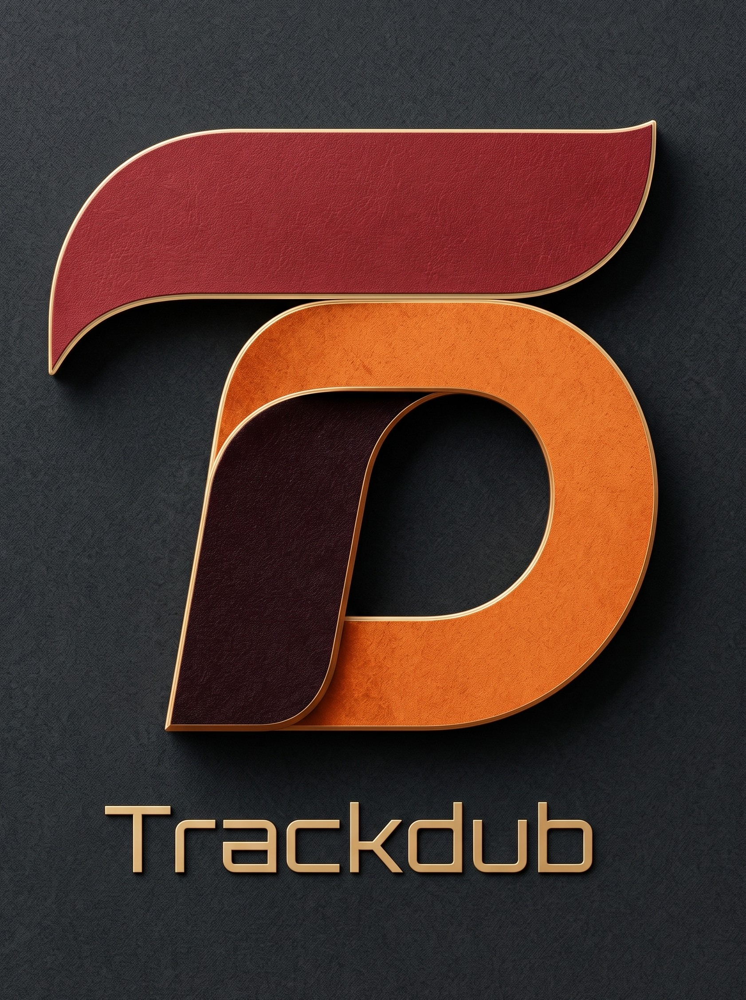

<p align="center">
  
</p>

<h1 align="center">Trackdub</h1>

<p align="center">
  <strong>A local-first, editorial-grade AI dubbing workstation for Windows, macOS, and Linux.</strong>
</p>

<p align="center">
  <a href="https://github.com/Trackdubllc/Trackdub/actions">CI</a>
  &middot; <a href="docs/index.md">Docs</a>
  &middot; <a href="investor-deck-brief.md">Investor Brief</a>
  &middot; <a href="LICENSE">Apache-2.0 License</a>
</p>

---

Trackdub is a cross-platform desktop application and reusable inference engine that
automates the full speech dubbing pipeline: language detection, speech recognition
(ASR), translation, text-to-speech (TTS), timing reconciliation, and audio export.

The product philosophy is simple: **a reliable workstation where every pipeline stage
produces durable artifacts, users can inspect and edit intermediate results, and the
UI tells the truth about what the model actually did.**

This repository is the **public core** of Trackdub: the engine, SDK, CLI, pipeline,
inference runtime, media processing, licensing mechanisms, tooling, and tests. The
proprietary desktop product lives in a separate private repository.

## Why Trackdub

AI dubbing today is either a black-box cloud service that ships raw media off-device
with limited editability, or a fragmented collection of Python scripts and Conda
environments that require technical expertise to assemble. Neither is suitable for
professional editorial workflows.

Trackdub is built for the gap between them: a **local-first, stage-aware, editable**
dubbing workstation that keeps content on the user's machine and routes to cloud
providers only with explicit consent and disclosure.

### Key differentiators

- **Local-first by default.** Media and inference run on the user's hardware. Cloud
  lanes exist but are gated by explicit consent; nothing leaves the machine silently.
- **Stage-aware workflow.** Each stage has defined inputs, outputs, status, warnings,
  and artifacts. Projects are resumable and inspectable. Completed stages are never
  recomputed; failed or skipped stages leave prior artifacts in place with explicit
  reasons.
- **Honest readiness states.** Provider registered, model downloaded, stage ran, and
  stage succeeded are tracked as distinct states. The UI never claims "GPU ready"
  when only a DLL is present.
- **Model governance by design.** Only ONNX models with verified commercial licenses
  are used. Unknown or non-commercial licenses are treated as unsafe and blocked. The
  bundled manifest is the single source of truth for model inventory.
- **Hardware-aware inference.** The runtime probes and falls back across TensorRT-RTX,
  DirectML, Windows ML, MIGraphX, and CPU. Unsupported acceleration never blocks a
  workflow; the app explains the fallback.
- **Cross-platform desktop shell.** Avalonia on .NET 10, with Windows, macOS, and
  Linux as first-class targets. No browser shell, no one-click SaaS demo.
- **Engineering discipline.** Clean layered architecture (Domain depends on nothing),
  architecture tests that enforce dependency direction, fake-backed application tests,
  and immutable execution snapshots for pipeline stages.

## Pipeline

```
media ingest
  -> audio preparation
  -> optional speech/noise split or dialogue/stem separation
  -> VAD
  -> diarization
  -> ASR
  -> transcript confidence review
  -> translation
  -> glossary / terminology hints
  -> speaker and voice assignment
  -> TTS
  -> timing reconciliation
  -> optional audio-level lip alignment
  -> preview mix
  -> export
  -> optional visual dubbing / generated portrait branches
```

## Status

The foundation (M0-M7) and the workstation spine (M8-M16) are mostly implemented in
this repository: repo structure, model manifest policy, SQLite project spine, media
ingest, runtime planning, transcript generation, translation, video playback, segment
editing, diarization, transcript confidence, Kokoro TTS, timing reconciliation,
Spleeter separation, preview mix, voice cloning, export, and hardware acceleration.

Advanced lanes (M17+) are tracked but not claimed as shipped: managed glossary
analyzers, Japanese/Chinese/Arabic tokenization, visual dubbing, and generated
portrait branches. The current source is the source of truth for what is actually
implemented.

## Commercial model

Trackdub operates an **open-core** model:

- **Public core** (this repo, Apache-2.0): the reusable engine, SDK, CLI, pipeline,
  inference, media, licensing mechanisms, tooling, and tests.
- **Private product** (`Trackdub-gated`): the proprietary desktop product with the
  Avalonia shell, branding, installer, signing, activation, and tier gating.
- **Future private services**: `api.trackdub`, `portal.trackdub`, and `trackdub.com`
  are reserved for server-side activation, product API, portal, and marketing site.
- **Contributor licensing**: a contributor license agreement lets Trackdub LLC
  relicense contributions under commercial terms.

This split enables developer adoption through the public core while the commercial
product carries tiered features, activation, and support.

## Components

| Project | Description |
|---------|-------------|
| `Trackdub.Domain` | Pure domain models and value objects |
| `Trackdub.Contracts` | Shared interfaces and DTOs |
| `Trackdub.Application` | Use cases, orchestration, pipeline stages |
| `Trackdub.Infrastructure` | Persistence (SQLite), file I/O, integrations |
| `Trackdub.Media` | Audio/video processing (FFmpeg) |
| `Trackdub.Media.Playback` | libmpv/LibVLC playback surface |
| `Trackdub.Inference` | Model abstractions and pipeline stage contracts |
| `Trackdub.Inference.Onnx` | ONNX Runtime session management and EP registration |
| `Trackdub.Composition` | DI wiring root |
| `Trackdub.Sdk` | Programmatic session API for integrations |
| `Trackdub.Cli` | Headless CLI entry point |
| `Trackdub.Licensing` | Neutral license validation mechanisms |
| `Trackdub.Benchmarks` | Performance benchmarks |
| `Trackdub.Tools` | Development utilities |
| `Trackdub.Analyzers` | Roslyn analyzers |
| `Trackdub.DubBench` | Benchmark harness and Avalonia sidecar launcher |
| `Trackdub.OnnxRuntime.Dnnl.Native` | Native oneDNN/DNNL execution provider for ONNX Runtime |

## Requirements

- .NET 10 SDK (10.0.300+)
- FFmpeg (for audio/video processing)
- libmpv or LibVLC (for playback)

## Build

```bash
dotnet build Trackdub.slnx -m:1
```

## Test

```bash
dotnet test Trackdub.slnx -m:1
```

Tests that require ONNX models or specific fixtures skip cleanly when dependencies
are unavailable.

## CLI

```bash
dotnet run --project src/Trackdub.Cli -- --help
dotnet run --project src/Trackdub.Cli -- dub --media input.mp4 --target-language es
dotnet run --project src/Trackdub.Cli -- doctor
```

## Solution Filters

- `Trackdub.Inference.slnx` — Inference, Composition, benchmarks, and tests
- `Trackdub.Sdk.slnx` — SDK, CLI, and SDK tests

## Architecture

Strict layered dependency direction. Domain depends on nothing:

```
Application -> Contracts, Domain, Licensing
Infrastructure -> Application, Contracts, Domain
Media -> Application, Analyzers, Contracts, Domain
Media.Playback -> Application, Domain
Inference -> Contracts, Domain
Inference.Onnx -> Inference, Contracts, Domain
Composition -> Application, Inference, Inference.Onnx, Infrastructure, Licensing, Media, Media.Playback
Sdk -> Application, Composition, Licensing
Cli -> Sdk
DubBench -> Benchmarks, Domain, Inference, Inference.Onnx
Benchmarks -> Application, Composition, Domain, Inference, Inference.Onnx, Infrastructure
Tools -> Application, Domain, Infrastructure, Media
Contracts -> Domain
Licensing -> (nothing)
Analyzers -> (nothing)
OnnxRuntime.Dnnl.Native -> (nothing)
Domain -> (nothing)
```

## Trust and operations

- CI builds and tests run on **Windows, macOS, and Linux**.
- **CodeQL** and **Dependabot** are configured; security audit documents are
  maintained under `docs/audits/`.
- Model manifests are **validated in CI** for schema, SHA-256 alignment, and
  commercial license gating.
- No secrets, customer data, pricing policy, or activation server code lives in the
  public core.
- `dotnet format Trackdub.slnx --verify-no-changes` is the lint/format gate.

## Model Governance

Only ONNX models with verified commercial licenses are supported. The bundled model
manifest (`src/Trackdub.Inference/Runtime/ModelManifest/bundled-models.manifest.json`)
is the single source of truth for model inventory.

## Documentation

See [docs/index.md](docs/index.md) for the categorized documentation index (ADRs,
architecture, specs, audits, operations, and more). Governance and contribution
guidelines are in [docs/repository-policy.md](docs/repository-policy.md). For the
investor-facing narrative, see [investor-deck-brief.md](investor-deck-brief.md).

## License

Apache-2.0. See [LICENSE](LICENSE) and [NOTICE](NOTICE).
