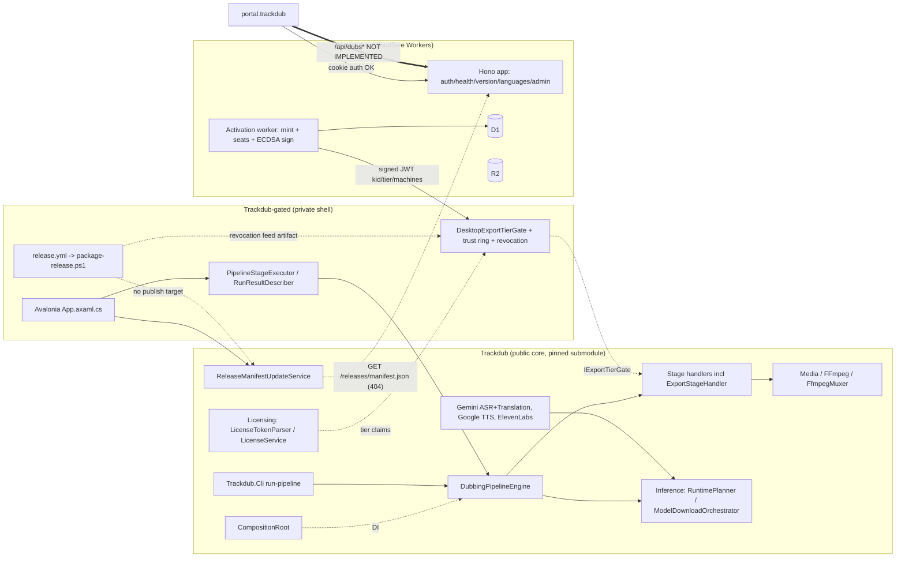

# System Map

[← Back to index](README.md)

## Repository responsibilities

| Repo | Owns | Does NOT own | Primary entrypoint | Persisted state |
|---|---|---|---|---|
| `Trackdub` (core, Apache-2.0) | Pipeline engine, stages, Domain/Application/Contracts, Inference + ONNX EP planning, Media, Composition DI root, Licensing validation primitives, SDK, CLI, update-check client | Desktop shell, private trust ring, hosted API | `src/Trackdub.Cli` (`Program.cs`, `Handlers/RunPipelineHandler.cs`); `src/Trackdub.Composition/CompositionRoot.cs` | Project session SQLite, artifact store, model cache + integrity records, `bundled-models.manifest.json` |
| `Trackdub-gated` (private) | Avalonia shell, per-stage run UX, consent, export/mix UI, `DesktopExportTierGate`, private trust ring + revocation, production bootstrap, release packaging | Any inference code, engine semantics, headless command parsing | `src/Trackdub.App.Avalonia/App.axaml.cs:119-165` | Same as core (via submodule); `trackdub.trust.json`, revocation feed JSON, `ProjectUiSettings` in manifest |
| `api.trackdub` (Workers) | Better Auth sessions, admin invite, activation JWT minting/seat management (D1), activation + staging Workers, languages | Dubbing jobs, `dubs` tables, `/api/dubs*`, release manifest serving, R2 artifact delivery in code | `src/index.ts` (API), activation worker entry | D1 (auth + activation seats), R2 (configured), D1 migrations under `drizzle/`, `drizzle-activation/` |
| `portal.trackdub` | React/TanStack dashboard, auth UX, hosted-job UI, language picker | Its own backend | `src/lib/config.ts`, `src/features/jobs/*` | None server-side; query cache only |

Boundaries that look real but aren't: the portal's `schema.d.ts` is a contract **assertion**, not evidence of a server; `health.ts:40-57` advertising `availablePipelines: ["auth"]` is an honest admission that only auth exists, but nothing consumes it as a gate.

## Cross-repo contract map

| Producer | Contract | Consumer | Status |
|---|---|---|---|
| core `DubbingRunResult` | status + `StageOutcome[]` + `ReasonCode` | gated `PipelineRunResultDescriber` | **Aligned** (distinct skip/fail/partial mapping, `null` on success) |
| core `DubbingRunResult` | `OverallStatus` | CLI `RunPipelineHandler` exit code | **Broken** (PartialSuccess → 0) |
| gated `DesktopExportTierGate` : core `IExportTierGate` | 5-min Free cap, watermark | `ExportStageHandler.cs:83`, `:401` → `FfmpegMuxer.cs:84,187,199` | **Aligned**; core registers no gate (headless unlimited by design) |
| gated trust ring ↔ `api.trackdub` activation claims | `kid`, `tier`, `machines`, `iss`, `aud`, `exp` | `DesktopLicenseSignatureTrustStore`, `LicenseTokenParser` | **Partial** — `kid`/`exp`/revocation verified; `iss`/`aud` **dropped**; `tier` only `"pro"` recognized vs `z.string().min(1).max(50)` minted |
| core `ReleaseManifestUpdateService.cs:12` | `https://api.trackdub.com/releases/manifest.json` | — | **Missing producer**; API has no such route; gated CI only uploads artifacts (`release.yml:39-83`) |
| portal `schema.d.ts` `/api/dubs*` | job create/upload/list/detail/download | `api.trackdub/src/index.ts` | **Missing producer** |
| portal `auth-service.ts` `/api/auth/forget-password` | password reset | better-auth `/request-password-reset` | **Path mismatch** |
| portal `useLanguages.ts:21-34` fallback incl. `zh` | language set | `api.trackdub/src/lib/languages.ts` (no Chinese) | **Value drift** |
| portal `features/jobs/*` `VITE_API_BASE_URL ?? ""` vs `lib/config.ts ?? "https://api.trackdub.com"` | API origin | same backend | **Origin split** |
| core `StageNames` / `DubbingPipelineStages` | stage keys | gated `BuildEngineStageFilter`, `ResolveCandidateStageNames` | **Aligned** |

## Topology

